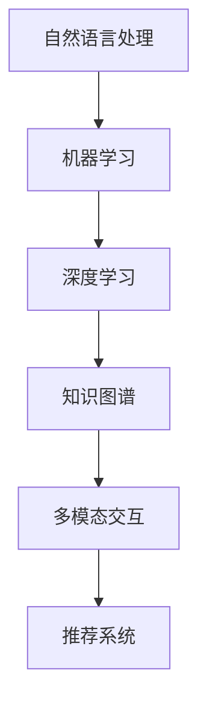

                 

## 1. 背景介绍

### 1.1 问题由来
随着人工智能技术的迅猛发展，AI助手在各行各业中得到了广泛应用，极大地提升了工作效率和用户体验。例如，Apple的Siri、Google Assistant、Amazon的Alexa等，已经成为用户日常生活中不可或缺的智能伴侣。然而，这些商业化AI助手往往定制化程度低，功能通用性较强，难以满足个性化和专业化的需求。

在这样的背景下，开发一个可以针对特定领域和特定需求的个性化AI助手，显得尤为重要。例如，对于一位自媒体工作者，一个具备写作辅助、时间管理、市场分析等多功能的智能助手，可以显著提升其创作效率和市场竞争力。因此，本文旨在探讨如何开发一个可以提供智能化服务的个人品牌AI助手。

### 1.2 问题核心关键点
本文将聚焦于如何构建一个具备以下几大核心功能的AI助手：

1. **写作辅助**：根据用户提供的写作提纲或草稿，自动生成高质量的文章初稿，并进行多轮迭代优化。
2. **时间管理**：帮助用户管理日程安排、提醒任务、分析工作模式，提供高效的时间管理方案。
3. **市场分析**：基于用户提供的市场数据和关键词，分析行业趋势、竞争对手情况，并给出决策建议。
4. **智能问答**：提供即时的问答服务，帮助用户解答业务和生活中的各种问题，辅助决策。
5. **多模态交互**：支持语音识别、图像识别等自然语言处理和视觉处理技术，提供多模态交互体验。

## 2. 核心概念与联系

### 2.1 核心概念概述

为更好地理解开发个性化AI助手的方法，本节将介绍几个密切相关的核心概念：

- **自然语言处理（NLP）**：涉及文本处理、语义理解、语音识别等技术，是AI助手实现语言理解和生成的关键技术。
- **机器学习（ML）**：通过学习用户行为和偏好，构建个性化模型，提供定制化服务。
- **深度学习（DL）**：利用神经网络构建复杂模型，提升AI助手的智能化水平。
- **知识图谱（KG）**：通过结构化的知识库，提供上下文信息，增强AI助手的推理能力。
- **多模态交互（MMI）**：结合语音、图像、文本等多种信息，提升用户体验和交互效果。
- **推荐系统（RS）**：基于用户历史行为，推荐相关内容，提升个性化服务的效果。

这些核心概念之间的逻辑关系可以通过以下Mermaid流程图来展示：



这个流程图展示了几大核心概念及其之间的关系：

1. 自然语言处理是AI助手的输入和输出技术，机器学习和深度学习用于构建和优化模型。
2. 知识图谱提供上下文信息，增强模型的推理能力。
3. 多模态交互提升用户体验和交互效果。
4. 推荐系统提供个性化服务，进一步提升用户满意度。

## 3. 核心算法原理 & 具体操作步骤

### 3.1 算法原理概述

开发个性化AI助手，本质上是一个多模态深度学习模型的构建和优化过程。其核心思想是：收集用户的行为数据和反馈信息，构建用户画像，并基于用户画像训练个性化模型，为用户提供定制化的服务。

形式化地，假设用户画像为 $P$，AI助手模型为 $M$，则AI助手的功能可以表示为：

$$
F = M(P)
$$

其中 $F$ 表示AI助手的服务效果，包括写作辅助、时间管理、市场分析、智能问答、多模态交互等。通过收集用户行为数据和反馈信息，不断更新用户画像 $P$，并相应调整模型 $M$，以达到最优的服务效果。

### 3.2 算法步骤详解

基于上述原理，开发个性化AI助手一般包括以下几个关键步骤：

**Step 1: 数据收集与预处理**
- 收集用户的历史数据，包括行为数据（如浏览记录、点击记录）、交互数据（如聊天内容、语音指令）、反馈数据（如满意度评分）等。
- 对数据进行清洗、标注和特征提取，构建用户画像 $P$。

**Step 2: 模型训练与优化**
- 选择合适的深度学习模型，如RNN、Transformer、BERT等，根据用户画像 $P$ 进行训练。
- 应用超参数优化技术，如网格搜索、随机搜索、贝叶斯优化等，调整模型参数，提升模型性能。
- 在模型训练过程中，应用对抗训练、数据增强等技术，增强模型的鲁棒性和泛化能力。

**Step 3: 功能实现与集成**
- 根据具体需求，开发AI助手的各个功能模块，包括写作辅助、时间管理、市场分析、智能问答、多模态交互等。
- 集成各功能模块，构建完整的AI助手系统。
- 在实际使用中，通过不断收集用户反馈，优化用户画像和模型，持续提升服务效果。

### 3.3 算法优缺点

个性化AI助手开发具有以下优点：

1. **定制化服务**：根据用户的具体需求和偏好，提供量身定制的服务，提升用户满意度。
2. **数据驱动**：通过收集用户数据，不断优化模型和用户画像，提升服务效果。
3. **多模态交互**：结合语音、图像、文本等多种信息，提升用户体验和交互效果。
4. **智能推荐**：基于用户历史行为，推荐相关内容，进一步提升个性化服务的效果。

然而，也存在一定的局限性：

1. **隐私保护**：收集用户数据时需注意隐私保护，避免泄露敏感信息。
2. **数据偏差**：用户数据可能存在偏差，影响模型的泛化能力。
3. **模型复杂度**：深度学习模型复杂度高，训练和推理资源消耗大。
4. **交互障碍**：多模态交互需考虑多种设备的兼容性和稳定性。
5. **上下文理解**：构建多模态交互模型时，需解决上下文理解问题，提升对话质量。

尽管存在这些局限性，但就目前而言，个性化AI助手开发已成为AI技术应用的重要方向。未来相关研究的重点在于如何进一步降低模型复杂度，提升交互质量和隐私保护，同时兼顾模型的泛化能力和用户体验。

### 3.4 算法应用领域

个性化AI助手已经在诸多领域得到了广泛应用，例如：

- **内容创作**：智能写作助手，帮助自媒体工作者生成高质量文章，提升创作效率。
- **时间管理**：智能日历助手，帮助用户管理日程安排、提醒任务，提升工作效率。
- **市场分析**：智能市场助手，基于用户提供的数据，分析行业趋势、竞争对手情况，提供决策建议。
- **智能问答**：智能客服助手，提供即时的问答服务，辅助决策。
- **多模态交互**：智能助理机器人，结合语音识别、图像识别等技术，提供多模态交互体验。

除了上述这些经典应用外，个性化AI助手还被创新性地应用到更多场景中，如个性化推荐、智能健康助手、智能家居等，为各行各业带来新的变革和创新。

## 4. 数学模型和公式 & 详细讲解 & 举例说明

### 4.1 数学模型构建

本节将使用数学语言对开发个性化AI助手的过程进行更加严格的刻画。

假设用户画像为 $P = (x_1, x_2, ..., x_n)$，其中 $x_i$ 表示用户在第 $i$ 个维度的特征值。AI助手模型为 $M_{\theta}:\mathbb{R}^n \rightarrow \mathbb{R}^m$，其中 $m$ 表示AI助手的功能维度，$\theta$ 为模型参数。假设AI助手的功能效果为 $F = (f_1, f_2, ..., f_m)$，则AI助手的功能效果可以通过模型参数 $\theta$ 来表示：

$$
F = M_{\theta}(P)
$$

在实践中，我们通常使用基于梯度的优化算法（如SGD、Adam等）来近似求解上述最优化问题。设 $\eta$ 为学习率，$\lambda$ 为正则化系数，则参数的更新公式为：

$$
\theta \leftarrow \theta - \eta \nabla_{\theta}\mathcal{L}(\theta) - \eta\lambda\theta
$$

其中 $\nabla_{\theta}\mathcal{L}(\theta)$ 为损失函数对参数 $\theta$ 的梯度，可通过反向传播算法高效计算。

### 4.2 公式推导过程

以下我们以智能写作助手为例，推导深度学习模型的训练公式及其梯度的计算公式。

假设模型 $M_{\theta}$ 在输入 $x$ 上的输出为 $\hat{y}=M_{\theta}(x) \in [0,1]$，表示样本属于正类的概率。真实标签 $y \in \{0,1\}$。则二分类交叉熵损失函数定义为：

$$
\ell(M_{\theta}(x),y) = -[y\log \hat{y} + (1-y)\log (1-\hat{y})]
$$

将其代入经验风险公式，得：

$$
\mathcal{L}(\theta) = -\frac{1}{N}\sum_{i=1}^N [y_i\log M_{\theta}(x_i)+(1-y_i)\log(1-M_{\theta}(x_i))]
$$

根据链式法则，损失函数对参数 $\theta_k$ 的梯度为：

$$
\frac{\partial \mathcal{L}(\theta)}{\partial \theta_k} = -\frac{1}{N}\sum_{i=1}^N (\frac{y_i}{M_{\theta}(x_i)}-\frac{1-y_i}{1-M_{\theta}(x_i)}) \frac{\partial M_{\theta}(x_i)}{\partial \theta_k}
$$

其中 $\frac{\partial M_{\theta}(x_i)}{\partial \theta_k}$ 可进一步递归展开，利用自动微分技术完成计算。

在得到损失函数的梯度后，即可带入参数更新公式，完成模型的迭代优化。重复上述过程直至收敛，最终得到适应用户需求的最优模型参数 $\theta^*$。

## 5. 项目实践：代码实例和详细解释说明

### 5.1 开发环境搭建

在进行AI助手开发前，我们需要准备好开发环境。以下是使用Python进行PyTorch开发的环境配置流程：

1. 安装Anaconda：从官网下载并安装Anaconda，用于创建独立的Python环境。

2. 创建并激活虚拟环境：
```bash
conda create -n ai_assistant python=3.8 
conda activate ai_assistant
```

3. 安装PyTorch：根据CUDA版本，从官网获取对应的安装命令。例如：
```bash
conda install pytorch torchvision torchaudio cudatoolkit=11.1 -c pytorch -c conda-forge
```

4. 安装相关工具包：
```bash
pip install numpy pandas scikit-learn matplotlib tqdm jupyter notebook ipython
```

完成上述步骤后，即可在`ai_assistant`环境中开始AI助手开发。

### 5.2 源代码详细实现

下面我们以智能写作助手为例，给出使用Transformers库对BERT模型进行训练的PyTorch代码实现。

首先，定义写作辅助任务的数据处理函数：

```python
from transformers import BertTokenizer
from torch.utils.data import Dataset
import torch

class WritingDataset(Dataset):
    def __init__(self, texts, labels, tokenizer, max_len=128):
        self.texts = texts
        self.labels = labels
        self.tokenizer = tokenizer
        self.max_len = max_len
        
    def __len__(self):
        return len(self.texts)
    
    def __getitem__(self, item):
        text = self.texts[item]
        label = self.labels[item]
        
        encoding = self.tokenizer(text, return_tensors='pt', max_length=self.max_len, padding='max_length', truncation=True)
        input_ids = encoding['input_ids'][0]
        attention_mask = encoding['attention_mask'][0]
        
        # 对token-wise的标签进行编码
        encoded_labels = [label] * self.max_len
        labels = torch.tensor(encoded_labels, dtype=torch.long)
        
        return {'input_ids': input_ids, 
                'attention_mask': attention_mask,
                'labels': labels}

# 标签与id的映射
label2id = {0: 0, 1: 1}
id2label = {v: k for k, v in label2id.items()}

# 创建dataset
tokenizer = BertTokenizer.from_pretrained('bert-base-cased')

train_dataset = WritingDataset(train_texts, train_labels, tokenizer)
dev_dataset = WritingDataset(dev_texts, dev_labels, tokenizer)
test_dataset = WritingDataset(test_texts, test_labels, tokenizer)
```

然后，定义模型和优化器：

```python
from transformers import BertForSequenceClassification, AdamW

model = BertForSequenceClassification.from_pretrained('bert-base-cased', num_labels=len(label2id))

optimizer = AdamW(model.parameters(), lr=2e-5)
```

接着，定义训练和评估函数：

```python
from torch.utils.data import DataLoader
from tqdm import tqdm
from sklearn.metrics import classification_report

device = torch.device('cuda') if torch.cuda.is_available() else torch.device('cpu')
model.to(device)

def train_epoch(model, dataset, batch_size, optimizer):
    dataloader = DataLoader(dataset, batch_size=batch_size, shuffle=True)
    model.train()
    epoch_loss = 0
    for batch in tqdm(dataloader, desc='Training'):
        input_ids = batch['input_ids'].to(device)
        attention_mask = batch['attention_mask'].to(device)
        labels = batch['labels'].to(device)
        model.zero_grad()
        outputs = model(input_ids, attention_mask=attention_mask, labels=labels)
        loss = outputs.loss
        epoch_loss += loss.item()
        loss.backward()
        optimizer.step()
    return epoch_loss / len(dataloader)

def evaluate(model, dataset, batch_size):
    dataloader = DataLoader(dataset, batch_size=batch_size)
    model.eval()
    preds, labels = [], []
    with torch.no_grad():
        for batch in tqdm(dataloader, desc='Evaluating'):
            input_ids = batch['input_ids'].to(device)
            attention_mask = batch['attention_mask'].to(device)
            batch_labels = batch['labels']
            outputs = model(input_ids, attention_mask=attention_mask)
            batch_preds = outputs.logits.argmax(dim=2).to('cpu').tolist()
            batch_labels = batch_labels.to('cpu').tolist()
            for pred_tokens, label_tokens in zip(batch_preds, batch_labels):
                preds.append(pred_tokens[:len(label_tokens)])
                labels.append(label_tokens)
                
    print(classification_report(labels, preds))
```

最后，启动训练流程并在测试集上评估：

```python
epochs = 5
batch_size = 16

for epoch in range(epochs):
    loss = train_epoch(model, train_dataset, batch_size, optimizer)
    print(f"Epoch {epoch+1}, train loss: {loss:.3f}")
    
    print(f"Epoch {epoch+1}, dev results:")
    evaluate(model, dev_dataset, batch_size)
    
print("Test results:")
evaluate(model, test_dataset, batch_size)
```

以上就是使用PyTorch对BERT进行智能写作助手开发的全过程。可以看到，得益于Transformers库的强大封装，我们可以用相对简洁的代码完成BERT模型的加载和训练。

### 5.3 代码解读与分析

让我们再详细解读一下关键代码的实现细节：

**WritingDataset类**：
- `__init__`方法：初始化文本、标签、分词器等关键组件。
- `__len__`方法：返回数据集的样本数量。
- `__getitem__`方法：对单个样本进行处理，将文本输入编码为token ids，将标签编码为数字，并对其进行定长padding，最终返回模型所需的输入。

**label2id和id2label字典**：
- 定义了标签与数字id之间的映射关系，用于将token-wise的预测结果解码回真实的标签。

**训练和评估函数**：
- 使用PyTorch的DataLoader对数据集进行批次化加载，供模型训练和推理使用。
- 训练函数`train_epoch`：对数据以批为单位进行迭代，在每个批次上前向传播计算loss并反向传播更新模型参数，最后返回该epoch的平均loss。
- 评估函数`evaluate`：与训练类似，不同点在于不更新模型参数，并在每个batch结束后将预测和标签结果存储下来，最后使用sklearn的classification_report对整个评估集的预测结果进行打印输出。

**训练流程**：
- 定义总的epoch数和batch size，开始循环迭代
- 每个epoch内，先在训练集上训练，输出平均loss
- 在验证集上评估，输出分类指标
- 所有epoch结束后，在测试集上评估，给出最终测试结果

可以看到，PyTorch配合Transformers库使得BERT模型的训练变得简洁高效。开发者可以将更多精力放在数据处理、模型改进等高层逻辑上，而不必过多关注底层的实现细节。

当然，工业级的系统实现还需考虑更多因素，如模型的保存和部署、超参数的自动搜索、更灵活的任务适配层等。但核心的微调范式基本与此类似。

## 6. 实际应用场景
### 6.1 智能写作助手

智能写作助手是AI助手的典型应用，可以帮助用户快速生成高质量的文章、报告等文本内容。例如，对于自媒体工作者，智能写作助手可以：

- **自动生成初稿**：根据用户提供的写作提纲或草稿，自动生成文章初稿，并进行多轮迭代优化，减少撰写时间。
- **风格转换**：根据用户需求，自动调整写作风格和语言，使其更加符合目标受众的偏好。
- **内容推荐**：根据用户已有的写作内容，推荐相关素材、引用文献等，丰富文章内容。

这些功能不仅能够提升写作效率，还能帮助用户更好地表达思想，提升作品质量。

### 6.2 智能时间管理助手

智能时间管理助手是另一个常见的AI助手应用，帮助用户优化时间安排，提高工作效率。例如，对于自由职业者：

- **日程规划**：根据用户的工作和生活习惯，自动规划每日任务，并设定提醒。
- **任务优先级**：自动分析任务的紧急程度和重要性，帮助用户优化工作优先级。
- **工作效率分析**：通过分析用户的工作数据，提供工作模式分析报告，帮助用户发现时间管理中的瓶颈和优化点。

通过智能时间管理助手，用户可以更好地管理时间和任务，提升工作效率和生活质量。

### 6.3 智能市场分析助手

智能市场分析助手可以基于用户提供的市场数据和关键词，分析行业趋势、竞争对手情况，并给出决策建议。例如，对于企业决策者：

- **市场趋势分析**：根据用户提供的数据，分析行业市场趋势，预测未来发展方向。
- **竞争对手分析**：分析竞争对手的业务模式、市场策略等，帮助用户制定竞争策略。
- **数据可视化**：将分析结果以图表形式呈现，帮助用户更好地理解市场动态。

这些功能能够帮助企业决策者更全面地掌握市场情况，制定科学合理的决策方案。

### 6.4 未来应用展望

随着AI助手技术的发展，未来将会有更多新的应用场景涌现，如智能客服、智能健康助手、智能家居等。这些应用场景将进一步拓展AI助手的应用范围，提升用户体验和业务效率。

在智能客服领域，AI助手可以结合多模态交互技术，提供更加自然流畅的对话体验。在智能健康助手领域，AI助手可以结合医学知识库，提供个性化的健康咨询和建议。在智能家居领域，AI助手可以整合物联网设备数据，提供智能家居管理和控制。

## 7. 工具和资源推荐
### 7.1 学习资源推荐

为了帮助开发者系统掌握AI助手的开发理论基础和实践技巧，这里推荐一些优质的学习资源：

1. 《深度学习基础》系列课程：斯坦福大学开设的深度学习入门课程，详细介绍了深度学习的基本概念和常用模型。
2. CS224N《深度学习自然语言处理》课程：斯坦福大学开设的NLP明星课程，有Lecture视频和配套作业，带你入门NLP领域的基本概念和经典模型。
3. 《自然语言处理综论》书籍：自然语言处理领域的经典教材，涵盖了NLP的主要理论和应用。
4. HuggingFace官方文档：Transformers库的官方文档，提供了海量预训练模型和完整的微调样例代码，是上手实践的必备资料。
5. 《Python深度学习》书籍：深度学习实践指南，详细介绍了深度学习在Python中的应用和实现。

通过对这些资源的学习实践，相信你一定能够快速掌握AI助手的开发技能，并用于解决实际的业务问题。
### 7.2 开发工具推荐

高效的开发离不开优秀的工具支持。以下是几款用于AI助手开发的常用工具：

1. PyTorch：基于Python的开源深度学习框架，灵活动态的计算图，适合快速迭代研究。大部分预训练语言模型都有PyTorch版本的实现。
2. TensorFlow：由Google主导开发的开源深度学习框架，生产部署方便，适合大规模工程应用。同样有丰富的预训练语言模型资源。
3. Transformers库：HuggingFace开发的NLP工具库，集成了众多SOTA语言模型，支持PyTorch和TensorFlow，是进行AI助手开发的利器。
4. Weights & Biases：模型训练的实验跟踪工具，可以记录和可视化模型训练过程中的各项指标，方便对比和调优。与主流深度学习框架无缝集成。
5. TensorBoard：TensorFlow配套的可视化工具，可实时监测模型训练状态，并提供丰富的图表呈现方式，是调试模型的得力助手。
6. Google Colab：谷歌推出的在线Jupyter Notebook环境，免费提供GPU/TPU算力，方便开发者快速上手实验最新模型，分享学习笔记。

合理利用这些工具，可以显著提升AI助手开发的效率，加快创新迭代的步伐。

### 7.3 相关论文推荐

AI助手开发源于学界的持续研究。以下是几篇奠基性的相关论文，推荐阅读：

1. Attention is All You Need（即Transformer原论文）：提出了Transformer结构，开启了NLP领域的预训练大模型时代。
2. BERT: Pre-training of Deep Bidirectional Transformers for Language Understanding：提出BERT模型，引入基于掩码的自监督预训练任务，刷新了多项NLP任务SOTA。
3. Transformers: State-of-the-Art Machine Translation, Speech Recognition and Language Understanding：综述了Transformer架构在机器翻译、语音识别、语言理解等任务中的应用。
4. Sequence to Sequence Learning with Neural Networks：提出Seq2Seq模型，奠定了端到端翻译和生成模型的基础。
5. Attention-Based Models for Feature Concatenation and Multiple Input Tasks：提出多输入模型，结合多种信息源进行特征融合。

这些论文代表了大语言模型开发的技术演进，通过学习这些前沿成果，可以帮助研究者把握学科前进方向，激发更多的创新灵感。

## 8. 总结：未来发展趋势与挑战

### 8.1 总结

本文对开发个性化AI助手的方法进行了全面系统的介绍。首先阐述了AI助手的背景和应用场景，明确了AI助手在提升工作效率和用户体验方面的重要价值。其次，从原理到实践，详细讲解了深度学习模型的构建和优化过程，给出了智能写作助手开发的完整代码实例。同时，本文还广泛探讨了AI助手在智能写作、时间管理、市场分析等多个领域的应用前景，展示了AI助手技术的巨大潜力。此外，本文精选了开发AI助手的各类学习资源，力求为读者提供全方位的技术指引。

通过本文的系统梳理，可以看到，开发个性化AI助手是一项技术密集型的任务，需要掌握深度学习、自然语言处理、推荐系统等多个领域的知识。然而，这一任务也具有巨大的挑战和机遇，对于提升业务效率和用户体验，具有重要的实践意义。

### 8.2 未来发展趋势

展望未来，AI助手开发将呈现以下几个发展趋势：

1. **多模态交互**：结合语音、图像、文本等多种信息，提升用户体验和交互效果。
2. **自监督学习**：利用大规模无标签数据进行预训练，提升模型的泛化能力和适应性。
3. **知识图谱融合**：将符号化的先验知识与神经网络模型进行融合，提升模型的推理能力和上下文理解能力。
4. **个性化推荐**：基于用户历史行为，推荐相关内容，进一步提升个性化服务的效果。
5. **端到端学习**：将语音、图像、文本等多种信息进行联合建模，实现端到端学习和推理。

这些趋势凸显了AI助手开发的多样化和智能化方向，有望进一步提升用户交互体验和业务效率。

### 8.3 面临的挑战

尽管AI助手开发取得了不少进展，但在迈向更加智能化、普适化应用的过程中，它仍面临诸多挑战：

1. **数据隐私保护**：收集用户数据时需注意隐私保护，避免泄露敏感信息。
2. **模型泛化能力**：用户数据可能存在偏差，影响模型的泛化能力。
3. **计算资源消耗**：深度学习模型复杂度高，训练和推理资源消耗大。
4. **上下文理解**：构建多模态交互模型时，需解决上下文理解问题，提升对话质量。
5. **实时性要求**：AI助手需要具备实时响应能力，以满足用户需求。

尽管存在这些挑战，但通过不断的研究和优化，AI助手开发将能够更好地应对这些挑战，实现更加智能化和个性化的应用。

### 8.4 研究展望

面向未来，AI助手开发的研究需要在以下几个方面寻求新的突破：

1. **隐私保护技术**：开发隐私保护技术，确保用户数据的安全性。
2. **模型压缩与优化**：研究模型压缩与优化技术，提升计算效率和实时性。
3. **上下文理解技术**：开发上下文理解技术，提升多模态交互的对话质量。
4. **多任务学习**：研究多任务学习技术，提升模型的多领域适应能力。
5. **跨模态融合**：研究跨模态融合技术，实现多模态数据的联合建模和推理。

这些研究方向将引领AI助手开发技术的不断演进，为构建更加智能化和普适化的AI助手提供新的思路和动力。

## 9. 附录：常见问题与解答

**Q1：如何开发AI助手，使其具备智能推荐功能？**

A: 智能推荐功能可以通过推荐系统来实现。具体步骤如下：
1. 收集用户的历史行为数据，如浏览记录、点击记录等。
2. 对数据进行清洗、标注和特征提取，构建用户画像。
3. 选择合适的推荐算法，如协同过滤、矩阵分解、深度学习等，进行训练。
4. 在推荐模型训练完成后，将用户输入和推荐模型结合起来，实时生成推荐结果。

需要注意的是，推荐系统需要不断地学习和更新，以适应用户行为的变化。同时，还需要对推荐结果进行评估和优化，确保其准确性和相关性。

**Q2：AI助手在开发和应用中，如何处理用户隐私数据？**

A: 在AI助手开发和应用中，处理用户隐私数据是一个重要的问题。以下是一些常见的隐私保护技术：
1. 数据匿名化：通过去除或加密用户标识信息，保护用户隐私。
2. 差分隐私：通过添加噪声，使得单个用户的行为难以被识别，从而保护隐私。
3. 数据访问控制：严格限制数据访问权限，确保只有授权人员可以访问敏感数据。
4. 加密通信：使用加密算法，保护数据在传输过程中的安全性。
5. 用户授权：在数据收集和处理过程中，获取用户授权，并明确告知数据用途。

这些技术可以有效地保护用户隐私，确保AI助手的合法合规应用。

**Q3：AI助手在实际应用中，如何实现高效的模型部署？**

A: 在实际应用中，高效的模型部署是保证AI助手服务质量的关键。以下是一些常见的优化方法：
1. 模型裁剪：去除不必要的层和参数，减小模型尺寸，加快推理速度。
2. 量化加速：将浮点模型转为定点模型，压缩存储空间，提高计算效率。
3. 分布式训练：使用多机多核进行分布式训练，加快模型训练速度。
4. 模型压缩：使用模型压缩算法，减小模型体积，优化资源占用。
5. 模型缓存：使用模型缓存技术，避免重复计算，提高响应速度。

这些方法可以显著提升AI助手的部署效率，确保其在实际应用中的稳定性。

**Q4：AI助手在实际应用中，如何处理多模态数据？**

A: 处理多模态数据是AI助手开发中的一个难点。以下是一些常见的处理方法：
1. 数据融合：将多种信息源进行融合，提取共性特征。
2. 联合建模：将不同模态的数据进行联合建模，提升模型的推理能力。
3. 上下文理解：构建上下文理解模型，将不同模态的信息进行关联。
4. 融合算法：开发融合算法，将不同模态的数据进行加权整合。
5. 数据标注：对多模态数据进行标注，提高模型的泛化能力。

这些方法可以有效地处理多模态数据，提升AI助手的交互效果。

**Q5：AI助手在实际应用中，如何处理噪声数据？**

A: 噪声数据是AI助手应用中常见的问题。以下是一些常见的处理方法：
1. 数据清洗：去除明显异常的数据点，减少噪声的影响。
2. 数据预处理：对数据进行归一化、标准化等预处理，提升数据质量。
3. 模型鲁棒性：训练鲁棒性模型，使其在噪声数据下仍能稳定工作。
4. 异常检测：构建异常检测模型，识别并过滤噪声数据。
5. 数据增强：通过数据增强技术，生成更多的噪声数据，提升模型的泛化能力。

这些方法可以有效地处理噪声数据，确保AI助手的稳定性和准确性。

---

作者：禅与计算机程序设计艺术 / Zen and the Art of Computer Programming

