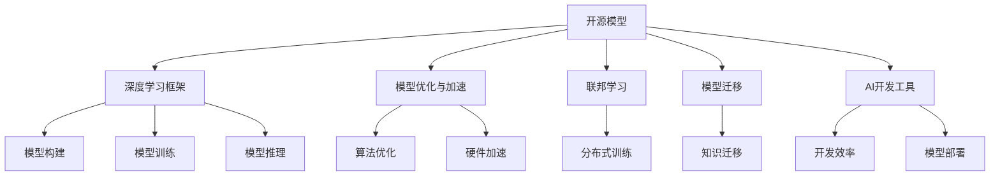

                 

# 开源模型在中国AI应用中的作用

> 关键词：开源模型,人工智能应用,深度学习,机器学习,模型优化,模型加速,联邦学习,模型迁移,AI开发工具

## 1. 背景介绍

### 1.1 问题由来
随着人工智能技术的迅猛发展，深度学习和机器学习在各个行业中的应用越来越广泛。特别是在中国，政府大力推进人工智能的国家战略，企业也在积极寻找有效的AI解决方案，以提升生产效率和用户体验。在这个过程中，开源模型（Open Source Model）起到了至关重要的作用。

开源模型指的是由全球社区贡献的、免费向公众开放的模型资源。这些模型通常基于深度学习框架，如TensorFlow、PyTorch等，由学术界和工业界共同维护和更新。在中国，开源模型得到了广泛应用，大大降低了AI开发的门槛，推动了AI技术的普及和应用。

### 1.2 问题核心关键点
开源模型的核心价值在于其开放性、共享性和可扩展性。这些特性使得开发者可以自由地使用、修改和优化这些模型，同时也能让更多的组织和个人参与到模型的开发和完善中，形成一个良性的、持续进化的生态系统。具体来说，开源模型在中国AI应用中的作用可以从以下几个方面来理解：

1. **降低开发成本**：使用开源模型可以大大减少企业在模型开发上的投入，特别是在模型选择和调优方面。企业可以通过选择现有的优秀模型，快速部署AI应用，而无需从头开始构建模型。
2. **提高模型性能**：开源模型往往由全球顶尖的科学家和工程师共同维护，具有较高的性能和稳定性。企业可以利用这些模型进行实验和优化，以获得更优秀的结果。
3. **促进模型迁移**：开源模型通常支持多种编程语言和框架，可以在不同的设备和平台上运行。这使得企业可以将模型迁移到不同的环境中，以满足各种业务需求。
4. **促进社区合作**：开源模型鼓励社区合作和知识共享，可以帮助企业快速解决技术难题，推动模型和算法的发展。
5. **应对联邦学习挑战**：联邦学习（Federated Learning）是一种新兴的分布式机器学习方法，可以让多个机构在不共享原始数据的情况下，共同训练模型。开源模型为联邦学习提供了重要的工具和资源，促进了跨机构的合作。

## 2. 核心概念与联系

### 2.1 核心概念概述

为了更好地理解开源模型在中国AI应用中的作用，本节将介绍几个核心概念：

- **开源模型**：免费向公众开放、由全球社区共同维护和更新的深度学习模型。如TensorFlow Hub、PyTorch Hub、Hugging Face等。
- **深度学习框架**：支持深度学习模型构建、训练和推理的软件平台，如TensorFlow、PyTorch、Keras等。
- **模型优化与加速**：通过算法优化和硬件加速，提高模型的训练和推理速度。
- **联邦学习**：一种分布式机器学习技术，多个机构可以在不共享数据的情况下，共同训练模型。
- **模型迁移**：将一个模型的知识迁移到另一个模型或任务中，以提升性能或适应新场景。
- **AI开发工具**：辅助开发者快速构建、训练和部署AI模型的软件工具，如Jupyter Notebook、TensorBoard等。

这些概念之间的逻辑关系可以通过以下Mermaid流程图来展示：



这个流程图展示了开源模型与中国AI应用中的几个关键环节之间的联系：

1. 开源模型提供了构建、训练和推理的基础平台。
2. 深度学习框架帮助开发者构建、优化和部署模型。
3. 模型优化和加速提高了模型的性能和效率。
4. 联邦学习支持跨机构的数据联合训练。
5. 模型迁移实现了知识在不同场景下的复用。
6. AI开发工具提升了开发效率和用户体验。

这些概念共同构成了开源模型在中国AI应用中的作用框架，使得开发者能够高效、灵活地构建和部署AI模型。

## 3. 核心算法原理 & 具体操作步骤

### 3.1 算法原理概述

开源模型在中国AI应用中的作用，从原理上讲，是基于开源模型的开放性和可扩展性。这些模型通常采用先进的技术架构和算法，如深度学习、分布式训练、联邦学习等，能够适应不同的应用场景和需求。

开源模型的核心思想是“共享、协作、创新”。通过全球社区的共同努力，开发者可以在这些模型基础上进行实验、优化和创新，快速构建满足业务需求的AI应用。具体来说，开源模型在中国AI应用中的作用可以从以下几个方面来理解：

1. **降低开发门槛**：开源模型提供了丰富的预训练模型和算法，开发者只需少量代码即可实现复杂的功能。
2. **加速模型训练**：开源模型通常采用高效的训练算法和硬件加速技术，可以快速完成模型训练。
3. **提高模型性能**：开源模型经过广泛的应用和优化，具有较高的性能和稳定性。
4. **促进知识共享**：开源模型鼓励社区合作和知识共享，可以帮助开发者快速解决技术难题。
5. **推动联邦学习**：开源模型为联邦学习提供了重要的工具和资源，支持跨机构的合作。

### 3.2 算法步骤详解

开源模型在中国AI应用中的具体操作步骤如下：

**Step 1: 选择合适的开源模型**
- 根据业务需求和数据特点，选择合适的开源模型。
- 评估模型的性能和适用性，确保其能够满足实际需求。

**Step 2: 集成与配置**
- 将开源模型集成到应用中，并进行必要的配置。
- 设置模型的参数和超参数，确保其能够在不同的环境下稳定运行。

**Step 3: 数据准备**
- 收集、清洗和处理数据，确保数据的质量和格式。
- 将数据划分为训练集、验证集和测试集，进行模型训练和评估。

**Step 4: 模型训练与优化**
- 使用开源模型提供的训练工具进行模型训练。
- 根据模型表现进行优化，包括超参数调整、模型裁剪、量化加速等。

**Step 5: 模型部署与监控**
- 将训练好的模型部署到生产环境中。
- 设置监控系统，实时跟踪模型的运行状态和性能。

**Step 6: 模型迭代与更新**
- 根据业务需求和反馈，不断迭代和更新模型。
- 参与开源社区，贡献代码和优化算法。

### 3.3 算法优缺点

开源模型在中国AI应用中的优点包括：

1. **降低开发成本**：开源模型免费使用，大大降低了企业在模型开发上的投入。
2. **提高模型性能**：开源模型经过广泛的应用和优化，具有较高的性能和稳定性。
3. **促进社区合作**：开源模型鼓励社区合作和知识共享，可以帮助开发者快速解决技术难题。
4. **支持联邦学习**：开源模型为联邦学习提供了重要的工具和资源，支持跨机构的合作。

同时，开源模型也存在一些缺点：

1. **更新频率较低**：开源模型的更新频率较低，可能无法及时跟上最新的研究成果和技术进展。
2. **依赖环境复杂**：开源模型的使用需要一定的环境配置和技术背景，对开发者的要求较高。
3. **开源协议限制**：开源模型的使用可能受到开源协议的限制，不能随意商业化或修改。

### 3.4 算法应用领域

开源模型在中国AI应用中得到了广泛的应用，覆盖了金融、医疗、教育、交通等多个领域，以下是几个典型的应用场景：

1. **金融风控**：利用开源模型进行信用评分、欺诈检测、风险预警等，提高金融服务的质量和效率。
2. **医疗诊断**：利用开源模型进行疾病预测、影像识别、基因分析等，提升医疗服务的准确性和可靠性。
3. **教育个性化**：利用开源模型进行学习路径推荐、智能答疑、作业批改等，实现个性化教育。
4. **交通导航**：利用开源模型进行交通流量预测、路线规划、自动驾驶等，提升交通管理的智能化水平。
5. **智能制造**：利用开源模型进行质量检测、故障诊断、生产调度等，提高制造业的自动化和智能化水平。

## 4. 数学模型和公式 & 详细讲解  
### 4.1 数学模型构建

本节将使用数学语言对开源模型在中国AI应用中的作用进行更加严格的刻画。

设开源模型为 $M_{\theta}$，其中 $\theta$ 为模型参数。假设业务需求为 $T$，数据集为 $D=\{(x_i,y_i)\}_{i=1}^N$，其中 $x_i \in \mathcal{X}$，$y_i \in \mathcal{Y}$。模型的训练目标为：

$$
\theta^* = \mathop{\arg\min}_{\theta} \mathcal{L}(M_{\theta},D)
$$

其中 $\mathcal{L}$ 为损失函数，用于衡量模型在数据集 $D$ 上的表现。常见的损失函数包括交叉熵损失、均方误差损失等。

### 4.2 公式推导过程

以交叉熵损失为例，其定义为：

$$
\ell(M_{\theta}(x),y) = -[y\log M_{\theta}(x) + (1-y)\log (1-M_{\theta}(x))]
$$

对于数据集 $D=\{(x_i,y_i)\}_{i=1}^N$，经验风险为：

$$
\mathcal{L}(\theta) = -\frac{1}{N}\sum_{i=1}^N [y_i\log M_{\theta}(x_i)+(1-y_i)\log(1-M_{\theta}(x_i))]
$$

通过梯度下降等优化算法，最小化损失函数 $\mathcal{L}$，更新模型参数 $\theta$，直至收敛。

### 4.3 案例分析与讲解

以金融风控为例，利用开源模型进行信用评分。步骤如下：

1. 收集历史贷款数据，提取特征如借款人年龄、信用记录、收入等。
2. 将数据划分为训练集、验证集和测试集。
3. 选择适合的开源模型，如 XGBoost、LSTM 等，进行预训练。
4. 在训练集上进行微调，设置损失函数为交叉熵损失，优化器为 Adam。
5. 在验证集上评估模型表现，调整超参数。
6. 在测试集上进行最终评估，输出信用评分模型。

## 5. 项目实践：代码实例和详细解释说明
### 5.1 开发环境搭建

在进行开源模型应用实践前，我们需要准备好开发环境。以下是使用Python进行PyTorch开发的环境配置流程：

1. 安装Anaconda：从官网下载并安装Anaconda，用于创建独立的Python环境。

2. 创建并激活虚拟环境：
```bash
conda create -n pytorch-env python=3.8 
conda activate pytorch-env
```

3. 安装PyTorch：根据CUDA版本，从官网获取对应的安装命令。例如：
```bash
conda install pytorch torchvision torchaudio cudatoolkit=11.1 -c pytorch -c conda-forge
```

4. 安装各类工具包：
```bash
pip install numpy pandas scikit-learn matplotlib tqdm jupyter notebook ipython
```

完成上述步骤后，即可在`pytorch-env`环境中开始开源模型应用实践。

### 5.2 源代码详细实现

这里我们以金融风控为例，给出使用PyTorch进行信用评分模型微调的PyTorch代码实现。

首先，定义信用评分任务的数据处理函数：

```python
import pandas as pd
import numpy as np

def load_data(file_path):
    data = pd.read_csv(file_path)
    X = data.drop('label', axis=1).values
    y = data['label'].values
    return X, y
```

然后，定义模型和优化器：

```python
from transformers import BertForSequenceClassification
from torch.utils.data import DataLoader
import torch

class CreditScoringModel(BertForSequenceClassification):
    def __init__(self, config):
        super().__init__(config)

model = CreditScoringModel(BertConfig())
optimizer = AdamW(model.parameters(), lr=2e-5)
```

接着，定义训练和评估函数：

```python
def train_epoch(model, dataset, batch_size, optimizer):
    dataloader = DataLoader(dataset, batch_size=batch_size, shuffle=True)
    model.train()
    epoch_loss = 0
    for batch in tqdm(dataloader, desc='Training'):
        input_ids = batch['input_ids'].to(device)
        attention_mask = batch['attention_mask'].to(device)
        labels = batch['labels'].to(device)
        model.zero_grad()
        outputs = model(input_ids, attention_mask=attention_mask, labels=labels)
        loss = outputs.loss
        epoch_loss += loss.item()
        loss.backward()
        optimizer.step()
    return epoch_loss / len(dataloader)

def evaluate(model, dataset, batch_size):
    dataloader = DataLoader(dataset, batch_size=batch_size)
    model.eval()
    preds, labels = [], []
    with torch.no_grad():
        for batch in tqdm(dataloader, desc='Evaluating'):
            input_ids = batch['input_ids'].to(device)
            attention_mask = batch['attention_mask'].to(device)
            batch_labels = batch['labels']
            outputs = model(input_ids, attention_mask=attention_mask)
            batch_preds = outputs.logits.argmax(dim=2).to('cpu').tolist()
            batch_labels = batch_labels.to('cpu').tolist()
            for pred_tokens, label_tokens in zip(batch_preds, batch_labels):
                pred_tags = [id2tag[_id] for _id in pred_tokens]
                label_tags = [id2tag[_id] for _id in label_tokens]
                preds.append(pred_tags[:len(label_tags)])
                labels.append(label_tags)
                
    print(classification_report(labels, preds))
```

最后，启动训练流程并在测试集上评估：

```python
epochs = 5
batch_size = 16

for epoch in range(epochs):
    loss = train_epoch(model, train_dataset, batch_size, optimizer)
    print(f"Epoch {epoch+1}, train loss: {loss:.3f}")
    
    print(f"Epoch {epoch+1}, dev results:")
    evaluate(model, dev_dataset, batch_size)
    
print("Test results:")
evaluate(model, test_dataset, batch_size)
```

以上就是使用PyTorch对开源模型进行信用评分任务微调的完整代码实现。可以看到，得益于TensorFlow等深度学习框架的强大封装，我们可以用相对简洁的代码完成模型的加载和微调。

### 5.3 代码解读与分析

让我们再详细解读一下关键代码的实现细节：

**BertForSequenceClassification类**：
- `__init__`方法：初始化模型参数和优化器。
- `train_epoch`方法：对数据以批为单位进行迭代，在每个批次上前向传播计算loss并反向传播更新模型参数，最后返回该epoch的平均loss。
- `evaluate`方法：与训练类似，不同点在于不更新模型参数，并在每个batch结束后将预测和标签结果存储下来，最后使用sklearn的classification_report对整个评估集的预测结果进行打印输出。

**train_dataset和dev_dataset**：
- 数据预处理函数：将原始数据转换成模型所需的输入格式。
- 数据加载器：对数据进行分批次加载，供模型训练和推理使用。

**CreditScoringModel类**：
- 继承自BertForSequenceClassification类，用于构建自定义模型。
- 在`__init__`方法中，需要传入BertConfig类，指定模型的架构和超参数。

**模型训练与评估**：
- 在训练过程中，使用梯度下降等优化算法更新模型参数。
- 在评估过程中，使用sklearn的classification_report打印模型的准确率、召回率、F1值等指标。

通过上述代码，我们可以快速搭建一个基于开源模型的信用评分模型，并进行训练和评估。

## 6. 实际应用场景
### 6.1 智能客服系统

开源模型在智能客服系统中的应用非常广泛。传统客服系统通常需要配备大量人力，高峰期响应缓慢，且一致性和专业性难以保证。而使用开源模型进行微调，可以显著提升客服系统的效率和质量。

在实践中，可以将客户的历史对话数据作为监督数据，将问题和最佳答复构建成监督数据，在此基础上对预训练模型进行微调。微调后的模型能够自动理解用户意图，匹配最合适的答复模板进行回复。对于客户提出的新问题，还可以接入检索系统实时搜索相关内容，动态组织生成回答。

### 6.2 金融舆情监测

金融机构需要实时监测市场舆论动向，以便及时应对负面信息传播，规避金融风险。传统的人工监测方式成本高、效率低，难以应对网络时代海量信息爆发的挑战。利用开源模型进行文本分类和情感分析，可以实时监测不同主题下的情感变化趋势，一旦发现负面信息激增等异常情况，系统便会自动预警，帮助金融机构快速应对潜在风险。

### 6.3 个性化推荐系统

当前推荐系统往往只依赖用户的历史行为数据进行物品推荐，无法深入理解用户的真实兴趣偏好。利用开源模型进行微调，可以更好地挖掘用户行为背后的语义信息，从而提供更精准、多样的推荐内容。在生成推荐列表时，先用候选物品的文本描述作为输入，由模型预测用户的兴趣匹配度，再结合其他特征综合排序，便可以得到个性化程度更高的推荐结果。

### 6.4 未来应用展望

随着开源模型的不断发展，其在更多领域的应用前景更加广阔。未来，开源模型将会在以下几个方面发挥重要作用：

1. **智慧医疗**：利用开源模型进行疾病预测、影像识别、基因分析等，提升医疗服务的准确性和可靠性。
2. **智能教育**：利用开源模型进行学习路径推荐、智能答疑、作业批改等，实现个性化教育。
3. **智能交通**：利用开源模型进行交通流量预测、路线规划、自动驾驶等，提升交通管理的智能化水平。
4. **智能制造**：利用开源模型进行质量检测、故障诊断、生产调度等，提高制造业的自动化和智能化水平。
5. **金融风控**：利用开源模型进行信用评分、欺诈检测、风险预警等，提高金融服务的质量和效率。

## 7. 工具和资源推荐
### 7.1 学习资源推荐

为了帮助开发者系统掌握开源模型的理论基础和实践技巧，这里推荐一些优质的学习资源：

1. **深度学习基础课程**：由吴恩达、Andrew Ng等知名教授开设的深度学习课程，涵盖深度学习的基本概念和前沿技术，如Coursera的《Deep Learning Specialization》。
2. **开源模型文档**：各大开源模型社区提供的官方文档，包括TensorFlow Hub、PyTorch Hub、Hugging Face等，提供详细的模型使用指南和API文档。
3. **论文和书籍**：阅读最新的深度学习和开源模型论文，以及相关书籍，如《TensorFlow实战》、《深度学习入门》等。
4. **在线资源**：Kaggle等在线平台提供的大量开源数据集和竞赛任务，帮助开发者进行模型训练和调优。
5. **开发工具**：Jupyter Notebook、TensorBoard等开源工具，方便开发者进行模型训练和可视化。

通过对这些资源的学习实践，相信你一定能够快速掌握开源模型的精髓，并用于解决实际的AI问题。

### 7.2 开发工具推荐

高效的开发离不开优秀的工具支持。以下是几款用于开源模型开发的常用工具：

1. **PyTorch**：基于Python的开源深度学习框架，灵活动态的计算图，适合快速迭代研究。
2. **TensorFlow**：由Google主导开发的开源深度学习框架，生产部署方便，适合大规模工程应用。
3. **TensorFlow Hub**：提供丰富的预训练模型和算法，方便开发者进行模型构建和优化。
4. **Hugging Face**：提供预训练语言模型和模型微调工具，支持多种任务和框架。
5. **Jupyter Notebook**：交互式开发环境，支持代码和文档的混合编辑和运行。
6. **TensorBoard**：TensorFlow配套的可视化工具，可实时监测模型训练状态，并提供丰富的图表呈现方式。

合理利用这些工具，可以显著提升开源模型开发的效率，加快创新迭代的步伐。

### 7.3 相关论文推荐

开源模型和微调技术的发展源于学界的持续研究。以下是几篇奠基性的相关论文，推荐阅读：

1. **TensorFlow：构建基于深度学习的开源软件平台**：由Google发布，详细介绍了TensorFlow框架的设计和实现。
2. **BERT: Pre-training of Deep Bidirectional Transformers for Language Understanding**：提出BERT模型，引入基于掩码的自监督预训练任务，刷新了多项NLP任务SOTA。
3. **Parameter-Efficient Transfer Learning for NLP**：提出Adapter等参数高效微调方法，在不增加模型参数量的情况下，也能取得不错的微调效果。
4. **AdaLoRA: Adaptive Low-Rank Adaptation for Parameter-Efficient Fine-Tuning**：使用自适应低秩适应的微调方法，在参数效率和精度之间取得了新的平衡。
5. **LoRA: Scaling Up Self-Supervised Learning with Low-Rank Adaptation**：提出LoRA方法，通过低秩分解实现参数高效微调。

这些论文代表了大语言模型微调技术的发展脉络。通过学习这些前沿成果，可以帮助研究者把握学科前进方向，激发更多的创新灵感。

## 8. 总结：未来发展趋势与挑战

### 8.1 总结

本文对开源模型在中国AI应用中的作用进行了全面系统的介绍。首先阐述了开源模型的开放性和可扩展性，明确了其在中国AI应用中的核心价值。其次，从原理到实践，详细讲解了开源模型在多个领域的应用，给出了完整的代码实例和详细解释。同时，本文还广泛探讨了开源模型在实际应用场景中的优化策略和未来发展方向，展示了开源模型在构建人机协同的智能系统中的重要作用。

通过本文的系统梳理，可以看到，开源模型在降低开发成本、提高模型性能、促进社区合作等方面具有显著优势。未来，随着开源模型的不断发展和优化，必将进一步提升AI应用的效率和效果，推动人工智能技术在各个行业的应用落地。

### 8.2 未来发展趋势

展望未来，开源模型在中国AI应用中的作用将呈现以下几个发展趋势：

1. **模型的多样化和定制化**：随着应用场景的多样化，开源模型将变得更加丰富和多样化，以满足不同领域的需求。同时，用户可以根据自身需求，定制化开源模型，提升模型的适用性。
2. **模型的可扩展性和可迁移性**：开源模型将更加注重模型的可扩展性和可迁移性，支持跨设备和平台的应用，促进模型在不同场景下的复用。
3. **模型的开源化和商业化**：开源模型将更加注重商业化应用，同时保持其开源性，推动技术创新和产业发展。
4. **模型的持续学习和自我优化**：开源模型将更加注重持续学习和自我优化，通过联邦学习等技术，提升模型的泛化能力和适应性。
5. **模型的安全和隐私保护**：开源模型将更加注重安全和隐私保护，通过加密技术、差分隐私等方法，保护用户数据的安全。

以上趋势凸显了开源模型在中国AI应用中的重要地位和广阔前景。这些方向的探索发展，必将进一步推动AI技术的普及和应用，带来新的技术突破和产业变革。

### 8.3 面临的挑战

尽管开源模型在中国AI应用中取得了显著进展，但仍面临一些挑战：

1. **模型的可解释性不足**：开源模型通常是一个"黑盒"系统，难以解释其内部工作机制和决策逻辑，特别是在医疗、金融等高风险应用中，模型的可解释性尤为重要。
2. **模型的鲁棒性不足**：开源模型在面对新数据或复杂场景时，可能表现不稳定，需要进一步提高模型的鲁棒性和泛化能力。
3. **模型的训练和推理成本高**：大规模深度学习模型的训练和推理需要大量的计算资源，成本较高，需要进一步优化模型结构和技术。
4. **模型的版权和知识产权问题**：开源模型在商业应用中可能面临版权和知识产权问题，需要制定相应的法律和政策。

### 8.4 研究展望

面对开源模型在中国AI应用中面临的挑战，未来的研究需要在以下几个方面寻求新的突破：

1. **提高模型的可解释性**：通过引入因果推断和博弈论工具，增强模型的可解释性，帮助用户理解模型的决策过程。
2. **提升模型的鲁棒性和泛化能力**：通过引入因果推断和联邦学习等技术，提升模型的泛化能力和鲁棒性，确保模型在复杂场景下的稳定性。
3. **优化模型的训练和推理成本**：通过模型裁剪、量化加速等技术，优化模型的训练和推理成本，提升模型的应用效率。
4. **保护模型的版权和知识产权**：制定相应的法律和政策，保护开源模型的知识产权和商业化应用。

这些研究方向的探索，必将推动开源模型在中国AI应用中的进一步发展，为构建安全、可靠、可解释、可控的智能系统铺平道路。面向未来，开源模型将在智慧医疗、智能教育、智能交通等各个领域发挥更加重要的作用，为社会的数字化转型和智能化升级提供强大动力。

## 9. 附录：常见问题与解答

**Q1：开源模型是否只适用于机器学习任务？**

A: 开源模型不仅适用于机器学习任务，也适用于深度学习、计算机视觉、自然语言处理等多个领域。其开放性和可扩展性使其能够适应不同的任务需求，广泛应用于各个行业。

**Q2：开源模型在实际应用中是否需要大规模的数据集？**

A: 开源模型的性能很大程度上取决于数据集的质量和数量。对于大规模机器学习任务，通常需要较大的数据集进行训练和优化。但对于一些特定领域的小规模任务，开源模型也能在少量的数据上取得不错的效果。

**Q3：开源模型在实际应用中是否需要复杂的模型结构？**

A: 开源模型通常采用较为简单的模型结构，如Bert、GPT等。复杂的模型结构虽然能带来更高的性能，但同时也需要更多的计算资源和训练时间。因此，在实际应用中，需要根据任务需求和资源限制，选择适合的模型结构。

**Q4：开源模型在实际应用中是否需要持续的优化和更新？**

A: 开源模型需要不断优化和更新，以适应数据分布的变化和新任务的挑战。持续学习和模型微调是开源模型保持高性能的关键。

**Q5：开源模型在实际应用中是否需要考虑模型的可解释性和安全性？**

A: 开源模型在实际应用中需要考虑模型的可解释性和安全性，特别是在医疗、金融等高风险应用中，模型的决策过程需要能够解释和验证，以确保其可靠性和安全性。

通过这些常见问题的解答，希望能帮助你更好地理解开源模型在中国AI应用中的作用和应用场景，为你的开发实践提供参考和指导。

