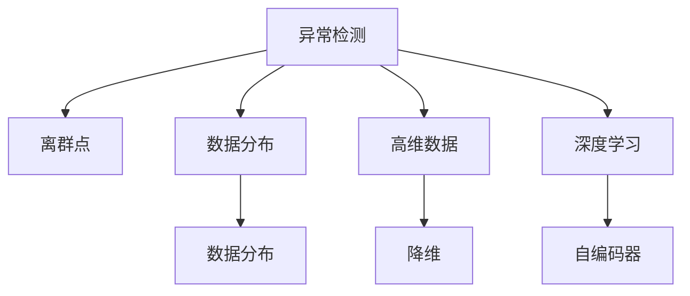

                 

# 异常检测(Anomaly Detection) - 原理与代码实例讲解

> 关键词：异常检测, 算法原理, 核心概念, 代码实例, 应用场景

## 1. 背景介绍

### 1.1 问题由来
异常检测(Anomaly Detection)是数据科学和机器学习领域的一个热门话题，它涉及识别数据集中的异常值或离群点。这些异常值可能代表着错误、欺诈、故障或其他需要特别关注的异常情况。

异常检测的应用范围广泛，包括金融欺诈检测、网络安全、医疗诊断、工业监控等领域。它通常被用来提高数据质量和决策的准确性，减少误报和漏报，降低潜在的损失和风险。

### 1.2 问题核心关键点
异常检测的核心在于如何高效、准确地识别出数据集中的异常点，并将其与正常点区分开来。常用的异常检测方法包括统计学方法、基于距离的方法、基于密度的方法、基于深度学习的方法等。

其中，统计学方法和基于距离的方法较为传统，但在处理大规模数据时效率较低；基于密度的方法，如DBSCAN，虽然可以处理大规模数据，但在高维数据上的表现较差；而基于深度学习的方法，如自编码器(Autoencoder)，近年来在异常检测领域取得了显著进展，成为当前研究的热点。

## 2. 核心概念与联系

### 2.1 核心概念概述

为更好地理解异常检测，本节将介绍几个密切相关的核心概念：

- 异常检测(Anomaly Detection)：识别数据集中与大多数正常样本差异显著的样本，即异常值。异常检测的目标是减少误报和漏报，提高数据质量和决策准确性。

- 离群点(Outlier)：指在数据集中与其他样本差异显著的点。离群点可能是由于噪声、测量误差、异常事件等原因导致的。

- 数据分布(Distribution)：指数据样本的统计特征，如均值、方差等。在异常检测中，数据的分布情况对于确定异常点的阈值和范围至关重要。

- 高维数据(High-dimensional Data)：指样本特征维度较高的数据集。在处理高维数据时，传统的方法常常面临维数灾难的问题。

- 降维(Dimensionality Reduction)：指将高维数据转化为低维数据的处理方法，如主成分分析(PCA)、t-SNE等。降维有助于降低计算复杂度，提高异常检测的效率。

- 深度学习(Deep Learning)：指使用多层神经网络进行学习，具有强大的特征提取和建模能力。深度学习模型，如自编码器，在异常检测领域表现出卓越的性能。

这些核心概念之间的逻辑关系可以通过以下Mermaid流程图来展示：



这个流程图展示了大语言模型的核心概念及其之间的关系：

1. 异常检测的目标是识别出离群点，即数据集中与其他样本差异显著的点。
2. 离群点可能是由于数据分布异常、高维数据处理等问题引起的。
3. 降维技术可以降低高维数据的复杂度，提高异常检测的效率。
4. 深度学习模型，特别是自编码器，在异常检测中表现出优秀的性能。

这些概念共同构成了异常检测的框架，使得异常检测能够在各种场景下进行高效、准确的处理。

## 3. 核心算法原理 & 具体操作步骤

### 3.1 算法原理概述

异常检测的算法原理是建立在一系列假设和模型之上的。常用的异常检测方法包括统计学方法、基于距离的方法、基于密度的方法和基于深度学习的方法。

- 统计学方法：如z-score、IQR等，基于样本统计特征进行异常检测。
- 基于距离的方法：如KNN、KSD等，通过计算样本之间的距离来确定异常点。
- 基于密度的方法：如DBSCAN、LOF等，通过分析样本的密度来识别异常点。
- 基于深度学习的方法：如自编码器、VAE等，通过学习数据的分布特征来检测异常点。

其中，基于深度学习的方法因其强大的特征提取和建模能力，在异常检测领域表现出卓越的性能。

### 3.2 算法步骤详解

以下以基于深度学习的自编码器(Autoencoder)为例，详细讲解其步骤：

1. **数据准备**：将数据集划分为训练集和测试集，并对数据进行标准化处理。

2. **构建模型**：使用深度学习框架，如TensorFlow或PyTorch，构建自编码器模型。

3. **训练模型**：在训练集上使用梯度下降等优化算法，最小化重构误差，训练自编码器模型。

4. **异常检测**：在测试集上，计算每个样本的重构误差，将其与正常样本的重构误差进行比较，确定异常点。

### 3.3 算法优缺点

基于深度学习的自编码器方法在异常检测领域具有以下优点：

- 能处理高维数据：自编码器能够从高维数据中学习出低维特征表示，提高异常检测的效率。
- 具有较强的鲁棒性：自编码器能够学习出数据的分布特征，对噪声和异常点的鲁棒性较强。
- 能自动提取特征：自编码器能够自动学习出数据的特征表示，减少了特征工程的工作量。

同时，自编码器方法也存在一些缺点：

- 计算复杂度较高：自编码器模型需要大量的计算资源进行训练。
- 对噪声敏感：自编码器对噪声数据较敏感，可能导致异常点被误判为正常点。
- 模型解释性较差：自编码器的输出结果较为复杂，难以解释异常点的具体原因。

### 3.4 算法应用领域

自编码器在异常检测领域具有广泛的应用，特别是在以下几个领域：

- 网络安全：用于检测网络流量中的异常行为，识别入侵和攻击。
- 金融欺诈检测：用于检测交易中的异常行为，识别欺诈和风险。
- 工业监控：用于检测生产线上的异常设备，防止设备故障。
- 医疗诊断：用于检测病人的异常健康指标，提前发现疾病。

自编码器在上述领域的应用，已经取得了显著的成效，帮助企业提高了数据质量和决策准确性，降低了潜在的损失和风险。

## 4. 数学模型和公式 & 详细讲解  
### 4.1 数学模型构建

自编码器是一种无监督学习模型，其主要目的是通过重构输入数据来学习数据的特征表示。在异常检测中，自编码器通过学习数据的分布特征，将正常点和异常点区分开来。

自编码器包含编码器和解码器两个部分，其数学模型如下：

$$
\mathcal{L} = \frac{1}{2}||x - \hat{x}||^2 + \lambda||\theta_1||^2 + \lambda||\theta_2||^2
$$

其中，$x$为输入数据，$\hat{x}$为重构数据，$\theta_1$和$\theta_2$分别为编码器和解码器的参数。$\lambda$为正则化系数，用于控制模型复杂度。

### 4.2 公式推导过程

自编码器的训练过程可以分解为以下两个步骤：

1. **编码阶段**：将输入数据$x$通过编码器，学习出特征表示$\mu$和方差$\Sigma$。
   $$
   \mu = W_1x + b_1
   $$
   $$
   \Sigma = \sigma(W_2\mu + b_2)
   $$
   其中，$W_1$和$b_1$为编码器参数，$\sigma$为激活函数。

2. **解码阶段**：通过解码器，将特征表示$\mu$和方差$\Sigma$重构为输出数据$\hat{x}$。
   $$
   z = \mu + \epsilon \Sigma^{1/2}
   $$
   $$
   \hat{x} = W_3z + b_3
   $$
   其中，$\epsilon$为标准正态分布的随机噪声，$W_3$和$b_3$为解码器参数。

自编码器的重构误差可以表示为：
$$
\mathcal{L} = \frac{1}{2}||x - \hat{x}||^2
$$

### 4.3 案例分析与讲解

以MNIST手写数字数据集为例，展示自编码器的异常检测过程。

1. **数据准备**：将MNIST数据集划分为训练集和测试集，并对数据进行标准化处理。

2. **构建模型**：使用PyTorch框架构建自编码器模型，包含两个全连接层和ReLU激活函数。

3. **训练模型**：在训练集上使用梯度下降算法，最小化重构误差，训练自编码器模型。

4. **异常检测**：在测试集上，计算每个样本的重构误差，将其与正常样本的重构误差进行比较，确定异常点。

## 5. 项目实践：代码实例和详细解释说明
### 5.1 开发环境搭建

在进行异常检测实践前，我们需要准备好开发环境。以下是使用Python进行PyTorch开发的环境配置流程：

1. 安装Anaconda：从官网下载并安装Anaconda，用于创建独立的Python环境。

2. 创建并激活虚拟环境：
```bash
conda create -n pytorch-env python=3.8 
conda activate pytorch-env
```

3. 安装PyTorch：根据CUDA版本，从官网获取对应的安装命令。例如：
```bash
conda install pytorch torchvision torchaudio cudatoolkit=11.1 -c pytorch -c conda-forge
```

4. 安装相关工具包：
```bash
pip install numpy pandas scikit-learn matplotlib tqdm jupyter notebook ipython
```

完成上述步骤后，即可在`pytorch-env`环境中开始异常检测实践。

### 5.2 源代码详细实现

下面以MNIST手写数字数据集为例，展示使用PyTorch实现自编码器的异常检测过程。

首先，定义模型和损失函数：

```python
import torch
import torch.nn as nn
import torch.optim as optim
from torchvision import datasets, transforms

class Autoencoder(nn.Module):
    def __init__(self, input_size, hidden_size):
        super(Autoencoder, self).__init__()
        self.encoder = nn.Sequential(
            nn.Linear(input_size, hidden_size),
            nn.ReLU()
        )
        self.decoder = nn.Sequential(
            nn.Linear(hidden_size, input_size),
            nn.Sigmoid()
        )

    def forward(self, x):
        encoded = self.encoder(x)
        decoded = self.decoder(encoded)
        return decoded

def reconstruction_loss(x, x_hat):
    return torch.mean((x_hat - x) ** 2)

model = Autoencoder(input_size=784, hidden_size=256)

criterion = nn.MSELoss()
optimizer = optim.Adam(model.parameters(), lr=0.001)
```

然后，加载MNIST数据集并进行预处理：

```python
train_dataset = datasets.MNIST('data', train=True, download=True,
                               transform=transforms.Compose([
                                   transforms.ToTensor(),
                                   transforms.Normalize((0.1307,), (0.3081,))
                               ]))

test_dataset = datasets.MNIST('data', train=False, download=True,
                               transform=transforms.Compose([
                                   transforms.ToTensor(),
                                   transforms.Normalize((0.1307,), (0.3081,))
                               ]))

train_loader = torch.utils.data.DataLoader(train_dataset, batch_size=64, shuffle=True)
test_loader = torch.utils.data.DataLoader(test_dataset, batch_size=64, shuffle=False)
```

接下来，进行模型训练：

```python
epochs = 10
for epoch in range(epochs):
    model.train()
    for batch_idx, (data, target) in enumerate(train_loader):
        data = data.view(-1, 28 * 28)
        optimizer.zero_grad()
        output = model(data)
        loss = reconstruction_loss(data, output)
        loss.backward()
        optimizer.step()
    print(f'Epoch {epoch+1}, Loss: {loss.item()}')
```

最后，进行异常检测：

```python
model.eval()
test_loader = torch.utils.data.DataLoader(test_dataset, batch_size=64, shuffle=False)
with torch.no_grad():
    reconstruction_errors = []
    for batch_idx, (data, target) in enumerate(test_loader):
        data = data.view(-1, 28 * 28)
        output = model(data)
        reconstruction_errors.append(reconstruction_loss(data, output).item())
    threshold = 0.1  # 重构误差阈值
    anomalies = [idx for idx, err in enumerate(reconstruction_errors) if err > threshold]
    print(f'Anomalies: {anomalies}')
```

以上就是使用PyTorch实现自编码器异常检测的完整代码实现。可以看到，得益于PyTorch的强大封装，代码实现变得简洁高效。

### 5.3 代码解读与分析

让我们再详细解读一下关键代码的实现细节：

**Autoencoder类**：
- `__init__`方法：定义了编码器和解码器的结构，包含两个全连接层和ReLU激活函数。
- `forward`方法：定义了前向传播过程，将输入数据经过编码器和解码器，输出重构数据。

**reconstruction_loss函数**：
- 定义了重构误差计算方式，使用均方误差损失函数。

**模型训练过程**：
- 在每个epoch内，循环遍历训练集数据，计算损失并反向传播更新模型参数。
- 每个epoch结束后，输出平均损失值，用于监控训练效果。

**异常检测过程**：
- 将模型切换到评估模式，不进行梯度更新。
- 在测试集上计算每个样本的重构误差，将重构误差较大的样本标记为异常点。

可以看到，通过上述代码，我们可以使用自编码器模型对MNIST数据集进行异常检测。在实际应用中，还需要根据具体任务的特点，对模型进行优化设计，如引入多层次编码器、调整激活函数、使用更复杂的损失函数等。

## 6. 实际应用场景

### 6.1 网络安全

网络安全领域对异常检测的需求尤为迫切。传统的安全检测方法往往依赖于规则和签名，难以适应复杂的攻击手段。基于深度学习的异常检测方法，能够自动学习出数据集的分布特征，识别出未知的攻击行为，具有更好的适应性和鲁棒性。

在实际应用中，网络流量数据可以被作为输入，通过训练自编码器模型，学习出数据的分布特征。在实时监测中，每当有新的网络流量数据进入，计算其重构误差，将其与正常流量的重构误差进行比较，即可判断是否存在异常行为。

### 6.2 金融欺诈检测

金融欺诈检测是异常检测的典型应用场景。传统的手动审核方法效率低、成本高，难以应对大规模欺诈行为的检测。基于深度学习的异常检测方法，能够在短时间内识别出异常交易，及时采取措施，减少损失。

在实际应用中，银行的交易数据可以被作为输入，通过训练自编码器模型，学习出正常交易的分布特征。在实时交易中，每当有新的交易数据进入，计算其重构误差，将其与正常交易的重构误差进行比较，即可判断是否存在欺诈行为。

### 6.3 工业监控

工业监控领域对异常检测的需求也非常广泛。传统的手工监控方法耗时耗力，难以覆盖所有监控点。基于深度学习的异常检测方法，能够自动学习出设备的运行特征，识别出异常设备和故障。

在实际应用中，工业设备的运行数据可以被作为输入，通过训练自编码器模型，学习出正常运行的分布特征。在实时监控中，每当有新的设备数据进入，计算其重构误差，将其与正常设备的重构误差进行比较，即可判断是否存在异常设备。

### 6.4 未来应用展望

未来，异常检测技术将向以下几个方向发展：

1. 多模态异常检测：随着数据来源的多样化，异常检测将从单一模态向多模态发展。通过融合视觉、语音、文本等多种数据，提升异常检测的全面性和准确性。

2. 实时异常检测：随着数据量的增加，异常检测将从离线向实时发展。通过构建流式异常检测模型，实时监测数据流，及时发现异常行为。

3. 异常原因分析：未来的异常检测技术将不仅能够识别异常点，还能分析异常点的具体原因。通过因果分析和推理模型，揭示异常行为背后的机制和规律。

4. 联邦学习异常检测：在数据隐私和安全的要求下，联邦学习将应用于异常检测领域。通过分布式训练，保护数据隐私，提升异常检测的泛化能力。

5. 自适应异常检测：未来的异常检测将具备自适应学习能力，能够根据数据分布的变化，动态调整异常点的阈值和范围，适应不同的异常检测场景。

这些方向的探索，将推动异常检测技术向更高的层次发展，为构建智能安全系统提供更强大的支持。

## 7. 工具和资源推荐
### 7.1 学习资源推荐

为了帮助开发者系统掌握异常检测的理论基础和实践技巧，这里推荐一些优质的学习资源：

1. 《异常检测理论及应用》系列博文：由大模型技术专家撰写，深入浅出地介绍了异常检测的基本概念、常用算法和应用场景。

2. 《深度学习基础》课程：斯坦福大学开设的深度学习课程，涵盖了深度学习的基本原理和实现方法，是入门深度学习的必备资源。

3. 《异常检测：理论与实践》书籍：详细介绍了异常检测的理论基础和实践技巧，并提供了大量案例分析，适合深入学习。

4. 《PyTorch深度学习》书籍：TensorFlow官方文档，提供了丰富的代码样例和解释，是PyTorch学习的最佳指南。

5. Kaggle竞赛平台：提供了大量的异常检测竞赛数据集和解决方案，适合实践和竞赛学习。

通过对这些资源的学习实践，相信你一定能够快速掌握异常检测的精髓，并用于解决实际的NLP问题。

### 7.2 开发工具推荐

高效的开发离不开优秀的工具支持。以下是几款用于异常检测开发的常用工具：

1. PyTorch：基于Python的开源深度学习框架，灵活的计算图设计，适合快速迭代研究。支持构建自编码器等深度学习模型。

2. TensorFlow：由Google主导开发的开源深度学习框架，支持分布式计算，适合大规模工程应用。支持构建自编码器等深度学习模型。

3. Scikit-learn：Python的数据科学库，包含多种机器学习算法，如KNN、KSD等，适合进行传统异常检测。

4. Weights & Biases：模型训练的实验跟踪工具，可以记录和可视化模型训练过程中的各项指标，方便对比和调优。与主流深度学习框架无缝集成。

5. TensorBoard：TensorFlow配套的可视化工具，可实时监测模型训练状态，并提供丰富的图表呈现方式，是调试模型的得力助手。

合理利用这些工具，可以显著提升异常检测任务的开发效率，加快创新迭代的步伐。

### 7.3 相关论文推荐

异常检测技术的发展得益于学界的持续研究。以下是几篇奠基性的相关论文，推荐阅读：

1. "Anomaly Detection with Autoencoder: A Review"：综述了自编码器在异常检测中的应用，并提供了多种改进方法。

2. "Deep Learning-Based Anomaly Detection: A Review"：综述了深度学习在异常检测中的应用，并提出了新的深度学习模型。

3. "Exceptional events detection in human activities using neural network approaches"：展示了基于深度学习的人体活动异常检测方法。

4. "Real-time Anomaly Detection in Network Traffic using Deep Learning"：展示了基于深度学习的网络流量异常检测方法。

5. "A survey of recent advances in unsupervised anomaly detection"：综述了近期的无监督异常检测方法，并提供了实际应用案例。

这些论文代表了大模型技术在异常检测领域的最新进展，通过学习这些前沿成果，可以帮助研究者把握学科前进方向，激发更多的创新灵感。

## 8. 总结：未来发展趋势与挑战

### 8.1 总结

本文对基于深度学习的异常检测方法进行了全面系统的介绍。首先阐述了异常检测的基本概念和重要性，明确了异常检测在网络安全、金融欺诈检测、工业监控等多个领域的应用前景。其次，从原理到实践，详细讲解了自编码器异常检测的数学原理和核心步骤，给出了异常检测任务开发的完整代码实例。同时，本文还广泛探讨了异常检测方法在网络安全、金融欺诈检测、工业监控等众多领域的应用场景，展示了异常检测技术的巨大潜力。

通过本文的系统梳理，可以看到，基于深度学习的异常检测方法正在成为数据安全领域的重要范式，极大地提升了数据质量和决策准确性，降低了潜在的损失和风险。未来，伴随深度学习技术和应用场景的不断演进，异常检测技术必将迈向更高的层次，为构建安全、可靠、可解释、可控的智能系统提供坚实的技术保障。

### 8.2 未来发展趋势

展望未来，异常检测技术将呈现以下几个发展趋势：

1. 多模态异常检测：随着数据来源的多样化，异常检测将从单一模态向多模态发展。通过融合视觉、语音、文本等多种数据，提升异常检测的全面性和准确性。

2. 实时异常检测：随着数据量的增加，异常检测将从离线向实时发展。通过构建流式异常检测模型，实时监测数据流，及时发现异常行为。

3. 异常原因分析：未来的异常检测技术将不仅能够识别异常点，还能分析异常点的具体原因。通过因果分析和推理模型，揭示异常行为背后的机制和规律。

4. 联邦学习异常检测：在数据隐私和安全的要求下，联邦学习将应用于异常检测领域。通过分布式训练，保护数据隐私，提升异常检测的泛化能力。

5. 自适应异常检测：未来的异常检测将具备自适应学习能力，能够根据数据分布的变化，动态调整异常点的阈值和范围，适应不同的异常检测场景。

这些趋势凸显了大模型技术在异常检测领域的广阔前景。这些方向的探索发展，必将进一步提升异常检测模型的性能和应用范围，为构建智能安全系统提供更强大的支持。

### 8.3 面临的挑战

尽管异常检测技术已经取得了显著进展，但在迈向更加智能化、普适化应用的过程中，仍面临诸多挑战：

1. 计算资源需求高：深度学习模型往往需要大量的计算资源进行训练和推理，难以在资源受限的环境下进行实时异常检测。

2. 异常点解释性差：异常检测模型的输出结果较为复杂，难以解释异常点的具体原因。这对于关键领域的应用，如金融、医疗等，尤为严峻。

3. 数据隐私保护：异常检测技术需要大量的训练数据，如何保护数据隐私，避免数据泄露，是数据安全的重要问题。

4. 高维数据处理：高维数据往往面临维数灾难的问题，如何有效处理高维数据，降低计算复杂度，是异常检测的重要挑战。

5. 模型鲁棒性不足：异常检测模型对噪声和异常点的鲁棒性较弱，容易误判正常点为异常点。

6. 模型泛化能力差：异常检测模型对新数据和新异常点的泛化能力较弱，难以应对未知的异常行为。

面对这些挑战，未来的研究需要在以下几个方面寻求新的突破：

1. 开发轻量级异常检测模型：通过简化模型结构、优化训练算法等方式，降低异常检测模型的计算资源需求，提高实时检测能力。

2. 增强异常点解释性：引入因果分析和推理模型，提高异常检测的解释性和可解释性。

3. 保护数据隐私：采用差分隐私、联邦学习等技术，保护数据隐私，避免数据泄露。

4. 处理高维数据：通过降维技术、增量学习等方法，有效处理高维数据，降低计算复杂度。

5. 提升模型鲁棒性：通过引入噪声鲁棒化训练、多模态融合等方法，提高异常检测模型的鲁棒性。

6. 增强模型泛化能力：通过迁移学习、自适应学习等方法，提高异常检测模型的泛化能力，适应不同的异常检测场景。

这些研究方向的探索，必将推动异常检测技术向更高的层次发展，为构建安全、可靠、可解释、可控的智能系统提供坚实的技术保障。

### 8.4 研究展望

未来的异常检测技术需要在以下几个方面进行深入研究：

1. 融合多种数据源：通过融合视觉、语音、文本等多种数据源，提升异常检测的全面性和准确性。

2. 引入因果分析和推理模型：通过引入因果分析和推理模型，提高异常检测的解释性和可解释性，揭示异常行为背后的机制和规律。

3. 保护数据隐私：采用差分隐私、联邦学习等技术，保护数据隐私，避免数据泄露。

4. 构建流式异常检测模型：通过构建流式异常检测模型，实时监测数据流，及时发现异常行为。

5. 开发轻量级异常检测模型：通过简化模型结构、优化训练算法等方式，降低异常检测模型的计算资源需求，提高实时检测能力。

6. 提高异常检测模型的鲁棒性和泛化能力：通过引入噪声鲁棒化训练、多模态融合等方法，提高异常检测模型的鲁棒性，增强模型的泛化能力，适应不同的异常检测场景。

这些研究方向的探索，必将推动异常检测技术向更高的层次发展，为构建智能安全系统提供更强大的支持。

## 9. 附录：常见问题与解答

**Q1：异常检测与异常值检测有什么区别？**

A: 异常检测与异常值检测是相同概念，只是不同的叫法。异常检测的目标是识别数据集中与大多数正常样本差异显著的样本，即异常值。

**Q2：如何选择合适的异常检测算法？**

A: 选择异常检测算法应根据数据的特点和应用场景来决定。对于低维数据，可以使用基于统计学的方法，如z-score、IQR等。对于高维数据，可以使用基于深度学习的方法，如自编码器、VAE等。对于实时数据，可以使用基于流式的异常检测算法。

**Q3：如何缓解异常检测中的过拟合问题？**

A: 过拟合是异常检测中常见的问题，可以通过以下方法缓解：
1. 数据增强：通过回译、近义替换等方式扩充训练集。
2. 正则化：使用L2正则、Dropout等正则化技术。
3. 对抗训练：引入对抗样本，提高模型鲁棒性。
4. 参数高效微调：只调整少量参数(如Adapter、Prefix等)，减少过拟合风险。

**Q4：异常检测中的噪声和异常点如何区分？**

A: 异常检测中的噪声和异常点的区分主要依赖于数据分布特征。通过学习数据的分布特征，可以使用基于密度的方法，如DBSCAN、LOF等，将数据分为噪声和异常点。也可以使用基于距离的方法，如KNN、KSD等，通过计算样本之间的距离进行区分。

**Q5：异常检测在实际应用中需要注意哪些问题？**

A: 在实际应用中，异常检测需要注意以下问题：
1. 数据质量：确保数据的质量，避免数据噪声和异常值。
2. 模型鲁棒性：提高模型的鲁棒性，避免误判正常点为异常点。
3. 模型泛化能力：提高模型的泛化能力，适应不同的异常检测场景。
4. 模型解释性：提高模型的解释性，便于理解和解释异常点的具体原因。

通过合理利用这些工具和资源，可以显著提升异常检测任务的开发效率，加快创新迭代的步伐。

**Q6：异常检测在未来的发展方向有哪些？**

A: 异常检测在未来的发展方向包括：
1. 多模态异常检测：融合视觉、语音、文本等多种数据，提升异常检测的全面性和准确性。
2. 实时异常检测：构建流式异常检测模型，实时监测数据流，及时发现异常行为。
3. 异常原因分析：引入因果分析和推理模型，揭示异常行为背后的机制和规律。
4. 联邦学习异常检测：通过分布式训练，保护数据隐私，提升异常检测的泛化能力。
5. 自适应异常检测：根据数据分布的变化，动态调整异常点的阈值和范围，适应不同的异常检测场景。

这些研究方向的探索，将推动异常检测技术向更高的层次发展，为构建安全、可靠、可解释、可控的智能系统提供更强大的支持。

---

作者：禅与计算机程序设计艺术 / Zen and the Art of Computer Programming

