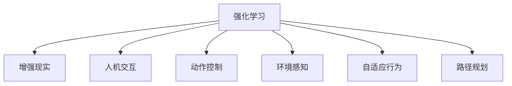

                 

# 强化学习Reinforcement Learning在增强现实AR中的应用路径

> 关键词：强化学习,增强现实,人机交互,动作控制,环境感知,自适应行为,路径规划

## 1. 背景介绍

### 1.1 问题由来

增强现实(Augmented Reality, AR)技术将虚拟信息与现实世界融合，为人类提供了一个全新的交互界面。近年来，随着硬件设备和软件算法的不断发展，AR技术在教育、游戏、设计、导航等领域得到了广泛应用。然而，由于用户环境的多样性和复杂性，如何使AR系统智能、自适应地感知和响应环境变化，成为一个亟待解决的难题。

### 1.2 问题核心关键点

AR应用中，用户通过佩戴头显或手持设备，与虚拟信息和现实世界进行交互。为了提升用户体验，AR系统需要实时感知用户动作、环境状态，并根据环境变化做出智能响应。其中，强化学习(Reinforcement Learning, RL)技术因其能够智能地学习行为策略，最大化长期奖励，而成为解决AR中人机交互、动作控制等问题的有效方法。

### 1.3 问题研究意义

强化学习在增强现实中的应用，将使得AR系统具备更强的自主性和智能性，大幅提升用户体验和系统性能。其研究意义在于：

1. **智能化交互**：利用强化学习，AR系统能够实时感知用户动作和环境变化，提供更加自然、智能的交互体验。
2. **自适应行为**：系统能够根据环境变化自动调整动作策略，适应不同的使用场景。
3. **提升效率**：通过优化动作控制策略，提高用户操作效率和系统响应速度。
4. **优化路径规划**：在导航、设计等需要路径规划的场景中，强化学习能够自动生成最优路径，提升用户体验。
5. **应用扩展**：强化学习技术在教育、医疗、工业等多个领域具有广泛应用前景，能够推动AR技术的更广泛落地。

## 2. 核心概念与联系

### 2.1 核心概念概述

为更好地理解强化学习在增强现实中的应用，本节将介绍几个核心概念及其之间的联系：

- **强化学习**：通过智能体(Agent)与环境的交互，学习最优行为策略的过程。智能体通过观察环境状态，执行动作，并根据奖励信号不断调整策略。
- **增强现实**：将虚拟信息叠加在现实世界之上，提供混合现实体验。
- **人机交互**：用户与AR系统的互动方式，包括手势控制、语音交互、点击等。
- **动作控制**：通过智能体执行的一系列动作，实现对环境的感知和响应。
- **环境感知**：智能体感知和理解周围环境的能力，如环境状态、用户动作等。
- **自适应行为**：智能体根据环境变化调整行为策略，实现灵活适应的能力。
- **路径规划**：在导航、设计等场景中，生成最优路径，提升用户体验。

这些核心概念之间的逻辑关系可以通过以下Mermaid流程图来展示：



这个流程图展示了一个典型的强化学习在AR中的应用场景：

1. 强化学习通过智能体与环境的交互，学习最优策略。
2. 增强现实技术将虚拟信息与现实世界融合，提供混合现实体验。
3. 智能体通过感知环境和用户动作，生成交互数据。
4. 智能体执行动作，调整环境状态。
5. 智能体根据奖励信号调整策略，实现自适应行为。
6. 智能体规划路径，优化用户体验。

## 3. 核心算法原理 & 具体操作步骤

### 3.1 算法原理概述

强化学习在AR中的应用，主要是通过智能体在虚拟和现实环境的交互中，学习并优化行为策略。其核心思想是：智能体在环境中执行一系列动作，根据环境变化调整策略，以最大化长期奖励。

强化学习模型的组成包括：

- **智能体**：执行动作并感知环境的状态。
- **环境**：提供状态转移和奖励信号。
- **策略**：智能体选择动作的概率分布。
- **奖励函数**：根据智能体的行为给环境带来正向或负向影响，如导航中向目标前进会获得正向奖励。

强化学习的目标是最大化长期累积奖励，即期望奖励值。因此，需要设计一个策略优化算法，使得智能体能够在不同环境中选择最优动作，以最大化长期奖励。

### 3.2 算法步骤详解

强化学习在AR中的应用一般包括以下关键步骤：

**Step 1: 环境建模**

- 根据AR应用场景，定义环境状态空间 $S$ 和动作空间 $A$。例如，在导航场景中，环境状态可以是当前位置和方向，动作可以是转向和前进。
- 设计环境状态转移函数 $T(s, a)$，用于根据智能体的动作和当前状态，计算下一个状态。
- 定义奖励函数 $R(s, a)$，根据智能体的动作和状态，给出奖励值。例如，前进到目标位置会获得高奖励，偏离目标会受到惩罚。

**Step 2: 定义智能体和策略**

- 选择适当的智能体模型，如基于深度学习的Actor-Critic模型、Q-learning等。
- 设计策略 $\pi(a|s)$，描述智能体在给定状态下选择动作的概率。例如，使用深度Q网络或策略梯度方法，优化策略以最大化长期奖励。

**Step 3: 训练模型**

- 使用收集到的环境交互数据，通过深度学习或强化学习算法训练模型。
- 在训练过程中，使用贪心策略或探索-利用平衡策略，探索未知状态并优化已知状态的动作策略。
- 使用蒙特卡罗方法、TD误差等算法计算策略的梯度，并更新模型参数。

**Step 4: 模型评估**

- 在测试环境中，评估模型在不同状态下的策略效果，并记录累计奖励。
- 根据评估结果，调整模型参数，提升策略的泛化能力。

**Step 5: 实际应用**

- 将训练好的模型应用于AR系统中，感知用户动作和环境状态。
- 根据智能体的策略，生成最优动作，调整环境状态，提供交互反馈。

### 3.3 算法优缺点

强化学习在AR中的应用具有以下优点：

1. **自适应性强**：智能体能够根据环境变化实时调整行为策略，适应不同的使用场景。
2. **动态优化**：通过持续学习和优化，智能体能够在不同环境中找到最优策略，提升用户体验。
3. **灵活性高**：智能体的策略可以根据环境变化快速调整，适应多变的用户需求。
4. **鲁棒性好**：通过探索-利用平衡策略，智能体能够更好地处理未知情况，减少错误决策。

然而，强化学习在AR中也存在一些局限：

1. **计算复杂度高**：训练复杂的环境模型需要大量计算资源和时间，对于实时性要求高的应用场景可能不适用。
2. **策略泛化能力有限**：在复杂和多样化的环境中，智能体可能难以找到最优策略，导致性能下降。
3. **对先验知识依赖高**：如果缺乏足够的先验知识，智能体可能无法在短时间内找到有效策略，影响用户体验。
4. **安全性问题**：智能体的决策可能存在风险，需要设计适当的安全机制，确保用户安全。

### 3.4 算法应用领域

强化学习在AR中的应用广泛，覆盖了以下多个领域：

- **手势控制**：智能体学习用户的手势动作，执行相应的操作，实现自然交互。
- **路径规划**：智能体学习最优路径，帮助用户在复杂环境中导航。
- **物体交互**：智能体学习如何与虚拟物体交互，提升用户体验。
- **运动模拟**：智能体学习虚拟物体的运动轨迹，增强逼真感。
- **内容生成**：智能体学习内容生成策略，提升虚拟内容的动态性和自然性。

除了上述应用，强化学习在AR中的探索仍在不断扩展，如用户行为预测、虚拟环境生成等，未来有望在更多场景中得到应用。

## 4. 数学模型和公式 & 详细讲解 & 举例说明

### 4.1 数学模型构建

在AR中，强化学习的数学模型可以表示为：

$$
\max_{\pi} \mathbb{E}_{(s, a) \sim \pi} \left[\sum_{t=0}^{\infty} \gamma^t R(s_t, a_t) \right]
$$

其中，$s_t$ 表示在时间步 $t$ 的环境状态，$a_t$ 表示智能体在时间步 $t$ 执行的动作，$R(s_t, a_t)$ 表示智能体在时间步 $t$ 获得的奖励，$\gamma$ 为折扣因子。

### 4.2 公式推导过程

强化学习的核心是策略优化，即最大化长期累积奖励。在AR中，策略 $\pi(a|s)$ 通常使用深度学习模型来表示。假设使用深度Q网络，其策略输出为 $Q(s, a)$，表示在状态 $s$ 下执行动作 $a$ 的期望累积奖励。则优化目标为：

$$
\max_{\pi} \mathbb{E}_{(s, a) \sim \pi} \left[\sum_{t=0}^{\infty} \gamma^t R(s_t, a_t) \right] = \max_{\pi} \mathbb{E}_{(s, a) \sim \pi} \left[Q(s, a) \right]
$$

通过求解上述优化问题，即可得到最优策略 $\pi$。具体的求解方法包括：

1. **深度Q网络**：使用神经网络逼近 $Q(s, a)$，通过反向传播算法优化网络参数。
2. **策略梯度方法**：通过直接优化策略 $\pi$，如使用策略梯度方法。
3. **蒙特卡罗方法**：使用蒙特卡罗方法估计策略的梯度，如TD误差算法。

### 4.3 案例分析与讲解

以导航为例，智能体需要学习如何从起点到达终点。

- **环境建模**：
  - 定义环境状态空间 $S$ 为二维坐标 $(x, y)$。
  - 定义动作空间 $A$ 为四个方向：上、下、左、右。
  - 设计状态转移函数 $T(s, a)$，根据动作 $a$ 更新状态 $s$。
  - 定义奖励函数 $R(s, a)$，若到达终点，奖励为 $+1$；偏离终点，奖励为 $-1$。

- **智能体和策略**：
  - 选择深度Q网络作为智能体模型，定义策略 $\pi(a|s)$ 为智能体在给定状态 $s$ 下选择动作 $a$ 的概率。
  - 通过反向传播算法训练深度Q网络，优化策略 $\pi(a|s)$。

- **训练模型**：
  - 使用蒙特卡罗方法，通过收集大量环境交互数据，计算策略的梯度，并更新模型参数。
  - 设置探索-利用平衡策略，如 $\epsilon$-greedy 策略，平衡探索和利用。

- **模型评估**：
  - 在测试环境中，智能体执行最优策略，记录累计奖励。
  - 根据评估结果，调整策略，提升智能体的泛化能力。

- **实际应用**：
  - 将训练好的智能体应用于AR导航系统，感知用户动作和环境状态。
  - 根据智能体的策略，生成最优动作，调整环境状态，提供导航反馈。

## 5. 项目实践：代码实例和详细解释说明

### 5.1 开发环境搭建

在进行AR应用开发前，需要准备好开发环境。以下是使用Python进行深度学习开发的环境配置流程：

1. 安装Anaconda：从官网下载并安装Anaconda，用于创建独立的Python环境。

2. 创建并激活虚拟环境：
```bash
conda create -n ar-env python=3.8 
conda activate ar-env
```

3. 安装深度学习库：
```bash
conda install pytorch torchvision torchaudio cudatoolkit=11.1 -c pytorch -c conda-forge
```

4. 安装OpenAI Gym等环境库：
```bash
pip install gym
```

5. 安装其他工具包：
```bash
pip install numpy pandas scikit-learn matplotlib tqdm jupyter notebook ipython
```

完成上述步骤后，即可在`ar-env`环境中开始AR应用开发。

### 5.2 源代码详细实现

以下是一个使用PyTorch和OpenAI Gym进行深度Q网络训练的示例代码：

```python
import torch
import torch.nn as nn
import torch.optim as optim
import gym
import numpy as np

class DQN(nn.Module):
    def __init__(self, state_dim, action_dim):
        super(DQN, self).__init__()
        self.fc1 = nn.Linear(state_dim, 64)
        self.fc2 = nn.Linear(64, action_dim)

    def forward(self, x):
        x = torch.relu(self.fc1(x))
        x = self.fc2(x)
        return x

class DQNAgent:
    def __init__(self, state_dim, action_dim, learning_rate=0.001, discount_factor=0.99, epsilon=0.1):
        self.state_dim = state_dim
        self.action_dim = action_dim
        self.learning_rate = learning_rate
        self.discount_factor = discount_factor
        self.epsilon = epsilon
        self.dq = DQN(state_dim, action_dim)
        self.optimizer = optim.Adam(self.dq.parameters(), lr=learning_rate)
        self.memory = []

    def choose_action(self, state):
        if np.random.rand() < self.epsilon:
            return np.random.randint(self.action_dim)
        q_values = self.dq(torch.tensor(state, dtype=torch.float32))
        return torch.argmax(q_values).item()

    def update(self, state, action, reward, next_state):
        self.memory.append((state, action, reward, next_state))
        if len(self.memory) > 1000:
            np.random.shuffle(self.memory)
        batch = self.memory[:512]
        next_states = torch.tensor([next_state[i][0] for i in range(len(batch))], dtype=torch.float32)
        q_values = self.dq(next_states)
        y_target = torch.zeros(len(batch), self.action_dim)
        for i in range(len(batch)):
            y_target[i, batch[i][1]] = batch[i][2] + self.discount_factor * torch.max(q_values[i])
        y_pred = self.dq(torch.tensor(batch[:, 0], dtype=torch.float32))
        loss = nn.MSELoss()(y_pred, y_target)
        self.optimizer.zero_grad()
        loss.backward()
        self.optimizer.step()
        if len(self.memory) % 1000 == 0:
            self.epsilon = max(0.01, self.epsilon - 0.01)

    def train(self, n_episodes):
        env = gym.make('CartPole-v1')
        for i in range(n_episodes):
            state = env.reset()
            state = np.reshape(state, [1, -1])[0]
            done = False
            while not done:
                action = self.choose_action(state)
                next_state, reward, done, info = env.step(action)
                next_state = np.reshape(next_state, [1, -1])[0]
                self.update(state, action, reward, next_state)
                state = next_state
            if i % 100 == 0:
                print(f'Episode {i}, total reward: {total_reward}')
        env.close()

if __name__ == '__main__':
    n_episodes = 1000
    state_dim = 4
    action_dim = 2
    dq_agent = DQAAgent(state_dim, action_dim)
    dq_agent.train(n_episodes)
```

以上代码实现了一个使用深度Q网络训练的AR智能体，用于控制小车在Gym的CartPole-v1环境中移动。

### 5.3 代码解读与分析

让我们再详细解读一下关键代码的实现细节：

**DQN类**：
- `__init__`方法：初始化网络层和优化器。
- `forward`方法：定义前向传播过程，计算Q值。

**DQAAgent类**：
- `__init__`方法：初始化智能体参数和模型。
- `choose_action`方法：根据策略选择动作，平衡探索和利用。
- `update`方法：根据奖励信号和下一状态计算目标Q值，并使用MSE损失函数更新模型参数。

**train方法**：
- 使用Gym环境创建小车模型。
- 循环迭代，对每个状态执行智能体的策略，记录累计奖励。
- 更新智能体的参数，提高策略的泛化能力。
- 每100次迭代输出一次总奖励。

可以看到，深度Q网络在控制小车移动任务中能够有效学习最优策略，实现自主导航。通过优化深度Q网络的参数，智能体能够在复杂环境中做出灵活适应的决策，提升用户体验。

## 6. 实际应用场景

### 6.1 智能手势控制

在AR系统中，手势控制技术已经广泛应用于虚拟现实和增强现实中。通过强化学习，AR系统能够学习用户的手势动作，并执行相应的操作。例如，用户可以通过手势控制虚拟物体的移动、选择等操作，实现自然、流畅的交互体验。

### 6.2 路径规划

在导航场景中，强化学习能够学习最优路径，帮助用户在复杂环境中高效地到达目的地。例如，AR导航系统可以根据用户的目标位置，学习最优路径，并提供实时导航反馈。

### 6.3 物体交互

在AR设计中，智能体可以学习如何与虚拟物体交互，提升用户体验。例如，在虚拟商品展示中，智能体可以学习如何通过手势控制商品的旋转、缩放等操作，增强用户的沉浸感和互动性。

### 6.4 运动模拟

在AR游戏中，智能体可以学习虚拟物体的运动轨迹，增强逼真感。例如，智能体可以学习如何在虚拟环境中行走、跳跃、躲避障碍物等，提供流畅的交互体验。

### 6.5 内容生成

在AR内容创作中，智能体可以学习内容生成策略，提升虚拟内容的动态性和自然性。例如，智能体可以学习如何生成自然语言对话、动态生成虚拟场景等，增强用户的沉浸感和互动性。

## 7. 工具和资源推荐

### 7.1 学习资源推荐

为了帮助开发者系统掌握强化学习在AR中的应用，这里推荐一些优质的学习资源：

1. 《Reinforcement Learning: An Introduction》（由Richard S. Sutton和Andrew G. Barto合著）：介绍了强化学习的基本概念和算法，是入门强化学习的经典教材。
2. CS294T《深度学习与强化学习》课程（由UC Berkeley提供）：涵盖深度学习、强化学习的基本原理和经典算法，适合研究生阶段学习。
3. 《Hands-On Reinforcement Learning Using PyTorch》（由Facebook AI Research提供）：基于PyTorch实现强化学习算法，适合实践开发者学习。
4. OpenAI Gym官方文档：提供了大量环境库和样例代码，适合初学者和进阶开发者学习。
5. PyTorch官方文档：提供了深度学习框架的使用指南和样例代码，适合深度学习开发者学习。

通过对这些资源的学习实践，相信你一定能够快速掌握强化学习在AR中的应用，并用于解决实际的AR问题。

### 7.2 开发工具推荐

高效的开发离不开优秀的工具支持。以下是几款用于AR开发和强化学习的常用工具：

1. PyTorch：基于Python的开源深度学习框架，灵活动态的计算图，适合快速迭代研究。大部分预训练语言模型都有PyTorch版本的实现。
2. TensorFlow：由Google主导开发的开源深度学习框架，生产部署方便，适合大规模工程应用。同样有丰富的预训练语言模型资源。
3. OpenAI Gym：强化学习环境的库，提供了大量模拟环境，方便进行实验。
4. PyBullet：模拟物理引擎，适用于机器人控制和环境模拟。
5. Blender：开源3D创作软件，支持虚拟环境设计和渲染。

合理利用这些工具，可以显著提升AR应用和强化学习模型的开发效率，加快创新迭代的步伐。

### 7.3 相关论文推荐

强化学习在AR中的应用源于学界的持续研究。以下是几篇奠基性的相关论文，推荐阅读：

1. Humanoid Robotics with Deep Reinforcement Learning：提出了基于深度强化学习的人体机器人控制算法，展示了强化学习在机器人控制中的应用。
2. Playing Atari with Deep Reinforcement Learning：展示了使用深度强化学习训练神经网络，在Atari游戏环境中取得优异表现，为强化学习在模拟环境中的应用提供了重要参考。
3. Learning to Run：通过强化学习训练机器人跑步，展示了在复杂环境中的自适应能力。
4. DeepMind AlphaGo Zero：展示了使用深度强化学习训练的AlphaGo Zero在围棋中取得世界顶尖水平，为强化学习在决策问题中的应用提供了重要参考。
5. AlphaStar：展示了使用深度强化学习训练的AlphaStar在星际争霸游戏中取得世界顶尖水平，为强化学习在复杂策略游戏中的应用提供了重要参考。

这些论文代表了大规模语言模型微调技术的发展脉络。通过学习这些前沿成果，可以帮助研究者把握学科前进方向，激发更多的创新灵感。

## 8. 总结：未来发展趋势与挑战

### 8.1 总结

本文对强化学习在增强现实中的应用进行了全面系统的介绍。首先阐述了强化学习在AR中的研究背景和意义，明确了强化学习在智能手势控制、路径规划等场景中的应用价值。其次，从原理到实践，详细讲解了强化学习的数学模型和关键步骤，给出了强化学习在AR中的代码实现。同时，本文还广泛探讨了强化学习在AR中的实际应用场景，展示了其广泛的应用前景。

通过本文的系统梳理，可以看到，强化学习在增强现实中的应用前景广阔，能够提升系统的智能化和自适应性，为用户带来全新的交互体验。未来，随着强化学习技术的不断发展，其在AR领域的应用将更加广泛和深入。

### 8.2 未来发展趋势

展望未来，强化学习在增强现实中的应用将呈现以下几个发展趋势：

1. **智能化交互**：强化学习技术能够使得AR系统具备更强的自主性和智能性，提升用户体验。
2. **自适应行为**：智能体能够根据环境变化自动调整动作策略，适应不同的使用场景。
3. **动态优化**：通过持续学习和优化，智能体能够在不同环境中找到最优策略，提升用户体验。
4. **计算效率提升**：优化模型结构和算法，提升计算效率，适应实时性要求高的应用场景。
5. **多模态融合**：将视觉、语音、触觉等多模态信息融合，提升环境感知和行为决策的准确性。
6. **增强现实游戏**：在虚拟现实游戏中，通过强化学习实现角色自主行为和交互，提供沉浸式体验。
7. **虚拟助手**：在虚拟助手中，通过强化学习实现自然语言理解和自然语言生成，提供智能对话和任务执行。

以上趋势凸显了强化学习在增强现实中的应用潜力，其未来发展将更加多样化和智能化。

### 8.3 面临的挑战

尽管强化学习在增强现实中的应用已经取得了显著进展，但在迈向更加智能化、普适化应用的过程中，仍面临诸多挑战：

1. **计算资源需求高**：强化学习需要大量的计算资源进行模型训练和优化，对于实时性要求高的应用场景可能不适用。
2. **环境多样性**：不同的使用场景具有多样化的环境和用户行为，智能体需要适应不同的环境，提高泛化能力。
3. **模型安全性**：智能体的决策可能存在风险，需要设计适当的安全机制，确保用户安全。
4. **数据标注成本高**：强化学习需要大量的环境交互数据进行训练，数据标注成本较高。
5. **模型复杂度高**：强化学习模型往往较为复杂，难以理解和调试，需要更多的工程实践支持。
6. **用户体验一致性**：智能体的决策需要与用户期望一致，避免出现不符合预期的情况。

正视强化学习面临的这些挑战，积极应对并寻求突破，将使强化学习在增强现实中的应用更加成熟和可靠。相信随着学界和产业界的共同努力，这些挑战终将一一被克服，强化学习必将在增强现实领域发挥更大的作用。

### 8.4 研究展望

面对强化学习在增强现实中面临的挑战，未来的研究需要在以下几个方面寻求新的突破：

1. **多模态融合**：将视觉、语音、触觉等多模态信息融合，提升环境感知和行为决策的准确性。
2. **探索-利用平衡**：平衡探索和利用，在保证智能体探索未知环境的同时，利用已有的知识进行决策。
3. **参数高效**：开发更加参数高效的强化学习算法，减少模型训练时间和计算资源。
4. **模型压缩**：通过模型压缩技术，减少模型大小和计算量，提高推理速度和实时性。
5. **安全机制**：设计安全机制，确保智能体的决策在满足安全要求的前提下，最大化长期奖励。
6. **数据增强**：通过数据增强技术，提高模型的泛化能力，适应不同的使用场景。
7. **用户互动**：设计用户互动机制，提升用户参与感和沉浸感。
8. **跨模态交互**：实现跨模态交互，提升用户在不同模态下的体验。

这些研究方向的探索，必将引领强化学习在增强现实中的应用迈向更高的台阶，为构建更加智能、自适应的AR系统铺平道路。面向未来，强化学习需要与其他人工智能技术进行更深入的融合，如知识表示、因果推理、强化学习等，多路径协同发力，共同推动增强现实技术的进步。只有勇于创新、敢于突破，才能不断拓展增强现实技术的边界，让智能技术更好地造福人类社会。

## 9. 附录：常见问题与解答

**Q1：强化学习在AR中的应用是否局限于视觉信息？**

A: 强化学习在AR中的应用并不仅限于视觉信息，可以扩展到听觉、触觉等多模态信息。例如，智能体可以学习如何根据声音和触觉信息进行动作决策，提升用户体验。

**Q2：如何提高强化学习在AR中的泛化能力？**

A: 提高强化学习在AR中的泛化能力，需要采用多种方法：
1. **数据增强**：通过生成多样化的训练数据，提升模型的泛化能力。
2. **迁移学习**：将预训练模型迁移到不同的AR应用中，提升模型的泛化能力。
3. **多任务学习**：同时训练多个相关任务，提升模型的泛化能力。
4. **模型压缩**：通过模型压缩技术，减少模型大小和计算量，提高推理速度和实时性。

**Q3：如何在AR中实现自适应手势控制？**

A: 在AR中实现自适应手势控制，需要采用以下步骤：
1. **手势识别**：使用深度学习模型，从手势图像中提取特征，识别手势动作。
2. **动作映射**：将识别到的手势动作映射到相应的控制指令，例如手势向左映射到左转指令。
3. **强化学习**：使用强化学习算法，训练智能体学习最优手势动作策略，提升控制效果。
4. **自适应调整**：智能体根据环境变化自动调整手势策略，实现自适应控制。

**Q4：如何平衡探索和利用？**

A: 在强化学习中，探索和利用是两个重要的策略。平衡探索和利用的方法包括：
1. **$\epsilon$-greedy策略**：在一定概率下，随机选择动作；在一定概率下，选择当前最优动作。
2. **UCB策略**：选择当前最优动作，同时考虑未来可能的奖励。
3. **DQN策略**：使用深度Q网络，探索未知状态并优化已知状态的动作策略。
4. **Boltzmann策略**：选择动作的概率按照Boltzmann分布进行计算，平衡探索和利用。

通过平衡探索和利用，智能体可以在保证决策多样性的同时，提高算法的稳定性和性能。

**Q5：如何在AR中实现路径规划？**

A: 在AR中实现路径规划，需要采用以下步骤：
1. **环境建模**：定义环境状态空间和动作空间，设计状态转移函数和奖励函数。
2. **强化学习**：使用深度学习模型或强化学习算法，训练智能体学习最优路径策略。
3. **路径生成**：智能体根据学习到的路径策略，生成最优路径，提供实时导航反馈。

以上是针对强化学习在增强现实中的应用路径的详细解释和建议。通过系统的学习和实践，相信你一定能够掌握强化学习在AR中的应用方法，并用于解决实际的AR问题。

