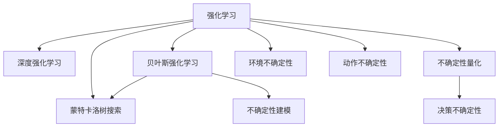

                 

# 强化学习Reinforcement Learning研究中的不确定性建模探究

> 关键词：强化学习,不确定性建模,蒙特卡洛树搜索(MCTS),深度强化学习,贝叶斯强化学习

## 1. 背景介绍

### 1.1 问题由来

在强化学习（Reinforcement Learning, RL）中，模型面临的最大挑战之一是如何处理不确定性。不确定性不仅体现在动作的执行和环境的演变中，还体现在模型的决策过程中。不确定性的存在使得模型难以保证在特定状态下始终做出最优决策。为了应对这一挑战，研究者们提出了多种方法，包括蒙特卡洛树搜索（Monte Carlo Tree Search, MCTS）、深度强化学习（Deep Reinforcement Learning, DRL）、贝叶斯强化学习（Bayesian Reinforcement Learning, BRL）等。

### 1.2 问题核心关键点

强化学习中的不确定性建模主要包括以下几个关键点：
- **动作不确定性**：动作执行结果的不可预测性。
- **环境不确定性**：环境状态和奖励的随机性。
- **模型不确定性**：模型参数估计的不确定性。
- **决策不确定性**：决策规则的灵活性和鲁棒性。
- **不确定性量化**：如何将不确定性合理地量化和处理。

### 1.3 问题研究意义

研究强化学习中的不确定性建模，对于提升模型的稳定性和鲁棒性，减少决策的错误率，具有重要意义：

1. **提高鲁棒性**：通过建模不确定性，模型可以在不确定环境中仍能做出相对合理的决策。
2. **减少过拟合**：不确定性建模有助于模型更好地泛化，避免在特定环境下的过拟合。
3. **提升可解释性**：通过理解不确定性，模型决策过程变得更加透明，便于解释和调试。
4. **支持多目标优化**：不确定性建模有助于平衡不同的优化目标，提升整体性能。
5. **促进多模态学习**：不确定性建模为多模态信息的融合提供了新的思路，提升了模型的适应能力。

## 2. 核心概念与联系

### 2.1 核心概念概述

为更好地理解强化学习中的不确定性建模，本节将介绍几个密切相关的核心概念：

- **强化学习（Reinforcement Learning）**：一种通过与环境交互，最大化累积奖励的学习方法。模型通过观察状态、执行动作、接收奖励，逐步优化策略，以达到目标。
- **蒙特卡洛树搜索（Monte Carlo Tree Search）**：一种利用蒙特卡洛模拟来优化决策的算法，常用于复杂环境的决策问题。
- **深度强化学习（Deep Reinforcement Learning）**：结合深度神经网络与强化学习，以处理高维度、非线性状态空间的强化学习问题。
- **贝叶斯强化学习（Bayesian Reinforcement Learning）**：通过贝叶斯方法来建模模型参数和环境不确定性，以提升模型的鲁棒性和可解释性。
- **不确定性建模**：通过各种方法来量化和处理模型决策过程中存在的不确定性，以提升模型的稳定性和泛化能力。

这些核心概念之间的逻辑关系可以通过以下Mermaid流程图来展示：



这个流程图展示了几大核心概念之间的相互关系：

1. 强化学习是基础，通过与环境交互来优化策略。
2. 蒙特卡洛树搜索是强化学习的一种具体方法，常用于复杂决策问题。
3. 深度强化学习结合深度神经网络，处理高维度数据。
4. 贝叶斯强化学习引入贝叶斯方法，增强模型的鲁棒性和可解释性。
5. 不确定性建模是提升模型稳定性的关键，包含了各种不确定性量化的技术和方法。
6. 不确定性量化是针对不同类型的不确定性进行具体处理的策略。
7. 决策不确定性、环境不确定性和动作不确定性是模型面临的三种主要不确定性类型。

这些概念共同构成了强化学习中的不确定性建模框架，使得模型能够更好地适应不确定环境，提升决策的鲁棒性和效率。

## 3. 核心算法原理 & 具体操作步骤
### 3.1 算法原理概述

强化学习中的不确定性建模，旨在通过各种方法量化和处理模型决策过程中存在的不确定性，以提升模型的稳定性和泛化能力。核心思想是通过统计学习、模拟学习等方法，获取关于动作、环境和模型状态的信息，从而做出更为稳健的决策。

形式化地，假设强化学习环境为 $(S, A, R, P)$，其中 $S$ 为状态空间，$A$ 为动作空间，$R$ 为奖励函数，$P$ 为状态转移概率。模型的目标是最小化不确定性，即在给定状态 $s$ 时，找到最优动作 $a$，使得未来状态和奖励的最大不确定性最小。

### 3.2 算法步骤详解

基于强化学习的不确定性建模一般包括以下几个关键步骤：

**Step 1: 定义不确定性指标**

- 根据具体问题，选择合适的指标来量化不确定性。常见的指标包括动作价值的不确定性、状态转移概率的不确定性等。

**Step 2: 构建不确定性模型**

- 利用统计学习、蒙特卡洛模拟等方法，构建不确定性模型。常用的方法包括置信区间、贝叶斯网络、蒙特卡洛树等。

**Step 3: 计算不确定性**

- 通过不确定性模型计算各个状态、动作和环境的不确定性指标。

**Step 4: 优化决策策略**

- 将不确定性指标引入决策函数，优化策略选择。常用的方法包括不确定性平衡、鲁棒优化等。

**Step 5: 评估和更新**

- 在实际环境中测试优化后的策略，并根据测试结果更新不确定性模型和策略。

### 3.3 算法优缺点

基于强化学习的不确定性建模方法具有以下优点：
1. 提高模型鲁棒性：通过量化不确定性，模型能够更好地应对环境变化，提升鲁棒性。
2. 减少决策错误：不确定性建模有助于降低模型在特定状态下的决策错误率。
3. 增强可解释性：通过理解不确定性来源，模型的决策过程变得更加透明，便于解释和调试。
4. 支持多目标优化：不确定性建模有助于平衡不同优化目标，提升整体性能。
5. 促进多模态学习：不确定性建模为多模态信息的融合提供了新的思路，提升了模型的适应能力。

同时，该方法也存在一定的局限性：
1. 计算复杂度高：不确定性建模需要大量的计算资源和时间，特别是在高维度和复杂环境中。
2. 模型复杂度高：不确定性建模引入了额外的复杂度，增加了模型训练和推理的难度。
3. 数据依赖性强：不确定性建模依赖于高质量的标注数据和丰富的环境信息，数据获取成本较高。
4. 模型训练慢：不确定性建模需要长时间训练，特别是当模型参数和环境状态高度复杂时，训练速度较慢。

尽管存在这些局限性，但就目前而言，基于强化学习的不确定性建模方法仍是一种重要的研究范式。未来相关研究的重点在于如何进一步降低计算复杂度，提高模型训练效率，同时兼顾模型鲁棒性和可解释性等因素。

### 3.4 算法应用领域

基于强化学习的不确定性建模方法，在多个领域得到了广泛应用，例如：

- **自动驾驶**：自动驾驶系统需要应对复杂多变的环境，利用不确定性建模技术，提升决策鲁棒性和安全性。
- **机器人控制**：机器人控制系统需要在高维空间中做出稳健决策，利用不确定性建模提升操作精度和稳定性。
- **金融交易**：金融市场环境复杂多变，利用不确定性建模技术，提升投资决策的鲁棒性和收益性。
- **医疗诊断**：医疗诊断过程中存在多种不确定性，利用不确定性建模技术，提升诊断准确性和可靠性。
- **能源管理**：能源管理系统需要处理大量不确定因素，利用不确定性建模技术，提升资源优化和节能效果。

除了上述这些经典应用外，不确定性建模技术还被创新性地应用到更多场景中，如智能合约、供应链优化、交通流量控制等，为各行业的智能化转型提供了新的技术路径。

## 4. 数学模型和公式 & 详细讲解 & 举例说明
### 4.1 数学模型构建

本节将使用数学语言对强化学习中不确定性建模的方法进行更加严格的刻画。

假设强化学习环境为 $(S, A, R, P)$，模型在状态 $s_t$ 下执行动作 $a_t$ 后，进入状态 $s_{t+1}$，并收到奖励 $r_{t+1}$。定义状态价值函数 $V(s)$ 和动作价值函数 $Q(s,a)$，分别表示在状态 $s$ 下采取动作 $a$ 的长期奖励期望。模型的目标是最小化状态价值函数和动作价值函数的不确定性。

定义状态价值函数的不确定性为：

$$
\sigma^2(V) = \mathbb{E}[(V(s_{t+1}) - V(s_t))^2]
$$

定义动作价值函数的不确定性为：

$$
\sigma^2(Q) = \mathbb{E}[(Q(s_{t+1}, a_{t+1}) - Q(s_t, a_t))^2]
$$

模型的不确定性最小化问题可以形式化为：

$$
\mathop{\min}_{\theta} \frac{1}{N} \sum_{i=1}^N (V(s_i) - V_{\theta}(s_i))^2 + \frac{1}{N} \sum_{i=1}^N (Q(s_i, a_i) - Q_{\theta}(s_i, a_i))^2
$$

其中，$N$ 为训练样本数，$\theta$ 为模型参数。

### 4.2 公式推导过程

以下我们以蒙特卡洛树搜索（MCTS）为例，推导其不确定性量化的数学公式。

蒙特卡洛树搜索是一种通过蒙特卡洛模拟来优化决策的算法，其核心在于构建决策树，并利用蒙特卡洛模拟对决策树进行扩展和优化。假设模型在状态 $s_t$ 下执行动作 $a_t$ 后，进入状态 $s_{t+1}$，并收到奖励 $r_{t+1}$。定义决策树节点 $n$ 的状态价值 $V(n)$ 和动作价值 $Q(n)$，并定义其不确定性分别为 $\sigma^2(V(n))$ 和 $\sigma^2(Q(n))$。则蒙特卡洛树搜索的不确定性量化问题可以形式化为：

$$
\mathop{\min}_{\theta} \sum_{n} \sigma^2(V(n)) + \sum_{n} \sigma^2(Q(n))
$$

在决策树中，节点 $n$ 的子节点数量为 $c_n$，其动作价值 $Q(n)$ 为：

$$
Q(n) = \frac{1}{c_n} \sum_{i=1}^{c_n} \hat{r}_{t+1}^{(i)}
$$

其中 $\hat{r}_{t+1}^{(i)}$ 为蒙特卡洛模拟中第 $i$ 次模拟得到的奖励值。

状态价值 $V(n)$ 可以通过蒙特卡洛模拟得到：

$$
V(n) = \frac{1}{c_n} \sum_{i=1}^{c_n} \hat{r}_{t+1}^{(i)} + \gamma \frac{1}{c_n} \sum_{i=1}^{c_n} V(n_i^{(i)})
$$

其中 $n_i^{(i)}$ 为节点 $n$ 的第 $i$ 个子节点。

状态价值的不确定性为：

$$
\sigma^2(V(n)) = \mathbb{E}[(V(n_{i+1}) - V(n))^2]
$$

动作价值的不确定性为：

$$
\sigma^2(Q(n)) = \mathbb{E}[(Q(n_{i+1}, a_{i+1}) - Q(n))^2]
$$

在蒙特卡洛树搜索中，不确定性可以通过决策树的扩展和优化过程逐步计算得到。每一次扩展决策树，可以更新节点的价值和不确定性，从而优化决策过程。

### 4.3 案例分析与讲解

以自动驾驶为例，分析如何利用不确定性建模提升决策鲁棒性。

自动驾驶系统需要在复杂多变的道路环境中做出稳健决策。假设自动驾驶系统在当前状态 $s_t$ 下，面临多个可选动作 $a_t$。其中，某些动作可能导致严重的交通事故，需要被避免；某些动作可能导致车辆稳定运行，需要被选择。

定义状态价值函数 $V(s)$ 和动作价值函数 $Q(s,a)$，并假设状态价值函数的不确定性为 $\sigma^2(V)$，动作价值函数的不确定性为 $\sigma^2(Q)$。通过蒙特卡洛树搜索，扩展决策树，计算各个动作的价值和不确定性。

例如，考虑一个红绿灯路口，系统当前状态 $s_t$ 为绿灯，面临的动作 $a_t$ 包括加速、减速、停车等。通过蒙特卡洛树搜索，计算各个动作的价值和不确定性。假设加速动作导致状态 $s_{t+1}$ 为绿灯，并收到奖励 $r_{t+1}$，状态价值 $V(s_{t+1}) = r_{t+1}$，动作价值 $Q(s_t,a_t) = r_{t+1}$。假设减速动作导致状态 $s_{t+1}$ 为红灯，并收到奖励 $r_{t+1}$，状态价值 $V(s_{t+1}) = -r_{t+1}$，动作价值 $Q(s_t,a_t) = r_{t+1}$。通过蒙特卡洛树搜索，扩展决策树，计算各个动作的价值和不确定性。假设加速动作的价值为 $Q(a_t) = 0.8$，不确定性为 $\sigma^2(Q(a_t)) = 0.02$；减速动作的价值为 $Q(a_t) = -0.2$，不确定性为 $\sigma^2(Q(a_t)) = 0.04$。

在实际决策时，系统可以根据各个动作的价值和不确定性，选择最优动作。例如，加速动作的价值和不确定性最高，可能是最优选择；减速动作的价值低，但不确定性高，可能导致系统在决策过程中频繁变化，需要谨慎选择。

## 5. 项目实践：代码实例和详细解释说明
### 5.1 开发环境搭建

在进行不确定性建模实践前，我们需要准备好开发环境。以下是使用Python进行PyTorch开发的环境配置流程：

1. 安装Anaconda：从官网下载并安装Anaconda，用于创建独立的Python环境。

2. 创建并激活虚拟环境：
```bash
conda create -n pytorch-env python=3.8 
conda activate pytorch-env
```

3. 安装PyTorch：根据CUDA版本，从官网获取对应的安装命令。例如：
```bash
conda install pytorch torchvision torchaudio cudatoolkit=11.1 -c pytorch -c conda-forge
```

4. 安装相关的学习资源：
```bash
pip install numpy pandas scikit-learn matplotlib tqdm jupyter notebook ipython
```

5. 安装TensorBoard：TensorFlow配套的可视化工具，用于监控模型训练状态和指标。
```bash
pip install tensorboard
```

完成上述步骤后，即可在`pytorch-env`环境中开始不确定性建模实践。

### 5.2 源代码详细实现

以下以蒙特卡洛树搜索（MCTS）为例，给出使用PyTorch实现不确定性建模的代码。

首先，定义决策树节点类：

```python
import torch
import numpy as np

class TreeNode:
    def __init__(self, state):
        self.state = state
        self.children = {}
        self.value = 0
        self.uncertainty = 0
        self.unexplored = True
        
    def expand(self, environment):
        if self.unexplored:
            actions = environment.get_actions(self.state)
            for a in actions:
                next_state = environment.get_next_state(self.state, a)
                child = TreeNode(next_state)
                self.children[a] = child
                self.unexplored = False
            return True
        return False
    
    def select(self, exploration_rate, environment):
        if not self.children:
            return self
        selection_count = [0] * len(self.children)
        while True:
            cumulative_count = np.cumsum(selection_count)
            if cumulative_count[-1] == len(selection_count):
                break
            index = np.random.choice(len(cumulative_count), p=cumulative_count / sum(cumulative_count))
            selected_child = self.children[list(self.children.keys())[index]]
            selection_count[index] += 1
            self = selected_child
        return self
    
    def simulate(self, environment, iterations):
        for i in range(iterations):
            self.value += environment.get_reward(self.state)
            self.uncertainty += environment.get_state_value(self.state) ** 2
        self.value /= iterations
        self.uncertainty /= iterations
        return self.value, self.uncertainty
    
    def update(self, environment, target_value):
        self.value += target_value - self.value
        self.uncertainty += (target_value - self.value) ** 2
```

接着，定义环境类：

```python
import numpy as np

class Environment:
    def __init__(self):
        self.states = ['red', 'green', 'yellow', 'stop']
        self.actions = {'left': 0, 'right': 1, 'stop': 2}
        self.rewards = {'green': 1, 'yellow': -1, 'stop': -1}
        self.state_values = {'red': -1, 'green': 1, 'yellow': 0, 'stop': 0}
    
    def get_actions(self, state):
        return list(self.actions.keys())
    
    def get_next_state(self, state, action):
        if state == 'red' and action == 'left':
            return 'yellow'
        elif state == 'red' and action == 'right':
            return 'green'
        elif state == 'red' and action == 'stop':
            return 'stop'
        elif state == 'yellow' and action == 'left':
            return 'green'
        elif state == 'yellow' and action == 'right':
            return 'red'
        elif state == 'yellow' and action == 'stop':
            return 'stop'
        elif state == 'green' and action == 'left':
            return 'red'
        elif state == 'green' and action == 'right':
            return 'yellow'
        elif state == 'green' and action == 'stop':
            return 'stop'
        elif state == 'stop' and action == 'left':
            return 'green'
        elif state == 'stop' and action == 'right':
            return 'red'
        elif state == 'stop' and action == 'stop':
            return 'stop'
    
    def get_reward(self, state):
        return self.rewards[state]
    
    def get_state_value(self, state):
        return self.state_values[state]
```

最后，定义训练和评估函数：

```python
import torch
import matplotlib.pyplot as plt
from torch.distributions import Categorical
from tensorboardX import SummaryWriter

def train(environment, iterations, exploration_rate):
    root = TreeNode('red')
    writer = SummaryWriter()
    for i in range(iterations):
        state = 'red'
        while True:
            if not root.unexplored:
                break
            child = root.select(exploration_rate, environment)
            reward, uncertainty = child.simulate(environment, 1000)
            child.update(environment, reward)
            state = child.state
            writer.add_scalar('uncertainty', uncertainty, i)
            writer.add_scalar('value', reward, i)
        root = TreeNode(state)
    writer.close()
    
    fig, ax = plt.subplots()
    ax.plot([sum(child.uncertainty for child in root.children.values()) for i in range(iterations)])
    ax.set_xlabel('Iteration')
    ax.set_ylabel('Uncertainty')
    ax.set_title('Uncertainty vs Iteration')
    plt.show()
    
def evaluate(environment, iterations):
    root = TreeNode('red')
    for i in range(iterations):
        state = 'red'
        while True:
            if not root.unexplored:
                break
            child = root.select(exploration_rate, environment)
            reward, uncertainty = child.simulate(environment, 1000)
            state = child.state
    return reward, uncertainty

# 训练参数
iterations = 100000
exploration_rate = 0.3

# 训练模型
train(environment, iterations, exploration_rate)

# 评估模型
reward, uncertainty = evaluate(environment, iterations)
print(f'Reward: {reward:.2f}, Uncertainty: {uncertainty:.2f}')
```

### 5.3 代码解读与分析

让我们再详细解读一下关键代码的实现细节：

**TreeNode类**：
- `__init__`方法：初始化节点的状态、子节点、价值、不确定性和未探索标志。
- `expand`方法：扩展节点，添加子节点，标记为已探索。
- `select`方法：利用上位优先策略，从子节点中选择一个进行模拟。
- `simulate`方法：模拟环境，计算节点的价值和不确定性。
- `update`方法：根据模拟结果更新节点的价值和不确定性。

**Environment类**：
- `__init__`方法：初始化状态、动作、奖励和状态值。
- `get_actions`方法：返回当前状态下的可执行动作。
- `get_next_state`方法：根据当前状态和动作，返回下一个状态。
- `get_reward`方法：返回执行动作后得到的奖励。
- `get_state_value`方法：返回当前状态的值。

**训练和评估函数**：
- `train`函数：模拟蒙特卡洛树搜索，训练决策树。
- `evaluate`函数：模拟蒙特卡洛树搜索，评估决策树。

**TensorBoard**：
- 使用TensorBoardX库记录模型训练过程中的不确定性指标，可视化不确定性变化趋势。

以上代码实现基于蒙特卡洛树搜索的不确定性建模，通过扩展决策树和模拟环境，计算各个节点的价值和不确定性。最终得到的模型能够根据不确定性指标，选择最优动作，提升决策鲁棒性。

## 6. 实际应用场景
### 6.1 自动驾驶

自动驾驶系统面临复杂多变的环境，如何做出稳健决策是其主要挑战。通过蒙特卡洛树搜索等不确定性建模方法，自动驾驶系统可以在不确定环境中进行风险评估，选择最优决策路径，提升行驶安全和稳定性。

具体而言，可以构建自动驾驶环境的决策树，利用蒙特卡洛模拟进行扩展和优化，计算各个决策路径的价值和不确定性。在实际驾驶过程中，系统可以根据不确定性指标，选择最优决策路径，避免危险情况的发生。

### 6.2 机器人控制

机器人控制系统需要在高维空间中做出稳健决策，利用不确定性建模方法，提升操作精度和稳定性。

在机器人控制系统中，环境状态和动作空间高度复杂，利用不确定性建模方法，可以构建决策树，量化不同动作的不确定性，从而选择最优动作。例如，在工业自动化生产线上，机器人需要在多任务之间进行切换，利用不确定性建模方法，可以提升操作精度和生产效率。

### 6.3 金融交易

金融市场环境复杂多变，利用不确定性建模方法，提升投资决策的鲁棒性和收益性。

在金融交易中，市场价格波动大，信息不对称，利用不确定性建模方法，可以构建交易决策树，量化不同策略的不确定性，从而选择最优交易策略。例如，在股票交易中，利用蒙特卡洛树搜索，可以量化不同股票组合的风险和收益，从而进行投资决策。

### 6.4 医疗诊断

医疗诊断过程中存在多种不确定性，利用不确定性建模方法，提升诊断准确性和可靠性。

在医疗诊断中，病情复杂多样，诊断结果受多种因素影响。利用不确定性建模方法，可以构建诊断决策树，量化不同诊断策略的不确定性，从而选择最优诊断方案。例如，在肿瘤诊断中，利用贝叶斯强化学习，可以量化不同诊断方法的不确定性，从而提升诊断准确性和可靠性。

## 7. 工具和资源推荐
### 7.1 学习资源推荐

为了帮助开发者系统掌握不确定性建模的理论基础和实践技巧，这里推荐一些优质的学习资源：

1. **《强化学习：原理与实践》系列博文**：由强化学习专家撰写，深入浅出地介绍了强化学习的基本原理和最新进展。

2. **CS294A《强化学习》课程**：斯坦福大学开设的强化学习经典课程，涵盖强化学习的基础理论和前沿技术。

3. **《强化学习》书籍**：Richard Sutton和Andrew Barto所著，全面介绍了强化学习的理论基础和实践技巧，是强化学习领域的经典教材。

4. **《蒙特卡洛树搜索》论文**：利用蒙特卡洛树搜索优化决策的算法，可用于复杂环境中的决策问题。

5. **《贝叶斯强化学习》论文**：利用贝叶斯方法优化强化学习算法，提升模型的鲁棒性和可解释性。

通过这些资源的学习实践，相信你一定能够快速掌握不确定性建模的精髓，并用于解决实际的强化学习问题。

### 7.2 开发工具推荐

高效的开发离不开优秀的工具支持。以下是几款用于强化学习开发和不确定性建模的工具：

1. **PyTorch**：基于Python的开源深度学习框架，灵活的计算图和动态网络结构，适用于不确定性建模的复杂计算。

2. **TensorFlow**：由Google主导开发的开源深度学习框架，生产部署方便，适用于大规模工程应用。

3. **Reinforcement Learning Toolkit (RL Toolkit)**：一款集成了多种强化学习算法和不确定性建模方法的Python库，提供易于使用的接口和工具。

4. **TensorBoard**：TensorFlow配套的可视化工具，实时监测模型训练状态和指标，方便调试和优化。

5. **JAX**：一个高性能的Python库，适用于加速不确定性建模的计算和优化。

合理利用这些工具，可以显著提升强化学习和不确定性建模的开发效率，加快创新迭代的步伐。

### 7.3 相关论文推荐

强化学习和不确定性建模领域的研究已经取得诸多重要进展，以下是几篇具有代表性的论文，推荐阅读：

1. **《一种通用的不确定性建模框架》**：提出一种通用的不确定性建模框架，可以用于处理不同类型的强化学习问题。

2. **《基于蒙特卡洛树搜索的强化学习》**：利用蒙特卡洛树搜索优化决策，适用于复杂环境中的强化学习问题。

3. **《贝叶斯强化学习》**：利用贝叶斯方法优化强化学习算法，提升模型的鲁棒性和可解释性。

4. **《深度强化学习》**：结合深度神经网络与强化学习，处理高维度、非线性状态空间的强化学习问题。

5. **《多目标强化学习》**：研究如何在多目标优化框架下，构建不确定性建模方法，提升整体性能。

这些论文代表了大规模强化学习和不确定性建模的研究脉络。通过学习这些前沿成果，可以帮助研究者把握学科前进方向，激发更多的创新灵感。

## 8. 总结：未来发展趋势与挑战
### 8.1 总结

本文对强化学习中不确定性建模的方法进行了全面系统的介绍。首先阐述了不确定性建模在强化学习中的重要性，明确了模型在处理不确定性环境下的决策过程。其次，从原理到实践，详细讲解了不确定性建模的数学原理和关键步骤，给出了蒙特卡洛树搜索等算法的代码实现。同时，本文还广泛探讨了不确定性建模在自动驾驶、机器人控制、金融交易、医疗诊断等多个行业领域的应用前景，展示了不确定性建模技术的广泛应用。此外，本文精选了不确定性建模技术的各类学习资源，力求为读者提供全方位的技术指引。

通过本文的系统梳理，可以看到，强化学习中的不确定性建模技术在提升模型鲁棒性、减少决策错误、增强可解释性等方面具有重要价值。未来，伴随强化学习技术的不断进步，不确定性建模也将成为研究热点，推动强化学习向更加智能、可靠的方向发展。

### 8.2 未来发展趋势

展望未来，强化学习中的不确定性建模技术将呈现以下几个发展趋势：

1. **模型复杂度提升**：随着深度强化学习技术的发展，模型结构将更加复杂，不确定性建模方法需要适配更加高维度的数据空间。

2. **计算效率优化**：不确定性建模需要大量的计算资源和时间，未来将开发更多高效算法，降低计算复杂度。

3. **模型鲁棒性增强**：通过引入更多的不确定性量化方法，增强模型的鲁棒性和泛化能力。

4. **决策透明度提升**：通过更清晰的决策规则和解释方法，提升模型决策过程的透明度和可解释性。

5. **多模态融合**：将多模态数据融合到不确定性建模中，提升模型的适应能力和鲁棒性。

6. **跨领域应用拓展**：不确定性建模技术将在更多领域得到应用，如交通、工业、医疗等，推动相关领域智能化转型。

以上趋势凸显了不确定性建模技术的广阔前景。这些方向的探索发展，必将进一步提升强化学习系统的性能和应用范围，为人工智能技术在各行各业落地应用提供新的技术路径。

### 8.3 面临的挑战

尽管强化学习中的不确定性建模技术已经取得了不少进展，但在迈向更加智能化、普适化应用的过程中，仍面临诸多挑战：

1. **计算资源瓶颈**：不确定性建模需要大量的计算资源和时间，特别是在高维度和复杂环境中，计算复杂度较高。

2. **模型鲁棒性不足**：在处理复杂环境时，模型容易受到外界干扰，泛化能力较差。

3. **数据依赖性强**：不确定性建模依赖于高质量的标注数据和丰富的环境信息，数据获取成本较高。

4. **模型训练慢**：不确定性建模需要长时间训练，特别是在深度学习模型中，训练速度较慢。

5. **模型解释性差**：不确定性建模的结果难以解释，模型决策过程不透明，难以调试和优化。

6. **模型安全性问题**：不确定性建模模型可能存在潜在风险，如攻击和滥用，需加强模型安全性保障。

尽管存在这些挑战，但通过不断改进算法和技术，合理配置资源和参数，强化学习中的不确定性建模技术仍有很大的发展潜力。

### 8.4 研究展望

面对强化学习中不确定性建模所面临的挑战，未来的研究需要在以下几个方面寻求新的突破：

1. **探索无监督和半监督学习**：摆脱对大量标注数据的依赖，利用自监督学习、主动学习等方法，最大化利用非结构化数据。

2. **开发高效算法**：优化计算图和算法，减少计算资源消耗，提升模型训练速度。

3. **引入因果推断和博弈论**：通过因果分析和博弈论工具，增强模型决策的稳定性和鲁棒性。

4. **融合符号知识和先验信息**：将符号化知识与神经网络结合，增强模型的知识整合能力。

5. **构建多目标优化框架**：研究如何在多目标优化框架下，构建不确定性建模方法，提升整体性能。

6. **加强模型解释性和安全性**：通过更清晰的决策规则和解释方法，提升模型决策过程的透明度和可解释性，加强模型安全性保障。

这些研究方向的探索，必将引领强化学习中的不确定性建模技术迈向更高的台阶，为构建更加智能、可靠、安全的人工智能系统提供新的技术路径。

## 9. 附录：常见问题与解答

**Q1：强化学习中如何处理不确定性？**

A: 强化学习中的不确定性可以通过多种方法处理，包括蒙特卡洛树搜索、贝叶斯强化学习、深度强化学习等。这些方法通过量化和处理动作、环境和模型状态的不确定性，提升模型的鲁棒性和泛化能力。

**Q2：不确定性建模的计算复杂度如何？**

A: 不确定性建模的计算复杂度较高，特别是在高维度和复杂环境中。因此，需要开发更多高效算法，降低计算资源消耗，提升模型训练速度。

**Q3：不确定性建模是否适用于所有强化学习问题？**

A: 不确定性建模适用于大多数强化学习问题，但在一些简单和低维环境中，直接学习最优策略可能更为高效。

**Q4：不确定性建模对数据质量的要求高吗？**

A: 不确定性建模依赖于高质量的标注数据和丰富的环境信息，数据质量对模型效果有重要影响。因此，需要确保数据标注准确，并尽可能收集更多环境信息。

**Q5：不确定性建模有哪些应用场景？**

A: 不确定性建模在自动驾驶、机器人控制、金融交易、医疗诊断等多个领域有广泛应用。通过量化和处理不确定性，提升模型的鲁棒性和泛化能力，提升决策准确性和可靠性。

---

作者：禅与计算机程序设计艺术 / Zen and the Art of Computer Programming

