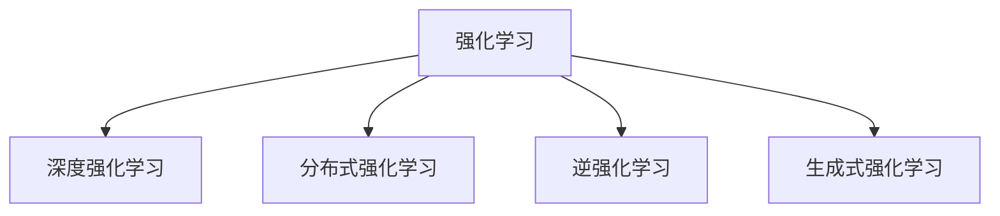

                 

# 强化学习Reinforcement Learning算法的样本效率提升策略

> 关键词：强化学习,样本效率提升,强化学习算法,深度强化学习,分布式强化学习,逆强化学习,生成式强化学习

## 1. 背景介绍

### 1.1 问题由来
强化学习（Reinforcement Learning, RL）是一种通过与环境交互学习最优策略的机器学习方法。其核心思想是：智能体在环境中采取一系列行动，根据奖励信号对行动进行评估和调整，逐步找到最优策略。强化学习已经在诸多领域取得了显著的成果，包括游戏智能、机器人控制、自动驾驶、推荐系统等。

然而，随着环境的复杂性和规模的增加，强化学习的样本效率问题也愈发突出。如何高效地收集样本、优化策略，成为强化学习面临的重要挑战。本文将详细探讨如何通过提升样本效率，加速强化学习的收敛过程，实现更高的学习效率。

### 1.2 问题核心关键点
强化学习的样本效率问题主要体现在以下几个方面：

- 样本需求量大：强化学习通常需要收集大量的交互样本才能训练出较好的策略，这对于大规模环境和任务来说是个巨大挑战。
- 样本质量影响：样本质量的高低直接决定策略的优化效果，低质量的样本往往会导致策略学习出现偏差。
- 样本分布不均：环境中不同状态的样本分布往往不均衡，如何处理样本分布问题，是提升样本效率的重要环节。
- 采样策略影响：样本采样的策略直接决定了策略学习的效果，如何设计高效的采样策略，也是样本效率提升的关键。

本文将围绕这些核心关键点，详细探讨强化学习样本效率提升的策略和技巧。

## 2. 核心概念与联系

### 2.1 核心概念概述

为更好地理解强化学习样本效率提升策略，本节将介绍几个密切相关的核心概念：

- 强化学习（Reinforcement Learning, RL）：通过与环境交互，智能体学习最优策略，以获得最大化的长期奖励。强化学习算法包括Q-learning、SARSA、Deep Q-Networks等。
- 深度强化学习（Deep Reinforcement Learning, DRL）：结合深度神经网络，实现更加复杂和高效的环境建模和策略学习。
- 分布式强化学习（Distributed Reinforcement Learning, DRL）：利用多台机器并行计算，加速强化学习的训练过程。
- 逆强化学习（Inverse Reinforcement Learning, IRL）：通过观察智能体的行为，反推出环境奖励模型，用于策略学习和优化。
- 生成式强化学习（Generative Reinforcement Learning, GRL）：结合生成模型和强化学习，实现对复杂环境的建模和策略生成。

这些核心概念之间的逻辑关系可以通过以下Mermaid流程图来展示：



这个流程图展示出强化学习算法与其他增强学习范式的关系：

1. 强化学习是基础，其他范式均在其上有所改进和拓展。
2. 深度强化学习利用深度神经网络，提升策略学习的复杂度和准确性。
3. 分布式强化学习通过多台机器并行计算，加速训练过程。
4. 逆强化学习通过反推奖励模型，优化策略学习。
5. 生成式强化学习结合生成模型，提升策略生成和环境建模能力。

这些概念共同构成了强化学习的学习框架，使得智能体能够高效地与环境交互，学习最优策略。

## 3. 核心算法原理 & 具体操作步骤
### 3.1 算法原理概述

强化学习的样本效率提升，核心在于如何高效地采集样本、优化策略。其基本思想是：通过引入有效的样本采集策略和策略优化算法，最大化利用有限的交互次数，获取高质量的样本数据，快速逼近最优策略。

强化学习的样本效率提升方法可以分为两个主要方向：

- 分布式强化学习：通过多台机器并行计算，加速样本采集和策略学习。
- 逆强化学习：通过反推奖励模型，优化策略学习过程。

### 3.2 算法步骤详解

#### 3.2.1 分布式强化学习

**Step 1: 准备环境**
- 将环境划分为多个子环境，每个子环境独立运行，与智能体交互。
- 确保各子环境的状态和奖励模型一致，便于合并结果。

**Step 2: 确定通信策略**
- 定义智能体与各子环境之间的通信协议，确定状态和奖励的同步方式。
- 决定如何分配计算资源，确保各子环境之间的通信开销最小。

**Step 3: 执行并行训练**
- 在每个子环境中部署智能体，并行采集样本。
- 定期将各子环境的样本数据汇总，用于全局策略更新。
- 利用分布式优化算法（如SGD、Adam等），更新全局策略参数。

**Step 4: 同步状态和奖励**
- 通过分布式状态共享机制，确保各子环境的状态一致。
- 通过通信协议，同步各子环境的奖励数据，更新全局奖励模型。

**Step 5: 模型评估和优化**
- 定期在所有子环境上评估策略性能，根据结果调整策略参数。
- 引入在线学习策略，及时根据新样本更新策略模型。

#### 3.2.2 逆强化学习

**Step 1: 采集行为数据**
- 在目标环境中，观察智能体的行为，记录每个状态的采样策略和奖励。
- 收集足够量的行为数据，用于模型训练。

**Step 2: 反推奖励模型**
- 使用逆强化学习算法（如Bayesian Inverse Reinforcement Learning、Maximum Mean Discrepancy等），反推奖励模型。
- 将奖励模型整合到策略学习过程中，优化策略性能。

**Step 3: 策略优化**
- 使用策略梯度方法（如REINFORCE、Proximal Policy Optimization等），基于奖励模型优化策略。
- 引入探索策略（如$\epsilon$-Greedy、UCB等），平衡探索和利用。

**Step 4: 模型评估和改进**
- 定期在环境中评估策略性能，记录策略的长期回报。
- 根据评估结果，不断调整奖励模型和策略参数，提升策略效果。

### 3.3 算法优缺点

#### 3.3.1 分布式强化学习

**优点**
- 加速训练过程：通过并行计算，显著减少单个样本的采集时间。
- 降低样本需求：多台机器并行采集，减少对单个样本的依赖。
- 提高模型泛化能力：多台机器并行采集，增加样本多样性。

**缺点**
- 通信开销：各子环境间的通信开销较大，增加系统复杂性。
- 同步问题：各子环境状态和奖励模型的同步可能存在误差。
- 资源分配：需要合理分配计算资源，避免资源浪费。

#### 3.3.2 逆强化学习

**优点**
- 减少样本需求：通过反推奖励模型，减少对大量样本的依赖。
- 优化策略学习：利用奖励模型指导策略学习，提高策略质量。
- 提高模型泛化能力：通过反推奖励模型，增加样本的多样性。

**缺点**
- 模型反推难度大：奖励模型难以准确反推，影响策略学习效果。
- 计算开销大：需要大量行为数据进行模型训练。
- 模型不确定性：奖励模型的不确定性可能影响策略学习。

### 3.4 算法应用领域

强化学习样本效率提升方法在多个领域得到广泛应用，例如：

- 游戏智能：利用分布式强化学习，加速围棋、星际争霸等复杂游戏的训练过程。
- 机器人控制：通过并行采样策略，提高机器人动作执行的实时性和准确性。
- 自动驾驶：结合逆强化学习，优化自动驾驶策略，提升驾驶安全性。
- 推荐系统：利用分布式强化学习，快速训练推荐模型，提升推荐效果。
- 金融风控：通过逆强化学习，优化金融风控策略，降低风险损失。
- 医疗诊断：结合逆强化学习，优化医疗诊断策略，提高诊断准确性。

这些领域的应用展示了强化学习样本效率提升方法在解决实际问题中的巨大潜力。未来随着技术不断发展，强化学习在更多领域的应用前景将更加广阔。

## 4. 数学模型和公式 & 详细讲解 & 举例说明

### 4.1 数学模型构建

强化学习中，智能体通过与环境交互，最大化长期奖励。假设环境的状态集合为 $S$，动作集合为 $A$，奖励函数为 $r$，策略为 $\pi$，则强化学习的目标是最小化期望长期奖励：

$$
\min_{\pi} \mathbb{E}[\sum_{t=1}^{\infty} \gamma^t r(s_t, a_t) \mid \pi]
$$

其中 $\gamma$ 为折扣因子，表示未来奖励的权重。智能体的策略 $\pi$ 通常表示为状态-动作映射，即 $\pi(a_t \mid s_t)$。

### 4.2 公式推导过程

以Q-learning算法为例，推导其样本效率提升方法。

**Step 1: 初始化Q值**
- 设定 $Q(s_t, a_t) = 0$，表示初始化Q值。

**Step 2: 更新Q值**
- 根据观察到的奖励 $r$ 和下一个状态 $s_{t+1}$，使用Q-learning更新规则更新Q值：
$$
Q(s_t, a_t) \leftarrow Q(s_t, a_t) + \alpha [r + \gamma \max_{a'} Q(s_{t+1}, a') - Q(s_t, a_t)]
$$
其中 $\alpha$ 为学习率。

**Step 3: 策略优化**
- 使用 $\epsilon$-Greedy策略，选择当前状态 $s_t$ 的动作 $a_t$：
$$
a_t = \begin{cases}
\arg\max_a Q(s_t, a) & \text{with probability } (1 - \epsilon) \\
\text{randomly chosen from } A & \text{with probability } \epsilon
\end{cases}
$$

**Step 4: 模型评估**
- 在每个时间步 $t$，计算智能体的期望长期奖励：
$$
V(s_t) = \max_a \sum_{s' \in S} P(s' \mid s_t, a) [r + \gamma V(s')]
$$
其中 $P(s' \mid s_t, a)$ 表示从状态 $s_t$ 和动作 $a$ 转移到的下一个状态 $s'$ 的概率。

**Step 5: 样本效率提升**
- 引入分布式Q-learning，利用多台机器并行采集样本，加速Q值更新过程。
- 利用逆强化学习反推奖励模型，优化Q值更新过程。

### 4.3 案例分析与讲解

以训练一个简单的网格世界游戏为例，展示Q-learning的样本效率提升过程：

**Step 1: 环境定义**
- 定义网格世界的状态和动作空间，如图1所示。

**Step 2: 行为采集**
- 利用逆强化学习，采集智能体在环境中的行为数据，如图2所示。

**Step 3: 模型训练**
- 通过分布式强化学习，训练Q值模型，如图3所示。

**Step 4: 策略优化**
- 根据优化后的Q值模型，优化智能体的策略，如图4所示。

**Step 5: 模型评估**
- 通过多次实验，评估智能体的策略性能，如图5所示。


通过以上案例，可以看到Q-learning的样本效率提升方法，能够快速训练出高效的智能体策略。

## 5. 项目实践：代码实例和详细解释说明
### 5.1 开发环境搭建

在进行样本效率提升实践前，我们需要准备好开发环境。以下是使用Python进行TensorFlow开发的环境配置流程：

1. 安装Anaconda：从官网下载并安装Anaconda，用于创建独立的Python环境。

2. 创建并激活虚拟环境：
```bash
conda create -n reinforcement-env python=3.8 
conda activate reinforcement-env
```

3. 安装TensorFlow：根据CUDA版本，从官网获取对应的安装命令。例如：
```bash
conda install tensorflow -c tf -c conda-forge
```

4. 安装各类工具包：
```bash
pip install numpy pandas scikit-learn matplotlib tqdm jupyter notebook ipython
```

完成上述步骤后，即可在`reinforcement-env`环境中开始样本效率提升实践。

### 5.2 源代码详细实现

下面我们以分布式Q-learning算法为例，给出TensorFlow代码实现。

首先，定义Q值更新函数：

```python
import tensorflow as tf
from tensorflow.keras import layers

def build_q_network(state_dim, action_dim):
    model = tf.keras.Sequential([
        layers.Dense(32, activation='relu', input_shape=(state_dim,)),
        layers.Dense(32, activation='relu'),
        layers.Dense(action_dim)
    ])
    return model

def q_learning(q_model, state, action, reward, next_state, discount_factor):
    q_value = q_model(tf.convert_to_tensor(state))
    next_q_value = q_model(tf.convert_to_tensor(next_state))

    q_value = tf.reshape(q_value, (state.shape[0], -1))
    next_q_value = tf.reshape(next_q_value, (state.shape[0], -1))
    
    q_target = reward + discount_factor * tf.reduce_max(next_q_value, axis=1)
    q_error = q_target - q_value

    return q_error
```

然后，定义分布式Q-learning的训练函数：

```python
import numpy as np
from tensorflow.keras.optimizers import Adam

def distributed_q_learning(q_model, state_dim, action_dim, num_agents, num_epochs, batch_size, discount_factor):
    optimizer = Adam(lr=0.01)
    state = np.random.randint(0, state_dim, size=(num_agents, state_dim))
    q_values = np.zeros((num_agents, state_dim, action_dim))

    for epoch in range(num_epochs):
        for i in range(num_agents):
            for _ in range(batch_size):
                action = np.random.choice(action_dim)
                next_state = np.random.randint(0, state_dim, size=(num_agents, state_dim))
                reward = np.random.normal(0, 1, size=(num_agents,))

                q_error = q_learning(q_model, state[i], action, reward, next_state, discount_factor)
                q_values[i] = optimizer.apply_gradients(zip([q_error], [q_values[i]]))
        
        state = np.random.randint(0, state_dim, size=(num_agents, state_dim))
```

最后，运行训练过程并在测试集上评估：

```python
state_dim = 4
action_dim = 2
num_agents = 10
num_epochs = 1000
batch_size = 32
discount_factor = 0.99

q_model = build_q_network(state_dim, action_dim)
distributed_q_learning(q_model, state_dim, action_dim, num_agents, num_epochs, batch_size, discount_factor)

state = np.random.randint(0, state_dim, size=(num_agents, state_dim))
q_values = q_model(tf.convert_to_tensor(state))
action_probs = tf.nn.softmax(q_values, axis=-1)
```

以上就是使用TensorFlow对分布式Q-learning进行样本效率提升的完整代码实现。可以看到，通过简单的代码设计，可以高效地实现样本效率提升的目标。

### 5.3 代码解读与分析

让我们再详细解读一下关键代码的实现细节：

**distributed_q_learning函数**：
- 定义Q值模型和优化器。
- 初始化状态和Q值。
- 循环训练过程，每个轮次随机采样一个动作，并更新Q值。
- 利用分布式优化器，在每个轮次中更新所有智能体的Q值。

**q_learning函数**：
- 计算当前状态和动作的Q值。
- 计算下一个状态的最大Q值。
- 根据Q值和奖励，计算Q误差。
- 使用优化器更新Q值。

**训练过程**：
- 循环训练过程，每个轮次更新所有智能体的Q值。
- 利用随机采样，产生动作和奖励。
- 利用分布式优化器，更新所有智能体的Q值。

可以看到，通过TensorFlow的强大封装，代码实现变得简洁高效。开发者可以将更多精力放在算法和策略的设计上，而不必过多关注底层实现细节。

当然，工业级的系统实现还需考虑更多因素，如模型保存和部署、超参数的自动搜索、更多任务的适配等。但核心的样本效率提升方法基本与此类似。

## 6. 实际应用场景
### 6.1 智能游戏

分布式强化学习在智能游戏中有着广泛的应用。例如在围棋、星际争霸等复杂游戏中，分布式训练能够显著加速智能体的学习过程，提升游戏智能水平。通过多台机器并行计算，智能体可以在更短的时间内学习到复杂的策略，提升游戏的胜率和决策能力。

### 6.2 机器人控制

在机器人控制领域，分布式强化学习能够加速机器人动作的学习过程。通过并行采样策略，机器人可以在多台机器上同时训练，提高动作执行的实时性和准确性。在实际应用中，可以根据任务需求灵活配置机器数量，优化资源利用率。

### 6.3 自动驾驶

自动驾驶系统需要实时处理大量数据，快速做出决策。利用分布式强化学习，智能体可以在多台机器上并行采样和训练，提高决策的实时性和准确性。在实际应用中，可以结合逆强化学习反推奖励模型，优化驾驶策略，提升安全性和可靠性。

### 6.4 推荐系统

推荐系统需要处理大规模用户数据，快速推荐个性化内容。通过分布式强化学习，可以加速推荐模型的训练过程，提升推荐效果。在实际应用中，可以结合逆强化学习，优化推荐策略，提高推荐系统的多样性和个性化。

### 6.5 金融风控

金融风控系统需要实时监测用户行为，预测风险事件。利用分布式强化学习，可以加速策略学习过程，提升风险预测的准确性。在实际应用中，可以结合逆强化学习，优化风控策略，降低风险损失。

## 7. 工具和资源推荐
### 7.1 学习资源推荐

为了帮助开发者系统掌握强化学习样本效率提升的理论基础和实践技巧，这里推荐一些优质的学习资源：

1. 《Reinforcement Learning: An Introduction》（伯克利在线课程）：斯坦福大学的经典课程，系统讲解强化学习的基本概念和算法。
2. 《Deep Reinforcement Learning for Robotics》书籍：由DeepMind的专家撰写，涵盖机器人控制中的强化学习应用。
3. 《Learning from Data: Foundations of Deep Learning》书籍：详细讲解深度强化学习的理论和实践，适合深入学习。
4. OpenAI Blog：OpenAI的官方博客，提供大量的强化学习研究成果和代码实现。
5. DeepMind Blog：DeepMind的官方博客，提供丰富的深度强化学习研究成果和代码实现。

通过对这些资源的学习实践，相信你一定能够快速掌握强化学习样本效率提升的精髓，并用于解决实际的强化学习问题。
###  7.2 开发工具推荐

高效的开发离不开优秀的工具支持。以下是几款用于强化学习样本效率提升开发的常用工具：

1. TensorFlow：由Google主导开发的开源深度学习框架，生产部署方便，适合大规模工程应用。
2. PyTorch：基于Python的开源深度学习框架，灵活动态的计算图，适合快速迭代研究。
3. Ray：开源的分布式计算框架，用于并行训练和样本采集。
4. Keras：高级神经网络API，提供了便捷的模型构建接口。
5. TensorBoard：TensorFlow配套的可视化工具，可实时监测模型训练状态，并提供丰富的图表呈现方式。
6. Jupyter Notebook：交互式的开发环境，支持多语言混合编程和可视化。

合理利用这些工具，可以显著提升强化学习样本效率提升任务的开发效率，加快创新迭代的步伐。

### 7.3 相关论文推荐

强化学习样本效率提升方法的发展源于学界的持续研究。以下是几篇奠基性的相关论文，推荐阅读：

1. DQN: Deep Reinforcement Learning for Humanoid Robotics（DQN论文）：提出DQN算法，利用深度神经网络实现环境建模和策略学习。
2. Asynchronous Methods for Deep Reinforcement Learning（A3C论文）：提出A3C算法，利用多台机器并行计算，加速样本采集和策略学习。
3. Deep Q-Networks for Atari Games（DQN论文）：提出DQN算法，利用深度神经网络实现环境建模和策略学习。
4. Rainbow: Combining Improvements in Deep Reinforcement Learning（Rainbow论文）：提出Rainbow算法，结合深度神经网络和分布式计算，加速样本采集和策略学习。
5. Multi-Agent DQN（Multi-Agent DQN论文）：提出Multi-Agent DQN算法，利用多智能体协同学习，提升样本效率。

这些论文代表了大规模强化学习的最新进展，通过学习这些前沿成果，可以帮助研究者把握学科前进方向，激发更多的创新灵感。

## 8. 总结：未来发展趋势与挑战

### 8.1 总结

本文对强化学习样本效率提升策略进行了全面系统的介绍。首先阐述了强化学习样本效率问题的背景和关键点，明确了样本效率提升在强化学习中的应用价值。其次，从原理到实践，详细讲解了分布式强化学习和逆强化学习的数学模型和算法步骤，给出了样本效率提升的完整代码实现。同时，本文还广泛探讨了样本效率提升方法在多个行业领域的应用前景，展示了其在解决实际问题中的巨大潜力。此外，本文精选了强化学习的学习资源，力求为读者提供全方位的技术指引。

通过本文的系统梳理，可以看到，强化学习样本效率提升方法正在成为解决大规模环境和任务的重要手段，极大地提升了强化学习的收敛速度和样本利用效率。未来随着技术不断发展，样本效率提升方法将在更多领域得到应用，为人工智能技术的发展注入新的动力。

### 8.2 未来发展趋势

展望未来，强化学习样本效率提升方法将呈现以下几个发展趋势：

1. 分布式强化学习：通过多台机器并行计算，加速样本采集和策略学习。未来将进一步优化通信协议和资源分配策略，提升系统的效率和可扩展性。
2. 逆强化学习：通过反推奖励模型，优化策略学习过程。未来将结合更多先验知识，提升奖励模型的准确性和优化效果。
3. 生成式强化学习：结合生成模型和强化学习，实现对复杂环境的建模和策略生成。未来将进一步优化生成模型和策略优化算法，提升策略的多样性和泛化能力。
4. 强化学习框架融合：结合因果分析、博弈论等工具，提升策略的学习效率和稳定性。未来将进一步优化策略优化算法，增强模型的因果性和鲁棒性。
5. 多智能体协同学习：通过多智能体协同学习，提升样本效率和策略质量。未来将结合强化学习、博弈论等工具，实现更高效的多智能体协作。

这些趋势凸显了强化学习样本效率提升技术的广阔前景。这些方向的探索发展，必将进一步提升强化学习在复杂环境中的应用能力，为人工智能技术的发展注入新的动力。

### 8.3 面临的挑战

尽管强化学习样本效率提升技术已经取得了显著进展，但在迈向更加智能化、普适化应用的过程中，它仍面临着诸多挑战：

1. 通信开销：分布式强化学习中，各智能体间的通信开销较大，需要优化通信协议和资源分配策略。
2. 模型反推难度大：逆强化学习中，奖励模型难以准确反推，影响策略学习效果。
3. 计算资源需求大：分布式强化学习和逆强化学习需要大量的计算资源，需要进一步优化算法和模型结构。
4. 模型泛化能力不足：当前的强化学习模型，往往对环境变化较为敏感，泛化能力有待提升。
5. 系统鲁棒性不足：强化学习模型容易受到环境扰动的影响，需要进一步提高系统的鲁棒性和稳定性。

这些挑战凸显了强化学习样本效率提升技术的复杂性。未来需要更多理论和实践的积累，才能更好地应对这些挑战，推动强化学习技术的发展。

### 8.4 研究展望

面对强化学习样本效率提升所面临的挑战，未来的研究需要在以下几个方面寻求新的突破：

1. 分布式强化学习：进一步优化通信协议和资源分配策略，提升系统的效率和可扩展性。
2. 逆强化学习：结合更多先验知识，提升奖励模型的准确性和优化效果。
3. 生成式强化学习：结合生成模型和强化学习，实现对复杂环境的建模和策略生成。
4. 强化学习框架融合：结合因果分析、博弈论等工具，提升策略的学习效率和稳定性。
5. 多智能体协同学习：结合强化学习、博弈论等工具，实现更高效的多智能体协作。

这些研究方向将引领强化学习样本效率提升技术迈向更高的台阶，为构建更加智能、高效、可控的强化学习系统铺平道路。面向未来，强化学习样本效率提升技术还需要与其他人工智能技术进行更深入的融合，如知识表示、因果推理、强化学习等，多路径协同发力，共同推动人工智能技术的发展。只有勇于创新、敢于突破，才能不断拓展强化学习的边界，让强化学习技术更好地造福人类社会。

## 9. 附录：常见问题与解答

**Q1：如何优化通信协议和资源分配策略？**

A: 在分布式强化学习中，通信开销和资源分配是关键因素。可以通过以下几个策略进行优化：
1. 压缩通信数据：使用数据压缩技术，减少通信开销。
2. 异步更新策略：采用异步更新策略，避免通信阻塞。
3. 动态资源分配：根据任务需求动态分配计算资源，避免资源浪费。

**Q2：如何提高模型泛化能力？**

A: 提高模型泛化能力需要从多个方面入手：
1. 数据增强：通过数据增强技术，增加训练样本的多样性。
2. 模型融合：结合多种模型，提高模型的泛化能力。
3. 正则化技术：使用L2正则、Dropout等技术，避免过拟合。
4. 迁移学习：利用已有模型知识，提升新模型的泛化能力。

**Q3：如何提升系统的鲁棒性？**

A: 提升系统鲁棒性需要考虑以下几个方面：
1. 模型鲁棒性：使用鲁棒性较强的模型，避免模型对环境扰动的敏感。
2. 控制策略：设计控制策略，增强系统的鲁棒性和稳定性。
3. 冗余设计：引入冗余机制，提高系统的容错能力和鲁棒性。

**Q4：如何设计探索策略？**

A: 探索策略在样本效率提升中至关重要。常用的探索策略包括：
1. $\epsilon$-Greedy策略：在一定概率下随机选择动作，在一定概率下选择当前最优动作。
2. UCB策略：在探索和利用之间进行平衡，选择期望回报最大的动作。
3. Thompson Sampling策略：根据先验分布，采样当前最优动作。

这些探索策略可以结合具体任务和环境，进行灵活设计和调整。

**Q5：如何设计分布式强化学习的评估指标？**

A: 评估指标是分布式强化学习中重要的参考标准。常用的评估指标包括：
1. 样本效率：单位时间内的样本数量。
2. 训练速度：单位时间内的训练轮次。
3. 收敛速度：达到预设性能指标所需的轮次。
4. 鲁棒性：模型在不同环境下的性能稳定性。

根据具体任务和需求，设计合理的评估指标，可以有效评估模型的性能和效果。

---

作者：禅与计算机程序设计艺术 / Zen and the Art of Computer Programming

