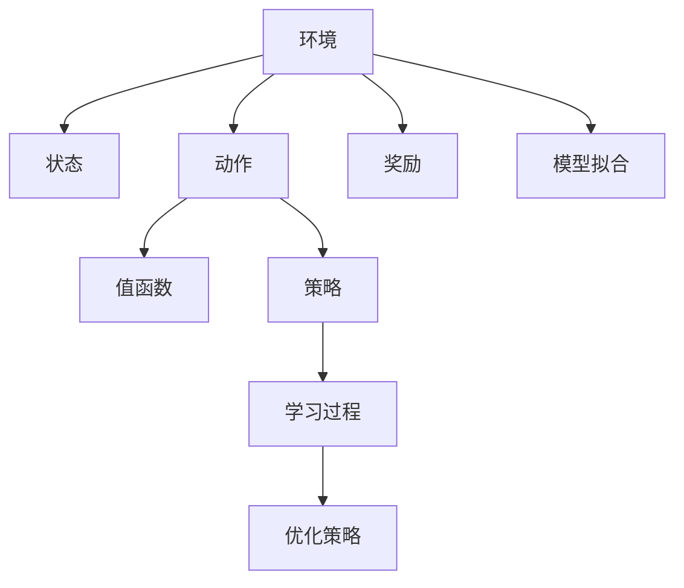

                 

# 强化学习在游戏AI中的应用:超越人类玩家

> 关键词：强化学习, 游戏AI, 超人类玩家, 深度学习, 最优策略, 路径规划, 计算复杂度, 预训练, 策略优化

## 1. 背景介绍

### 1.1 问题由来
在过去的几十年里，人工智能(AI)技术的进步在许多领域取得了显著成果。而在电子游戏中，AI算法的引入使得游戏的智能化水平大幅提升，进一步推动了游戏产业的发展。特别是在策略游戏和即时战略游戏中，AI玩家的实力不断逼近甚至超越人类玩家，游戏体验因此更加丰富。

近年来，强化学习(Reinforcement Learning, RL)在电子游戏中的应用逐渐成为研究热点。它通过让AI玩家在游戏环境中与环境互动，不断优化策略，以实现最大化收益（例如分数、资源等）的目标。在电子游戏中，强化学习的应用涉及到路径规划、资源管理、战术决策等诸多复杂任务，具有极高的研究价值和应用前景。

### 1.2 问题核心关键点
强化学习在游戏AI中的应用关键在于：

- 通过奖励机制和惩罚机制，让AI玩家在游戏环境中进行智能决策。
- 通过迭代训练过程，不断优化AI玩家的策略。
- 实现AI玩家与人类玩家的性能比较，甚至在某些游戏中超越人类。
- 应用到不同类型的游戏，如策略游戏、即时战略游戏、射击游戏等。

这一研究领域的突破将使AI技术在游戏中的表现更加智能和灵活，为玩家提供更加真实和富有挑战性的游戏体验。

### 1.3 问题研究意义
研究强化学习在游戏AI中的应用，具有以下几方面的意义：

1. **推动游戏AI技术发展**：强化学习在电子游戏中的成功应用，展示了其强大的通用性和实用性，为游戏AI技术的进一步研究和应用提供了重要参考。
2. **提升游戏体验**：通过AI玩家的高级策略，增强游戏的趣味性和挑战性，使玩家能够在更高水平上进行竞技。
3. **促进技术创新**：强化学习在游戏中的成功应用，有助于推动更广泛的人工智能技术研发，尤其是在复杂任务处理和决策优化方面。
4. **行业应用潜力**：游戏AI的成功可以启发并应用于其他领域，如无人驾驶、机器人控制等，具有巨大的产业价值。

## 2. 核心概念与联系

### 2.1 核心概念概述

为更好地理解强化学习在游戏AI中的应用，本节将介绍几个密切相关的核心概念：

- **强化学习**：一种基于奖励机制的机器学习范式，通过与环境的交互，学习如何做出最优决策。在游戏AI中，环境的奖励可以是分数、资源、击败敌人等。
- **环境**：即游戏世界，AI玩家在其中进行学习和决策。
- **状态(state)**：描述游戏环境的当前状态，如地图位置、角色状态、资源分配等。
- **动作(action)**：AI玩家在游戏中的行动，如移动、攻击、收集资源等。
- **奖励(reward)**：AI玩家根据当前状态和动作从环境获得的即时反馈，鼓励优化的行为。
- **值函数(Value Function)**：估计当前状态下的最优预期奖励，通常用于策略优化。
- **策略(Policy)**：描述AI玩家如何根据状态选择动作的规则，可以通过深度学习等方法进行学习。
- **模型拟合(Model Fitting)**：使用监督学习或无监督学习的方法，为策略优化提供辅助信息。

这些核心概念之间的逻辑关系可以通过以下Mermaid流程图来展示：



这个流程图展示了强化学习在游戏AI中的应用基本流程：

1. 环境与状态交互，提供即时奖励和状态信息。
2. 根据当前状态和奖励，AI玩家选择动作。
3. 值函数用于评估动作的价值，辅助策略优化。
4. 策略指导AI玩家选择最优动作，并通过学习过程不断优化。
5. 模型拟合提供额外的辅助信息，进一步提升策略效果。

## 3. 核心算法原理 & 具体操作步骤
### 3.1 算法原理概述

强化学习在游戏AI中的应用，本质上是让AI玩家通过与环境的交互，学习如何根据当前状态和奖励做出最优的决策。算法通常包括以下几个步骤：

1. **初始化**：随机初始化环境状态，并开始学习过程。
2. **状态-动作循环**：在当前状态下，AI玩家根据策略选择动作，并观察环境的即时奖励和新的状态。
3. **值函数更新**：根据新的状态和奖励，更新值函数，评估动作的价值。
4. **策略优化**：利用值函数和奖励信息，优化策略，使AI玩家更倾向于采取高价值动作。
5. **模型拟合**：如果适用，通过监督学习或无监督学习的方法，利用环境信息来拟合模型，进一步优化策略。

这些步骤通常构成一个迭代过程，AI玩家在游戏环境中不断学习，优化策略，直至达到最优或满足特定终止条件。

### 3.2 算法步骤详解

以下是一个典型的强化学习应用于电子游戏的步骤详细讲解：

1. **环境设定**：
   - 设计游戏规则和环境，包括地图、角色、资源等。
   - 定义状态空间(state space)和动作空间(action space)。
   - 设定奖励函数(reward function)，如得分、资源数量等。

2. **初始化**：
   - 随机初始化游戏环境，设置玩家的位置、资源、敌人状态等。
   - 初始化值函数和策略，通常使用随机值或预训练模型。

3. **状态-动作循环**：
   - 在当前状态下，根据策略选择动作。
   - 执行动作，观察环境变化，包括奖励、新的状态等。
   - 根据奖励和状态，更新值函数，评估动作价值。
   - 根据值函数和策略，调整动作选择概率，优化策略。

4. **迭代更新**：
   - 重复执行状态-动作循环，直至达到预设的终止条件（如时间限制、分数限制等）。
   - 每轮迭代后，使用蒙特卡罗方法或基于模型的学习算法（如Q-learning、SARSA等）更新值函数和策略。

5. **模型拟合（可选）**：
   - 利用监督学习或无监督学习的方法，对环境数据进行拟合，更新模型。
   - 结合拟合结果，进一步优化策略。

6. **评估与优化**：
   - 在测试集中评估AI玩家的策略效果，比较与人类玩家的性能。
   - 根据评估结果，进行策略微调，优化模型。

### 3.3 算法优缺点

强化学习在游戏AI中的应用具有以下优点：

- **灵活性高**：适用于各种类型的游戏，能够适应不同的游戏环境和规则。
- **自适应性强**：AI玩家能够根据环境和对手的策略，动态调整策略。
- **不断优化**：通过迭代学习过程，不断提升AI玩家的性能。
- **性能可控**：通过设定奖励函数和参数，可以控制AI玩家的游戏行为和难度。

同时，该方法也存在一些局限性：

- **计算复杂度高**：特别是在复杂游戏中，计算复杂度可能非常高，需要高性能计算资源。
- **过拟合风险**：在缺乏多样性或高质量数据的情况下，容易发生过拟合。
- **对抗性差**：AI玩家可能在对抗策略下表现不佳，需要改进对抗训练方法。
- **缺乏解释性**：强化学习的决策过程往往缺乏可解释性，难以调试和分析。

### 3.4 算法应用领域

强化学习在游戏AI中的应用已经覆盖了从策略游戏到即时战略游戏的广泛领域，包括但不限于以下应用：

- **即时战略游戏**：如《星际争霸》《魔兽争霸》《文明》系列，AI玩家通过学习资源管理、战术布局、单位控制等策略。
- **策略游戏**：如《炉石传说》《星际之门：战术》等，AI玩家学习卡牌组合、资源分配、单位战术等。
- **射击游戏**：如《使命召唤》《守望先锋》等，AI玩家学习瞄准、策略布局、团队协作等。
- **角色扮演游戏**：如《巫师3：狂猎》《上古卷轴V：天际》等，AI玩家学习任务选择、角色发展、物品收集等。
- **电子竞技**：如《英雄联盟》《DOTA2》等，AI玩家学习英雄选择、战术配合、地图控制等。

## 4. 数学模型和公式 & 详细讲解  
### 4.1 数学模型构建

强化学习在游戏AI中的应用，通常使用马尔可夫决策过程(Markov Decision Process, MDP)来建模，MDP由以下元素组成：

1. **状态空间**：$S$，游戏环境的当前状态。
2. **动作空间**：$A$，AI玩家可执行的动作。
3. **状态转移概率**：$P(s'|s,a)$，在状态$s$下执行动作$a$后，转移到状态$s'$的概率。
4. **奖励函数**：$R(s,a,s')$，在状态$s$下执行动作$a$后转移到状态$s'$的即时奖励。

MDP的数学模型通常使用Q值函数(Q-value function)来描述，Q值函数$Q(s,a)$表示在状态$s$下执行动作$a$的预期奖励。

### 4.2 公式推导过程

Q值函数的推导基于以下贝尔曼方程(Bellman equation)：

$$
Q(s,a) = r(s,a) + \gamma \mathbb{E}[Q(s',a')] 
$$

其中，$r(s,a)$是即时奖励，$\gamma$是折扣因子，$Q(s',a')$是下一个状态的Q值。

该方程表明，Q值函数不仅包含当前的即时奖励，还考虑了未来奖励的预期值，体现了强化学习的动态规划特性。

### 4.3 案例分析与讲解

以《星际争霸》为例，分析强化学习在游戏AI中的应用。

1. **环境设定**：
   - 游戏环境由地图、资源、单位等组成。
   - 状态空间包括地图、单位状态、资源数量等。
   - 动作空间包括单位移动、攻击、资源收集等。
   - 奖励函数包括单位消灭、建筑建造、资源收集等。

2. **状态-动作循环**：
   - AI玩家根据当前状态和奖励，选择动作。
   - 执行动作，观察环境变化，包括奖励、新的状态等。
   - 根据奖励和状态，更新Q值函数，评估动作价值。
   - 根据Q值函数和奖励信息，调整动作选择概率，优化策略。

3. **迭代更新**：
   - 重复执行状态-动作循环，直至达到预设的终止条件。
   - 每轮迭代后，使用蒙特卡罗方法或基于模型的学习算法（如Q-learning、SARSA等）更新Q值函数。

4. **模型拟合（可选）**：
   - 利用监督学习或无监督学习的方法，对环境数据进行拟合，更新模型。
   - 结合拟合结果，进一步优化策略。

5. **评估与优化**：
   - 在测试集中评估AI玩家的策略效果，比较与人类玩家的性能。
   - 根据评估结果，进行策略微调，优化模型。

## 5. 项目实践：代码实例和详细解释说明
### 5.1 开发环境搭建

在进行游戏AI的强化学习实践前，我们需要准备好开发环境。以下是使用Python进行Reinforcement Learning实践的环境配置流程：

1. 安装Anaconda：从官网下载并安装Anaconda，用于创建独立的Python环境。

2. 创建并激活虚拟环境：
```bash
conda create -n reinforcement-env python=3.8 
conda activate reinforcement-env
```

3. 安装PyTorch和TorchRL：
```bash
conda install torch torchvision torchaudio -c pytorch -c conda-forge
conda install torchrl -c pytorch -c conda-forge
```

4. 安装 Gym：
```bash
pip install gym
```

5. 安装各类工具包：
```bash
pip install numpy pandas scikit-learn matplotlib tqdm jupyter notebook ipython
```

完成上述步骤后，即可在`reinforcement-env`环境中开始强化学习的实践。

### 5.2 源代码详细实现

下面我们以《星际争霸》为例，给出使用PyTorch和TorchRL进行强化学习的PyTorch代码实现。

首先，定义游戏环境的类：

```python
import gym
import numpy as np

class StarCraft(gym.Env):
    def __init__(self, map_name='Fallback'):
        self.action_space = gym.spaces.Discrete(10)
        self.observation_space = gym.spaces.Box(low=0, high=100, shape=(32, ), dtype=np.int32)
        self.reward_range = (-1, 1)
        self._map_name = map_name
        self._is_done = False

    def reset(self):
        self._is_done = False
        # 重置环境状态
        self._state = np.random.randint(0, 100, size=(32, ))

    def step(self, action):
        # 执行动作，并更新状态和奖励
        # 这里仅作为示例，具体逻辑可根据实际游戏规则编写
        reward = 0
        new_state = np.random.randint(0, 100, size=(32, ))
        done = False
        return new_state, reward, done, {}
```

然后，定义强化学习算法：

```python
from torch import nn
from torch.autograd import Variable
from torchrl.agents.dqn import DQN
from torchrl.agents.policy import SigmoidPolicy
from torchrl.agents.torchrl import Trainer

def dqn_algorithm(env, num_episodes, episode_length, batch_size):
    # 定义模型
    model = nn.Sequential(
        nn.Linear(env.observation_space.shape[0], 128),
        nn.ReLU(),
        nn.Linear(128, 128),
        nn.ReLU(),
        nn.Linear(128, env.action_space.n),
    )

    # 定义优化器
    optimizer = torch.optim.Adam(model.parameters(), lr=0.001)

    # 定义策略
    policy = SigmoidPolicy(model)

    # 定义Trainer
    trainer = Trainer(policy, optimizer, batch_size=batch_size)

    # 训练算法
    for episode in range(num_episodes):
        state = env.reset()
        total_reward = 0
        for t in range(episode_length):
            action = policy.select_action(state)
            next_state, reward, done, _ = env.step(action)
            total_reward += reward
            state = next_state
            if done:
                break
        print("Episode {}: Total Reward {}".format(episode, total_reward))
    return policy
```

最后，运行强化学习算法：

```python
env = StarCraft()
policy = dqn_algorithm(env, num_episodes=1000, episode_length=100, batch_size=32)
```

以上就是使用PyTorch和TorchRL对《星际争霸》进行强化学习的完整代码实现。可以看到，通过简单的代码，我们就能快速构建一个基本的强化学习算法，并在游戏环境中进行学习。

### 5.3 代码解读与分析

让我们再详细解读一下关键代码的实现细节：

**StarCraft类**：
- `__init__`方法：初始化游戏环境，包括状态空间、动作空间、奖励范围等。
- `reset`方法：重置游戏环境，并返回初始状态。
- `step`方法：执行一个动作，并返回新的状态、奖励和游戏是否结束。

**dqn_algorithm函数**：
- 定义神经网络模型，包括输入层、隐藏层和输出层。
- 定义优化器，使用Adam算法。
- 定义策略，这里使用SigmoidPolicy，表示动作概率的输出。
- 定义Trainer，用于训练模型。
- 在训练循环中，对每轮游戏进行迭代，选择动作并更新状态和奖励。
- 输出每一轮游戏的总奖励。

在实际应用中，强化学习算法还需要根据具体游戏规则进行优化设计，如改进状态表示方法、设计更合理的奖励函数、引入对抗训练等。但核心的强化学习范式基本与此类似。

## 6. 实际应用场景
### 6.1 电子竞技

强化学习在游戏AI中的应用最直观的应用场景是电子竞技。在《英雄联盟》《DOTA2》等多人在线战术竞技游戏中，AI玩家能够通过学习对手的行为和策略，优化自己的决策，甚至在某些游戏中超越人类玩家。

在电子竞技中，强化学习的应用需要考虑以下几点：

- **对抗策略**：AI玩家需要学习如何应对不同对手的策略，从而提高胜率。
- **多目标优化**：电子竞技往往涉及多个目标（如地图控制、击杀敌人、保护基地等），需要AI玩家进行多目标优化。
- **团队协作**：多人游戏中，AI玩家需要学习团队协作策略，以实现最优的团队效果。

### 6.2 策略游戏

在策略游戏中，如《星际争霸》《文明》系列，强化学习能够帮助AI玩家学习资源管理、单位控制、战术布局等策略。通过强化学习，AI玩家能够在复杂的战略环境中做出更合理的决策，提升游戏体验。

在策略游戏中，强化学习的应用需要考虑以下几点：

- **资源管理**：AI玩家需要学习如何合理分配和使用资源，以最大化其收益。
- **单位控制**：AI玩家需要学习如何高效控制单位，进行战术布局。
- **战术决策**：AI玩家需要学习如何在不同局势下做出最优的战术决策。

### 6.3 即时战略游戏

在即时战略游戏中，如《魔兽争霸》《星际争霸》，强化学习能够帮助AI玩家学习资源管理、单位控制、战术布局等策略。通过强化学习，AI玩家能够在复杂的战略环境中做出更合理的决策，提升游戏体验。

在即时战略游戏中，强化学习的应用需要考虑以下几点：

- **单位控制**：AI玩家需要学习如何高效控制单位，进行战术布局。
- **战术决策**：AI玩家需要学习如何在不同局势下做出最优的战术决策。
- **资源管理**：AI玩家需要学习如何合理分配和使用资源，以最大化其收益。

## 7. 工具和资源推荐
### 7.1 学习资源推荐

为了帮助开发者系统掌握强化学习在游戏AI中的应用，这里推荐一些优质的学习资源：

1. **《Reinforcement Learning: An Introduction》**：由Richard S. Sutton和Andrew G. Barto所著，是一本权威的强化学习教材，适合初学者和专业人士。

2. **DeepMind的《Reinforcement Learning in Games》系列论文**：DeepMind团队在游戏AI领域取得了诸多突破，这些论文详细介绍了他们在电子竞技、策略游戏等场景中的研究成果。

3. **Gym和TorchRL文档**：这些官方文档提供了丰富的游戏环境库和强化学习算法实现，是学习实践强化学习的必备资料。

4. **《Hands-On Reinforcement Learning with PyTorch》**：一本由Facebook AI团队撰写的深度学习实战书籍，详细介绍了使用PyTorch进行强化学习的具体实现。

5. **OpenAI的《OpenAI Gym》教程**：OpenAI的Gym环境库提供了多种电子竞技、策略游戏的模拟环境，方便开发者进行学习和实验。

通过对这些资源的学习实践，相信你一定能够快速掌握强化学习在游戏AI中的应用精髓，并用于解决实际的游戏问题。

### 7.2 开发工具推荐

高效的开发离不开优秀的工具支持。以下是几款用于强化学习开发的常用工具：

1. **PyTorch**：基于Python的开源深度学习框架，灵活动态的计算图，适合快速迭代研究。
2. **TorchRL**：基于PyTorch的强化学习库，提供了丰富的算法实现和环境库。
3. **Gym**：OpenAI提供的模拟环境库，支持多种游戏和任务。
4. **TensorBoard**：TensorFlow配套的可视化工具，可实时监测模型训练状态，并提供丰富的图表呈现方式。
5. **Weights & Biases**：模型训练的实验跟踪工具，可以记录和可视化模型训练过程中的各项指标，方便对比和调优。
6. **Jupyter Notebook**：交互式的编程环境，方便开发者快速迭代实验。

合理利用这些工具，可以显著提升强化学习在游戏AI中的开发效率，加快创新迭代的步伐。

### 7.3 相关论文推荐

强化学习在游戏AI中的应用源于学界的持续研究。以下是几篇奠基性的相关论文，推荐阅读：

1. **Playing Atari with Deep Reinforcement Learning**：DeepMind团队发表的开创性论文，展示了深度强化学习在电子竞技中的应用。
2. **Mastering the Game of Go without Human Knowledge**：DeepMind团队在《星际争霸II》中的研究成果，展示了强化学习在游戏AI中的巨大潜力。
3. **Human-level Control of a Robotic Arm using Deep Reinforcement Learning**：DeepMind团队在机器人控制领域的研究成果，展示了强化学习在多种复杂任务中的成功应用。
4. **AlphaGo Zero**：DeepMind团队在《星际争霸II》中的研究成果，展示了无监督强化学习在策略游戏中的成功应用。
5. **Super Mario Bros. using a Convolutional Recurrent Q-Network**：DeepMind团队在《超级马里奥兄弟》中的研究成果，展示了深度强化学习在经典游戏中的成功应用。

这些论文代表了强化学习在游戏AI领域的发展脉络。通过学习这些前沿成果，可以帮助研究者把握学科前进方向，激发更多的创新灵感。

## 8. 总结：未来发展趋势与挑战

### 8.1 总结

本文对强化学习在游戏AI中的应用进行了全面系统的介绍。首先阐述了强化学习在游戏AI的研究背景和意义，明确了其在电子竞技、策略游戏、即时战略游戏等不同场景中的应用潜力。其次，从原理到实践，详细讲解了强化学习在游戏AI中的数学模型和算法步骤，给出了具体的代码实现。同时，本文还探讨了强化学习在游戏AI中的未来发展方向和面临的挑战，指出了技术突破和创新点。

通过本文的系统梳理，可以看到，强化学习在游戏AI中的应用已经取得显著进展，但仍然面临一些重要的挑战。解决这些挑战将需要学界和产业界的共同努力，进一步推动人工智能技术的普及和落地。

### 8.2 未来发展趋势

展望未来，强化学习在游戏AI中的应用将呈现以下几个发展趋势：

1. **多智能体学习**：未来强化学习将更多地涉及多智能体系统，如团队合作、多目标优化等。
2. **跨平台协作**：强化学习算法将在不同平台（如PC、手机、游戏机等）上协作，实现跨平台的游戏AI应用。
3. **自适应学习**：强化学习算法将能够更好地适应不同的游戏环境和对手策略，提升适应性和灵活性。
4. **实时化处理**：未来强化学习算法将更加注重实时性能，适应更加高频的游戏场景。
5. **多模态融合**：强化学习将与图像、声音、文本等多模态数据融合，实现更加全面的智能决策。
6. **个性化学习**：强化学习算法将能够根据玩家偏好和历史行为，进行个性化学习，提升用户体验。

### 8.3 面临的挑战

尽管强化学习在游戏AI中的应用已经取得了显著进展，但在实际应用中仍面临诸多挑战：

1. **计算复杂度**：特别是复杂的即时战略游戏和高维游戏，计算复杂度可能非常高，需要高性能计算资源。
2. **过拟合风险**：在缺乏多样性或高质量数据的情况下，容易发生过拟合。
3. **对抗性差**：AI玩家可能在对抗策略下表现不佳，需要改进对抗训练方法。
4. **缺乏解释性**：强化学习的决策过程往往缺乏可解释性，难以调试和分析。
5. **伦理和安全问题**：强化学习算法可能学习到有害的行为模式，导致不安全的游戏环境。

### 8.4 研究展望

面对强化学习在游戏AI中面临的挑战，未来的研究需要在以下几个方面寻求新的突破：

1. **高效算法设计**：开发更加高效、易于实现的强化学习算法，降低计算复杂度和资源消耗。
2. **数据增强技术**：利用数据增强技术，提升数据的多样性和质量，减少过拟合风险。
3. **对抗训练方法**：设计更加有效的对抗训练方法，提升AI玩家对抗策略的能力。
4. **可解释性研究**：研究强化学习决策过程的可解释性，提供更透明的算法模型。
5. **伦理和安全保障**：在算法设计中引入伦理和安全机制，避免有害行为模式，确保游戏环境的安全性。

这些研究方向将有助于提升强化学习在游戏AI中的应用效果，推动游戏AI技术的进一步发展。相信随着学界和产业界的共同努力，强化学习在游戏AI中的应用将迈向更高的台阶，为游戏产业带来更多创新和变革。

## 9. 附录：常见问题与解答

**Q1：强化学习在游戏AI中的应用是否适用于所有游戏类型？**

A: 强化学习在游戏AI中的应用已经取得了显著成果，但不同游戏类型对AI玩家的要求和难度不同。一般而言，策略游戏、即时战略游戏等更依赖于智能决策和资源管理，强化学习能够发挥更大的作用。而对于视觉要求较高的游戏，如射击游戏、赛车游戏等，强化学习的应用可能受到图像处理和实时计算的限制。

**Q2：如何提高强化学习算法在游戏AI中的学习效率？**

A: 提高强化学习算法在游戏AI中的学习效率，可以从以下几个方面入手：
1. **数据增强**：通过修改游戏规则、增加随机性等方式，丰富训练数据的多样性，减少过拟合风险。
2. **模型压缩**：采用模型剪枝、量化等技术，减小模型复杂度，提升推理速度。
3. **分布式训练**：利用分布式计算资源，并行化训练过程，提高训练效率。
4. **多目标优化**：将多个目标（如得分、资源管理、单位控制等）整合为单一的优化目标，提高学习效率。

**Q3：强化学习算法在游戏AI中是否存在伦理和安全问题？**

A: 强化学习算法在游戏AI中确实存在伦理和安全问题。由于AI玩家通过学习游戏环境进行决策，可能会学习到有害的行为模式，如暴力、歧视等。此外，AI玩家可能会对游戏环境产生破坏性影响，导致游戏不公平和不安全。为了解决这些问题，需要在算法设计中引入伦理和安全机制，如限制AI玩家的攻击能力、引入道德准则等。

**Q4：如何设计合适的强化学习算法用于游戏AI？**

A: 设计合适的强化学习算法用于游戏AI，需要考虑以下几个关键点：
1. **任务定义**：明确游戏的任务和目标，如得分、资源管理、单位控制等。
2. **状态表示**：选择合适的状态表示方法，如向量、图像、文本等。
3. **动作空间**：定义合适的动作空间，涵盖游戏环境中的所有可执行动作。
4. **奖励函数**：设计合理的奖励函数，激励AI玩家做出有益的行为。
5. **模型选择**：选择合适的模型架构，如神经网络、决策树等。
6. **参数调优**：通过超参数调优，优化算法性能。

这些关键点都需要根据具体游戏环境和任务需求进行设计，才能构建高效的强化学习算法。

---

作者：禅与计算机程序设计艺术 / Zen and the Art of Computer Programming

