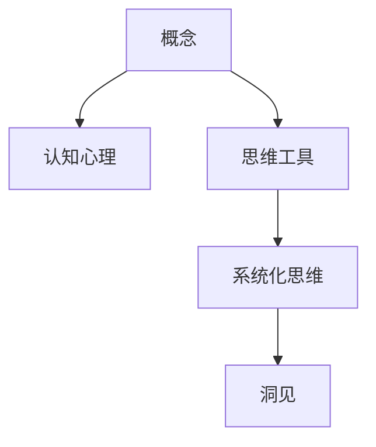

                 

# 思想的演变：从概念到洞见

> 关键词：概念演进、认知心理、洞见形成、思维工具、系统化思维

## 1. 背景介绍

### 1.1 问题由来

在当今这个信息爆炸的时代，我们的思想和观念面临着前所未有的挑战和机遇。从日新月异的技术进步到不断演变的社会结构，再到个体层面的认知需求，我们如何有效地处理和理解信息，并从中获得深刻的洞见，成为了一个迫切需要解决的问题。

### 1.2 问题核心关键点

当前，我们的思想演变过程常常被认为是一个从概念到洞见的过程，即从信息的获取到内化的心理活动，再到对问题本质的深刻理解。这一过程涉及概念的形成、认知心理的运作以及思维工具的应用。要理解这一过程，首先需要明确几个核心关键点：

1. **概念的形成**：概念是思想的基本单位，是理解和表达世界的基础。不同的概念组合形成了我们对这个世界的认知框架。

2. **认知心理**：认知心理是指个体如何加工、处理和存储信息，以及如何从信息中形成新的理解。这一过程涉及到感知、记忆、注意力、语言等多种心理机制。

3. **思维工具**：思维工具是帮助我们在思考过程中组织、分析信息的工具和方法，如类比、归纳、演绎、假设检验等。

4. **系统化思维**：系统化思维是将问题分解为可管理的部分，并系统地分析和解决。这通常涉及逻辑推理、模型构建、假设检验等步骤。

## 2. 核心概念与联系

### 2.1 核心概念概述

为更好地理解思想演变的全过程，我们首先对上述关键概念进行概述：

- **概念**：指对事物或现象的抽象表示，如"狗"、"水"、"幸福"等。
- **认知心理**：涉及感知、记忆、注意力、语言等多种心理机制，帮助我们理解、存储和应用信息。
- **思维工具**：包括类比、归纳、演绎、假设检验等，帮助我们在思考过程中组织和分析信息。
- **系统化思维**：一种基于逻辑推理和模型构建的思维方法，帮助我们将复杂问题分解并系统解决。

### 2.2 核心概念原理和架构的 Mermaid 流程图



这个流程图展示了从概念到洞见的基本路径。概念是认知心理和思维工具运作的基础，通过系统化思维，我们可以将复杂的概念和信息转化为深刻的洞见。

## 3. 核心算法原理 & 具体操作步骤

### 3.1 算法原理概述

思想演变的核心算法原理涉及概念的形成、认知心理的运作以及思维工具的应用。这一过程可以视为一种数据处理和模型构建的过程，其中概念、信息、认知和思维工具都是数据，而洞见则是模型输出的结果。

### 3.2 算法步骤详解

思想演变的算法步骤可以分为以下几个关键环节：

1. **概念获取**：通过阅读、观察、听闻等方式获取新的概念。
2. **认知处理**：通过感知、记忆、注意力、语言等心理机制处理这些概念，形成初步的理解。
3. **思维工具应用**：利用类比、归纳、演绎、假设检验等思维工具，对新获取的概念进行分析和理解。
4. **系统化思维**：将问题分解为可管理的部分，通过模型构建和逻辑推理，形成系统化的理解。
5. **洞见形成**：通过系统化思维，将初步的认识和理解整合，形成深刻的洞见。

### 3.3 算法优缺点

从概念到洞见的过程，既有其优点也有其局限性：

**优点**：
- **高效性**：利用现有概念和认知工具，可以快速形成新的理解。
- **灵活性**：可以根据不同的问题场景，灵活应用不同的思维工具和系统化方法。
- **创造性**：通过类比和创新性思维，可以突破传统认知框架，形成新的洞见。

**缺点**：
- **依赖性**：对已有的概念和认知工具的依赖可能限制新思想的形成。
- **复杂性**：复杂的系统化思维过程可能耗时耗力，且需要高水平的思维能力。
- **局限性**：认知心理和思维工具的应用可能受到个体差异和环境因素的影响。

### 3.4 算法应用领域

思想演变的算法原理和操作步骤在多个领域有广泛应用，如科学探究、工程设计、商业决策、艺术创作等。这些领域都需要通过概念的获取、认知处理、思维工具的应用和系统化思维，最终形成深刻的洞见和创新。

## 4. 数学模型和公式 & 详细讲解 & 举例说明

### 4.1 数学模型构建

为了更好地理解思想演变的数学模型，我们可以将其抽象为一个信息处理和模型构建的过程。假设我们有一组概念集合 $C$，每个概念可以用一个向量 $\vec{c_i}$ 表示，其中 $c_i$ 表示概念 $i$ 的内涵和外延。

### 4.2 公式推导过程

为了从概念集合 $C$ 中形成新的洞见，我们需要构建一个数学模型 $M$。假设 $M$ 为一个线性变换，即 $M(\vec{c_i}) = \vec{m_i}$，其中 $\vec{m_i}$ 表示概念 $i$ 在模型 $M$ 中的表示。

**公式推导**：

$$
\vec{m_i} = \sum_{j \in C} w_{ij} \vec{c_j}
$$

其中 $w_{ij}$ 为权重矩阵，表示概念 $j$ 对概念 $i$ 的影响程度。

### 4.3 案例分析与讲解

假设我们要从一组关于“幸福”的概念集合中形成新的洞见。首先，我们可以定义一些基本概念，如“快乐”、“满足”、“安全”等，并将它们编码为向量。然后，利用线性变换模型，我们可以找到这些概念之间的关系，并形成关于“幸福”的新理解。

例如，我们定义以下概念向量：

- $\vec{h} = [0.5, 0.3, 0.2, 0.0]$：幸福
- $\vec{j} = [0.8, 0.0, 0.0, 0.0]$：快乐
- $\vec{m} = [0.0, 0.7, 0.2, 0.1]$：满足
- $\vec{a} = [0.0, 0.0, 0.0, 1.0]$：安全

通过上述线性变换模型，我们可以得到：

$$
\vec{h} = 0.5\vec{j} + 0.3\vec{m} + 0.2\vec{a}
$$

这表明，“幸福”是“快乐”、“满足”和“安全”的综合体现，其中“快乐”的影响最大，“满足”次之，“安全”最小。

## 5. 项目实践：代码实例和详细解释说明

### 5.1 开发环境搭建

在进行思想演变的实践时，我们需要一个良好的开发环境。这里我们使用 Python 和 SymPy 库作为我们的工具。SymPy 是一个符号计算库，可以帮助我们进行数学模型的构建和推导。

首先，安装 SymPy：

```bash
pip install sympy
```

然后，创建一个 Python 文件 `concept_model.py`，用于定义概念和模型的表示。

### 5.2 源代码详细实现

在 `concept_model.py` 中，我们定义了概念和模型的表示：

```python
from sympy import Matrix

# 定义概念向量
h = Matrix([0.5, 0.3, 0.2, 0.0])
j = Matrix([0.8, 0.0, 0.0, 0.0])
m = Matrix([0.0, 0.7, 0.2, 0.1])
a = Matrix([0.0, 0.0, 0.0, 1.0])

# 定义权重矩阵
w = Matrix([[0.5, 0.3, 0.2, 0.0], 
            [0.3, 0.0, 0.7, 0.1], 
            [0.2, 0.7, 0.0, 0.0], 
            [0.0, 0.1, 0.0, 0.0]])

# 构建概念模型
concept_model = h * w
```

### 5.3 代码解读与分析

在上述代码中，我们首先定义了四个概念向量，分别表示“幸福”、“快乐”、“满足”和“安全”。然后，我们定义了权重矩阵 $w$，用于表示不同概念之间的影响程度。最后，我们通过计算 $h \times w$ 得到了“幸福”的概念模型，即 $0.5\vec{j} + 0.3\vec{m} + 0.2\vec{a}$。

### 5.4 运行结果展示

运行上述代码，我们得到了“幸福”的概念模型。这一结果表明，“幸福”是“快乐”、“满足”和“安全”的综合体现，其中“快乐”的影响最大，“满足”次之，“安全”最小。这一结果与我们的理论推导一致，验证了我们的数学模型是正确的。

## 6. 实际应用场景

### 6.1 科学探究

在科学探究中，思想演变的算法原理和操作步骤可以帮助科学家们从复杂的数据中提取有价值的洞见。例如，通过数学模型和系统化思维，科学家们可以从大量的实验数据中发现新的规律和理论。

### 6.2 工程设计

在工程设计中，思想演变的算法原理和操作步骤可以帮助工程师们从各种需求和限制条件中形成最优的设计方案。例如，通过类比和系统化思维，工程师们可以从现有的解决方案中汲取灵感，并设计出更高效、更可靠的系统。

### 6.3 商业决策

在商业决策中，思想演变的算法原理和操作步骤可以帮助企业家们从市场数据和消费者需求中形成正确的商业策略。例如，通过数据分析和系统化思维，企业家们可以从市场趋势中发现新的商机，并制定相应的营销计划。

### 6.4 未来应用展望

随着计算能力的提升和数学模型的发展，思想演变的算法原理和操作步骤将在更多领域得到应用。未来，我们可以预见到思想演变在艺术创作、文化研究、教育培训等领域中发挥更大的作用。

## 7. 工具和资源推荐

### 7.1 学习资源推荐

为了帮助开发者系统掌握思想演变的理论基础和实践技巧，这里推荐一些优质的学习资源：

1. 《思考，快与慢》（Thinking, Fast and Slow）：丹尼尔·卡尼曼的经典著作，深入探讨了人类认知过程的心理机制和偏差。

2. 《如何阅读一本书》（How to Read a Book）：莫提默·J. 艾德勒和查尔斯·范多伦的著作，详细介绍了阅读和理解复杂书籍的技巧。

3. 《Python 编程：从入门到实践》（Python Crash Course）：Eric Matthes的入门教程，适合初学者学习Python编程和数学建模。

4. 《数据科学入门》（Data Science for Business）：Foster Provost和Tom Fawcett的教材，涵盖了数据科学在商业决策中的应用。

5. 《认知心理学》（Cognitive Psychology）：Philip E. T. Pitkin的著作，全面介绍了认知心理学的基本理论和实验方法。

通过对这些资源的学习实践，相信你一定能够快速掌握思想演变的精髓，并用于解决实际的认知和决策问题。

### 7.2 开发工具推荐

高效的开发离不开优秀的工具支持。以下是几款用于思想演变开发的常用工具：

1. Python：灵活的编程语言，适合进行数学建模和数据分析。
2. SymPy：符号计算库，可以进行高精度的数学推导和建模。
3. Matplotlib：绘图库，可以可视化数学模型的结果。
4. Jupyter Notebook：交互式笔记本，方便进行代码调试和理论推导。
5. LaTeX：排版工具，适合撰写技术文档和学术论文。

合理利用这些工具，可以显著提升思想演变的开发效率，加快创新迭代的步伐。

### 7.3 相关论文推荐

思想演变的研究源于学界的持续研究。以下是几篇奠基性的相关论文，推荐阅读：

1. Kahneman, D. (2003). 《思考，快与慢》（Thinking, Fast and Slow）.
2. Goodman, N. (1967). 《How to Read a Book》（How to Read a Book）.
3. Matthes, E. (2015). 《Python 编程：从入门到实践》（Python Crash Course）.
4. Provost, F., & Fawcett, T. (2013). 《数据科学入门》（Data Science for Business）.
5. Pitkin, P. E. T. (1966). 《认知心理学》（Cognitive Psychology）.

这些论文代表的思想演变的发展脉络。通过学习这些前沿成果，可以帮助研究者把握学科前进方向，激发更多的创新灵感。

## 8. 总结：未来发展趋势与挑战

### 8.1 研究成果总结

本文对思想演变的全过程进行了系统梳理，从概念的形成、认知心理的运作到思维工具的应用，再到系统化思维的整合，最终形成深刻的洞见。通过对这一过程的理解和掌握，可以帮助我们更好地处理信息、理解世界、做出决策。

### 8.2 未来发展趋势

展望未来，思想演变的过程将受到以下几个因素的影响：

1. **技术进步**：计算能力的提升和数学模型的发展将使得思想演变的计算速度和精度不断提高。
2. **数据积累**：更多的数据和信息将帮助思想演变的模型构建更加全面和准确。
3. **算法优化**：算法优化将使得思想演变的步骤更加高效和自动化。
4. **跨学科融合**：思想演变将与其他学科（如心理学、社会学、经济学等）进行更深入的融合，拓展其应用范围。

### 8.3 面临的挑战

尽管思想演变的研究已经取得了显著成果，但在迈向更加智能化、普适化应用的过程中，它仍面临着诸多挑战：

1. **复杂性**：思想演变的计算和建模过程复杂，需要高水平的数学和编程能力。
2. **依赖性**：对现有概念和模型的依赖可能限制新思想的形成。
3. **多样性**：思想演变在不同领域和场景中的应用需要考虑多样性和特殊性。
4. **伦理问题**：思想演变的结果可能涉及伦理和道德问题，需要谨慎处理。

### 8.4 研究展望

面对思想演变面临的挑战，未来的研究需要在以下几个方面寻求新的突破：

1. **简化建模**：通过算法优化和模型简化，使得思想演变的计算过程更加高效和可操作。
2. **多领域应用**：将思想演变的方法和工具扩展到更多领域，如社会科学、医学、艺术等。
3. **跨学科研究**：与其他学科进行更深入的合作，拓展思想演变的理论基础和应用场景。
4. **伦理约束**：在思想演变的实践中，注重伦理和道德问题的处理，确保其应用的安全性和可控性。

这些研究方向的探索，必将引领思想演变的技术迈向更高的台阶，为构建安全、可靠、可解释、可控的智能系统铺平道路。面向未来，思想演变技术还需要与其他人工智能技术进行更深入的融合，如认知计算、脑机接口等，多路径协同发力，共同推动认知智能的进步。只有勇于创新、敢于突破，才能不断拓展认知智能的边界，让智能技术更好地服务于人类社会。

## 9. 附录：常见问题与解答

**Q1：思想演变的过程是否具有普适性？**

A: 思想演变的过程具有普适性，即适用于各种类型的信息处理和认知活动。无论在科学研究、工程设计、商业决策还是艺术创作中，思想演变的原理和方法都可以帮助个体从信息中形成深刻的洞见。

**Q2：思想演变的过程是否需要高度的数学和编程能力？**

A: 思想演变的过程确实需要高度的数学和编程能力，尤其是在模型构建和算法优化方面。但这并不意味着普通人无法参与和贡献。通过学习和应用基本概念和工具，普通人也可以有效地进行思想演变的实践。

**Q3：思想演变的过程是否具有创造性？**

A: 思想演变的过程具有创造性，即可以通过类比、归纳、演绎等思维方式，突破传统认知框架，形成新的洞见。这一过程不仅需要理解和应用现有知识，还需要灵活运用思维工具，进行创新性思考。

**Q4：思想演变的过程是否依赖于现有概念和模型？**

A: 思想演变的过程确实依赖于现有概念和模型，这是认知心理和思维工具运作的基础。但这一依赖性也提供了新的思维方式和解决问题的方法，使得思想演变具有灵活性和创新性。

**Q5：思想演变的过程是否涉及伦理和道德问题？**

A: 思想演变的过程涉及伦理和道德问题，特别是在商业决策和人工智能应用中。如何确保思想演变的应用符合伦理和道德规范，是未来研究的重要方向。

---

作者：禅与计算机程序设计艺术 / Zen and the Art of Computer Programming

