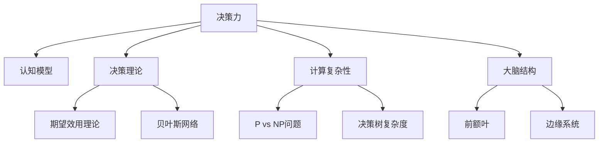

                 

# 思维体系:决策力的基础

> 关键词：决策力,认知模型,决策理论,计算复杂性,大脑结构

## 1. 背景介绍

### 1.1 问题由来
在现代社会，个体和组织每天都在面对各种复杂的问题和挑战。从日常生活的选择到商业决策，再到政策制定，每个决策都蕴含着巨大的影响。然而，决策往往受到人的认知能力和心理因素的影响，可能出现偏差和错误。如何利用科学的方法提高决策的效率和准确性，是当今时代亟待解决的重要问题。

### 1.2 问题核心关键点
决策力的核心在于，如何通过理解和应用人类认知模型和决策理论，构建一个高效、可靠的决策支持系统。该系统需要考虑决策者的认知限制、信息处理能力和情感因素，以帮助他们做出最优决策。

### 1.3 问题研究意义
研究决策力的基础，对于提升个人和组织的决策能力，优化决策流程，具有重要的理论和实际意义：

1. 降低决策风险。通过系统化的决策理论，可以有效避免常见的人类认知偏差，提高决策的准确性和可靠性。
2. 提高决策效率。合理利用计算工具和算法，加速信息处理和分析，缩短决策时间。
3. 促进决策科学化。基于数据和模型的决策过程，更符合科学的方法论，减少主观因素的影响。
4. 增强决策适应性。适应快速变化的环境，及时调整决策模型和参数，提升决策系统的灵活性和鲁棒性。
5. 助力组织管理。决策力的提升有助于提高团队协作效率，优化资源配置，增强组织的竞争力和创新能力。

## 2. 核心概念与联系

### 2.1 核心概念概述

为更好地理解决策力的基础，本节将介绍几个密切相关的核心概念：

- **决策力**：指个体或组织做出高质量决策的能力，包括认知模型、信息处理、决策算法等多个方面。
- **认知模型**：描述决策者如何处理信息和做出决策的心理模型，如期望效用理论、贝叶斯网络等。
- **决策理论**：研究决策过程和行为的理论框架，包括期望效用理论、赫布定律、基模理论等。
- **计算复杂性**：描述解决特定问题所需计算资源的量度，如P vs NP问题、决策树复杂度等。
- **大脑结构**：研究人类大脑的解剖和生理结构，如前额叶、边缘系统等，以及它们在决策中的作用。

这些核心概念之间的逻辑关系可以通过以下Mermaid流程图来展示：



这个流程图展示了几大核心概念及其之间的关系：

1. 决策力是核心，由认知模型和决策理论支撑。
2. 期望效用理论和贝叶斯网络是两种重要的认知模型。
3. 计算复杂性描述了决策过程的资源需求。
4. 前额叶和边缘系统是大脑中与决策相关的结构。

这些概念共同构成了决策力的理论基础，帮助我们从多个角度理解决策过程。

## 3. 核心算法原理 & 具体操作步骤
### 3.1 算法原理概述

决策力的基础在于理解和应用人类认知模型和决策理论。决策过程通常可以分为以下几个步骤：

1. **信息收集**：决策者获取相关信息，了解问题的背景和可能的解决方案。
2. **信息处理**：决策者对收集的信息进行加工和分析，构建决策模型。
3. **决策制定**：决策者根据模型评估各个方案，选择最优解决方案。
4. **行动执行**：决策者根据选择方案执行行动，观察结果并反馈调整。

决策力的核心算法包括期望效用理论、贝叶斯网络和决策树等。这些算法帮助决策者量化和评估不确定性条件下的决策，减少主观偏差的影响。

### 3.2 算法步骤详解

以下是基于期望效用理论的决策算法的详细步骤：

**Step 1: 信息收集**
- 定义决策问题，收集相关数据和信息。
- 构建决策树的叶节点，表示所有可能的决策结果。

**Step 2: 信息处理**
- 确定每个叶节点的先验概率，即每种结果发生的概率。
- 对每个叶节点，计算期望效用值，即该结果带来的预期回报。
- 将各叶节点的期望效用值乘以概率，求和得到期望效用总值。

**Step 3: 决策制定**
- 比较各个叶节点的期望效用总值，选择期望效用最高的方案作为决策结果。

**Step 4: 行动执行**
- 根据选择方案，执行相应行动。
- 收集反馈信息，更新决策树的概率和效用值，进行后续迭代优化。

### 3.3 算法优缺点

基于期望效用理论的决策算法具有以下优点：

- 量化不确定性：通过期望效用值，决策者可以更准确地评估各种结果的不确定性。
- 减少偏差：期望效用模型考虑了所有可能结果的概率和效用，减少了决策偏差。
- 标准化决策：将所有决策问题转化为数学模型，提高了决策的客观性和可重复性。

然而，该算法也存在一些局限：

- 依赖于概率估计：实际问题中，先验概率往往难以准确估计，影响决策结果。
- 忽视认知限制：期望效用理论假设决策者是完全理性的，忽视了人类的认知限制和情感因素。
- 复杂度较高：处理大规模问题的计算复杂度较高，对计算资源要求较高。

### 3.4 算法应用领域

期望效用理论广泛应用于金融、商业、工程等领域，以帮助决策者评估投资、风险管理、项目管理等复杂问题。例如：

- **金融投资**：通过期望效用模型，评估股票、债券等资产的风险收益，优化投资组合。
- **风险管理**：应用期望效用理论，评估各种风险管理策略的效果，确定最优风险控制方案。
- **项目管理**：利用期望效用模型，评估项目进度和成本，优化资源分配。

## 4. 数学模型和公式 & 详细讲解  
### 4.1 数学模型构建

期望效用理论的基本模型可以描述为：

设决策问题的可能结果为 $S=\{s_1, s_2, \ldots, s_n\}$，每个结果 $s_i$ 的效用函数为 $u(s_i)$，概率分布为 $P(s_i)$。则期望效用 $E[u(s)]$ 可以表示为：

$$
E[u(s)] = \sum_{i=1}^n P(s_i)u(s_i)
$$

其中，$P(s_i)$ 为结果 $s_i$ 的概率，$u(s_i)$ 为结果 $s_i$ 的效用值。

期望效用理论通过期望效用值，将决策问题转化为数学模型，帮助决策者系统地评估和选择最优决策。

### 4.2 公式推导过程

期望效用值的计算过程如下：

设决策问题的可能结果为 $S=\{s_1, s_2, \ldots, s_n\}$，每个结果 $s_i$ 的效用函数为 $u(s_i)$，概率分布为 $P(s_i)$。则期望效用 $E[u(s)]$ 可以表示为：

$$
E[u(s)] = \sum_{i=1}^n P(s_i)u(s_i)
$$

将公式展开，得：

$$
E[u(s)] = \sum_{i=1}^n P(s_i)u(s_i) = \sum_{i=1}^n P(s_i) \sum_{j=1}^n P(s_j|s_i)u(s_j)
$$

其中，$P(s_j|s_i)$ 表示在结果 $s_i$ 发生的情况下，结果 $s_j$ 发生的概率。

这个公式展示了期望效用的计算过程，即通过概率和效用函数的乘积，加总所有可能结果的效用值，得到最终的期望效用值。

### 4.3 案例分析与讲解

假设某公司面临两个投资项目的决策：项目A和项目B。每个项目的可能结果和对应效用值如下：

| 项目    | 成功概率 | 失败概率 | 成功效用 | 失败效用 |
| ------- | ------- | ------- | ------- | ------- |
| 项目A   | 0.7     | 0.3     | 50      | -20     |
| 项目B   | 0.5     | 0.5     | 70      | -30     |

根据期望效用理论，计算两个项目的期望效用：

- 项目A的期望效用为：$0.7 \times 50 + 0.3 \times (-20) = 31$
- 项目B的期望效用为：$0.5 \times 70 + 0.5 \times (-30) = 20$

因此，选择期望效用更高的项目A，作为最终决策。

这个案例展示了期望效用理论的应用，通过计算各个决策方案的期望效用，帮助决策者做出最优选择。

## 5. 项目实践：代码实例和详细解释说明
### 5.1 开发环境搭建

在进行决策力实践前，我们需要准备好开发环境。以下是使用Python进行决策理论分析的环境配置流程：

1. 安装Anaconda：从官网下载并安装Anaconda，用于创建独立的Python环境。

2. 创建并激活虚拟环境：
```bash
conda create -n decision-env python=3.8 
conda activate decision-env
```

3. 安装决策相关库：
```bash
pip install numpy scipy sympy sympy-theano
```

4. 安装可视化工具：
```bash
pip install matplotlib seaborn
```

完成上述步骤后，即可在`decision-env`环境中开始决策力实践。

### 5.2 源代码详细实现

下面是使用Python和Sympy库实现期望效用理论的决策模型：

```python
import sympy as sp

# 定义决策问题的可能结果和概率
results = sp.symbols('s1 s2 s3')
probabilities = sp.symbols('P1 P2 P3')
utilities = sp.symbols('U1 U2 U3')

# 计算期望效用
expected_utilities = probabilities * utilities

# 求解期望效用总值
total_expected_utility = sum(expected_utilities)

# 输出结果
total_expected_utility
```

### 5.3 代码解读与分析

让我们再详细解读一下关键代码的实现细节：

**Sympy库**：
- `sympy`库用于符号计算，定义决策问题的变量和函数。
- `symbols`函数用于创建符号变量，`sum`函数用于求和。
- `*`运算符用于计算概率和效用的乘积，`+`运算符用于求和。

**计算期望效用**：
- 首先定义决策问题的可能结果和概率变量，然后使用`*`运算符计算每个结果的效用值。
- 使用`sum`函数将所有结果的期望效用值相加，得到最终的期望效用总值。
- 最后，`total_expected_utility`变量存储最终的期望效用总值。

**输出结果**：
- 通过输出`total_expected_utility`，可以直观地看到期望效用总值的计算结果。

可以看到，Sympy库使得决策模型的符号计算变得简单高效，可以轻松处理复杂的多维度问题。

## 6. 实际应用场景
### 6.1 金融投资

金融投资是决策力应用的一个重要场景。投资者需要评估不同资产的风险和收益，选择最优的投资组合。通过期望效用理论，投资者可以系统地量化和比较各种投资方案的期望效用，做出理性的投资决策。

例如，某投资者面临两个投资项目A和B，每个项目的可能结果和对应效用值如下：

| 项目    | 成功概率 | 失败概率 | 成功效用 | 失败效用 |
| ------- | ------- | ------- | ------- | ------- |
| 项目A   | 0.7     | 0.3     | 50      | -20     |
| 项目B   | 0.5     | 0.5     | 70      | -30     |

使用期望效用理论计算两个项目的期望效用：

- 项目A的期望效用为：$0.7 \times 50 + 0.3 \times (-20) = 31$
- 项目B的期望效用为：$0.5 \times 70 + 0.5 \times (-30) = 20$

因此，选择期望效用更高的项目A，作为最终投资决策。

### 6.2 风险管理

风险管理是决策力应用的另一个重要场景。管理者需要评估各种风险管理策略的效果，选择最优的风险控制方案。通过期望效用理论，管理者可以系统地量化和比较各种风险策略的期望效用，做出理性的风险决策。

例如，某公司面临两种风险管理方案A和B，每个方案的可能结果和对应效用值如下：

| 方案    | 损失概率 | 损失金额 | 成功概率 | 成功奖励 |
| ------- | ------- | ------- | ------- | ------- |
| 方案A   | 0.1     | 10000   | 0.9     | 5000    |
| 方案B   | 0.2     | 20000   | 0.8     | 10000   |

使用期望效用理论计算两个方案的期望效用：

- 方案A的期望效用为：$0.1 \times (-10000) + 0.9 \times 5000 = 4500$
- 方案B的期望效用为：$0.2 \times (-20000) + 0.8 \times 10000 = 8000$

因此，选择期望效用更高的方案B，作为最终风险控制方案。

### 6.3 项目管理

项目管理是决策力应用的另一个重要场景。项目经理需要评估项目进度和成本，优化资源分配。通过期望效用理论，项目经理可以系统地量化和比较各种项目方案的期望效用，做出理性的决策。

例如，某公司面临两个项目方案A和B，每个方案的可能结果和对应效用值如下：

| 方案    | 成功概率 | 失败概率 | 成功效用 | 失败效用 |
| ------- | ------- | ------- | ------- | ------- |
| 方案A   | 0.8     | 0.2     | 1500    | -500    |
| 方案B   | 0.6     | 0.4     | 2000    | -1000   |

使用期望效用理论计算两个方案的期望效用：

- 方案A的期望效用为：$0.8 \times 1500 + 0.2 \times (-500) = 1900$
- 方案B的期望效用为：$0.6 \times 2000 + 0.4 \times (-1000) = 800$

因此，选择期望效用更高的方案A，作为最终项目决策。

### 6.4 未来应用展望

随着决策力理论的发展，未来的应用场景将更加多样和深入：

1. **智能决策系统**：基于机器学习和人工智能技术，构建智能化的决策支持系统，实时监测市场动态，自动推荐最优决策方案。
2. **虚拟现实**：利用虚拟现实技术，模拟各种决策场景，提供沉浸式的决策训练和测试环境。
3. **区块链应用**：利用区块链技术，构建透明、可信的决策过程，确保决策的公正性和安全性。
4. **智能合约**：通过智能合约技术，自动化执行决策结果，确保决策的及时性和可执行性。
5. **增强现实**：结合增强现实技术，提供实时的决策分析和可视化支持，提升决策效率和准确性。

## 7. 工具和资源推荐
### 7.1 学习资源推荐

为了帮助开发者系统掌握决策力的理论基础和实践技巧，这里推荐一些优质的学习资源：

1. 《决策理论与应用》系列教材：系统介绍期望效用理论、决策树、贝叶斯网络等基本概念和应用案例，适合初学者入门。
2. 《计量经济学》课程：讲解如何应用统计学方法解决决策问题，提供丰富的实例和编程作业。
3. 《计算机决策支持系统》书籍：全面介绍决策支持系统（DSS）的原理和实现方法，适合专业开发者参考。
4. 《机器学习实战》课程：讲解机器学习算法在决策中的应用，包括分类、回归、聚类等方法。
5. 《认知心理学》课程：研究人类认知过程和心理机制，为理解决策力的基础提供理论支持。

通过对这些资源的学习实践，相信你一定能够快速掌握决策力的精髓，并用于解决实际的决策问题。
###  7.2 开发工具推荐

高效的决策力开发离不开优秀的工具支持。以下是几款用于决策力开发的常用工具：

1. Python编程语言：Python以其简洁易懂的语法和丰富的第三方库，成为决策力开发的主流语言。
2. Sympy库：用于符号计算，支持复杂数学模型的构建和求解。
3. Matplotlib和Seaborn：用于数据可视化，帮助决策者直观理解决策结果。
4. Jupyter Notebook：提供交互式的编程环境，方便调试和测试决策模型。
5. Scikit-learn：提供机器学习算法库，支持分类、回归、聚类等模型的构建和评估。
6. TensorFlow和PyTorch：提供深度学习框架，支持神经网络模型的构建和训练。

合理利用这些工具，可以显著提升决策力开发的效率，加快创新迭代的步伐。

### 7.3 相关论文推荐

决策力的研究源于学界的持续探索。以下是几篇奠基性的相关论文，推荐阅读：

1. "Rational Choice Theory: Contemporary Developments and Research Directions" by Richard Thaler：深入探讨了期望效用理论的局限性和行为经济学的理论基础。
2. "Theory of Expected Utility by John von Neumann and Oskar Morgenstern"：经典的决策理论著作，奠定了现代决策理论的基础。
3. "Bayesian networks and decision making" by Judea Pearl：研究了贝叶斯网络在决策中的应用，为处理不确定性提供了新的工具。
4. "Decision trees and rule induction" by Ross Quinlan：介绍了决策树在决策中的应用，是机器学习领域的经典教材。
5. "Decision support systems: Past, present, and future" by Sven Hermann：全面介绍了决策支持系统的发展历程和未来趋势。

这些论文代表了大决策力理论的发展脉络。通过学习这些前沿成果，可以帮助研究者把握学科前进方向，激发更多的创新灵感。

## 8. 总结：未来发展趋势与挑战

### 8.1 总结

本文对决策力的基础进行了全面系统的介绍。首先阐述了决策力的核心概念和应用场景，明确了期望效用理论在决策过程中的重要地位。其次，从原理到实践，详细讲解了期望效用理论的数学模型和算法步骤，给出了决策力任务开发的完整代码实例。同时，本文还广泛探讨了决策力在金融、投资、项目管理等众多领域的应用前景，展示了决策力范式的巨大潜力。此外，本文精选了决策力技术的各类学习资源，力求为读者提供全方位的技术指引。

通过本文的系统梳理，可以看到，决策力是决策者系统地量化和评估不确定性条件下的决策过程，减少主观偏差，提高决策准确性的重要工具。在实际应用中，期望效用理论通过计算期望效用值，帮助决策者评估各种决策方案的效果，选择最优方案。这一方法在金融投资、风险管理、项目管理等众多领域都有广泛的应用，展现了决策力的强大生命力和应用前景。

### 8.2 未来发展趋势

展望未来，决策力的发展将呈现以下几个趋势：

1. **智能化决策**：结合机器学习和人工智能技术，构建智能化的决策支持系统，自动推荐最优决策方案。
2. **多维度决策**：利用多模态数据，如图像、语音、文本等，综合决策信息，提高决策的全面性和准确性。
3. **动态决策**：实时监测环境变化，动态调整决策模型和参数，确保决策的及时性和适应性。
4. **优化算法**：引入优化算法，如遗传算法、蚁群算法等，优化决策模型的求解过程，提高决策效率。
5. **社会化决策**：利用社交网络数据，引入社会化因素，提高决策的参与度和公平性。

这些趋势将进一步提升决策力的智能化水平，使其在更复杂、更广泛的应用场景中发挥作用。

### 8.3 面临的挑战

尽管决策力的发展取得了显著进展，但在迈向更加智能化、普适化应用的过程中，仍面临诸多挑战：

1. **数据质量问题**：决策模型的准确性高度依赖于数据质量，如何获取高质量的数据，是决策力应用的重要挑战。
2. **模型复杂度**：决策模型的构建和求解过程复杂，如何简化模型，提高计算效率，是决策力应用的另一大挑战。
3. **认知偏差**：人类决策过程中存在多种认知偏差，如何通过模型校正偏差，提高决策的客观性，是决策力应用的难点。
4. **可解释性问题**：决策模型的结果往往难以解释，如何提高模型的可解释性，增强决策的透明度和信任度，是决策力应用的重要课题。
5. **安全性问题**：决策模型可能受到恶意攻击，如何保障模型的安全性，确保决策结果的可靠性，是决策力应用的重大挑战。

### 8.4 研究展望

面对决策力面临的挑战，未来的研究需要在以下几个方面寻求新的突破：

1. **数据融合技术**：利用数据融合技术，综合多种数据源的信息，提高决策模型的准确性和全面性。
2. **多目标优化**：结合多目标优化算法，解决决策过程中多种指标的平衡问题，优化决策结果。
3. **模型解释性**：引入可解释性方法，如特征可视化、因果推断等，增强决策模型的透明性和可解释性。
4. **安全防护措施**：利用安全防护技术，如加密、防篡改等，保障决策模型的安全性。
5. **人机协同决策**：探索人机协同决策方法，结合人类专家的经验和判断，提高决策的可靠性。

这些研究方向将引领决策力技术的不断进步，为决策力的未来发展提供新的方向和突破口。

## 9. 附录：常见问题与解答

**Q1: 决策力是否只适用于理性决策者？**

A: 决策力主要基于期望效用理论，假设决策者完全理性，能够无偏地评估各种决策方案。然而，实际决策中，人类往往存在多种认知偏差，如启发式、锚定效应等。因此，决策力也可以结合行为经济学的理论，对决策过程进行修正和优化，帮助决策者做出更加理性的决策。

**Q2: 期望效用理论是否适用于所有决策问题？**

A: 期望效用理论主要适用于不确定性条件下的决策问题，假设决策者可以量化所有可能结果的概率和效用。然而，对于复杂的社会、伦理、情感等决策问题，期望效用理论可能难以适用。此时，可以结合其他决策理论，如基模理论、有限理性理论等，综合考虑各种决策因素。

**Q3: 如何评估期望效用理论的有效性？**

A: 评估期望效用理论的有效性，通常通过实证研究方法，比较实际决策结果与期望效用模型预测结果的误差。可以使用统计学方法，如t检验、卡方检验等，评估模型的预测能力。此外，还可以通过改进模型，如引入社会网络、情感因素等，提高模型的适应性和准确性。

**Q4: 决策力如何应用于大规模问题？**

A: 决策力在处理大规模问题时，需要考虑计算资源和时间成本。可以采用分布式计算、并行计算等技术，优化决策模型的求解过程。同时，可以引入机器学习和人工智能技术，自动化处理决策过程中大量的数据和计算任务，提高决策效率和准确性。

**Q5: 决策力如何与人类决策相结合？**

A: 决策力可以结合人类专家的经验和判断，构建人机协同决策系统。可以通过自然语言处理技术，将专家知识编码为结构化数据，输入到决策模型中。同时，可以引入强化学习等方法，逐步优化决策模型，使其逐步学习人类专家的决策模式。

通过本文的系统梳理，可以看到，决策力是帮助决策者系统地量化和评估不确定性条件下的决策过程，减少主观偏差，提高决策准确性的重要工具。在实际应用中，期望效用理论通过计算期望效用值，帮助决策者评估各种决策方案的效果，选择最优方案。这一方法在金融投资、风险管理、项目管理等众多领域都有广泛的应用，展现了决策力的强大生命力和应用前景。未来，随着技术的发展和应用的深化，决策力将在更多领域得到应用，为决策者的决策过程提供更加全面、高效的支持。

