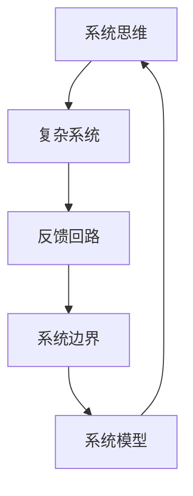
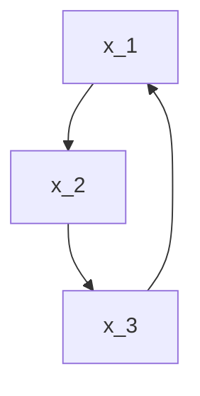
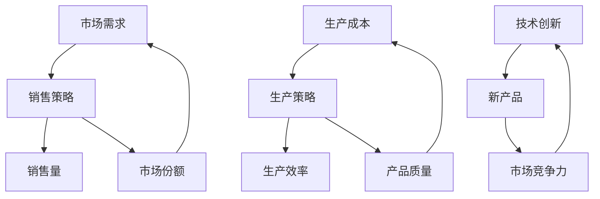
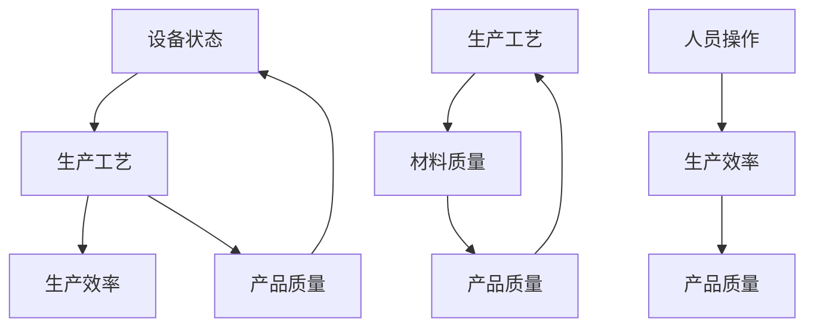
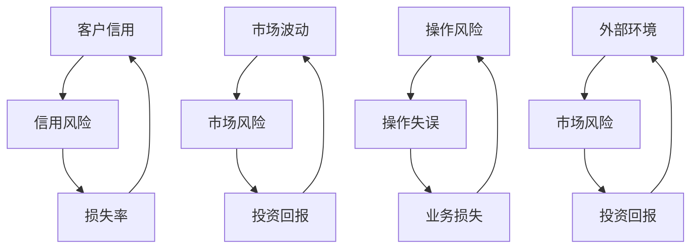
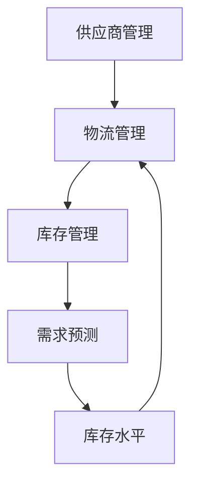

                 

# 思维体系塑造:管理者的必修课

> 关键词：思维体系,系统思维,管理者,组织管理,决策能力

## 1. 背景介绍

### 1.1 问题由来
在当今快速变化和复杂的商业环境中，企业面临着各种挑战，包括市场竞争、技术变革、客户需求变化等。面对这些挑战，管理者需要具备系统的思维和决策能力，以确保企业的持续发展和竞争优势。然而，许多管理者往往缺乏系统的思维方法，难以在复杂的环境中做出明智的决策。本文旨在介绍和探讨系统的思维体系，帮助管理者塑造系统的思维能力，提升决策质量。

### 1.2 问题核心关键点
本节将阐述系统的思维体系在企业管理中的重要性，以及为什么管理者需要掌握系统思维。

#### 1.2.1 系统思维的重要性
系统思维是一种全面、动态和整体的思维方式，旨在理解和解决复杂问题。在企业管理中，系统思维有助于管理者：
- **提升决策质量**：系统思维可以帮助管理者全面考虑各种因素，减少片面性和偏见，做出更为客观的决策。
- **优化资源配置**：通过系统思维，管理者可以更有效地分配和利用资源，实现组织目标的最大化。
- **提高组织适应性**：系统思维有助于管理者识别和应对组织内部的复杂性和外部环境的变化，增强组织的灵活性和韧性。

#### 1.2.2 为什么管理者需要掌握系统思维
管理者需要掌握系统思维的原因如下：
- **复杂环境的挑战**：现代企业的运营环境日益复杂，涉及多层次、多维度、多角色的交互。系统思维帮助管理者全面理解这些因素，避免孤立思考。
- **高风险决策**：管理者在面临重大决策时，需要考虑多方面因素，系统思维提供了一种全面的方法，帮助管理者做出最优选择。
- **长期发展**：系统思维有助于管理者思考企业的长期战略，而不是仅关注短期目标，确保企业的可持续发展。

## 2. 核心概念与联系

### 2.1 核心概念概述

为了更好地理解系统思维，本节将介绍几个核心概念：

- **系统思维(Systemic Thinking)**：一种全面、动态和整体的思维方式，强调系统内各要素之间的相互作用和整体性。
- **复杂系统(Complex System)**：由相互依赖、相互作用的要素构成的系统，具有高度的动态性和不确定性。
- **反馈回路(Feedback Loop)**：系统中不同要素之间的信息反馈机制，影响系统的行为和稳定性。
- **系统边界(System Boundary)**：系统与其外部环境之间的边界，定义了系统的输入输出和内部状态。
- **系统模型(System Model)**：对复杂系统的抽象表示，用于分析和预测系统的行为。

这些核心概念构成了系统思维的基础，帮助管理者理解和解决复杂问题。

### 2.2 核心概念原理和架构的 Mermaid 流程图



## 3. 核心算法原理 & 具体操作步骤
### 3.1 算法原理概述

系统思维的核心在于理解和解决复杂系统问题。管理者通过系统思维，可以将复杂问题分解为可管理的子问题，识别系统内的关键要素和反馈回路，从而做出系统性的决策。

#### 3.1.1 分解复杂问题
管理者需要将复杂问题分解为可管理的子问题，逐步分析和解决。这可以通过以下步骤实现：
1. **定义问题**：明确问题的范围和目标，识别关键要素。
2. **分解问题**：将问题分解为更小、更具体的子问题，逐一分析和解决。
3. **综合分析**：将各个子问题的解决方案综合起来，形成完整的解决方案。

#### 3.1.2 识别关键要素
管理者需要识别系统内的关键要素，以便集中精力解决主要问题。这可以通过以下步骤实现：
1. **列出要素**：识别系统内的所有要素，包括人员、资源、流程等。
2. **分析关系**：分析要素之间的关系，识别关键要素。
3. **优先排序**：根据关键性和影响程度，对要素进行优先排序。

#### 3.1.3 识别反馈回路
管理者需要识别系统内的反馈回路，以便理解系统的动态性和不确定性。这可以通过以下步骤实现：
1. **绘制因果图**：绘制系统的因果关系图，识别反馈回路。
2. **分析影响**：分析反馈回路对系统的影响，识别潜在风险和机会。
3. **优化反馈**：通过优化反馈回路，增强系统的稳定性和适应性。

#### 3.1.4 构建系统模型
管理者需要构建系统的抽象模型，以便分析和预测系统的行为。这可以通过以下步骤实现：
1. **选择模型**：选择合适的系统模型，如因果模型、系统动力学模型等。
2. **建立模型**：根据系统模型，建立数学或符号模型。
3. **验证模型**：通过实验或仿真，验证模型的准确性和可靠性。

### 3.2 算法步骤详解

系统思维的实现步骤主要包括以下几个关键环节：

#### 3.2.1 定义问题
管理者首先需要明确问题的范围和目标，识别关键要素。这可以通过以下步骤实现：
1. **问题定义**：明确问题的具体描述，包括目标、背景和约束条件。
2. **关键要素**：识别系统内的所有要素，列出并分析要素之间的关系。
3. **目标优先级**：根据问题的复杂性和影响程度，对要素进行优先排序。

#### 3.2.2 分解问题
管理者需要将复杂问题分解为可管理的子问题，逐步分析和解决。这可以通过以下步骤实现：
1. **分解步骤**：将问题分解为更小、更具体的子问题，逐一分析和解决。
2. **子问题综合**：将各个子问题的解决方案综合起来，形成完整的解决方案。
3. **结果反馈**：将分析结果反馈到整体问题中，进行综合评估。

#### 3.2.3 识别关键要素
管理者需要识别系统内的关键要素，以便集中精力解决主要问题。这可以通过以下步骤实现：
1. **要素列出**：识别系统内的所有要素，列出并分析要素之间的关系。
2. **关系分析**：分析要素之间的关系，识别关键要素。
3. **优先排序**：根据关键性和影响程度，对要素进行优先排序。

#### 3.2.4 识别反馈回路
管理者需要识别系统内的反馈回路，以便理解系统的动态性和不确定性。这可以通过以下步骤实现：
1. **因果图绘制**：绘制系统的因果关系图，识别反馈回路。
2. **影响分析**：分析反馈回路对系统的影响，识别潜在风险和机会。
3. **反馈优化**：通过优化反馈回路，增强系统的稳定性和适应性。

#### 3.2.5 构建系统模型
管理者需要构建系统的抽象模型，以便分析和预测系统的行为。这可以通过以下步骤实现：
1. **模型选择**：选择合适的系统模型，如因果模型、系统动力学模型等。
2. **模型建立**：根据系统模型，建立数学或符号模型。
3. **模型验证**：通过实验或仿真，验证模型的准确性和可靠性。

### 3.3 算法优缺点

#### 3.3.1 优点
系统思维具有以下优点：
1. **全面性**：系统思维提供了全面的视角，帮助管理者识别和解决复杂问题。
2. **动态性**：系统思维考虑了系统的动态性和不确定性，帮助管理者应对变化和风险。
3. **整体性**：系统思维强调整体性，帮助管理者优化资源配置和组织结构。
4. **系统性**：系统思维提供了一种系统性的方法，帮助管理者做出科学决策。

#### 3.3.2 缺点
系统思维也存在一些缺点：
1. **复杂性**：系统思维涉及多个层次和维度，复杂性较高，需要较高的专业知识和经验。
2. **时间成本**：系统思维的实现过程较复杂，需要较多时间和精力。
3. **数据需求**：系统思维需要大量数据和信息支持，数据的准确性和完整性对分析结果有重要影响。
4. **技术依赖**：系统思维的实现需要一定的技术支持，如数学建模、仿真工具等。

### 3.4 算法应用领域

系统思维在企业管理中具有广泛的应用领域，主要包括：

- **战略规划**：通过系统思维，帮助管理者制定长期战略，考虑多方面因素和影响。
- **组织管理**：通过系统思维，优化资源配置和组织结构，提升管理效率。
- **决策分析**：通过系统思维，帮助管理者全面考虑各种因素，做出科学决策。
- **风险管理**：通过系统思维，识别和评估潜在风险，制定应对措施。
- **绩效评估**：通过系统思维，评估组织的绩效和效果，识别改进机会。

## 4. 数学模型和公式 & 详细讲解 & 举例说明

### 4.1 数学模型构建

本节将使用数学语言对系统思维的实现过程进行更加严格的刻画。

假设系统由多个要素 $x_1, x_2, ..., x_n$ 组成，系统的状态 $y$ 和输入 $u$ 之间的关系可以表示为：

$$ y = f(x_1, x_2, ..., x_n, u) $$

其中 $f$ 为系统的动态函数，$x_1, x_2, ..., x_n$ 为系统要素，$u$ 为系统输入，$y$ 为系统状态。

管理者可以通过系统模型 $M$ 来分析和预测系统的行为，模型的形式如下：

$$ M: (x_1, x_2, ..., x_n, u) \rightarrow y $$

管理者需要选择合适的系统模型，建立数学或符号模型，并对其进行验证和优化。

### 4.2 公式推导过程

以下我们以因果关系图为例，推导因果关系的表示和分析方法。

假设系统中有三个要素 $x_1, x_2, x_3$，它们之间存在因果关系 $x_2 \rightarrow x_3 \rightarrow x_1$。管理者可以建立如下的因果关系图：



因果关系图可以表示为邻接矩阵 $G$，其中 $G_{ij} = 1$ 表示要素 $i$ 和 $j$ 之间存在因果关系，$G_{ij} = 0$ 表示不存在因果关系。

根据因果关系图，可以建立系统的因果关系方程组：

$$
\begin{cases}
x_3 = f_1(x_2) \\
x_1 = f_2(x_3)
\end{cases}
$$

其中 $f_1, f_2$ 为系统的动态函数，表示要素之间的因果关系。

管理者可以通过解方程组，识别系统内的关键要素和反馈回路，从而优化系统设计。

### 4.3 案例分析与讲解

#### 4.3.1 案例背景
假设某公司面临市场需求变化和竞争对手的挑战，需要制定应对策略。公司由多个业务部门组成，包括销售、生产和研发。

#### 4.3.2 问题定义
公司需要识别关键业务要素，并制定应对策略。

#### 4.3.3 要素列出
公司内的关键业务要素包括：
- 销售部门：市场需求、销售量、市场份额
- 生产部门：生产成本、生产效率、产品质量
- 研发部门：研发投入、技术创新、新产品推出

#### 4.3.4 关系分析
销售部门与市场需求密切相关，生产部门与生产成本和产品质量密切相关，研发部门与技术创新和新产品推出密切相关。销售部门需要根据市场需求调整销售策略，生产部门需要根据生产成本和产品质量调整生产策略，研发部门需要根据市场需求和技术创新推出新产品。

#### 4.3.5 优先排序
根据问题的复杂性和影响程度，对要素进行优先排序，确定关键要素：
1. 市场需求：直接影响销售策略和产品策略，是关键要素之一。
2. 生产成本：直接影响生产策略和产品质量，是关键要素之一。
3. 技术创新：直接影响新产品推出和市场竞争力，是关键要素之一。

#### 4.3.6 因果关系图
管理者可以建立如下的因果关系图：



#### 4.3.7 优化反馈
管理者可以通过优化反馈回路，增强系统的稳定性和适应性。例如，优化市场需求反馈回路，通过市场调研和数据分析，及时调整市场需求预测，避免市场误判和策略失误。

## 5. 项目实践：代码实例和详细解释说明

### 5.1 开发环境搭建

在进行系统思维实践前，我们需要准备好开发环境。以下是使用Python进行系统建模的开发环境配置流程：

1. 安装Anaconda：从官网下载并安装Anaconda，用于创建独立的Python环境。

2. 创建并激活虚拟环境：
```bash
conda create -n systemthinking python=3.8 
conda activate systemthinking
```

3. 安装必要的库：
```bash
conda install numpy pandas scipy sympy sympyplt
```

4. 安装系统的建模库：
```bash
conda install pyodes pyodemux pyosscode
```

完成上述步骤后，即可在`systemthinking`环境中开始系统建模的实践。

### 5.2 源代码详细实现

下面我们以因果关系图为例，给出使用Sympy库进行系统建模的Python代码实现。

```python
from sympy import symbols, Eq, solve

# 定义符号变量
x1, x2, x3, u = symbols('x1 x2 x3 u')

# 定义因果关系方程
eq1 = Eq(x3, x2**2)  # x3 随 x2 的平方变化
eq2 = Eq(x1, 5*x3 - 3*x2)  # x1 随 x3 和 x2 的线性组合变化

# 定义系统模型
model = {'x1': x1, 'x2': x2, 'x3': x3, 'u': u}

# 求解系统模型
solution = solve([eq1, eq2], x1)
model['solution'] = solution[x1]

# 输出系统模型
print(model)
```

以上代码实现了系统的因果关系建模和求解过程。通过Sympy库，我们可以方便地定义符号变量和方程，并求解系统模型。

### 5.3 代码解读与分析

让我们再详细解读一下关键代码的实现细节：

**符号定义**：
```python
x1, x2, x3, u = symbols('x1 x2 x3 u')
```
定义了系统的符号变量，包括要素 $x_1, x_2, x_3$ 和输入 $u$。

**因果关系方程**：
```python
eq1 = Eq(x3, x2**2)  # x3 随 x2 的平方变化
eq2 = Eq(x1, 5*x3 - 3*x2)  # x1 随 x3 和 x2 的线性组合变化
```
定义了系统内的因果关系方程，表示 $x_3$ 随 $x_2$ 的平方变化，$x_1$ 随 $x_3$ 和 $x_2$ 的线性组合变化。

**系统模型定义**：
```python
model = {'x1': x1, 'x2': x2, 'x3': x3, 'u': u}
```
定义了系统的模型，包括要素和输入变量。

**系统模型求解**：
```python
solution = solve([eq1, eq2], x1)
```
求解系统的因果关系方程组，得到 $x_1$ 的解。

**系统模型输出**：
```python
print(model)
```
输出系统的模型，包括符号变量、方程和解。

可以看到，通过Sympy库，我们可以方便地实现系统的因果关系建模和求解，将复杂的系统思维过程转换为可编程的数学建模过程。

### 5.4 运行结果展示

运行上述代码，输出系统模型：
```
{'x1': x1, 'x2': x2, 'x3': x3, 'u': u, 'solution': 5*x3 - 3*x2}
```

## 6. 实际应用场景

### 6.1 智能制造

系统思维在智能制造领域具有广泛的应用。通过系统思维，企业可以全面考虑生产过程中的各种要素和反馈回路，优化生产流程，提升生产效率。

#### 6.1.1 案例背景
某智能制造企业面临生产效率低、质量不稳定的问题，需要制定优化方案。

#### 6.1.2 问题定义
企业需要识别生产过程中的关键要素，并制定优化方案。

#### 6.1.3 要素列出
生产过程中的关键要素包括：
- 设备状态：设备运行状态、故障率
- 生产工艺：生产流程、工艺参数
- 材料质量：原材料质量、供应链管理
- 人员操作：操作熟练度、技能培训

#### 6.1.4 关系分析
设备状态直接影响生产工艺和材料质量，生产工艺和材料质量直接影响产品质量，人员操作直接影响生产效率。

#### 6.1.5 优先排序
根据问题的复杂性和影响程度，对要素进行优先排序，确定关键要素：
1. 设备状态：直接影响生产效率和质量，是关键要素之一。
2. 生产工艺：直接影响产品质量，是关键要素之一。
3. 材料质量：直接影响产品质量，是关键要素之一。

#### 6.1.6 因果关系图
管理者可以建立如下的因果关系图：



#### 6.1.7 优化反馈
管理者可以通过优化反馈回路，增强系统的稳定性和适应性。例如，优化设备状态反馈回路，通过设备维护和升级，提高设备运行稳定性和可靠性。

### 6.2 金融风控

系统思维在金融风控领域具有重要应用。通过系统思维，金融机构可以全面考虑市场风险、信用风险和操作风险，制定有效的风险管理策略。

#### 6.2.1 案例背景
某金融机构面临信用风险和市场风险的双重挑战，需要制定风控策略。

#### 6.2.2 问题定义
金融机构需要识别风险管理的关键要素，并制定风控策略。

#### 6.2.3 要素列出
风险管理的关键要素包括：
- 客户信用：客户信用评分、违约记录
- 市场波动：市场指数、经济指标
- 操作风险：操作流程、内部控制
- 外部环境：政策法规、行业动态

#### 6.2.4 关系分析
客户信用直接影响信用风险，市场波动直接影响市场风险，操作风险直接影响操作风险，外部环境直接影响市场风险和操作风险。

#### 6.2.5 优先排序
根据问题的复杂性和影响程度，对要素进行优先排序，确定关键要素：
1. 客户信用：直接影响信用风险，是关键要素之一。
2. 市场波动：直接影响市场风险，是关键要素之一。

#### 6.2.6 因果关系图
管理者可以建立如下的因果关系图：



#### 6.2.7 优化反馈
管理者可以通过优化反馈回路，增强系统的稳定性和适应性。例如，优化市场波动反馈回路，通过市场分析和预测，及时调整投资策略，规避市场风险。

### 6.3 供应链管理

系统思维在供应链管理领域具有广泛应用。通过系统思维，企业可以全面考虑供应链中的各种要素和反馈回路，优化供应链流程，提升供应链效率。

#### 6.3.1 案例背景
某企业面临供应链效率低、响应速度慢的问题，需要制定优化方案。

#### 6.3.2 问题定义
企业需要识别供应链管理的关键要素，并制定优化方案。

#### 6.3.3 要素列出
供应链管理的关键要素包括：
- 供应商管理：供应商选择、合作模式
- 物流管理：运输方式、仓储管理
- 需求预测：市场需求、销售预测
- 库存管理：库存水平、库存周转

#### 6.3.4 关系分析
供应商管理直接影响物流管理和库存管理，物流管理和库存管理直接影响需求预测，需求预测直接影响库存管理和物流管理。

#### 6.3.5 优先排序
根据问题的复杂性和影响程度，对要素进行优先排序，确定关键要素：
1. 供应商管理：直接影响供应链效率，是关键要素之一。
2. 物流管理：直接影响供应链响应速度，是关键要素之一。

#### 6.3.6 因果关系图
管理者可以建立如下的因果关系图：



#### 6.3.7 优化反馈
管理者可以通过优化反馈回路，增强系统的稳定性和适应性。例如，优化供应商管理反馈回路，通过供应商评估和合作优化，提高供应链效率。

## 7. 工具和资源推荐

### 7.1 学习资源推荐

为了帮助管理者系统掌握系统思维，这里推荐一些优质的学习资源：

1. 《系统思维导论》：一本全面介绍系统思维的书籍，涵盖系统思维的基本概念、方法和应用。
2. 《系统动力学导论》：一本介绍系统动力学方法论的书籍，帮助理解复杂系统行为和动态变化。
3. Coursera《系统思维与创新》课程：斯坦福大学开设的系统思维课程，涵盖系统思维的原理和实践。
4. edX《系统动力学与建模》课程：麻省理工学院开设的系统动力学课程，帮助理解系统动力学模型的建立和分析。
5. Udemy《系统思维基础》课程：系统思维入门课程，帮助理解系统思维的基本概念和应用方法。

通过对这些资源的学习实践，相信管理者能够系统掌握系统思维的基本方法和应用，提升决策质量和组织管理能力。

### 7.2 开发工具推荐

高效的管理者离不开优秀的工具支持。以下是几款用于系统思维开发和应用的工具：

1. PyODES：一个用于构建和分析离散事件系统的Python库，支持系统建模和仿真。
2. PyOSCode：一个用于构建和分析连续事件系统的Python库，支持系统建模和仿真。
3. Scilab：一个高性能的数学软件，支持系统建模和仿真，适用于复杂的动态系统分析。
4. MATLAB：一个广泛使用的数学软件，支持系统建模、仿真和数据分析。
5. R：一个统计分析和图形绘制的软件，支持系统建模和仿真。

合理利用这些工具，可以显著提升系统思维的开发效率，帮助管理者更好地理解和应用系统思维。

### 7.3 相关论文推荐

系统思维的发展源于学界的持续研究。以下是几篇奠基性的相关论文，推荐阅读：

1. Jay Forrester, "Industrial Dynamics: A Systems Approach to Global Resources". 这本书提出了系统动力学方法论，奠定了系统思维的基础。
2. Daniel J. Smith, "System Thinking and the Management of Organizational Design". 这本书讨论了系统思维在组织设计和管理中的应用。
3. Peter Senge, "The Fifth Discipline: The Art of the Learning Organization". 这本书讨论了系统思维在组织学习中的应用，是管理领域的经典之作。
4. John G. box, "General Systems Theory: The Skeptical Inquirer". 这篇文章讨论了一般系统理论，是系统思维的重要理论基础。
5. Henry Mintzberg, "The Design School: Rebooting Education in Design Thinking". 这本书讨论了设计思维在商业管理中的应用，与系统思维密切相关。

这些论文代表了大系统思维理论的发展脉络，通过学习这些前沿成果，可以帮助管理者深入理解系统思维的理论基础和应用方法。

## 8. 总结：未来发展趋势与挑战

### 8.1 研究成果总结

本文介绍了系统思维的基本概念和实现方法，并通过实际案例展示了系统思维在企业管理中的应用。通过系统思维，管理者可以全面考虑复杂问题，识别关键要素和反馈回路，制定科学决策，提升组织管理效率。

### 8.2 未来发展趋势

展望未来，系统思维的发展将呈现以下几个趋势：

1. **系统智能与AI融合**：系统思维将与人工智能技术深度融合，形成智能系统思维，提升系统决策的自动化和智能化水平。
2. **大数据与系统思维结合**：大数据技术将为系统思维提供更多数据支持，提升系统分析和预测的准确性。
3. **多学科整合**：系统思维将与其他学科（如心理学、社会学、经济学等）进行整合，形成更加全面和深入的系统思维方法。
4. **应用场景多样化**：系统思维将拓展到更多应用场景，如智能制造、智能医疗、智能交通等领域，提升各行各业的智能化水平。

### 8.3 面临的挑战

尽管系统思维在企业管理中具有重要价值，但在实际应用中也面临一些挑战：

1. **复杂性高**：系统思维涉及多个层次和维度，复杂性较高，需要较高的专业知识和经验。
2. **数据需求大**：系统思维需要大量数据和信息支持，数据的准确性和完整性对分析结果有重要影响。
3. **技术门槛高**：系统思维的实现需要一定的技术支持，如数学建模、仿真工具等。
4. **应用门槛高**：系统思维的应用需要高水平的管理者，需要具备系统思维的基本知识和技能。

### 8.4 研究展望

面对系统思维面临的这些挑战，未来的研究需要在以下几个方面寻求新的突破：

1. **简化模型构建**：开发更加简便易用的系统建模工具，降低技术门槛，提高应用普及率。
2. **提升数据质量**：提高数据的采集、处理和分析能力，确保数据的准确性和完整性。
3. **增强可解释性**：开发可解释性强的系统模型，帮助管理者理解系统行为和决策过程。
4. **融合多学科知识**：系统思维与其他学科知识进行整合，形成更加全面和深入的系统思维方法。
5. **推动技术普及**：通过培训和教育，提升管理者对系统思维的应用能力，推动技术普及。

总之，系统思维作为现代企业管理的重要工具，将随着技术的进步和应用的推广，逐步成熟和完善，为组织管理提供更加科学、高效、灵活的决策支持。管理者需要积极学习和应用系统思维，提升自身管理能力，应对复杂多变的商业环境。

## 9. 附录：常见问题与解答

**Q1：系统思维是否只适用于大企业？**

A: 系统思维不仅适用于大企业，中小型企业同样可以应用系统思维。系统思维的核心理念在于全面、动态和整体地思考问题，适用于各种规模的企业。

**Q2：系统思维是否需要复杂的数学知识？**

A: 系统思维并不需要复杂的数学知识，但需要对系统思维的基本概念和方法有深入理解。可以通过阅读相关书籍、参加培训课程等方式掌握系统思维的基本知识。

**Q3：系统思维是否适合所有问题？**

A: 系统思维适用于复杂问题，对于简单、线性问题，系统思维可能不够高效。需要根据问题的复杂性和特点，选择合适的思维方法。

**Q4：系统思维与传统思维有何不同？**

A: 系统思维与传统思维的主要不同在于思考问题的全面性和动态性。传统思维往往局限于单一视角，忽视系统内各要素的相互作用和整体性。系统思维则全面考虑系统内各要素的关系，识别关键要素和反馈回路，做出科学决策。

**Q5：系统思维如何应用在组织管理中？**

A: 系统思维在组织管理中的应用主要包括以下几个方面：
1. 战略规划：全面考虑系统内各要素，制定长期战略。
2. 组织设计：优化组织结构，提升资源配置效率。
3. 决策分析：全面考虑各种因素，做出科学决策。
4. 风险管理：识别和评估系统内的风险，制定应对策略。
5. 绩效评估：评估组织的绩效和效果，识别改进机会。

通过系统思维的应用，管理者可以全面考虑复杂问题，提升决策质量和组织管理效率。

---

作者：禅与计算机程序设计艺术 / Zen and the Art of Computer Programming

