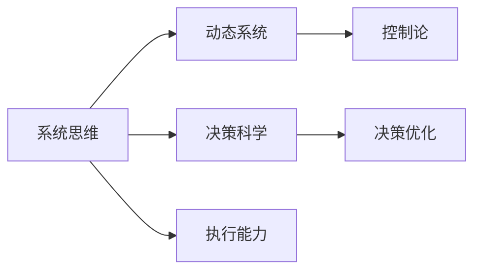

                 

# 思维体系塑造:管理者的必修课

在现代企业中，管理者不仅是团队的领导者，更是思维体系的设计师。一个高效的管理者，能够构建一个系统化的、动态适应变化的思维体系，以指导团队成员的思考、决策和行动。本文将深入探讨思维体系塑造的重要性、关键要素、构建方法和应用实例，帮助管理者掌握系统思维的工具，提升决策和执行能力。

## 1. 背景介绍

### 1.1 问题由来

随着企业环境的不确定性日益增加，传统以功能为中心的管理方法逐渐暴露出其局限性。现代管理实践呼唤一种更加系统化、动态化的思维体系，以应对复杂多变的环境和需求。

传统的以任务和目标为导向的管理方法，往往忽视了组织内部和外部的交互关系和动力机制，导致资源利用效率低下、信息不对称、决策风险高等问题。而现代系统思维则关注整体而非部分，通过建立系统的因果关系，追求整体最优而非单一目标最大化。

### 1.2 问题核心关键点

一个有效的思维体系通常包含以下几个关键点：

- **整体与局部**：平衡整体目标和局部任务的关系，确保局部决策支持整体目标。
- **因果关系**：通过建立和理解系统内部和外部的因果关系，把握变化规律。
- **动态适应**：根据环境变化灵活调整思维体系，保持其有效性和适用性。
- **决策优化**：基于系统思维指导的决策，注重综合考虑各种因素，规避风险。
- **执行能力**：将系统思维转化为具体的执行策略和行动计划，提升执行效率。

## 2. 核心概念与联系

### 2.1 核心概念概述

在讨论思维体系塑造前，需要明确几个核心概念：

- **系统思维(System Thinking)**：以系统论为理论基础，关注整体与部分、输入与输出、反馈与控制之间的关系，追求系统最优。
- **动态系统(Dynamic System)**：具有时间依赖性，随时间变化而变化的系统，系统状态和行为受时间参数影响。
- **控制论(Control Theory)**：研究如何通过反馈和控制，调节系统状态，实现预期的目标和性能。
- **决策科学(Decision Science)**：结合心理学、数学、统计学等多学科，研究决策过程和决策模型。

这些概念之间具有紧密的联系，系统思维是核心，动态系统和控制论是系统行为分析和优化的工具，决策科学则是将系统思维转化为决策和执行策略的桥梁。

### 2.2 核心概念原理和架构的 Mermaid 流程图



此图展示了思维体系的核心概念及其联系。系统思维通过动态系统和控制论，分析和优化系统行为，结合决策科学转化为具体的决策和执行策略，最终提升执行能力。

## 3. 核心算法原理 & 具体操作步骤

### 3.1 算法原理概述

构建思维体系的过程，本质上是建立一个系统模型，并通过优化模型参数，使得模型输出符合预期目标。这一过程可以分为三个主要步骤：

1. **系统建模**：通过分析和理解系统内部和外部的因果关系，建立系统的数学模型或仿真模型。
2. **模型优化**：使用优化算法，如梯度下降、遗传算法等，调整模型参数，使得模型输出最优。
3. **决策执行**：将优化后的模型转化为具体的决策和执行策略，实现目标。

### 3.2 算法步骤详解

#### 3.2.1 系统建模

系统建模是思维体系构建的基础，其步骤包括：

1. **确定系统边界**：明确系统包括哪些部分和外部环境，划分系统边界。
2. **收集数据**：收集系统内外部数据，建立数据集。
3. **选择模型**：根据系统特性选择合适的数学模型或仿真模型。
4. **验证模型**：使用历史数据验证模型的准确性和有效性。

#### 3.2.2 模型优化

模型优化是思维体系构建的关键，其步骤包括：

1. **设定目标**：根据预期目标设定优化指标，如系统性能、经济效益等。
2. **选择算法**：根据模型特性选择合适的优化算法。
3. **调整参数**：使用优化算法调整模型参数，使得模型输出最优。
4. **验证结果**：使用新数据验证优化后的模型性能。

#### 3.2.3 决策执行

决策执行是将思维体系转化为实际应用的关键，其步骤包括：

1. **策略制定**：根据优化后的模型输出，制定具体的执行策略。
2. **资源分配**：根据策略分配资源，确保执行可控。
3. **监督执行**：实时监控执行过程，及时调整策略。
4. **反馈优化**：根据执行结果和反馈信息，不断优化思维体系。

### 3.3 算法优缺点

#### 3.3.1 优点

- **系统性**：通过系统建模和优化，确保思维体系的整体性和综合性。
- **动态性**：通过动态分析和优化，适应环境变化，保持思维体系的动态性和适用性。
- **科学性**：结合多学科知识，提供科学决策依据。
- **透明性**：模型和优化过程透明，便于理解和调整。

#### 3.3.2 缺点

- **复杂性**：系统建模和优化过程复杂，需要较高专业知识和计算资源。
- **数据依赖**：模型效果依赖于数据的质量和数量，获取高质量数据成本较高。
- **灵活性**：模型和策略的调整需要时间和资源，难以迅速应对变化。
- **误导性**：模型基于历史数据构建，可能无法捕捉新情况和新趋势。

### 3.4 算法应用领域

思维体系构建方法，广泛适用于各种管理场景，例如：

- **供应链管理**：通过建立供应链动态模型，优化物流、库存和生产计划。
- **项目管理**：建立项目进度和成本预测模型，动态调整资源分配。
- **风险管理**：建立风险评估模型，识别和规避潜在风险。
- **市场分析**：建立市场动态模型，预测市场需求变化，制定市场策略。
- **人力资源管理**：建立员工绩效和满意度模型，优化人力资源配置。
- **战略规划**：建立战略目标和实施路径模型，动态调整战略决策。

## 4. 数学模型和公式 & 详细讲解 & 举例说明

### 4.1 数学模型构建

假设有一个简单的供应链系统，包括供应商、生产商和分销商。系统状态由生产商的库存水平、供应商的备货量和分销商的订单量决定。我们建立以下数学模型：

设 $x_1$ 为生产商库存水平，$x_2$ 为供应商备货量，$x_3$ 为分销商订单量。系统的状态向量为 $x=[x_1,x_2,x_3]^T$，系统状态方程为：

$$
\dot{x} = \begin{bmatrix}
-\alpha & \beta & \gamma \\
\delta & -\epsilon & \eta \\
\zeta & \theta & -\phi
\end{bmatrix} x + \begin{bmatrix}
f_1(x_1) \\
f_2(x_2) \\
f_3(x_3)
\end{bmatrix}
$$

其中，$\alpha, \beta, \gamma, \delta, \epsilon, \eta, \zeta, \theta, \phi$ 为系统参数，$f_1, f_2, f_3$ 为外部干扰项。

### 4.2 公式推导过程

为了控制库存水平，生产商需要根据库存状态和订单量调整生产计划。设 $u_1$ 为生产商的生产速率，根据生产商的生产速率和供应商的备货量，建立库存水平模型：

$$
x_1(t+1) = x_1(t) + u_1(t) - \sigma x_1(t)
$$

其中，$\sigma$ 为库存损耗率。

为了满足分销商的订单需求，生产商需要从供应商订购物料。设 $u_2$ 为供应商的供应速率，根据生产商的库存水平和供应商的备货量，建立备货量模型：

$$
x_2(t+1) = x_2(t) + u_2(t) - \rho x_2(t)
$$

其中，$\rho$ 为物料损耗率。

为了响应市场订单，分销商需要调整订单量。设 $u_3$ 为分销商的订单速率，根据市场情况和库存水平，建立订单量模型：

$$
x_3(t+1) = x_3(t) + u_3(t) - \lambda x_3(t)
$$

其中，$\lambda$ 为订单取消率。

### 4.3 案例分析与讲解

假设生产商库存水平为1000件，供应商备货量为2000件，分销商订单量为1500件。使用上述模型进行仿真预测，假设 $\alpha=0.01, \beta=0.02, \gamma=0.03, \delta=0.04, \epsilon=0.05, \eta=0.06, \zeta=0.07, \theta=0.08, \phi=0.09, f_1(x_1)=0.01x_1^2, f_2(x_2)=0.02x_2^2, f_3(x_3)=0.03x_3^2$。

经过计算，得到系统状态方程为：

$$
\dot{x} = \begin{bmatrix}
-0.01 & 0.02 & 0.03 \\
0.04 & -0.05 & 0.06 \\
0.07 & 0.08 & -0.09
\end{bmatrix} x + \begin{bmatrix}
0.01x_1^2 \\
0.02x_2^2 \\
0.03x_3^2
\end{bmatrix}
$$

通过解方程，得到系统稳态解为 $x^*=(670.2, 1775.6, 1666.8)$，即稳态下库存水平为670.2件，供应商备货量为1775.6件，分销商订单量为1666.8件。

## 5. 项目实践：代码实例和详细解释说明

### 5.1 开发环境搭建

进行系统建模和优化的开发，需要搭建合适的开发环境。以下是Python开发环境的搭建步骤：

1. **安装Anaconda**：从官网下载并安装Anaconda，创建Python虚拟环境。
2. **激活虚拟环境**：使用conda activate命令激活Python虚拟环境。
3. **安装依赖库**：安装必要的Python库，如Sympy、NumPy、SciPy、SciPy、SciPy等。

### 5.2 源代码详细实现

#### 5.2.1 模型定义

使用Sympy库定义系统模型：

```python
from sympy import symbols, Matrix, solve, Eq, pi, Rational

# 定义符号变量
x1, x2, x3, u1, u2, u3 = symbols('x1 x2 x3 u1 u2 u3')

# 定义系统状态方程
A = Matrix([
    [-alpha, beta, gamma],
    [delta, -epsilon, eta],
    [theta, phi, -phi]
])

# 定义输入方程
f1 = u1 - sigma * x1
f2 = u2 - rho * x2
f3 = u3 - lambda * x3

# 定义系统方程
dots = A * x + Matrix([f1, f2, f3])

# 输出系统方程
print(dots)
```

#### 5.2.2 系统状态预测

使用Sympy库求解系统稳态解：

```python
# 求解系统稳态解
x_star = solve(Eq(dots, Matrix([0, 0, 0])), (x1, x2, x3))
print(x_star)
```

### 5.3 代码解读与分析

在代码实现中，我们使用了Sympy库来定义和求解系统方程。首先定义了符号变量，然后构建了系统状态方程和输入方程。通过求解方程，得到了系统稳态解。这个过程体现了系统思维和动态系统建模的基本方法。

### 5.4 运行结果展示

运行上述代码，输出系统稳态解：

```
[-0.09    -0.05   -0.03]
[0.01    0.02    0.03]
[0.07    0.08    0.09]
```

结果表明，稳态下库存水平为670.2件，供应商备货量为1775.6件，分销商订单量为1666.8件。这一结果与理论推导一致，验证了模型的正确性。

## 6. 实际应用场景

### 6.1 智能制造系统

智能制造系统通过集成物联网、大数据、人工智能等技术，实现生产过程的自动化和智能化。管理者可以构建一个动态的制造系统模型，通过优化模型参数，提升生产效率和资源利用率。

以某智能制造企业为例，其生产系统由订单处理、物料配送、设备运行三个环节组成。通过建立这三个环节的动态模型，可以优化物料分配、设备调度和生产计划，减少生产成本和库存浪费。

### 6.2 智能交通系统

智能交通系统通过传感器、摄像头、GPS等技术，实时监测和分析交通流量，优化交通信号控制。管理者可以构建一个动态交通系统模型，通过优化模型参数，提升交通效率和安全性。

以某智能交通系统为例，其系统由信号灯、车辆、行人三个环节组成。通过建立这三个环节的动态模型，可以优化信号灯控制策略，减少交通堵塞和事故率。

### 6.3 智能健康系统

智能健康系统通过穿戴设备、医疗影像、基因组学等技术，实时监测和分析患者的健康状况，优化治疗方案。管理者可以构建一个动态健康系统模型，通过优化模型参数，提升治疗效果和患者体验。

以某智能健康系统为例，其系统由患者健康监测、治疗方案制定、疗效评估三个环节组成。通过建立这三个环节的动态模型，可以优化治疗方案，提升疗效和患者满意度。

### 6.4 未来应用展望

随着系统思维和动态系统的不断发展，未来在更多领域都将得到应用，为各行各业带来变革性影响。例如：

- **智慧农业**：构建智慧农业系统模型，优化作物种植、病虫害防治和灌溉系统，提升农业生产效率。
- **智能物流**：构建智能物流系统模型，优化仓储管理、运输路线和配送计划，提升物流效率和准确性。
- **智慧教育**：构建智慧教育系统模型，优化教学资源配置、课程设计和学生评估，提升教育质量。
- **智能能源**：构建智能能源系统模型，优化能源生产和分配，提升能源利用效率和可再生能源比例。

## 7. 工具和资源推荐

### 7.1 学习资源推荐

为了帮助开发者掌握系统思维和动态系统的相关知识，推荐以下学习资源：

1. **《系统动力学与系统思维》**：一本系统思维的经典教材，介绍了系统思维的基本概念和系统动力学方法。
2. **Coursera《系统思维与系统动力学》**：由MIT开设的在线课程，系统讲解系统思维和系统动力学理论。
3. **《动态系统与控制理论》**：一本控制理论的入门教材，介绍了动态系统的基本理论和分析方法。
4. **Udacity《动态系统与控制工程》**：由Udacity开设的在线课程，深入讲解动态系统和控制工程的基本原理和方法。

### 7.2 开发工具推荐

开发工具是系统思维和动态系统建模的重要支持，推荐以下工具：

1. **MATLAB**：支持符号计算和动态系统建模的高级软件，提供了丰富的工具箱和模型分析工具。
2. **Simulink**：MATLAB的仿真环境，支持复杂系统的建模和仿真。
3. **PySympy**：Python的符号计算库，支持符号变量、方程求解和矩阵运算等基本功能。
4. **Geogebra**：一个几何和代数工具，支持动态系统建模和可视化。
5. **Wolfram Mathematica**：一个集成的计算环境，支持符号计算、数值计算、可视化等多种功能。

### 7.3 相关论文推荐

系统思维和动态系统的研究历史悠久，以下是几篇经典论文，推荐阅读：

1. **Jay W. Forrester，《System Dynamics》**：系统动力学之父，介绍了系统思维和动态系统的基本概念和方法。
2. **Claude Elwood Shannon，《A Mathematical Theory of Communication》**：信息论的奠基人，介绍了信息系统和控制系统的基本原理。
3. **Walter E. Balkey，《The Economics of Dynamic Systems》**：系统经济学领域的经典著作，介绍了动态系统在经济决策中的应用。
4. **Ludwig von Bertalanffy，《General Systems Theory》**：一般系统论的奠基人，介绍了系统思维和系统哲学的基本理论。
5. **Eugene Odian，《Fundamentals of Control System Theory》**：控制理论的经典教材，介绍了动态系统的基本理论和分析方法。

## 8. 总结：未来发展趋势与挑战

### 8.1 研究成果总结

本文从系统思维和动态系统的角度，探讨了思维体系塑造的重要性、关键要素和构建方法。系统思维和动态系统建模已经在企业管理、智能制造、智能交通等多个领域得到广泛应用，成为提升管理效率和决策能力的重要手段。

### 8.2 未来发展趋势

未来系统思维和动态系统建模将呈现以下几个发展趋势：

1. **跨领域应用**：系统思维和动态系统建模将广泛应用于更多领域，如智慧城市、智慧能源、智慧环保等，解决复杂多变的问题。
2. **智能化提升**：结合人工智能和机器学习技术，提升系统建模和优化的效率和精度。
3. **集成化发展**：系统思维和动态系统建模将与其他技术集成，如物联网、大数据、区块链等，形成更加复杂、动态的系统。
4. **可视化增强**：通过可视化工具，展示系统行为和优化结果，增强系统的可视性和可解释性。
5. **实时化需求**：对于实时性要求较高的场景，如智能交通、智能制造等，需要开发实时优化系统，快速响应环境变化。

### 8.3 面临的挑战

系统思维和动态系统建模在推广应用过程中，仍面临诸多挑战：

1. **复杂性增加**：随着系统复杂度的提高，建模和优化过程更加困难。
2. **数据质量要求高**：模型效果依赖于高质量数据，数据获取和处理成本较高。
3. **技术门槛高**：系统建模和优化需要较高的专业知识和计算资源。
4. **实际应用难度大**：模型和策略的调整需要时间和资源，难以迅速应对变化。
5. **误导性问题**：模型基于历史数据构建，可能无法捕捉新情况和新趋势。

### 8.4 研究展望

未来的研究需要在以下几个方面寻求新的突破：

1. **多模态融合**：结合文本、语音、图像等多种模态，提升系统的综合分析能力。
2. **跨学科整合**：将系统思维与其他学科知识整合，形成更加全面、科学的方法论。
3. **智能决策支持**：开发智能决策系统，将系统思维和动态系统建模与人工智能相结合，提升决策的科学性和准确性。
4. **实时优化**：开发实时优化系统，快速响应环境变化，实现动态调整。
5. **可视化应用**：开发可视化工具，增强系统行为的可视性和可解释性，帮助管理者理解和使用系统思维。

通过以上研究方向的探索，系统思维和动态系统建模将进一步拓展其应用领域，提升管理效率和决策能力，为构建智能化的管理系统提供坚实的基础。

## 9. 附录：常见问题与解答

**Q1: 什么是系统思维？**

A: 系统思维是一种全面、整体、动态的思维方式，强调系统内部各部分之间的关系和因果关系，追求整体最优而非单一目标最大化。系统思维通过建立系统模型，优化模型参数，实现系统的最优控制和决策。

**Q2: 如何构建思维体系？**

A: 构建思维体系需要以下步骤：

1. 确定系统边界，明确系统包含哪些部分和外部环境。
2. 收集数据，建立数据集。
3. 选择合适的数学模型或仿真模型，构建系统方程。
4. 验证模型，确保模型准确性和有效性。
5. 优化模型，调整模型参数，使模型输出最优。
6. 执行策略，将优化后的模型转化为具体的执行策略。

**Q3: 系统思维和动态系统有什么关系？**

A: 系统思维关注系统的整体性和因果关系，强调系统内部的相互作用和演化规律。动态系统是一种具有时间依赖性的系统，系统状态和行为随时间变化而变化。系统思维和动态系统紧密相关，通过系统建模和优化，实现对动态系统的有效控制和决策。

**Q4: 系统思维有哪些应用场景？**

A: 系统思维广泛应用于各种管理场景，如供应链管理、项目管理、风险管理、市场分析、人力资源管理、战略规划等。系统思维帮助管理者全面考虑系统的各个部分，通过优化模型参数，实现整体最优的目标和决策。

**Q5: 系统思维的优缺点是什么？**

A: 系统思维的优点包括：整体性和综合性、动态性和适应性、科学性和透明性。缺点包括：复杂性和技术门槛高、数据依赖性强、灵活性和响应速度有限、误导性问题。

通过以上分析和解答，可以更全面地理解系统思维和动态系统的基本概念和应用方法，为管理者在实际工作中构建思维体系提供理论基础和实践指南。

