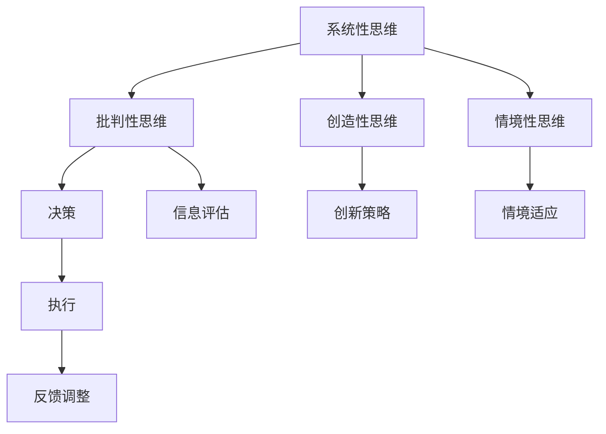

                 

# 思维体系对领导力的影响

在当今这个快速变化、竞争激烈的商业环境中，领导者需要具备一系列的软技能和思维能力，以应对各种复杂的挑战。思维体系，作为领导力的一个重要组成部分，不仅影响着个人决策的能力，更是影响着团队绩效和组织发展的关键因素。本文将探讨思维体系对领导力的影响，包括其核心概念、具体应用以及如何构建和提升这些能力。

## 1. 背景介绍

### 1.1 问题由来

在传统管理学中，领导力往往被视为一种内在的特质或能力，强调领导者的个人魅力和魅力。然而，随着心理学和组织行为学的研究深入，我们逐渐认识到，领导力的发展不仅仅依赖于天赋，更是建立在系统的思维体系和技能提升之上。有效的领导不仅需要掌握决策和沟通等核心技能，更需要通过结构化思维体系来支持策略制定和团队管理。

### 1.2 问题核心关键点

思维体系，作为领导力的核心组成部分，指的是个体在信息处理、决策制定和问题解决过程中所采用的方法和模式。这些方法模式包括但不限于系统性思维、批判性思维、创造性思维和情境性思维等。这些思维体系不仅帮助领导者更好地理解复杂环境，还能在各种挑战下做出更科学、更有效的决策。

本文旨在深入探讨以下核心问题：
1. 思维体系是如何影响领导力的？
2. 不同思维体系在领导力提升中的作用？
3. 如何构建和提升领导者的思维体系？

## 2. 核心概念与联系

### 2.1 核心概念概述

为了更好地理解思维体系对领导力的影响，我们先来概述几个关键概念：

- **系统性思维(Systematic Thinking)**：强调逻辑和结构，通过系统的方法分析问题，识别和解决根本原因，从而实现更高效的决策。
- **批判性思维(Critical Thinking)**：注重分析和评价，对信息进行批判性评估，避免偏见和错误推理，从而做出更为合理的决策。
- **创造性思维(Creative Thinking)**：鼓励创新和突破常规，在复杂情境下提出新颖的解决方案，激发组织创新能力。
- **情境性思维(Contextual Thinking)**：关注情境和关系，理解特定环境下的需求和挑战，灵活调整策略以应对变化。

这些思维体系相互交织，共同构成了领导者应对各种复杂情境的决策工具箱。通过合理的运用这些思维体系，领导者能够更好地处理信息、制定战略、激励团队，最终实现组织目标。

### 2.2 核心概念原理和架构的 Mermaid 流程图



这个流程图展示了思维体系在领导力中的应用路径。系统性思维作为基础，通过批判性思维对信息进行评估，创造性思维提出创新策略，情境性思维则帮助适应特定的环境。最终，决策、执行和反馈调整构成了一个闭环，确保领导者能够在动态变化的环境中不断优化和提升。

## 3. 核心算法原理 & 具体操作步骤

### 3.1 算法原理概述

领导力的提升，可以视为一种算法优化过程。通过系统化的方法，领导者可以在实践中不断优化自身的思维体系，以适应不同情境下的领导挑战。这一过程通常包括以下几个关键步骤：

1. **信息收集**：全面了解组织内外环境，收集相关信息和数据。
2. **思维模型应用**：根据特定情境，选择合适的思维模型进行分析。
3. **决策制定**：基于分析结果，制定和调整决策策略。
4. **执行与反馈**：将决策付诸实施，并通过反馈进行迭代优化。

### 3.2 算法步骤详解

下面是具体的算法步骤详解：

**Step 1: 信息收集**
- 通过问卷调查、访谈、数据分析等多种方式，全面收集组织内外的信息。
- 识别关键利益相关者，理解其需求和期望。
- 分析行业趋势和竞争对手动态。

**Step 2: 思维模型应用**
- 根据问题特点，选择适合的思维模型。
  - 系统性思维：适用于分析复杂系统和流程。
  - 批判性思维：适用于评估和筛选信息，做出基于证据的决策。
  - 创造性思维：适用于创新和突破常规。
  - 情境性思维：适用于理解特定环境下的需求和挑战。
- 构建思维地图，系统化整理和分析信息。

**Step 3: 决策制定**
- 使用SWOT分析、PEST分析等工具，评估组织内外的优势、劣势、机会和威胁。
- 设定明确的战略目标和优先级。
- 制定详细的行动计划和时间表。

**Step 4: 执行与反馈**
- 分配任务和资源，确保行动计划顺利实施。
- 实时监控执行情况，及时调整策略。
- 收集反馈信息，分析结果，进行持续优化。

### 3.3 算法优缺点

系统化的思维体系提升领导力的同时，也存在一定的局限性：
- **优点**：
  - 提升决策科学性，减少主观偏见。
  - 增强组织适应性和灵活性。
  - 促进团队协作和创新。
- **缺点**：
  - 学习曲线较陡峭，需要时间和耐心。
  - 方法过于结构化，可能缺乏灵活性。
  - 对个体和团队的适应性要求较高。

### 3.4 算法应用领域

思维体系提升领导力的应用领域非常广泛，包括但不限于：
- 企业战略规划：系统性思维帮助识别关键问题和机会，制定长期战略。
- 团队管理：批判性思维和情境性思维帮助理解团队动态，提升管理效果。
- 创新研发：创造性思维促进产品和服务创新，推动组织发展。
- 危机应对：系统性思维和情境性思维帮助识别危机根源，制定应对策略。

## 4. 数学模型和公式 & 详细讲解 & 举例说明

### 4.1 数学模型构建

在领导力提升的思维体系中，我们可以构建一个简单的数学模型来模拟这一过程：

$$
\text{领导力} = f(\text{信息收集}, \text{思维模型}, \text{决策制定}, \text{执行与反馈})
$$

其中，$f$表示映射关系，反映了信息收集、思维模型应用、决策制定和执行反馈之间的动态互动。

### 4.2 公式推导过程

以系统性思维为例，其核心公式可以表示为：

$$
\text{系统性思维} = \text{系统分析} \times \text{情境理解} \times \text{数据驱动}
$$

其中，系统分析指的是对系统结构的全面分析和优化，情境理解是对特定情境下需求和挑战的深度洞察，数据驱动则强调基于数据的决策制定。

### 4.3 案例分析与讲解

假设一个组织面临市场需求变化，需要调整产品线。

**Step 1: 信息收集**
- 通过市场调研，了解消费者需求和竞争对手动态。
- 分析内部资源和能力，识别现有产品线的优势和劣势。

**Step 2: 思维模型应用**
- 系统性思维：分析市场和内部资源，识别市场需求变化的关键因素。
- 情境性思维：理解特定市场的文化和环境，确保策略的适用性。
- 数据驱动：利用数据分析工具，评估市场潜力和竞争对手策略。

**Step 3: 决策制定**
- 基于系统分析结果，制定产品调整策略。
- 考虑情境性思维，灵活调整策略以适应特定市场。
- 使用数据驱动的结果，评估和筛选潜在产品。

**Step 4: 执行与反馈**
- 分配资源和任务，确保产品调整策略的实施。
- 实时监控市场反应，调整策略以应对新变化。
- 收集反馈信息，分析结果，进行持续优化。

## 5. 项目实践：代码实例和详细解释说明

### 5.1 开发环境搭建

为了实现思维体系提升领导力的应用，需要搭建一个基于Python的开发环境。以下是一个基本的搭建流程：

1. **安装Python和相关库**：
   - 安装Python 3.x版本，使用pip安装numpy、pandas、matplotlib等数据处理和可视化库。
   - 安装TensorFlow或PyTorch，用于处理复杂数据和构建模型。

2. **搭建开发环境**：
   - 使用Jupyter Notebook或PyCharm等IDE，创建新的Python项目。
   - 设置虚拟环境，确保代码的可移植性和依赖管理。

### 5.2 源代码详细实现

以下是使用Python实现思维体系提升领导力的代码示例：

```python
import numpy as np
import pandas as pd
import matplotlib.pyplot as plt
from sklearn.decomposition import PCA

# 信息收集
data = pd.read_csv('organization_data.csv')
# 数据清洗和预处理

# 思维模型应用
# 使用PCA进行系统性分析
pca = PCA(n_components=2)
X = data[['feature1', 'feature2']]  # 假设数据包含两个关键特征
X_pca = pca.fit_transform(X)

# 决策制定
# 基于PCA结果，制定产品调整策略
# 使用matplotlib绘制散点图，帮助理解数据结构和关键点

plt.scatter(X_pca[:, 0], X_pca[:, 1])
plt.xlabel('PC1')
plt.ylabel('PC2')
plt.title('PCA Results')
plt.show()

# 执行与反馈
# 根据PCA结果，调整产品线
# 实时监控市场反应，收集反馈信息
# 使用数据驱动的方法，持续优化产品调整策略
```

### 5.3 代码解读与分析

上述代码展示了使用PCA进行系统性分析的过程，并通过散点图可视化分析结果。在实际应用中，可以根据具体需求选择合适的思维模型，并结合数据处理和可视化工具进行深入分析。

## 6. 实际应用场景

### 6.1 企业战略规划

在企业战略规划中，系统性思维和批判性思维尤为重要。通过全面分析市场和内部资源，领导者可以制定更科学、更合理的长期战略，确保组织在变化的市场环境中保持竞争力。

### 6.2 团队管理

团队管理中，情境性思维和批判性思维能够帮助领导者更好地理解团队动态，识别成员需求和挑战，从而制定有效的激励和管理策略，提升团队绩效。

### 6.3 创新研发

创新研发过程中，创造性思维和数据驱动的结合，可以激发组织创新能力，推动新产品和服务的开发，满足市场需求。

### 6.4 危机应对

在危机应对中，系统性思维和情境性思维帮助领导者识别危机根源，制定科学应对策略，降低损失，保障组织稳定运行。

## 7. 工具和资源推荐

### 7.1 学习资源推荐

为了帮助领导者系统掌握思维体系提升领导力的知识，这里推荐一些优质的学习资源：

1. **《领导力与组织行为学》课程**：由知名大学教授和专家讲授，涵盖领导力的核心理论和实际应用案例。
2. **《创新思维与领导力》书籍**：深入探讨创新思维在领导力提升中的作用，提供系统化的方法和工具。
3. **在线课程平台**：如Coursera、edX等，提供大量关于领导力提升和思维体系培训的课程。

### 7.2 开发工具推荐

为了更好地进行思维体系的实践应用，推荐以下开发工具：

1. **Python和相关库**：用于数据处理和模型构建，支持复杂数据分析和可视化。
2. **Jupyter Notebook**：交互式开发环境，便于代码测试和结果展示。
3. **PyCharm**：Python IDE，提供代码编写和调试的强大功能。

### 7.3 相关论文推荐

以下几篇论文探讨了思维体系在领导力提升中的应用：

1. **《领导力与组织行为学》**：探讨领导力的理论和实践，分析不同思维体系的作用。
2. **《情境性思维与领导力》**：分析情境性思维在领导决策中的应用。
3. **《创新思维与组织绩效》**：研究创新思维对组织绩效的提升作用。

## 8. 总结：未来发展趋势与挑战

### 8.1 研究成果总结

本文从背景介绍、核心概念与联系、核心算法原理、具体操作过程等多个维度，详细探讨了思维体系对领导力的影响。通过系统性、批判性、创造性和情境性思维的应用，领导者能够更好地处理复杂情境，制定科学决策，提升组织绩效。

### 8.2 未来发展趋势

未来，思维体系在领导力提升中的应用将呈现以下几个趋势：

1. **数据驱动和智能化**：随着大数据和人工智能技术的发展，数据驱动的决策制定将更加普遍，智能系统将辅助领导者进行更高效的决策。
2. **跨领域融合**：跨学科融合的思维体系将成为未来领导力的重要组成部分，涵盖心理学、经济学、计算机科学等多个领域。
3. **个性化和情境化**：领导力提升将更加注重个性化和情境化，不同情境下的领导者需要灵活运用不同的思维模型。

### 8.3 面临的挑战

尽管思维体系在领导力提升中具有重要价值，但仍然面临以下挑战：

1. **复杂性**：思维体系的构建和应用较为复杂，需要领导者具备较高的系统思维能力。
2. **变革难度**：在实际应用中，思维体系的变革往往需要组织内部各方面的支持。
3. **模型泛化**：不同组织和情境下的思维模型需要个性化定制，缺乏通用性。

### 8.4 研究展望

未来的研究应在以下几个方向上继续深入：

1. **理论体系的完善**：进一步研究不同思维体系的理论基础和应用方法，构建更完善的领导力提升框架。
2. **实证研究**：通过实证研究，评估不同思维体系在实际应用中的效果，提供科学依据。
3. **跨学科研究**：促进心理学、管理学、计算机科学等多学科的交叉研究，探索思维体系提升领导力的新方法和新工具。

## 9. 附录：常见问题与解答

**Q1: 如何判断一个思维体系是否适用于特定情境？**

A: 首先要明确思维体系的核心原理和方法，然后根据特定情境的需求和特点进行匹配。一般来说，系统性思维适用于复杂系统分析，批判性思维适用于信息评估，创造性思维适用于创新和突破常规，情境性思维适用于理解和适应特定环境。通过详细的分析和评估，可以确定最适合的思维体系。

**Q2: 如何在团队中推广思维体系提升领导力的理念？**

A: 领导者可以通过以下几个步骤推广思维体系：
1. 领导者和骨干成员首先学习和应用。
2. 定期组织培训和分享会，鼓励团队成员交流和讨论。
3. 将思维体系融入组织文化和价值观，通过制度和激励机制加以推广。

**Q3: 如何克服思维体系提升领导力的变革阻力？**

A: 变革阻力主要来自于习惯和观念的改变。以下是一些应对策略：
1. 通过成功案例展示思维体系提升领导力的效果。
2. 逐步引入，分阶段实施，减少变革压力。
3. 建立反馈机制，及时调整和优化变革方案。

通过这些方法的综合应用，可以克服思维体系提升领导力的变革阻力，推动组织的全面转型。

---

作者：禅与计算机程序设计艺术 / Zen and the Art of Computer Programming

