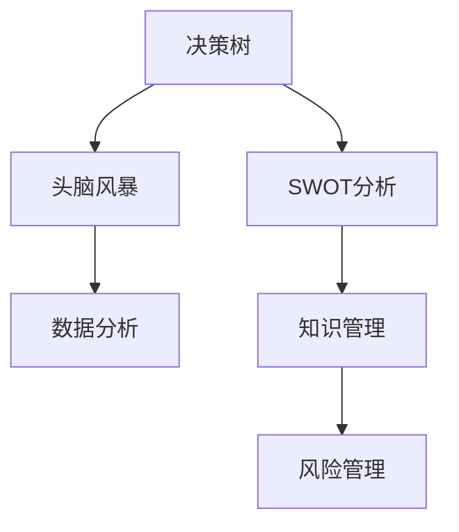

                 

## 1. 背景介绍

### 1.1 问题由来
在现代企业的运作中，复杂多变的管理环境使得传统的决策方式日益失效。市场环境的不确定性、组织结构的复杂性、信息的多样性和多变性，都对管理决策提出了更高的要求。在这种背景下，思维工具的运用变得愈发重要。从决策模型到数据分析，再到问题解决，思维工具在管理中的应用日益广泛，成为企业提升竞争力的重要手段。本文将系统地探讨思维工具在管理中的实际应用，从理论到实践，展现其如何助力企业决策和管理。

### 1.2 问题核心关键点
在管理中应用思维工具，主要基于以下几个关键点：
1. **决策支持与优化**：通过思维工具构建数学模型，优化企业决策过程。
2. **问题解决与创新**：运用思维工具的方法和技巧，解决复杂管理问题，促进企业创新。
3. **数据分析与洞察**：利用思维工具的分析和计算能力，从海量数据中提取有价值的商业洞察。
4. **知识管理与传承**：通过思维工具，系统化地管理企业知识，促进知识在组织中的传承和创新。
5. **风险管理与控制**：运用思维工具的风险评估和控制机制，降低企业运营风险。

### 1.3 问题研究意义
思维工具在管理中的应用，对于提升企业决策能力、优化管理流程、增强企业创新力和竞争力具有重要意义。通过系统地应用思维工具，企业能够更好地应对复杂多变的管理环境，提高决策的科学性和精确性，从而在激烈的市场竞争中占据有利地位。

## 2. 核心概念与联系

### 2.1 核心概念概述

在探讨思维工具的应用时，需要了解几个核心概念：

1. **思维工具**：指一系列方法和工具，帮助人们系统化地思考和解决问题。常见的思维工具包括决策树、头脑风暴、SWOT分析等。
2. **决策树**：一种树形结构，用于表示不同决策条件下的可能结果和风险。
3. **头脑风暴**：一种集思广益的方法，通过激发创意思维，寻找创新的解决方案。
4. **SWOT分析**：通过分析企业的优势、劣势、机会和威胁，指导企业的战略决策。
5. **数据分析**：利用统计和数学工具，从数据中提取有价值的商业洞察。
6. **知识管理**：系统化地收集、存储、管理和共享组织内的知识。
7. **风险管理**：通过评估和管理风险，降低不确定性对企业运营的影响。

这些核心概念相互联系，共同构成企业决策和管理的基础框架。以下使用Mermaid流程图来展示这些概念之间的联系：



## 3. 核心算法原理 & 具体操作步骤
### 3.1 算法原理概述

在企业管理中，思维工具的运用基于以下算法原理：

1. **数学建模**：将企业决策和管理问题转化为数学模型，通过求解模型优化决策。
2. **统计分析**：利用统计学方法，从数据中提取规律和洞察，指导管理决策。
3. **模型训练与优化**：通过训练和优化决策模型，提高决策的准确性和鲁棒性。
4. **算法实现与部署**：将决策算法实现为软件工具，部署到实际管理系统中，提供实时决策支持。

### 3.2 算法步骤详解

以下是利用决策树进行企业风险评估和优化的详细步骤：

**Step 1: 数据准备**
- 收集企业内部和外部的数据，包括历史决策数据、市场环境数据、财务数据等。
- 清洗数据，去除噪声和异常值。

**Step 2: 构建决策树**
- 确定决策树的节点，包括决策点（如市场环境、财务状况等）和风险点（如市场需求、竞争压力等）。
- 根据历史数据和专家知识，建立决策树的结构，并计算各节点的权重和期望值。

**Step 3: 模型训练**
- 使用历史数据训练决策树模型，优化决策树参数，如节点分裂条件、权重调整等。
- 通过交叉验证和测试数据集，评估模型的性能和鲁棒性。

**Step 4: 模型应用**
- 在实际决策中，将输入数据输入决策树模型，根据模型输出的风险评估结果进行决策。
- 定期更新模型参数，根据新数据和市场变化进行调整。

**Step 5: 效果评估**
- 通过实际决策结果与模型预测结果进行对比，评估模型的精度和实用性。
- 收集用户反馈，不断优化决策树的算法和结构。

### 3.3 算法优缺点

**优点**：
1. **系统性**：利用数学模型和数据分析，系统地处理复杂管理问题，减少决策的主观性和随机性。
2. **可解释性**：决策树的可视化结构，易于理解和解释，增强了决策的透明性和可接受性。
3. **灵活性**：决策树可以根据实际情况进行动态调整和优化，适应不同环境和管理需求。
4. **风险管理**：通过风险评估和控制机制，降低不确定性对企业运营的影响，提高管理决策的稳健性。

**缺点**：
1. **计算复杂性**：决策树模型需要大量计算和数据，在大规模管理系统中应用较为复杂。
2. **数据依赖性**：模型效果依赖于数据质量和数据代表性，数据不足或偏差可能导致模型失效。
3. **模型可扩展性**：决策树模型需要根据实际情况进行调整和优化，难以应对快速变化的市场环境。
4. **算法复杂性**：决策树的算法实现和参数调整需要一定的专业知识和技能，对非专业人士要求较高。

### 3.4 算法应用领域

决策树在企业管理中的应用主要包括以下几个领域：

1. **投资决策**：评估股票、项目等投资的风险和收益，辅助投资决策。
2. **供应链管理**：优化供应链流程，降低运营成本，提高供应链效率。
3. **产品开发**：评估新产品开发的风险和市场需求，指导产品设计和开发。
4. **客户管理**：分析客户行为和需求，制定针对性的营销策略，提升客户满意度。
5. **人力资源管理**：评估员工绩效和潜力，制定人力资源规划和激励机制。

## 4. 数学模型和公式 & 详细讲解  
### 4.1 数学模型构建

在进行风险评估和优化时，常用的数学模型包括决策树模型和神经网络模型。

**决策树模型**：
- 决策树是一种树形结构，用于表示不同决策条件下的可能结果和风险。
- 决策树的节点表示决策点（如市场环境、财务状况等），叶子节点表示决策结果（如高风险、低风险等）。

**神经网络模型**：
- 神经网络是一种模拟人脑的计算模型，用于处理复杂的数据和非线性关系。
- 神经网络模型由多个神经元组成，通过多层非线性变换，提取数据特征，进行预测和分类。

### 4.2 公式推导过程

以下是决策树模型的推导过程：

**决策树基本结构**：
- 决策树由根节点、内部节点和叶子节点组成。
- 根节点表示初始决策条件，内部节点表示决策过程中的中间状态，叶子节点表示最终决策结果。

**决策树构建算法**：
- 选择一个最优的决策点，按照某个分裂标准（如信息增益、信息增益比等）将数据集分成两部分。
- 对每部分数据集递归地应用相同的过程，直到满足某个终止条件（如节点样本数小于某个阈值）。

**公式推导**：
- 设决策树的节点数为 $n$，每个节点的样本数为 $n_i$，风险评估结果为 $y_i$。
- 决策树的总风险评估结果为 $\sum_{i=1}^n \frac{n_i}{N} y_i$，其中 $N$ 为总样本数。
- 决策树的总期望风险为 $E(\sum_{i=1}^n \frac{n_i}{N} y_i)$，其中 $E$ 表示期望。

### 4.3 案例分析与讲解

**案例分析：投资风险评估**

某企业需要评估一项新投资的风险和收益，利用决策树模型进行风险评估。

**数据准备**：
- 收集历史投资数据，包括投资项目、收益、风险等。
- 清洗数据，去除噪声和异常值。

**构建决策树**：
- 确定决策树的节点，包括市场环境、财务状况、项目类型等。
- 根据历史数据和专家知识，建立决策树的结构，并计算各节点的权重和期望值。

**模型训练**：
- 使用历史数据训练决策树模型，优化决策树参数。
- 通过交叉验证和测试数据集，评估模型的性能和鲁棒性。

**模型应用**：
- 在实际投资决策中，将新项目的市场环境、财务状况等输入决策树模型，输出风险评估结果。
- 定期更新模型参数，根据新数据和市场变化进行调整。

**效果评估**：
- 通过实际投资结果与模型预测结果进行对比，评估模型的精度和实用性。
- 收集用户反馈，不断优化决策树的算法和结构。

## 5. 项目实践：代码实例和详细解释说明
### 5.1 开发环境搭建

在进行项目实践时，需要准备以下开发环境：

1. **Python编程环境**：
   - 安装Python 3.8或更高版本，确保与项目兼容。
   - 安装Anaconda或Miniconda，创建一个虚拟环境，并激活该环境。

2. **数据分析和可视化工具**：
   - 安装NumPy、Pandas、Matplotlib等数据处理和可视化工具。

3. **机器学习框架**：
   - 安装scikit-learn、TensorFlow等机器学习框架，用于构建和训练决策树模型。

4. **企业管理系统集成**：
   - 使用企业管理系统API接口，获取和更新数据。

5. **实时数据流处理**：
   - 安装Kafka、Flume等数据流处理工具，实现数据的实时采集和处理。

### 5.2 源代码详细实现

以下是使用Python和scikit-learn库构建决策树模型的代码实现：

```python
from sklearn.tree import DecisionTreeClassifier
from sklearn.model_selection import train_test_split
from sklearn.metrics import accuracy_score

# 加载数据
data = load_data()

# 数据预处理
X = preprocess_data(data['features'])
y = preprocess_data(data['labels'])

# 划分训练集和测试集
X_train, X_test, y_train, y_test = train_test_split(X, y, test_size=0.2)

# 构建决策树模型
model = DecisionTreeClassifier()
model.fit(X_train, y_train)

# 预测测试集结果
y_pred = model.predict(X_test)

# 计算模型准确率
accuracy = accuracy_score(y_test, y_pred)
print(f"模型准确率：{accuracy:.2f}")
```

### 5.3 代码解读与分析

**数据加载与预处理**：
- `load_data()` 函数用于加载数据，`preprocess_data()` 函数用于数据清洗和标准化。

**模型训练与预测**：
- `DecisionTreeClassifier()` 用于创建决策树模型。
- `fit()` 方法用于训练模型，`predict()` 方法用于预测新数据。

**性能评估**：
- `accuracy_score()` 函数用于计算模型预测结果与真实标签的准确率。

**结果展示**：
- 输出模型准确率，评估模型性能。

## 6. 实际应用场景
### 6.1 投资决策

某投资公司利用决策树模型进行新投资项目的风险评估和收益预测。通过历史投资数据和专家知识，构建决策树模型，对新项目的市场环境、财务状况、行业前景等进行综合评估，辅助公司高层决策。

### 6.2 供应链管理

某制造企业利用决策树模型优化供应链流程，降低运营成本。通过历史订单数据和生产数据，构建决策树模型，评估不同供应链方案的风险和收益，辅助企业优化库存管理和生产调度。

### 6.3 产品开发

某科技公司利用决策树模型评估新产品开发的风险和市场需求。通过历史产品数据和市场调研数据，构建决策树模型，对新产品的技术可行性、市场潜力、竞争环境等进行综合评估，指导产品设计和开发。

### 6.4 客户管理

某电商平台利用决策树模型分析客户行为和需求，制定针对性的营销策略。通过历史交易数据和用户行为数据，构建决策树模型，对客户的购买偏好、流失风险等进行评估，指导个性化推荐和客户维护。

## 7. 工具和资源推荐
### 7.1 学习资源推荐

为了帮助企业管理者系统掌握思维工具的运用，这里推荐一些优质的学习资源：

1. **《数据分析与决策建模》**：系统介绍数据分析和决策建模的基本原理和方法。
2. **《Python数据科学手册》**：详细介绍Python在数据分析和决策建模中的应用。
3. **《统计学习方法》**：经典教材，系统讲解统计学习的基本理论和方法。
4. **Coursera数据科学课程**：涵盖数据处理、统计分析、机器学习等课程，提供系统化的学习路径。
5. **Kaggle数据科学竞赛平台**：通过参与数据科学竞赛，实践和提升数据分析和决策建模能力。

### 7.2 开发工具推荐

高效的工具是提升项目实践效率的关键。以下是几款推荐的开发工具：

1. **Jupyter Notebook**：开源的交互式编程环境，支持Python和R等多种语言，方便数据处理和模型验证。
2. **Scikit-learn**：Python的机器学习库，提供多种算法和工具，用于构建和训练决策树模型。
3. **TensorFlow**：Google开发的机器学习框架，支持深度学习模型和数据流处理，提供丰富的工具和资源。
4. **Kafka**：Apache基金会开发的分布式流处理平台，支持实时数据采集和处理。
5. **Flume**：Apache基金会开发的数据流处理系统，支持大规模数据采集和存储。

### 7.3 相关论文推荐

以下是几篇经典论文，推荐阅读：

1. **《决策树算法及其实现》**：介绍决策树算法的原理和实现方法。
2. **《深度学习在企业管理中的应用》**：探讨深度学习技术在企业管理中的应用，提供实际案例和分析。
3. **《大数据下的决策支持系统》**：介绍大数据和决策支持系统的结合，探讨其应用和未来发展方向。
4. **《基于神经网络的供应链优化》**：利用神经网络优化供应链流程，降低运营成本，提升供应链效率。

## 8. 总结：未来发展趋势与挑战
### 8.1 总结

本文系统地介绍了思维工具在企业管理中的应用，从理论到实践，展示了其如何助力企业决策和管理。通过应用决策树等思维工具，企业能够更好地处理复杂多变的管理环境，提高决策的科学性和精确性，从而在激烈的市场竞争中占据有利地位。

### 8.2 未来发展趋势

展望未来，思维工具在企业管理中的应用将呈现以下几个发展趋势：

1. **数据驱动决策**：随着数据量的不断增加，数据驱动决策将成为企业管理的重要方式。通过大数据和AI技术，从海量数据中提取有价值的商业洞察，指导管理决策。
2. **智能决策系统**：基于机器学习和深度学习技术的智能决策系统，将逐渐普及，提升决策的自动化和智能化水平。
3. **实时决策支持**：通过实时数据流处理和分析，提供即时决策支持，增强管理决策的灵活性和及时性。
4. **多模态数据融合**：结合文本、语音、图像等多模态数据，进行全面分析和决策，提高决策的全面性和准确性。
5. **人机协同决策**：通过增强现实(AR)、虚拟现实(VR)等技术，实现人机协同决策，增强决策的直观性和交互性。

### 8.3 面临的挑战

尽管思维工具在企业管理中的应用取得了显著成效，但仍面临以下挑战：

1. **数据质量问题**：数据的不完整、不清洁和噪声问题，可能导致模型性能下降。
2. **算法复杂性**：复杂的多层次数据模型，需要较高的专业知识和技能，增加了应用难度。
3. **模型可解释性**：复杂模型的可解释性不足，难以理解模型的决策逻辑和过程。
4. **系统集成问题**：不同系统和工具的集成，增加了系统的复杂性和维护成本。
5. **用户接受度**：企业员工对新工具的接受度不高，影响系统的应用效果。

### 8.4 研究展望

未来，企业应从以下几个方面进行研究，以应对管理中的挑战：

1. **数据治理与清洗**：提升数据质量，进行数据清洗和标准化，保障模型的准确性。
2. **模型简化与优化**：简化决策模型，降低算法复杂性，提升模型的可解释性和可接受性。
3. **系统集成与优化**：优化系统架构和集成方式，降低系统的复杂性和维护成本。
4. **用户培训与教育**：加强员工培训和教育，提高员工对新工具的接受度和使用效果。
5. **人工智能与思维工具结合**：将人工智能与思维工具结合，提升决策的自动化和智能化水平。

## 9. 附录：常见问题与解答

**Q1：如何使用决策树模型进行风险评估？**

A: 使用决策树模型进行风险评估时，需要收集相关数据，构建决策树模型，并通过训练和预测进行评估。具体步骤如下：
1. 收集历史数据，包括决策条件和风险评估结果。
2. 数据预处理，清洗数据，去除噪声和异常值。
3. 构建决策树模型，确定决策点和风险点。
4. 训练模型，通过历史数据优化决策树参数。
5. 预测新数据，输入决策树模型，输出风险评估结果。
6. 评估模型性能，收集用户反馈，不断优化模型。

**Q2：决策树模型和神经网络模型有何区别？**

A: 决策树模型和神经网络模型是两种常用的数据分析和决策建模工具，它们的主要区别如下：
1. **结构复杂性**：决策树模型结构简单，易于理解和解释；神经网络模型结构复杂，包含多个层次和节点。
2. **数据处理能力**：决策树模型适用于处理简单线性关系的数据；神经网络模型适用于处理非线性关系和复杂数据。
3. **参数调整**：决策树模型参数较少，易于优化和调整；神经网络模型参数众多，需要较长的训练时间和较大的计算资源。
4. **可解释性**：决策树模型的决策路径和节点权重易于解释，神经网络模型的决策过程较难解释。

**Q3：在构建决策树时，如何选择最优的决策点？**

A: 在构建决策树时，选择最优的决策点需要考虑以下因素：
1. 信息增益：选择信息增益最大的决策点，使得决策树对数据的分割更加合理。
2. 信息增益比：选择信息增益比最大的决策点，避免决策树过拟合。
3. 熵：选择熵最小的决策点，使得决策树对数据的分割更加均匀。
4. 基尼系数：选择基尼系数最小的决策点，使得决策树对数据的分类更加准确。

**Q4：如何提高决策树模型的可解释性？**

A: 提高决策树模型的可解释性，可以通过以下方法：
1. 简化模型结构：减少决策树的深度和宽度，使其更加简单和易于理解。
2. 使用可视化工具：利用决策树可视化工具，如TreeViz，展示决策树的结构。
3. 注释决策路径：在决策树的每个节点上，注释其决策条件和决策结果，增强可解释性。
4. 解释模型参数：解释决策树模型的参数和权重，使其更加透明和易于理解。

---

作者：禅与计算机程序设计艺术 / Zen and the Art of Computer Programming

