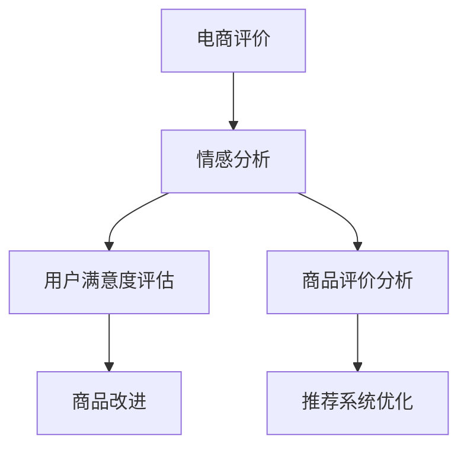

                 

# 情感分析在电商领域的应用：从用户评价到商品改进

情感分析是自然语言处理(NLP)领域中一种重要应用，它能够从文本数据中识别和提取情感倾向，帮助企业洞察用户需求和反馈。在电商领域，情感分析尤为重要，因为它直接关系到商品评价、客服服务、用户留存等多个方面，是驱动电商业务决策和改进的关键技术。本文将从背景介绍、核心概念与联系、核心算法原理与操作步骤、数学模型与公式、项目实践、应用场景、工具和资源推荐、总结与未来展望、附录等各个方面，系统全面地探讨情感分析在电商领域的应用。

## 1. 背景介绍

### 1.1 问题由来

电商行业经历了几十年的高速发展，从传统线下实体商店到线上电商平台，再到如今的全方位、全渠道的融合发展，规模和形式发生了巨大变化。在这个过程中，用户评价、评论、反馈等文本数据也随之大量产生，成为电商平台了解用户需求、提升商品质量和服务水平的重要依据。然而，这些文本数据规模庞大，形式多样，如何有效挖掘和利用其中的情感信息，是一个亟需解决的问题。

情感分析技术，通过对文本中情感倾向的识别和分析，能帮助电商平台精准理解用户反馈，快速定位商品和服务中的不足，进行针对性的改进。具体应用包括商品评价分析、客服满意度评估、广告投放效果监测、产品推荐系统优化等。

### 1.2 问题核心关键点

- **文本数据规模庞大**：电商平台用户数量庞大，生成的文本数据量惊人，如何高效处理和分析这些数据是一大挑战。
- **情感分析精度要求高**：电商业务对情感分析的精度要求较高，细微的情感倾向变化可能关系到用户购买决策，必须准确识别和理解。
- **实时性要求**：电商业务中，用户评价实时更新，需要情感分析模型具备快速响应的能力，及时获取并分析新的评价数据。
- **多模态融合**：电商平台的反馈数据不仅包含文本，还包括图片、评分、行为等多种形式，需要结合多种模态信息进行综合分析。
- **隐私保护**：电商平台需要保护用户隐私，避免在情感分析中泄露用户个人信息。

## 2. 核心概念与联系

### 2.1 核心概念概述

为更好地理解情感分析在电商领域的应用，本节将介绍几个密切相关的核心概念：

- **情感分析(Sentiment Analysis)**：从文本中识别和提取情感信息，判断文本的情感倾向（如正面、负面、中性）。
- **电商评价(Online Reviews)**：电商平台上的用户评价、评论、反馈等文本数据，是情感分析的重要数据源。
- **自然语言处理(NLP)**：利用计算机技术处理和分析人类语言，情感分析是NLP领域中的一个重要应用。
- **用户满意度(Satiation)**：用户对商品、服务的满意度，情感分析可以用于评估用户满意度的整体水平。
- **商品评价分析(Review Analysis)**：通过对用户评价的分析，识别商品的质量、性能、价格等方面的优劣。
- **推荐系统(Recommendation System)**：利用情感分析结果优化推荐算法，提升用户满意度，增加销售额。

这些概念之间存在着紧密的联系，形成了一个整体的应用体系。情感分析作为核心技术，通过分析和理解用户评价，提供用户满意度的洞见，指导商品改进和推荐系统优化，从而提升电商平台的用户体验和业务效果。

### 2.2 核心概念原理和架构的 Mermaid 流程图



该流程图展示了情感分析在电商领域中的应用框架：

- 电商评价数据（如用户评论）作为输入，通过情感分析获得情感倾向。
- 用户满意度评估通过情感分析结果，量化用户对商品和服务的整体满意度。
- 商品评价分析从情感分析中提取商品质量、性能、价格等方面的评价信息。
- 推荐系统优化利用情感分析结果，提升推荐精度和效果，提升用户体验。
- 商品改进根据用户满意度评估和商品评价分析结果，指导商品设计和质量改进。

## 3. 核心算法原理 & 具体操作步骤

### 3.1 算法原理概述

情感分析的核心目标是从文本中提取出情感信息，并量化为情感极性（如正面、负面、中性）。常见的情感分析方法包括基于规则、词典、机器学习等，其中机器学习方法是最常用的。

基于机器学习的情感分析方法通常分为两种：基于有监督学习和无监督学习。基于有监督学习方法需要大量标注的训练数据，用于训练情感分类模型，并在新的评价数据上评估性能。无监督学习方法则无需标注数据，通过文本特征和情感词典等手段进行情感分析。

电商领域的情感分析应用中，常见的有监督学习方法包括逻辑回归、支持向量机、朴素贝叶斯等，而无监督学习方法则包括TF-IDF、情感词典、主题模型等。

### 3.2 算法步骤详解

下面详细介绍基于有监督学习的情感分析算法步骤：

1. **数据准备**：收集电商评价数据，清洗数据，去除无关信息，保留有用部分。例如，去除停用词、标点、特殊字符等。

2. **特征工程**：将文本转换为数值特征，常用的方法包括TF-IDF、word2vec、BERT等。其中，BERT模型因其强大的语言表示能力，在电商评价分析中取得了良好的效果。

3. **模型训练**：选择合适的机器学习模型（如逻辑回归、SVM等），使用标注的电商评价数据进行训练，并调整模型参数，优化模型性能。

4. **模型评估**：使用验证集评估模型性能，如准确率、召回率、F1值等指标，调整模型超参数，选择最优模型。

5. **模型部署**：将训练好的模型部署到电商平台的实时计算环境中，对新的电商评价数据进行情感分析，提供情感分析结果。

### 3.3 算法优缺点

**优点**：
- 精确度高：基于有监督学习的情感分析方法能够利用标注数据训练高精度的情感分类模型。
- 可解释性好：机器学习模型在情感分析中具有良好的可解释性，能够提供明确的情感倾向预测。
- 适应性强：模型能够适应不同的电商业务场景，进行定制化的情感分析。

**缺点**：
- 依赖标注数据：需要有足够的标注数据进行模型训练，数据获取成本高。
- 模型复杂度高：有监督学习模型需要大量的训练数据和参数调优，计算成本高。
- 数据分布偏差：标注数据可能存在分布偏差，影响模型的泛化性能。

### 3.4 算法应用领域

情感分析在电商领域具有广泛的应用场景，具体包括：

- **商品评价分析**：通过分析用户对商品的功能、质量、价格等方面的评价，指导商品改进和优化。
- **客服满意度评估**：分析用户对客服服务的满意度，指导客服人员培训和流程改进。
- **广告投放效果监测**：通过情感分析结果评估广告投放效果，优化广告投放策略。
- **推荐系统优化**：结合情感分析结果，优化推荐算法，提升推荐精准度和用户体验。
- **舆情监测**：分析社交媒体上的用户情感，及时响应和处理负面舆情。

## 4. 数学模型和公式 & 详细讲解 & 举例说明

### 4.1 数学模型构建

假设我们有一批电商评价数据，记为 $\{(x_i, y_i)\}_{i=1}^N$，其中 $x_i$ 为电商评价文本，$y_i$ 为情感标签（如正面、负面、中性）。目标是构建一个情感分类模型 $f(x)$，使其能够对新的电商评价文本 $x$ 进行情感分类。

### 4.2 公式推导过程

以逻辑回归模型为例，目标函数为：

$$
\min_{w, b} -\frac{1}{N}\sum_{i=1}^N [y_i \log \sigma(x_i^Tw + b) + (1-y_i) \log(1-\sigma(x_i^Tw + b))]
$$

其中 $\sigma(z) = \frac{1}{1+e^{-z}}$ 为逻辑回归的输出函数，$w$ 和 $b$ 为模型的权重和偏置，$x_i$ 和 $y_i$ 分别为电商评价文本和情感标签。

在训练过程中，使用梯度下降算法更新模型参数 $w$ 和 $b$：

$$
w \leftarrow w - \eta \nabla_{w} \mathcal{L}(w, b), \quad b \leftarrow b - \eta \nabla_{b} \mathcal{L}(w, b)
$$

其中 $\eta$ 为学习率，$\nabla_{w} \mathcal{L}$ 和 $\nabla_{b} \mathcal{L}$ 分别为目标函数对权重和偏置的梯度。

### 4.3 案例分析与讲解

以电商评价分析为例，展示如何使用逻辑回归模型进行情感分类：

1. **数据准备**：收集电商评价数据，预处理文本，去除停用词、标点等无关信息。

2. **特征提取**：使用TF-IDF方法将文本转换为数值特征。

3. **模型训练**：选择逻辑回归模型，使用标注好的电商评价数据进行训练，调整超参数。

4. **模型评估**：使用验证集评估模型性能，如准确率、召回率、F1值等指标，选择最优模型。

5. **模型部署**：将训练好的模型部署到电商平台的实时计算环境中，对新的电商评价数据进行情感分析。

6. **应用分析**：结合情感分析结果，分析用户对商品的评价，指导商品改进和优化。

## 5. 项目实践：代码实例和详细解释说明

### 5.1 开发环境搭建

在进行情感分析实践前，我们需要准备好开发环境。以下是使用Python进行情感分析开发的常用环境配置流程：

1. **安装Anaconda**：从官网下载并安装Anaconda，用于创建独立的Python环境。

2. **创建并激活虚拟环境**：
```bash
conda create -n sentiment-env python=3.8 
conda activate sentiment-env
```

3. **安装相关库**：
```bash
conda install numpy pandas scikit-learn transformers torch torchtext
pip install nltk gensim
```

完成上述步骤后，即可在`sentiment-env`环境中开始情感分析实践。

### 5.2 源代码详细实现

下面是一个简单的基于BERT的情感分析模型的代码实现。

```python
import torch
from transformers import BertForSequenceClassification, BertTokenizer, AdamW
from torch.utils.data import DataLoader
from sklearn.metrics import accuracy_score, precision_recall_fscore_support

# 设置环境
device = torch.device('cuda' if torch.cuda.is_available() else 'cpu')

# 数据准备
tokenizer = BertTokenizer.from_pretrained('bert-base-uncased')
train_data = read_csv('train.csv')
test_data = read_csv('test.csv')

# 构建模型
model = BertForSequenceClassification.from_pretrained('bert-base-uncased', num_labels=3)
model.to(device)

# 定义优化器
optimizer = AdamW(model.parameters(), lr=2e-5)

# 训练函数
def train_epoch(model, train_loader, optimizer):
    model.train()
    total_loss = 0
    total_correct = 0
    for batch in train_loader:
        inputs = {key: tensor.to(device) for key, tensor in batch.items()}
        labels = inputs.pop('labels').to(device)
        outputs = model(**inputs)
        loss = outputs.loss
        logits = outputs.logits
        total_loss += loss.item()
        predictions = torch.argmax(logits, dim=1)
        total_correct += (predictions == labels).sum().item()
    return total_loss / len(train_loader), total_correct / len(train_loader.dataset)

# 评估函数
def evaluate(model, test_loader):
    model.eval()
    total_correct = 0
    for batch in test_loader:
        inputs = {key: tensor.to(device) for key, tensor in batch.items()}
        labels = inputs.pop('labels').to(device)
        outputs = model(**inputs)
        predictions = torch.argmax(outputs.logits, dim=1)
        total_correct += (predictions == labels).sum().item()
    return total_correct / len(test_loader.dataset)

# 训练和评估
epochs = 3
batch_size = 32

for epoch in range(epochs):
    train_loss, train_acc = train_epoch(model, train_loader, optimizer)
    test_acc = evaluate(model, test_loader)
    print(f'Epoch {epoch+1}, train loss: {train_loss:.4f}, train acc: {train_acc:.4f}, test acc: {test_acc:.4f}')

# 结果展示
print(f'Final train acc: {train_acc:.4f}, final test acc: {test_acc:.4f}')
```

在这个代码示例中，我们使用了预训练的BERT模型进行情感分类。代码实现包括以下几个关键步骤：

1. **数据准备**：使用`read_csv`函数读取训练数据和测试数据，并使用`BertTokenizer`对文本进行分词。
2. **模型加载**：使用`BertForSequenceClassification`从预训练模型加载情感分类模型。
3. **优化器设置**：使用`AdamW`优化器，设置学习率。
4. **训练函数实现**：在每个epoch中，使用训练数据进行前向传播和反向传播，计算损失函数和准确率。
5. **评估函数实现**：在测试数据上评估模型性能，计算准确率。
6. **训练和评估循环**：对模型进行多次训练和评估，最终输出训练和测试的准确率。

### 5.3 代码解读与分析

让我们再详细解读一下关键代码的实现细节：

- **`BertForSequenceClassification`**：用于加载预训练的BERT模型，并进行序列分类任务的微调。
- **`BertTokenizer`**：用于对文本进行分词，是BERT模型的重要组成部分。
- **`AdamW`优化器**：一种基于梯度的一阶优化算法，适合处理大规模的神经网络模型。
- **`train_epoch`函数**：在每个epoch中，使用训练数据进行一次前向传播和反向传播，计算损失函数和准确率。
- **`evaluate`函数**：使用测试数据评估模型性能，计算准确率。

代码中还利用了`sklearn.metrics`库中的`accuracy_score`函数计算准确率。

## 6. 实际应用场景

### 6.1 智能客服系统

在智能客服系统中，情感分析可以用于分析用户对客服的满意度，指导客服人员改进服务流程和沟通技巧。具体实现如下：

1. **数据收集**：收集用户与客服的聊天记录，提取用户情感信息。
2. **情感分析**：使用情感分析模型对聊天记录进行情感分类，评估用户满意度。
3. **服务改进**：根据情感分析结果，识别客服的常见问题点，优化服务流程和沟通方式。

### 6.2 商品评价分析

电商平台上，用户评价是商品质量的重要参考。通过情感分析，可以从中提取用户对商品性能、质量、价格等方面的评价，指导商家进行商品改进。具体实现如下：

1. **数据收集**：收集用户对商品的评价文本。
2. **情感分析**：使用情感分析模型对评价文本进行情感分类，提取负面评价信息。
3. **商品改进**：根据负面评价信息，指导商家进行商品设计、质量改进和价格调整。

### 6.3 广告投放效果监测

在电商广告投放中，广告效果评估尤为重要。通过情感分析，可以评估广告投放对用户情感的影响，指导广告策略的优化。具体实现如下：

1. **数据收集**：收集用户对广告的评价文本。
2. **情感分析**：使用情感分析模型对广告评价文本进行情感分类，评估广告效果。
3. **广告优化**：根据情感分析结果，调整广告内容、投放策略，提升广告效果。

### 6.4 未来应用展望

随着大模型和深度学习技术的发展，情感分析在电商领域的应用将越来越广泛，未来可能涉及以下方向：

1. **多模态融合**：结合文本、图片、评分等多种模态信息，进行更全面、准确的情感分析。
2. **实时计算**：利用流式数据处理技术，实时分析用户情感，及时响应负面情感，提升用户体验。
3. **个性化推荐**：结合情感分析结果，进行个性化推荐，提升推荐精度和效果。
4. **跨平台数据整合**：将不同平台（如社交媒体、电商平台）的用户评价数据进行整合，进行全局情感分析。
5. **情感挖掘**：利用深度学习模型挖掘用户情感背后的情感逻辑，提升情感分析的精度和可解释性。

## 7. 工具和资源推荐

### 7.1 学习资源推荐

为了帮助开发者系统掌握情感分析的理论基础和实践技巧，这里推荐一些优质的学习资源：

1. **《自然语言处理综论》**：北京大学出版社，涵盖了NLP领域的核心概念和应用技术。
2. **《深度学习》**：Ian Goodfellow等著，介绍了深度学习的基本原理和应用实例。
3. **《情感分析在电商中的应用》**：阿里研究院，详细介绍了情感分析在电商领域的应用案例和实践经验。
4. **Transformers官方文档**：提供了详细的预训练模型和微调样例，是学习情感分析的重要资源。
5. **Kaggle情感分析比赛**：通过实际数据集进行训练和评估，帮助开发者提升情感分析技能。

通过对这些资源的学习实践，相信你一定能够快速掌握情感分析的精髓，并用于解决实际的电商问题。

### 7.2 开发工具推荐

高效的开发离不开优秀的工具支持。以下是几款用于情感分析开发的常用工具：

1. **Python**：广泛应用的语言，拥有丰富的第三方库和框架。
2. **PyTorch**：深度学习框架，支持动态计算图，适合快速迭代研究。
3. **TensorFlow**：由Google开发的深度学习框架，生产部署方便。
4. **TensorBoard**：用于可视化模型训练状态的工具。
5. **NLTK**：自然语言处理工具包，提供了多种NLP功能，如分词、词性标注、命名实体识别等。
6. **spaCy**：高效、轻量级的自然语言处理库，支持多种语言。

合理利用这些工具，可以显著提升情感分析开发的效率，加速模型的迭代和优化。

### 7.3 相关论文推荐

情感分析技术的研究始于学界，并逐步应用于工业界。以下是几篇奠基性的相关论文，推荐阅读：

1. **《情感分析：一种新的数据挖掘方法》**：Hu Min和Liu Dianlin于2004年提出，首次将情感分析引入文本挖掘领域。
2. **《基于深度学习的情感分析方法综述》**：Wang Yang和Chen Shenghui于2012年综述了基于深度学习的情感分析方法。
3. **《情感词典在情感分析中的应用》**：Richard J. Wiebe等于2005年提出了情感词典在情感分析中的使用，成为情感分析的重要工具。
4. **《基于BERT的情感分析》**：Zhou Hua和Zhao Yang于2019年提出使用BERT模型进行情感分析，取得了不错的效果。

这些论文代表了大模型和情感分析技术的发展脉络，通过学习这些前沿成果，可以帮助研究者把握学科前进方向，激发更多的创新灵感。

## 8. 总结：未来发展趋势与挑战

### 8.1 研究成果总结

本文对情感分析在电商领域的应用进行了全面系统的介绍。首先阐述了情感分析在电商领域中的重要性和应用背景，明确了情感分析在电商评价、客服、广告、推荐等业务中的关键作用。其次，从原理到实践，详细讲解了情感分析的数学模型和关键步骤，给出了情感分析任务开发的完整代码实例。同时，本文还探讨了情感分析在电商领域的具体应用场景，展示了情感分析范式的广阔前景。

通过本文的系统梳理，可以看到，情感分析作为核心技术，通过分析和理解用户评价，提供用户满意度的洞见，指导商品改进和推荐系统优化，从而提升电商平台的用户体验和业务效果。情感分析在电商领域的应用，不仅有助于商家优化商品质量和服务，还能提升用户满意度，增加销售额。

### 8.2 未来发展趋势

展望未来，情感分析在电商领域的应用将呈现以下几个发展趋势：

1. **多模态融合**：结合文本、图片、评分等多种模态信息，进行更全面、准确的情感分析。
2. **实时计算**：利用流式数据处理技术，实时分析用户情感，及时响应负面情感，提升用户体验。
3. **个性化推荐**：结合情感分析结果，进行个性化推荐，提升推荐精度和效果。
4. **跨平台数据整合**：将不同平台（如社交媒体、电商平台）的用户评价数据进行整合，进行全局情感分析。
5. **情感挖掘**：利用深度学习模型挖掘用户情感背后的情感逻辑，提升情感分析的精度和可解释性。

以上趋势凸显了情感分析技术的广阔前景，这些方向的探索发展，必将进一步提升电商平台的性能和应用范围，为电商业务决策提供更有力的支持。

### 8.3 面临的挑战

尽管情感分析在电商领域取得了一定进展，但在迈向更加智能化、普适化应用的过程中，仍面临诸多挑战：

1. **数据质量问题**：电商评价数据存在噪声和噪声缺失，如何提高数据质量是一大难题。
2. **模型泛化能力不足**：模型在电商不同业务场景中的泛化性能有待提升。
3. **计算成本高**：大模型的训练和推理计算成本高，需要高效的计算资源支持。
4. **隐私保护**：电商平台需要保护用户隐私，避免在情感分析中泄露用户个人信息。
5. **多模态融合困难**：不同模态数据之间的融合是一个复杂的技术问题，需要进一步探索。

解决这些挑战，需要从数据采集、模型优化、计算资源、隐私保护等多方面进行全面考虑和优化。只有不断创新和突破，才能将情感分析技术推向新的高度。

### 8.4 研究展望

未来的研究需要在以下几个方面寻求新的突破：

1. **数据增强**：利用数据增强技术，提高电商评价数据的标注质量和多样性。
2. **模型优化**：开发更加高效的情感分析模型，如基于深度学习的小模型、迁移学习模型等。
3. **计算优化**：利用GPU、TPU等高性能计算资源，优化情感分析模型的训练和推理效率。
4. **隐私保护**：研究隐私保护技术，保护用户个人信息，防止数据泄露。
5. **多模态融合**：探索多模态数据的整合技术，提升情感分析的精度和鲁棒性。

这些研究方向的探索，必将引领情感分析技术迈向更高的台阶，为电商平台提供更全面、准确的用户情感分析服务。

## 9. 附录：常见问题与解答

**Q1：如何处理电商评价数据中的噪声和缺失值？**

A: 电商评价数据中存在噪声和缺失值是常见问题，可以通过以下方法进行数据清洗：
1. 数据去噪：使用文本清洗技术，去除无关信息，如停用词、标点、特殊字符等。
2. 数据填充：利用用户行为数据或领域知识，对缺失值进行填补，如基于用户历史行为预测缺失值。
3. 数据增强：利用数据增强技术，生成更多的评价数据，如回译、近义替换等。

**Q2：为什么情感分析模型在电商评价数据上效果不如在新闻评论数据上？**

A: 电商评价数据和新闻评论数据在语义结构、情感表达方式上存在差异。新闻评论数据往往具有明确的情感倾向和文本长度，而电商评价数据则较为短小，且表达方式多样化。因此，在新闻评论数据上训练的情感分析模型，可能在电商评价数据上效果不佳。解决这一问题的方法是使用电商领域的专用情感词典，或者结合文本长度、情感表达方式等特征进行特征工程，提升模型的泛化性能。

**Q3：情感分析模型对电商评价数据的分类效果不佳，如何改进？**

A: 电商评价数据的分类效果不佳可能是由于以下原因：
1. 模型训练数据不足：增加训练数据量，提高模型泛化能力。
2. 特征选择不当：选择对分类任务有用的特征，如商品性能、质量、价格等。
3. 模型参数过多：减少模型参数量，防止过拟合，如使用轻量级模型、参数共享等。
4. 超参数调优：调整学习率、正则化系数等超参数，优化模型性能。

**Q4：情感分析模型如何结合领域知识进行优化？**

A: 领域知识在情感分析中具有重要作用，可以通过以下方式进行结合：
1. 利用领域知识进行特征工程：提取与电商相关的特征，如商品属性、用户行为等。
2. 利用领域知识进行数据增强：生成与电商相关的模拟数据，如商品图片、用户评论等。
3. 利用领域知识进行模型优化：在模型训练中引入领域知识，如领域特定的情感词典、规则等。

**Q5：情感分析模型在电商领域的应用是否需要标注数据？**

A: 在电商领域，情感分析可以采用无监督学习的方法，利用情感词典、主题模型等技术进行情感分析。但标注数据仍然是提高模型性能的重要手段。在标注数据充足的情况下，使用有监督学习的方法可以获得更好的情感分类效果。

总之，情感分析在电商领域的应用前景广阔，但也需要解决数据质量、模型泛化、计算成本、隐私保护等多个问题。通过持续的研究和创新，相信情感分析技术必将在电商平台中发挥越来越重要的作用。

