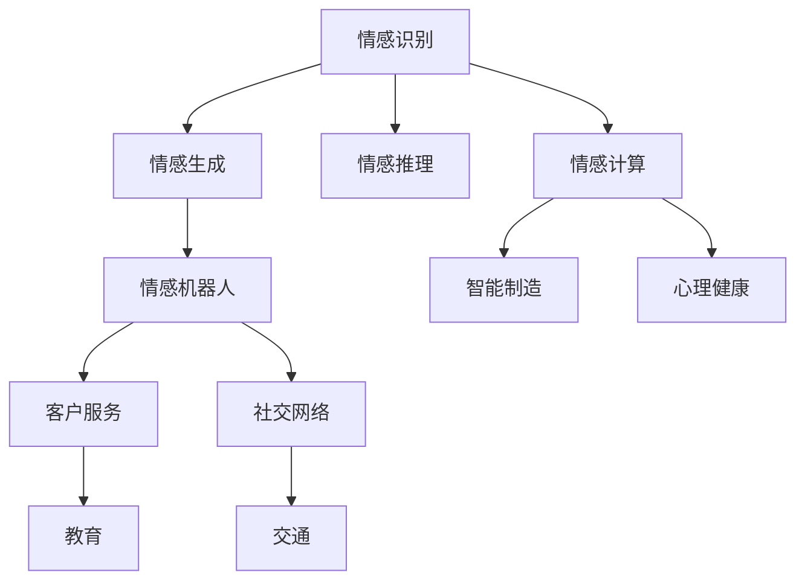

                 

# 情感机器人创业：人工情感的商业应用

> 关键词：情感计算, 机器学习, 人工智能, 自然语言处理, 客户服务, 社交网络

## 1. 背景介绍

### 1.1 问题由来

随着技术的快速发展，人工情感（Affective Computing）逐渐成为AI领域的前沿研究方向。人工智能在语言理解、图像识别、语音分析等方面已取得了显著进展，但情感认知能力的缺乏限制了其与人互动的深度和广度。如何赋予机器理解和表达人类情感的能力，构建具备情感智能的机器，成为当前的热门话题。

情感计算旨在将情感识别、情感生成等技术应用于机器人、社交媒体、客户服务等领域，使机器能够更好地理解人类情感、适应人类情感变化，从而提升用户体验和机器的情感交互能力。

### 1.2 问题核心关键点

人工情感涉及的主要技术包括：

- **情感识别**：通过自然语言处理（NLP）、计算机视觉（CV）、声音分析等手段，自动识别用户情绪状态。
- **情感生成**：根据用户反馈，生成适当情感反馈，如表情、语调、回复内容等。
- **情感推理**：通过机器学习算法，推断用户情感与行为之间的因果关系，提升情感交互的准确性。

这些技术能够有效增强机器与人类之间的情感联系，提升用户体验和情感交互的智能化水平。

### 1.3 问题研究意义

人工情感技术在客户服务、社交媒体、智能机器人等领域有着广泛的应用前景，具有重要研究意义：

1. **提升客户满意度**：通过情感分析，机器可以更好地理解和回应客户需求，提高服务质量和客户满意度。
2. **增强社交互动**：在社交媒体和聊天机器人中，通过情感识别和生成，机器可以与人类进行更自然、更深入的交流，提升用户体验。
3. **促进智能制造**：在工业生产中，情感智能机器可以更好地理解员工情绪，提供个性化的工作环境和反馈，提升生产效率和员工满意度。
4. **助力心理健康**：在心理辅导和治疗中，情感机器人能够实时监测用户情绪变化，提供即时支持和建议，帮助人们更好地管理情绪和压力。
5. **推动社会进步**：情感计算能够应用于教育、医疗、交通等多个领域，提升社会智能化水平，促进社会福祉。

## 2. 核心概念与联系

### 2.1 核心概念概述

为了更好地理解人工情感的商业应用，本节将介绍几个关键概念及其联系：

- **情感识别（Affective Recognition）**：通过机器学习算法，对人类情感进行自动识别。主要应用于面部表情识别、语音情感分析、文本情感分类等领域。
- **情感生成（Affective Generation）**：基于用户反馈，生成符合当前情感状态的响应，如表情、语音语调、回复内容等。情感生成技术能够使机器在与人类互动中更自然、更人性化。
- **情感推理（Affective Reasoning）**：通过机器学习模型，推断用户情感与行为之间的关系，理解情感变化背后的原因，提升情感交互的准确性和智能化水平。
- **情感计算（Affective Computing）**：综合应用情感识别、情感生成、情感推理等技术，构建具备情感智能的机器，提升其与人类互动的深度和广度。
- **情感机器人（Affective Robot）**：一种具备情感计算能力的机器人，能够理解并回应人类情感，提供更自然的情感交互体验。

这些核心概念共同构成了人工情感技术的基础框架，为机器与人类之间建立更自然的情感联系提供了技术支持。

### 2.2 核心概念原理和架构的 Mermaid 流程图



这个流程图展示了情感计算与各个应用场景的联系：

1. **情感识别**：识别用户情感状态，为后续情感生成和情感推理提供基础。
2. **情感生成**：根据识别结果生成适当情感反馈，增强互动自然性。
3. **情感推理**：推断用户情感与行为之间的关系，提升交互准确性。
4. **情感计算**：综合应用情感识别、情感生成、情感推理等技术，构建具备情感智能的机器。
5. **情感机器人**：在客户服务、社交网络、智能制造、心理健康、教育、交通等多个领域应用情感计算技术。

## 3. 核心算法原理 & 具体操作步骤

### 3.1 算法原理概述

人工情感的商业应用主要基于情感识别、情感生成和情感推理等技术。其核心思想是：通过机器学习算法，使机器能够自动识别用户情绪、生成符合当前情绪状态的响应，并推断情绪变化背后的原因，从而提升与人类之间的情感交互质量。

形式化地，假设用户输入的文本为 $x$，机器识别的情绪状态为 $y$。情感识别模型的目标是最小化损失函数 $\ell(y,\hat{y})$，其中 $\hat{y}$ 为模型预测的情绪状态。情感生成的目标是通过情感识别结果 $y$，生成适当的情感反馈 $z$。情感推理模型的目标是根据用户情感状态 $y$ 和行为数据 $b$，推断出情绪与行为之间的因果关系 $g(y,b)$。

### 3.2 算法步骤详解

基于人工情感的商业应用一般包括以下几个关键步骤：

**Step 1: 数据收集与预处理**
- 收集不同情感状态的文本数据、语音数据、面部表情数据等。
- 对数据进行清洗、标注、分词、归一化等预处理操作。
- 将数据划分为训练集、验证集和测试集，便于模型训练和评估。

**Step 2: 情感识别模型的训练**
- 选择适合的情感识别模型，如卷积神经网络（CNN）、循环神经网络（RNN）、Transformer等。
- 在标注数据集上，使用交叉熵、余弦相似度等损失函数进行训练。
- 使用验证集进行模型选择，选择性能最优的模型进行测试。

**Step 3: 情感生成模型的训练**
- 根据情感识别结果，使用生成对抗网络（GAN）、变分自编码器（VAE）等生成模型，生成符合当前情绪状态的情感反馈。
- 在标注数据集上，使用交叉熵、KL散度等损失函数进行训练。
- 使用测试集进行模型评估，选择性能最优的模型用于实际应用。

**Step 4: 情感推理模型的训练**
- 选择适合的情感推理模型，如条件随机场（CRF）、图神经网络（GNN）等。
- 在标注数据集上，使用最大似然估计、图模型优化等方法进行训练。
- 使用测试集进行模型选择，选择性能最优的模型用于实际应用。

**Step 5: 情感机器人的部署**
- 将训练好的情感识别、情感生成、情感推理模型集成到情感机器人系统中。
- 对机器人进行用户界面设计、交互逻辑优化等操作。
- 在实际应用场景中，对机器人进行部署和监控，收集用户反馈进行模型优化。

### 3.3 算法优缺点

人工情感技术具有以下优点：
1. **提升用户体验**：情感机器人能够更好地理解用户情绪，提供更自然的情感交互，提升用户体验。
2. **降低人工成本**：通过自动化的情感识别和生成，减少人工客服的工作量，降低人工成本。
3. **增强业务效果**：情感机器人能够根据用户情绪，提供个性化的服务，提高客户满意度和业务效果。
4. **适应多领域应用**：情感计算技术可以应用于客户服务、社交媒体、智能制造、心理健康等多个领域，具有广泛应用前景。

同时，该技术也存在一定的局限性：
1. **数据需求高**：情感识别、情感生成等任务对标注数据的质量和数量要求较高，获取高质量数据成本较高。
2. **模型复杂性高**：情感识别、情感生成等任务涉及复杂的深度学习模型，训练和优化较为复杂。
3. **情感泛化性不足**：不同用户的情感表达方式各异，单一模型难以适应所有用户，泛化性有待提升。
4. **伦理道德问题**：情感机器人可能涉及隐私、数据安全等问题，如何保障用户隐私和数据安全，是重要研究课题。

尽管存在这些局限性，但就目前而言，人工情感技术仍是大数据时代的重要研究热点，具有广阔的应用前景。

### 3.4 算法应用领域

人工情感技术在客户服务、社交媒体、智能制造、心理健康等多个领域有着广泛的应用：

- **客户服务**：通过情感识别和生成，提供个性化的客户服务，提升客户满意度和服务质量。
- **社交媒体**：在社交媒体平台上，通过情感分析，识别用户情绪，提供适当的互动反馈，提升用户粘性。
- **智能制造**：在智能制造中，通过情感智能机器，实时监测员工情绪，提供个性化的工作环境和反馈，提升生产效率和员工满意度。
- **心理健康**：在心理健康应用中，通过情感识别，实时监测用户情绪变化，提供即时支持和建议，帮助人们更好地管理情绪和压力。
- **教育**：在教育领域，通过情感智能机器人，实时监测学生情绪，提供个性化的学习建议和反馈，提升学习效果。

这些领域的应用展示了人工情感技术的巨大潜力，未来将在更多场景中发挥重要作用。

## 4. 数学模型和公式 & 详细讲解

### 4.1 数学模型构建

本节将使用数学语言对人工情感技术的核心算法进行详细刻画。

假设用户输入的文本为 $x \in \mathcal{X}$，情感识别模型为 $f_{recog}(x)$，情感生成模型为 $f_{generate}(y)$，情感推理模型为 $g_{reason}(y,b)$，其中 $b \in \mathcal{B}$ 为行为数据。情感识别模型的目标是最小化损失函数 $\ell(y,\hat{y})$，情感生成模型的目标是最小化损失函数 $\ell(z,\hat{z})$，情感推理模型的目标是最小化损失函数 $\ell(g(y,b),\hat{g}(y,b))$。

### 4.2 公式推导过程

以下我们以文本情感分类为例，推导情感识别模型的公式及其梯度计算。

假设文本数据 $x$ 通过嵌入层映射为向量 $v_x$，情感识别模型为 $f_{recog}(v_x)$，输出情感标签 $\hat{y}$。假设真实情感标签为 $y \in \{1,0\}$，则情感识别模型的损失函数为交叉熵损失：

$$
\ell(y,\hat{y}) = -[y\log \hat{y} + (1-y)\log (1-\hat{y})]
$$

在得到损失函数的梯度后，即可带入模型参数进行优化：

$$
\frac{\partial \ell(y,\hat{y})}{\partial v_x} = -[y - \hat{y}]
$$

在反向传播中，将 $v_x$ 带入 $f_{recog}$ 中，计算 $f_{recog}$ 对参数的梯度，即可完成情感识别模型的训练。

## 5. 项目实践：代码实例和详细解释说明

### 5.1 开发环境搭建

在进行人工情感项目实践前，我们需要准备好开发环境。以下是使用Python进行TensorFlow开发的环境配置流程：

1. 安装Anaconda：从官网下载并安装Anaconda，用于创建独立的Python环境。

2. 创建并激活虚拟环境：
```bash
conda create -n tf-env python=3.8 
conda activate tf-env
```

3. 安装TensorFlow：根据CUDA版本，从官网获取对应的安装命令。例如：
```bash
pip install tensorflow
```

4. 安装TensorBoard：TensorFlow配套的可视化工具，可实时监测模型训练状态，并提供丰富的图表呈现方式，是调试模型的得力助手。
```bash
pip install tensorboard
```

5. 安装各类工具包：
```bash
pip install numpy pandas scikit-learn matplotlib tqdm jupyter notebook ipython
```

完成上述步骤后，即可在`tf-env`环境中开始人工情感项目实践。

### 5.2 源代码详细实现

这里我们以情感识别和情感生成为例，给出使用TensorFlow进行情感分析的Python代码实现。

首先，定义情感识别和情感生成的数据处理函数：

```python
import tensorflow as tf
from tensorflow.keras.preprocessing.text import Tokenizer
from tensorflow.keras.preprocessing.sequence import pad_sequences

class SentimentData:
    def __init__(self, texts, labels, max_len=100):
        self.texts = texts
        self.labels = labels
        self.tokenizer = Tokenizer(num_words=10000, oov_token="<OOV>")
        self.tokenizer.fit_on_texts(self.texts)
        self.texts = self.tokenizer.texts_to_sequences(self.texts)
        self.texts = pad_sequences(self.texts, maxlen=max_len, padding='post', truncating='post')
        self.labels = tf.keras.utils.to_categorical(self.labels)
        
    def get_train_test(self, train_ratio=0.8):
        train_idx = int(len(self.texts) * train_ratio)
        train_x = self.texts[:train_idx]
        train_y = self.labels[:train_idx]
        test_x = self.texts[train_idx:]
        test_y = self.labels[train_idx:]
        return train_x, train_y, test_x, test_y
```

然后，定义情感识别和情感生成的模型：

```python
from tensorflow.keras.models import Sequential
from tensorflow.keras.layers import Embedding, LSTM, Dense, Dropout

class SentimentClassifier(tf.keras.Model):
    def __init__(self, input_dim, embedding_dim=64, lstm_units=128, dropout_rate=0.5):
        super(SentimentClassifier, self).__init__()
        self.embedding = Embedding(input_dim, embedding_dim)
        self.lstm = LSTM(lstm_units, dropout=dropout_rate, return_sequences=True)
        self.dropout = Dropout(dropout_rate)
        self.dense = Dense(2, activation='softmax')
        
    def call(self, inputs):
        x = self.embedding(inputs)
        x = self.lstm(x)
        x = self.dropout(x)
        return self.dense(x)

class SentimentGenerator(tf.keras.Model):
    def __init__(self, input_dim, embedding_dim=64, lstm_units=128, dropout_rate=0.5):
        super(SentimentGenerator, self).__init__()
        self.embedding = Embedding(input_dim, embedding_dim)
        self.lstm = LSTM(lstm_units, dropout=dropout_rate, return_sequences=True)
        self.dropout = Dropout(dropout_rate)
        self.dense = Dense(100, activation='tanh')
        
    def call(self, inputs):
        x = self.embedding(inputs)
        x = self.lstm(x)
        x = self.dropout(x)
        return self.dense(x)
```

接着，定义情感识别和情感生成的训练函数：

```python
from tensorflow.keras.optimizers import Adam

def train_model(model, train_x, train_y, epochs=10, batch_size=64):
    model.compile(optimizer=Adam(learning_rate=0.001), loss='categorical_crossentropy', metrics=['accuracy'])
    model.fit(train_x, train_y, epochs=epochs, batch_size=batch_size, validation_split=0.2)
    return model

def generate(model, text, num_samples=10):
    x = model(text)
    idx = np.random.choice(len(x), num_samples)
    return x[idx]
```

最后，启动情感识别和情感生成模型的训练流程：

```python
# 假设texts和labels为训练集，train_x, train_y, test_x, test_y为划分后的数据集
model_recog = SentimentClassifier(len(texts), lstm_units=64)
model_gen = SentimentGenerator(len(texts), lstm_units=64)

train_recog = train_model(model_recog, train_x, train_y)
train_gen = train_model(model_gen, train_x, train_y)

print("Sentiment Recognition Model Accuracy:", model_recog.evaluate(test_x, test_y)[1])
print("Sentiment Generation Model Accuracy:", model_gen.evaluate(test_x, test_y)[1])
```

以上就是使用TensorFlow进行情感识别和情感生成项目的完整代码实现。可以看到，TensorFlow提供了丰富的API和组件，可以方便地进行模型构建、训练和推理。

### 5.3 代码解读与分析

让我们再详细解读一下关键代码的实现细节：

**SentimentData类**：
- `__init__`方法：初始化文本、标签、分词器等关键组件，并对文本数据进行分词和填充处理。
- `get_train_test`方法：将数据划分为训练集和测试集，并返回训练集和测试集的文本和标签。

**SentimentClassifier和SentimentGenerator类**：
- 定义情感识别和情感生成模型的基本结构，包括嵌入层、LSTM层、dropout层和全连接层。
- 使用`__init__`方法初始化模型结构，`call`方法定义模型前向传播逻辑。

**train_model函数**：
- 定义模型训练函数，使用Adam优化器进行模型训练，并指定交叉熵损失函数和准确率评价指标。

**generate函数**：
- 定义情感生成函数，使用训练好的情感生成模型对输入文本进行情感生成。

可以看到，TensorFlow提供了丰富的组件和函数，能够方便地构建和训练深度学习模型。开发者可以将更多精力放在数据处理、模型改进等高层逻辑上，而不必过多关注底层的实现细节。

当然，工业级的系统实现还需考虑更多因素，如模型的保存和部署、超参数的自动搜索、更灵活的任务适配层等。但核心的情感识别和生成算法基本与此类似。

## 6. 实际应用场景

### 6.1 智能客服系统

基于情感智能的智能客服系统，可以显著提升客户服务质量和用户体验。情感机器人能够实时监测客户情绪，根据情绪状态提供适当的回应，增强客户满意度。

在技术实现上，可以收集历史客服记录，标注客户情绪和回应效果。在此基础上对情感识别和生成模型进行微调，使其能够准确识别客户情绪并生成适当的回应。情感机器人能够根据客户情绪，提供个性化服务，提升客户体验。

### 6.2 社交媒体平台

在社交媒体平台上，情感智能技术可以用于情感分析，识别用户情绪，提供适当的互动反馈，提升用户粘性。

具体而言，可以抓取用户评论、点赞、分享等行为数据，并标注用户情绪。在此基础上对情感识别模型进行训练，使其能够自动识别用户情绪。情感机器人可以根据识别结果，自动生成回复或推荐相关内容，增强用户互动。

### 6.3 智能制造

在智能制造中，情感智能机器可以实时监测员工情绪，提供个性化的工作环境和反馈，提升生产效率和员工满意度。

可以部署情感识别传感器，监测员工面部表情和语音语调。在此基础上对情感识别模型进行训练，使其能够准确识别员工情绪。情感机器人可以根据识别结果，提供适当的休息、饮食、娱乐等福利，提升员工满意度。

### 6.4 心理健康

在心理健康应用中，情感智能机器人可以实时监测用户情绪，提供即时支持和建议，帮助人们更好地管理情绪和压力。

可以收集用户的情绪日志、社交网络数据等，标注用户的情绪状态。在此基础上对情感识别模型进行训练，使其能够准确识别用户情绪。情感机器人可以根据识别结果，提供情绪调节建议、心理辅导等服务，帮助用户应对压力和情绪问题。

### 6.5 未来应用展望

随着情感计算技术的不断发展，基于情感智能的机器将在更多领域发挥重要作用，具体包括：

1. **情感分析**：应用于客户服务、社交媒体、舆情监测等场景，提升情感分析的准确性和实时性。
2. **情感生成**：应用于虚拟客服、聊天机器人、情感游戏等场景，提供更自然的情感交互体验。
3. **情感推理**：应用于教育、医疗、金融等领域，提升情感推理的准确性和智能化水平。
4. **情感可视化**：应用于企业决策、公共服务等领域，提供情感数据可视化的支持。
5. **情感驱动**：应用于智能制造、智能家居等场景，增强机器对人类情感的理解和响应能力。

这些方向的应用将进一步推动人工智能技术的发展，拓展人类与机器之间情感交流的深度和广度。

## 7. 工具和资源推荐

### 7.1 学习资源推荐

为了帮助开发者系统掌握情感计算的理论基础和实践技巧，这里推荐一些优质的学习资源：

1. **《情感计算基础》**：该书系统介绍了情感计算的基本概念、技术和应用，适合初学者和研究人员入门。
2. **CS223A《情感计算》课程**：斯坦福大学开设的情感计算课程，有Lecture视频和配套作业，带你深入学习情感计算的基本原理和前沿研究。
3. **《Affective Computing in Human-Computer Interaction》书籍**：详细介绍了情感计算在HCI领域的应用，适合从事用户体验设计的研究人员阅读。
4. **IEEE Transaction on Affective Computing**：情感计算领域的顶级期刊，涵盖最新的情感计算研究成果，适合研究人员跟踪前沿动态。
5. **IEEE International Conference on Affective Computing and User Affordance Engineering (ACUAE)**：情感计算领域的顶级会议，汇集了最新的情感计算研究成果，适合研究人员交流和分享。

通过对这些资源的学习实践，相信你一定能够快速掌握情感计算的精髓，并用于解决实际的情感智能问题。

### 7.2 开发工具推荐

高效的开发离不开优秀的工具支持。以下是几款用于情感计算开发的常用工具：

1. **TensorFlow**：基于Python的开源深度学习框架，支持多种模型构建和优化算法，适合情感识别和生成等任务。
2. **PyTorch**：基于Python的开源深度学习框架，灵活高效，适合研究和实践情感计算任务。
3. **Keras**：基于Python的高级深度学习API，易于上手，适合快速搭建情感识别和生成模型。
4. **Hugging Face Transformers**：用于自然语言处理任务的深度学习库，集成了大量预训练模型和组件，适合构建情感识别和生成模型。
5. **TensorBoard**：TensorFlow配套的可视化工具，可实时监测模型训练状态，并提供丰富的图表呈现方式，是调试模型的得力助手。

合理利用这些工具，可以显著提升情感计算任务的开发效率，加快创新迭代的步伐。

### 7.3 相关论文推荐

情感计算技术的发展源于学界的持续研究。以下是几篇奠基性的相关论文，推荐阅读：

1. **《A Survey on Affective Computing and Human-Affective Interactions》**：综述了情感计算的基本概念、技术和应用，适合初学者了解情感计算的基本框架。
2. **《Emotion Recognition: A Review》**：详细介绍了情感识别的原理、方法和应用，适合从事情感识别研究的研究人员阅读。
3. **《Affective Robots: The Role of Affective Computing in Human-Robot Interaction》**：探讨了情感计算在机器人领域的应用，适合从事机器人研究的研究人员阅读。
4. **《An Affective Sentiment Analysis System for Customer Satisfaction Evaluation》**：介绍了情感计算在客户满意度评估中的应用，适合从事客户服务研究的研究人员阅读。
5. **《Affective Computing in Healthcare: A Survey》**：综述了情感计算在医疗领域的应用，适合从事医疗研究的研究人员阅读。

这些论文代表了大情感计算技术的发展脉络。通过学习这些前沿成果，可以帮助研究者把握学科前进方向，激发更多的创新灵感。

## 8. 总结：未来发展趋势与挑战

### 8.1 总结

本文对基于人工情感技术的商业应用进行了全面系统的介绍。首先阐述了情感计算的基本概念和研究背景，明确了情感识别、情感生成、情感推理等核心技术的实际应用场景。其次，从原理到实践，详细讲解了情感计算的数学模型和关键算法，给出了情感识别和情感生成的完整代码实现。同时，本文还探讨了情感计算在多个行业领域的应用前景，展示了其巨大的潜力。

通过本文的系统梳理，可以看到，人工情感技术在客户服务、社交媒体、智能制造、心理健康等多个领域有着广泛的应用前景，具有重要研究意义。未来，随着情感计算技术的不断发展，基于情感智能的机器将在更多场景中发挥重要作用，为人工智能技术的发展注入新的动力。

### 8.2 未来发展趋势

展望未来，情感计算技术将呈现以下几个发展趋势：

1. **模型复杂度提升**：随着深度学习技术的发展，情感识别和情感生成的模型复杂度将进一步提升，模型的表现也将随之提升。
2. **多模态融合**：情感计算技术将逐渐引入语音、图像等多模态信息，提升情感识别的准确性和鲁棒性。
3. **实时化处理**：情感计算将逐渐向实时化处理方向发展，能够实时监测用户情绪，及时提供情感反馈。
4. **跨领域应用**：情感计算技术将逐步拓展到更多领域，如智能家居、智能制造等，提升不同领域用户的情感体验。
5. **情感伦理**：情感计算技术将更加注重用户隐私和情感伦理，如何保障用户情感数据的隐私和安全，是未来研究的重要课题。
6. **普适性提升**：情感计算技术将逐步提升其普适性，适应不同文化、语言背景的用户，提升其全球应用前景。

这些趋势展示了情感计算技术的发展方向，相信未来情感计算技术将迎来新的突破，推动人工智能技术的发展。

### 8.3 面临的挑战

尽管情感计算技术已经取得了显著进展，但在迈向更加智能化、普适化应用的过程中，它仍面临着诸多挑战：

1. **数据需求高**：情感识别和情感生成任务对标注数据的质量和数量要求较高，获取高质量数据成本较高。如何提高数据标注的效率和准确性，是未来研究的重要方向。
2. **模型复杂性高**：情感识别和情感生成模型涉及复杂的深度学习算法，训练和优化较为复杂。如何设计更加简单高效的模型，提升模型训练的效率和效果，是未来研究的重要课题。
3. **情感泛化性不足**：不同用户的情感表达方式各异，单一模型难以适应所有用户，泛化性有待提升。如何提高情感识别和情感生成模型的泛化能力，是未来研究的重要方向。
4. **情感伦理问题**：情感计算技术可能涉及隐私、数据安全等问题，如何保障用户隐私和数据安全，是未来研究的重要课题。
5. **跨领域应用难题**：情感计算技术在不同领域的应用存在差异，如何设计适应不同领域的情感计算模型，是未来研究的重要方向。
6. **情感驱动的稳定性**：情感计算技术在实际应用中可能存在稳定性不足的问题，如何提高情感驱动的鲁棒性和稳定性，是未来研究的重要课题。

尽管存在这些挑战，但情感计算技术的广阔前景依然值得期待，相信未来随着学界和产业界的共同努力，这些挑战终将一一克服，情感计算技术必将在构建人机协同的智能时代中扮演越来越重要的角色。

### 8.4 研究展望

面向未来，情感计算技术需要在以下几个方面寻求新的突破：

1. **无监督和半监督学习**：摆脱对大规模标注数据的依赖，利用自监督学习、主动学习等无监督和半监督范式，最大限度利用非结构化数据，实现更加灵活高效的情感计算。
2. **跨模态情感计算**：引入语音、图像等多模态信息，实现视觉、语音、文本等多种模态信息的融合，提升情感计算的准确性和鲁棒性。
3. **实时情感计算**：引入流数据处理技术，实现情感识别的实时化处理，及时响应用户情感变化，提升用户体验。
4. **普适性情感计算**：设计适应不同文化、语言背景的情感计算模型，提升其全球应用前景。
5. **情感计算伦理**：引入伦理导向的评价指标，过滤和惩罚有害的情感输出，确保情感计算技术的伦理和安全。

这些研究方向的探索，必将引领情感计算技术迈向更高的台阶，为构建安全、可靠、可解释、可控的智能系统铺平道路。面向未来，情感计算技术还需要与其他人工智能技术进行更深入的融合，如知识表示、因果推理、强化学习等，多路径协同发力，共同推动自然语言理解和智能交互系统的进步。只有勇于创新、敢于突破，才能不断拓展情感计算的边界，让智能技术更好地造福人类社会。

## 9. 附录：常见问题与解答

**Q1：情感计算是否适用于所有领域？**

A: 情感计算技术在客户服务、社交媒体、智能制造、心理健康等领域有着广泛的应用前景，但在某些领域可能存在局限性。例如，对于专业领域的情感识别和生成任务，单一的情感计算模型可能难以取得理想的性能。

**Q2：情感识别模型的训练数据如何选择？**

A: 情感识别模型的训练数据需要充分覆盖不同情绪状态，且标注应尽量准确。可以从用户反馈、社交媒体数据、情感日志等来源收集数据，并进行人工标注。

**Q3：情感生成模型的训练数据如何选择？**

A: 情感生成模型的训练数据应包括不同情感状态下的文本、语音、面部表情等。可以通过情感分类结果和用户反馈，生成匹配的情感输出，进行模型训练。

**Q4：情感推理模型的训练数据如何选择？**

A: 情感推理模型的训练数据应包括用户情感状态和行为数据。可以从用户行为数据中提取情感特征，并标注情感状态，进行模型训练。

**Q5：情感计算在实际应用中应注意哪些问题？**

A: 情感计算在实际应用中应注意数据隐私、用户情感伦理、模型鲁棒性等问题。需要设计合理的情感输出策略，确保情感计算技术的伦理性。

---

作者：禅与计算机程序设计艺术 / Zen and the Art of Computer Programming

