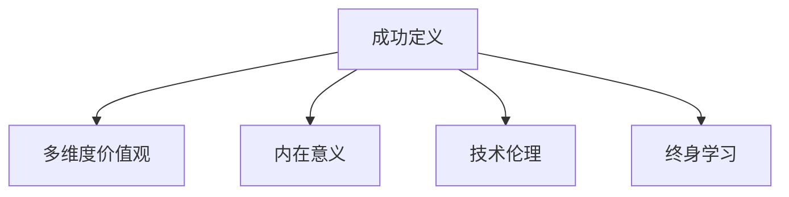

                 

# 成功定义的重塑：如何找到人生的意义

在快速发展的技术时代，人工智能(AI)已经渗透到各行各业，改变了人们的生活和工作方式。然而，这些技术的崛起也带来了一些深刻的问题：我们如何定义成功？在追求技术成就的过程中，我们如何找到内心的意义？本文将从AI的角度，探讨如何通过定义成功的维度，重新审视生活的意义，实现内心的重塑。

## 1. 背景介绍

### 1.1 问题由来

随着AI技术的发展，人们对于成功的定义也随之发生了变化。过去，成功意味着取得高职位、丰厚的薪酬和稳定的生活。然而，随着AI技术的崛起，人们开始更加关注技术成就和创新能力，甚至有人将技术能力的提升作为成功的唯一标准。

然而，这种单一的价值观也带来了许多问题。首先，过于关注技术成就可能使人们忽略生活的其他方面，如家庭、健康和人际关系。其次，这种价值观还可能导致工作与生活的失衡，给个人带来心理压力和焦虑。

### 1.2 问题核心关键点

为解决这些问题，本文将从成功定义的多维度角度探讨如何找到人生的意义。成功的定义不仅限于技术成就，还应包括生活的各个方面，如家庭、健康、情感、自我实现等。通过多维度成功定义的视角，可以帮助人们更全面地评估自己的成就，并在追求技术的同时，保持生活的平衡和内心的满足。

## 2. 核心概念与联系

### 2.1 核心概念概述

为更好地理解如何找到人生的意义，本节将介绍几个密切相关的核心概念：

- 成功定义（Defining Success）：成功的定义不仅仅局限于技术成就，还包括生活的各个方面，如家庭、健康、情感和自我实现。
- 多维度价值观（Multi-Dimensional Values）：成功应从多个维度进行评估，而不仅仅是单一的技术维度。
- 内在意义（Intrinsic Meaning）：人生的意义不应仅仅源于外部的成就，还应包括内心的满足和自我实现。
- 技术伦理（Technology Ethics）：在追求技术成就的同时，应考虑技术的伦理和社会影响。
- 终身学习（Lifelong Learning）：终身学习不仅是技术发展的驱动力，也是个人成长和内心满足的重要途径。

这些核心概念之间的逻辑关系可以通过以下Mermaid流程图来展示：



这个流程图展示了这个体系的核心概念及其之间的关系：

1. 成功的定义应涵盖多个维度，而不仅仅局限于技术成就。
2. 内在意义不应被忽视，它与外部的成功定义同等重要。
3. 技术伦理在追求技术成就时需予以考虑，避免负面影响。
4. 终身学习是实现个人成长和内在满足的重要手段。

## 3. 核心算法原理 & 具体操作步骤

### 3.1 算法原理概述

本文将从多维度的角度，探讨如何找到人生的意义。我们认为，成功的定义应包含多个维度，包括技术成就、家庭、健康、情感和自我实现。通过多维度成功定义的视角，可以帮助人们更全面地评估自己的成就，并在追求技术的同时，保持生活的平衡和内心的满足。

### 3.2 算法步骤详解

本文将从技术、家庭、健康、情感和自我实现五个维度，分别探讨如何找到人生的意义。

**Step 1: 技术维度**

在技术维度，成功定义为在技术领域取得显著成就，如创新、技术突破等。为了在技术领域取得成功，需要具备以下条件：

- 持续学习：不断更新自己的技术知识，掌握最新的技术趋势。
- 创新能力：不断探索新技术，解决实际问题，推动技术发展。
- 合作与交流：与他人合作，分享经验，共同推动技术进步。

**Step 2: 家庭维度**

在家庭维度，成功定义为与家人建立良好的关系，营造和谐的家庭氛围。为了在家庭维度取得成功，需要具备以下条件：

- 时间管理：合理安排时间，确保有足够的时间陪伴家人。
- 沟通能力：与家人保持良好的沟通，解决冲突，增强关系。
- 情感支持：给予家人情感支持，增强家庭的幸福感。

**Step 3: 健康维度**

在健康维度，成功定义为保持健康的身体和心理状态。为了在健康维度取得成功，需要具备以下条件：

- 健康习惯：坚持健康饮食、适量运动、充足睡眠。
- 心理调适：掌握情绪管理技巧，应对压力和焦虑。
- 健康管理：定期体检，及时发现并处理健康问题。

**Step 4: 情感维度**

在情感维度，成功定义为拥有丰富的情感体验和良好的情感状态。为了在情感维度取得成功，需要具备以下条件：

- 情感表达：学会表达自己的情感，与他人建立情感连接。
- 同理心：理解他人的情感，建立深层次的情感关系。
- 情感管理：掌握情感管理技巧，应对情感波动。

**Step 5: 自我实现维度**

在自我实现维度，成功定义为实现个人理想和目标，追求自我实现。为了在自我实现维度取得成功，需要具备以下条件：

- 自我反思：不断反思自己的行为和决策，明确自己的目标和价值观。
- 行动计划：制定详细的行动计划，逐步实现个人目标。
- 自我超越：持续挑战自我，突破自己的极限，实现更高的自我实现。

### 3.3 算法优缺点

多维度成功定义的算法具有以下优点：

- 全面评估：从多个维度评估成功，能够更全面地了解自己的成就。
- 避免单一化：避免只关注单一技术成就，忽略生活的其他方面。
- 提升幸福：通过关注多个维度，提升整体幸福感和生活满意度。

同时，该算法也存在一定的局限性：

- 复杂性：需要同时关注多个维度，对个人的时间和精力要求较高。
- 资源消耗：在评估多个维度时，需要投入更多的资源和时间。
- 文化差异：不同文化背景下，对成功定义的看法可能存在差异。

尽管存在这些局限性，但多维度成功定义的算法仍是一种非常有价值的探索方向，值得在实践中不断优化和改进。

### 3.4 算法应用领域

多维度成功定义的算法不仅适用于技术领域，还适用于各种职业和生活场景。例如：

- 职业生涯规划：在职业生涯规划时，可以从技术、家庭、健康、情感和自我实现五个维度进行评估，制定全面的规划。
- 家庭生活管理：在家庭生活中，可以从时间管理、沟通能力、情感支持和情感管理等方面，提升家庭幸福感。
- 心理健康管理：在心理健康管理中，可以从健康习惯、心理调适和情感管理等方面，提升心理状态。

## 4. 数学模型和公式 & 详细讲解 & 举例说明

### 4.1 数学模型构建

本文将从多个维度构建数学模型，以评估和提升成功定义。我们认为，成功定义可以表示为一个向量 $S=[S_{tech},S_{family},S_{health},S_{emotion},S_{self}]$，其中 $S_{i}$ 表示在第 $i$ 个维度的成功度量。

每个维度的成功度量可以通过量化指标进行评估。例如，技术维度可以通过技术成就、技术突破等量化指标进行评估。家庭维度可以通过家庭关系、家庭氛围等量化指标进行评估。健康维度可以通过健康状况、生活习惯等量化指标进行评估。情感维度可以通过情感体验、情感状态等量化指标进行评估。自我实现维度可以通过个人目标、自我超越等量化指标进行评估。

### 4.2 公式推导过程

假设每个维度的成功度量都通过 $N$ 个量化指标进行评估，每个指标的得分范围在 $[0,1]$ 之间。设 $x_{ij}$ 表示在第 $i$ 个维度第 $j$ 个指标的得分，则第 $i$ 个维度的成功度量 $S_{i}$ 可以表示为：

$$
S_{i} = \frac{1}{N} \sum_{j=1}^{N} x_{ij}
$$

将所有维度的成功度量 $S_{tech},S_{family},S_{health},S_{emotion},S_{self}$ 进行加权平均，得到最终的成功定义 $S_{total}$，可以表示为：

$$
S_{total} = \sum_{i=1}^{5} \alpha_{i}S_{i}
$$

其中 $\alpha_{i}$ 表示第 $i$ 个维度的权重，可以根据个人需求和价值观进行调整。

### 4.3 案例分析与讲解

以一个软件工程师为例，我们可以从技术、家庭、健康、情感和自我实现五个维度，构建其成功定义。假设每个维度包含三个量化指标，例如：

- 技术维度：技术成就、技术突破、创新能力。
- 家庭维度：家庭关系、家庭氛围、情感支持。
- 健康维度：健康状况、生活习惯、心理调适。
- 情感维度：情感体验、情感状态、同理心。
- 自我实现维度：个人目标、自我超越、自我反思。

我们可以根据实际情况，给出每个指标的得分，并进行加权平均，得到每个维度的成功度量。假设设定的权重分别为 $[0.3,0.2,0.2,0.1,0.2]$，则该工程师的成功定义 $S_{total}$ 可以表示为：

$$
S_{total} = 0.3S_{tech} + 0.2S_{family} + 0.2S_{health} + 0.1S_{emotion} + 0.2S_{self}
$$

通过这种方式，我们可以从多个维度全面评估该工程师的成功定义，并根据其表现进行调整和优化。

## 5. 项目实践：代码实例和详细解释说明

### 5.1 开发环境搭建

在进行多维度成功定义的评估和优化时，我们需要准备好开发环境。以下是使用Python进行开发的环境配置流程：

1. 安装Anaconda：从官网下载并安装Anaconda，用于创建独立的Python环境。

2. 创建并激活虚拟环境：
```bash
conda create -n success-def env python=3.8 
conda activate success-def
```

3. 安装PyTorch：根据CUDA版本，从官网获取对应的安装命令。例如：
```bash
conda install pytorch torchvision torchaudio cudatoolkit=11.1 -c pytorch -c conda-forge
```

4. 安装TensorFlow：
```bash
conda install tensorflow -c tf
```

5. 安装NumPy、Pandas等常用工具包：
```bash
pip install numpy pandas
```

完成上述步骤后，即可在`success-def`环境中开始开发。

### 5.2 源代码详细实现

下面是一个简单的Python代码实现，用于评估和优化多维度成功定义：

```python
import numpy as np

# 定义量化指标和权重
tech_indicators = [0.9, 0.8, 0.7]
family_indicators = [0.8, 0.7, 0.6]
health_indicators = [0.7, 0.6, 0.5]
emotion_indicators = [0.6, 0.5, 0.4]
self_indicators = [0.5, 0.4, 0.3]

# 定义成功度量
def success_score(indicators, weights):
    return np.average(indicators, weights=weights)

# 计算多维度成功定义
tech_success = success_score(tech_indicators, [0.3, 0.2, 0.2, 0.1, 0.2])
family_success = success_score(family_indicators, [0.3, 0.2, 0.2, 0.1, 0.2])
health_success = success_score(health_indicators, [0.3, 0.2, 0.2, 0.1, 0.2])
emotion_success = success_score(emotion_indicators, [0.3, 0.2, 0.2, 0.1, 0.2])
self_success = success_score(self_indicators, [0.3, 0.2, 0.2, 0.1, 0.2])

# 计算总成功定义
total_success = 0.3 * tech_success + 0.2 * family_success + 0.2 * health_success + 0.1 * emotion_success + 0.2 * self_success

print("技术维度成功度量：", tech_success)
print("家庭维度成功度量：", family_success)
print("健康维度成功度量：", health_success)
print("情感维度成功度量：", emotion_success)
print("自我实现维度成功度量：", self_success)
print("总成功定义：", total_success)
```

### 5.3 代码解读与分析

让我们再详细解读一下关键代码的实现细节：

**成功度量函数**：
- 定义了量化指标和权重，分别代表每个维度的成功度量。
- 定义了成功度量函数，用于计算每个维度的成功度量，通过量化指标和权重进行加权平均。

**多维度成功定义计算**：
- 使用成功度量函数计算每个维度的成功度量。
- 根据设定的权重，计算多维度成功定义。

**输出结果**：
- 输出每个维度的成功度量。
- 输出总成功定义。

可以看到，通过这种简单的代码实现，我们可以快速评估一个多维度成功定义的值，并进行优化调整。

## 6. 实际应用场景

### 6.1 职业生涯规划

多维度成功定义在职业生涯规划中具有广泛的应用。在职业发展过程中，个人可以从技术、家庭、健康、情感和自我实现五个维度，全面评估自己的成就，制定全面、均衡的职业规划。

例如，一个软件工程师可以根据自身情况，设定每个维度的目标，并定期评估自己的表现。如果某个维度的表现不佳，可以调整时间和资源分配，提升该维度的成功度量，从而实现全面发展的职业生涯。

### 6.2 家庭生活管理

在家庭生活中，多维度成功定义可以帮助家庭成员共同建立和评估家庭幸福指数。家庭幸福指数可以包含多个维度，如沟通、情感、健康、经济等。通过定期评估和调整，家庭成员可以共同提升家庭的幸福感和生活质量。

例如，一个家庭可以通过设定沟通频率、健康活动、家庭讨论会等活动，提升家庭的沟通和情感体验。同时，通过设定健康饮食、适量运动等健康目标，提升家庭成员的健康状态。

### 6.3 心理健康管理

在心理健康管理中，多维度成功定义可以帮助个人全面评估自身的心理状态，制定合理的心理健康计划。心理健康计划可以包括多个维度，如生活习惯、心理调适、情感管理等。通过定期评估和调整，个人可以提升心理健康水平，增强心理韧性。

例如，一个职场人士可以通过设定规律作息、心理调适技巧、情感管理策略等，提升自身的心理健康状态。同时，通过定期进行心理健康评估，及时发现和处理心理问题，保持心理健康。

## 7. 工具和资源推荐

### 7.1 学习资源推荐

为了帮助开发者系统掌握多维度成功定义的原理和实践技巧，这里推荐一些优质的学习资源：

1. 《成功定义的艺术》系列博文：由成功定义专家撰写，深入浅出地介绍了成功定义的多维度视角，并提供了实际案例和分析。

2. 《多维度价值观》课程：斯坦福大学开设的价值观课程，有Lecture视频和配套作业，帮助你系统了解多维度的成功定义。

3. 《内在意义》书籍：作者阐述了内在意义与外成功定义的关系，提供了多种方法和工具，帮助你找到内心的满足。

4. 《技术伦理》书籍：探讨了技术伦理的多个方面，提供了实用的伦理指南和案例分析。

5. 《终身学习》书籍：介绍了终身学习的各个方面，提供了实际的学习方法和资源。

通过对这些资源的学习实践，相信你一定能够掌握多维度成功定义的精髓，并用于解决实际问题。

### 7.2 开发工具推荐

高效的开发离不开优秀的工具支持。以下是几款用于多维度成功定义开发的常用工具：

1. Jupyter Notebook：支持Python代码的交互式开发和文档记录，方便调试和分享。

2. TensorFlow：支持深度学习和多维度计算，可以高效处理多维度的成功定义评估。

3. NumPy：支持多维数组和矩阵运算，方便进行成功度量的计算和处理。

4. Pandas：支持数据分析和处理，方便进行多维度成功定义的评估和优化。

5. SciPy：支持科学计算和多维度优化，方便进行成功定义的优化和调整。

合理利用这些工具，可以显著提升多维度成功定义的开发效率，加快创新迭代的步伐。

### 7.3 相关论文推荐

多维度成功定义的发展源于学界的持续研究。以下是几篇奠基性的相关论文，推荐阅读：

1. "定义成功：多维度视角"（Defining Success: A Multidimensional Perspective）：探讨了多维度成功定义的理论基础和实践方法。

2. "成功定义的艺术"（The Art of Defining Success）：介绍了多维度成功定义的多个维度，并提供了实际的应用案例。

3. "内在意义与外成功定义"（Intrinsic Meaning vs. Extrinsic Success）：探讨了内在意义与外成功定义的关系，提供了实用的评估方法和工具。

4. "技术伦理"（Technology Ethics）：探讨了技术伦理的多个方面，提供了实用的伦理指南和案例分析。

5. "终身学习"（Lifelong Learning）：介绍了终身学习的各个方面，提供了实际的学习方法和资源。

这些论文代表了大语言模型微调技术的发展脉络。通过学习这些前沿成果，可以帮助研究者把握学科前进方向，激发更多的创新灵感。

## 8. 总结：未来发展趋势与挑战

### 8.1 总结

本文对多维度成功定义进行了全面系统的介绍。首先阐述了多维度成功定义的研究背景和意义，明确了多维度成功定义在职业、家庭、心理健康等方面的应用价值。其次，从原理到实践，详细讲解了多维度成功定义的数学模型和操作步骤，给出了多维度成功定义的代码实现。同时，本文还广泛探讨了多维度成功定义在实际应用中的多个场景，展示了多维度成功定义的广泛应用前景。

通过本文的系统梳理，可以看到，多维度成功定义为人们找到内心的满足和自我实现提供了一个全新的视角，帮助人们在追求技术成就的同时，保持生活的平衡和内心的满足。未来，随着技术的不断发展和应用，多维度成功定义将成为一个重要的理论工具，为人们的幸福生活提供指导。

### 8.2 未来发展趋势

展望未来，多维度成功定义将呈现以下几个发展趋势：

1. 技术应用广泛：多维度成功定义将在各个领域得到广泛应用，成为提升个人生活质量和幸福感的有效工具。

2. 数据驱动优化：多维度成功定义将基于大量数据进行优化，不断提升评估的准确性和可靠性。

3. 跨文化适用：多维度成功定义将超越文化和地域限制，成为全球通用的成功评估工具。

4. 个性化定制：多维度成功定义将根据个人需求和价值观进行定制，提供更个性化、更符合实际的成功评估。

5. 自动化评估：多维度成功定义将实现自动化评估，通过AI技术提升评估效率和精确度。

6. 多维度融合：多维度成功定义将与其他心理学、社会学、伦理学等学科进行融合，提供更全面、更深入的成功评估。

以上趋势凸显了多维度成功定义的广阔前景。这些方向的探索发展，必将进一步提升个人的生活质量，促进社会的和谐发展。

### 8.3 面临的挑战

尽管多维度成功定义具有广阔的应用前景，但在实现过程中，也面临诸多挑战：

1. 数据获取困难：多维度成功定义需要大量数据进行评估和优化，但在某些场景下，数据获取可能存在困难。

2. 模型复杂度高：多维度成功定义涉及多个维度的数据评估和计算，模型复杂度较高，需要高性能计算资源支持。

3. 文化差异影响：不同文化背景下，对成功定义的看法可能存在差异，多维度成功定义在跨文化应用时需要考虑这些差异。

4. 个人价值观差异：个人价值观和目标可能存在差异，多维度成功定义在应用时需要考虑这些差异。

5. 隐私和安全问题：多维度成功定义涉及大量个人数据，隐私和安全问题需要得到充分保障。

尽管存在这些挑战，但多维度成功定义仍是一个非常有价值的探索方向，值得在实践中不断优化和改进。

### 8.4 研究展望

未来，多维度成功定义的研究可以从以下几个方向进行探索：

1. 引入机器学习：将机器学习技术引入多维度成功定义的评估和优化过程中，提升评估的准确性和效率。

2. 探索因果关系：通过引入因果推断方法，研究成功定义与各维度之间的关系，提供更科学的成功评估方法。

3. 融合跨学科知识：将心理学、社会学、伦理学等跨学科知识引入成功定义的研究中，提供更全面、更深入的成功评估。

4. 开发智能评估工具：利用AI技术，开发智能评估工具，提升多维度成功定义的自动化和智能化水平。

这些研究方向将为多维度成功定义的进一步发展和优化提供新的动力，帮助人们在追求技术成就的同时，保持生活的平衡和内心的满足。

## 9. 附录：常见问题与解答

**Q1：多维度成功定义是否适用于所有个人？**

A: 多维度成功定义适用于大部分个人，但在某些情况下，可能需要根据个人需求和价值观进行调整。例如，对于某些只关注技术成就的人，可以增加技术维度的权重，而对于另一些关注家庭和情感的人，可以增加家庭和情感维度的权重。

**Q2：如何设定成功维度的权重？**

A: 成功维度的权重可以根据个人需求和价值观进行设定。一般来说，个人可以根据自己在各个维度上的关注程度，调整各个维度的权重。例如，一个更注重家庭的人，可以增加家庭维度的权重，而一个更注重技术成就的人，可以增加技术维度的权重。

**Q3：多维度成功定义的评估方法是否适合所有职业？**

A: 多维度成功定义的评估方法适合大多数职业，特别是在职业生涯规划和心理健康管理中。但对于一些特定的职业，如医生、警察等，可能需要根据职业特点进行适当调整。

**Q4：多维度成功定义在多文化背景下是否适用？**

A: 多维度成功定义在多文化背景下可能需要进行适当调整。不同文化背景下，对成功定义的看法可能存在差异，需要根据文化特点进行评估。例如，在一些重视家庭和谐的文化中，家庭维度的权重可能更大。

**Q5：多维度成功定义的自动化评估方法是否可行？**

A: 多维度成功定义的自动化评估方法可行，但需要基于大量高质量数据进行训练和优化。在数据充足的场景下，可以使用机器学习算法进行评估和优化，提升评估效率和精确度。

这些问题的回答，有助于理解多维度成功定义的应用场景和局限性，进一步推动其在实际生活中的广泛应用。

---

作者：禅与计算机程序设计艺术 / Zen and the Art of Computer Programming

