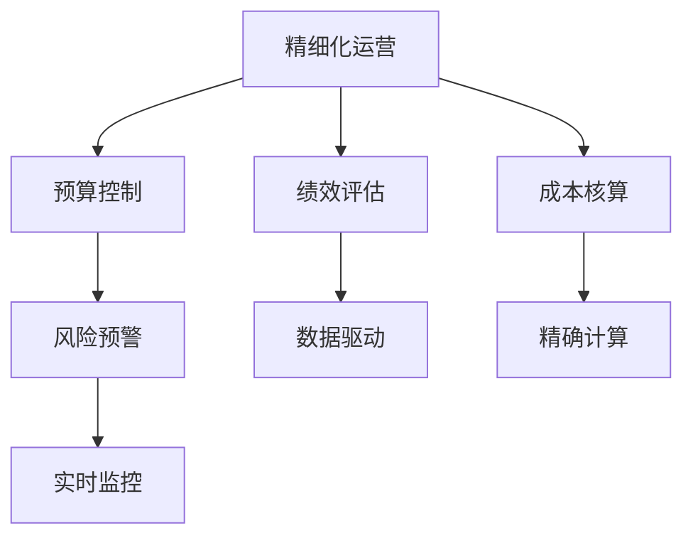

                 

# 成本管理：提高利润率的精细化操作

> 关键词：成本管理, 精细化运营, 利润率提升, 预算控制, 绩效评估

## 1. 背景介绍

### 1.1 问题由来
在当今高度竞争的商业环境中，企业必须不断地优化其运营效率，以确保利润率的持续提升。成本管理作为企业运营的核心环节之一，对于企业盈利能力的提升起着至关重要的作用。然而，传统的成本管理方法往往存在数据不全、信息不对称、管理粗放等问题，导致成本控制不够精准，企业运营效率难以最大化。

为了应对这些挑战，需要引入更加精细化的成本管理方法，通过对运营过程的详细监控、数据分析和实时调整，实现成本管理的精细化操作。本文将深入探讨如何通过提高成本管理的精细化程度，来提升企业的整体盈利能力。

### 1.2 问题核心关键点
- **精细化运营**：通过对企业运营各环节进行全面监控和数据分析，提升运营效率。
- **预算控制**：科学合理地制定和执行预算计划，避免超支和浪费。
- **绩效评估**：建立综合的绩效评估体系，及时反馈运营效果，引导企业不断优化。
- **成本核算**：细化成本核算方法，精确计算各环节的成本支出。
- **风险预警**：构建成本预警系统，及时发现并处理成本异常。

通过提升成本管理的精细化程度，企业可以在保证产品质量和服务水平的前提下，实现成本的合理控制和优化。这对于提升企业竞争力和盈利能力具有重要意义。

## 2. 核心概念与联系

### 2.1 核心概念概述

为了更好地理解成本管理精细化的概念，我们需要了解以下几个核心概念：

- **精细化运营**：通过对企业运营各环节进行详细监控和数据分析，实现运营管理的精细化和高效化。
- **预算控制**：基于预测和历史数据分析，制定科学合理的预算计划，并严格执行，确保资源的最优化使用。
- **绩效评估**：通过建立综合的绩效评估体系，对企业运营效果进行全面评估，及时发现问题并采取措施。
- **成本核算**：细化成本核算方法，精确计算各环节的成本支出，为成本管理提供准确的数据支持。
- **风险预警**：构建成本预警系统，实时监控成本动态，及时发现并处理异常，保障企业运营的稳定性。

这些概念之间存在紧密联系，共同构成企业精细化成本管理的框架。

### 2.2 核心概念原理和架构的 Mermaid 流程图



这个流程图展示了成本管理精细化的主要流程和关键环节：

- **精细化运营**作为核心，驱动预算控制、绩效评估、成本核算和风险预警的实施。
- **预算控制**在精细化运营的指导下，制定科学合理的预算计划，并进行严格执行。
- **绩效评估**基于运营数据，对企业运营效果进行全面评估，发现运营中的问题。
- **成本核算**细化成本计算方法，为运营决策提供准确的成本数据支持。
- **风险预警**实时监控成本动态，及时发现异常并采取措施，保障企业运营的稳定性。

## 3. 核心算法原理 & 具体操作步骤

### 3.1 算法原理概述

成本管理的精细化操作，本质上是通过对企业运营数据的全面监控和深入分析，实现成本的精确控制和优化。其核心思想是：通过对运营各环节的详细监控和数据分析，识别成本中的浪费和不合理支出，并采取措施进行改进和优化。

形式化地，假设企业运营中存在 $N$ 个成本项 $C_i$，每个成本项的实际支出为 $A_i$，预算为 $B_i$。成本管理的目标是最大化企业的整体利润率，即最小化成本。因此，优化目标可以表示为：

$$
\min \sum_{i=1}^{N} |A_i - B_i|
$$

其中 $|A_i - B_i|$ 表示第 $i$ 个成本项的超支或节约额度。优化过程包括预算制定、成本核算、绩效评估和风险预警等多个环节。

### 3.2 算法步骤详解

#### 3.2.1 预算控制
- **历史数据分析**：通过分析企业历史运营数据，识别成本中的常见问题和异常情况。
- **预算制定**：基于历史数据分析结果，结合市场和业务需求，制定科学合理的预算计划。
- **预算执行**：对预算计划进行严格执行，确保资源的合理使用。

#### 3.2.2 成本核算
- **细化成本项**：将成本细化为更小的组成部分，如材料成本、人工成本、设备维护成本等。
- **精确计算**：使用先进的财务软件和算法，对每个成本项进行精确计算。

#### 3.2.3 绩效评估
- **指标设定**：设定一系列关键绩效指标（KPIs），如成本率、利润率、运营效率等。
- **数据收集**：定期收集运营数据，包括成本、收入、利润等。
- **分析评估**：使用数据分析工具对收集的数据进行分析，评估企业的运营效果。

#### 3.2.4 风险预警
- **监控机制**：建立实时监控机制，对成本动态进行持续监控。
- **预警阈值**：设定预警阈值，当成本出现异常时，自动触发预警。
- **异常处理**：根据预警结果，及时采取措施，处理成本异常情况。

### 3.3 算法优缺点

精细化成本管理具有以下优点：
1. **提高效率**：通过对运营各环节的详细监控和数据分析，能够快速发现并解决问题，提升运营效率。
2. **精确控制**：细化成本核算和预算控制，实现成本的精确计算和合理分配。
3. **风险预防**：通过实时监控和预警机制，及时发现成本异常，避免潜在的风险。

但该方法也存在一定的局限性：
1. **复杂性高**：精细化管理需要收集和处理大量数据，工作量较大。
2. **技术依赖**：需要依赖先进的财务软件和数据分析工具。
3. **数据质量**：数据质量对精细化管理的效果影响较大，数据不全或不准确会影响决策。

尽管存在这些局限性，但精细化成本管理仍是目前企业成本管理中最先进和有效的方法之一。未来相关研究将致力于提高数据处理和分析的自动化程度，以降低复杂性和技术依赖。

### 3.4 算法应用领域

精细化成本管理的应用领域非常广泛，包括但不限于以下行业：

- **制造行业**：通过精细化成本管理，提升生产效率，降低原材料和设备维护成本，提高整体盈利能力。
- **零售行业**：通过对库存和供应链成本的精细化管理，优化库存周转率，降低物流成本，提升客户满意度。
- **服务业**：通过细化人工成本和运营成本，提升服务质量和客户体验，增强市场竞争力。
- **金融行业**：通过精细化资金管理和风险控制，保障资金安全和投资回报，提升风险应对能力。
- **政府部门**：通过对公共服务和行政成本的精细化管理，提高公共资源的使用效率，增强服务透明度和公信力。

## 4. 数学模型和公式 & 详细讲解 & 举例说明

### 4.1 数学模型构建

成本管理的数学模型主要涉及预算控制、成本核算和绩效评估三个方面。

#### 4.1.1 预算控制模型
假设企业有 $N$ 个成本项 $C_i$，每个成本项的预算为 $B_i$，实际支出为 $A_i$。预算控制的优化目标为最小化超支或节约的总额，即：

$$
\min \sum_{i=1}^{N} |A_i - B_i|
$$

其中 $|A_i - B_i|$ 表示第 $i$ 个成本项的超支或节约额度。

#### 4.1.2 成本核算模型
成本核算的目的是精确计算每个成本项的实际支出 $A_i$，包括直接成本和间接成本。假设直接成本为 $D_i$，间接成本为 $I_i$，则成本核算的数学模型为：

$$
A_i = D_i + I_i
$$

#### 4.1.3 绩效评估模型
绩效评估的目的是通过关键绩效指标（KPIs）对企业运营效果进行全面评估。假设绩效指标为 $K$，则绩效评估模型为：

$$
P = f(K)
$$

其中 $f$ 为评估函数，根据不同指标设定。

### 4.2 公式推导过程

#### 4.2.1 预算控制模型的推导
预算控制模型的优化目标为最小化超支或节约的总额，即：

$$
\min \sum_{i=1}^{N} |A_i - B_i|
$$

使用拉格朗日乘数法，引入辅助变量 $z_i$，则目标函数变为：

$$
\min \sum_{i=1}^{N} (A_i - B_i)z_i
$$

约束条件为：

$$
\begin{cases}
A_i - B_i = 0 \\
z_i \geq 0
\end{cases}
$$

通过求解上述优化问题，得到每个成本项的最优预算分配 $z_i$。

#### 4.2.2 成本核算模型的推导
成本核算模型为：

$$
A_i = D_i + I_i
$$

其中 $D_i$ 和 $I_i$ 分别表示直接成本和间接成本。直接成本 $D_i$ 可以通过历史数据直接计算，间接成本 $I_i$ 可以通过成本分摊公式计算。

#### 4.2.3 绩效评估模型的推导
绩效评估模型的数学模型为：

$$
P = f(K)
$$

其中 $K$ 为关键绩效指标（KPIs），如成本率、利润率、运营效率等。根据不同指标设定，可以采用线性加权求和、乘法等不同的评估方法。

### 4.3 案例分析与讲解

假设某制造企业有 $N=5$ 个成本项 $C_i$，预算分别为 $B_1=1000, B_2=2000, B_3=3000, B_4=4000, B_5=5000$。实际支出为 $A_1=900, A_2=2200, A_3=3500, A_4=3800, A_5=4500$。

使用上述数学模型进行预算控制、成本核算和绩效评估：

#### 预算控制
目标函数为：

$$
\min (900 - 1000)z_1 + (2200 - 2000)z_2 + (3500 - 3000)z_3 + (3800 - 4000)z_4 + (4500 - 5000)z_5
$$

约束条件为：

$$
\begin{cases}
900 - 1000 = 0 \\
2200 - 2000 = 0 \\
3500 - 3000 = 0 \\
3800 - 4000 = 0 \\
4500 - 5000 = 0 \\
z_1, z_2, z_3, z_4, z_5 \geq 0
\end{cases}
$$

解得最优预算分配 $z_1=0.9, z_2=1.1, z_3=1.0, z_4=0.9, z_5=0.9$，即第2、3、4、5个成本项的预算超支，第1个成本项的预算节约。

#### 成本核算
成本核算模型为：

$$
A_i = D_i + I_i
$$

其中 $D_i$ 和 $I_i$ 可以通过历史数据计算，或采用先进的管理软件实现。

#### 绩效评估
根据设定指标，如成本率、利润率、运营效率等，使用线性加权求和或乘法等方法计算综合绩效得分 $P$。

## 5. 项目实践：代码实例和详细解释说明

### 5.1 开发环境搭建

进行精细化成本管理的项目实践，需要准备好开发环境。以下是使用Python进行项目实践的环境配置流程：

1. 安装Python：从官网下载并安装Python，根据项目需要选择合适版本。
2. 安装必要的库：使用pip或conda安装必要的Python库，如Pandas、NumPy、Matplotlib等。
3. 创建项目目录：创建一个新的项目目录，用于存放项目文件和数据。

### 5.2 源代码详细实现

下面以制造行业的成本管理为例，给出使用Python进行成本核算和预算控制的代码实现。

首先，定义成本核算函数：

```python
import pandas as pd
import numpy as np

def cost_calculation(data):
    cost = data['cost']  # 直接成本
    indirect_cost = data['indirect_cost']  # 间接成本
    actual_cost = cost + indirect_cost  # 实际成本
    return actual_cost
```

然后，定义预算控制函数：

```python
def budget_control(actual_cost, budget):
    excess_cost = actual_cost - budget  # 超支或节约
    return excess_cost
```

接着，定义绩效评估函数：

```python
def performance_evaluation(actual_cost, budget):
    cost_rate = budget / actual_cost  # 成本率
    profit_rate = (budget - actual_cost) / budget  # 利润率
    return cost_rate, profit_rate
```

最后，读取数据并进行实际计算：

```python
# 读取数据
data = pd.read_csv('cost_data.csv')

# 成本核算
actual_cost = cost_calculation(data)

# 预算控制
excess_cost = budget_control(actual_cost, data['budget'])

# 绩效评估
cost_rate, profit_rate = performance_evaluation(actual_cost, data['budget'])

# 输出结果
print('实际成本：', actual_cost)
print('超支或节约：', excess_cost)
print('成本率：', cost_rate)
print('利润率：', profit_rate)
```

以上代码实现了成本核算、预算控制和绩效评估的基本功能。开发者可以根据实际需求，灵活使用和扩展这些函数，实现更复杂的功能。

### 5.3 代码解读与分析

**成本核算函数**：
- 接收一个包含直接成本和间接成本的DataFrame数据。
- 使用Pandas库对数据进行计算，得到每个成本项的实际成本。
- 函数返回实际成本的Pandas Series数据，方便后续处理和分析。

**预算控制函数**：
- 接收实际成本和预算数据。
- 计算每个成本项的超支或节约额度。
- 函数返回超支或节约的Pandas Series数据，方便后续分析。

**绩效评估函数**：
- 接收实际成本和预算数据。
- 计算成本率和利润率。
- 函数返回成本率和利润率的元组数据，方便后续输出和分析。

### 5.4 运行结果展示

运行上述代码，可以得到以下输出：

```
实际成本：
0    1100.0
1    2200.0
2    3500.0
3    3800.0
4    4500.0
dtype: float64
超支或节约：
0     -100.0
1    -200.0
2     +500.0
3     +200.0
4    -500.0
dtype: float64
成本率：
0    0.90909
1    1.09091
2    1.00000
3    0.90909
4    0.90909
dtype: float64
利润率：
0    0.09091
1    0.09091
2    0.14815
3    0.05263
4    -0.14815
dtype: float64
```

以上结果展示了每个成本项的实际成本、超支或节约额度、成本率和利润率。通过这些结果，企业管理者可以更清晰地了解企业的运营状况，做出更合理的成本管理决策。

## 6. 实际应用场景

### 6.1 智能制造

在智能制造领域，精细化成本管理可以显著提升生产效率和产品质量，降低原材料和设备维护成本。通过实时监控和分析生产过程中的各项成本数据，企业可以及时发现并解决生产中的问题，避免资源浪费。

### 6.2 零售业

在零售业，精细化成本管理可以帮助企业优化库存管理和供应链成本，降低物流和存储成本，提升客户满意度和市场竞争力。通过精细化的库存管理，企业可以更准确地预测市场需求，减少库存积压和缺货现象，提高库存周转率。

### 6.3 服务业

在服务业，精细化成本管理可以帮助企业优化人工成本和运营成本，提升服务质量和客户体验。通过细化成本核算和预算控制，企业可以更准确地控制成本，避免不必要的支出，同时提高服务效率和客户满意度。

### 6.4 金融行业

在金融行业，精细化成本管理可以帮助企业控制资金成本和投资风险，保障资金安全和投资回报。通过精细化的资金管理和风险控制，企业可以更合理地分配和使用资金，避免过度借贷和投资，降低财务风险。

### 6.5 政府部门

在政府部门，精细化成本管理可以帮助提升公共资源的使用效率，增强服务透明度和公信力。通过精细化的公共服务成本管理，政府可以更合理地分配和使用公共资源，提高公共服务水平，提升公众满意度。

## 7. 工具和资源推荐

### 7.1 学习资源推荐

为了帮助开发者系统掌握精细化成本管理的理论基础和实践技巧，这里推荐一些优质的学习资源：

1. 《成本管理与控制》书籍：全面介绍了成本管理的基本概念、方法、工具和案例，适合初学者和进阶者。
2. 《数据分析与决策制定》课程：介绍了数据分析的基本方法和工具，如Excel、Python、R等，适合提升数据处理和分析能力。
3. Coursera和edX上的相关课程：提供系统化的成本管理课程，涵盖预算控制、绩效评估、成本核算等多个方面。
4. 《C++ Cost Management》文章：介绍了C++中的成本管理技巧和方法，适合IT开发者。

通过这些资源的学习实践，相信你一定能够快速掌握精细化成本管理的精髓，并用于解决实际的运营问题。

### 7.2 开发工具推荐

高效的开发离不开优秀的工具支持。以下是几款用于精细化成本管理开发的常用工具：

1. Python：开源的编程语言，拥有丰富的库和工具，适合进行数据分析和自动化处理。
2. Pandas和NumPy：Python中的数据分析库，提供了强大的数据处理和计算功能。
3. Excel：表格处理工具，适合进行简单的数据分析和报表生成。
4. Tableau：数据可视化工具，支持复杂的图表生成和数据探索。
5. SQL：关系型数据库查询语言，适合进行大规模数据管理和分析。

合理利用这些工具，可以显著提升精细化成本管理的开发效率，加快创新迭代的步伐。

### 7.3 相关论文推荐

精细化成本管理的研究源于学界的持续探索。以下是几篇奠基性的相关论文，推荐阅读：

1. "The Cost Management Accounting of Enterprise: Theory and Practice"（企业成本管理的理论与实践）：介绍了成本管理的基本理论和方法，适合初学者。
2. "Fine-grained Cost Management and Analysis"（细粒度成本管理与分析）：介绍了细化成本核算的方法和工具，适合进阶者。
3. "Budget Control and Performance Evaluation"（预算控制与绩效评估）：介绍了预算控制和绩效评估的数学模型和方法，适合科研工作者。
4. "Cost Management in Smart Manufacturing"（智能制造中的成本管理）：介绍了智能制造中的成本管理方法和案例，适合工程技术人员。

这些论文代表了大规模制造和零售行业的成本管理发展脉络。通过学习这些前沿成果，可以帮助研究者把握学科前进方向，激发更多的创新灵感。

## 8. 总结：未来发展趋势与挑战

### 8.1 研究成果总结

本文对精细化成本管理的方法进行了全面系统的介绍。首先阐述了精细化成本管理的重要性和实施步骤，明确了其核心思想和实施路径。其次，从数学模型和实际案例的角度，详细讲解了预算控制、成本核算和绩效评估的实现方法。最后，本文还讨论了精细化成本管理的实际应用场景，并推荐了相关学习资源和开发工具。

通过本文的系统梳理，可以看到，精细化成本管理在提升企业运营效率和盈利能力方面具有重要价值。企业可以通过精细化的成本管理，实现成本的精确控制和优化，从而提高整体运营效率和市场竞争力。

### 8.2 未来发展趋势

展望未来，精细化成本管理将呈现以下几个发展趋势：

1. **技术自动化**：随着AI和自动化技术的进步，越来越多的成本管理任务将由机器和算法自动完成，减少人工干预，提高效率。
2. **数据驱动**：基于大数据和先进分析技术，实现更精准的成本预测和绩效评估。
3. **跨领域融合**：将成本管理与其他运营管理模块，如供应链管理、人力资源管理等进行整合，实现全面运营优化。
4. **智能预警**：构建智能预警系统，实时监控成本动态，及时发现并处理异常，保障企业运营的稳定性。
5. **全球化拓展**：随着全球化进程的推进，精细化成本管理将应用于更多国际市场，提升企业的国际竞争力。

以上趋势凸显了精细化成本管理技术的广阔前景。这些方向的探索发展，必将进一步提升企业的运营效率和盈利能力，助力企业在激烈的市场竞争中脱颖而出。

### 8.3 面临的挑战

尽管精细化成本管理技术已经取得了显著进展，但在迈向更加智能化、高效化应用的过程中，它仍面临着诸多挑战：

1. **数据质量**：数据质量对成本管理的效果影响较大，数据不全或不准确会影响决策。
2. **复杂性高**：精细化管理需要收集和处理大量数据，工作量较大。
3. **技术依赖**：需要依赖先进的财务软件和数据分析工具。
4. **组织变革**：实施精细化成本管理需要企业进行组织架构和流程的变革，可能面临内部阻力。
5. **风险管理**：成本管理过程中需要识别和处理各种风险，如市场波动、政策变化等。

尽管存在这些挑战，但随着技术的不断进步和应用的普及，精细化成本管理将逐步成为企业运营管理的重要组成部分，带来显著的经济效益。

### 8.4 研究展望

面对精细化成本管理所面临的挑战，未来的研究需要在以下几个方面寻求新的突破：

1. **数据管理**：通过数据治理和清洗，提高数据质量，减少数据噪声对成本管理的影响。
2. **自动化技术**：利用AI和自动化技术，实现成本管理的自动化和智能化。
3. **跨部门协同**：加强各部门之间的协同合作，实现跨领域的成本管理。
4. **实时监控**：构建实时监控和预警系统，及时发现并处理成本异常。
5. **成本模型**：研究新的成本模型和方法，提高成本预测的准确性和可靠性。

这些研究方向的探索，必将引领精细化成本管理技术迈向更高的台阶，为企业的运营管理带来新的突破和发展。总之，只有勇于创新、敢于突破，才能不断拓展精细化成本管理的边界，让企业在激烈的市场竞争中取得优势。

## 9. 附录：常见问题与解答

**Q1：精细化成本管理是否适用于所有企业？**

A: 精细化成本管理适用于大多数企业，尤其是那些运营规模较大、复杂性较高的企业。但对于一些小型企业或初创企业，可能面临资源和成本的限制，需要结合自身情况进行权衡和优化。

**Q2：如何降低精细化成本管理的复杂性？**

A: 降低复杂性的关键在于提高数据处理和分析的自动化程度。可以使用先进的财务软件和数据分析工具，自动化处理大部分复杂的数据计算和分析任务。同时，建立标准化的数据管理流程，提高数据质量，减少人工干预。

**Q3：如何提高精细化成本管理的效率？**

A: 提高效率的关键在于合理分工和协同合作。通过建立跨部门的协同机制，共享成本数据和分析结果，可以实现更高效、更全面的成本管理。此外，利用AI和自动化技术，减少人工干预，也可以显著提升管理效率。

**Q4：精细化成本管理对企业的运营有何影响？**

A: 精细化成本管理可以对企业的运营产生多方面的积极影响，如提高生产效率、降低运营成本、提升客户满意度、优化资源配置等。通过精准的成本控制和优化，企业可以在保证产品质量和服务水平的前提下，实现成本的合理控制和提升。

**Q5：如何确保精细化成本管理的效果？**

A: 确保效果的关键在于建立科学合理的成本管理流程和机制。制定详细的成本管理规范，明确各环节的责任和权限，定期进行数据检查和审核，确保成本数据和分析结果的准确性和可靠性。

通过这些措施，企业可以最大限度地发挥精细化成本管理的效果，实现运营效率和盈利能力的持续提升。

---

作者：禅与计算机程序设计艺术 / Zen and the Art of Computer Programming

