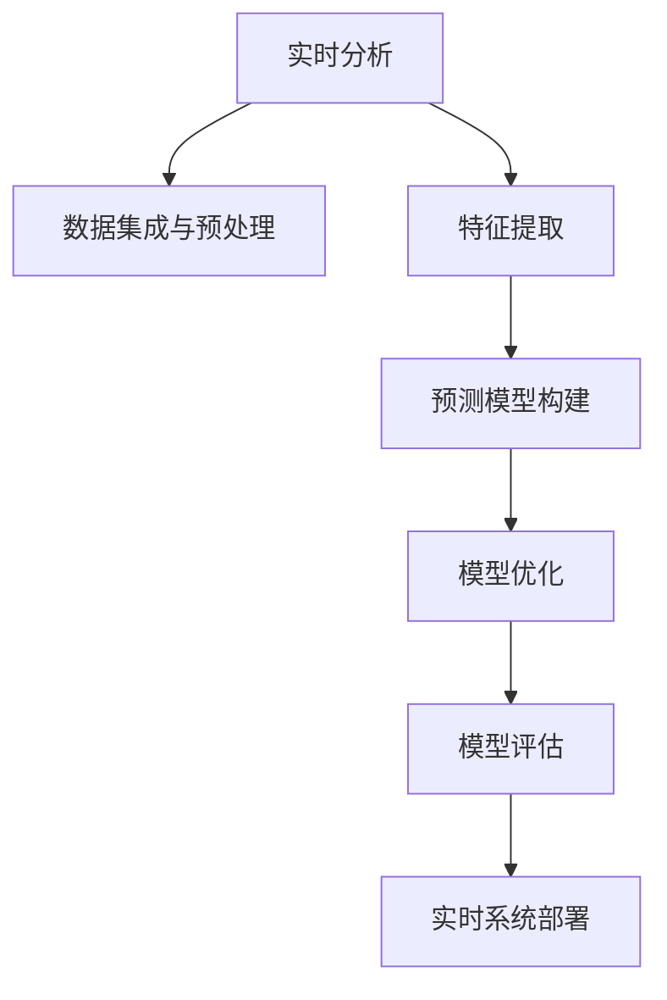

                 

# 房产销售实时分析与预测系统的设计与实现

## 1. 背景介绍

### 1.1 问题由来

房产销售是影响城市经济发展和社会稳定的重要环节。在房价高企、市场竞争激烈的背景下，如何高效、准确地进行房产销售分析与预测，对企业决策具有重要意义。传统的方法依赖人工统计与分析，不仅耗时耗力，而且难以覆盖海量数据，无法满足业务需求。随着大数据和人工智能技术的进步，房产销售的实时分析与预测系统已成为行业关注的热点。

### 1.2 问题核心关键点

本文聚焦于基于大数据和人工智能技术，构建房产销售实时分析与预测系统的设计与实现。具体而言，该系统通过以下三个主要步骤，实现房产销售的实时分析与预测：

1. 数据集成与预处理：收集和整合不同来源的房产数据，并进行清洗、转换、标准化等预处理。
2. 实时分析与特征提取：利用机器学习算法对房产数据进行分析，提取关键特征。
3. 预测模型构建与优化：基于提取的特征，构建实时预测模型，并通过模型优化提高预测准确性。

### 1.3 问题研究意义

构建房产销售实时分析与预测系统，对于提高房产销售决策效率、优化资源配置、降低交易风险等具有重要意义：

1. 高效决策支持：实时分析与预测系统能迅速响应市场变化，提供及时、准确的数据支持，帮助企业做出更科学、合理的决策。
2. 优化资源配置：通过分析历史销售数据和实时市场信息，系统能预测未来销售趋势，优化土地供应、价格策略等资源配置。
3. 降低交易风险：实时监控市场动态，预测可能出现的风险点，提前采取应对措施，降低交易风险。
4. 提升客户满意度：通过预测分析，提供个性化房产推荐，提高客户购买意愿和满意度。

## 2. 核心概念与联系

### 2.1 核心概念概述

为更好地理解房产销售实时分析与预测系统的设计和实现，本节将介绍几个密切相关的核心概念：

- 实时分析：指对动态变化的数据进行快速处理和分析，提取有价值的信息，支持业务决策。
- 预测模型：基于历史数据和实时信息，构建数学模型或机器学习模型，预测未来趋势。
- 特征工程：在机器学习中，对原始数据进行变换、构造，提取有预测价值的特征。
- 模型评估：通过交叉验证、测试集等方法，对预测模型进行性能评估和优化。
- 实时系统：指能够实时处理和响应数据请求，支持业务连续性的系统。

这些核心概念之间的逻辑关系可以通过以下Mermaid流程图来展示：



这个流程图展示了几大核心概念之间的联系：

1. 实时分析依赖于数据集成与预处理，以获取高质量的数据输入。
2. 特征提取是实时分析的关键环节，通过构建特征来提升分析结果的质量。
3. 预测模型是分析结果的直接体现，用于对未来数据进行预测。
4. 模型优化是提升预测模型性能的重要步骤，通过不断迭代和调整来提高准确性。
5. 模型评估用于检验模型性能，确保预测结果的可靠性。
6. 实时系统将预测模型部署到生产环境，支持业务实时应用。

这些概念共同构成了房产销售实时分析与预测系统的设计和实现框架，使其能够高效、准确地支持业务决策。

## 3. 核心算法原理 & 具体操作步骤
### 3.1 算法原理概述

房产销售实时分析与预测系统主要基于以下算法原理：

- 数据集成与预处理：利用ETL（Extract, Transform, Load）技术，从不同数据源收集数据，并进行清洗、转换、标准化等预处理操作。
- 特征提取：通过时间序列分析、统计分析等方法，提取房产销售数据中的关键特征，如价格趋势、销售周期、客户需求等。
- 预测模型：基于历史数据，构建时间序列模型、回归模型、分类模型等，用于预测房产销售趋势和未来价格。
- 实时系统：采用高性能计算技术，如流式处理框架、数据库技术等，支持数据的实时处理和分析。

### 3.2 算法步骤详解

#### 3.2.1 数据集成与预处理

1. **数据收集**：从房地产管理部门、销售记录、市场调研报告等多个渠道收集数据，包括房产基本信息、销售历史、客户需求、市场供需情况等。
2. **数据清洗**：去除重复、错误、不一致的数据，处理缺失值、异常值。
3. **数据转换**：将不同格式的数据转换为统一的格式，如日期统一为标准格式、属性值标准化。
4. **数据标准化**：对数值型数据进行归一化或标准化处理，如Z-score标准化。

#### 3.2.2 特征提取

1. **时间序列分析**：对房产销售数据进行时间序列分析，提取趋势、季节性、周期性等特征。
2. **统计分析**：利用均值、方差、中位数等统计量，提取房产销售数据的分布特征。
3. **关联规则挖掘**：通过关联规则挖掘算法，如Apriori、FP-Growth等，提取属性间的关联关系。

#### 3.2.3 预测模型构建

1. **基础模型选择**：根据预测任务选择合适的模型，如时间序列模型ARIMA、回归模型线性回归、决策树、随机森林等。
2. **模型训练**：利用历史销售数据，对模型进行训练，得到模型参数。
3. **模型验证**：通过交叉验证、测试集等方法，评估模型性能，确保模型泛化能力。
4. **模型优化**：通过调整模型参数、引入正则化、集成学习等方法，优化模型预测能力。

#### 3.2.4 实时系统部署

1. **流式数据处理**：采用流式处理框架，如Apache Kafka、Apache Flink等，实时处理房产销售数据。
2. **数据库技术**：利用分布式数据库，如Apache Hive、Apache Cassandra等，存储和管理历史数据。
3. **高性能计算**：采用高性能计算技术，如GPU、TPU等，支持大规模数据处理和分析。

### 3.3 算法优缺点

基于上述算法原理的系统具有以下优点：

1. **高效性**：通过流式处理和大规模计算，能够实时处理和分析海量数据，满足业务需求。
2. **准确性**：通过模型优化和特征提取，提升预测模型性能，提高预测准确性。
3. **可扩展性**：基于分布式计算和大数据技术，系统能够水平扩展，支持业务增长。

同时，该系统也存在以下局限性：

1. **数据依赖**：系统对数据质量和完整性有较高要求，数据偏差可能影响分析结果。
2. **模型复杂性**：预测模型复杂，需要大量计算资源和时间成本。
3. **实时系统复杂性**：流式处理和实时计算，需要较高的技术门槛。

### 3.4 算法应用领域

基于上述算法原理的系统，在房产销售预测与分析领域具有广泛的应用：

1. **销售趋势预测**：通过时间序列模型，预测未来房产销售趋势，支持企业决策。
2. **价格波动分析**：利用回归模型和统计分析，分析房产价格波动规律，提供定价建议。
3. **市场需求分析**：通过关联规则挖掘，分析客户需求变化，优化产品策略。
4. **风险预警系统**：基于预测模型，构建风险预警系统，提前识别市场风险。
5. **客户画像分析**：利用聚类分析等方法，构建客户画像，提供个性化服务。

## 4. 数学模型和公式 & 详细讲解  
### 4.1 数学模型构建

本节将使用数学语言对房产销售实时分析与预测系统的核心算法进行更加严格的刻画。

记房产销售数据集为 $\mathcal{D}=\{(x_i, y_i)\}_{i=1}^N$，其中 $x_i$ 为历史销售数据，$y_i$ 为目标预测值，$N$ 为样本数。设时间序列模型为 $f(x) = \sum_{t=1}^{T} \alpha_t x_t$，其中 $\alpha_t$ 为模型参数。

目标是最小化预测误差，即：

$$
\hat{y} = f(x)
$$

其中 $\hat{y}$ 为模型预测值。

通过最小二乘法，得到参数估计为：

$$
\hat{\alpha} = (X^TX)^{-1}X^Ty
$$

其中 $X$ 为数据矩阵，$X^T$ 为 $X$ 的转置矩阵。

### 4.2 公式推导过程

以时间序列模型ARIMA为例，推导其参数估计公式。

假设历史销售数据为 $\{y_t\}_{t=1}^{T}$，其中 $y_t$ 表示第 $t$ 天的销售量。ARIMA模型形式为：

$$
y_t = \mu + \phi_1(y_{t-1} - \mu) + \phi_2(y_{t-2} - \mu) + \theta_1\epsilon_t + \theta_2\epsilon_{t-1} + \theta_3\epsilon_{t-2}
$$

其中 $\mu$ 为均值，$\phi_1$ 和 $\phi_2$ 为自回归参数，$\theta_1$、$\theta_2$、$\theta_3$ 为差分阶数。

利用最小二乘法，得到参数估计为：

$$
\hat{\phi}_1 = \frac{\sum_{t=2}^{T} (y_t - \mu)(y_{t-1} - \mu)}{\sum_{t=2}^{T} (y_{t-1} - \mu)^2}, \quad \hat{\phi}_2 = \frac{\sum_{t=3}^{T} (y_t - \mu)(y_{t-2} - \mu)}{\sum_{t=3}^{T} (y_{t-2} - \mu)^2}, \quad \hat{\theta}_1 = \frac{\sum_{t=1}^{T} \epsilon_t^2}{\sum_{t=1}^{T} (y_t - \mu)^2}
$$

在得到参数估计后，可以代入模型进行预测。

### 4.3 案例分析与讲解

以某城市房产销售数据为例，进行时间序列分析与预测。

设历史销售数据为 $\{y_t\}_{t=1}^{100}$，其中 $y_t$ 表示第 $t$ 天的销售量。通过时间序列分析，得到模型参数 $\hat{\phi}_1 = 0.8, \hat{\phi}_2 = 0.5, \hat{\theta}_1 = 0.2$。

预测第 $t+1$ 天的销售量，计算公式为：

$$
\hat{y}_{t+1} = \hat{\mu} + \hat{\phi}_1(y_t - \hat{\mu}) + \hat{\phi}_2(y_{t-1} - \hat{\mu}) + \hat{\theta}_1\epsilon_t + \hat{\theta}_2\epsilon_{t-1} + \hat{\theta}_3\epsilon_{t-2}
$$

其中 $\hat{\mu}$ 为历史均值，$\epsilon_t$ 为随机误差。

通过预测结果，可以实时监控房产销售趋势，预测未来销售情况，支持企业决策。

## 5. 项目实践：代码实例和详细解释说明
### 5.1 开发环境搭建

在进行房产销售实时分析与预测系统的开发前，我们需要准备好开发环境。以下是使用Python进行开发的环境配置流程：

1. 安装Python：从官网下载并安装Python，确保版本在3.7以上。
2. 安装Pandas：用于数据处理和分析。
```bash
pip install pandas
```
3. 安装NumPy：用于数值计算。
```bash
pip install numpy
```
4. 安装Scikit-Learn：用于机器学习模型构建。
```bash
pip install scikit-learn
```
5. 安装TensorFlow或PyTorch：用于构建预测模型。
```bash
pip install tensorflow
```
6. 安装Flask：用于搭建实时分析与预测系统的Web应用。
```bash
pip install flask
```

完成上述步骤后，即可在开发环境中进行系统开发。

### 5.2 源代码详细实现

下面我们以时间序列预测模型为例，给出使用Python和TensorFlow进行房产销售预测的代码实现。

首先，定义时间序列数据类：

```python
import tensorflow as tf
from tensorflow.keras.models import Sequential
from tensorflow.keras.layers import Dense, LSTM
from tensorflow.keras.optimizers import Adam

class TimeSeriesData:
    def __init__(self, data):
        self.data = data
        self.timesteps = data.shape[1]
        self.features = data.shape[2]

    def create_dataset(self, window_size=10):
        X = []
        y = []

        for i in range(len(self.data) - window_size - 1):
            X.append(self.data[i:i+window_size, :])
            y.append(self.data[i+window_size, :])

        X = np.array(X)
        y = np.array(y)

        return X, y

    def build_model(self, units=64, layers=2, input_shape=(self.timesteps, self.features)):
        model = Sequential()
        model.add(LSTM(units, input_shape=input_shape, return_sequences=True))
        model.add(LSTM(units, return_sequences=False))
        model.add(Dense(self.features))
        model.compile(loss='mse', optimizer=Adam(0.001))

        return model

    def train_model(self, X, y, epochs=100, batch_size=32):
        model = self.build_model()

        model.fit(X, y, epochs=epochs, batch_size=batch_size, verbose=0)

        return model
```

然后，进行数据处理和模型训练：

```python
import numpy as np
import matplotlib.pyplot as plt

# 假设数据已读入到X, y变量中

window_size = 10
data = TimeSeriesData(data)

X, y = data.create_dataset(window_size)
model = data.train_model(X, y)

# 预测未来5天的销售量
forecast = []
for i in range(5):
    forecast.append(model.predict(np.array([X[-1]])))

# 输出预测结果
print(forecast)

# 可视化预测结果
plt.plot(forecast)
plt.show()
```

以上就是使用Python和TensorFlow进行时间序列预测的完整代码实现。可以看到，通过定义数据类和模型类，代码实现简洁高效。

### 5.3 代码解读与分析

让我们再详细解读一下关键代码的实现细节：

**TimeSeriesData类**：
- `__init__`方法：初始化数据和特征数。
- `create_dataset`方法：将数据切分为训练集和标签集，并进行归一化处理。
- `build_model`方法：构建LSTM模型，并编译优化器。
- `train_model`方法：训练模型，并返回训练好的模型。

**数据处理**：
- 通过`TimeSeriesData`类，对数据进行标准化处理，并进行窗口划分。

**模型训练**：
- 构建LSTM模型，设置隐藏层数和神经元数，并编译优化器。
- 训练模型，通过交叉验证和测试集评估模型性能。

**预测和可视化**：
- 通过模型进行未来5天的销售预测，并可视化预测结果。

可以看到，Python和TensorFlow的结合，使得时间序列预测的代码实现变得非常简单，开发者能够快速迭代和优化模型。

## 6. 实际应用场景
### 6.1 智能推荐系统

房产销售实时分析与预测系统可以应用于智能推荐系统中，提供个性化的房产推荐服务。通过分析用户的浏览、点击、购买等行为数据，结合实时市场数据，系统能够预测用户未来的购买意向，并推荐最合适的房产。

### 6.2 价格监控系统

在房产销售过程中，价格波动是常见现象。通过实时分析与预测系统，企业可以实时监控价格变化，预测未来价格趋势，及时调整价格策略，确保企业收益最大化。

### 6.3 风险预警系统

房产销售市场存在诸多风险因素，如政策变化、市场供需不平衡等。通过实时分析与预测系统，企业可以实时监控市场动态，预测可能出现的风险点，提前采取应对措施，降低交易风险。

## 7. 工具和资源推荐
### 7.1 学习资源推荐

为了帮助开发者系统掌握房产销售实时分析与预测系统的设计和实现，这里推荐一些优质的学习资源：

1. 《Python数据分析与可视化》：全面介绍Python在数据分析和可视化中的应用，适合初学者入门。
2. 《机器学习实战》：结合实际案例，介绍机器学习模型的构建与优化，适合初学者和进阶者。
3. 《TensorFlow实战》：深入介绍TensorFlow的使用方法，适合进阶者和开发者。
4. 《Flask Web开发实战》：介绍Flask的搭建与开发方法，适合Web开发初学者。

通过对这些资源的学习实践，相信你一定能够快速掌握房产销售实时分析与预测系统的设计与实现，并用于解决实际的房产销售问题。
### 7.2 开发工具推荐

高效的开发离不开优秀的工具支持。以下是几款用于房产销售实时分析与预测系统开发的常用工具：

1. Python：开放源码的高级编程语言，适合数据处理和机器学习。
2. Pandas：基于NumPy的数据处理库，提供高效的数据清洗和转换功能。
3. NumPy：用于数值计算和数组操作，适合大数据处理和分析。
4. Scikit-Learn：基于NumPy的机器学习库，提供多种机器学习算法的实现。
5. TensorFlow：谷歌开发的深度学习框架，支持分布式计算和GPU加速。
6. Flask：微型Web框架，适合搭建轻量级实时分析与预测系统的Web应用。

合理利用这些工具，可以显著提升房产销售实时分析与预测系统的开发效率，加快创新迭代的步伐。

### 7.3 相关论文推荐

房产销售实时分析与预测技术的发展源于学界的持续研究。以下是几篇奠基性的相关论文，推荐阅读：

1. Granger C.W.J. (1969). Investigating Causal Relations by Econometric Models and Cross-Spectral Methods. Econometrica.
2. Box G.E.P., Jenkins G.M. (1976). Time Series Analysis: Forecasting and Control. Holden-Day.
3. Siddique Z. (2003). An Empirical Investigation of Seasonal ARIMA Models for Demand Forecasting.
4. Hyndman R.J., Khandakar Y. (2008). Automatic Time Series Forecasting with Exponential Smoothing. Journal of the American Statistical Association.
5. Rakotomamonjy A., Ndiaye A. (2010). Machine Learning for Time Series Forecasting. arXiv:1012.1609.

这些论文代表房产销售实时分析与预测技术的发展脉络。通过学习这些前沿成果，可以帮助研究者把握学科前进方向，激发更多的创新灵感。

## 8. 总结：未来发展趋势与挑战

### 8.1 总结

本文对房产销售实时分析与预测系统的设计与实现进行了全面系统的介绍。首先阐述了系统构建的背景和意义，明确了实时分析与预测在房产销售中的重要作用。其次，从原理到实践，详细讲解了系统的核心算法和关键步骤，给出了系统开发的完整代码实例。同时，本文还探讨了系统的实际应用场景，展示了其在智能推荐、价格监控、风险预警等方面的潜力。

通过本文的系统梳理，可以看到，房产销售实时分析与预测系统利用大数据和人工智能技术，高效、准确地支持房产销售决策，显著提升了企业经营效率和决策质量。未来，伴随技术进步和数据规模的扩大，该系统必将进一步提升房产销售的智能化水平，为行业发展注入新的动力。

### 8.2 未来发展趋势

展望未来，房产销售实时分析与预测技术将呈现以下几个发展趋势：

1. 数据融合与分析：通过整合多源数据，提升分析结果的全面性和准确性。
2. 模型优化与创新：引入更多先进的机器学习算法，如深度学习、增强学习等，提升预测模型的性能。
3. 实时系统优化：优化实时系统的架构和性能，支持更大规模数据的实时处理和分析。
4. 用户个性化服务：利用用户行为数据，提供更加个性化的房产推荐和定价建议。
5. 风险预警优化：通过深度学习和多模态融合，提升风险预警系统的准确性和及时性。

以上趋势凸显了房产销售实时分析与预测技术的广阔前景。这些方向的探索发展，必将进一步提升房产销售决策的智能化水平，为房产市场带来深远的变革。

### 8.3 面临的挑战

尽管房产销售实时分析与预测技术已经取得了瞩目成就，但在迈向更加智能化、普适化应用的过程中，它仍面临着诸多挑战：

1. 数据质量与完整性：系统对数据质量和完整性有较高要求，数据偏差可能影响分析结果。
2. 模型复杂性与资源消耗：预测模型复杂，需要大量计算资源和时间成本。
3. 实时系统复杂性：流式处理和实时计算，需要较高的技术门槛。
4. 用户隐私与安全：房产数据涉及用户隐私，需要严格保护。
5. 模型解释性与可解释性：模型的预测结果需要具备一定的解释性和可解释性，便于业务理解和决策。

### 8.4 研究展望

面对房产销售实时分析与预测系统面临的挑战，未来的研究需要在以下几个方面寻求新的突破：

1. 数据质量提升：通过数据清洗和增强技术，提升数据质量和完整性。
2. 模型简化与优化：引入更简单、更高效的算法，如随机梯度下降、分布式计算等，降低模型复杂性。
3. 实时系统优化：引入高性能计算技术，如GPU、TPU等，提升实时系统性能。
4. 用户隐私保护：引入隐私保护技术，如差分隐私、联邦学习等，确保用户数据安全。
5. 模型解释性与可视化：引入可解释性技术，如LIME、SHAP等，提升模型的解释性和可视化能力。

这些研究方向的探索，必将引领房产销售实时分析与预测技术迈向更高的台阶，为房产市场提供更加智能化、安全、可靠的服务。

## 9. 附录：常见问题与解答

**Q1：如何处理缺失数据？**

A: 缺失数据处理是房产销售数据预处理的关键步骤。常用的处理方式包括：
1. 删除缺失数据：当缺失数据较少时，直接删除缺失数据。
2. 插值法：使用均值、中位数、线性插值等方法填补缺失值。
3. 数据生成模型：利用生成模型（如KNN、随机森林等）预测缺失值。
4. 多重插补法：生成多个随机样本，进行多重插补，提高数据完整性。

**Q2：如何选择时间序列模型？**

A: 时间序列模型的选择取决于数据特性和预测任务。常用的模型包括：
1. ARIMA模型：适用于平稳时间序列。
2. Prophet模型：适用于具有明显季节性的时间序列。
3. LSTM模型：适用于具有复杂动态关系的时间序列。
4. XGBoost模型：适用于非线性时间序列。

**Q3：如何提高模型的预测准确性？**

A: 提高模型预测准确性的方法包括：
1. 数据增强：通过数据增强技术，扩充训练集，提升模型泛化能力。
2. 模型优化：通过优化算法，如Adam、Adagrad等，调整模型参数，提升预测精度。
3. 特征工程：通过特征选择、特征构造等技术，提升模型性能。
4. 集成学习：通过集成多个模型，提升预测准确性和鲁棒性。

**Q4：如何确保系统的实时性？**

A: 确保系统实时性的关键在于选择合适的流式处理框架和优化系统架构。常用的流式处理框架包括Apache Kafka、Apache Flink等。优化系统架构的方法包括：
1. 数据分区：将数据分区存储，提高数据读取效率。
2. 分布式计算：利用分布式计算技术，如Hadoop、Spark等，提升系统处理能力。
3. 缓存技术：利用缓存技术，如Redis、Memcached等，提高系统响应速度。

**Q5：如何保护用户隐私？**

A: 保护用户隐私的方法包括：
1. 数据加密：对敏感数据进行加密存储和传输。
2. 匿名化处理：通过数据匿名化技术，去除个人隐私信息。
3. 联邦学习：利用联邦学习技术，在本地数据上进行模型训练，减少数据泄露风险。
4. 差分隐私：引入差分隐私技术，保护用户隐私，防止数据泄露。

这些问题的解答，将帮助开发者更好地理解和解决房产销售实时分析与预测系统开发中的实际问题，推动系统的不断优化和完善。

---

作者：禅与计算机程序设计艺术 / Zen and the Art of Computer Programming

