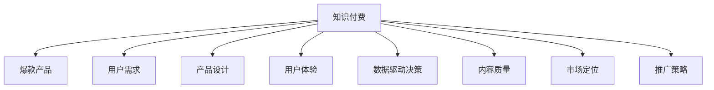

                 

# 打造知识付费爆款产品的核心要素

> 关键词：知识付费,爆款产品,核心要素,用户需求,产品设计,用户体验,数据驱动,内容质量,市场定位,推广策略

## 1. 背景介绍

### 1.1 问题由来
随着互联网的普及和信息爆炸，人们对于有价值的内容需求日益增长。知识付费平台的兴起，为优质内容提供了商业化的渠道，吸引了大量用户关注和付费。然而，尽管知识付费市场不断扩大，真正能够持续吸引用户并产生商业价值的爆款产品仍然少之又少。那么，怎样的产品才能成为市场上的爆款？本文将从多个角度探讨打造知识付费爆款产品的核心要素。

### 1.2 问题核心关键点
打造知识付费爆款产品的关键在于理解用户需求、优化产品设计、提升用户体验、运用数据驱动决策、确保内容质量、精准定位市场、有效实施推广策略。以下将逐一探讨这些核心要素，并结合实际案例进行分析。

## 2. 核心概念与联系

### 2.1 核心概念概述

为更好地理解打造知识付费爆款产品的核心要素，本节将介绍几个密切相关的核心概念：

- **知识付费**：指用户为获取有价值的信息、知识和经验而支付费用的商业模式。知识付费平台通过提供专业、系统、易懂的课程、音频、视频等内容，满足用户学习需求。

- **爆款产品**：指在市场中广受欢迎、销售表现优异的产品。爆款产品通常具有高需求、高曝光、高口碑的特点。

- **用户需求**：指用户在使用产品过程中产生的需求和期望。了解并满足用户需求是打造爆款产品的核心。

- **产品设计**：指从用户体验角度出发，对产品功能、界面、交互等进行优化，提升产品可用性和吸引力。

- **用户体验**：指用户在使用产品过程中产生的感受和体验。良好的用户体验是提升用户满意度和产品口碑的关键。

- **数据驱动决策**：指在产品开发和运营过程中，通过数据分析和用户反馈，指导产品迭代和优化决策。

- **内容质量**：指产品提供的内容在专业性、系统性、实用性等方面的水准。优质的内容能够吸引用户付费和长期使用。

- **市场定位**：指产品针对的特定用户群体和市场细分。精准的市场定位能够提升产品市场竞争力。

- **推广策略**：指通过有效手段和方法，将产品推向市场并扩大用户覆盖面的策略。

这些核心概念之间的逻辑关系可以通过以下Mermaid流程图来展示：



这个流程图展示了一款知识付费爆款产品的发展路径：首先，通过了解用户需求，进行产品设计和用户体验优化；其次，基于数据驱动决策和内容质量控制，精准市场定位；最后，通过有效的推广策略，将产品推向市场并扩大用户覆盖面。

## 3. 核心算法原理 & 具体操作步骤
### 3.1 算法原理概述

打造知识付费爆款产品的算法原理，实际上是一种基于市场反馈和用户行为的迭代优化过程。其核心思想是通过不断的用户交互和数据分析，逐步优化产品功能、提升用户体验、精准定位市场、推广产品。

具体来说，该过程包括以下几个关键步骤：

1. **需求分析**：通过问卷调查、用户访谈、数据分析等手段，了解用户需求和行为模式。
2. **产品设计**：基于用户需求，设计符合用户期望的产品功能和界面。
3. **用户体验优化**：通过A/B测试、用户反馈等方法，不断优化产品设计和功能，提升用户满意度。
4. **数据驱动决策**：利用数据分析和用户反馈，指导产品迭代和优化决策。
5. **内容质量控制**：通过专家评审、用户评价等手段，确保产品提供的内容具有高专业性和实用性。
6. **市场定位**：根据用户反馈和市场需求，精准定义产品目标用户群体和市场细分。
7. **推广策略**：通过市场调研、竞品分析、社交媒体等手段，制定有效的推广策略，扩大产品曝光和用户覆盖面。

### 3.2 算法步骤详解

以下是打造知识付费爆款产品的详细步骤：

**Step 1: 需求分析**
- 使用问卷调查工具，设计详细的用户需求调查问卷，收集目标用户的基本信息和行为数据。
- 进行用户访谈，深入了解用户使用产品的痛点和期望。
- 通过数据分析工具，如Google Analytics，收集用户访问路径、停留时间、点击行为等数据，分析用户行为模式。

**Step 2: 产品设计**
- 根据用户需求和行为数据，定义产品功能和界面设计需求。
- 进行用户原型测试，收集用户反馈，优化产品设计。
- 设计用户界面(UI)和用户体验(UX)，确保产品界面简洁美观，操作简便。

**Step 3: 用户体验优化**
- 在产品正式上线前，进行A/B测试，对比不同版本的用户体验，优化最佳方案。
- 收集用户反馈，针对性地改进产品功能和界面。
- 定期更新产品功能，确保用户体验持续提升。

**Step 4: 数据驱动决策**
- 建立数据监测和分析系统，实时跟踪产品使用数据和用户反馈。
- 利用数据挖掘和机器学习技术，分析用户行为和产品表现，发现优化点。
- 根据数据分析结果，指导产品迭代和优化决策，提升产品竞争力。

**Step 5: 内容质量控制**
- 建立内容评审机制，邀请领域专家对产品内容进行评审，确保内容的准确性和实用性。
- 通过用户评价和反馈，持续改进和优化产品内容。
- 定期更新课程和内容，保持内容的最新和相关性。

**Step 6: 市场定位**
- 进行市场调研，分析目标用户的兴趣、需求和行为。
- 根据用户数据和市场需求，定义产品目标用户群体和市场细分。
- 制定有针对性的营销策略，提升产品在特定用户群体中的知名度和认可度。

**Step 7: 推广策略**
- 通过社交媒体、搜索引擎优化(SEO)、内容营销等手段，提升产品曝光率。
- 与KOL（关键意见领袖）和行业专家合作，借助其影响力推广产品。
- 利用广告投放和促销活动，吸引新用户并提高用户留存率。

### 3.3 算法优缺点

打造知识付费爆款产品的算法具有以下优点：

1. **数据驱动**：通过数据分析和用户反馈，能够科学指导产品迭代和优化决策，提升产品竞争力。
2. **用户体验优化**：持续优化用户体验，提升用户满意度和粘性。
3. **市场定位精准**：精准定义目标用户群体和市场细分，提升市场占有率。
4. **推广效果显著**：通过有效的推广策略，扩大产品曝光和用户覆盖面。

同时，该方法也存在以下局限性：

1. **高成本**：在数据分析和市场调研中，需要大量时间和资源投入。
2. **用户需求多样**：不同用户群体的需求差异大，难以一概而论。
3. **数据隐私问题**：在收集和分析用户数据时，需要注意数据隐私和合规问题。
4. **内容生产成本高**：高质量内容的生产需要高成本的专家资源和技术支持。
5. **推广效果不确定**：推广策略的效果受市场环境变化和竞争对手影响，存在不确定性。

尽管存在这些局限性，但就目前而言，基于数据驱动和用户行为分析的算法方法仍然是打造知识付费爆款产品的主流范式。未来相关研究的重点在于如何进一步降低成本、提高效率，同时兼顾用户体验和内容质量。

### 3.4 算法应用领域

打造知识付费爆款产品的算法方法，在教育、职业技能培训、企业内部培训等领域有着广泛的应用前景。以下列举几个典型的应用场景：

1. **教育领域**：针对不同年龄和知识水平的学生，提供个性化的在线课程和资源。通过数据分析和用户反馈，优化课程内容和教学方式，提升学习效果。

2. **职业技能培训**：为职场人士提供技能提升课程，如编程、管理、外语等。通过市场调研和用户需求分析，制定有针对性的培训方案，提升职业技能。

3. **企业内部培训**：为企业员工提供内部培训课程，提升员工素质和技能。通过分析员工绩效和反馈，优化培训内容和方式，提升企业竞争力。

除了上述这些经典应用外，知识付费产品还广泛应用于在线咨询、专业认证、个性化推荐等多个场景中，为各行各业带来新的价值和机会。

## 4. 数学模型和公式 & 详细讲解 & 举例说明

### 4.1 数学模型构建

为了更好地理解打造知识付费爆款产品的算法原理，本节将使用数学语言对关键步骤进行详细讲解。

假设知识付费平台的产品为 $P$，目标用户群体为 $U$，市场需求为 $M$。产品 $P$ 在时间 $t$ 上的用户满意度为 $S(P,t)$，用户反馈为 $F(P,t)$，市场调研数据为 $D(t)$。

定义用户满意度的函数为：

$$
S(P,t) = f_{P}(t) + g_{F}(F(P,t))
$$

其中，$f_{P}(t)$ 为产品 $P$ 在时间 $t$ 上的功能优化程度，$g_{F}(F(P,t))$ 为用户反馈 $F(P,t)$ 对产品满意度的影响。

通过数据驱动决策，可以定义一个优化模型：

$$
\maximize \sum_{t=1}^{T} \alpha \cdot S(P,t) + \beta \cdot C(P,t)
$$

其中，$\alpha$ 为用户满意度的权重，$\beta$ 为内容质量的权重，$C(P,t)$ 为产品内容在时间 $t$ 上的质量。

优化模型的目标是最大化用户满意度和内容质量的加权和，同时考虑内容的生产成本 $C(P,t)$。

### 4.2 公式推导过程

以下我们对优化模型进行详细的推导：

**Step 1: 用户满意度函数**
$$
S(P,t) = f_{P}(t) + g_{F}(F(P,t))
$$

其中，$f_{P}(t)$ 表示产品 $P$ 在时间 $t$ 上的功能优化程度，可以通过用户访谈和问卷调查等手段进行评估。$g_{F}(F(P,t))$ 表示用户反馈 $F(P,t)$ 对产品满意度的影响，可以通过A/B测试和用户评分等方式获取。

**Step 2: 数据驱动决策模型**
$$
\maximize \sum_{t=1}^{T} \alpha \cdot S(P,t) + \beta \cdot C(P,t)
$$

其中，$\alpha$ 为用户满意度的权重，$\beta$ 为内容质量的权重。$C(P,t)$ 表示产品内容在时间 $t$ 上的质量，可以通过专家评审和用户评价等方式评估。

**Step 3: 约束条件**
在优化模型中，还需要考虑一些约束条件：

- 用户需求满足度：用户满意度不能低于预设阈值。
- 成本预算：内容生产的总成本不能超过预算上限。
- 市场调研数据：市场调研数据必须真实可信，不能随意修改。

通过这些约束条件，确保优化模型在实际应用中的可行性和合理性。

### 4.3 案例分析与讲解

以某知识付费平台为例，分析其如何通过数据驱动决策打造爆款产品：

1. **需求分析**
   - 通过问卷调查和用户访谈，了解用户对于在线课程的需求和期望。
   - 利用数据分析工具，收集用户访问路径和停留时间数据，分析用户行为模式。

2. **产品设计**
   - 根据用户需求和行为数据，设计课程内容和教学界面。
   - 进行A/B测试，对比不同版本的用户体验，优化最佳方案。

3. **用户体验优化**
   - 收集用户反馈，针对性地改进课程内容和界面设计。
   - 定期更新课程内容和界面，提升用户体验。

4. **数据驱动决策**
   - 建立数据监测和分析系统，实时跟踪用户行为和课程表现。
   - 利用数据分析和用户反馈，指导课程迭代和优化决策。

5. **内容质量控制**
   - 建立内容评审机制，邀请专家对课程内容进行评审，确保内容的准确性和实用性。
   - 通过用户评价和反馈，持续改进和优化课程内容。

6. **市场定位**
   - 进行市场调研，分析目标用户的兴趣和需求。
   - 根据用户数据和市场需求，定义产品目标用户群体和市场细分。

7. **推广策略**
   - 通过社交媒体、搜索引擎优化(SEO)、内容营销等手段，提升产品曝光率。
   - 与KOL和行业专家合作，借助其影响力推广产品。

通过以上步骤，该知识付费平台成功打造了多款爆款课程，不仅提升了用户满意度，还实现了显著的商业收益。

## 5. 项目实践：代码实例和详细解释说明
### 5.1 开发环境搭建

在进行项目实践前，我们需要准备好开发环境。以下是使用Python进行Flask框架开发的环境配置流程：

1. 安装Python：从官网下载并安装Python，确保版本在3.6及以上。

2. 安装Flask：通过pip安装Flask框架：
```bash
pip install Flask
```

3. 安装SQLite数据库：用于存储用户数据和课程信息，通过pip安装：
```bash
pip install SQLite3
```

4. 安装Gunicorn：用于运行Flask应用，通过pip安装：
```bash
pip install gunicorn
```

5. 安装Flask-Admin：用于管理后台界面，通过pip安装：
```bash
pip install Flask-Admin
```

完成上述步骤后，即可在本地搭建Flask开发环境。

### 5.2 源代码详细实现

以下是一个简单的知识付费平台后台管理系统的实现，展示了如何利用Flask框架和SQLite数据库进行开发：

```python
from flask import Flask, render_template, request, redirect, url_for
from flask_admin import Admin
from flask_admin.contrib.sqla import ModelView
from flask_sqlalchemy import SQLAlchemy
import sqlite3

app = Flask(__name__)
app.config['SQLALCHEMY_DATABASE_URI'] = 'sqlite:///example.db'

# 创建SQLite数据库连接
conn = sqlite3.connect('example.db')
# 创建数据表
conn.execute('''CREATE TABLE IF NOT EXISTS courses
               (id INTEGER PRIMARY KEY AUTOINCREMENT, title TEXT, content TEXT, price REAL)''')
conn.execute('''CREATE TABLE IF NOT EXISTS users
               (id INTEGER PRIMARY KEY AUTOINCREMENT, username TEXT, password TEXT)''')
conn.commit()

# 关闭数据库连接
conn.close()

# 定义数据模型
class Course(db.Model):
    id = db.Column(db.Integer, primary_key=True)
    title = db.Column(db.String(100))
    content = db.Column(db.Text)
    price = db.Column(db.Float)

class User(db.Model):
    id = db.Column(db.Integer, primary_key=True)
    username = db.Column(db.String(100))
    password = db.Column(db.String(100))

# 创建Flask-Admin界面
admin = Admin(app, name='Admin', template_mode='bootstrap3')
admin.add_view(ModelView(Course, db, column_exclude_list=['id']))
admin.add_view(ModelView(User, db, column_exclude_list=['id']))

# 定义路由
@app.route('/')
def index():
    return render_template('index.html')

@app.route('/add_course', methods=['GET', 'POST'])
def add_course():
    if request.method == 'POST':
        title = request.form['title']
        content = request.form['content']
        price = request.form['price']
        course = Course(title=title, content=content, price=price)
        db.session.add(course)
        db.session.commit()
        return redirect(url_for('index'))
    else:
        return render_template('add_course.html')

@app.route('/view_courses')
def view_courses():
    courses = Course.query.all()
    return render_template('view_courses.html', courses=courses)

if __name__ == '__main__':
    app.run(debug=True)
```

### 5.3 代码解读与分析

让我们再详细解读一下关键代码的实现细节：

**Flask框架**：
- 通过Flask框架，搭建了简单的后台管理系统，包括用户管理和课程管理两个模块。
- 利用Flask的路由功能，定义了主页、添加课程、查看课程等路由。
- 使用SQLAlchemy扩展了SQLite数据库，方便数据存储和查询。

**数据模型**：
- 定义了两个数据模型：Course和User。Course模型表示课程信息，包含标题、内容和价格等字段。User模型表示用户信息，包含用户名和密码等字段。
- 通过Flask-Admin扩展，将数据模型绑定到Flask-Admin界面中，方便管理员对数据进行管理。

**路由处理**：
- 定义了主页、添加课程、查看课程等路由。主页展示所有课程，添加课程路由允许管理员添加新课程，查看课程路由展示所有课程列表。
- 通过SQLAlchemy查询数据库中的数据，并展示到模板中。

**代码执行结果**：
- 启动Flask应用，访问localhost:5000，即可看到管理员界面。
- 管理员登录后，可以添加新课程和查看课程列表。

通过这个简单的代码示例，展示了如何使用Flask框架和SQLite数据库搭建知识付费平台的后台管理系统。开发者可以根据实际需求，进一步扩展功能，如用户注册、登录、订单管理等，实现更加完善的产品系统。

## 6. 实际应用场景
### 6.1 智能客服系统

知识付费平台的智能客服系统，可以广泛应用于在线课程咨询、售后服务等方面。通过引入智能客服技术，可以大幅提升用户满意度，减少人工客服的工作量。

在技术实现上，可以收集用户在使用课程和平台过程中遇到的问题，构建知识库和问答系统。利用自然语言处理技术，将用户问题转换为结构化查询，从知识库中匹配答案。通过微调预训练模型，提高问答系统的准确性和自然性，使用户能够快速得到满意的解答。

### 6.2 个性化推荐系统

知识付费平台的个性化推荐系统，可以帮助用户发现感兴趣的课程和资源。通过分析用户的行为数据和历史购买记录，构建用户画像。利用机器学习算法，如协同过滤、内容推荐等，为用户推荐相关课程和资源，提升用户体验和购买转化率。

在技术实现上，可以建立用户行为数据仓库，使用SQL和ETL工具进行数据清洗和转换。利用Scikit-learn等机器学习库，构建推荐模型，并利用Flask框架搭建推荐系统接口。通过API接口，将推荐结果实时推送到用户界面，提升用户使用体验。

### 6.3 数据分析与用户研究

知识付费平台的后台管理系统，可以用于数据分析和用户研究。通过收集和分析用户行为数据，可以了解用户的使用习惯、付费行为、课程偏好等信息。利用这些数据，优化产品功能和营销策略，提升用户满意度和商业收益。

在技术实现上，可以利用SQLAlchemy等工具，对用户行为数据进行查询和分析。使用Jupyter Notebook等工具，进行数据可视化分析，提取关键洞察。通过数据分析结果，指导产品迭代和优化决策，提升用户体验和商业价值。

### 6.4 未来应用展望

随着知识付费平台的不断发展，未来的应用场景将更加多样。

1. **AI辅助课程设计**：利用AI技术，自动生成高质量课程内容，提升课程制作效率。
2. **智能内容推荐**：通过深度学习算法，为用户推荐个性化的课程和学习资源，提升用户粘性。
3. **用户情感分析**：利用自然语言处理技术，分析用户评论和反馈，提升课程质量和服务水平。
4. **多语言支持**：为国际用户提供多语言支持，扩展平台的全球市场。
5. **虚拟现实互动**：利用虚拟现实技术，提供沉浸式的课程体验，提升用户参与度和学习效果。

以上应用场景展示了知识付费平台的多样化发展方向，为平台带来新的商业机会和用户价值。

## 7. 工具和资源推荐
### 7.1 学习资源推荐

为了帮助开发者系统掌握知识付费产品的开发和运营，这里推荐一些优质的学习资源：

1. **《Python Web开发实战》**：介绍如何使用Flask框架搭建Web应用，涵盖路由、模板、数据库等核心技术。
2. **《Flask Web开发实战》**：详细讲解Flask框架的使用，包括路由、视图、模板等核心功能。
3. **《自然语言处理入门》**：讲解自然语言处理的基本概念和技术，涵盖文本分类、情感分析、问答系统等。
4. **《机器学习实战》**：介绍机器学习的基本算法和实现方法，包括协同过滤、内容推荐等。
5. **《用户行为分析》**：讲解用户行为分析的基本方法和技术，涵盖数据采集、数据清洗、数据可视化等。

通过这些资源的学习实践，相信你一定能够快速掌握知识付费产品的核心技术，开发出高用户满意度和商业价值的产品。

### 7.2 开发工具推荐

高效的开发离不开优秀的工具支持。以下是几款用于知识付费产品开发的常用工具：

1. **Flask**：基于Python的Web框架，简单易用，支持快速开发和迭代。
2. **SQLite**：轻量级的关系型数据库，适用于数据量不大的知识付费平台。
3. **Flask-Admin**：基于Flask的后台管理系统，方便管理和查询数据。
4. **Scikit-learn**：Python机器学习库，支持多种算法和模型，适用于个性化推荐等场景。
5. **Jupyter Notebook**：交互式编程环境，适合数据分析和模型训练。
6. **Gunicorn**：Python Web服务器，支持并发处理和负载均衡。

合理利用这些工具，可以显著提升知识付费产品的开发效率，加快创新迭代的步伐。

### 7.3 相关论文推荐

知识付费产品的开发和运营需要跨学科的知识支持，以下是几篇奠基性的相关论文，推荐阅读：

1. **《用户行为分析：方法、模型与应用》**：综述了用户行为分析的基本方法，包括数据采集、数据清洗、数据可视化等。
2. **《个性化推荐算法综述》**：综述了个性化推荐的基本算法和技术，涵盖协同过滤、内容推荐等。
3. **《智能客服系统综述》**：综述了智能客服系统的基本技术和应用，涵盖自然语言处理、知识库构建等。
4. **《知识图谱构建与应用》**：介绍了知识图谱的基本概念和技术，涵盖知识抽取、图谱构建等。
5. **《用户研究方法论》**：综述了用户研究的基本方法，包括问卷调查、用户访谈等。

这些论文代表了大数据和人工智能领域的最新进展，为知识付费产品的开发和运营提供了坚实的理论基础。

## 8. 总结：未来发展趋势与挑战
### 8.1 总结

本文对打造知识付费爆款产品的核心要素进行了全面系统的介绍。首先阐述了知识付费和爆款产品的概念，明确了产品成功的重要因素。其次，从多个角度详细讲解了产品开发和运营的流程，包括需求分析、产品设计、用户体验优化、数据驱动决策、内容质量控制、市场定位和推广策略。最后，结合实际案例，展示了如何通过数据驱动决策打造爆款产品。

通过本文的系统梳理，可以看到，打造知识付费爆款产品需要从用户需求、产品设计、用户体验、数据驱动决策、内容质量控制、市场定位和推广策略等多个方面进行全面优化。只有不断迭代和优化，才能真正实现产品的市场成功和用户认可。

### 8.2 未来发展趋势

展望未来，知识付费产品的开发和运营将呈现以下几个发展趋势：

1. **AI技术的深度融合**：利用AI技术，如自然语言处理、机器学习等，提升产品的智能化和自动化水平。
2. **个性化推荐系统的优化**：通过深度学习算法，进一步优化个性化推荐系统，提升用户粘性和转化率。
3. **用户行为分析的深化**：利用大数据和机器学习技术，深入分析用户行为，优化产品功能和营销策略。
4. **智能客服系统的升级**：引入先进的自然语言处理和知识库技术，提升智能客服系统的准确性和自然性。
5. **多语言支持和国际化**：为国际用户提供多语言支持，扩展平台的全球市场。
6. **虚拟现实和增强现实**：利用虚拟现实和增强现实技术，提供沉浸式和互动式的学习体验。

这些趋势将进一步推动知识付费产品的创新和发展，为平台带来更多的商业机会和用户价值。

### 8.3 面临的挑战

尽管知识付费产品的发展前景广阔，但在实际应用中仍面临诸多挑战：

1. **市场竞争激烈**：知识付费市场竞争激烈，如何突破同质化竞争，差异化定位，是产品成功的关键。
2. **用户需求多样**：不同用户群体的需求差异大，如何精准把握用户需求，满足多样化的学习需求，是产品开发的核心。
3. **内容生产成本高**：高质量内容的生产需要高成本的专家资源和技术支持，如何降低成本，提高生产效率，是平台运营的关键。
4. **数据隐私问题**：在数据收集和分析过程中，需要注意用户隐私和数据安全，避免数据泄露和滥用。
5. **用户体验优化难度大**：用户期望不断提升，如何持续优化用户体验，提升用户满意度和粘性，是产品运营的难点。
6. **技术迭代快速**：新技术和新趋势层出不穷，如何紧跟技术发展，持续提升产品竞争力，是产品团队需要不断面对的挑战。

这些挑战需要在产品开发和运营的各个环节进行全面优化和应对，才能真正实现知识付费产品的成功。

### 8.4 研究展望

未来的知识付费产品开发和运营需要持续探索和创新，以下是几个可能的研究方向：

1. **数据驱动的产品创新**：利用大数据和机器学习技术，深入分析用户行为，优化产品功能和营销策略，提升用户满意度和商业收益。
2. **AI辅助的内容创作**：利用AI技术，自动生成高质量课程内容，提升课程制作效率和效果。
3. **个性化推荐系统的优化**：通过深度学习算法，进一步优化个性化推荐系统，提升用户粘性和转化率。
4. **用户行为分析的深化**：利用大数据和机器学习技术，深入分析用户行为，优化产品功能和营销策略。
5. **智能客服系统的升级**：引入先进的自然语言处理和知识库技术，提升智能客服系统的准确性和自然性。
6. **多语言支持和国际化**：为国际用户提供多语言支持，扩展平台的全球市场。

这些研究方向将进一步推动知识付费产品的创新和发展，为平台带来更多的商业机会和用户价值。

## 9. 附录：常见问题与解答

**Q1：如何定义和评估知识付费产品的用户满意度？**

A: 用户满意度可以通过用户评分、用户评论、用户反馈等方式进行评估。具体的评估方法包括：
1. 用户评分：通过问卷调查或产品界面，让用户对课程和平台进行评分，获取用户对产品和服务的满意度。
2. 用户评论：在产品评论区，收集用户对课程内容的评价和建议，了解用户需求和期望。
3. 用户反馈：通过邮件、客服等方式，收集用户对产品功能和服务的反馈，发现问题和优化点。

通过这些方法，可以全面了解用户对产品和服务的满意度，指导产品迭代和优化决策。

**Q2：如何在数据驱动决策中平衡用户满意度和内容质量？**

A: 在数据驱动决策中，需要平衡用户满意度和内容质量，确保两者之间的协同。具体方法包括：
1. 用户满意度权重：在优化模型中，设定用户满意度的权重，确保用户体验始终处于重要位置。
2. 内容质量控制：通过专家评审和用户评价，确保课程内容的准确性和实用性。
3. 数据监测与分析：实时监测用户行为和课程表现，及时发现和解决问题。
4. 持续优化：根据用户反馈和数据分析结果，持续改进和优化课程内容和产品功能，提升用户体验和内容质量。

通过以上方法，可以在数据驱动决策中平衡用户满意度和内容质量，确保产品的持续优化和市场成功。

**Q3：如何利用数据驱动决策进行产品迭代和优化？**

A: 数据驱动决策的核心在于通过数据分析和用户反馈，指导产品迭代和优化决策。具体方法包括：
1. 数据采集与清洗：利用SQL和ETL工具，收集和清洗用户行为数据。
2. 数据分析与建模：利用Python机器学习库，构建用户行为模型和推荐算法。
3. 数据可视化：利用Jupyter Notebook等工具，进行数据可视化分析，提取关键洞察。
4. 决策指导：根据数据分析结果，指导产品迭代和优化决策，提升用户体验和商业价值。

通过以上方法，可以实现数据驱动的产品迭代和优化，提升产品竞争力和市场表现。

**Q4：如何提升知识付费产品的推广效果？**

A: 提升知识付费产品的推广效果，需要从多个方面进行优化。具体方法包括：
1. 内容营销：通过内容营销，提升产品知名度和曝光率。可以制作高质量的课程介绍、用户评价、专家访谈等内容，发布到社交媒体和博客平台。
2. 广告投放：利用Google AdWords、Facebook Ads等广告平台，进行精准投放和效果监测。
3. KOL和行业专家合作：与KOL和行业专家合作，借助其影响力推广产品。可以邀请专家进行课程录制和推荐，提升产品信任度和吸引力。
4. 社交媒体营销：利用微博、微信、知乎等社交媒体平台，进行品牌推广和用户互动。可以组织线上线下活动，吸引用户参与和传播。

通过以上方法，可以提升知识付费产品的推广效果，扩大用户覆盖面和市场影响力。

**Q5：如何在知识付费产品中实现用户个性化推荐？**

A: 用户个性化推荐是知识付费产品的核心功能之一，可以通过以下方法实现：
1. 用户画像构建：利用用户行为数据，构建用户画像，了解用户兴趣和需求。
2. 推荐算法选择：选择适合的推荐算法，如协同过滤、内容推荐等，构建个性化推荐模型。
3. 推荐结果展示：通过API接口，将推荐结果实时推送到用户界面，提升用户体验。
4. 推荐系统优化：利用用户反馈和数据分析，不断优化推荐模型，提升推荐效果。

通过以上方法，可以为用户提供个性化推荐，提升用户粘性和转化率，增强平台竞争力。

---

作者：禅与计算机程序设计艺术 / Zen and the Art of Computer Programming

