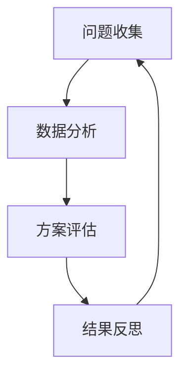

                 

# 批判性思考在管理中的重要性

在现代社会，管理已经成为企业取得成功的关键因素之一。管理者需要通过各种手段，实现资源的合理配置，协调各个环节，推动企业发展。批判性思考作为管理者的核心能力之一，具有不可替代的作用。通过批判性思考，管理者可以洞察企业运作中的问题，提出解决方案，优化决策流程，增强企业竞争力。本文将详细探讨批判性思考在管理中的重要性，帮助管理者掌握这一关键技能，提升其管理效能。

## 1. 背景介绍

### 1.1 问题由来

在当前快速变化的商业环境中，管理者面临的决策压力越来越大。企业竞争的加剧，使得管理者需要不断适应新的市场和技术变化。同时，企业内部复杂的运作机制，也对管理者的决策能力提出了更高要求。传统的决策方法往往难以应对多变的市场环境，而批判性思考则提供了一种更灵活、更全面的决策支持。

### 1.2 问题核心关键点

批判性思考的核心在于通过分析、评估和反思，形成更合理的决策。它包括但不限于以下几个方面：

1. **分析能力**：对数据的敏感性，能够识别数据背后的规律和趋势。
2. **评估能力**：对不同方案的优劣进行全面衡量，避免片面思考。
3. **反思能力**：对决策过程进行复盘，总结经验教训，优化未来决策。

批判性思考能够帮助管理者在信息爆炸的今天，保持清晰的头脑，做出更为明智的决策。然而，批判性思考也需要不断的学习和实践，才能逐渐掌握并应用到管理中。

## 2. 核心概念与联系

### 2.1 核心概念概述

批判性思考在管理中的作用，主要体现在以下几个方面：

1. **决策支持**：通过批判性思考，管理者能够从多角度分析问题，形成更为全面、科学的决策。
2. **问题诊断**：通过批判性分析，管理者可以深入了解企业运作中的问题，找到根本原因，提出有效的解决方案。
3. **创新驱动**：批判性思考能够激发管理者的创造力，推动企业不断创新，适应市场变化。
4. **风险管理**：通过批判性评估，管理者能够识别潜在的风险，制定应对策略，避免因决策失误导致的企业损失。

### 2.2 核心概念原理和架构的 Mermaid 流程图(Mermaid 流程节点中不要有括号、逗号等特殊字符)



上述流程图展示了批判性思考在管理中的基本流程：

1. **问题收集**：从企业运作的各个环节收集问题，为后续分析打下基础。
2. **数据分析**：对收集到的问题进行定量分析和定性分析，识别问题的本质。
3. **方案评估**：根据分析结果，提出多个解决方案，对每个方案的优劣进行全面评估。
4. **结果反思**：对最终的决策结果进行复盘，总结经验教训，优化决策流程。

## 3. 核心算法原理 & 具体操作步骤

### 3.1 算法原理概述

批判性思考的管理决策流程，可以概括为以下步骤：

1. **问题识别**：通过对企业运营数据的分析，识别出潜在的运营问题。
2. **假设验证**：根据假设，设计实验验证假设的真实性。
3. **解决方案提出**：根据假设验证结果，提出可行的解决方案。
4. **方案评估与选择**：对提出的解决方案进行多维度评估，选择最优方案。
5. **实施与监控**：执行方案并监控其效果，及时调整优化。

这一流程需要管理者的高度参与，结合数据驱动、问题导向和经验总结，形成完整的决策体系。

### 3.2 算法步骤详解

#### 3.2.1 问题识别

问题识别是管理决策的第一步，也是关键的一步。管理者需要关注以下几个方面：

1. **运营数据**：通过企业运营中的各项数据，识别出可能存在的问题。例如，通过销售数据识别出市场销售低迷。
2. **员工反馈**：通过员工调查、访谈等方式，了解员工对企业运作的看法和建议。例如，通过员工满意度调查识别出员工流失率高的问题。
3. **外部环境**：通过市场调研、行业报告等，了解外部环境的变化和影响。例如，通过行业趋势分析识别出市场需求变化。

#### 3.2.2 假设验证

假设验证是判断问题原因和提出解决方案的关键步骤。假设验证需要经过以下几个步骤：

1. **假设设计**：根据问题识别结果，设计出可验证的假设。例如，假设市场销售低迷是因为竞争对手降价。
2. **数据收集**：收集与假设相关的数据，进行初步分析。例如，收集竞争对手的价格和市场份额数据。
3. **实验设计**：设计实验方案，验证假设。例如，设计价格对比实验，验证竞争对手降价对市场销售的影响。
4. **结果分析**：对实验结果进行分析，判断假设是否成立。例如，通过数据分析发现竞争对手降价并未显著影响市场销售。

#### 3.2.3 解决方案提出

根据假设验证结果，管理者需要提出可行的解决方案。解决方案的提出需要注意以下几点：

1. **目标明确**：解决方案需要明确具体的目标，例如提高市场份额、降低成本等。
2. **可操作性强**：解决方案需要具备实际操作性，不能过于理想化。
3. **资源合理**：解决方案需要考虑企业的资源情况，确保方案可执行。

#### 3.2.4 方案评估与选择

方案评估与选择是决策过程中最关键的环节之一。评估和选择方案时，管理者需要考虑以下几个因素：

1. **成本效益**：评估方案的经济效益，选择性价比最高的方案。
2. **风险评估**：评估方案的风险，选择风险可控的方案。
3. **市场影响**：评估方案对市场的影响，选择对企业长远发展有益的方案。

#### 3.2.5 实施与监控

实施与监控是确保方案有效执行的关键步骤。实施与监控需要注意以下几点：

1. **明确职责**：明确每个责任人的职责和任务，确保方案顺利实施。
2. **定期检查**：定期检查方案执行情况，及时发现问题。
3. **调整优化**：根据监控结果，及时调整优化方案，确保方案有效执行。

### 3.3 算法优缺点

批判性思考的管理决策流程，具有以下优点：

1. **全面性**：通过多角度分析，形成更为全面、科学的决策。
2. **系统性**：从问题识别到解决方案实施，形成系统的决策流程，避免片面思考。
3. **灵活性**：根据实际情况，灵活调整方案，适应市场变化。

然而，批判性思考的管理决策流程也存在一些缺点：

1. **时间成本高**：从问题识别到方案实施，需要经过多个环节，耗费大量时间。
2. **复杂度高**：需要多维度分析，对管理者的能力要求较高。
3. **信息依赖**：需要大量数据支持，数据质量直接影响决策结果。

### 3.4 算法应用领域

批判性思考在管理中的应用领域非常广泛，主要包括以下几个方面：

1. **战略规划**：通过批判性思考，识别企业发展中的关键问题，制定战略规划。
2. **绩效管理**：通过批判性思考，分析员工绩效问题，提出改进措施。
3. **市场营销**：通过批判性思考，识别市场机会和风险，制定营销策略。
4. **人力资源管理**：通过批判性思考，分析员工需求和组织结构，优化人力资源管理。
5. **供应链管理**：通过批判性思考，识别供应链中的问题，优化供应链流程。

## 4. 数学模型和公式 & 详细讲解 & 举例说明

### 4.1 数学模型构建

批判性思考的管理决策过程，可以构建以下数学模型：

1. **问题识别模型**：通过数据挖掘、统计分析等方法，构建问题识别模型。例如，使用回归模型识别市场销售低迷问题。
2. **假设验证模型**：构建假设验证模型，验证假设的真实性。例如，使用A/B测试模型验证竞争对手降价对市场销售的影响。
3. **方案评估模型**：构建方案评估模型，对提出的解决方案进行多维度评估。例如，使用决策树模型评估成本效益、风险评估等。
4. **实施监控模型**：构建实施监控模型，实时监控方案执行情况。例如，使用KPI监控模型，确保方案有效执行。

### 4.2 公式推导过程

#### 4.2.1 回归模型

回归模型是问题识别的重要工具之一。假设问题数据为 $(x_i, y_i)$，其中 $x_i$ 为自变量，$y_i$ 为因变量。通过最小二乘法，求解回归方程：

$$
\hat{y} = \beta_0 + \beta_1 x_1 + \beta_2 x_2 + \ldots + \beta_n x_n
$$

其中 $\beta_0, \beta_1, \beta_2, \ldots, \beta_n$ 为回归系数，可通过矩阵求解法求解。

#### 4.2.2 A/B测试模型

A/B测试模型用于验证假设的真实性。假设测试结果为 $(x_i, y_i)$，其中 $x_i$ 为测试条件，$y_i$ 为测试结果。通过卡方检验，求解假设验证结果：

$$
K^2 = \frac{N(ad-bc)^2}{(a+b)(c+d)(a+c)(b+d)}
$$

其中 $N$ 为样本总数，$a, b, c, d$ 为测试数据的分组结果。根据 $K^2$ 的值，判断假设是否成立。

#### 4.2.3 决策树模型

决策树模型用于方案评估和选择。假设方案为 $(x_i, y_i)$，其中 $x_i$ 为方案特性，$y_i$ 为方案效果。通过信息增益法，求解决策树：

$$
Gain(S, A) = \sum_{i=1}^{n} \frac{|S_i|}{|S|} \times Gain(S_i, A)
$$

其中 $S$ 为样本集，$A$ 为方案特性，$S_i$ 为样本子集，$Gain(S_i, A)$ 为方案在子集 $S_i$ 上的信息增益。

#### 4.2.4 KPI监控模型

KPI监控模型用于实施监控。假设监控指标为 $(x_i, y_i)$，其中 $x_i$ 为监控数据，$y_i$ 为监控结果。通过均方误差法，求解监控模型：

$$
MSE = \frac{1}{N} \sum_{i=1}^{N} (y_i - \hat{y_i})^2
$$

其中 $N$ 为样本总数，$y_i$ 为监控结果，$\hat{y_i}$ 为预测结果。

### 4.3 案例分析与讲解

#### 4.3.1 问题识别案例

某公司发现其市场份额逐渐下降，通过数据分析发现其主要竞争对手在价格上进行了大幅调整。公司初步判断，竞争对手降价可能是市场份额下降的原因。

**数据收集**：收集公司竞争对手的价格和市场份额数据，以及公司自身的市场份额和销售数据。

**回归模型分析**：使用回归模型，分析竞争对手降价对市场份额的影响，发现降价显著提高了竞争对手的市场份额。

**问题识别**：根据回归模型分析结果，公司初步判断竞争对手降价是其市场份额下降的原因。

#### 4.3.2 假设验证案例

公司决定通过A/B测试验证降价是否为其市场份额下降的原因。设计如下实验方案：

1. **实验分组**：将市场分为A组和B组，A组为降价销售，B组为原价销售。
2. **数据收集**：收集A组和B组的销售数据。
3. **假设验证**：使用卡方检验，分析A组和B组的销售数据，判断降价对销售的影响。

**结果分析**：通过卡方检验，发现A组的销售数据显著高于B组，验证了降价对销售的影响。

#### 4.3.3 方案评估案例

公司决定提高市场份额，提出了多种方案，包括降价销售、增加广告投入、优化产品结构等。公司需要评估这些方案的可行性和效果。

**方案评估**：使用决策树模型，对每个方案的成本、效益、风险等因素进行评估，选择最优方案。

**方案选择**：根据决策树模型分析结果，选择降价销售和增加广告投入两个方案。

#### 4.3.4 实施监控案例

公司决定执行降价销售和增加广告投入两个方案，需要实时监控方案的执行效果。

**KPI监控**：定义关键绩效指标（KPI），如市场份额、销售额、广告点击率等。使用KPI监控模型，实时监控方案执行情况。

**调整优化**：根据KPI监控结果，及时调整方案，优化执行效果。

## 5. 项目实践：代码实例和详细解释说明

### 5.1 开发环境搭建

在实践批判性思考管理决策的代码实例前，需要先搭建好开发环境。以下是使用Python进行数据分析和建模的环境配置流程：

1. 安装Python：从官网下载并安装Python，确保版本为3.6及以上。

2. 安装相关库：安装NumPy、Pandas、Scikit-learn、Matplotlib等常用数据分析和建模库。

```bash
pip install numpy pandas scikit-learn matplotlib seaborn statsmodels statsmodels
```

3. 安装Jupyter Notebook：通过Anaconda安装Jupyter Notebook，方便开发和管理。

```bash
conda install jupyter notebook
```

完成上述步骤后，即可在Jupyter Notebook环境中开始开发。

### 5.2 源代码详细实现

下面我们以回归模型为例，给出使用Python和Scikit-learn进行问题识别的代码实现。

首先，定义回归模型：

```python
from sklearn.linear_model import LinearRegression

# 定义回归模型
model = LinearRegression()
```

接着，准备数据：

```python
import pandas as pd

# 读取数据
data = pd.read_csv('sales_data.csv')

# 准备数据
X = data[['price', 'market_share']].values
y = data['sales'].values

# 划分数据集
from sklearn.model_selection import train_test_split
X_train, X_test, y_train, y_test = train_test_split(X, y, test_size=0.2, random_state=42)
```

然后，训练模型：

```python
# 训练模型
model.fit(X_train, y_train)
```

最后，进行预测：

```python
# 预测测试数据
y_pred = model.predict(X_test)

# 评估模型
from sklearn.metrics import mean_squared_error
mse = mean_squared_error(y_test, y_pred)
print(f'Mean Squared Error: {mse:.2f}')
```

以上就是使用Python和Scikit-learn进行回归模型的代码实现。可以看到，通过简单的几行代码，我们就可以构建并训练一个回归模型，进行问题识别和预测。

### 5.3 代码解读与分析

让我们再详细解读一下关键代码的实现细节：

**LinearRegression类**：
- 定义了线性回归模型，用于问题识别。

**data**：
- 通过Pandas库读取数据，获取销售数据、价格和市场份额。

**X和y**：
- 将价格和市场份额作为自变量，销售额作为因变量，划分训练集和测试集。

**model.fit(X_train, y_train)**：
- 使用训练集数据，训练线性回归模型。

**y_pred**：
- 使用测试集数据，进行预测。

**mean_squared_error**：
- 使用均方误差法，评估模型预测效果。

在实际应用中，我们还可以根据具体任务，选择不同的模型和方法，如决策树、KNN、A/B测试等。通过不断实践和优化，提升管理决策的科学性和准确性。

## 6. 实际应用场景

### 6.1 企业战略规划

在企业战略规划中，批判性思考可以帮助管理者识别关键问题，制定科学战略。例如，某公司需要制定未来三年的发展战略，可以通过数据分析，识别出市场机会和威胁，形成详细的战略方案。

### 6.2 绩效管理

在绩效管理中，批判性思考可以帮助管理者分析员工绩效问题，提出改进措施。例如，某公司需要评估员工绩效，可以通过数据分析，识别出绩效低下的员工和部门，提出针对性的改进措施。

### 6.3 市场营销

在市场营销中，批判性思考可以帮助管理者识别市场机会和风险，制定营销策略。例如，某公司需要制定新的市场营销方案，可以通过数据分析，识别出目标客户群体和市场趋势，制定有效的营销策略。

### 6.4 人力资源管理

在人力资源管理中，批判性思考可以帮助管理者分析员工需求和组织结构，优化人力资源管理。例如，某公司需要优化招聘流程，可以通过数据分析，识别出人才缺口和招聘瓶颈，提出改进措施。

### 6.5 供应链管理

在供应链管理中，批判性思考可以帮助管理者识别供应链中的问题，优化供应链流程。例如，某公司需要优化供应链管理，可以通过数据分析，识别出供应链中的瓶颈和风险，制定优化方案。

## 7. 工具和资源推荐

### 7.1 学习资源推荐

为了帮助管理者系统掌握批判性思考的理论基础和实践技巧，这里推荐一些优质的学习资源：

1. 《批判性思维：思维与问题解决》书籍：详细介绍了批判性思维的概念、方法和应用，适合系统学习。

2. Coursera《批判性思维与问题解决》课程：由世界知名大学教授讲授，涵盖批判性思维的各个方面，适合理论学习。

3. TED Talks《How to Think Like a Master》视频：著名演讲者Ramit Sethi讲解批判性思维，适合提升思维能力。

4. 《管理决策分析》书籍：系统介绍了管理决策的理论和方法，适合实际应用。

5. 《数据驱动管理》书籍：介绍了如何通过数据驱动管理决策，提升决策效果。

通过对这些资源的学习实践，相信管理者能够更好地掌握批判性思考的技能，提升其管理效能。

### 7.2 开发工具推荐

高效的工具是提升管理决策效率的重要保障。以下是几款用于批判性思考和数据分析的工具：

1. Jupyter Notebook：免费的开发环境，支持Python和R等语言，方便进行数据建模和分析。

2. R语言：开源的数据分析语言，支持丰富的数据分析和建模工具，适合大数据分析。

3. Excel：广泛使用的数据分析工具，操作简单，适合小规模数据处理和分析。

4. Tableau：可视化数据工具，支持快速创建数据可视化的仪表盘，方便数据分析和展示。

5. Power BI：微软的商业智能工具，支持数据分析和可视化，适合企业级应用。

合理利用这些工具，可以显著提升管理决策的效率和效果，加速企业发展进程。

### 7.3 相关论文推荐

批判性思考在管理中的应用研究，已经得到了广泛的关注。以下是几篇有代表性的论文，推荐阅读：

1. 《批判性思维与问题解决：理论与实践》论文：系统介绍了批判性思维的理论基础和方法，适合学术研究。

2. 《管理决策中的批判性思维》论文：讨论了批判性思维在管理决策中的应用，适合实践应用。

3. 《基于批判性思维的企业战略规划》论文：探讨了批判性思维在企业战略规划中的应用，适合企业应用。

4. 《人力资源管理中的批判性思维》论文：分析了批判性思维在人力资源管理中的应用，适合企业管理。

5. 《供应链管理中的批判性思维》论文：讨论了批判性思维在供应链管理中的应用，适合供应链管理。

这些论文代表了大管理决策中批判性思维的发展脉络。通过学习这些前沿成果，可以帮助管理者更好地掌握批判性思考的方法，提升其管理效能。

## 8. 总结：未来发展趋势与挑战

### 8.1 总结

本文对批判性思考在管理中的重要性进行了全面系统的探讨。首先，介绍了批判性思考在管理决策中的作用和意义，明确了批判性思考对管理者的重要性。其次，通过问题识别、假设验证、方案评估和实施监控等环节，详细讲解了批判性思考在管理中的具体操作步骤。最后，探讨了批判性思考在企业战略规划、绩效管理、市场营销、人力资源管理、供应链管理等多个应用领域的重要性，展示了批判性思考的广泛应用前景。

通过本文的系统梳理，可以看到，批判性思考在现代管理中具有不可替代的作用，能够帮助管理者从多角度分析问题，提出更为科学合理的解决方案。在信息爆炸和市场竞争日益加剧的今天，批判性思考将成为管理者不可或缺的重要能力。

### 8.2 未来发展趋势

展望未来，批判性思考在管理中的应用将呈现以下几个发展趋势：

1. **自动化工具**：随着人工智能和机器学习技术的发展，未来将出现更多自动化工具，帮助管理者进行数据分析和决策优化。

2. **大数据分析**：随着数据规模的不断扩大，大数据分析将成为批判性思考的重要支撑，提供更为全面的数据支持。

3. **跨领域应用**：批判性思考将突破传统管理领域，广泛应用于金融、医疗、教育等多个行业，推动各行业的智能化进程。

4. **多维度分析**：未来将引入更多维度的数据，如物联网、社交媒体等，帮助管理者从更多角度进行问题分析和决策。

5. **集成化应用**：批判性思考将与其他人工智能技术进行更深入的融合，如自然语言处理、知识图谱等，推动跨领域智能应用的发展。

以上趋势凸显了批判性思考在管理中的重要性和未来发展方向，相信随着技术的不断进步，批判性思考将成为现代管理的重要工具，提升企业的竞争力。

### 8.3 面临的挑战

尽管批判性思考在管理中的应用已经取得了一定的成果，但在实现全面应用的过程中，仍面临诸多挑战：

1. **数据质量问题**：高质量的数据是批判性思考的基础，但当前数据质量参差不齐，数据缺失、噪声等问题依然存在。

2. **分析复杂度**：随着数据规模和复杂度的不断增加，批判性思考的分析难度也在不断提高，需要更高层次的工具和技术支持。

3. **方法局限性**：现有的批判性思考方法往往难以应对复杂多变的市场环境，需要更多创新和突破。

4. **技术壁垒**：批判性思考需要一定的技术基础，非专业背景的管理者可能难以掌握和应用。

5. **伦理问题**：在数据分析和决策过程中，需要考虑伦理和隐私问题，避免数据滥用和信息泄露。

### 8.4 研究展望

面对批判性思考在管理中面临的挑战，未来的研究需要在以下几个方面寻求新的突破：

1. **数据治理**：研究如何提高数据质量，构建数据治理体系，保障数据安全。

2. **技术创新**：开发更加智能化的数据分析工具，提升批判性思考的效率和效果。

3. **跨学科融合**：结合其他学科的知识，如心理学、社会学等，丰富批判性思考的理论和方法。

4. **伦理研究**：深入研究批判性思考中的伦理问题，制定相关的伦理标准和规范。

5. **教育普及**：推动批判性思考的教育普及，提升管理者的思维能力。

这些研究方向将为批判性思考在管理中的广泛应用提供强有力的支持和保障，推动管理决策的科学化和智能化。总之，批判性思考在现代管理中具有重要的战略地位，需要管理者不断学习和实践，掌握这一核心能力。

## 9. 附录：常见问题与解答

**Q1：如何提升数据质量？**

A: 提升数据质量可以从以下几个方面入手：
1. **数据清洗**：对数据进行清洗，去除噪声和异常值，确保数据准确性。
2. **数据标准化**：制定数据标准，统一数据格式和标签，提高数据一致性。
3. **数据采集**：通过多种渠道采集数据，丰富数据来源，提高数据全面性。
4. **数据治理**：构建数据治理体系，确保数据安全、可靠和可访问。

**Q2：如何提升数据分析效率？**

A: 提升数据分析效率可以从以下几个方面入手：
1. **自动化工具**：使用自动化数据分析工具，如Python的Pandas、NumPy等，减少手动操作，提高效率。
2. **数据预处理**：对数据进行预处理，如数据清洗、数据标准化等，减少数据分析的复杂度。
3. **分布式计算**：使用分布式计算框架，如Apache Spark、Hadoop等，提高数据处理速度。
4. **多维度分析**：引入多维度数据分析工具，如Tableau、Power BI等，提高数据分析的可视化和智能化程度。

**Q3：如何提升数据分析准确性？**

A: 提升数据分析准确性可以从以下几个方面入手：
1. **模型选择**：选择适合的数据分析模型，如回归模型、决策树、神经网络等，确保模型适合数据类型和分析需求。
2. **特征工程**：对数据进行特征工程，提取有意义的特征，提高模型的表现力。
3. **交叉验证**：使用交叉验证方法，评估模型的稳健性和泛化能力，确保模型的可靠性。
4. **模型优化**：对模型进行优化，如参数调优、模型集成等，提高模型的准确性和鲁棒性。

**Q4：如何提升数据分析决策效果？**

A: 提升数据分析决策效果可以从以下几个方面入手：
1. **指标体系**：构建合理的指标体系，如KPI、OKR等，确保决策目标明确。
2. **多维度评估**：对决策进行多维度评估，如成本效益、风险评估等，全面衡量决策效果。
3. **反馈机制**：建立决策反馈机制，及时调整优化决策，确保决策效果不断提升。
4. **组织协同**：推动组织协同，让各部门共同参与决策过程，确保决策的全面性和科学性。

通过不断优化数据质量、提升分析效率、确保分析准确性、优化决策效果，管理者可以更好地应用批判性思考，提升企业的管理效能和竞争力。

---

作者：禅与计算机程序设计艺术 / Zen and the Art of Computer Programming

