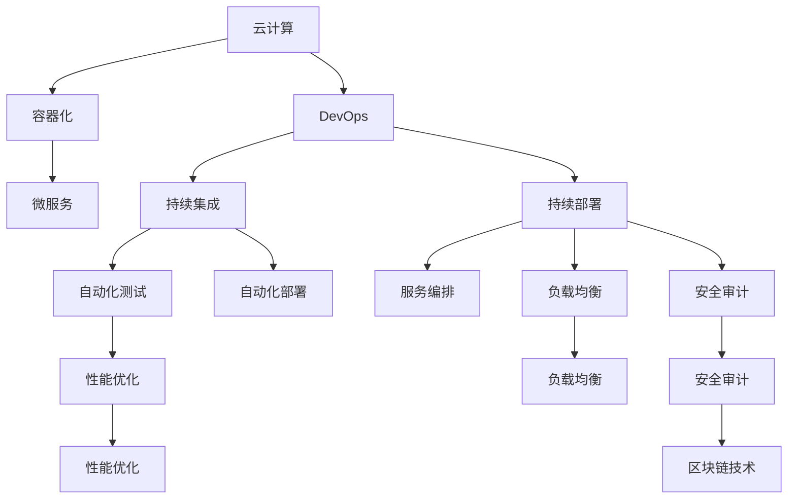

                 

# 技术分享：从线下到线上的转变

> 关键词：线上服务, 云计算, 容器化, DevOps, 自动化, 持续集成, 持续部署, 服务编排, 微服务, 容器编排, 负载均衡, 性能优化, 安全审计, 区块链技术

## 1. 背景介绍

### 1.1 问题由来

随着互联网的飞速发展，传统的线下业务正逐渐向线上转型。无论是电商、教育、医疗还是金融，都面临着业务线上化的需求。然而，这一转型并非易事，企业不仅需要重新规划业务架构，还要应对线上环境带来的技术挑战，如高并发、低延迟、弹性伸缩、故障自愈等。云计算、容器化、DevOps、微服务等技术手段，逐渐成为应对这些挑战的关键工具。

### 1.2 问题核心关键点

为了应对业务线上化的需求，企业在云环境中部署应用时需要考虑以下关键点：

- 高性能：线上服务需要支持高并发、低延迟，确保用户体验。
- 弹性伸缩：根据流量动态调整资源，避免资源浪费或不足。
- 故障自愈：自动化监控、报警、重试、降级等机制，确保服务稳定。
- 安全性：数据加密、访问控制、身份认证等措施，保护用户隐私。
- 可扩展性：系统架构需要具备良好扩展性，适应未来业务增长。
- 可维护性：代码管理和业务变更需要高效可靠，确保系统稳定性。

这些关键点构成了业务线上化的技术架构基础，也决定了系统的性能、安全、稳定性、扩展性和可维护性。

### 1.3 问题研究意义

从线下到线上转型的技术挑战，是推动技术发展和应用的重要动力。通过解决这些挑战，企业可以更高效地运营业务，提升用户体验，扩展市场空间。同时，技术挑战也为技术研究提供了广阔的实验场景，推动了相关技术的发展和应用，如云计算、容器化、DevOps、微服务、区块链等。

## 2. 核心概念与联系

### 2.1 核心概念概述

为更好地理解业务线上化的技术架构，本节将介绍几个密切相关的核心概念：

- 云计算(Cloud Computing)：通过互联网提供基础设施、平台和软件服务的模式。云计算支持弹性伸缩、按需付费，是实现线上服务的底层基础设施。
- 容器化(Containerization)：将应用程序及其依赖打包到可移植、独立的软件包中，方便在各种环境下快速部署。容器化提高了应用的可移植性和可扩展性。
- DevOps：将软件开发和运维流程自动化，促进团队协作，提升生产效率。DevOps强调持续集成、持续部署、自动化测试和反馈机制。
- 微服务(Microservices)：将复杂应用拆分为多个小服务，每个服务独立部署、独立运行，便于维护和扩展。微服务提升了应用的灵活性和可扩展性。
- 容器编排(Kubernetes)：用于自动化部署、扩展和运行分布式系统的开源平台。容器编排支持自动扩缩容、负载均衡、服务发现、配置管理等功能。
- 负载均衡(Load Balancing)：将请求均匀分配到多个服务器上，避免单点故障，提升服务性能和可靠性。
- 性能优化(Performance Optimization)：通过负载均衡、缓存、异步处理等方式，提升系统性能。
- 安全审计(Security Auditing)：定期检查系统安全漏洞，确保系统安全可靠。
- 区块链技术(Blockchain)：一种去中心化的分布式账本技术，保证数据安全、透明和不可篡改。区块链技术可以用于分布式应用、数据共享等领域。

这些核心概念之间的逻辑关系可以通过以下Mermaid流程图来展示：



这个流程图展示了大语言模型的核心概念及其之间的关系：

1. 云计算是支持线上服务的基础设施。
2. 容器化使得应用在不同环境下的快速部署成为可能。
3. DevOps通过自动化流程提高生产效率，是云计算的补充。
4. 微服务将复杂应用拆分为独立服务，提升灵活性和可扩展性。
5. 容器编排实现服务的自动化部署和管理。
6. 负载均衡提高服务性能和可靠性。
7. 性能优化提升系统性能。
8. 安全审计确保系统安全。
9. 区块链技术提供分布式和透明的数据管理。

这些概念共同构成了线上服务的技术架构，使得线上业务能够高效、安全、稳定地运行。

## 3. 核心算法原理 & 具体操作步骤

### 3.1 算法原理概述

业务线上化的核心算法原理，可以概括为以下几点：

- 云基础设施：利用云服务提供计算、存储、网络等资源，支持弹性伸缩和按需付费。
- 容器化部署：将应用及其依赖打包到容器中，方便在不同环境中快速部署。
- DevOps流程：通过持续集成和持续部署，自动化测试和部署，提升生产效率。
- 微服务架构：将复杂应用拆分为独立服务，提升系统的灵活性和可扩展性。
- 服务编排：通过容器编排工具，实现服务的自动化部署和管理。
- 负载均衡：将请求均匀分配到多个服务器上，提升服务性能和可靠性。
- 性能优化：通过缓存、异步处理等方式，提升系统性能。
- 安全审计：定期检查系统漏洞，确保系统安全。
- 区块链技术：用于分布式应用和数据共享，保障数据安全和透明。

### 3.2 算法步骤详解

业务线上化的技术实现通常包括以下几个关键步骤：

**Step 1: 选择合适的云平台**
- 根据业务需求选择合适的云平台，如AWS、Azure、Google Cloud等。
- 根据云平台提供的资源和服务，规划应用架构和部署策略。

**Step 2: 应用容器化**
- 将应用及其依赖打包到容器中，如Docker、Kubernetes等。
- 配置容器镜像、网络、存储等资源，确保应用能够在容器环境中正常运行。

**Step 3: DevOps流程设计**
- 设计自动化流程，包括代码管理、编译、测试、部署等。
- 使用持续集成工具如Jenkins、GitLab CI等，实现自动化流程。

**Step 4: 微服务拆分**
- 根据业务需求将应用拆分为多个独立服务，每个服务独立部署、独立运行。
- 设计服务间的通信协议和数据格式，确保服务间的协同工作。

**Step 5: 容器编排**
- 使用容器编排工具如Kubernetes，实现服务的自动化部署和管理。
- 配置服务发现、负载均衡、自动扩缩容等功能，确保服务高可用性和弹性伸缩。

**Step 6: 负载均衡和性能优化**
- 使用负载均衡工具如Nginx、HAProxy等，将请求均匀分配到多个服务器上。
- 使用缓存、异步处理等方式，提升系统性能，减少延迟。

**Step 7: 安全审计和区块链技术**
- 定期检查系统漏洞，确保系统安全可靠。
- 使用区块链技术进行数据管理和共享，保障数据安全和透明。

以上是业务线上化的基本步骤，实际应用中还需根据具体需求进行优化和调整。

### 3.3 算法优缺点

业务线上化的方法具有以下优点：

- 弹性伸缩：云平台提供的弹性伸缩功能，可以根据业务流量动态调整资源，避免资源浪费或不足。
- 高可用性：容器化、服务编排等技术，确保服务的可靠性和高可用性。
- 高效率：DevOps流程和自动化工具，提升生产效率和代码交付速度。
- 可扩展性：微服务架构提升系统的灵活性和可扩展性，适应未来业务增长。
- 安全性：安全审计和区块链技术，确保数据安全透明。

同时，业务线上化的方法也存在以下局限性：

- 学习成本高：新工具和新技术的使用，需要时间和成本投入。
- 资源消耗高：云平台按需付费模式，初期成本较高。
- 开发复杂度高：微服务架构和容器编排，增加了开发和运维的复杂度。
- 数据迁移难度大：线上和线下数据的迁移，可能存在技术障碍。
- 安全性风险：线上环境的安全风险，如DDoS攻击、数据泄露等，需要高度重视。

尽管存在这些局限性，但就目前而言，业务线上化仍然是应对线上业务需求的关键技术手段。未来相关研究的重点在于如何进一步降低学习成本、提高开发效率、优化资源消耗、保障系统安全等，从而更好地支撑企业线上化转型。

### 3.4 算法应用领域

业务线上化的方法在多个领域得到了广泛应用，例如：

- 电商：支持高并发、低延迟的购物体验，快速扩展以满足业务需求。
- 教育：提供高质量、灵活的教学平台，支持多种设备和环境。
- 医疗：提供远程诊疗、在线咨询等线上服务，提升医疗服务的可及性。
- 金融：提供在线交易、支付、理财等服务，提升用户便利性。
- 物流：通过线上平台，实现货物流通和物流监控，提升效率和透明度。
- 游戏：提供高质量的在线游戏服务，支持大规模并发和实时处理。

除了上述这些经典应用外，业务线上化也被创新性地应用到更多场景中，如智能制造、智慧城市、社交媒体等，为各行各业带来新的业务模式和发展机遇。

## 4. 数学模型和公式 & 详细讲解 & 举例说明

### 4.1 数学模型构建

为更好地理解业务线上化的数学模型，本节将引入几个关键数学概念：

- 计算资源分配：利用线性规划模型，优化计算资源的分配。
- 负载均衡算法：通过最小化延迟的线性规划模型，优化请求分配。
- 微服务性能优化：通过缓存和异步处理，优化系统性能。
- 安全审计模型：通过贝叶斯网络模型，评估系统安全风险。

### 4.2 公式推导过程

以下我们以计算资源分配和负载均衡为例，推导相关的数学模型。

**计算资源分配模型**
假设企业需要分配$n$个计算资源，每个资源的计算能力为$r_i$，每个任务所需的计算资源为$d_j$，则计算资源分配的线性规划模型为：

$$
\min \sum_{i=1}^n x_ir_i
$$

$$
s.t. \sum_{i=1}^n x_ir_i \geq d_j, \forall j \in [1, m]
$$

$$
x_i \geq 0, \forall i \in [1, n]
$$

其中$x_i$表示第$i$个资源的分配量。

**负载均衡算法模型**
假设需要分配$m$个请求到$n$个服务器上，每个请求需要$t_k$的时间处理，每个服务器处理能力为$c_j$，则负载均衡的线性规划模型为：

$$
\min \sum_{k=1}^m w_kt_k
$$

$$
s.t. \sum_{j=1}^n y_jc_j \geq t_k, \forall k \in [1, m]
$$

$$
y_j \geq 0, \forall j \in [1, n]
$$

其中$y_j$表示第$j$个服务器分配的任务量。

**微服务性能优化模型**
假设微服务中存在$n$个任务，每个任务的处理时间为$d_i$，则微服务性能优化的线性规划模型为：

$$
\min \sum_{i=1}^n x_id_i
$$

$$
s.t. \sum_{i=1}^n x_i = 1
$$

$$
x_i \geq 0, \forall i \in [1, n]
$$

其中$x_i$表示第$i$个任务的执行概率。

### 4.3 案例分析与讲解

以电商平台为例，分析其线上业务的数据和算法模型。

**数据模型**
电商平台需要处理大量的用户访问请求，记录用户行为数据和订单数据。用户行为数据包括浏览记录、点击次数、购买次数等。订单数据包括商品信息、订单号、交易金额等。

**算法模型**
电商平台的负载均衡和性能优化，可以基于用户行为数据和订单数据进行建模。

- 负载均衡模型：根据用户访问时间和订单处理时间，计算每个请求的延迟，通过最小化延迟的线性规划模型，优化请求分配。
- 性能优化模型：根据用户访问频率和订单处理时间，计算每个任务的处理时间，通过缓存和异步处理，优化系统性能。

## 5. 项目实践：代码实例和详细解释说明

### 5.1 开发环境搭建

在进行业务线上化实践前，我们需要准备好开发环境。以下是使用Python进行Flask开发的环境配置流程：

1. 安装Anaconda：从官网下载并安装Anaconda，用于创建独立的Python环境。

2. 创建并激活虚拟环境：
```bash
conda create -n flask-env python=3.8 
conda activate flask-env
```

3. 安装Flask和相关工具包：
```bash
pip install flask gunicorn
```

4. 编写Flask应用程序：
```python
from flask import Flask, request, jsonify

app = Flask(__name__)

@app.route('/api/orders', methods=['POST'])
def process_order():
    data = request.get_json()
    # 处理订单请求
    return jsonify({'message': 'Order processed successfully'})

if __name__ == '__main__':
    app.run(host='0.0.0.0', port=5000, debug=True)
```

5. 部署应用程序：
```bash
gunicorn --bind 0.0.0.0:5000 app:app
```

完成上述步骤后，即可在`flask-env`环境中开始业务线上化的实践。

### 5.2 源代码详细实现

下面我们以电商平台的订单处理为例，给出使用Flask框架进行线上服务开发的PyTorch代码实现。

首先，定义订单处理函数：

```python
from flask import Flask, request, jsonify

app = Flask(__name__)

@app.route('/api/orders', methods=['POST'])
def process_order():
    data = request.get_json()
    # 处理订单请求
    return jsonify({'message': 'Order processed successfully'})
```

然后，启动应用程序并测试：

```python
if __name__ == '__main__':
    app.run(host='0.0.0.0', port=5000, debug=True)
```

以上就是使用Flask框架进行电商订单处理应用的完整代码实现。可以看到，使用Flask框架可以快速搭建并部署线上服务，非常适合业务线上化的快速迭代。

### 5.3 代码解读与分析

让我们再详细解读一下关键代码的实现细节：

**Flask应用程序定义**
- `app = Flask(__name__)`：创建Flask应用程序实例。
- `@app.route('/api/orders', methods=['POST'])`：定义处理订单请求的路由。
- `def process_order()`: 定义订单处理函数。
- `request.get_json()`：从请求中获取JSON格式数据。
- `jsonify({'message': 'Order processed successfully'})`：将订单处理结果转换为JSON格式返回。

**启动应用程序**
- `if __name__ == '__main__':`：判断是否为交互环境，防止Flask实例被意外启动。
- `app.run(host='0.0.0.0', port=5000, debug=True)`：启动应用程序，绑定IP和端口，开启调试模式。

可以看到，使用Flask框架可以快速搭建并部署线上服务，非常适合业务线上化的快速迭代。

当然，工业级的系统实现还需考虑更多因素，如负载均衡、异常处理、数据存储、安全性等。但核心的业务线上化流程基本与此类似。

## 6. 实际应用场景

### 6.1 智能制造

业务线上化在智能制造领域的应用，主要体现在以下几个方面：

- 生产监控：通过线上系统实时监控生产线状态，实现设备异常的自动报警和快速响应。
- 质量控制：通过线上系统采集生产数据，进行数据分析和质量检测，确保产品质量。
- 供应链管理：通过线上系统实现供应商管理、物料采购、库存管理等，提升供应链效率。
- 设备维护：通过线上系统记录设备运行数据，进行预测性维护，减少停机时间。

这些应用场景下，业务线上化能够帮助制造企业提高生产效率、降低成本、提升产品质量，实现智能制造的目标。

### 6.2 智慧城市

智慧城市是业务线上化的另一个典型应用领域，涵盖城市管理、公共服务、环境保护等多个方面。

- 城市管理：通过线上系统实现城市运行监控、应急管理、环境监测等功能，提升城市治理水平。
- 公共服务：通过线上系统提供智慧医疗、教育、交通等服务，提升公共服务质量。
- 环境保护：通过线上系统采集环境数据，进行数据分析和预警，保护城市环境。

这些应用场景下，业务线上化能够帮助智慧城市实现高效、智能、可持续的发展目标。

### 6.3 金融服务

金融服务领域也需要利用业务线上化技术，提升服务效率和用户便利性。

- 在线交易：通过线上系统提供股票、基金、外汇等交易服务，实现全天候交易。
- 支付服务：通过线上系统提供扫码支付、转账汇款、电子发票等支付服务，提升支付效率。
- 理财服务：通过线上系统提供理财规划、基金推荐、投资顾问等服务，帮助用户理财。

这些应用场景下，业务线上化能够帮助金融机构提升服务水平，满足用户需求。

### 6.4 未来应用展望

随着业务线上化技术的发展，未来将会有更多领域应用到线上服务。

- 教育：提供远程教育、在线考试、智能辅导等服务，提升教育质量。
- 医疗：提供远程诊疗、在线咨询、健康管理等服务，提升医疗服务可及性。
- 物流：通过线上系统实现物流追踪、配送管理、客户服务等功能，提升物流效率。
- 社交媒体：提供实时通讯、内容创作、广告投放等服务，提升用户互动和体验。
- 游戏：提供高质量的在线游戏服务，支持大规模并发和实时处理。

业务线上化将进一步推动各行各业的发展，带来更高效、智能、便捷的服务体验。

## 7. 工具和资源推荐

### 7.1 学习资源推荐

为了帮助开发者系统掌握业务线上化的理论基础和实践技巧，这里推荐一些优质的学习资源：

1. 《微服务设计》系列博文：由微服务架构专家撰写，深入浅出地介绍了微服务设计原理、实践案例等前沿话题。

2. 《云计算基础》课程：通过Udacity等在线课程平台，学习云计算的基础知识和技术应用。

3. 《DevOps实践》书籍：介绍DevOps的实践方法、工具和最佳实践，帮助团队提升生产效率。

4. Kubernetes官方文档：学习Kubernetes的架构、部署、扩展等技术细节，掌握容器编排技术。

5. Nginx官方文档：学习Nginx的配置、负载均衡、缓存等技术细节，掌握负载均衡技术。

6. TensorFlow官方文档：学习TensorFlow的深度学习技术，掌握性能优化和模型训练。

通过对这些资源的学习实践，相信你一定能够快速掌握业务线上化的精髓，并用于解决实际的业务问题。

### 7.2 开发工具推荐

高效的开发离不开优秀的工具支持。以下是几款用于业务线上化开发的常用工具：

1. Flask：轻量级Web开发框架，支持快速搭建线上服务。
2. Django：功能强大的Web开发框架，适合开发复杂应用。
3. Docker：容器化工具，支持应用在不同环境下的快速部署。
4. Kubernetes：容器编排工具，支持服务的自动化部署和管理。
5. Jenkins：持续集成工具，支持代码管理、测试、部署等流程自动化。
6. GitLab CI：持续集成工具，支持自动化测试和部署。
7. Ansible：自动化运维工具，支持大规模系统部署和运维。
8. Terraform：云基础设施管理工具，支持基础设施自动化部署。

合理利用这些工具，可以显著提升业务线上化任务的开发效率，加快创新迭代的步伐。

### 7.3 相关论文推荐

业务线上化技术的发展源于学界的持续研究。以下是几篇奠基性的相关论文，推荐阅读：

1. 《微服务架构的设计与实践》：介绍微服务架构的基本原理和实践方法。

2. 《云计算基础架构》：介绍云计算的基础设施、平台和软件服务，支持线上服务的部署。

3. 《DevOps：持续集成和持续部署》：介绍DevOps的基本概念、工具和实践方法，提升生产效率。

4. 《容器编排技术》：介绍Kubernetes等容器编排工具的原理和应用方法，实现服务的自动化部署和管理。

5. 《负载均衡算法》：介绍负载均衡的基本原理和算法模型，优化请求分配。

6. 《安全审计模型》：介绍安全审计的基本原理和数学模型，保障系统安全可靠。

这些论文代表了大语言模型微调技术的发展脉络。通过学习这些前沿成果，可以帮助研究者把握学科前进方向，激发更多的创新灵感。

## 8. 总结：未来发展趋势与挑战

### 8.1 总结

本文对业务线上化的技术架构进行了全面系统的介绍。首先阐述了业务线上化的背景和意义，明确了线上化技术架构的基础设施、容器化、DevOps、微服务等关键组件。其次，从原理到实践，详细讲解了业务线上化的数学模型和算法步骤，给出了业务线上化任务开发的完整代码实例。同时，本文还广泛探讨了业务线上化技术在智能制造、智慧城市、金融服务等多个行业领域的应用前景，展示了业务线上化的广阔前景。此外，本文精选了业务线上化的各类学习资源，力求为读者提供全方位的技术指引。

通过本文的系统梳理，可以看到，业务线上化技术正在成为企业数字化转型的重要工具，极大地提升了业务运营效率和用户便利性。未来，伴随业务线上化技术的不断演进，相信企业能够更好地应对市场变化，提升竞争力，实现数字化转型升级。

### 8.2 未来发展趋势

展望未来，业务线上化技术将呈现以下几个发展趋势：

1. 云服务普及：云服务将成为企业基础设施的标准选择，提供高性能、高可用、低成本的计算资源。
2. 容器化部署：容器化技术将进一步普及，提升应用的可移植性和可扩展性。
3. DevOps流程成熟：DevOps流程将进一步成熟，支持持续集成、持续部署、自动化测试等，提升生产效率。
4. 微服务架构优化：微服务架构将进一步优化，支持跨服务通信、数据共享、服务发现等功能。
5. 容器编排发展：容器编排技术将进一步发展，支持更高效、更灵活的服务部署和管理。
6. 负载均衡优化：负载均衡算法将进一步优化，支持更精细、更动态的请求分配。
7. 性能优化提升：通过缓存、异步处理等方式，提升系统性能，降低延迟。
8. 安全审计完善：安全审计技术将进一步完善，保障系统安全可靠。
9. 区块链技术应用：区块链技术将应用于数据管理和共享，提升数据安全和透明。

以上趋势凸显了业务线上化技术的广阔前景。这些方向的探索发展，必将进一步提升企业数字化转型的效率和效果，为数字化时代带来新的机遇和挑战。

### 8.3 面临的挑战

尽管业务线上化技术已经取得了瞩目成就，但在迈向更加智能化、普适化应用的过程中，它仍面临着诸多挑战：

1. 学习成本高：新工具和新技术的使用，需要时间和成本投入。
2. 资源消耗高：云平台按需付费模式，初期成本较高。
3. 开发复杂度高：微服务架构和容器编排，增加了开发和运维的复杂度。
4. 数据迁移难度大：线上和线下数据的迁移，可能存在技术障碍。
5. 安全性风险：线上环境的安全风险，如DDoS攻击、数据泄露等，需要高度重视。
6. 技术成熟度：部分线上化技术仍处于初期阶段，可能存在技术不成熟、不完善等问题。

尽管存在这些挑战，但就目前而言，业务线上化仍然是应对线上业务需求的关键技术手段。未来相关研究的重点在于如何进一步降低学习成本、提高开发效率、优化资源消耗、保障系统安全等，从而更好地支撑企业线上化转型。

### 8.4 研究展望

面向未来，业务线上化技术的研究方向将集中在以下几个方面：

1. 云计算平台优化：进一步优化云平台性能、安全、管理等方面，提升云计算服务的可靠性和效率。
2. 容器化技术优化：优化容器化部署、调度、编排等方面，提升容器化技术的灵活性和可扩展性。
3. DevOps流程优化：优化DevOps流程自动化、持续集成、持续部署等方面，提升生产效率。
4. 微服务架构优化：优化微服务通信、数据共享、服务发现等方面，提升微服务架构的灵活性和可扩展性。
5. 负载均衡算法优化：优化负载均衡算法，支持更精细、更动态的请求分配。
6. 性能优化提升：通过缓存、异步处理等方式，提升系统性能，降低延迟。
7. 安全审计完善：完善安全审计技术，保障系统安全可靠。
8. 区块链技术应用：探索区块链技术在分布式应用、数据共享等方面的应用。

这些研究方向将推动业务线上化技术不断向前发展，为数字化转型带来更多创新和突破。相信在学界和产业界的共同努力下，业务线上化技术将进一步成熟和完善，为企业数字化转型提供强有力的技术支撑。

## 9. 附录：常见问题与解答

**Q1：业务线上化是否适用于所有企业？**

A: 业务线上化技术适用于多种类型的企业，尤其是对业务线上化需求强烈的企业。这些企业包括电商、教育、医疗、金融、物流等行业。

**Q2：如何选择合适的云平台？**

A: 选择合适的云平台需要考虑企业需求、成本、技术成熟度等因素。AWS、Azure、Google Cloud等云平台各有特点，需根据具体需求进行选择。

**Q3：容器化部署的优点和缺点是什么？**

A: 容器化部署的优点包括：
1. 应用在不同环境下的快速部署和运行。
2. 资源隔离和沙箱机制，保证应用的安全性和独立性。
3. 资源利用率高，按需付费。

缺点包括：
1. 容器编排复杂，需要一定的技术门槛。
2. 容器间通信复杂，需要额外的机制支持。

**Q4：DevOps流程的优点和缺点是什么？**

A: DevOps流程的优点包括：
1. 提升生产效率，加快代码交付速度。
2. 自动化测试和部署，减少人为错误。
3. 持续集成和持续部署，保障系统稳定。

缺点包括：
1. 流程复杂，需要团队协作和沟通。
2. 自动化工具需要维护和管理。

**Q5：微服务架构的优点和缺点是什么？**

A: 微服务架构的优点包括：
1. 提高系统的灵活性和可扩展性。
2. 独立部署和维护，提升系统可靠性。
3. 提升开发效率和协作效率。

缺点包括：
1. 服务间通信复杂，需要额外的机制支持。
2. 系统复杂度高，需要严格的设计和实施。

**Q6：负载均衡的优点和缺点是什么？**

A: 负载均衡的优点包括：
1. 提升系统性能，降低延迟。
2. 提高系统可用性，避免单点故障。

缺点包括：
1. 实现复杂，需要配置和管理。
2. 资源消耗大，需要合理配置。

**Q7：区块链技术的优点和缺点是什么？**

A: 区块链技术的优点包括：
1. 去中心化，保证数据安全透明。
2. 分布式共识，提升数据可靠性。
3. 不可篡改，保证数据完整性。

缺点包括：
1. 技术复杂，开发和维护成本高。
2. 性能受限，适合小规模数据。

这些回答针对常见的业务线上化问题进行了详细解答，希望能帮助读者更好地理解业务线上化的原理和实践。

---

作者：禅与计算机程序设计艺术 / Zen and the Art of Computer Programming

