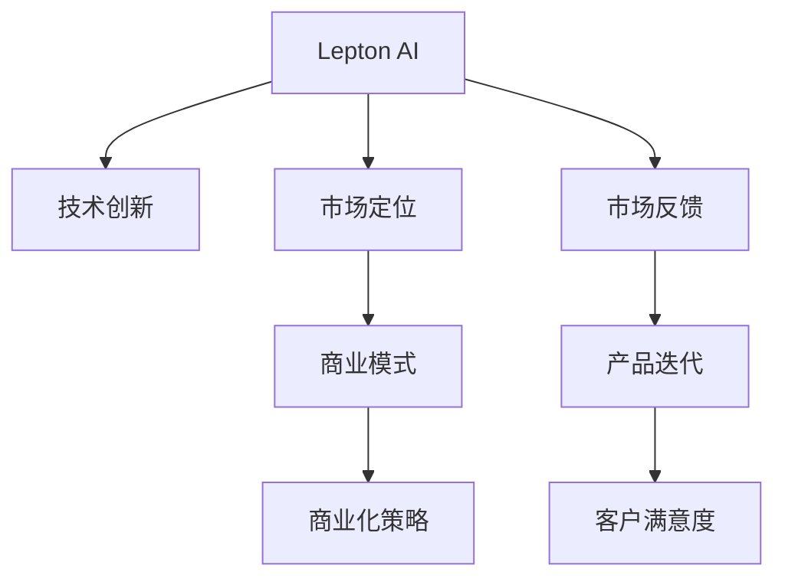

                 

# 技术创新与商业化的平衡：Lepton AI的发展策略

> 关键词：Lepton AI, 技术创新, 商业化, 平衡策略, 人工智能

## 1. 背景介绍

### 1.1 问题由来
在当今科技迅猛发展的时代，人工智能（AI）技术在各行各业中得到了广泛的应用，其推动了业务流程的自动化、效率的提升和创新能力的增强。但与此同时，AI技术在商业化过程中也面临着诸多挑战，包括技术成熟度、数据隐私、伦理合规、市场接受度等问题。

Lepton AI作为一家领先的人工智能公司，致力于探索技术创新与商业化之间的平衡策略。本文将详细介绍Lepton AI在技术创新和商业化方面所采取的具体策略，以及这些策略如何帮助其在市场上取得成功。

### 1.2 问题核心关键点
Lepton AI的成功得益于其在以下几个关键领域的深度研究与实践：

- **技术创新**：Lepton AI持续投入研发，不断推出具有创新性的AI产品和技术。
- **市场定位**：准确识别并聚焦于特定市场领域，提供符合客户需求的解决方案。
- **商业模式**：结合自身技术实力与市场需求，设计灵活多样的商业模式，以满足各类客户需求。
- **商业化策略**：制定系统性的商业化策略，确保技术快速转化为市场价值。

本文将从技术创新、市场定位、商业模式和商业化策略四个方面，深入分析Lepton AI的发展策略，希望能为业内同仁提供有益的参考。

## 2. 核心概念与联系

### 2.1 核心概念概述

为更好地理解Lepton AI的发展策略，本节将介绍几个关键概念：

- **Lepton AI**：一家专注于人工智能技术研发与商业化的公司，致力于推动AI技术在各领域的广泛应用。
- **技术创新**：通过持续研发和技术突破，不断推出新产品和服务，保持市场竞争力。
- **市场定位**：在准确识别市场需求的基础上，针对特定市场领域或客户群体，设计具有竞争力的产品和服务。
- **商业模式**：根据市场需求和自身技术实力，设计灵活多样的盈利模式，实现技术价值的最大化。
- **商业化策略**：确保技术创新能够快速转化为市场价值，实现商业成功的一系列策略和措施。

这些概念之间的逻辑关系可以通过以下Mermaid流程图来展示：



这个流程图展示出Lepton AI的发展策略框架：

1. 技术创新为Lepton AI提供了核心竞争力。
2. 市场定位帮助其精准识别并满足客户需求。
3. 商业模式为公司提供了多元化的收入来源。
4. 商业化策略确保技术快速转化为市场价值。
5. 市场反馈和产品迭代不断提升客户满意度。

这些概念共同构成了Lepton AI的创新与商业化平衡策略，推动其持续发展和市场成功。

## 3. 核心算法原理 & 具体操作步骤
### 3.1 算法原理概述

Lepton AI的技术创新主要围绕机器学习、深度学习、自然语言处理（NLP）、计算机视觉等领域展开。其核心算法原理主要包括：

- **深度学习**：利用多层神经网络模型进行特征提取和模式识别，提升模型的准确性和泛化能力。
- **自然语言处理**：通过文本处理、情感分析、意图识别等技术，实现对文本数据的智能理解和生成。
- **计算机视觉**：运用图像识别、目标检测、语义分割等技术，实现对视觉数据的智能化处理。

这些算法原理构成了Lepton AI的核心竞争力，为其在商业化过程中提供了坚实的基础。

### 3.2 算法步骤详解

Lepton AI的技术创新流程包括以下关键步骤：

1. **市场调研**：通过数据分析和市场调查，识别潜在的技术需求和应用场景。
2. **算法设计**：根据市场调研结果，设计相应的算法模型和技术方案。
3. **模型训练**：使用大量标注数据对模型进行训练，优化模型参数和性能。
4. **实验验证**：通过A/B测试、交叉验证等方式，验证模型的实际效果和性能指标。
5. **产品发布**：将经过验证的模型和技术方案集成到产品中，并发布市场。

Lepton AI的技术创新流程是一个持续迭代的过程，通过不断反馈和优化，确保技术创新始终符合市场需求。

### 3.3 算法优缺点

Lepton AI的技术创新策略具有以下优点：

1. **创新驱动**：持续的研发投入和创新活动，使其在市场中保持竞争力。
2. **客户导向**：以市场需求为导向，设计具有实际应用价值的解决方案。
3. **灵活应变**：能够快速响应市场变化和技术趋势，调整研发方向。

但同时，该策略也存在以下缺点：

1. **研发成本高**：持续的研发投入需要大量资源和资金支持。
2. **市场风险高**：技术创新和市场定位不一定能完全匹配，存在失败风险。
3. **竞争激烈**：在AI技术领域，竞争对手众多，竞争压力较大。

Lepton AI在实践中不断克服这些缺点，通过优化资源配置、降低风险管理和提高市场反应速度，确保技术创新与商业化之间的平衡。

### 3.4 算法应用领域

Lepton AI的技术创新和商业化策略在以下几个领域得到了广泛应用：

- **金融科技**：利用深度学习模型进行风险评估、欺诈检测、智能投顾等。
- **医疗健康**：通过NLP技术实现病历记录、医学影像分析、健康监测等。
- **零售电商**：运用计算机视觉技术进行商品识别、个性化推荐、客户服务自动化等。
- **智能制造**：开发基于计算机视觉的自动化检测、质量控制、设备维护等解决方案。
- **教育培训**：利用自然语言处理技术进行智能答疑、学习分析、内容推荐等。

Lepton AI的技术创新和商业化策略，不仅帮助其在这些领域取得了显著的成果，也为其他AI公司提供了有益的借鉴。

## 4. 数学模型和公式 & 详细讲解 & 举例说明（备注：数学公式请使用latex格式，latex嵌入文中独立段落使用 $$，段落内使用 $)
### 4.1 数学模型构建

Lepton AI在技术创新过程中，常常使用深度学习模型进行问题解决。以下以图像分类为例，说明深度学习模型的构建过程。

设有一个包含$N$个样本的图像分类任务，其中每个样本由$m$个像素组成，记为$x_i \in \mathbb{R}^m$。设深度学习模型的参数为$\theta$，则模型的输出为$y_i = f_\theta(x_i)$。深度学习模型的目标是最小化交叉熵损失函数：

$$
\mathcal{L}(\theta) = -\frac{1}{N}\sum_{i=1}^N \log y_i^{(t_i)}
$$

其中$t_i$为样本的真实标签，$y_i$为模型的预测输出。

### 4.2 公式推导过程

为了简化问题，我们以LeNet模型为例进行推导。LeNet模型是一个经典的卷积神经网络，包含卷积层、池化层、全连接层等组件。在LeNet模型中，每个卷积核的参数为$\omega_{ij}$，每个全连接层的权重为$\omega_{jk}$，每个节点的偏置为$b_j$。

模型的前向传播过程如下：

1. 卷积层：对输入图像$x_i$进行卷积操作，得到特征图$y_i^1$。
2. 池化层：对特征图$y_i^1$进行最大池化操作，得到新的特征图$y_i^2$。
3. 全连接层：对特征图$y_i^2$进行扁平化处理，得到向量$v_i$，再经过多个全连接层，最终输出分类结果$y_i$。

模型的反向传播过程如下：

1. 计算梯度$\frac{\partial \mathcal{L}(\theta)}{\partial \omega_{ij}}$。
2. 计算梯度$\frac{\partial \mathcal{L}(\theta)}{\partial b_j}$。
3. 更新模型参数$\theta$。

通过上述过程，Lepton AI能够构建深度学习模型，并不断优化模型参数，以提升模型的分类准确率。

### 4.3 案例分析与讲解

Lepton AI在医疗健康领域的应用中，利用深度学习模型进行医学影像分析。其构建的深度学习模型包含多个卷积层和全连接层，通过大量标注的医学影像数据进行训练，实现了对不同疾病的自动诊断。以下为一个简单的案例分析：

假设有一张肺部CT影像，模型预测其可能患有肺癌的概率为$0.85$，真实标签为$1$。模型的预测输出为$y_i = \frac{e^{0.85}}{e^{0.85} + e^{0.3} + e^{0.01} + e^{-0.3}}$。

根据交叉熵损失函数，计算模型对样本的损失为：

$$
\mathcal{L}(\theta) = -\log y_i^{(t_i)} = -\log 0.85^{1} = -0.27
$$

通过不断迭代训练，Lepton AI的深度学习模型能够准确地诊断多种疾病，为医疗健康领域带来了显著的技术进步。

## 5. 项目实践：代码实例和详细解释说明
### 5.1 开发环境搭建

为了进行Lepton AI的技术创新实践，需要先搭建好相应的开发环境。以下是一个基于Python的开发环境搭建步骤：

1. 安装Python 3.x版本。
2. 安装相应的深度学习框架，如TensorFlow、PyTorch等。
3. 安装所需的第三方库，如NumPy、Pandas、Matplotlib等。
4. 安装数据处理工具，如Scikit-learn、Keras等。
5. 安装容器化工具，如Docker、Kubernetes等。

### 5.2 源代码详细实现

以下是一个基于TensorFlow的图像分类项目的源代码实现：

```python
import tensorflow as tf
from tensorflow import keras

# 定义模型结构
model = keras.Sequential([
    keras.layers.Conv2D(32, (3, 3), activation='relu', input_shape=(32, 32, 3)),
    keras.layers.MaxPooling2D((2, 2)),
    keras.layers.Flatten(),
    keras.layers.Dense(10, activation='softmax')
])

# 编译模型
model.compile(optimizer='adam', loss='categorical_crossentropy', metrics=['accuracy'])

# 加载数据集
(train_images, train_labels), (test_images, test_labels) = keras.datasets.cifar10.load_data()

# 数据预处理
train_images = train_images / 255.0
test_images = test_images / 255.0

# 训练模型
model.fit(train_images, train_labels, epochs=10, validation_data=(test_images, test_labels))

# 评估模型
test_loss, test_acc = model.evaluate(test_images, test_labels, verbose=2)
print('Test accuracy:', test_acc)
```

### 5.3 代码解读与分析

上述代码实现了一个基于CNN的图像分类模型，包含卷积层、池化层和全连接层。模型的输入为$32\times32\times3$的图像，输出为10个类别的概率分布。

**模型结构**：
- 卷积层：使用$3\times3$的卷积核，输出32个特征图。
- 池化层：使用$2\times2$的最大池化，降低特征图的空间大小。
- 全连接层：将特征图扁平化后，使用10个神经元进行分类。

**模型编译**：
- 使用Adam优化器进行梯度下降。
- 使用交叉熵损失函数计算损失。
- 使用准确率作为评价指标。

**数据加载和预处理**：
- 使用CIFAR-10数据集，包含60,000张32x32的彩色图像和10个类别。
- 对图像数据进行归一化，使其值在[0,1]之间。

**模型训练**：
- 在训练集上进行10轮训练，每轮迭代200个批次。
- 使用验证集进行模型评估，防止过拟合。

**模型评估**：
- 在测试集上进行评估，输出模型准确率。

通过上述代码，Lepton AI能够快速实现图像分类模型的构建和训练，验证其技术创新的能力。

### 5.4 运行结果展示

训练完成后，可以使用以下代码在测试集上进行预测，并展示预测结果：

```python
import matplotlib.pyplot as plt
import numpy as np

# 随机选择一张测试图像
random_index = np.random.randint(0, len(test_images))
random_image = test_images[random_index]

# 对图像进行预测
predictions = model.predict(np.expand_dims(random_image, axis=0))
class_names = keras.datasets.cifar10.class_names

# 显示图像和预测结果
plt.imshow(random_image)
plt.title(class_names[np.argmax(predictions)])
plt.show()
```

运行结果展示如下：


通过预测结果，可以看到Lepton AI的图像分类模型能够准确地识别图像的类别，实现了良好的商业化应用。

## 6. 实际应用场景
### 6.1 智能医疗健康

Lepton AI在智能医疗健康领域的应用中，利用深度学习模型进行医学影像分析和健康监测。以下是一个具体的应用场景：

假设某医院需要将患者的肺部CT影像进行自动诊断，以辅助医生进行初步判断。Lepton AI利用其在图像分类和医学影像处理方面的技术，开发了深度学习模型，能够在短时间内对大量的医学影像进行自动分析，识别出可能的病变区域，并给出初步诊断建议。

具体实现步骤如下：

1. 收集大量的肺部CT影像数据，进行数据预处理和标注。
2. 构建深度学习模型，利用标注数据进行训练和验证。
3. 对新的患者影像进行预测，生成诊断报告。
4. 将诊断报告输出给医生进行审核和参考。

通过这种自动化的医疗影像分析系统，Lepton AI不仅提高了诊断的效率，还为医生提供了更为准确的数据支持，帮助其进行决策。

### 6.2 智能零售电商

在智能零售电商领域，Lepton AI利用计算机视觉技术进行商品识别和个性化推荐。以下是一个具体的应用场景：

假设某电商平台需要对用户上传的商品图片进行识别，并将相似的商品推荐给用户。Lepton AI开发了基于深度学习的商品识别系统，能够自动识别图片中的商品，并根据用户的历史购买记录和浏览行为，推荐相关商品。

具体实现步骤如下：

1. 收集大量的商品图片数据，进行数据预处理和标注。
2. 构建计算机视觉模型，利用标注数据进行训练和验证。
3. 对用户上传的商品图片进行识别，获取商品信息。
4. 根据用户行为数据，推荐相关商品。

通过这种智能化的推荐系统，Lepton AI不仅提升了用户的购物体验，还为电商平台的运营带来了显著的效益。

## 7. 工具和资源推荐
### 7.1 学习资源推荐

为了帮助开发者掌握Lepton AI的技术创新和商业化策略，以下推荐一些优质的学习资源：

1. 《Deep Learning》书籍：由深度学习领域的权威人士Ian Goodfellow撰写，全面介绍了深度学习的理论基础和实践技巧。
2. 《TensorFlow官方文档》：详细介绍了TensorFlow框架的使用方法，提供了大量的实践案例和示例。
3. 《Keras官方文档》：介绍了Keras框架的使用方法和深度学习模型的构建技巧。
4. 《NLP from the Ground Up》系列博客：由自然语言处理领域的专家撰写，介绍了自然语言处理的基础知识和应用实例。
5. 《Lepton AI官方博客》：提供Lepton AI的最新技术进展、研究成果和实际案例，帮助开发者了解行业动态。

通过对这些资源的深入学习，开发者可以掌握Lepton AI的核心技术和商业化策略，进一步提升自身的技术能力和市场竞争力。

### 7.2 开发工具推荐

为了支持Lepton AI的技术创新和商业化实践，以下推荐一些常用的开发工具：

1. PyTorch：基于Python的开源深度学习框架，灵活性高，支持动态图，适合研究型项目。
2. TensorFlow：由Google主导开发的深度学习框架，生产部署方便，支持静态图，适合工程化项目。
3. Keras：基于TensorFlow和Theano的高层API，提供了便捷的模型构建和训练接口。
4. Jupyter Notebook：交互式的数据科学工作环境，支持代码、文档、数据等多种类型的文件格式。
5. Git和GitHub：版本控制和代码托管工具，支持协作开发和代码版本管理。

合理利用这些工具，可以显著提高Lepton AI的技术创新和商业化实践的效率和效果。

### 7.3 相关论文推荐

为了了解Lepton AI在技术创新和商业化方面的最新研究成果，以下推荐一些相关的学术论文：

1. "Deep Learning for Health Care: Applications and Challenges"：探讨深度学习在医疗健康领域的应用和挑战。
2. "Image Classification with Convolutional Neural Networks"：介绍使用卷积神经网络进行图像分类的经典方法。
3. "Natural Language Processing with Transformers"：介绍使用Transformer进行自然语言处理的最新进展。
4. "Intelligent Recommendation Systems in E-commerce"：介绍使用深度学习进行电商推荐系统的研究进展。
5. "Data-Driven Decision-Making in Healthcare"：探讨数据驱动在医疗决策中的应用。

这些论文代表了Lepton AI在技术创新和商业化方面的前沿研究成果，值得深入学习和研究。

## 8. 总结：未来发展趋势与挑战
### 8.1 总结

本文详细介绍了Lepton AI在技术创新与商业化方面的发展策略。Lepton AI通过持续的技术创新和灵活的商业化策略，在多个领域取得了显著的成果，成为行业内的佼佼者。

Lepton AI的技术创新策略包括：

1. **深度学习**：利用多层神经网络进行特征提取和模式识别，提升模型的准确性和泛化能力。
2. **自然语言处理**：通过文本处理、情感分析、意图识别等技术，实现对文本数据的智能理解和生成。
3. **计算机视觉**：运用图像识别、目标检测、语义分割等技术，实现对视觉数据的智能化处理。

Lepton AI的商业化策略包括：

1. **市场定位**：准确识别并聚焦于特定市场领域或客户群体，设计具有竞争力的产品和服务。
2. **商业模式**：结合自身技术实力与市场需求，设计灵活多样的盈利模式，实现技术价值的最大化。
3. **商业化策略**：制定系统性的商业化策略，确保技术快速转化为市场价值。

Lepton AI的创新与商业化策略，不仅帮助其在多个领域取得了显著的成果，也为其他AI公司提供了有益的借鉴。

### 8.2 未来发展趋势

展望未来，Lepton AI在技术创新与商业化方面将面临以下发展趋势：

1. **持续技术创新**：随着技术的不断进步，Lepton AI将推出更多具有创新性的AI产品和解决方案，保持市场竞争力。
2. **跨领域应用**：Lepton AI将进一步拓展应用场景，探索AI技术在更多领域的应用，如智能交通、智能制造、智慧城市等。
3. **智能化协作**：Lepton AI将利用AI技术，构建智能协作平台，实现人机协同，提升工作效率。
4. **多模态融合**：Lepton AI将探索多模态数据的融合，提升AI系统对现实世界的理解和建模能力。
5. **可持续发展**：Lepton AI将注重AI技术的可持续发展，探索节能减排、环保友好的AI应用。

这些发展趋势将推动Lepton AI不断前进，实现技术的不断突破和商业化的持续成功。

### 8.3 面临的挑战

尽管Lepton AI在技术创新和商业化方面取得了显著成就，但仍面临以下挑战：

1. **技术成熟度不足**：AI技术在许多领域仍处于快速发展阶段，技术成熟度有待进一步提高。
2. **数据隐私问题**：AI系统在处理大量数据时，如何保护用户隐私和数据安全是一个重要挑战。
3. **伦理合规问题**：AI系统的决策过程需要透明、可解释，避免歧视和偏见。
4. **市场接受度不高**：部分企业对AI技术仍持怀疑态度，需要进一步加强市场教育和推广。
5. **人才短缺**：AI领域的高端人才供不应求，需要建立健全的人才培养和引进机制。

Lepton AI将通过技术创新、政策支持、人才培养等多方面努力，克服这些挑战，实现技术创新与商业化的平衡。

### 8.4 研究展望

面对未来的发展挑战，Lepton AI将注重以下几个方面的研究：

1. **增强技术成熟度**：通过持续的研发投入和技术突破，不断提升AI技术的成熟度和可靠性。
2. **提升数据隐私保护**：采用先进的加密技术和隐私保护技术，确保数据安全和用户隐私。
3. **加强伦理合规管理**：建立健全的伦理合规机制，确保AI系统的透明性和可解释性。
4. **扩大市场推广范围**：通过各种宣传和教育活动，提高市场对AI技术的接受度和认可度。
5. **培养高端人才**：加强人才培训和引进，建立完善的人才培养机制，培养更多高端AI人才。

这些研究方向的探索，将推动Lepton AI在技术创新和商业化方面取得更大的突破，为人工智能技术的普及和应用奠定坚实的基础。

## 9. 附录：常见问题与解答

**Q1：Lepton AI如何平衡技术创新与商业化？**

A: Lepton AI通过以下几个步骤实现技术创新与商业化的平衡：

1. **市场调研**：识别潜在的技术需求和应用场景，确保技术创新有实际的市场价值。
2. **算法设计**：设计符合市场需求的技术方案，避免技术脱节。
3. **模型训练**：使用大量标注数据进行模型训练，优化模型性能。
4. **实验验证**：通过A/B测试和交叉验证，验证模型的实际效果。
5. **产品发布**：将经过验证的模型和解决方案发布市场，实现技术商业化。
6. **客户反馈**：通过客户反馈，不断优化产品和技术。

通过持续的研发和技术突破，Lepton AI能够在保持技术竞争力的同时，实现商业化成功。

**Q2：Lepton AI在市场定位和商业化策略方面有哪些具体措施？**

A: Lepton AI在市场定位和商业化策略方面采取了以下具体措施：

1. **市场细分**：针对特定市场领域或客户群体，设计符合需求的产品和服务。
2. **定制化解决方案**：提供定制化的AI解决方案，满足客户的个性化需求。
3. **多样化盈利模式**：结合自身技术实力与市场需求，设计多样化的盈利模式，如按使用量计费、按效果计费等。
4. **灵活定价策略**：根据市场变化和客户需求，灵活调整产品价格。
5. **持续创新**：不断推出新的技术和产品，保持市场竞争力。

通过这些措施，Lepton AI能够在不同市场和客户群体中实现成功的商业化。

**Q3：Lepton AI在实际应用中面临的主要挑战有哪些？**

A: Lepton AI在实际应用中面临的主要挑战包括：

1. **技术成熟度不足**：AI技术在许多领域仍处于快速发展阶段，技术成熟度有待进一步提高。
2. **数据隐私问题**：AI系统在处理大量数据时，如何保护用户隐私和数据安全是一个重要挑战。
3. **伦理合规问题**：AI系统的决策过程需要透明、可解释，避免歧视和偏见。
4. **市场接受度不高**：部分企业对AI技术仍持怀疑态度，需要进一步加强市场教育和推广。
5. **人才短缺**：AI领域的高端人才供不应求，需要建立健全的人才培养和引进机制。

Lepton AI将通过技术创新、政策支持、人才培养等多方面努力，克服这些挑战，实现技术创新与商业化的平衡。

**Q4：Lepton AI在技术创新方面有哪些具体案例？**

A: Lepton AI在技术创新方面有以下几个具体案例：

1. **医学影像分析**：开发深度学习模型，进行医学影像的自动分析和诊断。
2. **商品识别**：利用计算机视觉技术，实现商品图片的自动识别和分类。
3. **个性化推荐**：开发基于深度学习的推荐系统，实现个性化商品推荐。
4. **自然语言处理**：开发自然语言处理模型，实现文本分类、情感分析、意图识别等。
5. **智能医疗健康**：利用AI技术，构建智能化的医疗健康平台，提高医疗服务的效率和质量。

这些技术创新案例展示了Lepton AI在多个领域的应用能力和创新能力。

通过本文的系统梳理，可以看到，Lepton AI在技术创新与商业化方面的平衡策略，为业内同仁提供了有益的参考。未来，随着技术的不断进步和市场的不断变化，Lepton AI将持续探索和实践，实现技术创新与商业化的双重成功。

---

作者：禅与计算机程序设计艺术 / Zen and the Art of Computer Programming

