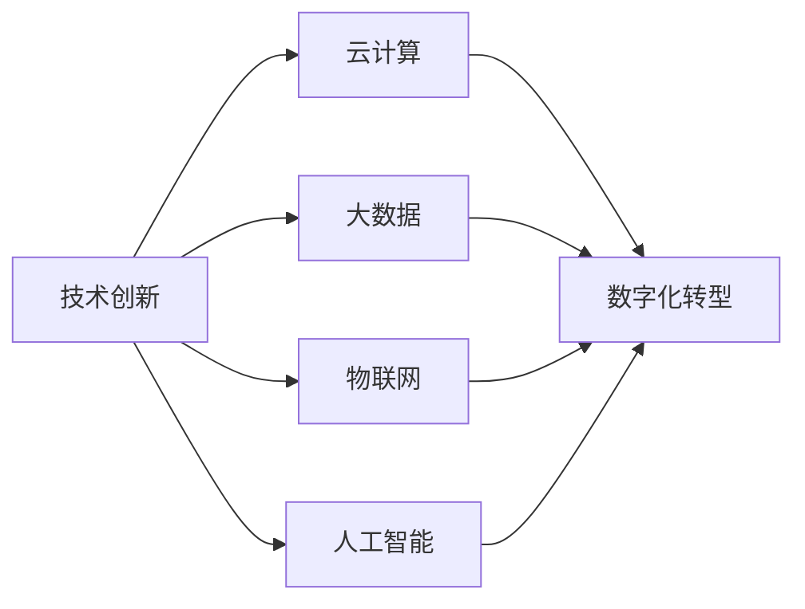

                 

# 技术创新与数字化转型的结合

在快速发展的数字化时代，技术创新与数字化转型已成为驱动经济社会发展的重要引擎。本文将深入探讨这两者的结合，分析其背后的逻辑、实现路径及未来趋势，旨在为相关领域的实践者提供全面而深刻的见解。

## 1. 背景介绍

### 1.1 问题由来

随着互联网和人工智能技术的不断进步，企业和社会对数字化转型的需求日益增加。数字化转型不仅能够提升企业的运营效率和市场竞争力，还能为社会带来诸多利好，如提高生活质量、促进资源优化配置等。然而，数字化转型并非一蹴而就的过程，需要结合技术创新才能实现全面升级。

### 1.2 问题核心关键点

数字化转型的核心在于通过技术创新，实现数据、流程、业务的全面数字化。其中，技术创新包括云计算、大数据、物联网、人工智能等新兴技术的融合应用，而数字化转型则涉及企业组织架构、管理流程、企业文化等深层次变革。两者的结合，能够相互促进，实现企业和社会的双赢。

## 2. 核心概念与联系

### 2.1 核心概念概述

- **技术创新**：指通过引入新理念、新技术、新方法，推动产品和服务的升级换代，满足用户不断变化的需求。

- **数字化转型**：指通过数字化手段重塑企业运营模式和业务流程，提升效率和竞争力。

- **云计算**：指通过互联网提供按需的计算服务，包括存储、网络、计算等资源，支持企业灵活扩展。

- **大数据**：指通过处理海量数据，发现隐藏在其中的有价值信息和模式，支持决策和优化。

- **物联网**：指通过互联网将物理设备连接起来，实现设备间的信息互通和自动控制。

- **人工智能**：指通过机器学习、深度学习等技术，赋予机器类似于人类的感知、理解和决策能力。

这些核心概念之间存在紧密联系，通过技术创新推动数字化转型，实现企业和社会的多方面进步。

### 2.2 核心概念原理和架构的 Mermaid 流程图



这个流程图展示了技术创新与数字化转型的内在联系。技术创新为数字化转型提供动力，而数字化转型又为技术创新提供了应用场景，两者相辅相成，共同推动企业和社会的发展。

## 3. 核心算法原理 & 具体操作步骤

### 3.1 算法原理概述

技术创新与数字化转型的结合，本质上是通过技术手段，实现数据驱动的业务优化和升级。其核心算法包括云计算、大数据、物联网、人工智能等技术的融合应用，旨在构建一个数据驱动、智能化的企业生态系统。

### 3.2 算法步骤详解

1. **数据收集与存储**：利用物联网和云计算技术，收集企业内外部的海量数据，并通过云计算平台进行存储和管理。

2. **数据处理与分析**：运用大数据技术，对收集的数据进行清洗、处理和分析，提取有用的信息和模式。

3. **业务优化与创新**：结合人工智能技术，进行数据分析和模型训练，发现新的业务模式和创新点，支持企业运营决策。

4. **应用落地与评估**：将优化后的业务模型应用到实际运营中，并通过反馈机制不断优化和评估，确保数字化转型的持续进步。

### 3.3 算法优缺点

**优点**：
- 数据驱动：通过大数据和人工智能技术，能够深入挖掘数据中的价值，支持科学决策。
- 高效灵活：云计算和物联网技术提供了灵活的计算资源和设备管理，能够快速响应市场变化。
- 持续改进：通过反馈机制，持续优化和评估，实现数字化转型的不断进步。

**缺点**：
- 数据质量：数据的不完整、不准确可能导致分析结果的偏差。
- 技术门槛：对技术创新和数字化转型的理解和应用，需要较高的专业知识和经验。
- 投资回报周期长：数字化转型涉及的软硬件设备、人力和技术投入较大，回报周期较长。

### 3.4 算法应用领域

技术创新与数字化转型在多个领域得到了广泛应用，包括但不限于以下几个方面：

- **制造业**：通过物联网和人工智能技术，实现智能制造、质量检测和生产优化。
- **零售业**：利用大数据和人工智能技术，进行需求预测、库存管理和个性化推荐。
- **金融业**：结合云计算和大数据技术，进行风险控制、客户服务和金融创新。
- **医疗健康**：运用物联网和人工智能技术，进行健康监测、疾病预测和精准医疗。

## 4. 数学模型和公式 & 详细讲解 & 举例说明

### 4.1 数学模型构建

技术创新与数字化转型的结合，可以通过数学模型来描述和优化。我们以制造业为例，构建一个简单的数学模型来展示其应用。

假设某制造业企业的目标是最大化利润，设其产品价格为 $P$，产量为 $Q$，成本为 $C$，市场需求函数为 $D(Q)$，则利润函数为：

$$
\text{Profit} = P \times Q - C(Q)
$$

市场需求函数和成本函数可以通过大数据分析得到，而产品价格 $P$ 则需要通过人工智能模型进行优化，以最大化利润。

### 4.2 公式推导过程

在上述模型的基础上，我们可以进一步推导出最优化的利润函数：

$$
\text{Max Profit} = \max_{Q,P} \left(P \times Q - C(Q)\right)
$$

其中 $C(Q)$ 为成本函数，$D(Q)$ 为市场需求函数。

### 4.3 案例分析与讲解

以某电子产品制造企业为例，其市场需求函数 $D(Q)$ 和成本函数 $C(Q)$ 可以通过历史销售数据和生产数据进行分析得到。然后，利用深度学习模型对价格 $P$ 进行预测和优化，以最大化企业的利润。

假设企业采用了基于深度神经网络的预测模型，输入数据为历史销售价格、市场趋势等，输出数据为预测的价格 $P$。通过优化模型的参数，企业可以实时调整产品价格，以应对市场变化和竞争压力，从而最大化利润。

## 5. 项目实践：代码实例和详细解释说明

### 5.1 开发环境搭建

在进行项目实践前，需要先搭建好开发环境。以下是使用Python进行Keras开发的环境配置流程：

1. 安装Anaconda：从官网下载并安装Anaconda，用于创建独立的Python环境。

2. 创建并激活虚拟环境：
```bash
conda create -n pyenv python=3.8 
conda activate pyenv
```

3. 安装Keras和TensorFlow：
```bash
pip install keras tensorflow
```

4. 安装NumPy、Pandas、Scikit-Learn等辅助工具包：
```bash
pip install numpy pandas scikit-learn
```

完成上述步骤后，即可在`pyenv`环境中开始项目实践。

### 5.2 源代码详细实现

下面以预测产品价格为例，给出使用Keras实现的技术创新与数字化转型应用。

首先，准备数据集，包括历史销售价格、市场趋势、消费者偏好等数据。

```python
import pandas as pd

# 读取数据集
data = pd.read_csv('sales_data.csv')

# 数据预处理
data['price'] = data['price'].astype(float)
data['trend'] = data['trend'].astype(int)
data['preference'] = data['preference'].astype(int)

# 数据划分
train_data = data.iloc[:800, :]
test_data = data.iloc[800:, :]
```

然后，定义模型和编译器：

```python
from keras.models import Sequential
from keras.layers import Dense

# 定义模型
model = Sequential([
    Dense(64, input_dim=3, activation='relu'),
    Dense(32, activation='relu'),
    Dense(1)
])

# 编译模型
model.compile(loss='mean_squared_error', optimizer='adam')
```

接着，训练模型并评估：

```python
# 训练模型
model.fit(train_data[['trend', 'preference', 'price']], train_data['price'], epochs=100, batch_size=32, verbose=1)

# 评估模型
test_loss = model.evaluate(test_data[['trend', 'preference', 'price']], test_data['price'], verbose=0)
print(f'Test loss: {test_loss:.4f}')
```

以上就是使用Keras进行技术创新与数字化转型应用的完整代码实现。可以看到，Keras提供了简洁高效的深度学习框架，可以快速实现复杂的数据分析和模型训练。

### 5.3 代码解读与分析

让我们再详细解读一下关键代码的实现细节：

**数据预处理**：
- 将数据集中的价格、市场趋势和消费者偏好转换为模型所需的浮点数格式。
- 将数据集划分为训练集和测试集，以便于模型训练和评估。

**模型定义**：
- 定义一个包含两个隐藏层的全连接神经网络，使用ReLU作为激活函数。
- 最后一层为输出层，用于预测产品价格。

**模型编译**：
- 使用均方误差作为损失函数，Adam作为优化器。

**模型训练与评估**：
- 在训练集上训练模型，设置100个epochs和32个batch大小。
- 在测试集上评估模型，输出平均损失。

可以看到，Keras的封装使得模型训练变得简洁高效，开发者可以专注于模型设计和数据处理等核心逻辑，而不必过多关注底层实现细节。

## 6. 实际应用场景

### 6.1 智能制造

技术创新与数字化转型在智能制造领域具有广阔的应用前景。通过物联网和人工智能技术，可以实现设备间的信息互通和自动化生产，提高生产效率和产品质量。

例如，某制造业企业通过在生产线上部署传感器，实时采集设备状态和生产数据。然后，利用大数据和人工智能技术，对这些数据进行分析，发现设备故障和生产瓶颈，及时进行维护和优化。这样，企业能够大幅提高生产效率，降低生产成本，提升产品质量。

### 6.2 智慧零售

在零售业，技术创新与数字化转型主要体现在供应链优化、客户服务和营销策略等方面。通过大数据和人工智能技术，企业可以更好地了解客户需求，优化库存管理和个性化推荐，提升用户体验和销售额。

例如，某电商平台通过分析用户的历史浏览和购买记录，利用深度学习模型进行需求预测和个性化推荐，提升了用户粘性和销售额。同时，通过物联网技术，实时监测库存状态，优化供应链管理，减少了库存积压和缺货现象。

### 6.3 金融服务

金融服务行业是技术创新与数字化转型的一个重要领域。通过云计算和大数据技术，企业可以实现风险控制、客户服务和金融创新，提升金融服务的质量和效率。

例如，某银行通过大数据分析，实时监控客户的信用评分和交易行为，利用深度学习模型进行风险评估，有效防范欺诈和信用风险。同时，通过自然语言处理技术，开发智能客服系统，提升客户服务的响应速度和质量。

## 7. 工具和资源推荐

### 7.1 学习资源推荐

为了帮助开发者系统掌握技术创新与数字化转型的理论基础和实践技巧，这里推荐一些优质的学习资源：

1. 《云计算基础》系列博文：由云计算专家撰写，深入浅出地介绍了云计算的原理、应用和最佳实践。

2. 《大数据分析与实践》课程：由知名大学开设的大数据课程，提供丰富的学习资源和案例分析，帮助开发者理解大数据的实际应用。

3. 《物联网技术与应用》书籍：详细介绍物联网的基本概念、技术架构和应用场景，为开发者提供全面的技术指引。

4. 《人工智能基础》书籍：系统介绍了人工智能的基本原理、常用算法和实际应用，帮助开发者掌握人工智能技术。

5. 《数字转型战略与实践》报告：由知名咨询机构发布，分析了数字化转型的现状、趋势和最佳实践，为企业的数字化转型提供参考。

通过对这些资源的学习实践，相信你一定能够快速掌握技术创新与数字化转型的精髓，并用于解决实际的业务问题。

### 7.2 开发工具推荐

高效的开发离不开优秀的工具支持。以下是几款用于技术创新与数字化转型开发的常用工具：

1. Python：作为数据科学和人工智能的主流编程语言，Python提供了丰富的库和框架，支持大数据、深度学习、云计算等技术的应用。

2. Keras：基于TensorFlow和Theano的深度学习框架，提供了简单易用的API，快速实现深度学习模型。

3. Jupyter Notebook：交互式的开发环境，支持Python代码的编写、执行和展示，方便开发者进行数据探索和模型调试。

4. Azure云平台：微软推出的云服务平台，提供了强大的云计算资源和丰富的服务，支持企业在云端部署和管理应用。

5. Hadoop生态系统：用于大数据处理和分析的开源软件框架，提供了分布式计算和存储能力，支持大规模数据处理。

6. Docker：用于容器化技术的开源平台，支持应用在异构环境下的快速部署和运行。

合理利用这些工具，可以显著提升技术创新与数字化转型的开发效率，加快创新迭代的步伐。

### 7.3 相关论文推荐

技术创新与数字化转型的发展源于学界的持续研究。以下是几篇奠基性的相关论文，推荐阅读：

1. Cloud Computing: Concepts, Technology and Architecture：介绍了云计算的原理、架构和应用，分析了云计算对企业数字化转型的影响。

2. Big Data Analytics: The Science of Predictive Data Science：详细介绍了大数据分析的技术和应用，展示了大数据在企业运营中的作用。

3. Internet of Things (IoT)：From Edge to Cloud：介绍了物联网的基本概念、技术架构和应用场景，探讨了物联网对企业数字化转型的贡献。

4. Deep Learning in Finance：分析了深度学习在金融领域的应用，展示了深度学习在风险控制、客户服务等方面的作用。

5. Digital Transformation Strategy and Practice：分析了数字化转型的现状、趋势和最佳实践，提供了企业数字化转型的参考。

这些论文代表了大数据、云计算、物联网、人工智能等技术的最新进展，为技术创新与数字化转型的实践提供了理论支持。

## 8. 总结：未来发展趋势与挑战

### 8.1 总结

本文对技术创新与数字化转型的结合进行了全面系统的介绍。首先阐述了技术创新与数字化转型的研究背景和意义，明确了其对企业和社会发展的重要作用。其次，从原理到实践，详细讲解了技术创新与数字化转型的数学模型和关键步骤，给出了具体的应用示例。同时，本文还探讨了技术创新与数字化转型的实际应用场景，展示了其在制造业、零售业、金融服务等众多领域的应用前景。最后，本文精选了技术创新与数字化转型的各类学习资源，力求为读者提供全方位的技术指引。

通过本文的系统梳理，可以看到，技术创新与数字化转型正成为推动经济社会发展的重要引擎，为企业的运营效率和市场竞争力提供了有力保障。未来，伴随技术的不断进步和应用场景的不断拓展，技术创新与数字化转型的结合将进一步深化，推动更多行业进入智能化的新阶段。

### 8.2 未来发展趋势

展望未来，技术创新与数字化转型的结合将呈现以下几个发展趋势：

1. **深度融合**：技术创新与数字化转型将更加紧密融合，通过技术手段实现数据的全面采集、分析和应用，推动企业的智能化升级。

2. **智能化运营**：企业将更加注重基于数据的运营决策，通过人工智能技术优化业务流程和运营管理，实现运营效率的最大化。

3. **跨领域应用**：技术创新与数字化转型的应用将突破单一行业的限制，在更多领域得到广泛应用，如智慧城市、智慧农业等。

4. **生态系统构建**：企业将构建基于技术的生态系统，实现资源、信息、技术的全面共享和协同，提升整体的竞争力。

5. **可持续性**：技术创新与数字化转型将更加注重可持续性，通过环保技术、绿色能源等手段，实现企业的可持续发展。

这些趋势展示了技术创新与数字化转型的广阔前景，企业需要不断探索和创新，才能跟上时代的步伐。

### 8.3 面临的挑战

尽管技术创新与数字化转型的结合带来了诸多机遇，但也面临着不少挑战：

1. **技术门槛**：技术创新与数字化转型的实现需要较高的技术水平和专业能力，许多企业可能面临技术和人才的瓶颈。

2. **数据安全**：数字化转型过程中，企业需要处理和存储大量敏感数据，数据安全和隐私保护成为重要问题。

3. **投资回报周期长**：数字化转型的投入大、回报周期长，企业需要在资源投入和业务收益之间找到平衡。

4. **组织变革**：技术创新与数字化转型需要企业进行组织架构和流程的变革，这可能引发内部的抵触和冲突。

5. **市场竞争**：随着企业对数字化转型的重视，市场竞争将更加激烈，企业需要具备应对竞争的能力。

6. **技术演进**：技术创新与数字化转型的关键在于技术的持续演进和升级，企业需要不断学习和应用最新的技术。

这些挑战需要通过技术创新、管理和战略等多方面的努力，才能有效克服。

### 8.4 研究展望

未来的研究需要在以下几个方面寻求新的突破：

1. **模型优化**：开发更加高效和精准的模型，提升数据处理和分析的能力，支持更复杂的业务决策。

2. **技术融合**：探索更多新技术与传统技术的融合应用，如区块链、边缘计算等，提升系统的可靠性和安全性。

3. **伦理和隐私**：研究数据隐私保护和伦理约束的方法，确保技术创新与数字化转型的应用符合法律和道德标准。

4. **可持续发展**：探索环保技术在数字化转型中的应用，实现企业的绿色发展和可持续发展。

5. **人工智能伦理**：研究人工智能技术的伦理和道德问题，确保技术创新与数字化转型的应用符合社会价值和伦理标准。

这些研究方向的探索，必将引领技术创新与数字化转型的发展，为构建更加智能、高效、可持续的企业生态系统提供有力支持。

## 9. 附录：常见问题与解答

**Q1：如何选择合适的技术创新与数字化转型的工具和平台？**

A: 选择工具和平台时，需要考虑以下几个因素：
- 企业需求：根据企业的具体需求选择合适的工具和平台，如大数据处理、深度学习、云计算等。
- 技术成熟度：选择成熟稳定的工具和平台，避免技术风险。
- 成本和投入：考虑工具和平台的成本和维护费用，平衡投入和收益。
- 用户体验：选择易于使用和上手的工具和平台，提升开发效率。

**Q2：技术创新与数字化转型的过程中需要注意哪些风险？**

A: 技术创新与数字化转型的过程中需要注意以下风险：
- 数据风险：数据质量、数据安全和隐私保护等问题，需要制定相应的数据治理策略。
- 技术风险：新技术的应用可能导致技术风险，需要做好技术评估和风险控制。
- 组织风险：组织变革可能引发的内部抵触和冲突，需要加强内部沟通和协作。
- 市场风险：市场竞争可能导致资源和市场的过度竞争，需要制定合理的市场策略。
- 战略风险：数字化转型的长期规划和战略目标需要明确，避免短期行为和资源浪费。

**Q3：技术创新与数字化转型的实施过程中如何评估效果？**

A: 技术创新与数字化转型的效果评估需要综合考虑以下几个方面：
- 业务指标：通过关键绩效指标(KPI)评估业务运营的效率和效果。
- 用户反馈：通过用户调查和满意度问卷，收集用户对服务的评价和建议。
- 数据指标：通过数据分析，评估数据处理和应用的效果。
- 技术指标：通过技术指标评估系统的稳定性和可靠性。

**Q4：技术创新与数字化转型的过程中如何处理数据质量问题？**

A: 处理数据质量问题可以从以下几个方面入手：
- 数据清洗：对数据进行清洗和去重，去除无效和重复数据。
- 数据标注：对数据进行标注和标准化，确保数据的准确性和一致性。
- 数据整合：对来自不同源的数据进行整合，保证数据的完整性和全面性。
- 数据监控：建立数据监控机制，实时监控数据质量，及时发现和处理异常数据。

**Q5：如何应对技术创新与数字化转型的持续变化和升级？**

A: 应对技术创新与数字化转型的持续变化和升级，需要从以下几个方面进行：
- 持续学习：加强对新技术的学习和理解，保持技术的领先优势。
- 灵活应对：建立灵活的组织结构和流程，应对技术变化。
- 创新驱动：鼓励技术创新和应用创新，推动企业持续进步。
- 外部合作：与技术供应商和合作伙伴保持紧密合作，共同应对技术挑战。

这些问题的解答，为技术创新与数字化转型的实践提供了全面的指导，帮助企业更好地应对技术创新与数字化转型的挑战。

---

作者：禅与计算机程序设计艺术 / Zen and the Art of Computer Programming

