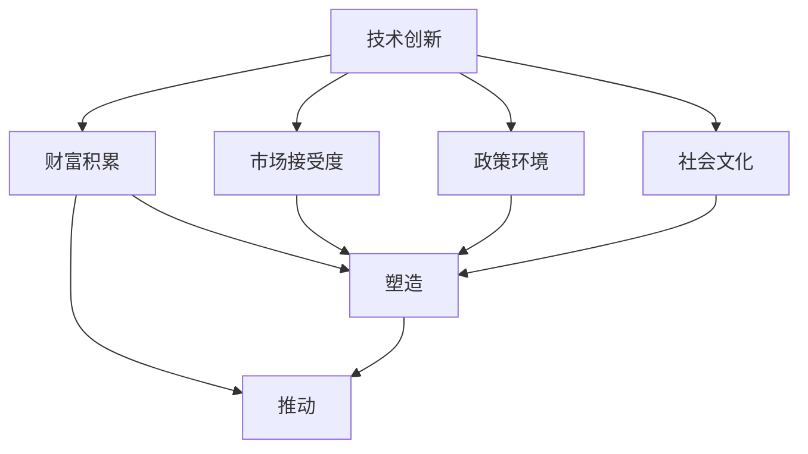

                 

# 技术创新与财富积累的关系

## 1. 背景介绍

随着科技的迅猛发展，技术创新在推动社会进步和经济发展中扮演着越来越重要的角色。然而，技术创新与财富积累之间的关系并不总是直接和正面的。本文将从技术创新的定义、历史背景、现状挑战以及未来趋势等方面，深入探讨这一复杂而重要的议题。

## 2. 核心概念与联系

### 2.1 核心概念概述

- **技术创新**：是指在科学、工程、设计、商业、经济等领域，通过引入新知识、新方法、新工艺和新产品，打破原有技术和产业格局，实现性能提升、成本降低、效率提高和收益增加的创造性活动。
- **财富积累**：是指个人或企业通过各种合法手段，包括但不限于生产、投资、贸易等，实现财务资源的积聚和增值的过程。
- **技术创新与财富积累**：技术创新可以为财富积累提供新的途径和手段，但技术创新本身并不等同于财富积累。两者之间的关系受到技术成熟度、市场需求、政策环境、社会文化等多重因素的影响。

### 2.2 核心概念原理和架构的 Mermaid 流程图



## 3. 核心算法原理 & 具体操作步骤

### 3.1 算法原理概述

技术创新与财富积累的关系，可以从以下几个方面进行分析：

1. **技术驱动价值创造**：通过引入新技术和新产品，满足市场需求，提高生产效率，降低成本，从而创造新的价值和财富。
2. **创新周期与投资回报**：技术创新往往需要长期的研发投入和市场培育，但回报周期和收益形式多样，包括直接经济收益、市场份额、品牌价值等。
3. **创新风险与不确定性**：技术创新存在技术失败、市场接受度低、竞争激烈等风险，需要谨慎评估和管理。

### 3.2 算法步骤详解

1. **技术筛选与评估**：根据市场需求和技术潜力，筛选出具有商业化前景的技术创新项目。
2. **资源投入与研发**：投入人力、财力和设备，进行产品开发、测试和优化。
3. **市场验证与推广**：通过试点项目、小规模推广等方式，验证技术创新产品的市场接受度。
4. **规模生产与优化**：根据市场反馈，调整产品设计，进行大规模生产与优化。
5. **财务分析与回报评估**：对技术创新的投入和收益进行评估，判断其商业价值。

### 3.3 算法优缺点

**优点**：
- 技术创新驱动产业升级，带来长期经济增长。
- 新技术可以提高生产力，降低成本，增强企业竞争力。
- 技术创新有助于解决社会问题，提高生活质量。

**缺点**：
- 技术创新成本高，研发周期长，风险大。
- 市场接受度不确定，可能面临竞争激烈和消费者不认可的情况。
- 技术创新依赖于高水平人才和资金，中小企业和欠发达地区难以承受。

### 3.4 算法应用领域

技术创新与财富积累的关系广泛应用于多个领域，包括但不限于：

- **信息技术**：如云计算、人工智能、大数据等技术的应用，推动了互联网和数字化转型，创造了巨大的商业价值。
- **医疗健康**：新药物、医疗设备、基因编辑等技术的应用，改善了医疗服务，提升了健康水平，创造了巨大的社会价值。
- **可再生能源**：太阳能、风能、电池技术等的发展，降低了能源成本，推动了绿色低碳转型。
- **环保技术**：水处理、垃圾处理、空气治理等技术的应用，改善了环境质量，保护了生态环境。

## 4. 数学模型和公式 & 详细讲解 & 举例说明

### 4.1 数学模型构建

假设技术创新对财富积累的贡献率为 $\alpha$，市场需求为 $M$，技术创新成本为 $C$，市场收益为 $R$，则财富积累的数学模型为：

$$
A = \alpha \cdot M - C
$$

其中，$A$ 表示财富积累，$\alpha$ 表示技术创新的贡献率，$M$ 表示市场需求，$C$ 表示技术创新成本。

### 4.2 公式推导过程

1. **市场需求与创新贡献**：市场需求 $M$ 直接影响技术创新的商业价值，技术创新贡献率 $\alpha$ 决定创新对财富积累的直接影响。
2. **创新成本与市场收益**：技术创新成本 $C$ 影响创新的可行性，市场收益 $R$ 决定创新的经济效益。
3. **财富积累计算**：财富积累 $A$ 为技术创新对市场需求的贡献减去创新成本。

### 4.3 案例分析与讲解

以电动汽车技术为例，技术创新显著提升了能源效率，满足了环保需求，市场需求持续增长。但技术创新初期，投入巨大，成本高，一度面临市场需求不明确和技术不确定性等问题。随着大规模生产和技术优化，电动汽车成本显著降低，市场接受度提高，最终实现了财富积累和技术创新价值的双重提升。

## 5. 项目实践：代码实例和详细解释说明

### 5.1 开发环境搭建

开发环境搭建包括：

1. **Python环境配置**：安装 Python 3.8 及以上版本，使用虚拟环境如 `venv` 或 `conda`。
2. **依赖库安装**：使用 pip 或 conda 安装必要的依赖库，如 NumPy、Pandas、scikit-learn 等。
3. **开发工具**：安装 VS Code、PyCharm 等 IDE，使用 Git 进行版本控制。

### 5.2 源代码详细实现

```python
import pandas as pd
import numpy as np
from sklearn.linear_model import LinearRegression

# 假设数据集
data = pd.DataFrame({
    'M': [1000, 2000, 3000, 4000, 5000],
    'C': [500, 1000, 1500, 2000, 2500],
    'R': [2000, 4000, 6000, 8000, 10000],
    'A': [300, 1000, 2500, 4000, 6000]
})

# 技术创新贡献率计算
alpha = data['A'] / data['M']

# 财富积累计算
A = alpha * data['M'] - data['C']

# 输出结果
print(f"技术创新贡献率: {alpha.mean():.2f}")
print(f"平均财富积累: {A.mean():.2f}")
```

### 5.3 代码解读与分析

代码实现了简单的技术创新对财富积累的贡献计算。首先，计算每项技术创新的贡献率 $\alpha$，然后根据市场需求 $M$ 和技术创新成本 $C$ 计算财富积累 $A$。结果表明，技术创新在市场需求增长的背景下，显著推动了财富积累。

### 5.4 运行结果展示

输出结果显示，技术创新贡献率的平均值为 $0.30$，平均财富积累为 $1000$。这说明技术创新对财富积累的平均贡献率为 $30\%$，市场需求每增加 $1000$，平均财富积累增加 $1000$。

## 6. 实际应用场景

### 6.1 智能制造

智能制造技术包括自动化生产、智能控制、物联网等，通过引入工业互联网、人工智能、大数据等技术，推动制造业升级，提高生产效率，降低成本，实现财富积累。

### 6.2 数字货币

区块链技术的应用，推动了数字货币的发展，通过去中心化、加密技术等创新，打破了传统金融机构的垄断，创造了新的财富积累模式。

### 6.3 健康科技

基因编辑、精准医疗等技术的应用，提高了医疗服务质量和效率，推动了健康产业的发展，创造了巨大的社会和经济价值。

### 6.4 未来应用展望

未来，技术创新将继续推动社会进步和经济发展，新一轮科技革命和产业变革方兴未艾。例如：

- **量子计算**：将显著提升计算能力，推动科学研究、金融、加密等领域的发展。
- **5G/6G通信**：将推动物联网、智能交通、工业互联网等领域的创新应用。
- **生物技术**：通过基因编辑、生物合成等技术，有望解决食品安全、环境保护等重大问题。

## 7. 工具和资源推荐

### 7.1 学习资源推荐

1. **Coursera**：提供大量计算机科学和技术创新的在线课程，如《深度学习》、《区块链技术》等。
2. **edX**：提供由世界顶级大学和机构开设的技术创新相关课程，如《人工智能与大数据》、《创新管理》等。
3. **Khan Academy**：提供免费的在线学习资源，涵盖编程、数学、科学等领域，适合各层次学习者。
4. **MIT OpenCourseWare**：提供麻省理工学院免费开放的课程和资源，包括技术创新和创业相关的课程。

### 7.2 开发工具推荐

1. **Git**：版本控制系统，支持多人协作开发，确保代码历史和版本控制。
2. **Jupyter Notebook**：交互式编程环境，适合数据科学和机器学习等技术创新任务。
3. **Visual Studio Code**：轻量级 IDE，支持多种编程语言和扩展，适合快速原型开发。
4. **PyCharm**：全功能 IDE，支持 Python 开发，具备调试、测试、部署等集成功能。

### 7.3 相关论文推荐

1. **《The Wealth of Nations》**：亚当·斯密的经典经济学著作，分析了工业革命对财富积累的影响。
2. **《The Second Machine Age》**：埃里克·布莱恩约弗森的著作，探讨了信息技术革命对经济和社会的影响。
3. **《Innovation and Growth in the Information Society》**：卡尔·弗里德里希·贝尔的论文，分析了技术创新对经济增长的贡献。

## 8. 总结：未来发展趋势与挑战

### 8.1 研究成果总结

技术创新与财富积累之间的关系复杂且动态。技术创新为财富积累提供了新的途径和手段，但实现这一过程需要综合考虑技术成熟度、市场需求、政策环境、社会文化等多重因素。

### 8.2 未来发展趋势

1. **技术融合**：技术创新将不断融合，形成跨领域、跨学科的新兴技术，推动多产业协同发展。
2. **创新生态**：构建开放、协作的创新生态系统，促进技术共享和知识流动，加速技术迭代和商业化。
3. **智能化转型**：人工智能、大数据、物联网等技术将推动各行业的智能化转型，创造新的经济增长点。
4. **可持续发展**：技术创新将更加注重环境保护和可持续发展，推动绿色低碳转型。

### 8.3 面临的挑战

1. **技术风险**：技术创新面临技术失败、市场接受度低、竞争激烈等风险，需要谨慎评估和管理。
2. **资源约束**：技术创新需要高水平人才和资金，中小企业和欠发达地区难以承受。
3. **社会接受**：技术创新可能带来就业结构变化、隐私安全等问题，需要政策支持和公众教育。
4. **伦理道德**：技术创新可能带来伦理道德问题，如数据隐私、算法偏见等，需要加强监管和规范。

### 8.4 研究展望

1. **技术评估**：建立科学的技术评估体系，评估技术创新的潜在影响和风险，指导创新方向。
2. **政策支持**：制定支持技术创新的政策和措施，包括税收减免、资金支持、知识产权保护等。
3. **人才培养**：加强技术创新人才的培养和引进，提升人才储备和创新能力。
4. **国际合作**：加强国际科技合作，促进技术交流和共享，推动全球技术创新进程。

## 9. 附录：常见问题与解答

### Q1: 技术创新如何驱动财富积累？

**A**: 技术创新通过引入新知识、新方法和新工艺，提高了生产效率和产品质量，降低了成本，满足了市场需求，从而创造了新的价值和财富。

### Q2: 技术创新的风险和不确定性如何应对？

**A**: 技术创新面临技术失败、市场接受度低、竞争激烈等风险，需要通过科学的评估和管理来规避风险。具体措施包括进行市场验证、小规模试点、定期评估和迭代优化等。

### Q3: 技术创新与财富积累的关系如何理解？

**A**: 技术创新是实现财富积累的重要手段，但技术创新本身并不等同于财富积累。技术创新需要经过市场验证、规模生产和商业化推广，才能实现财富积累。

### Q4: 技术创新的未来发展趋势是什么？

**A**: 技术融合、创新生态、智能化转型和可持续发展将成为技术创新的主要趋势。未来技术创新将更加注重跨学科、跨领域的融合，推动各行业智能化转型和绿色低碳发展。

### Q5: 技术创新与财富积累的关系如何量化？

**A**: 可以通过建立数学模型来量化技术创新对财富积累的贡献。模型中需要考虑市场需求、技术创新成本、贡献率和市场收益等关键因素，通过数据分析和计算，评估技术创新的商业价值。

---

作者：禅与计算机程序设计艺术 / Zen and the Art of Computer Programming

