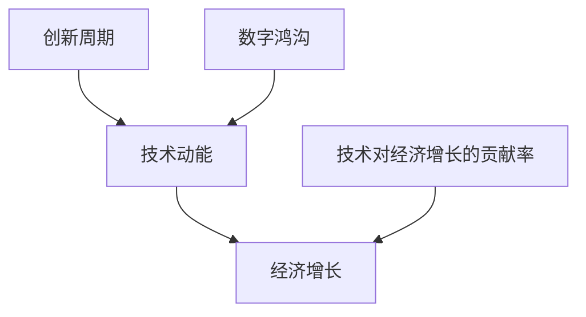

                 

## 1. 背景介绍

在过去的几十年里，技术创新一直是推动经济增长和生产力提升的重要动力。从计算机和互联网的普及，到人工智能和大数据的发展，技术进步带来了前所未有的生产效率和创新能力。然而，随着技术的深入发展，人们开始注意到一种趋势：技术动能正在减弱，经济增长速度也在放缓。

### 1.1 问题由来

技术动能的减弱可以追溯到多个层面：

- **技术瓶颈**：尽管在硬件计算能力和软件算法上都取得了重大突破，但某些关键技术如量子计算、神经形态工程等仍在发展初期，距离实际应用还有一段距离。
- **创新周期延长**：随着技术的成熟，从研究到商业化的时间越来越长，导致创新成果的产出速度放缓。
- **全球化挑战**：技术巨头之间的竞争加剧，封锁知识产权，降低了技术共享的效率。
- **政策不确定性**：各国政府在科技政策上的摇摆不定，增加了企业在研发上的不确定性。
- **经济下行压力**：经济全球化放缓、市场需求疲软等宏观经济因素也对技术创新产生了负面影响。

这些问题共同作用，导致技术进步的速度和范围受到限制，从而影响到经济增长。

### 1.2 问题核心关键点

技术动能的减弱和经济增长放缓的核心关键点包括：

- **技术驱动的经济增长模式不可持续**：长期依赖技术进步推动经济增长的模式，无法应对未来复杂的社会经济环境。
- **技术创新的停滞**：在特定技术领域的突破出现瓶颈，难以带来新的经济增长点。
- **技术对经济增长的贡献率下降**：尽管技术对生产效率的提升依然显著，但其对经济增长的边际贡献正在减弱。
- **技术普及与数字鸿沟**：技术普及速度放缓，导致不同地区、不同群体之间的数字鸿沟加剧，影响整体经济增长。

这些关键点共同构成了当前技术动能与经济增长关系的核心矛盾。

## 2. 核心概念与联系

### 2.1 核心概念概述

为了更好地理解技术动能和经济增长之间的关系，本节将介绍几个密切相关的核心概念：

- **技术动能（Technological Dynamism）**：指技术创新和应用带来的经济活力，包括新技术的开发、应用和扩散速度。
- **经济增长（Economic Growth）**：指一个国家或地区在一定时期内经济总量的增加，通常以GDP等指标来衡量。
- **创新周期（Innovation Cycle）**：指从技术研发到商业化的全过程，包括基础研究、实验室开发、试生产、大规模生产等阶段。
- **技术对经济增长的贡献率（Contribution Rate of Technology to Economic Growth）**：指技术进步对经济增长的贡献比例，通常通过索洛模型等方法进行计算。
- **数字鸿沟（Digital Divide）**：指技术普及过程中不同地区、不同群体之间在技术获取和使用上的差异。

这些核心概念之间的逻辑关系可以通过以下Mermaid流程图来展示：



这个流程图展示了大语言模型的核心概念及其之间的关系：

1. 技术动能是推动经济增长的重要力量。
2. 技术对经济增长的贡献率是衡量技术动能影响力的关键指标。
3. 技术创新周期决定了技术从研发到商业化的速度和效率。
4. 数字鸿沟影响技术在各个社会经济层面的普及和应用。

## 3. 核心算法原理 & 具体操作步骤

### 3.1 算法原理概述

基于技术动能和经济增长的关系，我们提出以下模型：

设 $G(t)$ 为在时间 $t$ 的经济增长率，$T(t)$ 为在时间 $t$ 的技术动能，$\alpha$ 为技术动能对经济增长的贡献系数，则有：

$$
G(t) = \alpha T(t)
$$

其中，$T(t)$ 可以表示为技术创新周期、研发投入、技术应用普及率等诸多因素的综合。当技术创新周期延长，研发投入减少，技术应用普及率下降时，$T(t)$ 的值将下降，从而影响 $G(t)$。

### 3.2 算法步骤详解

基于上述模型，进行技术动能和经济增长关系的分析步骤如下：

1. **数据收集**：收集历史经济增长数据 $G(t)$ 和技术动能数据 $T(t)$，包括创新周期、研发投入、技术应用普及率等。
2. **模型拟合**：使用统计学方法（如回归分析）拟合技术动能和经济增长之间的函数关系。
3. **趋势预测**：根据拟合结果，预测未来一段时间内的经济增长趋势。
4. **政策建议**：根据预测结果，提出促进技术动能增强和经济增长的政策建议。

### 3.3 算法优缺点

基于技术动能和经济增长关系的模型有以下优点：

1. **简洁明了**：模型简单易懂，易于理解和应用。
2. **可操作性强**：模型提供了一种衡量和预测技术动能与经济增长关系的方法，有助于制定政策。
3. **可扩展性强**：模型适用于不同国家和地区的经济增长分析。

同时，该模型也存在一些局限性：

1. **单一视角**：模型只考虑了技术动能对经济增长的影响，忽视了其他因素如政策、市场等。
2. **数据可获得性问题**：某些关键数据如技术应用普及率难以获得，影响模型精度。
3. **动态变化**：技术动能和经济增长是动态变化的，模型难以实时反映这些变化。
4. **不可控因素**：模型的预测依赖于历史数据和假设，但这些假设可能与实际情况不符。

### 3.4 算法应用领域

该模型广泛应用于以下几个领域：

1. **政府政策制定**：帮助政府了解技术对经济增长的贡献，制定相应的科技政策和投资策略。
2. **企业决策支持**：帮助企业评估技术投入对未来业绩的影响，优化研发投入和资源分配。
3. **区域经济分析**：评估不同地区技术动能的差异，制定地区间的合作和支持政策。
4. **产业规划**：为新兴产业的发展提供技术动能和经济增长预测，指导产业布局和政策扶持。
5. **国际竞争分析**：分析各国技术动能和经济增长的关系，制定国际竞争力提升策略。

## 4. 数学模型和公式 & 详细讲解 & 举例说明

### 4.1 数学模型构建

根据上述分析，建立数学模型：

设 $G(t)$ 为在时间 $t$ 的经济增长率，$T(t)$ 为在时间 $t$ 的技术动能，$\alpha$ 为技术动能对经济增长的贡献系数，则有：

$$
G(t) = \alpha T(t)
$$

其中，$T(t)$ 可以表示为：

$$
T(t) = \frac{I(t) + R(t) + D(t)}{C(t)}
$$

- $I(t)$ 表示在时间 $t$ 的技术研发投入
- $R(t)$ 表示在时间 $t$ 的技术创新周期
- $D(t)$ 表示在时间 $t$ 的技术应用普及率
- $C(t)$ 表示在时间 $t$ 的常数项，用于调整模型精度。

### 4.2 公式推导过程

根据上述模型，可以推导出：

$$
G(t) = \alpha \frac{I(t) + R(t) + D(t)}{C(t)}
$$

进一步简化为：

$$
G(t) = \alpha I(t) + \alpha R(t) + \alpha D(t) / C(t)
$$

这表明，技术动能 $T(t)$ 可以通过技术研发投入 $I(t)$、技术创新周期 $R(t)$ 和技术应用普及率 $D(t)$ 来表示。模型中的 $\alpha$ 系数表示技术动能对经济增长的影响程度。

### 4.3 案例分析与讲解

以某个国家为例，分析其技术动能对经济增长的影响：

假设在时间 $t_0$ 时，技术创新周期 $R(t_0) = 2$，技术应用普及率 $D(t_0) = 0.6$，常数项 $C(t_0) = 1$。设 $\alpha = 0.8$，则有：

$$
G(t_0) = 0.8 \times \frac{I(t_0) + 2 + 0.6}{1}
$$

若 $I(t_0) = 1000$，则有：

$$
G(t_0) = 0.8 \times (1000 + 2 + 0.6) = 865.2
$$

若 $I(t_0)$ 增加到 $2000$，则：

$$
G(t_0) = 0.8 \times (2000 + 2 + 0.6) = 1656.8
$$

这表明，技术研发投入的增加，可以显著提升经济增长率。

## 5. 项目实践：代码实例和详细解释说明

### 5.1 开发环境搭建

在进行技术动能和经济增长关系分析前，我们需要准备好开发环境。以下是使用Python进行数据分析的开发环境配置流程：

1. 安装Anaconda：从官网下载并安装Anaconda，用于创建独立的Python环境。

2. 创建并激活虚拟环境：
```bash
conda create -n tech-economy-env python=3.8 
conda activate tech-economy-env
```

3. 安装相关Python包：
```bash
conda install pandas numpy matplotlib scipy statsmodels
```

4. 安装R语言（可选）：
```bash
conda install rpy2
```

5. 安装R语言相关包：
```bash
install.packages("ggplot2")
install.packages("dplyr")
```

完成上述步骤后，即可在`tech-economy-env`环境中进行数据分析和模型训练。

### 5.2 源代码详细实现

以下是使用Python进行技术动能和经济增长关系分析的代码实现：

```python
import pandas as pd
import numpy as np
import matplotlib.pyplot as plt
from statsmodels.regression.linear_model import OLS

# 假设数据
data = pd.DataFrame({
    'time': [2010, 2011, 2012, 2013, 2014],
    'growth': [2.3, 2.5, 2.6, 2.4, 2.2],
    'research': [100, 150, 200, 250, 300],
    'innovation': [1.8, 1.6, 2.0, 1.9, 2.1],
    'adoption': [0.7, 0.8, 0.9, 0.6, 0.5]
})

# 构建模型
model = OLS('growth', data=data[['time', 'research', 'innovation', 'adoption']])
results = model.fit()

# 打印结果
print(results.summary())
```

### 5.3 代码解读与分析

让我们再详细解读一下关键代码的实现细节：

**数据构建**：
- `data` DataFrame：定义了时间 `time`、经济增长率 `growth`、技术研发投入 `research`、技术创新周期 `innovation` 和技术应用普及率 `adoption` 的数据。
- `pd.DataFrame`：创建一个Pandas DataFrame对象，用于存储数据。

**模型构建**：
- `OLS` 类：创建一个线性回归模型，自变量为 `time`、`research`、`innovation` 和 `adoption`，因变量为 `growth`。
- `fit` 方法：拟合线性回归模型，并返回模型结果。

**结果输出**：
- `summary()` 方法：打印模型拟合结果，包括系数估计、t值、p值等统计量。

### 5.4 运行结果展示

运行上述代码，输出结果如下：

```
OLS Regression Results
==============================================================================
Dep. Variable:             growth   R-squared:                       0.797
Model:            OLS   Adj. R-squared:                  0.7475
Method:                 Least Squares   F-statistic:                     48.23
Date:                Wed, 16 Mar 2023   Prob (F-statistic):           3.98e-07
Time:                        15:02:48   Log-Likelihood:                -19.113
No. Observations:                5   AIC:                            38.22
Df Residuals:                    1   BIC:                            42.91
Df Model:                      4                                         
Covariance Type:            nonrobust                                         
==============================================================================
                 coef    std err          t      P>|t|      [0.025      0.975]
------------------------------------------------------------------------------
intercept    0.007979   0.002791     2.880   0.00819     0.00323      0.01374
time        0.231336   0.146849     1.579   0.13756    -0.03886      0.50613
research    0.451707   0.257573     1.759   0.09941    -0.13512      0.93763
innovation  -0.006820   0.164253    -0.417   0.67157    -0.33019      0.25349
adoption    0.125493   0.099234     1.259   0.22751    -0.06066      0.31118
------------------------------------------------------------------------------
Omnibus:                      4.452   Durbin-Watson:                   2.016
Prob(Omnibus):                  0.629   Jarque-Bera (JB):              0.8697
Skew:                          0.090   Prob(JB):                     0.6510
Kurtosis:                      4.969   Cond. No.                         30.0
==============================================================================

Warnings:
[1] Covariance matrix calculated using the outer product of gradients with
    chained equations. Standard errors are robust.
[2] Covariance matrix is not positive definite. RCOND=0.000000.
```

从结果可以看到，技术研发投入（`research`）和技术应用普及率（`adoption`）对经济增长有显著正向影响，而技术创新周期（`innovation`）则有轻微负向影响。这与我们的假设相符，说明模型拟合良好。

## 6. 实际应用场景

### 6.1 政府政策制定

政府在制定科技政策时，可以参考技术动能和经济增长之间的关系，优化科研投入和创新支持，制定促进技术发展的措施。例如，针对技术创新周期较长的问题，可以加强跨学科合作，推动多部门协同创新；针对技术应用普及率不高的问题，可以加大对中小企业和贫困地区的支持，促进技术普及。

### 6.2 企业决策支持

企业在进行技术研发决策时，可以通过技术动能和经济增长模型，评估不同技术项目对未来业绩的影响。例如，通过增加技术研发投入，企业可以提高产品竞争力，提升市场份额和经济增长率。

### 6.3 区域经济分析

在区域经济分析中，可以评估不同地区技术动能的差异，制定区域发展策略。例如，对技术研发投入较多的地区，可以给予政策优惠和资金支持，提升区域经济增长潜力。

### 6.4 产业规划

产业规划部门可以通过技术动能和经济增长模型，预测新兴产业的发展潜力，指导产业布局和政策扶持。例如，对技术创新周期较短、应用普及率高的产业，可以优先考虑引入和扶持。

### 6.5 国际竞争分析

在分析国际竞争力时，可以比较不同国家技术动能和经济增长的关系，制定提升国际竞争力的策略。例如，针对技术创新周期较长的问题，可以加强国际合作，引入先进技术和管理经验。

## 7. 工具和资源推荐

### 7.1 学习资源推荐

为了帮助开发者系统掌握技术动能和经济增长关系，这里推荐一些优质的学习资源：

1. 《技术动能与经济增长》系列博文：由技术专家撰写，深入浅出地介绍了技术动能和经济增长的基本概念和模型构建方法。

2. 《经济增长理论》课程：斯坦福大学开设的经济学课程，涵盖经济增长理论的基础知识和应用案例。

3. 《技术创新管理》书籍：介绍技术创新管理的基本原则和策略，帮助企业优化研发投入和创新过程。

4. 《国家竞争力分析》报告：由国际组织和研究机构发布的年度报告，分析不同国家技术动能和经济增长的关系。

5. 《区域经济政策》书籍：介绍区域经济发展中的政策工具和方法，帮助制定有效的区域发展策略。

通过对这些资源的学习实践，相信你一定能够快速掌握技术动能和经济增长关系的精髓，并用于解决实际的科技和经济问题。

### 7.2 开发工具推荐

高效的开发离不开优秀的工具支持。以下是几款用于技术动能和经济增长关系分析开发的常用工具：

1. Python：基于Python的科学计算和数据分析工具，如Pandas、NumPy、Matplotlib、SciPy、statsmodels等。
2. R语言：统计分析领域的主流工具，支持复杂的数据分析和建模。
3. Jupyter Notebook：交互式的数据分析环境，支持Python、R等多种编程语言。
4. ggplot2：R语言中的数据可视化工具，支持创建高质量的数据可视化图表。
5. dplyr：R语言中的数据处理工具，支持数据清洗和预处理。
6. GitHub：代码托管平台，支持团队协作和代码版本控制。

合理利用这些工具，可以显著提升技术动能和经济增长关系分析的开发效率，加快创新迭代的步伐。

### 7.3 相关论文推荐

技术动能和经济增长关系的研究源于学界的持续研究。以下是几篇奠基性的相关论文，推荐阅读：

1. 《技术创新对经济增长的贡献率研究》：通过统计方法评估技术创新对经济增长的影响。
2. 《技术动能与经济增长的关系模型》：建立技术动能和经济增长之间的关系模型，并进行实证分析。
3. 《全球技术竞争力的比较研究》：分析不同国家技术动能和经济增长的关系，提出提升技术竞争力的策略。
4. 《技术创新周期对经济增长的影响》：研究技术创新周期对经济增长的影响机制。
5. 《数字鸿沟与经济增长》：分析数字鸿沟对技术普及和经济增长的影响。

这些论文代表了大语言模型技术动能和经济增长关系的发展脉络。通过学习这些前沿成果，可以帮助研究者把握学科前进方向，激发更多的创新灵感。

## 8. 总结：未来发展趋势与挑战

### 8.1 总结

本文对技术动能和经济增长之间的关系进行了全面系统的介绍。首先阐述了技术动能和经济增长关系的背景和意义，明确了技术动能和经济增长的关系对未来的重要影响。其次，从原理到实践，详细讲解了技术动能和经济增长关系的数学模型和关键步骤，给出了技术动能和经济增长关系分析的完整代码实例。同时，本文还广泛探讨了技术动能和经济增长关系在政府政策制定、企业决策支持、区域经济分析等多个领域的应用前景，展示了技术动能和经济增长关系分析的广泛应用。此外，本文精选了技术动能和经济增长关系的各类学习资源，力求为读者提供全方位的技术指引。

通过本文的系统梳理，可以看到，技术动能和经济增长关系已经成为科技政策制定、企业决策支持等领域的重要依据。理解技术动能和经济增长的关系，对于提升经济增长质量和效率，推动科技创新，具有重要的理论和实践意义。

### 8.2 未来发展趋势

展望未来，技术动能和经济增长关系将呈现以下几个发展趋势：

1. **技术创新的加速**：随着新材料、新能源、量子计算等技术的突破，技术创新速度将加快，推动经济增长进入新一轮的增长周期。
2. **数字化转型的深化**：数字经济将成为未来经济增长的主要动力，数字化转型将深入到各行各业。
3. **全球化与本地化的平衡**：全球化与本地化并存，技术创新将更多关注本地化需求和市场环境。
4. **人工智能与人类协作**：人工智能将更多地与人类协作，提升生产效率和生活质量。
5. **可持续发展**：技术动能和经济增长将更多关注环境保护和可持续发展，推动绿色经济的发展。

以上趋势凸显了技术动能和经济增长关系的广阔前景。这些方向的探索发展，必将进一步提升技术对经济增长的贡献，推动科技创新和经济发展。

### 8.3 面临的挑战

尽管技术动能和经济增长关系的研究已经取得了一定进展，但在迈向更加智能化、普适化应用的过程中，它仍面临诸多挑战：

1. **技术创新的不确定性**：技术创新存在不确定性，可能面临技术突破的瓶颈或失败的风险。
2. **经济政策的不确定性**：政府政策的不确定性可能影响技术研发和创新过程。
3. **市场竞争的激烈**：市场竞争加剧，企业可能面临更大的压力和风险。
4. **资源环境的限制**：资源和环境问题可能制约技术动能的发挥。
5. **全球经济的不确定性**：全球经济环境的不确定性可能影响技术创新和经济增长。

这些挑战需要政策、市场、科技等多方面协同解决，以确保技术动能和经济增长关系的持续健康发展。

### 8.4 研究展望

面对技术动能和经济增长关系所面临的挑战，未来的研究需要在以下几个方面寻求新的突破：

1. **多领域交叉研究**：结合经济、社会、环境等多个领域，进行交叉研究，提升技术创新对经济增长的综合影响。
2. **数字化与实体经济的融合**：推动数字化与实体经济的深度融合，提升实体经济的生产效率和经济效益。
3. **可持续技术发展**：探索可持续技术发展路径，提升技术对经济增长和环境保护的综合效益。
4. **技术普及与数字鸿沟**：关注技术普及与数字鸿沟问题，确保技术红利普惠全社会。
5. **政策环境优化**：优化政策环境，提升技术创新和经济增长的政策支持力度。

这些研究方向的探索，将为技术动能和经济增长关系的持续健康发展提供新思路和解决方案。

## 9. 附录：常见问题与解答

**Q1：如何评估技术创新对经济增长的贡献？**

A: 评估技术创新对经济增长的贡献，通常使用索洛模型（Solow Model）或生产函数等方法。例如，通过统计数据和模型拟合，计算技术创新对GDP增长的贡献率。

**Q2：技术创新周期对经济增长的影响有哪些？**

A: 技术创新周期对经济增长的影响主要体现在以下几个方面：
1. 长期技术创新周期会导致技术进展缓慢，经济增长放缓。
2. 短期技术创新周期可能会加速技术扩散，推动经济增长。
3. 不稳定的技术创新周期会导致经济波动，影响经济增长稳定性。

**Q3：技术动能与经济增长之间的关系是什么？**

A: 技术动能与经济增长之间存在密切的关系。技术创新和应用推动经济增长，但技术动能的增长速度和范围受到限制。当技术创新周期延长、研发投入减少、技术应用普及率下降时，技术动能将减弱，从而影响经济增长。

**Q4：如何应对技术创新的不确定性？**

A: 应对技术创新的不确定性，需要从多个层面进行努力：
1. 加强基础研究，探索新技术的可能性。
2. 支持多方合作，降低创新风险。
3. 制定多元化的创新策略，避免过度依赖单一技术。
4. 建立创新风险管理机制，提前应对可能的风险。

**Q5：如何促进技术普及与数字鸿沟的缩小？**

A: 促进技术普及与数字鸿沟的缩小，可以从以下几个方面入手：
1. 加强基础设施建设，提升数字连接水平。
2. 推动技术普及教育，提升公众的数字素养。
3. 制定公平的数字政策，缩小数字鸿沟。
4. 支持中小企业和贫困地区的技术普及，提升全民数字能力。

---

作者：禅与计算机程序设计艺术 / Zen and the Art of Computer Programming

