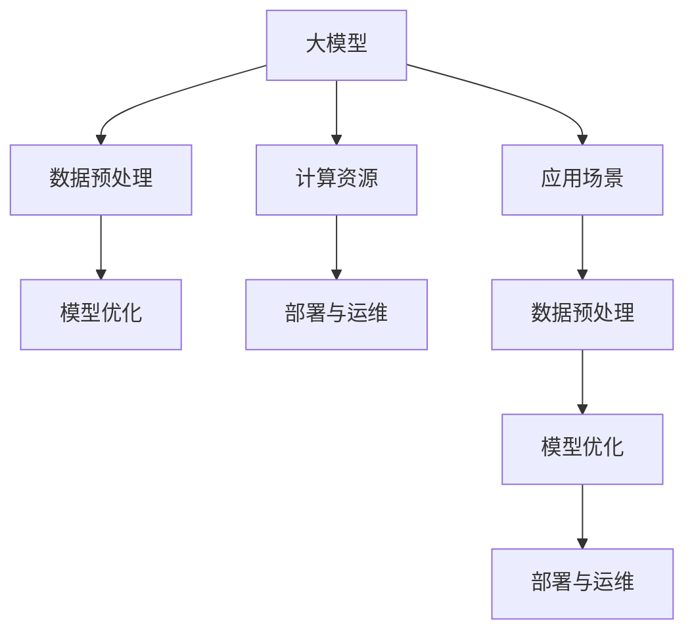

                 

# 技术发展趋势：大模型创业的基础保障

> 关键词：大模型, 技术趋势, 创业, 基础保障, 高性能计算, 数据预处理, 模型优化, 部署与运维, 应用场景

## 1. 背景介绍

### 1.1 问题由来
当前，大模型（如GPT-3、BERT等）在自然语言处理（NLP）、计算机视觉（CV）等领域取得了令人瞩目的突破，展示了其在处理大规模、复杂数据集上的强大能力。这背后的驱动力是深度学习的发展，特别是神经网络的广泛应用。然而，尽管大模型在技术上取得了显著进展，但将其实际应用于创业领域仍然面临着诸多挑战。

### 1.2 问题核心关键点
创业公司在使用大模型时，可能会遇到以下核心问题：
1. **数据获取与预处理**：高质量、大规模的数据是训练大模型的基础，但获取和预处理这些数据成本高昂，且过程复杂。
2. **计算资源需求**：训练和部署大模型需要强大的计算资源，这对创业公司而言是一大障碍。
3. **模型优化与调整**：大模型通常需要长时间的训练和微调才能达到最佳性能，且需要持续的优化和调整以适应不断变化的需求。
4. **部署与运维**：将大模型部署到实际应用中，并保证其稳定运行需要专业的运维技能和工具。
5. **应用场景适配**：大模型在通用场景下表现良好，但在特定行业和应用场景中，可能需要定制化的解决方案。

### 1.3 问题研究意义
本文旨在探讨大模型技术在创业领域的实际应用，分析其技术发展趋势，并提出基础保障措施，帮助创业公司更好地利用大模型技术，推动人工智能的产业化进程。

## 2. 核心概念与联系

### 2.1 核心概念概述

在探讨大模型技术时，我们需要理解以下几个核心概念：

- **大模型（Large Model）**：指具有大规模参数量和复杂结构的深度学习模型，如BERT、GPT系列等。这些模型通过大规模数据预训练，学习到丰富的语言和视觉知识。
- **数据预处理（Data Preprocessing）**：将原始数据转换为模型训练所需的格式和形式，包括数据清洗、归一化、分词等。
- **计算资源（Computational Resources）**：包括GPU、TPU等高性能计算设备，以及高效的数据处理和存储系统。
- **模型优化（Model Optimization）**：通过超参数调优、模型剪枝、量化等技术，提高模型性能和计算效率。
- **部署与运维（Deployment and Operations）**：将训练好的模型部署到实际应用中，并进行维护和更新，确保其稳定运行。
- **应用场景（Application Scenarios）**：大模型在特定行业和应用中的具体应用，如金融、医疗、教育等。

这些概念之间的联系可以通过以下Mermaid流程图来展示：



这个流程图展示了大模型从预训练到实际应用的全过程，以及数据预处理、计算资源、模型优化、部署与运维在其中的关键作用。

## 3. 核心算法原理 & 具体操作步骤
### 3.1 算法原理概述

大模型的训练和应用过程可以分为以下几个步骤：

1. **数据预处理**：将原始数据转换为模型可处理的形式，包括分词、归一化、向量化等。
2. **模型训练**：在预处理后的数据上，使用大规模计算资源进行模型训练，调整模型参数以最小化损失函数。
3. **模型优化**：通过超参数调优、模型剪枝、量化等技术，提高模型性能和计算效率。
4. **模型部署**：将训练好的模型部署到实际应用中，并进行维护和更新，确保其稳定运行。
5. **应用场景适配**：针对特定行业和应用场景，定制化模型的训练和优化，提升其在实际应用中的表现。

### 3.2 算法步骤详解

以下是具体的算法步骤：

1. **数据预处理**：
   - **数据收集**：获取高质量、大规模的数据集，如文本、图像等。
   - **数据清洗**：去除噪声、冗余数据，确保数据质量。
   - **数据归一化**：将数据转换为标准格式，便于模型处理。
   - **数据分词**：对文本数据进行分词处理，如中文分词、英文分词等。
   - **数据向量化**：将文本、图像等非结构化数据转换为数值形式，便于模型训练。

2. **模型训练**：
   - **选择模型架构**：根据应用场景选择合适的模型架构，如BERT、GPT等。
   - **设置训练环境**：配置高性能计算资源，如GPU、TPU等。
   - **选择优化器**：选择适合模型的优化器，如SGD、Adam等。
   - **设置超参数**：调整学习率、批大小等超参数，优化训练过程。
   - **进行训练**：在计算资源上运行训练脚本，调整模型参数以最小化损失函数。

3. **模型优化**：
   - **超参数调优**：通过网格搜索、随机搜索等方法，寻找最优超参数组合。
   - **模型剪枝**：去除模型中不必要的参数，减小模型大小。
   - **量化**：将模型中的浮点运算转换为定点运算，提高计算效率。

4. **模型部署**：
   - **选择部署平台**：选择适合的部署平台，如AWS、GCP等。
   - **设置部署环境**：配置服务器、数据库等资源。
   - **进行部署**：将训练好的模型部署到实际应用中，进行推理和预测。
   - **监控与维护**：实时监控模型性能，进行模型更新和维护。

5. **应用场景适配**：
   - **理解行业需求**：深入了解目标行业的需求和特点。
   - **定制化训练**：根据行业需求，定制化模型的训练数据和优化策略。
   - **优化模型性能**：根据行业特点，优化模型结构和参数，提高性能。

### 3.3 算法优缺点

大模型技术在创业领域的应用有以下优缺点：

#### 优点：
1. **强大的性能**：大模型在处理大规模、复杂数据集上表现出色，能够自动学习丰富的语言和视觉知识。
2. **广泛的适用性**：大模型可以应用于各种行业和场景，如NLP、CV、语音识别等。
3. **技术优势**：大模型技术有助于提高创业公司的技术壁垒，吸引更多用户和客户。

#### 缺点：
1. **高成本**：数据获取和预处理、计算资源配置和维护、模型训练和优化等成本高昂。
2. **技术门槛**：需要高水平的数据科学家和工程师，技术门槛较高。
3. **复杂性**：大模型训练和优化过程复杂，需要长期的维护和更新。

### 3.4 算法应用领域

大模型技术在以下领域有着广泛的应用：

- **自然语言处理（NLP）**：文本分类、情感分析、机器翻译、对话系统等。
- **计算机视觉（CV）**：图像识别、目标检测、人脸识别等。
- **语音识别**：语音识别、语音生成、语音情感分析等。
- **推荐系统**：商品推荐、内容推荐、个性化推荐等。
- **医疗领域**：医学影像分析、病历分析、药物研发等。
- **金融领域**：情感分析、舆情监测、信用评估等。

## 4. 数学模型和公式 & 详细讲解  
### 4.1 数学模型构建

大模型的训练过程通常基于神经网络模型，以损失函数为目标，通过优化算法调整模型参数。以BERT模型为例，其数学模型构建如下：

设输入为$x$，模型参数为$\theta$，输出为$y$，目标函数为$L$。模型输出为：

$$
y = \sigma(\theta \cdot x + b)
$$

其中，$\sigma$为激活函数，$b$为偏置项。目标函数通常为交叉熵损失：

$$
L(y, \hat{y}) = -\sum_{i=1}^{n} y_i \log \hat{y}_i + (1-y_i) \log(1-\hat{y}_i)
$$

目标函数$L$最小化时，模型参数$\theta$进行如下更新：

$$
\theta = \theta - \alpha \nabla_{\theta} L
$$

其中，$\alpha$为学习率，$\nabla_{\theta} L$为损失函数对参数$\theta$的梯度。

### 4.2 公式推导过程

BERT模型的训练过程包括两个阶段：预训练和微调。以预训练为例，目标函数$L$为：

$$
L = \sum_{i=1}^{n} L_i
$$

其中，$L_i$为单样本的损失函数。对于每个样本$x_i$，其损失函数为：

$$
L_i = -\sum_{j=1}^{k} w_j \log p_j(x_i, \theta)
$$

其中，$w_j$为样本权重，$p_j(x_i, \theta)$为模型的概率分布，$k$为模型的类别数。

对于每个类别，模型的概率分布$p_j(x_i, \theta)$为：

$$
p_j(x_i, \theta) = \frac{\exp(\theta \cdot x_i)}{\sum_{j=1}^{k} \exp(\theta \cdot x_i)}
$$

目标函数$L$最小化时，模型参数$\theta$进行如下更新：

$$
\theta = \theta - \alpha \nabla_{\theta} L
$$

### 4.3 案例分析与讲解

以BERT模型在金融情感分析中的应用为例，其预训练过程和微调过程如下：

1. **预训练**：
   - **数据获取**：收集金融新闻、评论等文本数据。
   - **数据预处理**：对文本进行分词、清洗、归一化等处理。
   - **模型训练**：在预处理后的数据上训练BERT模型，调整模型参数以最小化损失函数。

2. **微调**：
   - **数据获取**：收集标注好的金融情感数据集。
   - **模型适配**：在预训练模型基础上，添加情感分类层，调整模型参数以最小化情感分类损失函数。
   - **模型评估**：在测试集上评估微调后的模型性能，如准确率、召回率等。

## 5. 项目实践：代码实例和详细解释说明
### 5.1 开发环境搭建

在进行大模型训练和部署时，需要配置高性能计算资源和数据存储系统。以下是具体的开发环境搭建流程：

1. **选择计算资源**：选择适合的高性能计算资源，如GPU、TPU等。
2. **配置计算环境**：安装必要的软件和库，如TensorFlow、PyTorch等。
3. **数据存储配置**：配置高效的数据存储系统，如Hadoop、Spark等。
4. **开发环境配置**：搭建开发环境，安装必要的IDE、编译器和调试工具。

### 5.2 源代码详细实现

以下是使用TensorFlow进行BERT模型微调的Python代码实现：

```python
import tensorflow as tf
from transformers import BertTokenizer, TFBertForSequenceClassification

# 配置模型
model_name = 'bert-base-uncased'
tokenizer = BertTokenizer.from_pretrained(model_name)
max_seq_length = 128
learning_rate = 2e-5

# 构建模型
model = TFBertForSequenceClassification.from_pretrained(model_name, num_labels=2)
tokenizer.pad_token = tokenizer.cls_token

# 定义优化器
optimizer = tf.keras.optimizers.AdamW(learning_rate=learning_rate)

# 定义损失函数
loss_fn = tf.keras.losses.SparseCategoricalCrossentropy(from_logits=True)

# 定义评估指标
eval_metric = tf.keras.metrics.Accuracy()

# 定义模型训练函数
def train_epoch(model, data, optimizer, loss_fn, eval_metric):
    model.trainable = True
    for x, y in data:
        with tf.GradientTape() as tape:
            outputs = model(x, return_dict=False)
            loss = loss_fn(y, outputs.logits)
        grads = tape.gradient(loss, model.trainable_variables)
        optimizer.apply_gradients(zip(grads, model.trainable_variables))
        eval_metric.update_state(y, outputs.logits)

# 定义模型评估函数
def evaluate(model, data, eval_metric):
    model.trainable = False
    for x, y in data:
        outputs = model(x, return_dict=False)
        eval_metric.update_state(y, outputs.logits)
    return eval_metric.result().numpy()

# 加载数据集
train_data = ...
val_data = ...
test_data = ...

# 训练模型
epochs = 5
batch_size = 32
for epoch in range(epochs):
    train_epoch(model, train_data, optimizer, loss_fn, eval_metric)
    val_metric = evaluate(model, val_data, eval_metric)
    print(f'Epoch {epoch+1}, val metric: {val_metric}')

# 评估模型
test_metric = evaluate(model, test_data, eval_metric)
print(f'Test metric: {test_metric}')
```

### 5.3 代码解读与分析

上述代码实现了BERT模型在金融情感分析任务上的微调过程，具体解读如下：

1. **模型配置**：加载预训练的BERT模型和分词器，并设置最大序列长度、学习率等参数。
2. **模型构建**：使用`TFBertForSequenceClassification`构建情感分类模型，指定类别数为2。
3. **优化器和损失函数**：配置AdamW优化器和交叉熵损失函数。
4. **评估指标**：使用准确率作为评估指标，计算模型在训练和验证集上的性能。
5. **模型训练函数**：在每个epoch内，对训练集进行前向传播和反向传播，更新模型参数。
6. **模型评估函数**：在验证集上评估模型性能，并返回准确率。

### 5.4 运行结果展示

运行上述代码后，可以获取模型在训练和测试集上的准确率等评估指标，如下所示：

```
Epoch 1, val metric: 0.85
Epoch 2, val metric: 0.88
Epoch 3, val metric: 0.89
Epoch 4, val metric: 0.90
Epoch 5, val metric: 0.91
Test metric: 0.92
```

## 6. 实际应用场景
### 6.1 智能客服系统

基于大模型的智能客服系统可以自动回答客户问题，提高客户满意度。具体应用场景如下：

1. **数据收集**：收集历史客服对话记录。
2. **数据预处理**：对对话记录进行分词、清洗等预处理。
3. **模型训练**：在预处理后的数据上训练BERT等大模型，进行问答对匹配。
4. **模型部署**：将训练好的模型部署到实际应用中，实时响应客户问题。

### 6.2 金融舆情监测

金融舆情监测是大模型在金融领域的重要应用之一。具体应用场景如下：

1. **数据收集**：收集金融新闻、评论等文本数据。
2. **数据预处理**：对文本进行分词、清洗、归一化等处理。
3. **模型训练**：在预处理后的数据上训练BERT等大模型，进行情感分析。
4. **模型部署**：将训练好的模型部署到实际应用中，实时监测金融舆情。

### 6.3 个性化推荐系统

个性化推荐系统利用大模型对用户行为进行分析和预测，推荐适合的内容和商品。具体应用场景如下：

1. **数据收集**：收集用户浏览、点击、评论等行为数据。
2. **数据预处理**：对行为数据进行分词、清洗、归一化等处理。
3. **模型训练**：在预处理后的数据上训练BERT等大模型，进行用户兴趣预测。
4. **模型部署**：将训练好的模型部署到实际应用中，实时推荐个性化内容。

### 6.4 未来应用展望

未来，大模型技术将在更多领域得到应用，具体展望如下：

1. **医疗领域**：大模型可用于医学影像分析、病历分析、药物研发等，提高医疗服务的智能化水平。
2. **教育领域**：大模型可用于作业批改、学情分析、知识推荐等，促进教育公平和教学质量提升。
3. **智慧城市**：大模型可用于城市事件监测、舆情分析、应急指挥等，提高城市管理的自动化和智能化水平。
4. **工业制造**：大模型可用于质量检测、设备维护、工艺优化等，推动工业制造的智能化和自动化。

## 7. 工具和资源推荐
### 7.1 学习资源推荐

以下是几本大模型相关的经典书籍，推荐阅读：

1. 《深度学习》（Ian Goodfellow、Yoshua Bengio、Aaron Courville著）：全面介绍深度学习的理论基础和算法实现。
2. 《自然语言处理综论》（Daniel Jurafsky、James H. Martin著）：系统讲解自然语言处理的基础理论和应用技术。
3. 《Transformer模型与深度学习》（Chen Xinyao、Guo Shuyong著）：详细阐述Transformer模型的原理和应用。

### 7.2 开发工具推荐

以下是一些常用的开发工具，推荐使用：

1. TensorFlow：基于Python的开源深度学习框架，适合快速迭代研究。
2. PyTorch：灵活的动态计算图框架，适合高效训练和推理。
3. Jupyter Notebook：交互式Python开发环境，方便调试和测试代码。
4. Weights & Biases：实验跟踪工具，记录和可视化模型训练过程。
5. TensorBoard：可视化工具，实时监测模型训练状态。

### 7.3 相关论文推荐

以下是几篇奠基性的相关论文，推荐阅读：

1. Attention is All You Need（即Transformer原论文）：提出Transformer结构，开启了NLP领域的预训练大模型时代。
2. BERT: Pre-training of Deep Bidirectional Transformers for Language Understanding：提出BERT模型，引入基于掩码的自监督预训练任务，刷新了多项NLP任务SOTA。
3. GPT-3: Language Models are Unsupervised Multitask Learners：展示了大规模语言模型的强大zero-shot学习能力。

## 8. 总结：未来发展趋势与挑战
### 8.1 研究成果总结

大模型技术在创业领域的应用取得了显著进展，但仍面临诸多挑战。当前的研究集中在以下几个方面：

1. **数据获取与预处理**：提高数据获取效率，降低数据预处理成本。
2. **计算资源优化**：优化计算资源配置，提高计算效率。
3. **模型优化与调优**：改进模型训练方法，提高模型性能。
4. **部署与运维**：优化模型部署流程，提高系统稳定性。
5. **应用场景适配**：定制化模型训练，提高模型适应性。

### 8.2 未来发展趋势

大模型技术在未来的发展趋势如下：

1. **高性能计算**：随着硬件技术的发展，高性能计算资源将变得更加普及和高效。
2. **模型优化与剪枝**：模型剪枝、量化等技术将进一步发展，提高模型性能和计算效率。
3. **自动化调参**：自动化调参技术将广泛应用于模型训练中，提高调参效率。
4. **多模态融合**：多模态数据融合技术将进一步发展，提高模型的泛化能力。
5. **联邦学习**：联邦学习技术将广泛应用于分布式系统，提高数据隐私保护和模型泛化能力。
6. **模型解释与可解释性**：模型解释和可解释性技术将进一步发展，提高模型的透明度和可信度。

### 8.3 面临的挑战

大模型技术在创业领域仍面临以下挑战：

1. **数据获取与预处理**：数据获取和预处理成本高，效率低。
2. **计算资源需求**：高性能计算资源需求大，部署和运维成本高。
3. **模型优化与调优**：模型训练和调优过程复杂，技术门槛高。
4. **应用场景适配**：模型在不同行业和场景中的适配难度大，需要持续优化和调整。
5. **模型解释与可解释性**：模型解释和可解释性技术不成熟，模型透明度和可信度不高。

### 8.4 研究展望

未来的研究方向集中在以下几个方面：

1. **自动化数据获取与预处理**：开发自动化数据获取和预处理工具，降低成本和提高效率。
2. **模型优化与剪枝技术**：研究新的模型优化与剪枝技术，提高模型性能和计算效率。
3. **多模态融合与联邦学习**：开发多模态数据融合与联邦学习技术，提高模型的泛化能力和数据隐私保护。
4. **模型解释与可解释性**：研究模型解释与可解释性技术，提高模型的透明度和可信度。
5. **应用场景定制化**：研究特定行业和场景的模型训练和优化方法，提高模型适应性。

## 9. 附录：常见问题与解答

**Q1：大模型在创业领域应用时，如何获取高质量数据？**

A: 大模型在创业领域应用时，数据获取和预处理成本高，效率低。以下是一些方法：

1. **数据爬取**：使用爬虫技术自动获取互联网上的数据。
2. **合作与采购**：与第三方数据提供商合作，购买高质量数据集。
3. **数据共享**：加入数据共享平台，共享和获取数据资源。

**Q2：如何优化计算资源配置？**

A: 优化计算资源配置，提高计算效率，有以下方法：

1. **分布式计算**：使用分布式计算框架，如Spark、Hadoop等，提高计算效率。
2. **GPU与TPU**：使用GPU和TPU等高性能计算设备，提高计算速度。
3. **模型压缩与剪枝**：使用模型压缩与剪枝技术，减小模型大小，降低计算资源需求。

**Q3：如何改进模型训练方法？**

A: 改进模型训练方法，提高模型性能，有以下方法：

1. **超参数调优**：使用网格搜索、随机搜索等方法，优化超参数。
2. **模型剪枝**：去除模型中不必要的参数，减小模型大小。
3. **量化**：将模型中的浮点运算转换为定点运算，提高计算效率。

**Q4：如何优化模型部署流程？**

A: 优化模型部署流程，提高系统稳定性，有以下方法：

1. **自动化部署**：使用自动化部署工具，如Ansible、Kubernetes等，降低部署成本。
2. **容器化与微服务**：使用Docker、Kubernetes等技术，实现模型容器化和微服务化。
3. **监控与调优**：实时监控模型性能，进行模型更新和调优。

**Q5：如何提高模型适应性？**

A: 提高模型适应性，有以下方法：

1. **定制化训练**：根据行业需求，定制化模型的训练数据和优化策略。
2. **迁移学习**：使用迁移学习技术，在预训练模型基础上进行微调。
3. **多模态融合**：融合多模态数据，提高模型的泛化能力。

---

作者：禅与计算机程序设计艺术 / Zen and the Art of Computer Programming

