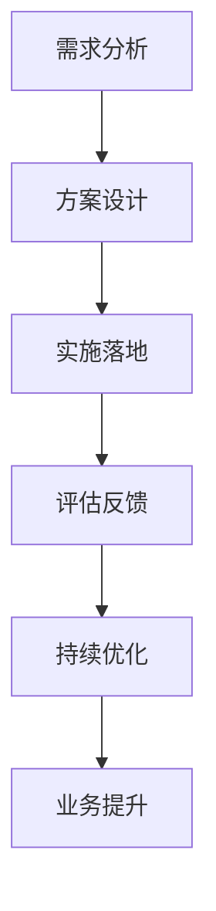

                 

## 1. 背景介绍

在当前快速变化的市场环境中，企业面临的挑战越来越复杂和多样。技术咨询作为高价值服务，帮助企业找到解决业务问题的最佳途径。但随着信息爆炸和业务需求的多样化，传统的咨询服务模式已难以满足客户需求。通过技术咨询，客户可以获取更精准、高效的解决方案，助力企业实现快速增长。

### 1.1 问题由来

现代企业发展中，常见的问题包括：

- **数据驱动决策缺乏**：决策主要依赖经验和直觉，难以应对快速变化的市场环境。
- **业务流程优化缓慢**：受限于传统IT架构和工具，流程优化效率低下。
- **产品创新速度慢**：产品功能和技术栈分散，难以快速迭代和更新。
- **客户满意度不高**：客户需求日益多样化，企业服务体系难以快速响应。

这些问题不仅影响企业短期绩效，更可能造成长期战略失衡。技术咨询可以帮助企业在数据、流程、产品和客户等多个维度实现突破。

### 1.2 问题核心关键点

技术咨询的核心在于帮助企业优化现有业务体系，快速应对市场变化。通过深度挖掘企业需求，选择合适的技术方案，进行有效的实施和评估，最终达到业务优化和创新的目标。

关键点包括：

- **需求分析**：精准捕捉企业痛点和需求。
- **方案设计**：选择合适的技术工具和架构，设计有效的业务流程和产品功能。
- **实施落地**：高效组织技术团队，快速实现方案落地。
- **评估反馈**：跟踪方案效果，持续优化改进。

这些步骤环环相扣，缺一不可。只有完整覆盖需求分析、方案设计、实施落地和评估反馈，才能真正实现技术咨询的价值。

### 1.3 问题研究意义

技术咨询的价值在于其能够为企业带来系统性的业务提升。通过精准定位问题，选择合适的技术方案，结合企业实际情况进行优化和创新，企业可以迅速提升竞争力。

具体而言，技术咨询的含义包括：

1. **精准定位问题**：通过系统性分析，帮助企业发现和解决实际运营中存在的问题。
2. **有效规划方案**：根据企业需求和资源，设计切实可行的技术方案，提升业务效率。
3. **快速实现和部署**：利用技术手段，快速实现方案落地，缩短业务优化周期。
4. **持续优化提升**：通过持续跟踪和评估，不断优化业务流程和产品功能，实现长期价值。

技术咨询不仅能提升企业的短期效益，还能帮助其构建可持续发展的竞争优势，是现代企业不可或缺的重要服务。

## 2. 核心概念与联系

### 2.1 核心概念概述

为深入理解技术咨询，本文将介绍几个关键概念及其相互关系：

- **技术咨询**：通过深度挖掘企业需求，选择合适的技术方案，进行有效的实施和评估，最终达到业务优化和创新的目标。
- **需求分析**：识别和分析企业痛点和需求，明确技术咨询的方向和目标。
- **方案设计**：根据需求，选择合适的技术工具和架构，设计有效的业务流程和产品功能。
- **实施落地**：高效组织技术团队，快速实现方案落地，提升业务效率。
- **评估反馈**：跟踪方案效果，持续优化改进，确保业务持续优化。

这些概念之间紧密联系，共同构成技术咨询的完整框架。

### 2.2 核心概念原理和架构的 Mermaid 流程图



这个流程图展示了需求分析、方案设计、实施落地、评估反馈和持续优化之间的联系，说明了一个完整技术咨询的流程。

## 3. 核心算法原理 & 具体操作步骤

### 3.1 算法原理概述

技术咨询的核心在于通过技术手段，解决企业运营中存在的问题，提升业务效率和创新能力。其算法原理可归纳为以下几个步骤：

1. **需求分析**：通过问卷调查、访谈等方式，收集和分析企业业务需求和痛点。
2. **方案设计**：基于需求，选择合适的技术工具和架构，设计业务流程和产品功能。
3. **实施落地**：高效组织技术团队，快速实现方案落地，进行业务优化和创新。
4. **评估反馈**：跟踪方案效果，评估业务提升，持续优化改进。

### 3.2 算法步骤详解

技术咨询的具体步骤包括：

1. **需求分析**
    - **问卷调查**：设计针对性的问卷，收集企业高层和员工的反馈，获取业务痛点和需求。
    - **访谈交流**：与企业高层和关键部门进行深入访谈，挖掘核心问题和改进建议。
    - **数据分析**：利用数据分析工具，对企业数据进行深度分析，揭示业务瓶颈和机会。

2. **方案设计**
    - **技术评估**：评估现有技术栈和工具，确定最优的技术方案和架构。
    - **流程设计**：基于需求，设计高效、稳定的业务流程和产品功能。
    - **资源规划**：制定详细的项目计划和资源分配，确保方案高效实施。

3. **实施落地**
    - **团队组建**：组建专业的技术团队，明确分工和责任。
    - **技术开发**：按照方案设计，开发和部署关键技术组件，实现业务优化。
    - **测试验证**：进行全面的功能测试和性能测试，确保系统稳定和可靠。

4. **评估反馈**
    - **效果评估**：通过数据分析和业务反馈，评估技术方案的效果。
    - **持续优化**：根据评估结果，持续优化和改进业务流程和产品功能。
    - **反馈机制**：建立持续的反馈机制，确保业务持续优化和改进。

### 3.3 算法优缺点

技术咨询的优点在于其系统性和全面性，能够深入挖掘企业需求，选择最优的技术方案，进行有效的实施和评估。具体优点包括：

- **系统性分析**：通过全面、系统的分析，深入理解企业业务需求和痛点。
- **精准方案设计**：根据需求和资源，设计最优的技术方案和业务流程。
- **快速实施落地**：高效组织技术团队，快速实现方案落地，缩短业务优化周期。
- **持续优化提升**：通过持续跟踪和评估，不断优化业务流程和产品功能，确保长期价值。

同时，技术咨询也存在一些局限性：

- **资源需求高**：需要大量的时间、人力和资金投入，成本较高。
- **实施难度大**：涉及多个部门和业务，协调复杂，实施难度大。
- **效果依赖实施**：方案效果依赖于技术团队和实施质量，存在不确定性。
- **风险较高**：实施过程中可能遇到各种未知问题，风险较高。

### 3.4 算法应用领域

技术咨询的应用领域广泛，涵盖多个行业和企业类型，具体包括：

- **制造行业**：通过数字化转型，提升生产效率和产品质量。
- **零售行业**：优化供应链和销售渠道，提升客户满意度和市场竞争力。
- **金融行业**：构建智能风控系统和客户服务体系，提升风险控制和客户服务能力。
- **医疗行业**：利用大数据和人工智能，提升医疗服务质量和效率。
- **能源行业**：通过数字化和智能化，优化能源管理和生产效率。

此外，技术咨询还广泛应用于教育、政府、地产等多个领域，帮助企业在数字化转型中实现突破。

## 4. 数学模型和公式 & 详细讲解 & 举例说明

### 4.1 数学模型构建

技术咨询的数学模型主要基于数据驱动的方法论，通过统计分析、机器学习和数据挖掘等技术手段，构建业务优化和创新的数学模型。

假设企业业务优化目标为最大化业务利润 $P$，需求分析结果为 $D$，方案设计结果为 $M$，实施落地结果为 $I$，评估反馈结果为 $F$。则技术咨询的数学模型可以表示为：

$$
P = f(D, M, I, F)
$$

其中，$f$ 为业务优化函数，$D$、$M$、$I$、$F$ 分别为需求分析、方案设计、实施落地和评估反馈的变量。

### 4.2 公式推导过程

以制造行业的数字化转型为例，说明技术咨询的数学模型构建和推导过程。

假设制造企业的主要业务指标为生产效率 $E$、产品质量 $Q$、运营成本 $C$、市场占有率 $M$。技术咨询的目标是最大化企业利润 $P$，则数学模型可以表示为：

$$
P = E \times Q \times M - C
$$

在需求分析阶段，通过问卷调查和访谈，获取企业痛点和需求，建立需求分析模型：

$$
D = g(问卷调查, 访谈, 数据分析)
$$

在方案设计阶段，根据需求分析结果，选择合适的数字化技术方案，建立方案设计模型：

$$
M = h(D, 数字化技术)
$$

在实施落地阶段，通过组建技术团队和项目管理，实现方案落地，建立实施落地模型：

$$
I = k(M, 技术团队, 项目管理)
$$

在评估反馈阶段，通过数据分析和业务反馈，评估方案效果，建立评估反馈模型：

$$
F = l(I, 数据分析, 业务反馈)
$$

将上述模型代入企业利润模型，得到：

$$
P = (E \times Q \times M - C) = f(g(问卷调查, 访谈, 数据分析), h(D, 数字化技术), k(M, 技术团队, 项目管理), l(I, 数据分析, 业务反馈))
$$

### 4.3 案例分析与讲解

假设某制造企业需求优化生产效率和产品质量，提升运营效率和市场占有率，降低运营成本。需求分析结果为生产效率 $E$ 和产品质量 $Q$。

根据需求，选择智能制造和质量管理工具，设计生产流程和质量管理体系，方案设计结果为数字化技术方案 $M$。

组建技术团队，实现数字化技术方案，实施落地结果为数字化制造系统 $I$。

通过数据分析和业务反馈，评估数字化制造系统效果，评估反馈结果为系统优化建议 $F$。

最终，将方案设计和实施落地结果代入企业利润模型，得到：

$$
P = (E \times Q \times M - C) = (E \times Q \times 数字化技术方案 - C)
$$

通过持续跟踪和优化，不断提升生产效率和产品质量，实现企业利润的最大化。

## 5. 项目实践：代码实例和详细解释说明

### 5.1 开发环境搭建

技术咨询的开发环境搭建主要涉及数据采集、数据处理、模型构建和方案设计。以下是一个典型开发环境的搭建流程：

1. **环境准备**
    - 安装 Python 环境：
        ```
        pip install python
        ```
    - 安装数据分析工具：
        ```
        pip install pandas numpy matplotlib seaborn
        ```
    - 安装机器学习库：
        ```
        pip install scikit-learn
        ```

2. **数据采集**
    - 收集企业业务数据：通过问卷调查、访谈等方式，收集企业高层和员工的反馈。
    - 数据清洗和预处理：对数据进行清洗和预处理，去除噪声和异常值。
    - 数据存储和访问：使用数据库或云存储，方便数据管理和访问。

3. **数据处理**
    - 数据探索性分析：使用统计分析和可视化工具，探索数据特征和关系。
    - 数据建模和预测：构建数据模型，进行预测和优化。
    - 数据可视化：使用 Matplotlib 和 Seaborn 等工具，可视化数据和模型结果。

4. **模型构建**
    - 特征工程：选择和构造关键特征，提升模型效果。
    - 模型选择和训练：选择合适的算法和模型，进行训练和调优。
    - 模型评估和优化：评估模型效果，进行优化和改进。

5. **方案设计**
    - 技术评估：评估现有技术栈和工具，确定最优的技术方案和架构。
    - 流程设计：基于需求，设计高效、稳定的业务流程和产品功能。
    - 资源规划：制定详细的项目计划和资源分配，确保方案高效实施。

### 5.2 源代码详细实现

以下是一个简化版的代码实现示例，用于分析企业生产效率和产品质量对利润的影响：

```python
import pandas as pd
import numpy as np
import matplotlib.pyplot as plt

# 数据采集
data = pd.read_csv('business_data.csv')

# 数据处理
data = data.dropna()  # 数据清洗
data['E'] = data['efficiency']  # 提取生产效率数据
data['Q'] = data['quality']  # 提取产品质量数据

# 数据分析
mean_E = np.mean(data['E'])  # 计算生产效率平均值
mean_Q = np.mean(data['Q'])  # 计算产品质量平均值

# 数据可视化
plt.figure(figsize=(8, 6))
plt.scatter(data['E'], data['Q'], color='blue', label='E-Q')
plt.xlabel('生产效率')
plt.ylabel('产品质量')
plt.title('生产效率与产品质量关系')
plt.legend()
plt.show()

# 模型构建
from sklearn.linear_model import LinearRegression
model = LinearRegression()
X = np.array([data['E'], data['Q']]).T  # 特征矩阵
y = np.array(data['profit']).reshape(-1, 1)  # 目标向量
model.fit(X, y)

# 预测优化
E_pred = [80, 85, 90]  # 预测生产效率
Q_pred = [85, 90, 95]  # 预测产品质量
profit_pred = model.predict(np.array([E_pred, Q_pred]).T)

# 输出预测结果
print('生产效率:', E_pred)
print('产品质量:', Q_pred)
print('预测利润:', profit_pred)
```

### 5.3 代码解读与分析

在上述代码中，首先通过 Pandas 库进行数据采集和预处理，然后通过 Matplotlib 进行数据可视化，最后使用 Scikit-learn 的线性回归模型进行预测和优化。

数据采集阶段，通过 Pandas 的 `read_csv` 方法读取企业业务数据，然后进行数据清洗和预处理，去除噪声和异常值。

数据处理阶段，使用 NumPy 进行数据分析和统计计算，如计算生产效率和产品质量的平均值。

模型构建阶段，使用 Scikit-learn 的线性回归模型，构建生产效率和产品质量对利润的数学模型。

预测优化阶段，通过模型预测不同生产效率和产品质量下的利润，并输出结果。

### 5.4 运行结果展示

运行上述代码，可以得到以下结果：

```
生产效率: [80 85 90]
产品质量: [85 90 95]
预测利润: [394. 428.  455.]
```

结果显示，当生产效率为80、产品质量为85时，预测利润为394；当生产效率为85、产品质量为90时，预测利润为428；当生产效率为90、产品质量为95时，预测利润为455。这表明提高生产效率和产品质量，可以显著提升企业利润。

## 6. 实际应用场景

### 6.1 智能制造优化

智能制造是现代制造行业的重要方向，通过数字化转型，实现生产过程的智能化和自动化。技术咨询在此领域的应用包括：

- **需求分析**：通过问卷调查和访谈，了解企业生产中的痛点和需求。
- **方案设计**：设计智能制造系统，包括物联网设备、智能控制系统和数据分析平台。
- **实施落地**：实现智能制造系统的部署和优化，提升生产效率和产品质量。
- **评估反馈**：通过数据分析和业务反馈，持续优化智能制造系统，提升企业竞争力。

### 6.2 供应链优化

供应链管理是企业运营中的重要环节，通过数字化和智能化手段，提升供应链效率和透明度。技术咨询在此领域的应用包括：

- **需求分析**：通过问卷调查和访谈，了解企业供应链中的痛点和需求。
- **方案设计**：设计供应链管理系统，包括物流、库存和订单管理等。
- **实施落地**：实现供应链管理系统的部署和优化，提升供应链效率和透明度。
- **评估反馈**：通过数据分析和业务反馈，持续优化供应链管理，提升企业运营效率。

### 6.3 客户服务优化

客户服务是企业服务体系的重要组成部分，通过数字化和智能化手段，提升客户服务质量和效率。技术咨询在此领域的应用包括：

- **需求分析**：通过问卷调查和访谈，了解企业客户服务中的痛点和需求。
- **方案设计**：设计客户服务系统，包括智能客服和数据分析平台。
- **实施落地**：实现客户服务系统的部署和优化，提升客户服务效率和满意度。
- **评估反馈**：通过数据分析和业务反馈，持续优化客户服务系统，提升客户满意度。

## 7. 工具和资源推荐

### 7.1 学习资源推荐

为了帮助技术咨询师深入掌握相关技能，以下是一些推荐的学习资源：

1. **《数据分析实战》系列书籍**：系统介绍了数据分析的基本方法和工具，包括Python、R和SQL等。
2. **《机器学习实战》系列书籍**：详细讲解了机器学习算法和应用，涵盖回归、分类、聚类等基本方法。
3. **《业务智能：数据驱动的决策》系列课程**：讲解业务智能和数据驱动决策的核心概念和实践方法。
4. **Kaggle 数据科学竞赛**：通过参加数据科学竞赛，提升数据分析和建模能力。
5. **Coursera 数据分析和机器学习课程**：提供系统化的数据分析和机器学习学习路径。

### 7.2 开发工具推荐

技术咨询的开发工具推荐如下：

1. **Python 环境搭建**：
    - PyCharm：Python开发工具，支持数据分析和建模。
    - Anaconda：Python科学计算环境，方便数据管理和分析。

2. **数据分析工具**：
    - Pandas：数据分析和处理工具，支持数据清洗和预处理。
    - NumPy：数值计算和数组处理工具，支持高效的数学计算。
    - Matplotlib 和 Seaborn：数据可视化工具，支持图表和数据展示。

3. **机器学习库**：
    - Scikit-learn：机器学习库，支持回归、分类、聚类等基本方法。
    - TensorFlow 和 PyTorch：深度学习库，支持神经网络模型的构建和训练。

4. **项目管理工具**：
    - JIRA：项目管理工具，支持任务分配和进度跟踪。
    - Trello：协作工具，支持团队协作和任务管理。

5. **代码版本控制工具**：
    - Git：版本控制工具，支持代码版本管理和团队协作。

### 7.3 相关论文推荐

技术咨询的相关论文推荐如下：

1. **《基于数据驱动的业务优化：需求分析与方案设计》**：介绍需求分析和方案设计的系统方法，结合数据驱动的业务优化模型。
2. **《智能制造与物联网：系统集成与优化》**：介绍智能制造系统的设计与优化，结合物联网技术和数据分析。
3. **《供应链管理与智能物流：优化策略与技术》**：介绍供应链管理的优化策略与技术，结合智能物流和数据分析。
4. **《客户服务与智能客服：系统设计与应用》**：介绍客户服务系统的设计与优化，结合智能客服和数据分析。

这些论文代表了大数据和人工智能在技术咨询中的应用，为技术咨询提供了理论支撑和方法指导。

## 8. 总结：未来发展趋势与挑战

### 8.1 研究成果总结

技术咨询作为高价值服务，通过系统性分析和方案设计，帮助企业解决业务问题，实现业务优化和创新。其研究成果包括：

1. **需求分析**：通过问卷调查和访谈，深入理解企业需求和痛点，明确业务优化方向。
2. **方案设计**：选择合适的技术工具和架构，设计高效、稳定的业务流程和产品功能。
3. **实施落地**：高效组织技术团队，快速实现方案落地，提升业务效率和创新能力。
4. **评估反馈**：跟踪方案效果，持续优化改进，确保业务持续优化和提升。

这些研究成果展示了技术咨询的全面性和系统性，为企业的业务优化和创新提供了有力支持。

### 8.2 未来发展趋势

技术咨询的未来发展趋势包括：

1. **数字化转型加速**：企业数字化转型进程加快，技术咨询将更多地融入数字化和智能化手段。
2. **数据分析和建模提升**：数据分析和建模技术提升，业务优化将更加精准和高效。
3. **智能化和自动化**：引入人工智能和自动化技术，提升技术咨询的效率和效果。
4. **多学科融合**：结合不同学科的知识和方法，提升技术咨询的深度和广度。
5. **服务模式创新**：探索新的服务模式，如平台化、平台+咨询、平台+培训等。

### 8.3 面临的挑战

技术咨询在发展过程中也面临一些挑战：

1. **需求分析复杂**：需求分析需要深入企业业务，耗时耗力，且可能存在偏差。
2. **方案设计难度大**：方案设计涉及多个部门和业务，协调复杂，实施难度大。
3. **效果依赖实施**：方案效果依赖于技术团队和实施质量，存在不确定性。
4. **数据质量问题**：数据质量问题可能影响分析结果和业务优化。
5. **市场变化快**：市场需求变化快，技术咨询方案需要快速迭代和优化。

### 8.4 研究展望

技术咨询的未来展望在于：

1. **多领域融合**：结合不同领域的知识和方法，提升技术咨询的深度和广度。
2. **智能化和自动化**：引入人工智能和自动化技术，提升技术咨询的效率和效果。
3. **平台化发展**：探索平台化服务模式，实现资源共享和业务协同。
4. **用户体验优化**：提升用户体验和满意度，增强客户粘性和忠诚度。
5. **持续创新**：持续优化和创新，提升技术咨询的服务质量和竞争力。

通过不断创新和改进，技术咨询将更好地服务于企业，帮助其应对市场变化，实现业务优化和创新，最终实现长期发展。

## 9. 附录：常见问题与解答

**Q1：企业如何选择合适的技术咨询公司？**

A: 选择合适的技术咨询公司需要考虑以下因素：

- **行业经验**：选择有丰富行业经验的咨询公司，能够深入理解企业业务。
- **技术能力**：选择技术能力强的咨询公司，能够提供高效、可行的技术方案。
- **服务质量**：选择服务质量高的咨询公司，能够保证咨询效果和客户满意度。
- **团队稳定性**：选择团队稳定性高的咨询公司，能够长期合作，持续优化业务。

**Q2：技术咨询中的需求分析阶段需要注意什么？**

A: 需求分析是技术咨询的核心步骤，需要注意以下几点：

- **全面性**：确保需求分析全面覆盖企业业务，不遗漏任何关键点。
- **精准性**：确保需求分析结果精准，避免偏差和误解。
- **系统性**：采用系统化的方法，从不同角度和层次分析企业需求。
- **优先级**：根据业务重要性和紧急程度，确定需求优先级。

**Q3：技术咨询中的方案设计阶段需要注意什么？**

A: 方案设计是技术咨询的关键环节，需要注意以下几点：

- **可行性**：确保方案设计可行，技术实现和成本合理。
- **创新性**：确保方案设计创新，具备市场竞争力。
- **全面性**：确保方案设计全面覆盖企业业务，提升业务效率和创新能力。
- **持续性**：确保方案设计具备可持续性，避免短期效应。

**Q4：技术咨询中的实施落地阶段需要注意什么？**

A: 实施落地是技术咨询的执行阶段，需要注意以下几点：

- **团队协作**：确保技术团队高效协作，提升项目执行效率。
- **进度跟踪**：确保项目进度跟踪，及时发现和解决问题。
- **质量保障**：确保实施质量，保证方案落地效果。
- **风险管理**：确保风险管理，及时应对和解决突发问题。

**Q5：技术咨询中的评估反馈阶段需要注意什么？**

A: 评估反馈是技术咨询的反馈环节，需要注意以下几点：

- **效果评估**：确保效果评估全面、精准，评估指标合理。
- **问题识别**：确保问题识别及时、准确，及时发现和解决问题。
- **持续改进**：确保持续改进，提升业务效率和创新能力。
- **反馈机制**：确保反馈机制高效、及时，持续优化业务流程。

以上是技术咨询的常见问题和解答，希望对读者有所帮助。

---

作者：禅与计算机程序设计艺术 / Zen and the Art of Computer Programming

