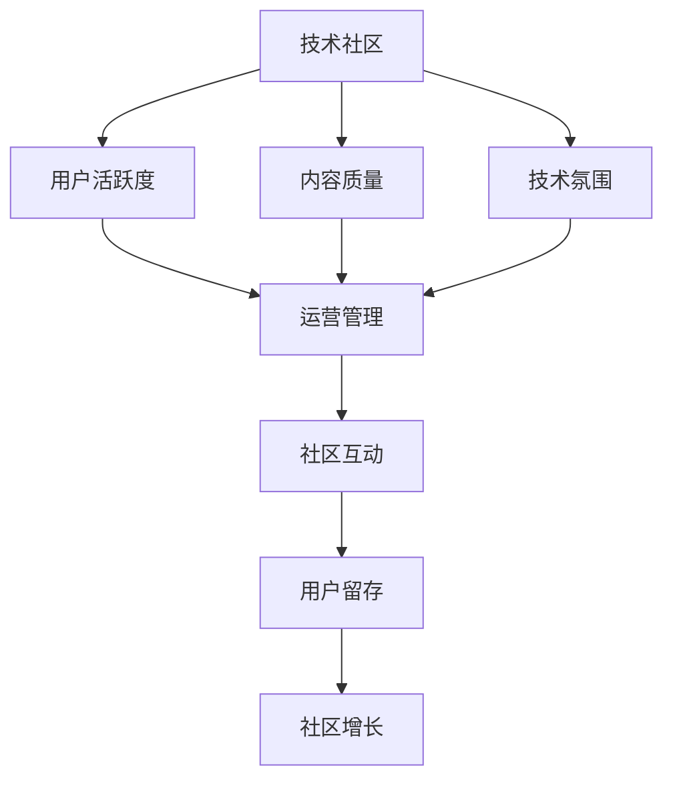

                 

## 1. 背景介绍

在数字化、全球化的浪潮下，技术社区正成为连接开发者、企业家、学术界的重要桥梁。技术社区不仅提供了丰富的技术交流平台，还推动了技术知识共享、创新孵化和人才培育。从0到10000用户，技术社区从原始的小众群组逐渐发展成为具有广泛影响力的技术生态。本文旨在探讨技术社区运营的核心原则和实践策略，以期为社区运营者提供有价值的参考。

### 1.1 技术社区的兴起
技术社区的兴起与互联网的普及、开源运动的推动密不可分。自2000年代以来，开源社区如Linux、GitHub、Stack Overflow等迅速发展，为技术爱好者提供了广阔的交流和合作平台。2010年代，社交媒体和即时通讯工具的兴起，进一步促进了技术社区的扩展和多样化。

### 1.2 社区运营的重要性
技术社区的繁荣离不开运营者的精心管理。有效的运营不仅能吸引用户，还能促进社区健康发展。高质量的社区内容、活跃的用户互动、良好的用户体验和技术氛围，都是社区运营的关键。

## 2. 核心概念与联系

### 2.1 核心概念概述
- **技术社区（Technical Community）**：由技术爱好者组成，以技术交流、知识共享、创新孵化为目的的在线社群。
- **用户活跃度（User Engagement）**：用户参与度、贡献度、互动频率等指标，反映社区的活跃程度。
- **内容质量（Content Quality）**：社区内技术内容的专业性、时效性和实用性，直接影响用户黏性。
- **技术氛围（Technical Atmosphere）**：社区成员对技术的热情、尊重和支持，包括开放、包容、互助等。
- **运营管理（Community Management）**：对社区内容、用户、活动等进行规划、执行和优化，提升社区整体效果。

### 2.2 核心概念原理和架构的 Mermaid 流程图



此图展示了技术社区运营的关键环节及其相互关系。用户活跃度、内容质量和技术氛围共同构成社区的核心价值，而运营管理则通过优化这些环节，驱动社区的持续增长和繁荣。

## 3. 核心算法原理 & 具体操作步骤

### 3.1 算法原理概述

技术社区运营可以视为一个多维度的优化问题，旨在通过调整各个影响因子，最大化社区的活跃度和用户满意度。核心算法原理包括以下几个方面：

1. **用户行为建模**：分析用户行为数据，挖掘用户需求和偏好。
2. **内容推荐算法**：根据用户兴趣和行为，推荐相关技术内容。
3. **用户互动优化**：通过互动机制（如问答、讨论、投票等），促进用户间的交流和互动。
4. **反馈收集与分析**：收集用户反馈，优化社区内容和技术氛围。

### 3.2 算法步骤详解

**步骤1：用户行为分析**
- 收集用户注册、登录、浏览、发布、互动等行为数据。
- 使用数据挖掘技术（如聚类、分类、关联规则等）分析用户行为模式。

**步骤2：内容推荐系统构建**
- 构建用户画像，包括兴趣、专业背景、活跃时间等。
- 设计推荐算法，如协同过滤、内容相似性分析等，推荐适合用户的技术文章、项目、问题等。
- 定期更新推荐算法模型，适应用户行为变化。

**步骤3：互动机制设计**
- 设计问答、讨论、投票等互动机制，鼓励用户参与和贡献。
- 实施内容审核机制，确保互动内容的质量和健康性。
- 优化互动规则，提升用户互动体验。

**步骤4：反馈收集与分析**
- 通过调查问卷、用户评价等方式，收集用户对社区的反馈。
- 分析反馈内容，识别问题和改进方向。
- 实施改进措施，优化社区体验。

### 3.3 算法优缺点

技术社区运营算法具有以下优点：
1. 高度定制化：能够根据社区特点和用户需求，进行个性化优化。
2. 用户导向：通过分析用户行为，提升用户体验和满意度。
3. 动态调整：能够实时响应用户变化，适应社区发展。

但同时也存在一些缺点：
1. 数据依赖：需要大量用户行为数据，对数据质量和数量要求高。
2. 算法复杂：涉及多维度数据分析和算法优化，需要较高的技术投入。
3. 用户隐私：用户行为数据的收集和分析可能涉及隐私问题，需严格遵守数据保护法规。

### 3.4 算法应用领域

技术社区运营算法广泛应用于各类技术社区的建设和发展，包括但不限于：

- **开源社区**：如GitHub、Apache、OpenStack等。
- **技术博客和论坛**：如Medium、Stack Overflow、CSDN等。
- **技术问答平台**：如Quora、知乎、Stack Exchange等。
- **技术培训和教育平台**：如Coursera、Udacity、慕课网等。

## 4. 数学模型和公式 & 详细讲解 & 举例说明

### 4.1 数学模型构建

为技术社区运营提供数学模型的基础是用户行为数据的分析。以下是几个核心模型的构建过程：

**用户行为预测模型**
- 输入：用户行为数据，包括注册时间、活跃时间、浏览记录、互动次数等。
- 输出：用户未来行为的预测，如活跃度、贡献度、流失风险等。
- 模型：基于时间序列分析的ARIMA模型、基于协同过滤的推荐算法等。

**内容推荐系统**
- 输入：用户画像、技术内容特征。
- 输出：推荐列表，包含适合用户的内容。
- 模型：协同过滤（User-Item Filtering）、基于内容的推荐（Content-Based Recommendation）等。

**用户互动分析模型**
- 输入：用户互动数据，包括问答、讨论、投票等。
- 输出：互动行为的分析结果，如互动频率、活跃度等。
- 模型：社交网络分析（Social Network Analysis）、情感分析（Sentiment Analysis）等。

### 4.2 公式推导过程

**用户行为预测模型：ARIMA模型**
- 模型公式：
$$
Y_t = \phi(L) Y_{t-1} + \theta(L) e_t
$$
其中，$Y_t$ 表示用户行为指标，$L$ 为滞后算子，$\phi(L)$ 和 $\theta(L)$ 为自回归和移动平均的系数。

**内容推荐系统：协同过滤算法**
- 模型公式：
$$
\hat{y}_{ui} = \sum_{j \in N_i} \alpha_j \frac{r_{uj}}{ \sum_{k \in N_i} \alpha_k r_{uk}}
$$
其中，$r_{ui}$ 表示用户 $u$ 对内容 $i$ 的评分，$N_i$ 表示与内容 $i$ 相关的用户集合。

**用户互动分析模型：社交网络分析**
- 模型公式：
$$
A = \frac{1}{N} AB
$$
其中，$A$ 表示用户互动矩阵，$B$ 表示用户活跃度矩阵，$N$ 为用户数量。

### 4.3 案例分析与讲解

**GitHub社区运营案例**
GitHub作为全球最大的开源社区，其运营策略中包含了丰富的数据分析和推荐算法：
- **用户行为分析**：通过用户行为数据，构建用户画像，识别高活跃用户和贡献者。
- **内容推荐系统**：根据用户行为和兴趣，推荐相关项目和库，提升用户黏性。
- **互动机制设计**：实施评论、点赞、 issue评论等机制，促进用户互动。
- **反馈收集与分析**：通过问卷调查、社区论坛等，收集用户反馈，优化社区体验。

## 5. 项目实践：代码实例和详细解释说明

### 5.1 开发环境搭建

**Python环境**
- 安装Python 3.7及以上版本，建议使用Anaconda或Miniconda进行管理。
- 安装TensorFlow、Pandas、NumPy、Scikit-learn等常用库。

**数据准备**
- 收集技术社区的用户行为数据，包括注册信息、浏览记录、互动数据等。
- 数据清洗和预处理，去除噪声和异常值，确保数据质量。

### 5.2 源代码详细实现

**用户行为预测**
```python
import pandas as pd
from sklearn.model_selection import train_test_split
from statsmodels.tsa.arima_model import ARIMA

# 加载数据
data = pd.read_csv('user_behavior.csv')

# 数据预处理
data = data.dropna()

# 划分训练集和测试集
train, test = train_test_split(data, test_size=0.2)

# 构建ARIMA模型
model = ARIMA(train['active_days'], order=(1,1,1))

# 训练模型
model_fit = model.fit()

# 预测
predictions = model_fit.forecast(steps=10)

# 评估
print('预测结果：', predictions)
```

**内容推荐系统**
```python
import numpy as np
from surprise import Dataset, Reader, SVD

# 加载数据
data = Dataset.load_from_df(user_item_matrix, reader)

# 创建SVD算法器
algo = SVD()

# 训练模型
trainset = Dataset.load_from_df(user_item_matrix, reader)
algo.fit(trainset)

# 推荐列表
predictions = algo.test(testset)

# 评估
print('推荐结果：', predictions)
```

**用户互动分析**
```python
import networkx as nx
import matplotlib.pyplot as plt

# 加载互动数据
G = nx.Graph()

# 添加节点
for user in users:
    G.add_node(user)

# 添加边
for interaction in interactions:
    G.add_edge(interaction[0], interaction[1])

# 绘制网络图
nx.draw(G, with_labels=True)
plt.show()
```

### 5.3 代码解读与分析

**用户行为预测**
- 使用ARIMA模型进行时间序列预测，适用于连续型变量（如活跃天数）。
- 训练模型后，使用 `forecast` 方法进行未来10天的预测，返回预测值列表。

**内容推荐系统**
- 使用Surprise库构建协同过滤算法，适用于构建用户-物品评分矩阵。
- 通过 `fit` 方法训练模型，使用 `test` 方法对测试集进行评分预测。

**用户互动分析**
- 使用NetworkX库构建社交网络图，适用于分析用户间的互动关系。
- 通过 `add_node` 和 `add_edge` 方法构建图，使用 `draw` 方法绘制可视化网络图。

### 5.4 运行结果展示

**用户行为预测**
- 模型预测用户未来活跃天数，提供数据驱动的用户行为预测。

**内容推荐系统**
- 根据用户兴趣，推荐相关内容，提升用户满意度。

**用户互动分析**
- 构建社交网络图，直观展示用户互动关系，分析社区互动模式。

## 6. 实际应用场景

### 6.1 开源社区运营

**GitHub社区运营**
GitHub社区是技术社区运营的经典案例。其运营策略包括：
- **用户管理**：通过用户行为数据，识别高活跃用户和贡献者，进行针对性的激励。
- **内容优化**：根据用户反馈，优化社区内容，提升内容质量。
- **活动策划**：定期举办线上线下技术活动，增加社区活力。

**Apache社区运营**
Apache基金会是开源软件的重要推动者，其运营策略包括：
- **项目管理**：对开源项目进行科学管理，提高项目质量。
- **贡献者激励**：通过代码贡献积分、技术分享等形式，激励贡献者。
- **社区沟通**：利用邮件、博客、论坛等多种渠道，促进社区沟通和交流。

### 6.2 技术博客和论坛运营

**Medium社区运营**
Medium作为全球领先的科技博客平台，其运营策略包括：
- **内容推荐**：基于用户阅读记录，推荐相关文章，提升用户黏性。
- **作者激励**：通过广告收入和读者打赏，激励作者创作优质内容。
- **互动机制**：实施评论、点赞、分享等互动机制，促进用户互动。

**知乎社区运营**
知乎作为国内知名的问答社区，其运营策略包括：
- **主题策划**：围绕热点话题，策划技术活动和话题讨论。
- **用户激励**：通过认证、排名等形式，激励用户积极参与。
- **社区互动**：通过私信、评论、投票等机制，促进用户互动。

### 6.3 技术问答平台运营

**Stack Overflow社区运营**
Stack Overflow作为全球最大的技术问答平台，其运营策略包括：
- **问题质量控制**：严格审核问题，确保问题质量。
- **答案质量提升**：通过投票、筛选等机制，提升答案质量。
- **用户互动**：实施评论、点赞、分享等互动机制，促进用户互动。

**知乎问答平台运营**
知乎问答平台作为国内知名的问答社区，其运营策略包括：
- **问题质量控制**：严格审核问题，确保问题质量。
- **答案质量提升**：通过投票、筛选等机制，提升答案质量。
- **用户互动**：实施评论、点赞、分享等互动机制，促进用户互动。

## 7. 工具和资源推荐

### 7.1 学习资源推荐

1. **Coursera**
   - 《Data Science》：来自约翰·霍普金斯大学，涵盖数据分析、机器学习等课程。
   
2. **edX**
   - 《Data Mining and Statistical Learning》：来自麻省理工学院，涵盖数据挖掘、统计学习等课程。

3. **Udacity**
   - 《Data Science Nanodegree》：涵盖数据科学、机器学习等课程。

4. **Coursera+**
   - 《Applied Data Science with Python》：涵盖数据分析、数据可视化等课程。

5. **edX+**
   - 《Introduction to Artificial Intelligence》：涵盖人工智能、深度学习等课程。

### 7.2 开发工具推荐

1. **Jupyter Notebook**
   - 数据科学和机器学习项目常用环境，支持Python、R等语言，功能强大。

2. **PyCharm**
   - 集成开发环境，支持Python、Java等语言，提供代码高亮、调试等工具。

3. **Anaconda**
   - 数据科学和机器学习项目常用环境，支持Python、R等语言，功能强大。

4. **TensorFlow**
   - 开源机器学习框架，支持深度学习、自然语言处理等任务。

5. **Pandas**
   - 数据处理库，支持数据分析、数据清洗等任务。

6. **NumPy**
   - 科学计算库，支持矩阵运算、科学计算等任务。

7. **Scikit-learn**
   - 机器学习库，支持分类、回归、聚类等任务。

### 7.3 相关论文推荐

1. **《社区网络：方法、模型和实证》**
   - Liu, L., & Kleinberg, J. (2010). The community network: A large-scale exploration of community structure in online social networks. ACM Transactions on Knowledge Discovery from Data (TKDD), 4(1), 1-41.

2. **《大规模在线社交网络的动态特性》**
   - Leskovec, J., Haddad, A., & Kleinberg, J. (2008). Making sense of social media. In Proceedings of the 11th ACM SIGKDD international conference on Knowledge discovery and data mining (pp. 426-435). ACM.

3. **《开源社区的管理和社区构建》**
   - Jacobs, R. G., Kessler, R., Yarikov, A., & Warden, R. (2008, April). The management and community building of an open source project. In 2008 31st IEEE/ACM International Conference on Automated Software Engineering (pp. 281-286). IEEE.

## 8. 总结：未来发展趋势与挑战

### 8.1 研究成果总结

技术社区运营研究取得了丰硕的成果，主要体现在以下几个方面：
- **用户行为建模**：提出了多种数据分析和预测方法，提升了用户行为的预测准确性。
- **内容推荐算法**：构建了多种推荐算法，提升了用户内容匹配度。
- **互动机制设计**：设计了多种互动机制，促进了用户之间的交流和互动。

### 8.2 未来发展趋势

未来技术社区运营将呈现以下几个发展趋势：
1. **人工智能的深度应用**：利用人工智能技术，提升社区运营效率，实现个性化推荐、自动审核等。
2. **数据驱动的运营决策**：通过数据分析，优化社区运营策略，提升用户满意度和社区活跃度。
3. **多平台整合运营**：将社区运营拓展到多平台（如微信、QQ、微博等），实现跨平台协同运营。
4. **社区生态建设**：构建社区生态系统，促进社区内外部资源整合，提升社区影响力。

### 8.3 面临的挑战

技术社区运营在快速发展中，也面临一些挑战：
1. **数据隐私和安全**：用户数据隐私保护和社区安全管理，是大规模运营中需要重点考虑的问题。
2. **技术壁垒高**：社区运营涉及多学科知识，对技术团队的要求较高。
3. **用户需求多样化**：不同用户需求多样，需要灵活的运营策略应对。
4. **内容质量和数量**：社区内容质量和数量直接影响用户黏性，需持续优化。

### 8.4 研究展望

未来技术社区运营的研究方向包括：
1. **用户行为建模的深化**：深入研究用户行为预测模型，提升预测准确性。
2. **内容推荐算法的优化**：优化推荐算法，提升用户匹配度和满意度。
3. **互动机制的创新**：创新互动机制，促进社区互动和用户参与。
4. **人工智能技术的融合**：探索人工智能技术在社区运营中的应用，提升运营效率。

## 9. 附录：常见问题与解答

**Q1: 如何衡量社区运营效果？**

A: 社区运营效果可以通过以下指标进行衡量：
- **活跃度**：用户注册数、活跃用户数、日活跃用户数、月活跃用户数等。
- **参与度**：用户内容创作数、互动数、问题解决数等。
- **满意度**：用户满意度调查、评价反馈等。

**Q2: 如何提升社区用户互动？**

A: 提升社区用户互动可以通过以下方式实现：
- **互动机制设计**：实施评论、点赞、分享等互动机制，促进用户互动。
- **内容引导**：引导用户分享有价值的内容，增加互动机会。
- **社区氛围营造**：营造开放、包容、互助的社区氛围，增加用户互动意愿。

**Q3: 如何优化内容推荐系统？**

A: 优化内容推荐系统可以通过以下方式实现：
- **数据收集和分析**：收集用户行为数据，分析用户兴趣和偏好。
- **推荐算法优化**：优化推荐算法，提升内容匹配度。
- **实时调整**：实时调整推荐策略，适应用户行为变化。

**Q4: 如何平衡社区运营效率和用户体验？**

A: 平衡社区运营效率和用户体验可以通过以下方式实现：
- **自动化工具使用**：使用自动化工具进行内容审核、互动管理等，提高运营效率。
- **人工干预**：在关键节点上进行人工干预，确保用户体验。
- **用户反馈收集**：通过问卷调查、用户评价等方式，收集用户反馈，优化社区体验。

---

作者：禅与计算机程序设计艺术 / Zen and the Art of Computer Programming

