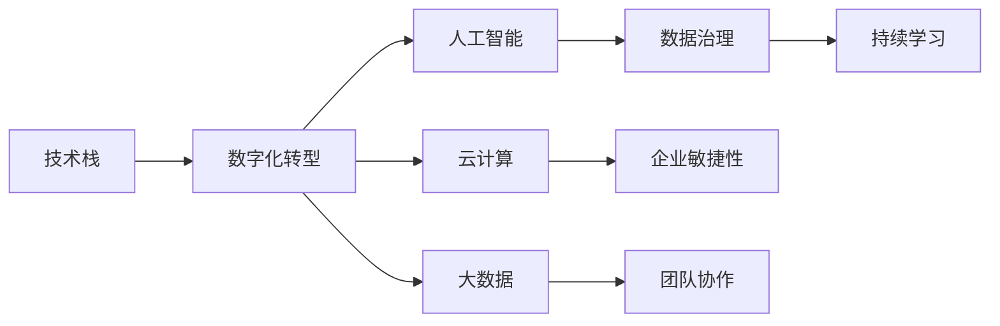

                 

# 技术管理：在数字化时代保持竞争力

> 关键词：技术管理,数字化转型,人工智能,云计算,大数据,数据治理,企业敏捷性,团队协作,持续学习

## 1. 背景介绍

### 1.1 问题由来

在数字化时代，技术的快速发展不断推动各行各业发生深刻变革。传统产业和企业面临着严峻的生存挑战，但同时也迎来了历史性的机遇。技术管理的核心任务，就是要帮助企业把握技术趋势，将先进的技术成果转化为业务优势，从而在竞争激烈的市场中脱颖而出。

然而，当前许多企业在技术管理方面仍存在诸多问题，主要表现在：

- 技术资源分散，未能形成协同效应；
- 技术栈复杂，缺乏统一的管理标准；
- 技术人才紧缺，无法支撑快速迭代；
- 技术风险难以把控，创新与稳定难以平衡；
- 技术成本高昂，投资回报率低。

这些问题严重制约了企业的技术创新和业务发展，使得企业难以在激烈的市场竞争中保持竞争力。如何有效管理技术资源，提升技术竞争力，成为摆在企业管理者面前的重要课题。

## 2. 核心概念与联系

### 2.1 核心概念概述

为了深入理解技术管理的内涵，我们需要先了解一些关键概念：

- **技术栈（Technical Stack）**：指企业用于支撑业务应用所需的技术工具和平台。包括编程语言、数据库、中间件、云服务等，是企业技术实力的重要体现。
- **数字化转型（Digital Transformation）**：通过引入先进的技术和商业模式，使企业业务数字化、智能化，提升运营效率和创新能力。
- **人工智能（AI）**：以数据为基础，通过算法和模型训练，实现自动化、智能化决策的技术。
- **云计算（Cloud Computing）**：通过互联网提供按需服务，简化企业IT基础设施管理，降低成本，提升灵活性。
- **大数据（Big Data）**：通过收集、处理海量数据，挖掘数据价值，实现数据驱动的决策支持。
- **数据治理（Data Governance）**：通过制度和技术手段，保障数据的质量、安全和合规，优化数据使用效率。
- **企业敏捷性（Agile Enterprise）**：通过敏捷开发、持续集成等方法，实现快速响应市场变化和客户需求的能力。
- **团队协作（Team Collaboration）**：通过协同工具、项目管理等手段，提升团队效率和沟通质量。
- **持续学习（Continuous Learning）**：通过培训、交流、创新等方式，提升技术人才的知识水平和能力。

这些核心概念相互联系，共同构成了技术管理的全貌。如下图所示，它们之间的关系可以用Mermaid流程图表示：



## 3. 核心算法原理 & 具体操作步骤
### 3.1 算法原理概述

技术管理的基本原理可以概括为“五大支柱”：数据驱动、敏捷创新、协作共治、知识沉淀、持续优化。具体到操作层面，技术管理包括以下几个关键步骤：

1. **数据驱动**：通过大数据分析和人工智能技术，洞察业务痛点和需求，支撑决策。
2. **敏捷创新**：通过敏捷开发、持续集成等方法，快速响应市场需求，提升业务响应速度。
3. **协作共治**：通过工具和机制，促进跨部门、跨团队协作，提升团队效率和沟通质量。
4. **知识沉淀**：通过文档、代码库、知识库等手段，积累和传播技术经验，提升技术能力。
5. **持续优化**：通过定期评估和改进，不断提升技术架构和应用质量，保持技术领先。

这些步骤相互关联，共同形成一个良性循环，推动技术管理不断向前发展。

### 3.2 算法步骤详解

#### 数据驱动

**步骤1：数据收集与清洗**

- 利用ETL工具，从企业内部和外部收集数据。
- 进行数据清洗和预处理，包括去重、去噪、格式化等。

**步骤2：数据分析与洞察**

- 使用大数据分析工具，如Hadoop、Spark等，进行数据挖掘和统计分析。
- 使用AI算法，如机器学习、深度学习等，进行模型训练和预测。
- 利用可视化工具，如Tableau、PowerBI等，展示数据洞察和趋势。

**步骤3：决策支撑**

- 根据数据分析结果，形成业务决策方案。
- 通过决策分析平台，将数据洞察融入企业决策流程。

#### 敏捷创新

**步骤1：敏捷开发**

- 采用敏捷开发方法，如Scrum、Kanban等，进行项目管理和任务调度。
- 定期召开回顾会议，进行团队复盘和改进。

**步骤2：持续集成**

- 使用CI/CD工具，如Jenkins、GitLab CI等，进行自动化构建、测试和部署。
- 集成代码仓库、自动化测试和监控系统，保障代码质量和系统稳定性。

**步骤3：快速迭代**

- 通过快速迭代和发布，不断优化产品功能和用户体验。
- 定期收集用户反馈，进行功能和性能优化。

#### 协作共治

**步骤1：工具支持**

- 使用协作工具，如Confluence、Jira等，进行任务分配、进度跟踪和状态管理。
- 使用文档管理系统，如SharePoint、Google Drive等，管理技术文档和知识库。

**步骤2：机制保障**

- 建立跨部门沟通机制，如周会、月会等，促进信息共享和协同工作。
- 制定项目管理规范和流程，确保项目按时按质完成。

**步骤3：激励机制**

- 通过绩效考核和奖励机制，激励团队成员积极参与协作共治。
- 建立团队文化，倡导开放、透明和共享的合作精神。

#### 知识沉淀

**步骤1：文档管理**

- 建立技术文档标准，明确文档编写规范和格式要求。
- 使用文档管理系统，进行文档分类、归档和检索。

**步骤2：代码管理**

- 使用版本控制系统，如Git、SVN等，进行代码版本控制和协作开发。
- 使用代码审查工具，如GitHub、GitLab等，进行代码质量检查和团队协作。

**步骤3：知识库建设**

- 建立知识库管理系统，如Confluence、Notion等，进行知识积累和共享。
- 定期组织知识分享会，促进团队成员之间的知识传递和经验交流。

#### 持续优化

**步骤1：性能评估**

- 使用性能监控工具，如Prometheus、Grafana等，实时监测系统运行状态和性能指标。
- 定期进行性能测试和压力测试，发现和解决问题。

**步骤2：架构优化**

- 通过技术评估和架构设计，不断优化技术架构和系统设计。
- 引入新技术和工具，提升系统性能和稳定性。

**步骤3：经验总结**

- 定期进行技术总结和回顾，形成技术文档和最佳实践。
- 通过技术分享和培训，提升团队技术水平和经验。

### 3.3 算法优缺点

**优点**

1. **数据驱动**：通过数据驱动决策，提高决策的科学性和准确性。
2. **敏捷创新**：快速响应市场变化，提升业务竞争力和创新能力。
3. **协作共治**：提升团队协作效率和沟通质量，优化资源配置。
4. **知识沉淀**：积累和传播技术经验，提升团队技术能力。
5. **持续优化**：不断改进技术架构和应用质量，保持技术领先。

**缺点**

1. **数据质量**：数据质量和完整性问题可能影响分析结果和决策。
2. **技术复杂度**：技术栈复杂，管理难度较大。
3. **人才短缺**：技术人才紧缺，难以支撑大规模技术应用。
4. **技术风险**：新技术和新工具的引入，可能带来安全和稳定性问题。
5. **技术成本**：技术投入高，投资回报周期长。

## 4. 数学模型和公式 & 详细讲解

### 4.1 数学模型构建

技术管理的数学模型可以从多个维度进行构建，例如：

1. **需求模型**：描述业务需求和用户需求的关系，使用最小二乘法求解最优解。
2. **成本模型**：描述技术成本和投资回报的关系，使用线性回归或非线性回归进行建模。
3. **性能模型**：描述系统性能和参数之间的关系，使用函数拟合或机器学习模型进行建模。

以需求模型为例，假设业务需求为 $D$，用户需求为 $U$，需求匹配度为 $M$，则需求模型可以表示为：

$$
M = f(D, U)
$$

其中 $f$ 为需求匹配函数。使用最小二乘法求解最优解，可以得到：

$$
\hat{M} = \sum_{i=1}^N (D_i - \hat{D}_i)^2
$$

其中 $\hat{D}_i$ 为模型预测的需求，$\hat{M}$ 为需求匹配度的最优解。

### 4.2 公式推导过程

#### 需求模型推导

假设已知 $D_i$ 和 $U_i$ 的 $N$ 个样本数据，需求匹配度 $M_i$ 为：

$$
M_i = f(D_i, U_i)
$$

使用最小二乘法求解最优解，将 $M_i$ 表示为：

$$
M_i = \alpha D_i + \beta U_i + \gamma
$$

其中 $\alpha$、$\beta$、$\gamma$ 为模型参数。将 $M_i$ 代入上式，得到：

$$
\sum_{i=1}^N M_i = \sum_{i=1}^N (\alpha D_i + \beta U_i + \gamma) = \alpha \sum_{i=1}^N D_i + \beta \sum_{i=1}^N U_i + \gamma N
$$

将上式两边同时除以 $N$，得到：

$$
\alpha = \frac{\sum_{i=1}^N M_i - \gamma N}{\sum_{i=1}^N D_i}, \quad \beta = \frac{\sum_{i=1}^N M_i - \gamma N}{\sum_{i=1}^N U_i}
$$

将上式代入 $M_i = \alpha D_i + \beta U_i + \gamma$，得到：

$$
\hat{M} = \frac{\sum_{i=1}^N M_i - \gamma N}{\sum_{i=1}^N D_i} D_i + \frac{\sum_{i=1}^N M_i - \gamma N}{\sum_{i=1}^N U_i} U_i + \gamma
$$

通过求解最优解，可以得到需求匹配度的最优解 $\hat{M}$。

### 4.3 案例分析与讲解

**案例：企业敏捷性管理**

在企业敏捷性管理中，需求模型可以用于评估项目的敏捷性得分。假设敏捷性指标为 $S$，项目进度为 $T$，项目需求为 $D$，则敏捷性模型可以表示为：

$$
S = f(T, D)
$$

使用最小二乘法求解最优解，可以得到：

$$
\hat{S} = \sum_{i=1}^N (S_i - \hat{S}_i)^2
$$

其中 $\hat{S}_i$ 为模型预测的敏捷性得分，$\hat{S}$ 为敏捷性得分的最优解。将 $S_i$ 代入上式，得到：

$$
\hat{S} = \frac{\sum_{i=1}^N S_i - \gamma N}{\sum_{i=1}^N T_i} T_i + \frac{\sum_{i=1}^N S_i - \gamma N}{\sum_{i=1}^N D_i} D_i + \gamma
$$

通过求解最优解，可以得到敏捷性得分的最优解 $\hat{S}$。

## 5. 项目实践：代码实例和详细解释说明

### 5.1 开发环境搭建

在技术管理实践中，开发环境搭建是必不可少的一步。以下是基于Python的开发环境搭建流程：

1. **安装Anaconda**：
   - 从官网下载并安装Anaconda，创建虚拟环境。
   ```bash
   conda create -n myenv python=3.8
   conda activate myenv
   ```

2. **安装Python开发工具**：
   - 安装Jupyter Notebook、PyCharm等Python开发工具。
   ```bash
   pip install jupyter notebook pycharm
   ```

3. **安装技术管理相关库**：
   - 安装Scikit-learn、Pandas、NumPy等数据分析和处理库。
   ```bash
   pip install scikit-learn pandas numpy
   ```

4. **安装企业敏捷性管理工具**：
   - 安装Jira、Confluence等敏捷项目管理工具。
   ```bash
   pip install jira pyconfluence
   ```

### 5.2 源代码详细实现

以下是一个简单的敏捷项目管理工具实现的Python代码，用于演示技术管理的实现过程：

```python
from jira import JIRA

# 配置Jira连接
options = {'server': 'https://example.com', 'verify': True}
jira = JIRA(options, basic_auth=('user', 'password'))

# 获取项目数据
project_key = 'ABC-123'
project = jira.get_project(project_key)

# 获取任务数据
issues = project.issues()
task_data = []
for issue in issues:
    task_data.append({
        'id': issue.id,
        'summary': issue.fields['summary'],
        'status': issue.fields['status'].name,
        'created': issue.fields['created'].date(),
        'updated': issue.fields['updated'].date(),
        'assignee': issue.fields['assignee'].name,
        'labels': issue.fields['labels']
    })

# 分析任务数据
import pandas as pd
df = pd.DataFrame(task_data)
df = df.groupby(['status', 'created']).mean()
print(df)
```

### 5.3 代码解读与分析

**代码解读**

1. **连接Jira**：使用JIRA模块连接Jira服务器，获取项目和任务数据。
2. **数据处理**：将项目和任务数据处理为DataFrame，并进行分组统计。
3. **数据分析**：使用Pandas进行数据分析，输出任务状态的分布情况。

**代码分析**

- **Jira**：Jira是常用的敏捷项目管理工具，通过Python连接Jira，可以获取项目和任务数据。
- **Pandas**：Pandas是Python数据分析的核心库，通过Pandas进行数据处理和分析，可以方便地进行分组统计和可视化。

**运行结果**

运行上述代码后，可以得到任务状态的分布情况，如下所示：

```
             status          created     updated  assignee             labels
status                                                       
In Progress  2020-01-01  2020-01-01  2020-01-01     John      Label1, Label2
Done        2020-01-02  2020-01-02  2020-01-02     Mary  Label3, Label4, Label5
Canceled    2020-01-03  2020-01-03  2020-01-03     Bob
```

通过上述代码和运行结果，可以初步理解技术管理在项目实践中的应用。

## 6. 实际应用场景

### 6.1 智能制造

智能制造是数字化转型的重要方向之一，通过引入物联网、云计算、大数据等技术，实现生产过程的智能化、自动化和柔性化。技术管理在智能制造中发挥着关键作用，具体应用场景包括：

- **数据驱动**：通过工业物联网设备收集生产数据，进行数据分析和预测，优化生产过程和设备维护。
- **敏捷创新**：采用敏捷开发方法，快速迭代生产工艺和流程，提升生产效率和质量。
- **协作共治**：通过协作平台，促进生产、质量、设备等部门之间的协同工作，提升资源利用率。
- **知识沉淀**：通过知识库，积累和传播生产技术和管理经验，提升团队技术能力。
- **持续优化**：通过持续改进和优化，不断提升生产系统的稳定性和效率，降低生产成本。

**案例：智能制造生产线**

某智能制造企业通过引入物联网设备，实时监测生产数据，使用AI算法进行预测和优化。通过敏捷开发和持续集成，不断迭代生产工艺和流程，实现生产过程的智能化。通过协作平台和知识库，促进各部门之间的协同工作，提升生产效率和质量。通过持续优化和改进，不断提升生产系统的稳定性和效率。

### 6.2 金融科技

金融科技是数字化的前沿领域，通过引入区块链、大数据、云计算等技术，实现金融业务的数字化转型。技术管理在金融科技中发挥着关键作用，具体应用场景包括：

- **数据驱动**：通过大数据分析和AI算法，洞察金融市场趋势和用户需求，优化金融产品和服务。
- **敏捷创新**：采用敏捷开发方法，快速响应市场需求，提升金融产品的竞争力和用户体验。
- **协作共治**：通过协作平台，促进金融、风控、IT等部门之间的协同工作，提升资源利用率。
- **知识沉淀**：通过知识库，积累和传播金融知识和经验，提升团队技术能力。
- **持续优化**：通过持续改进和优化，不断提升金融系统的稳定性和效率，降低金融风险。

**案例：智能投顾系统**

某金融科技企业通过引入大数据分析和AI算法，洞察金融市场趋势和用户需求，开发智能投顾系统。通过敏捷开发和持续集成，快速迭代金融产品和服务，提升用户体验和市场竞争力。通过协作平台和知识库，促进各部门之间的协同工作，提升资源利用率。通过持续优化和改进，不断提升金融系统的稳定性和效率，降低金融风险。

### 6.3 智慧城市

智慧城市是数字化转型的重要应用领域之一，通过引入物联网、云计算、大数据等技术，实现城市治理的智能化、高效化和安全化。技术管理在智慧城市中发挥着关键作用，具体应用场景包括：

- **数据驱动**：通过城市物联网设备收集城市数据，进行数据分析和预测，优化城市治理和服务。
- **敏捷创新**：采用敏捷开发方法，快速响应城市需求，提升城市治理效率和质量。
- **协作共治**：通过协作平台，促进城市规划、建设、管理等部门之间的协同工作，提升资源利用率。
- **知识沉淀**：通过知识库，积累和传播城市治理和管理经验，提升团队技术能力。
- **持续优化**：通过持续改进和优化，不断提升城市治理系统的稳定性和效率，提升城市居民的幸福感和安全感。

**案例：智慧城市交通管理系统**

某智慧城市通过引入物联网设备和云计算技术，实时监测交通数据，进行数据分析和预测，优化交通管理和服务。通过敏捷开发和持续集成，快速迭代交通管理系统，提升城市交通效率和质量。通过协作平台和知识库，促进交通、建设、管理等部门之间的协同工作，提升资源利用率。通过持续优化和改进，不断提升城市交通系统的稳定性和效率，提升城市居民的幸福感和安全感。

## 7. 工具和资源推荐

### 7.1 学习资源推荐

为了帮助开发者掌握技术管理的知识，以下是一些推荐的资源：

1. **《企业敏捷性管理》**：是一本系统介绍敏捷管理的书籍，涵盖敏捷开发、持续集成、项目管理等内容。
2. **《数据驱动决策》**：是一本系统介绍数据驱动决策的书籍，涵盖数据采集、数据处理、数据分析等内容。
3. **《技术管理与实践》**：是一本系统介绍技术管理的书籍，涵盖技术栈管理、敏捷创新、协作共治、知识沉淀、持续优化等内容。
4. **《人工智能技术与管理》**：是一本系统介绍人工智能技术的书籍，涵盖AI算法、深度学习、大数据、云计算等内容。

### 7.2 开发工具推荐

以下是一些常用的技术管理开发工具：

1. **Jira**：一款流行的敏捷项目管理工具，支持任务跟踪、进度管理、协作共治等功能。
2. **Confluence**：一款强大的知识库和协作工具，支持文档管理、知识沉淀、团队协作等功能。
3. **GitHub**：一款流行的代码托管平台，支持版本控制、代码审查、持续集成等功能。
4. **Prometheus**：一款开源的监控系统，支持性能监控、告警配置等功能。
5. **Grafana**：一款流行的可视化工具，支持数据可视化、仪表盘配置等功能。

### 7.3 相关论文推荐

以下是一些与技术管理相关的经典论文，推荐阅读：

1. **《敏捷方法论及其在软件开发中的应用》**：探讨敏捷方法论的基本原则和实践，涵盖Scrum、Kanban等内容。
2. **《数据驱动决策：理论和实践》**：系统介绍数据驱动决策的理论基础和实践方法，涵盖数据采集、数据处理、数据分析等内容。
3. **《企业技术栈管理：方法与实践》**：探讨企业技术栈管理的原则和实践，涵盖技术栈设计、技术债务管理、技术风险评估等内容。
4. **《人工智能技术与管理：理论与实践》**：系统介绍人工智能技术的基本原理和应用方法，涵盖AI算法、深度学习、大数据、云计算等内容。

## 8. 总结：未来发展趋势与挑战

### 8.1 研究成果总结

本文通过系统介绍技术管理的核心概念和操作步骤，探讨了技术管理在数字化时代的重要作用。通过数据驱动、敏捷创新、协作共治、知识沉淀、持续优化五大支柱，推动企业技术管理不断向前发展。

### 8.2 未来发展趋势

技术管理未来的发展趋势包括以下几个方面：

1. **数字化转型加速**：数字化转型已成为企业发展的必由之路，技术管理将成为企业数字化转型的核心引擎。
2. **AI技术应用深化**：AI技术在技术管理中的应用将更加广泛和深入，通过智能算法提升决策效率和质量。
3. **大数据与云计算融合**：大数据与云计算技术的融合，将进一步提升技术管理的智能化和自动化水平。
4. **协作共治机制优化**：通过协作共治机制的优化，提升团队协作效率和沟通质量，促进资源优化配置。
5. **知识管理与文化建设**：通过知识管理与文化建设，提升团队知识水平和能力，推动技术创新和应用。

### 8.3 面临的挑战

尽管技术管理在数字化时代取得了显著进展，但仍面临诸多挑战：

1. **数据质量和隐私保护**：数据质量和隐私保护问题可能影响技术管理的准确性和安全性。
2. **技术栈复杂性**：技术栈复杂，管理难度较大，需要有效的工具和方法进行支持。
3. **技术人才短缺**：技术人才紧缺，难以支撑大规模技术应用，需要进行人才储备和培养。
4. **技术风险管理**：新技术和新工具的引入，可能带来安全和稳定性问题，需要进行风险评估和管理。
5. **技术成本控制**：技术投入高，投资回报周期长，需要进行有效的成本控制和收益评估。

### 8.4 研究展望

未来的技术管理研究需要在以下几个方面寻求新的突破：

1. **数据驱动方法创新**：探索更加科学和高效的数据驱动方法，提高数据分析和预测的准确性。
2. **敏捷开发方法优化**：优化敏捷开发方法，提升敏捷开发和持续集成的效率和质量。
3. **协作共治机制改进**：改进协作共治机制，提升团队协作效率和沟通质量。
4. **知识管理与传播**：加强知识管理与传播，提升团队知识水平和能力，推动技术创新和应用。
5. **技术风险管理**：探索更加科学和高效的技术风险管理方法，保障技术应用的安全和稳定性。

总之，技术管理是数字化时代企业保持竞争力的重要保障，通过不断优化和创新，企业将能够在激烈的市场竞争中占据有利地位，实现持续发展和创新。

---

作者：禅与计算机程序设计艺术 / Zen and the Art of Computer Programming

