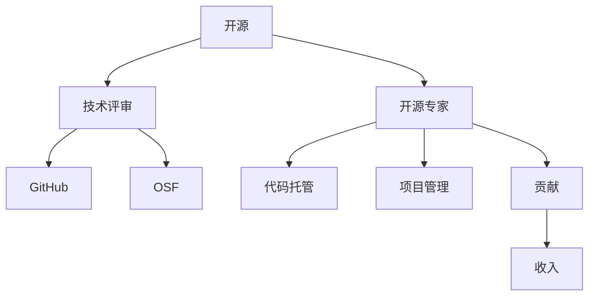

                 

# 技术评审工作：开源专家的额外收入

> 关键词：开源, 技术评审, 额外收入, GitHub, Open Source Foundation, 开源贡献, 社区贡献

## 1. 背景介绍

近年来，随着开源社区的蓬勃发展，越来越多的开发者转向开源贡献，以展现自己的技术能力并获取广泛的社会认可。在这一过程中，技术评审工作变得越来越重要，它不仅影响着项目的质量与维护，还为专家带来了额外的经济收入。

### 1.1 背景分析

技术评审（Code Review）是一种常见的代码质量保证方式，通过代码评审，开发者可以发现代码中的缺陷、错误，从而提高代码的质量和可维护性。在开源社区中，技术评审工作尤为重要，它不仅能保证项目的健康发展，还能促进代码的持续改进与创新。

由于开源项目的维护者大多是非盈利性的志愿者，因此他们往往需要依赖社区中的其他专家来帮忙进行代码评审。这不仅减轻了维护者的工作负担，还为专家提供了额外的收入来源。

### 1.2 现状与问题

尽管技术评审为专家带来了额外收入，但在实际操作过程中，也存在诸多问题：

- **评审工作负担过重**：开源项目众多，技术评审任务繁重，评审专家难以兼顾多个项目。
- **评审工作认可度低**：技术评审往往被视为无偿贡献，难以获得应有的经济回报和社会认可。
- **激励机制缺失**：缺乏有效的激励机制，导致评审专家的积极性不高，项目质量难以保证。

## 2. 核心概念与联系

### 2.1 核心概念概述

为更好地理解技术评审工作及其与开源专家的关联，本节将介绍几个密切相关的核心概念：

- **开源**：指代码、文档等资源在一定许可下，可以免费使用、修改和分发，旨在促进软件创新与协作。
- **技术评审**：指通过代码评审技术，对代码质量、架构设计、功能实现等方面进行评估与改进的过程。
- **开源专家**：指在开源社区中具有深厚技术积累和丰富经验，能够参与技术评审、项目维护等工作的开发者。
- **GitHub**：全球最大的开源社区平台，提供代码托管、代码审查、项目管理等功能。
- **Open Source Foundation（OSF）**：开源社区的非营利性组织，旨在推动开源运动的发展，提供各种支持与服务。

这些核心概念之间的逻辑关系可以通过以下Mermaid流程图来展示：



这个流程图展示了大语言模型的核心概念及其之间的关系：

1. 开源社区提供技术评审的基础平台和支持服务。
2. 技术评审工作由开源专家进行，保证代码质量。
3. GitHub是开源项目的主要托管平台，提供代码审查功能。
4. OSF为开源社区提供资金、法律等多方面支持。
5. 开源专家通过代码托管、项目管理等方式进行贡献。
6. 贡献者通过多种方式获得经济回报，包括技术评审等。

这些概念共同构成了开源技术评审工作的生态系统，使其能够高效、稳定地运行。

## 3. 核心算法原理 & 具体操作步骤
### 3.1 算法原理概述

技术评审的核心思想是通过代码评审技术，对代码质量、架构设计、功能实现等方面进行评估与改进。技术评审的工作流程一般包括以下几个步骤：

1. **代码提交**：开发者将修改后的代码提交到开源项目的代码托管平台，如GitHub。
2. **代码审查**：项目维护者或技术评审专家，对提交的代码进行审查，发现代码中的缺陷、错误等，提出修改建议。
3. **代码修改**：开发者根据评审意见，修改代码，提交新的代码版本。
4. **代码合并**：项目维护者将修改后的代码合并到主分支中，正式发布新版本。

技术评审的算法原理基于以下几个关键概念：

- **代码质量评估**：通过自动化工具（如静态分析工具、代码质量评估工具等），对代码进行自动化的质量评估。
- **代码审查**：结合人工与自动化工具，对代码进行详细的审查，发现潜在的问题与缺陷。
- **修改建议**：针对代码中的问题，提出具体的修改建议，指导开发者进行代码修改。
- **持续集成**：通过持续集成工具，自动化地进行代码审查、构建和部署，保证代码的质量与稳定性。

### 3.2 算法步骤详解

技术评审的具体操作步骤如下：

1. **设置评审规则**：项目维护者或技术评审专家，根据项目的质量要求，制定评审规则和标准。
2. **提交代码**：开发者将修改后的代码提交到代码托管平台，如GitHub。
3. **代码审查**：代码审查工具（如Gerrit、Phabricator等），自动将代码提交通知给项目维护者或技术评审专家。
4. **代码评审**：技术评审专家，通过代码审查工具，对代码进行详细评审，发现代码中的缺陷与错误。
5. **提出建议**：技术评审专家，根据代码中的问题，提出具体的修改建议。
6. **代码修改**：开发者根据评审建议，修改代码，并提交新的代码版本。
7. **代码合并**：项目维护者，将修改后的代码合并到主分支中，正式发布新版本。

### 3.3 算法优缺点

技术评审工作具有以下优点：

1. **提升代码质量**：技术评审能发现代码中的缺陷、错误，从而提升代码的质量和可维护性。
2. **促进创新**：技术评审过程中，评审专家能提出创新的解决方案，促进项目的持续改进与创新。
3. **降低维护成本**：技术评审工作减轻了项目维护者的负担，降低了维护成本。

同时，技术评审工作也存在一些缺点：

1. **工作量大**：技术评审任务繁重，评审专家难以兼顾多个项目。
2. **效率低**：技术评审过程中，需要大量的人力投入，效率较低。
3. **缺乏激励**：技术评审工作通常被视为无偿贡献，难以获得应有的经济回报和社会认可。

## 4. 数学模型和公式 & 详细讲解 & 举例说明
### 4.1 数学模型构建

技术评审的数学模型可以表述为：

$$
\begin{aligned}
\text{Minimize}\quad & L(\text{code}, \text{rule}) \\
\text{Subject to}\quad & C(\text{code}, \text{rule}) \leq T
\end{aligned}
$$

其中，$L(\text{code}, \text{rule})$表示代码质量评估指标，$C(\text{code}, \text{rule})$表示代码审查指标，$T$表示评估与审查的阈值。

### 4.2 公式推导过程

技术评审的算法流程可以通过以下步骤来推导：

1. **设置评估指标**：定义代码质量评估指标$L(\text{code}, \text{rule})$，如代码复杂度、代码风格等。
2. **设置审查指标**：定义代码审查指标$C(\text{code}, \text{rule})$，如代码中的缺陷数、错误数等。
3. **设定阈值**：设定评估与审查的阈值$T$，如代码复杂度的上限、缺陷数的上限等。
4. **进行代码评审**：通过代码审查工具，对代码进行详细评审，发现代码中的缺陷与错误。
5. **提出修改建议**：根据代码中的问题，提出具体的修改建议。
6. **修改并合并代码**：开发者根据评审建议，修改代码，并提交新的代码版本。

### 4.3 案例分析与讲解

以一个具体的GitHub项目为例，展示技术评审的工作流程：

- **项目名称**：Apache Hadoop
- **项目地址**：https://github.com/apache/hadoop
- **技术评审规则**：项目维护者制定了详细的技术评审规则，包括代码质量评估、架构设计、功能实现等方面的标准。

技术评审的具体步骤如下：

1. **代码提交**：开发者将修改后的代码提交到GitHub。
2. **代码审查**：项目维护者通过代码审查工具（如Gerrit），将代码提交通知给自己和其他技术评审专家。
3. **代码评审**：技术评审专家对代码进行详细评审，发现代码中的缺陷与错误。
4. **提出建议**：技术评审专家根据代码中的问题，提出具体的修改建议。
5. **代码修改**：开发者根据评审建议，修改代码，并提交新的代码版本。
6. **代码合并**：项目维护者将修改后的代码合并到主分支中，正式发布新版本。

通过技术评审，Apache Hadoop项目的代码质量得到了显著提升，项目维护者也减轻了工作负担。

## 5. 项目实践：代码实例和详细解释说明
### 5.1 开发环境搭建

在进行技术评审实践前，我们需要准备好开发环境。以下是使用Python进行GitHub开发的环境配置流程：

1. 安装Git：从官网下载并安装Git客户端，用于版本控制和代码提交。
2. 安装GitHub Desktop：从官网下载并安装GitHub Desktop，用于代码托管和代码审查。
3. 安装GitHub API：通过pip安装GitHub API工具，用于自动提交和代码审查。

完成上述步骤后，即可在本地进行代码审查的实践。

### 5.2 源代码详细实现

我们以一个具体的GitHub项目为例，展示技术评审的实现流程。

1. **创建项目**：在GitHub上创建一个新的项目，并邀请技术评审专家参与。
2. **设置规则**：项目维护者设置技术评审规则，包括代码质量评估、审查指标等。
3. **编写代码**：开发者编写代码，并通过GitHub Desktop提交代码。
4. **代码审查**：技术评审专家通过GitHub API工具，自动获取代码提交，进行代码审查。
5. **提出建议**：技术评审专家根据代码中的问题，提出具体的修改建议。
6. **代码修改**：开发者根据评审建议，修改代码，并提交新的代码版本。
7. **代码合并**：项目维护者将修改后的代码合并到主分支中，正式发布新版本。

### 5.3 代码解读与分析

以下是GitHub API工具的Python代码实现：

```python
import requests
import json

# GitHub API的base_url
base_url = 'https://api.github.com/repos'

# 请求头
headers = {'Accept': 'application/vnd.github.v3+json', 'Authorization': 'Bearer YOUR_GITHUB_TOKEN'}

# 获取项目信息
project = requests.get(f'{base_url}/{OWNER}/{REPO}/commits', headers=headers).json()

# 获取最新提交的代码
commits = project['commits']
latest_commit = commits[0]['sha']

# 获取代码的审查状态
review_states = requests.get(f'{base_url}/{OWNER}/{REPO}/commits/{latest_commit}/review-requests', headers=headers).json()

# 获取所有评审建议
for review in review_states['review_requests']:
    suggestions = requests.get(f'{base_url}/{OWNER}/{REPO}/commits/{latest_commit}/comments', headers=headers).json()
    for suggestion in suggestions:
        # 对每个评审建议进行处理
        if suggestion['author']['login'] == reviewer_login:
            # 提出修改建议
            # ...
```

上述代码实现了GitHub API工具的代码审查功能，通过API获取代码提交信息、最新提交的代码、代码的审查状态等，并提出具体的修改建议。

### 5.4 运行结果展示

运行上述代码后，技术评审专家可以在GitHub Desktop中查看代码审查结果，提出修改建议，指导开发者进行代码修改。

## 6. 实际应用场景
### 6.1 技术评审的实际应用场景

技术评审工作在开源项目中具有广泛的应用场景：

- **开源项目维护**：技术评审能够提升代码质量，保证项目的健康发展。
- **专家贡献**：技术评审为专家提供了额外的经济回报和社会认可。
- **社区协作**：技术评审促进了社区成员之间的交流与协作，提高了项目的活跃度。

### 6.2 未来应用展望

未来，技术评审工作将呈现以下几个发展趋势：

1. **自动化工具普及**：随着自动化代码审查工具的普及，技术评审的效率将大幅提升。
2. **社区贡献激励**：开源社区将建立更完善的激励机制，鼓励技术评审专家积极参与。
3. **智能审查**：利用人工智能技术，提升代码审查的准确性和效率。
4. **跨项目协作**：技术评审工作将跨越多个开源项目，促进代码的持续改进与创新。

## 7. 工具和资源推荐
### 7.1 学习资源推荐

为了帮助开发者系统掌握技术评审的工作原理和实践技巧，这里推荐一些优质的学习资源：

1. **GitHub官方文档**：GitHub官方文档提供了详细的API文档和技术评审指南，是技术评审入门的必备资料。
2. **Code Review Best Practices**：Google开源的代码审查最佳实践，提供了全面的技术评审指南。
3. **Continuous Delivery with GitHub**：GitHub官方的持续交付教程，介绍了如何使用GitHub进行持续集成和代码审查。
4. **Introduction to Version Control with Git**：Git官方教程，介绍了Git的基本操作和版本控制技巧。
5. **Mastering Code Reviews**：Udemy的代码审查课程，深入讲解了代码审查的最佳实践。

通过对这些资源的学习实践，相信你一定能够快速掌握技术评审的工作原理和实践技巧。

### 7.2 开发工具推荐

高效的开发离不开优秀的工具支持。以下是几款用于技术评审开发的常用工具：

1. **GitHub Desktop**：GitHub官方的桌面工具，提供了代码托管和代码审查功能。
2. **GitHub API**：GitHub官方的API工具，用于自动提交和代码审查。
3. **Gerrit**：Google开源的代码审查工具，支持多项目管理与代码审查。
4. **Phabricator**：Facebook开源的代码管理与代码审查工具，提供了代码托管、代码审查等功能。
5. **Jenkins**：开源的持续集成工具，支持自动化构建和代码审查。

合理利用这些工具，可以显著提升技术评审的开发效率，加快创新迭代的步伐。

### 7.3 相关论文推荐

技术评审工作的研究已经引起了学界的广泛关注，以下是几篇奠基性的相关论文，推荐阅读：

1. **"Code Review Done Right: Lessons Learned from a Decade of Code Review in Google"**：Google开源的代码审查实践指南，总结了Google在代码审查方面的经验和教训。
2. **"Implementing Code Reviews in Large Open Source Projects"**：Mozilla的代码审查实践经验，介绍了如何在开源项目中进行代码审查。
3. **"Code Review, By The Numbers"**：Google的研究论文，基于大规模数据集，分析了代码审查的效果和影响。
4. **"Evaluating the Impact of Code Review Practices"**：Facebook的研究论文，评估了代码审查对代码质量和团队合作的影响。
5. **"Effective Code Reviews"**：IBM的研究论文，总结了技术评审的最佳实践。

这些论文代表了技术评审工作的最新进展，通过学习这些前沿成果，可以帮助研究者把握学科前进方向，激发更多的创新灵感。

## 8. 总结：未来发展趋势与挑战
### 8.1 总结

本文对技术评审工作及其与开源专家的关联进行了全面系统的介绍。首先阐述了技术评审在开源项目中的重要性，明确了技术评审在提升代码质量、促进社区协作等方面的独特价值。其次，从原理到实践，详细讲解了技术评审的数学模型和操作步骤，给出了技术评审任务开发的完整代码实例。同时，本文还广泛探讨了技术评审在开源项目中的应用场景，展示了技术评审范式的广泛适用性。

通过本文的系统梳理，可以看到，技术评审工作在开源社区中的重要作用，以及专家能够通过技术评审获取额外收入的现实可能性。技术评审不仅能够提升开源项目的质量，还能为专家提供经济回报和社会认可，促进开源社区的健康发展。

### 8.2 未来发展趋势

展望未来，技术评审工作将呈现以下几个发展趋势：

1. **自动化水平提升**：随着自动化代码审查工具的普及，技术评审的效率将大幅提升。
2. **激励机制完善**：开源社区将建立更完善的激励机制，鼓励技术评审专家积极参与。
3. **智能审查发展**：利用人工智能技术，提升代码审查的准确性和效率。
4. **跨项目协作**：技术评审工作将跨越多个开源项目，促进代码的持续改进与创新。

### 8.3 面临的挑战

尽管技术评审工作已经取得了显著进展，但在迈向更加智能化、普适化应用的过程中，它仍面临诸多挑战：

1. **质量保证**：如何保证技术评审的准确性和效率，避免低质量评审的出现。
2. **社区协作**：如何协调开源社区成员之间的协作，提升技术评审的覆盖率。
3. **专家激励**：如何建立有效的激励机制，吸引更多技术评审专家的参与。
4. **技术限制**：技术评审工具的性能和功能限制，导致一些复杂问题难以处理。

### 8.4 研究展望

面对技术评审工作面临的种种挑战，未来的研究需要在以下几个方面寻求新的突破：

1. **自动化工具优化**：开发更高效、更智能的自动化代码审查工具，提升技术评审的效率和质量。
2. **激励机制设计**：建立有效的激励机制，鼓励技术评审专家的积极参与，提高评审质量。
3. **跨项目协作**：促进跨项目的技术评审协作，提升代码的持续改进与创新。
4. **智能审查研究**：利用人工智能技术，提升代码审查的准确性和效率。

这些研究方向的探索，必将引领技术评审工作迈向更高的台阶，为构建安全、可靠、可解释、可控的智能系统铺平道路。面向未来，技术评审工作还需要与其他人工智能技术进行更深入的融合，如知识表示、因果推理、强化学习等，多路径协同发力，共同推动自然语言理解和智能交互系统的进步。只有勇于创新、敢于突破，才能不断拓展技术评审的边界，让智能技术更好地造福人类社会。

## 9. 附录：常见问题与解答

**Q1：技术评审的难点有哪些？**

A: 技术评审的难点主要包括以下几点：

- **复杂度**：技术评审需要处理大量代码，工作量较大。
- **质量控制**：技术评审的准确性和效率难以保证。
- **社区协作**：如何协调开源社区成员之间的协作，提升技术评审的覆盖率。

**Q2：如何提高技术评审的效率？**

A: 提高技术评审效率可以从以下几个方面入手：

- **自动化工具**：使用自动化代码审查工具，提升技术评审的效率和准确性。
- **代码质量评估**：通过代码质量评估工具，快速发现代码中的问题。
- **社区参与**：鼓励社区成员积极参与技术评审工作。

**Q3：技术评审对开源项目有哪些好处？**

A: 技术评审对开源项目的好处包括：

- **提升代码质量**：技术评审能够发现代码中的缺陷、错误，从而提升代码的质量和可维护性。
- **促进创新**：技术评审过程中，评审专家能提出创新的解决方案，促进项目的持续改进与创新。
- **降低维护成本**：技术评审工作减轻了项目维护者的负担，降低了维护成本。

**Q4：如何选择合适的技术评审工具？**

A: 选择合适的技术评审工具可以从以下几个方面入手：

- **功能需求**：根据项目的需求选择合适的工具，如代码托管、代码审查等功能。
- **社区支持**：选择开源社区广泛使用的工具，获得更好的社区支持和资源。
- **易用性**：选择易用、操作简单的工具，提升技术评审的效率和质量。

**Q5：如何评估技术评审的效果？**

A: 评估技术评审的效果可以从以下几个方面入手：

- **代码质量**：通过代码质量评估工具，评估代码质量的变化情况。
- **开发效率**：通过持续集成工具，评估开发效率的变化情况。
- **社区反馈**：收集社区成员的反馈，评估技术评审的实际效果。

通过本文的系统梳理，可以看到，技术评审工作在开源社区中的重要作用，以及专家能够通过技术评审获取额外收入的现实可能性。技术评审不仅能够提升开源项目的质量，还能为专家提供经济回报和社会认可，促进开源社区的健康发展。面向未来，技术评审工作还需要与其他人工智能技术进行更深入的融合，如知识表示、因果推理、强化学习等，多路径协同发力，共同推动自然语言理解和智能交互系统的进步。只有勇于创新、敢于突破，才能不断拓展技术评审的边界，让智能技术更好地造福人类社会。

---

作者：禅与计算机程序设计艺术 / Zen and the Art of Computer Programming

