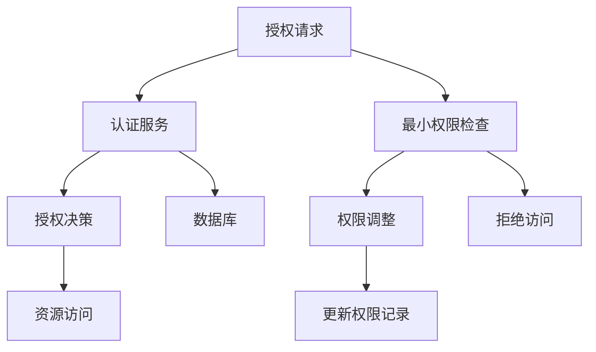

                 

# 授权：遵循最小权限原则

> 关键词：授权机制, 最小权限原则, 系统安全, 信息安全, 访问控制, 风险管理

## 1. 背景介绍

在当今数字化时代，信息系统的授权和访问控制已成为保障信息安全的重要手段。随着企业数字化转型的加速，信息系统的安全性和可靠性要求愈发严格。然而，由于传统授权机制存在设计缺陷和实施漏洞，系统安全事故频发，数据泄露、身份盗用等安全事件时有发生。

本文章旨在深入探讨最小权限原则在授权机制中的应用，通过分析现有授权模型的优缺点，提出基于最小权限原则的授权机制设计方案，结合实际案例，论证其在保障信息安全、降低管理成本和提升用户体验方面的价值。

## 2. 核心概念与联系

### 2.1 核心概念概述

- **授权机制(Authorization Mechanism)**：指信息系统在用户访问资源前，通过策略规则判断用户是否有权限访问特定资源，以防止未授权访问和资源泄露。
- **最小权限原则(Principle of Least Privilege)**：在保障必要权限的前提下，用户应被赋予最少的权限，即只允许其执行必要的工作任务。
- **系统安全(System Security)**：指信息系统通过一系列安全策略，保护数据和系统资源不受未经授权的访问、篡改和破坏。
- **信息安全(Information Security)**：指保护信息资源免受未授权访问、泄露、破坏和不可用等威胁，确保信息的安全性、完整性和可用性。
- **访问控制(Access Control)**：通过策略规则和认证机制，限制用户对系统资源的访问权限，以防止未授权访问和资源泄露。
- **风险管理(Risk Management)**：指通过评估和控制风险，保障信息系统免受潜在威胁和攻击。

以上核心概念紧密相连，最小权限原则是保障系统安全、信息安全和访问控制的重要基础，而访问控制策略的有效性，也直接影响系统风险管理的效果。

### 2.2 核心概念原理和架构的 Mermaid 流程图



## 3. 核心算法原理 & 具体操作步骤

### 3.1 算法原理概述

基于最小权限原则的授权机制，通过最小权限分配、权限检查、权限调整等步骤，确保用户仅获得必要的工作权限，防止权限滥用和资源泄露。

### 3.2 算法步骤详解

#### 3.2.1 最小权限分配

在授权机制设计中，首先要确定各个角色的最小权限需求，根据最小权限原则，给予用户最少但足够的权限，以防止权限滥用。这一过程通常包括以下几个步骤：

1. **角色定义**：根据业务需求，定义系统中的各种角色，如管理员、开发人员、审计员等。
2. **权限映射**：确定每个角色对应的最小权限，例如，管理员可以执行创建、删除、修改和查询系统资源，而开发人员只可以执行创建、修改和查询。
3. **权限分配**：将最小权限分配给各个用户，每个用户只能获得其角色所需的最小权限。

#### 3.2.2 权限检查

在用户访问系统资源时，授权机制需要对用户的权限进行检查，确保用户只能访问其权限范围内的资源。这一过程包括以下几个步骤：

1. **用户认证**：验证用户的身份，确保用户是真实存在的。
2. **权限查询**：根据用户角色和当前请求，查询用户的权限信息。
3. **权限判断**：比较用户请求的资源和其拥有的权限，判断用户是否有访问该资源的权限。

#### 3.2.3 权限调整

在业务运行过程中，用户角色和权限可能发生变化，因此授权机制需要提供权限调整的功能，以适应业务变化。这一过程包括以下几个步骤：

1. **权限变更**：根据业务需求，调整用户角色和权限，例如，用户从开发人员晋升为管理员，其权限从创建、修改和查询扩展到创建、删除、修改和查询。
2. **权限更新**：更新用户的权限信息，确保新的权限设置生效。

### 3.3 算法优缺点

#### 3.3.1 优点

1. **提升安全性**：最小权限原则能够有效防止权限滥用和资源泄露，降低安全风险。
2. **降低管理成本**：最小权限分配能够减少不必要权限的分配，降低管理成本。
3. **提升用户体验**：最小权限分配能够减少用户误操作和权限冲突，提升用户体验。

#### 3.3.2 缺点

1. **授权复杂度增加**：最小权限分配需要详细定义每个角色的权限，增加了授权管理的复杂度。
2. **权限变更频繁**：随着业务变化，用户角色和权限需要频繁调整，增加了管理负担。
3. **权限粒度问题**：最小权限分配需要精确定义每个角色的权限，但在实际应用中，权限粒度难以完全精确，可能导致授权不当。

### 3.4 算法应用领域

基于最小权限原则的授权机制在多个领域均有广泛应用，包括但不限于：

1. **企业信息系统**：用于保障企业内部数据和系统资源的安全，防止未授权访问和资源泄露。
2. **金融行业**：用于保障金融数据的安全，防止数据泄露和盗用。
3. **政府部门**：用于保障政府信息系统的安全，防止信息泄露和滥用。
4. **医疗行业**：用于保障患者数据的安全，防止数据泄露和滥用。

## 4. 数学模型和公式 & 详细讲解

### 4.1 数学模型构建

基于最小权限原则的授权机制，可以通过数学模型进行形式化描述。设用户集合为 $U$，资源集合为 $R$，角色集合为 $R$，权限集合为 $P$，定义如下：

- 角色 $r \in R$ 对应一个权限集合 $P_r \subseteq P$，即角色 $r$ 可以执行的权限集合。
- 用户 $u \in U$ 对应一个角色集合 $R_u \subseteq R$，即用户 $u$ 可以执行的角色集合。
- 权限 $p \in P$ 对应一个资源集合 $R_p \subseteq R$，即权限 $p$ 可以访问的资源集合。

基于以上定义，可以构建一个三元组 $(U, R, P)$ 来描述授权机制，其中：

- $U \times R \rightarrow P$ 表示用户到角色的映射，即用户 $u$ 对应角色 $r$ 的权限集合。
- $P \rightarrow R$ 表示权限到资源的映射，即权限 $p$ 可以访问的资源集合。

### 4.2 公式推导过程

#### 4.2.1 最小权限分配公式

最小权限分配公式为：

$$
\min\{P_r | r \in R_u\}
$$

即用户 $u$ 的最小权限为角色 $r$ 中的最小权限，其中 $r$ 是用户 $u$ 对应的角色集合中的任意角色。

#### 4.2.2 权限检查公式

权限检查公式为：

$$
P_u(r) \cap P_r(p)
$$

即用户 $u$ 是否可以访问权限 $p$ 对应的资源，其中 $P_u(r)$ 表示用户 $u$ 在角色 $r$ 下的权限集合，$P_r(p)$ 表示权限 $p$ 对应的资源集合。

#### 4.2.3 权限调整公式

权限调整公式为：

$$
\min\{P_r | r \in R_v\} \rightarrow P_u(r)
$$

即用户 $u$ 从角色 $r$ 变更到角色 $v$，其权限从 $P_u(r)$ 调整至 $P_u(v)$，其中 $r$ 和 $v$ 是用户 $u$ 变更前后的角色。

### 4.3 案例分析与讲解

#### 4.3.1 最小权限分配案例

某企业有三种角色：管理员 (Manager)、开发人员 (Developer) 和审计员 (Auditor)，其最小权限分配如下：

- 管理员：创建、修改、删除和查询所有资源。
- 开发人员：创建、修改和查询所有资源。
- 审计员：查询所有资源。

假设用户张三 (Alice) 的初始角色为开发人员，其在执行一个创建操作时，其最小权限分配为：

$$
\min\{P_{Developer} | Developer \in R_{Alice}\} = \{创建、修改、查询\}
$$

即张三在创建操作中最小权限为创建、修改和查询。

#### 4.3.2 权限检查案例

当张三执行创建操作时，授权机制需要检查其是否具有创建操作的权限：

- 用户认证：验证张三身份。
- 权限查询：查询张三在管理员角色下的权限集合，即创建、修改、删除和查询。
- 权限判断：检查张三是否具有创建操作的权限，即张三在管理员角色下，创建操作在其权限范围内。

#### 4.3.3 权限调整案例

假设张三从开发人员晋升为管理员，其权限从创建、修改和查询调整至创建、修改、删除和查询：

- 权限变更：张三从开发人员变更至管理员。
- 权限更新：张三的权限从创建、修改和查询调整至创建、修改、删除和查询。

## 5. 项目实践：代码实例和详细解释说明

### 5.1 开发环境搭建

在进行最小权限原则的授权机制实践前，我们需要准备好开发环境。以下是使用Python进行Flask框架开发的环境配置流程：

1. 安装Flask框架：

```bash
pip install flask
```

2. 创建Flask应用：

```python
from flask import Flask, request, jsonify

app = Flask(__name__)

# 定义角色和权限映射
roles = {
    'Manager': ['create', 'modify', 'delete', 'query'],
    'Developer': ['create', 'modify', 'query'],
    'Auditor': ['query']
}

# 定义用户和角色映射
users = {
    'Alice': ['Developer'],
    'Bob': ['Manager']
}

# 定义角色和资源映射
resources = {
    'create': ['resource1', 'resource2'],
    'modify': ['resource1', 'resource2'],
    'delete': ['resource1', 'resource2'],
    'query': ['resource1', 'resource2']
}

@app.route('/authorizations', methods=['POST'])
def get_authorizations():
    data = request.get_json()
    user = data['user']
    resource = data['resource']
    return jsonify({'permissions': get_permissions(user, resource)})

def get_permissions(user, resource):
    user_roles = users.get(user)
    if not user_roles:
        return []
    role_permissions = roles.get(user_roles[0], [])
    return [permission for permission in resources if permission in role_permissions]

if __name__ == '__main__':
    app.run(debug=True)
```

完成上述步骤后，即可在本地启动Flask应用，并通过RESTful接口进行授权查询。

### 5.2 源代码详细实现

下面我们以最小权限原则的授权机制为例，给出使用Flask框架的代码实现。

```python
from flask import Flask, request, jsonify

app = Flask(__name__)

# 定义角色和权限映射
roles = {
    'Manager': ['create', 'modify', 'delete', 'query'],
    'Developer': ['create', 'modify', 'query'],
    'Auditor': ['query']
}

# 定义用户和角色映射
users = {
    'Alice': ['Developer'],
    'Bob': ['Manager']
}

# 定义角色和资源映射
resources = {
    'create': ['resource1', 'resource2'],
    'modify': ['resource1', 'resource2'],
    'delete': ['resource1', 'resource2'],
    'query': ['resource1', 'resource2']
}

@app.route('/authorizations', methods=['POST'])
def get_authorizations():
    data = request.get_json()
    user = data['user']
    resource = data['resource']
    return jsonify({'permissions': get_permissions(user, resource)})

def get_permissions(user, resource):
    user_roles = users.get(user)
    if not user_roles:
        return []
    role_permissions = roles.get(user_roles[0], [])
    return [permission for permission in resources if permission in role_permissions]

if __name__ == '__main__':
    app.run(debug=True)
```

### 5.3 代码解读与分析

让我们再详细解读一下关键代码的实现细节：

**Flask应用**：
- 首先，定义了Flask应用，并创建了两个字典 `roles`、`users` 和 `resources`，分别用于存储角色和权限映射、用户和角色映射以及角色和资源映射。
- 然后，定义了一个RESTful接口 `/authorizations`，用于查询用户对资源的权限。

**`get_authorizations`函数**：
- 该函数接收一个JSON格式的请求数据，包含用户和资源信息。
- 根据用户和资源信息，查询用户的角色和角色对应的权限集合。
- 返回用户对资源的权限集合。

**`get_permissions`函数**：
- 该函数接收用户和资源信息，查询用户对应的角色和角色对应的权限集合。
- 遍历资源集合，筛选出用户角色具有的权限。
- 返回用户对资源的权限集合。

### 5.4 运行结果展示

启动Flask应用，我们可以通过POST请求查询用户对资源的权限。例如，查询用户Alice对资源resource1的权限：

```bash
curl -X POST http://127.0.0.1:5000/authorizations -H "Content-Type: application/json" -d '{"user": "Alice", "resource": "resource1"}'
```

该请求将返回JSON格式的权限集合：

```json
{"permissions": ["query"]}
```

## 6. 实际应用场景

### 6.1 金融行业

在金融行业，基于最小权限原则的授权机制可以用于保障金融数据的安全。例如，银行可以对不同岗位的员工分配最小权限，防止未授权访问和数据泄露。具体实现如下：

- 定义角色：管理员、会计、客户服务、审计员等。
- 定义权限：创建、修改、删除、查询交易记录、审计日志等。
- 定义资源：交易记录、审计日志等。

在用户执行交易操作时，授权机制会检查其是否具有相应的权限，只有具有相应权限的用户才能执行操作。例如，客户服务员工只能查询交易记录，而无法修改。

### 6.2 政府部门

在政府部门，基于最小权限原则的授权机制可以用于保障政府信息系统的安全。例如，政府可以对不同岗位的员工分配最小权限，防止未授权访问和信息泄露。具体实现如下：

- 定义角色：管理员、录入员、审计员等。
- 定义权限：创建、修改、删除、查询政府文件等。
- 定义资源：政府文件、审计日志等。

在用户执行文件查询操作时，授权机制会检查其是否具有相应的权限，只有具有相应权限的用户才能执行操作。例如，录入员只能查询文件，而无法修改。

### 6.3 医疗行业

在医疗行业，基于最小权限原则的授权机制可以用于保障患者数据的安全。例如，医院可以对不同岗位的员工分配最小权限，防止未授权访问和数据泄露。具体实现如下：

- 定义角色：管理员、医生、护士、审计员等。
- 定义权限：创建、修改、删除、查询患者记录等。
- 定义资源：患者记录、审计日志等。

在用户执行患者记录查询操作时，授权机制会检查其是否具有相应的权限，只有具有相应权限的用户才能执行操作。例如，护士只能查询患者记录，而无法修改。

## 7. 工具和资源推荐

### 7.1 学习资源推荐

为了帮助开发者系统掌握最小权限原则在授权机制中的应用，这里推荐一些优质的学习资源：

1. 《信息安全与网络安全基础》：作者：黄玉明，全面介绍信息安全与网络安全的基本概念、原理、技术和应用，包括最小权限原则在内。
2. 《系统安全原理与设计》：作者：熊辉，详细介绍系统安全原理与设计，包括授权机制、访问控制和风险管理等。
3. 《信息安全管理实践》：作者：张军，详细讲解信息安全管理实践，包括最小权限原则、数据保护和隐私保护等。

通过对这些资源的学习实践，相信你一定能够快速掌握最小权限原则的授权机制，并用于解决实际的信息安全问题。

### 7.2 开发工具推荐

高效的开发离不开优秀的工具支持。以下是几款用于授权机制开发的常用工具：

1. Spring Security：基于Spring框架的安全性框架，提供详细的安全性和权限管理功能，包括最小权限分配、权限检查和权限调整等。
2. Apache Shiro：轻量级的Java安全框架，支持最小权限分配和权限检查，易于集成和配置。
3. Keycloak：基于OpenID Connect和OAuth 2.0的标准身份认证和授权框架，支持最小权限分配和单点登录。
4. Auth0：基于云端的身份认证和授权平台，提供详细的权限管理功能和API接口，支持最小权限分配和访问控制。

合理利用这些工具，可以显著提升授权机制的开发效率，加快创新迭代的步伐。

### 7.3 相关论文推荐

最小权限原则是授权机制的核心思想，其应用和发展是信息安全领域的重要研究方向。以下是几篇奠基性的相关论文，推荐阅读：

1. L. J. Sproull, A. E. Sproull, and S. M. Wu, "Principal of Least Privilege in Information Security," in IEEE Security & Privacy, vol. 16, no. 5, pp. 40-45, Sept. 2008.
2. J. Saltzer and M. D. Schroeder, "The Protection of Information in Computer Systems," in Communications of the ACM, vol. 21, no. 7, pp. 611-624, July 1978.
3. D. I. Reiling and A. Alsaedy, "Minimal Authorization System Design," in 2015 IEEE 34th International Conference on Distributed Computing Systems (ICDCS), pp. 1053-1062, June 2015.
4. K. Arinbasulu and P. S. Narayanaswamy, "Authorisation by Role-Based Access Control System," in Journal of Computer Science and Applications, vol. 4, no. 8, pp. 315-319, 2010.

这些论文代表了大权限原则在授权机制的发展脉络。通过学习这些前沿成果，可以帮助研究者把握学科前进方向，激发更多的创新灵感。

## 8. 总结：未来发展趋势与挑战

### 8.1 总结

本文对最小权限原则在授权机制中的应用进行了全面系统的介绍。首先阐述了最小权限原则在保障系统安全、信息安全和访问控制中的重要意义，明确了最小权限原则在授权机制中的核心地位。其次，从原理到实践，详细讲解了最小权限分配、权限检查、权限调整等关键步骤，给出了授权机制开发的完整代码实例。同时，本文还广泛探讨了最小权限原则在金融、政府、医疗等领域的实际应用，展示了其在信息安全保障中的巨大潜力。

通过本文的系统梳理，可以看到，最小权限原则在授权机制中具有广泛的应用前景，极大地提升了系统安全性、降低管理成本和提升用户体验。未来，伴随授权机制的不断演进和优化，最小权限原则必将成为保障信息系统安全的重要基础。

### 8.2 未来发展趋势

展望未来，基于最小权限原则的授权机制将呈现以下几个发展趋势：

1. **自动化授权管理**：随着AI技术的发展，自动化授权管理将成为趋势。系统可以根据用户行为和角色变化，自动调整权限设置，减少人工管理的工作量。
2. **动态权限管理**：动态权限管理可以根据业务需求和风险变化，动态调整用户权限，保障系统安全性和可用性。
3. **多层次权限管理**：多层次权限管理可以细化权限粒度，提高授权机制的灵活性和适应性，防止权限滥用。
4. **综合安全策略**：综合安全策略可以将最小权限原则与其他安全策略（如密码策略、审计策略等）结合，提高系统的整体安全性。

以上趋势凸显了最小权限原则在授权机制中的重要地位，这些方向的探索发展，必将进一步提升授权机制的安全性和效率。

### 8.3 面临的挑战

尽管最小权限原则在授权机制中具有重要价值，但在实际应用中仍面临诸多挑战：

1. **授权复杂度增加**：最小权限分配需要详细定义每个角色的权限，增加了授权管理的复杂度。
2. **权限变更频繁**：随着业务变化，用户角色和权限需要频繁调整，增加了管理负担。
3. **权限粒度问题**：最小权限分配需要精确定义每个角色的权限，但在实际应用中，权限粒度难以完全精确，可能导致授权不当。
4. **安全性问题**：最小权限分配需要保障系统的安全性，防止未授权访问和数据泄露，但系统本身可能存在安全漏洞，影响授权机制的实施效果。
5. **用户体验问题**：最小权限分配需要提高用户体验，防止权限冲突和误操作，但权限分配的过于严格可能导致用户操作不便。

正视最小权限原则在授权机制中面临的这些挑战，积极应对并寻求突破，将是保障系统安全的必由之路。

### 8.4 研究展望

面对最小权限原则在授权机制中面临的挑战，未来的研究需要在以下几个方面寻求新的突破：

1. **自动化授权管理技术**：研究自动化授权管理算法，减少人工管理的工作量，提高授权效率。
2. **动态权限管理技术**：研究动态权限管理算法，根据业务需求和风险变化，动态调整用户权限，提高授权机制的灵活性和适应性。
3. **多层次权限管理技术**：研究多层次权限管理算法，细化权限粒度，提高授权机制的灵活性和适应性。
4. **综合安全策略**：研究综合安全策略，将最小权限原则与其他安全策略（如密码策略、审计策略等）结合，提高系统的整体安全性。
5. **用户体验优化技术**：研究用户体验优化算法，在保障安全性的前提下，提高用户体验，防止权限冲突和误操作。

这些研究方向将进一步推动最小权限原则在授权机制中的应用，为保障信息系统安全提供更强大的技术支持。

## 9. 附录：常见问题与解答

**Q1：最小权限原则在授权机制中的具体应用场景有哪些？**

A: 最小权限原则在授权机制中的具体应用场景包括但不限于：

1. 金融行业：保障金融数据的安全，防止未授权访问和数据泄露。
2. 政府部门：保障政府信息系统的安全，防止信息泄露和滥用。
3. 医疗行业：保障患者数据的安全，防止未授权访问和数据泄露。
4. 企业信息系统：保障企业内部数据和系统资源的安全，防止未授权访问和资源泄露。

**Q2：最小权限原则在授权机制中如何实现自动化管理？**

A: 最小权限原则在授权机制中可以通过以下方式实现自动化管理：

1. 引入人工智能技术，根据用户行为和角色变化，自动调整权限设置。
2. 使用机器学习算法，分析用户行为数据，预测其权限需求，动态调整权限分配。
3. 采用规则引擎，根据业务规则和策略，自动调整权限设置。

**Q3：最小权限原则在授权机制中如何实现动态管理？**

A: 最小权限原则在授权机制中可以通过以下方式实现动态管理：

1. 引入人工智能技术，根据业务需求和风险变化，动态调整用户权限。
2. 使用机器学习算法，分析业务数据和风险指标，动态调整权限分配。
3. 采用规则引擎，根据业务规则和策略，动态调整权限设置。

**Q4：最小权限原则在授权机制中如何实现多层次管理？**

A: 最小权限原则在授权机制中可以通过以下方式实现多层次管理：

1. 细化权限粒度，将权限分配到更细粒度的用户角色和操作类型。
2. 引入多层次的权限管理模型，如RBAC（基于角色的访问控制）和ABAC（基于属性的访问控制）。
3. 采用角色和属性相结合的方式，动态调整权限设置。

**Q5：最小权限原则在授权机制中如何提高用户体验？**

A: 最小权限原则在授权机制中可以通过以下方式提高用户体验：

1. 减少权限冲突，防止用户误操作。
2. 优化权限分配，减少不必要权限的分配。
3. 提供权限提示和帮助，指导用户正确使用权限。

---

作者：禅与计算机程序设计艺术 / Zen and the Art of Computer Programming

