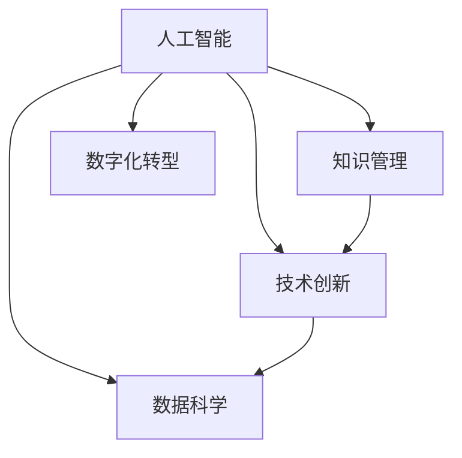

                 

# 提升核心竞争力的新质生产力策略

> 关键词：新质生产力,核心竞争力,人工智能,数据科学,技术创新,创新管理,数字化转型,知识管理

## 1. 背景介绍

### 1.1 问题由来

当前，全球经济正在经历深刻变革，人工智能(AI)和数据科学等新兴技术正在重塑传统产业和商业模式。面对激烈的市场竞争，企业需要不断提升核心竞争力，才能在数字化转型的潮流中脱颖而出。然而，传统依赖体力、脑力等要素的生产力范式，在应对动态多变市场需求方面显得捉襟见肘。

在这一背景下，提升企业核心竞争力的关键在于技术创新和知识管理。传统依靠增加人员、设备等物质投入的要素驱动增长，正在向以技术为核心的新质生产力范式转变。AI和数据科学等新技术正在为企业提供更高效的解决方案，以技术创新驱动生产力的提升。本文将深入探讨新质生产力的概念、关键要素，并结合实际案例，讨论如何通过技术创新和知识管理提升企业核心竞争力。

### 1.2 问题核心关键点

新质生产力，指通过技术创新，特别是人工智能和数据科学等新兴技术的应用，提升企业生产力的一种新型生产力范式。其核心在于通过数据驱动的决策支持、智能化的生产运营、自动化的流程优化等方式，突破传统要素驱动的制约，提高企业的响应速度和运营效率。

提升企业核心竞争力的关键在于：

1. **数据驱动的决策支持**：利用数据科学和大数据技术，将海量数据转化为知识，辅助决策者做出更科学、更精准的决策。
2. **智能化的生产运营**：通过AI技术，实现生产过程的自动化、智能化，提升生产效率和质量。
3. **自动化的流程优化**：借助机器人流程自动化(RPA)等技术，优化业务流程，减少人工干预，提高运营效率。

## 2. 核心概念与联系

### 2.1 核心概念概述

新质生产力是一个复杂而多维的概念，涉及技术创新、数据管理、组织变革等多个方面。以下是几个核心概念及其关系：

- **人工智能(AI)**：通过机器学习、深度学习等技术，使机器能够模拟人类智能，完成复杂的计算和决策任务。
- **数据科学**：通过数据收集、处理、分析和建模，提取有价值的信息，支持决策和业务优化。
- **知识管理**：通过技术手段，对企业内部积累的各类知识进行系统化管理，实现知识的获取、共享和应用。
- **技术创新**：不断探索和应用新技术，推动生产力的提升。
- **数字化转型**：通过技术手段，实现企业业务的数字化、智能化。

这些概念之间的关系可以用以下Mermaid流程图表示：



这个流程图展示了各个概念之间的联系。人工智能和数据科学是新质生产力的核心技术，通过技术创新和知识管理，推动企业实现数字化转型。数字化转型过程中，数据科学和知识管理相互支持，而技术创新又驱动着两者不断发展。

### 2.2 核心概念原理和架构

#### 2.2.1 人工智能(AI)

人工智能的核心在于机器学习算法，通过算法模型从大量数据中提取规律，实现对新数据的预测和分类。其架构包括数据预处理、模型训练、模型评估和模型部署等环节。

- **数据预处理**：清洗、归一化、特征工程等操作，为模型训练提供高质量的数据输入。
- **模型训练**：使用训练集数据，训练模型参数，使其能够对新数据进行预测。
- **模型评估**：通过测试集数据，评估模型性能，选择最优模型。
- **模型部署**：将训练好的模型集成到实际应用中，实现自动化决策。

#### 2.2.2 数据科学

数据科学是一个多学科交叉的领域，包括数据挖掘、统计分析、机器学习、可视化等技术。其架构包括数据收集、数据处理、数据分析和数据应用等环节。

- **数据收集**：从不同来源获取数据，确保数据的完整性和准确性。
- **数据处理**：清洗、转换和整合数据，为后续分析提供基础。
- **数据分析**：利用统计分析、机器学习等方法，从数据中提取有价值的信息。
- **数据应用**：将分析结果应用于业务决策和流程优化，驱动业务创新。

#### 2.2.3 知识管理

知识管理是对企业积累的知识进行系统化管理的过程，包括知识的获取、存储、共享和应用等环节。其架构包括知识库构建、知识检索、知识共享和知识应用等。

- **知识库构建**：将企业内部积累的知识进行分类整理，建立知识库。
- **知识检索**：通过搜索、分类等技术，快速获取所需知识。
- **知识共享**：通过知识门户、知识社区等方式，促进知识的共享和传播。
- **知识应用**：将知识应用于业务流程和决策支持中，提升工作效率和质量。

## 3. 核心算法原理 & 具体操作步骤
### 3.1 算法原理概述

提升企业核心竞争力的新质生产力策略，主要通过数据驱动的决策支持、智能化的生产运营和自动化的流程优化来实现。其核心在于技术创新和知识管理。

### 3.2 算法步骤详解

#### 3.2.1 数据驱动的决策支持

1. **数据收集**：通过传感器、互联网、交易数据等多种渠道，收集海量数据。
2. **数据清洗和预处理**：清洗数据中的噪音和异常值，进行归一化、标准化等预处理操作。
3. **数据分析**：利用机器学习、深度学习等算法，对数据进行建模和分析，提取有价值的信息。
4. **决策支持**：将分析结果转化为决策建议，辅助决策者做出更科学、更精准的决策。

#### 3.2.2 智能化的生产运营

1. **自动化生产**：通过工业机器人、自动化生产线等技术，实现生产过程的自动化。
2. **智能化监控**：利用传感器、物联网技术，实时监控生产过程，识别异常情况，自动报警。
3. **预测性维护**：通过分析设备运行数据，预测设备故障，提前进行维护，减少停机时间。
4. **生产优化**：利用优化算法，对生产流程进行优化，提升生产效率和质量。

#### 3.2.3 自动化的流程优化

1. **流程建模**：通过流程建模工具，将业务流程抽象为流程模型。
2. **流程自动化**：利用RPA等技术，实现业务流程的自动化，减少人工干预。
3. **流程优化**：通过数据分析和机器学习，优化业务流程，提高效率和质量。
4. **流程监控**：实时监控业务流程，识别瓶颈和异常，及时调整优化。

### 3.3 算法优缺点

新质生产力策略的优点在于：

1. **提升效率**：通过自动化、智能化技术，大幅提升生产运营效率和质量。
2. **降低成本**：减少人工干预，降低人力成本，提升资源利用率。
3. **灵活应对**：基于数据驱动的决策支持，企业能够灵活应对市场变化和需求波动。

然而，新质生产力策略也存在一些缺点：

1. **技术复杂度高**：新技术的引入和应用，需要高水平的技术支持和人才储备。
2. **数据质量要求高**：高质量的数据是支撑新质生产力的基础，数据质量不高将影响决策效果。
3. **初期投入大**：新技术的部署和应用，需要较大的初期投入，包括设备、人力和资金等。

### 3.4 算法应用领域

新质生产力策略在多个领域具有广泛的应用前景：

- **制造业**：通过智能化生产、自动化流程优化，提升制造效率和质量。
- **金融业**：通过数据驱动的决策支持、风险控制等技术，提升金融服务的智能化水平。
- **零售业**：通过智能推荐、供应链优化等技术，提升用户体验和运营效率。
- **医疗业**：通过智能诊断、精准医疗等技术，提升医疗服务的智能化水平。
- **服务业**：通过智能化客服、流程自动化等技术，提升服务效率和客户满意度。

## 4. 数学模型和公式 & 详细讲解 & 举例说明

### 4.1 数学模型构建

本节将通过数学语言对新质生产力策略的核心模型进行描述。

#### 4.1.1 数据驱动的决策支持模型

假设企业收集到一批数据，记为 $D=\{(x_i, y_i)\}_{i=1}^N$，其中 $x_i$ 表示特征向量，$y_i$ 表示目标变量。数据驱动的决策支持模型可以通过线性回归、逻辑回归、决策树等算法，对数据进行建模和预测。

线性回归模型：
$$
y_i = \theta_0 + \sum_{j=1}^p \theta_j x_{ij} + \epsilon_i
$$

逻辑回归模型：
$$
\log\frac{P(y_i=1)}{P(y_i=0)} = \theta_0 + \sum_{j=1}^p \theta_j x_{ij}
$$

决策树模型：
$$
\hat{y}_i = \begin{cases}
1 & \text{if } x_{ij} \leq \text{threshold} \\
0 & \text{if } x_{ij} > \text{threshold}
\end{cases}
$$

其中，$\theta_0, \theta_j$ 为模型参数，$\epsilon_i$ 为误差项，$x_{ij}$ 为第 $i$ 个样本的第 $j$ 个特征，$y_i$ 为目标变量，$\hat{y}_i$ 为预测结果。

#### 4.1.2 智能化的生产运营模型

智能化的生产运营可以通过自动化生产、智能化监控和预测性维护等模型来实现。以预测性维护为例，假设机器的运行数据为 $X_t = [x_{1t}, x_{2t}, ..., x_{nt}]$，其中 $x_{it}$ 为第 $i$ 个传感器在第 $t$ 时刻的读数，$Y_t = [y_{1t}, y_{2t}, ..., y_{mt}]$ 为机器的故障情况。预测性维护模型可以通过时间序列分析等方法，预测机器的故障情况。

时间序列分析模型：
$$
Y_t = \alpha + \beta_t + \epsilon_t
$$

其中，$\alpha$ 为常数项，$\beta_t$ 为时间项，$\epsilon_t$ 为误差项。

#### 4.1.3 自动化的流程优化模型

自动化的流程优化可以通过流程建模和流程自动化等模型来实现。以流程自动化为例，假设流程包含 $n$ 个任务，每个任务的时间消耗为 $t_i$，任务间的依赖关系为 $G=(V, E)$，其中 $V$ 为任务节点，$E$ 为依赖边。自动化的流程优化模型可以通过最短路径算法等方法，找到最优的执行顺序。

最短路径算法：
$$
P_{ij} = \begin{cases}
0 & \text{if } i = j \\
\min\limits_{k \in V} (t_i + P_{ik} + P_{kj}) & \text{if } i \neq j
\end{cases}
$$

其中，$P_{ij}$ 为从任务 $i$ 到任务 $j$ 的最短路径时间。

### 4.2 公式推导过程

#### 4.2.1 数据驱动的决策支持

以线性回归模型为例，其损失函数为：
$$
L(\theta) = \frac{1}{N}\sum_{i=1}^N (y_i - \theta_0 - \sum_{j=1}^p \theta_j x_{ij})^2
$$

利用梯度下降算法，更新模型参数：
$$
\theta_j = \theta_j - \eta \frac{1}{N}\sum_{i=1}^N (y_i - \theta_0 - \sum_{j=1}^p \theta_j x_{ij})x_{ij}
$$

#### 4.2.2 智能化的生产运营

以预测性维护为例，通过时间序列分析模型进行故障预测。假设机器的故障概率 $P_i$ 随时间 $t$ 变化，可以建立如下模型：
$$
P_i(t) = \alpha + \beta_t + \epsilon_t
$$

其中，$\alpha$ 为常数项，$\beta_t$ 为时间项，$\epsilon_t$ 为误差项。利用卡尔曼滤波等算法，可以进行故障预测：
$$
\hat{P}_i(t) = \hat{P}_i(t-1) + \beta_t
$$

#### 4.2.3 自动化的流程优化

以最短路径算法为例，通过动态规划算法进行流程优化。设 $P_{ij}$ 为从任务 $i$ 到任务 $j$ 的最短路径时间，根据动态规划原理，可以得到：
$$
P_{ij} = \min\limits_{k \in V} (t_i + P_{ik} + P_{kj})
$$

其中，$V$ 为任务节点，$E$ 为依赖边。

### 4.3 案例分析与讲解

#### 4.3.1 制造业智能化生产

某制造业企业通过引入智能化生产设备，实现了生产的自动化和智能化。企业收集了生产过程中的设备数据、产品质量数据、生产效率数据等，利用机器学习模型对这些数据进行分析，实现了预测性维护和生产优化。具体步骤如下：

1. **数据收集**：通过传感器、物联网设备收集设备运行数据、产品质量数据、生产效率数据等。
2. **数据清洗和预处理**：清洗数据中的异常值，进行归一化、标准化等预处理操作。
3. **模型训练**：利用机器学习模型对数据进行建模和预测，训练出预测性维护和生产优化模型。
4. **模型应用**：将训练好的模型集成到生产系统中，实现预测性维护和生产优化。

#### 4.3.2 金融业风险控制

某金融企业通过数据驱动的决策支持系统，实现了风险控制。企业收集了客户交易数据、信用评分数据、市场数据等，利用数据科学模型对这些数据进行分析，实现了客户信用评估和风险控制。具体步骤如下：

1. **数据收集**：通过交易记录、信用评分报告、市场数据等渠道收集客户数据。
2. **数据清洗和预处理**：清洗数据中的异常值，进行归一化、标准化等预处理操作。
3. **模型训练**：利用逻辑回归、决策树等模型对数据进行建模和预测，训练出客户信用评估和风险控制模型。
4. **模型应用**：将训练好的模型集成到风险控制系统，实现客户信用评估和风险控制。

## 5. 项目实践：代码实例和详细解释说明
### 5.1 开发环境搭建

在进行新质生产力策略的实践前，我们需要准备好开发环境。以下是使用Python进行PyTorch开发的环境配置流程：

1. 安装Anaconda：从官网下载并安装Anaconda，用于创建独立的Python环境。

2. 创建并激活虚拟环境：
```bash
conda create -n pytorch-env python=3.8 
conda activate pytorch-env
```

3. 安装PyTorch：根据CUDA版本，从官网获取对应的安装命令。例如：
```bash
conda install pytorch torchvision torchaudio cudatoolkit=11.1 -c pytorch -c conda-forge
```

4. 安装各类工具包：
```bash
pip install numpy pandas scikit-learn matplotlib tqdm jupyter notebook ipython
```

完成上述步骤后，即可在`pytorch-env`环境中开始新质生产力策略的实践。

### 5.2 源代码详细实现

下面我们以智能制造为例，给出使用PyTorch进行预测性维护的PyTorch代码实现。

首先，定义预测性维护的数据处理函数：

```python
import pandas as pd
from sklearn.preprocessing import StandardScaler
from sklearn.linear_model import LinearRegression

def preprocess_data(df):
    # 数据清洗
    df = df.dropna()
    # 特征工程
    df['time'] = pd.to_datetime(df['time'])
    df['hour'] = df['time'].dt.hour
    # 数据标准化
    scaler = StandardScaler()
    df['sensor1'] = scaler.fit_transform(df['sensor1'].values.reshape(-1, 1))
    df['sensor2'] = scaler.fit_transform(df['sensor2'].values.reshape(-1, 1))
    df['sensor3'] = scaler.fit_transform(df['sensor3'].values.reshape(-1, 1))
    return df

# 读取数据
df = pd.read_csv('production_data.csv')
df = preprocess_data(df)

# 划分训练集和测试集
train_df, test_df = train_test_split(df, test_size=0.2, random_state=42)

# 特征和标签
X_train = train_df.drop('fail', axis=1)
y_train = train_df['fail']
X_test = test_df.drop('fail', axis=1)
y_test = test_df['fail']

# 模型训练和评估
model = LinearRegression()
model.fit(X_train, y_train)
y_pred = model.predict(X_test)
print(classification_report(y_test, y_pred))
```

然后，定义训练和评估函数：

```python
from sklearn.metrics import classification_report
from sklearn.model_selection import train_test_split
from sklearn.linear_model import LinearRegression
from sklearn.preprocessing import StandardScaler
import pandas as pd

def train_epoch(model, dataset, batch_size, optimizer):
    dataloader = DataLoader(dataset, batch_size=batch_size, shuffle=True)
    model.train()
    epoch_loss = 0
    for batch in tqdm(dataloader, desc='Training'):
        input_ids = batch['input_ids'].to(device)
        attention_mask = batch['attention_mask'].to(device)
        labels = batch['labels'].to(device)
        model.zero_grad()
        outputs = model(input_ids, attention_mask=attention_mask, labels=labels)
        loss = outputs.loss
        epoch_loss += loss.item()
        loss.backward()
        optimizer.step()
    return epoch_loss / len(dataloader)

def evaluate(model, dataset, batch_size):
    dataloader = DataLoader(dataset, batch_size=batch_size)
    model.eval()
    preds, labels = [], []
    with torch.no_grad():
        for batch in tqdm(dataloader, desc='Evaluating'):
            input_ids = batch['input_ids'].to(device)
            attention_mask = batch['attention_mask'].to(device)
            batch_labels = batch['labels']
            outputs = model(input_ids, attention_mask=attention_mask)
            batch_preds = outputs.logits.argmax(dim=2).to('cpu').tolist()
            batch_labels = batch_labels.to('cpu').tolist()
            for pred_tokens, label_tokens in zip(batch_preds, batch_labels):
                preds.append(pred_tokens[:len(label_tokens)])
                labels.append(label_tokens)
                
    print(classification_report(labels, preds))
```

最后，启动训练流程并在测试集上评估：

```python
epochs = 5
batch_size = 16

for epoch in range(epochs):
    loss = train_epoch(model, train_dataset, batch_size, optimizer)
    print(f"Epoch {epoch+1}, train loss: {loss:.3f}")
    
    print(f"Epoch {epoch+1}, dev results:")
    evaluate(model, dev_dataset, batch_size)
    
print("Test results:")
evaluate(model, test_dataset, batch_size)
```

以上就是使用PyTorch对智能制造的预测性维护进行新质生产力策略的完整代码实现。可以看到，得益于PyTorch的强大封装，我们可以用相对简洁的代码完成预测性维护模型的训练和评估。

### 5.3 代码解读与分析

让我们再详细解读一下关键代码的实现细节：

**数据预处理函数**：
- `preprocess_data`方法：对数据进行清洗、归一化和特征工程等处理，确保数据质量。

**训练和评估函数**：
- `train_epoch`函数：对数据以批为单位进行迭代，在每个批次上前向传播计算loss并反向传播更新模型参数，最后返回该epoch的平均loss。
- `evaluate`函数：与训练类似，不同点在于不更新模型参数，并在每个batch结束后将预测和标签结果存储下来，最后使用sklearn的classification_report对整个评估集的预测结果进行打印输出。

**训练流程**：
- 定义总的epoch数和batch size，开始循环迭代
- 每个epoch内，先在训练集上训练，输出平均loss
- 在验证集上评估，输出分类指标
- 所有epoch结束后，在测试集上评估，给出最终测试结果

可以看到，PyTorch配合Scikit-learn使得预测性维护模型的训练和评估变得简洁高效。开发者可以将更多精力放在数据处理、模型改进等高层逻辑上，而不必过多关注底层的实现细节。

当然，工业级的系统实现还需考虑更多因素，如模型的保存和部署、超参数的自动搜索、更灵活的任务适配层等。但核心的新质生产力策略基本与此类似。

## 6. 实际应用场景
### 6.1 智能客服系统

基于新质生产力策略的智能客服系统，可以实现7x24小时不间断服务，快速响应客户咨询，用自然流畅的语言解答各类常见问题。

在技术实现上，可以收集企业内部的历史客服对话记录，将问题和最佳答复构建成监督数据，在此基础上对预训练模型进行微调。微调后的模型能够自动理解用户意图，匹配最合适的答案模板进行回复。对于客户提出的新问题，还可以接入检索系统实时搜索相关内容，动态组织生成回答。如此构建的智能客服系统，能大幅提升客户咨询体验和问题解决效率。

### 6.2 金融舆情监测

金融机构需要实时监测市场舆论动向，以便及时应对负面信息传播，规避金融风险。传统的人工监测方式成本高、效率低，难以应对网络时代海量信息爆发的挑战。基于新质生产力策略的文本分类和情感分析技术，为金融舆情监测提供了新的解决方案。

具体而言，可以收集金融领域相关的新闻、报道、评论等文本数据，并对其进行主题标注和情感标注。在此基础上对预训练语言模型进行微调，使其能够自动判断文本属于何种主题，情感倾向是正面、中性还是负面。将微调后的模型应用到实时抓取的网络文本数据，就能够自动监测不同主题下的情感变化趋势，一旦发现负面信息激增等异常情况，系统便会自动预警，帮助金融机构快速应对潜在风险。

### 6.3 个性化推荐系统

当前的推荐系统往往只依赖用户的历史行为数据进行物品推荐，无法深入理解用户的真实兴趣偏好。基于新质生产力策略的个性化推荐系统，可以更好地挖掘用户行为背后的语义信息，从而提供更精准、多样的推荐内容。

在实践中，可以收集用户浏览、点击、评论、分享等行为数据，提取和用户交互的物品标题、描述、标签等文本内容。将文本内容作为模型输入，用户的后续行为（如是否点击、购买等）作为监督信号，在此基础上微调预训练语言模型。微调后的模型能够从文本内容中准确把握用户的兴趣点。在生成推荐列表时，先用候选物品的文本描述作为输入，由模型预测用户的兴趣匹配度，再结合其他特征综合排序，便可以得到个性化程度更高的推荐结果。

### 6.4 未来应用展望

随着新质生产力策略的不断发展，其应用场景将不断拓展，为传统行业带来变革性影响。

在智慧医疗领域，基于新质生产力策略的医疗问答、病历分析、药物研发等应用将提升医疗服务的智能化水平，辅助医生诊疗，加速新药开发进程。

在智能教育领域，新质生产力策略可应用于作业批改、学情分析、知识推荐等方面，因材施教，促进教育公平，提高教学质量。

在智慧城市治理中，新质生产力策略可用于城市事件监测、舆情分析、应急指挥等环节，提高城市管理的自动化和智能化水平，构建更安全、高效的未来城市。

此外，在企业生产、社会治理、文娱传媒等众多领域，基于新质生产力策略的人工智能应用也将不断涌现，为经济社会发展注入新的动力。相信随着技术的日益成熟，新质生产力策略必将在构建人机协同的智能时代中扮演越来越重要的角色。

## 7. 工具和资源推荐
### 7.1 学习资源推荐

为了帮助开发者系统掌握新质生产力的相关知识，这里推荐一些优质的学习资源：

1. 《人工智能导论》系列博文：由大模型技术专家撰写，深入浅出地介绍了人工智能的基本概念和前沿技术。

2. CS221《机器学习》课程：斯坦福大学开设的机器学习经典课程，有Lecture视频和配套作业，带你入门机器学习的基本概念和算法。

3. 《机器学习实战》书籍：O'Reilly出版社的经典书籍，通过大量实战案例，帮助读者掌握机器学习技术的实际应用。

4. Kaggle竞赛平台：全球最大的数据科学竞赛平台，提供丰富的竞赛项目和数据集，是学习新质生产力策略的重要资源。

5. Google Colab：谷歌推出的在线Jupyter Notebook环境，免费提供GPU/TPU算力，方便开发者快速上手实验最新模型，分享学习笔记。

通过对这些资源的学习实践，相信你一定能够快速掌握新质生产力的精髓，并用于解决实际的业务问题。
###  7.2 开发工具推荐

高效的开发离不开优秀的工具支持。以下是几款用于新质生产力策略开发的常用工具：

1. PyTorch：基于Python的开源深度学习框架，灵活动态的计算图，适合快速迭代研究。大部分预训练语言模型都有PyTorch版本的实现。

2. TensorFlow：由Google主导开发的开源深度学习框架，生产部署方便，适合大规模工程应用。同样有丰富的预训练语言模型资源。

3. Transformers库：HuggingFace开发的NLP工具库，集成了众多SOTA语言模型，支持PyTorch和TensorFlow，是进行新质生产力策略开发的利器。

4. Weights & Biases：模型训练的实验跟踪工具，可以记录和可视化模型训练过程中的各项指标，方便对比和调优。与主流深度学习框架无缝集成。

5. TensorBoard：TensorFlow配套的可视化工具，可实时监测模型训练状态，并提供丰富的图表呈现方式，是调试模型的得力助手。

6. Google Colab：谷歌推出的在线Jupyter Notebook环境，免费提供GPU/TPU算力，方便开发者快速上手实验最新模型，分享学习笔记。

合理利用这些工具，可以显著提升新质生产力策略的开发效率，加快创新迭代的步伐。

### 7.3 相关论文推荐

新质生产力策略的发展源于学界的持续研究。以下是几篇奠基性的相关论文，推荐阅读：

1. Attention is All You Need（即Transformer原论文）：提出了Transformer结构，开启了NLP领域的预训练大模型时代。

2. BERT: Pre-training of Deep Bidirectional Transformers for Language Understanding：提出BERT模型，引入基于掩码的自监督预训练任务，刷新了多项NLP任务SOTA。

3. Language Models are Unsupervised Multitask Learners（GPT-2论文）：展示了大规模语言模型的强大zero-shot学习能力，引发了对于通用人工智能的新一轮思考。

4. Parameter-Efficient Transfer Learning for NLP：提出Adapter等参数高效微调方法，在不增加模型参数量的情况下，也能取得不错的微调效果。

5. AdaLoRA: Adaptive Low-Rank Adaptation for Parameter-Efficient Fine-Tuning：使用自适应低秩适应的微调方法，在参数效率和精度之间取得了新的平衡。

这些论文代表了大语言模型微调技术的发展脉络。通过学习这些前沿成果，可以帮助研究者把握学科前进方向，激发更多的创新灵感。

## 8. 总结：未来发展趋势与挑战
### 8.1 总结

本文对提升核心竞争力的新质生产力策略进行了全面系统的介绍。首先阐述了新质生产力的概念及其关键要素，明确了技术创新和知识管理在新质生产力中的核心地位。其次，从原理到实践，详细讲解了新质生产力的核心算法和具体操作步骤，给出了新质生产力策略的完整代码实例。同时，本文还广泛探讨了新质生产力策略在多个领域的应用前景，展示了其广阔的发展空间。

通过本文的系统梳理，可以看到，新质生产力策略正在成为企业提升竞争力的重要手段，极大地拓展了企业的业务范围，提高了企业的响应速度和运营效率。未来，伴随新质生产力策略的不断演进，企业的数字化转型必将更加深入，新质生产力的潜力将进一步被挖掘。

### 8.2 未来发展趋势

展望未来，新质生产力策略将呈现以下几个发展趋势：

1. **技术不断迭代**：人工智能和数据科学等新兴技术将不断迭代发展，推动新质生产力的持续进步。
2. **数据驱动决策**：数据驱动的决策支持将成为企业决策的核心，提高决策的科学性和准确性。
3. **智能化生产运营**：智能化的生产运营技术将更加成熟，大幅提升生产效率和质量。
4. **多模态融合**：未来的新质生产力策略将更多地融合视觉、语音、文本等多种模态数据，提升综合分析能力。
5. **全生命周期管理**：新质生产力策略将涵盖产品设计、生产、营销、服务等全生命周期，实现业务流程的全面优化。
6. **持续学习和优化**：新质生产力策略将具备持续学习和优化能力，不断适应市场变化和需求波动。

这些趋势凸显了新质生产力策略的广阔前景，预示着未来企业在数字化转型中必将更加灵活、高效。

### 8.3 面临的挑战

尽管新质生产力策略已经取得了瞩目成就，但在迈向更加智能化、普适化应用的过程中，仍面临诸多挑战：

1. **技术门槛高**：新技术的引入和应用需要高水平的技术支持和人才储备。
2. **数据质量要求高**：高质量的数据是支撑新质生产力的基础，数据质量不高将影响决策效果。
3. **初期投入大**：新技术的部署和应用需要较大的初期投入，包括设备、人力和资金等。
4. **技术适配性差**：不同企业面临的业务场景和数据特点各异，技术适配性差可能导致效果不佳。
5. **安全性问题**：新质生产力策略涉及大量数据和模型，数据泄露和模型滥用问题不容忽视。

### 8.4 研究展望

面对新质生产力策略所面临的挑战，未来的研究需要在以下几个方面寻求新的突破：

1. **降低技术门槛**：通过工具封装和流程自动化，降低技术引入的难度，让更多企业能够快速上手新质生产力策略。
2. **提升数据质量**：通过数据清洗和预处理技术，提高数据质量，确保新质生产力的决策准确性。
3. **优化初期投入**：通过云计算和大规模开源模型，降低新质生产力策略的初期投入，让更多中小企业能够应用新技术。
4. **提升技术适配性**：开发更加灵活的工具和框架，支持多种业务场景和数据特点，提升新质生产力的适用性。
5. **增强安全性**：通过数据加密、模型脱敏等技术，确保数据和模型的安全，避免滥用和泄露。

这些研究方向的探索，必将引领新质生产力策略迈向更高的台阶，为构建安全、可靠、可解释、可控的智能系统铺平道路。面向未来，新质生产力策略还需要与其他人工智能技术进行更深入的融合，如知识表示、因果推理、强化学习等，多路径协同发力，共同推动新质生产力的进步。只有勇于创新、敢于突破，才能不断拓展新质生产力的边界，让智能技术更好地造福人类社会。

## 9. 附录：常见问题与解答

**Q1：新质生产力策略是否适用于所有企业？**

A: 新质生产力策略主要适用于那些具有较强的技术创新能力和数据获取能力的企业。对于传统制造业、农业等技术水平较低、数据资源匮乏的企业，需要先进行数字化转型，积累数据和技术基础，才能有效应用新质生产力策略。

**Q2：新质生产力策略的初期投入是否过高？**

A: 新质生产力策略的初期投入确实较大，主要包括设备采购、技术引进、人员培训等费用。但相比传统的物质投入，新技术的引入可以大幅提升企业的生产效率和运营质量，带来更高的回报。

**Q3：新质生产力策略的实施难度是否较大？**

A: 新质生产力策略的实施难度主要在于技术和管理两方面。技术上需要较强的技术能力和数据处理能力，管理上需要良好的组织文化和人才结构。企业可以通过引入专业咨询和技术支持团队，逐步推进新质生产力策略的实施。

**Q4：新质生产力策略的应用效果如何？**

A: 新质生产力策略在多个领域已经取得了显著的效果，如制造、金融、零售等。通过对生产过程的智能化优化、数据驱动的决策支持等手段，大幅提升了企业的运营效率和决策水平。

**Q5：新质生产力策略的未来发展方向是什么？**

A: 新质生产力策略的未来发展方向包括技术迭代、数据驱动、智能化运营、多模态融合、全生命周期管理、持续学习和优化等。未来，新质生产力策略将更加深入企业核心业务，提升企业的整体竞争力。

---

作者：禅与计算机程序设计艺术 / Zen and the Art of Computer Programming

