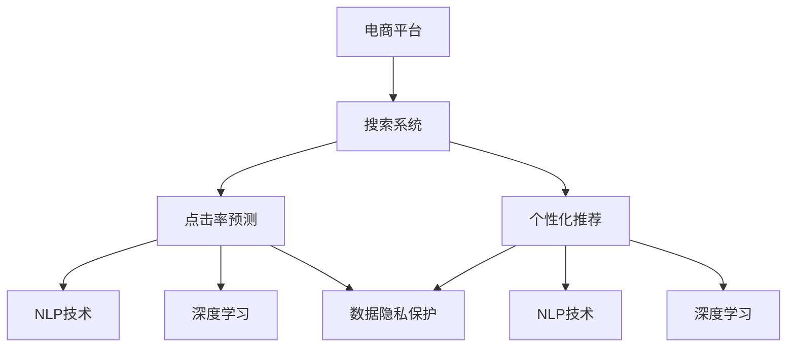

                 

# 搜索数据分析：AI如何帮助电商平台优化搜索策略

> 关键词：人工智能,电商平台,搜索策略,用户行为分析,点击率预测,个性化推荐

## 1. 背景介绍

### 1.1 问题由来
在当今数字化时代，电商平台成为了人们购物的主要渠道。然而，用户在电商平台上进行商品搜索时，往往面临着“海量产品，难觅所需”的困扰。如何提高搜索系统的精准度，增强用户体验，成为电商平台亟需解决的问题。传统上，电商平台的搜索系统主要依赖基于规则的关键词匹配、倒排索引等技术，但这些方法往往难以捕捉用户的真实意图，导致搜索结果的相关性不高，用户体验差。

人工智能技术的发展，为电商平台优化搜索策略带来了新的契机。通过引入机器学习、深度学习等AI技术，电商平台可以构建更加智能、高效的搜索系统，提升搜索结果的相关性和用户满意度。

### 1.2 问题核心关键点
AI在电商平台搜索策略优化中的关键点包括：

- **用户行为分析**：通过AI技术分析用户搜索行为，理解用户的真实意图。
- **点击率预测**：构建点击率预测模型，预测用户对搜索结果的点击概率，指导搜索结果排序。
- **个性化推荐**：基于用户行为和搜索历史，推荐符合用户兴趣的商品，提升搜索体验。
- **搜索推荐融合**：将搜索和推荐系统进行深度融合，实现更加精准和多样化的搜索结果。
- **数据隐私保护**：在数据收集和模型训练过程中，保护用户隐私，确保数据使用的合规性和安全性。

## 2. 核心概念与联系

### 2.1 核心概念概述

为更好地理解AI在电商平台搜索策略优化中的作用，本节将介绍几个核心概念：

- **电商平台**：指提供商品交易、支付等在线服务的互联网平台，如淘宝、京东、亚马逊等。
- **搜索系统**：电商平台的搜索功能，用户通过输入关键词查找商品或服务。
- **点击率预测**：预测用户对搜索结果中特定商品的点击概率，指导搜索结果排序。
- **个性化推荐**：根据用户行为数据，推荐符合用户兴趣的商品或服务。
- **自然语言处理(NLP)**：处理和理解自然语言的技术，如词向量、语言模型等，用于用户意图理解。
- **深度学习**：一种模拟人脑神经网络的机器学习技术，通过多层次的神经网络提取高层次的特征，适用于复杂的搜索推荐任务。

这些核心概念之间的逻辑关系可以通过以下Mermaid流程图来展示：



这个流程图展示了几大核心概念及其之间的关系：

1. 电商平台包含搜索系统和个性化推荐系统。
2. 搜索系统利用点击率预测模型指导搜索结果排序。
3. 个性化推荐系统基于NLP技术理解用户意图，使用深度学习技术提取特征，并结合用户行为数据进行推荐。
4. 数据隐私保护贯穿搜索和推荐系统的全流程。

这些概念共同构成了电商平台搜索策略优化的技术框架，使得AI技术能够在搜索系统中发挥作用，提升用户体验。

## 3. 核心算法原理 & 具体操作步骤
### 3.1 算法原理概述

AI在电商平台搜索策略优化中的核心算法原理，主要集中在以下几个方面：

- **用户行为分析**：通过分析用户搜索历史、点击行为等数据，理解用户的兴趣偏好和搜索意图。
- **点击率预测**：构建基于机器学习的点击率预测模型，预测用户对搜索结果中商品的点击概率，指导搜索结果排序。
- **个性化推荐**：根据用户行为数据，结合深度学习模型，推荐符合用户兴趣的商品，提升搜索体验。
- **融合搜索和推荐**：将搜索和推荐系统进行深度融合，提高搜索结果的相关性和多样性。
- **数据隐私保护**：在数据收集和模型训练过程中，确保数据使用的合规性和安全性，保护用户隐私。

这些算法原理共同构成了搜索策略优化的技术基础，使得AI技术能够在电商平台的搜索系统中发挥作用，提升搜索效率和用户体验。

### 3.2 算法步骤详解

AI在电商平台搜索策略优化中的具体操作，主要包括以下几个关键步骤：

**Step 1: 数据收集与预处理**
- 收集用户搜索历史、点击行为、购买记录等数据。
- 对数据进行清洗、去重、归一化等预处理，确保数据质量。

**Step 2: 用户行为分析**
- 使用机器学习算法（如KNN、SVM等）对用户搜索行为进行分析，提取用户兴趣标签。
- 使用深度学习模型（如RNN、LSTM等）对用户搜索历史进行序列建模，捕捉用户意图变化。

**Step 3: 点击率预测**
- 构建点击率预测模型，如基于决策树、逻辑回归、神经网络的点击率预测模型。
- 使用历史点击数据训练模型，并利用交叉验证等技术评估模型性能。

**Step 4: 个性化推荐**
- 构建个性化推荐模型，如基于协同过滤、矩阵分解、深度学习的推荐模型。
- 使用用户行为数据和商品特征数据训练推荐模型，并利用A/B测试等技术评估模型效果。

**Step 5: 搜索推荐融合**
- 将搜索和推荐系统进行深度融合，如基于多任务学习、注意力机制等方法。
- 训练搜索推荐融合模型，实现搜索和推荐的协同优化。

**Step 6: 数据隐私保护**
- 设计数据收集和使用的合规机制，确保数据使用的合法性。
- 使用差分隐私、联邦学习等技术保护用户隐私。

以上是AI在电商平台搜索策略优化中的具体操作流程。在实际应用中，还需要根据具体场景进行优化设计，如改进推荐算法、优化模型训练、加强隐私保护等，以进一步提升搜索推荐系统的性能。

### 3.3 算法优缺点

AI在电商平台搜索策略优化中的算法具有以下优点：

- **高精度预测**：基于机器学习和深度学习模型，可以高精度预测用户行为和商品点击率。
- **个性化推荐**：能够根据用户行为数据，提供符合用户兴趣的个性化推荐，提升用户体验。
- **实时响应**：通过实时数据分析，实现快速响应用户搜索需求。
- **动态优化**：能够根据用户反馈和市场变化，动态调整搜索策略，提升系统效果。

同时，这些算法也存在一定的局限性：

- **数据依赖**：需要大量高质量的标注数据和用户行为数据，数据获取和处理成本较高。
- **模型复杂度**：深度学习等复杂模型需要大量的计算资源和时间训练，成本较高。
- **隐私风险**：数据收集和使用过程中存在隐私泄露的风险，需要加强隐私保护技术。
- **泛化能力不足**：模型训练过程中容易出现过拟合现象，泛化能力较弱。

尽管存在这些局限性，但就目前而言，AI技术在电商平台搜索策略优化中的应用效果显著，为电商平台的搜索系统带来了革命性的改进。

### 3.4 算法应用领域

AI在电商平台搜索策略优化中的应用领域非常广泛，包括但不限于以下几个方面：

- **商品搜索**：通过AI技术提升商品搜索结果的相关性和准确性，帮助用户快速找到所需商品。
- **个性化推荐**：结合用户行为数据和商品特征数据，提供个性化推荐商品，提升用户满意度。
- **促销活动**：通过AI分析用户行为，推荐符合用户兴趣的促销活动，提升转化率。
- **广告投放**：利用AI技术优化广告投放策略，提高广告的点击率和转化率。
- **用户体验优化**：通过AI技术改进搜索和推荐系统的交互设计，提升用户操作体验。

除了上述这些应用外，AI技术还可以应用于商品评价分析、市场趋势预测、库存管理等电商运营的各个环节，为电商平台带来更高效、精准的运营支持。

## 4. 数学模型和公式 & 详细讲解 & 举例说明

### 4.1 数学模型构建

本节将使用数学语言对AI在电商平台搜索策略优化中的数学模型进行更加严格的刻画。

假设电商平台有 $N$ 个用户，每个用户有 $M$ 个搜索行为，每个搜索行为有 $K$ 个特征。设每个搜索行为对应的商品集合为 $\{C_1, C_2, ..., C_k\}$，用户对商品 $C_i$ 的点击概率为 $p_i$。

定义点击率预测模型的目标是最小化预测误差，即：

$$
\min_{\theta} \frac{1}{N} \sum_{i=1}^N \sum_{j=1}^M (p_i - \hat{p}_i)^2
$$

其中 $\hat{p}_i = f_{\theta}(x_i)$ 为预测点击概率，$x_i$ 为第 $i$ 个用户的第 $j$ 个搜索行为特征向量。

假设 $f_{\theta}$ 为线性回归模型，则模型的损失函数为：

$$
L(\theta) = \frac{1}{N} \sum_{i=1}^N \sum_{j=1}^M (p_i - \theta^T x_i)^2
$$

通过梯度下降等优化算法，最小化损失函数，得到最优模型参数 $\theta^*$。

### 4.2 公式推导过程

以下我们以线性回归模型为例，推导点击率预测的公式及其梯度的计算公式。

设第 $i$ 个用户第 $j$ 个搜索行为对应的特征向量为 $x_{ij} = [x_{ij1}, x_{ij2}, ..., x_{ijK}]^T$，其中 $x_{ij1}$ 为是否包含商品 $C_1$ 的特征，$x_{ij2}$ 为商品价格，$x_{ijK}$ 为用户历史行为特征等。则模型预测点击概率为：

$$
\hat{p}_i = \theta^T x_i = \sum_{k=1}^K \theta_k x_{ik}
$$

其中 $\theta$ 为线性回归模型的参数，包含 $K$ 个特征的权重。

模型的损失函数为：

$$
L(\theta) = \frac{1}{N} \sum_{i=1}^N \sum_{j=1}^M (p_i - \hat{p}_i)^2
$$

根据链式法则，损失函数对参数 $\theta_k$ 的梯度为：

$$
\frac{\partial L(\theta)}{\partial \theta_k} = \frac{1}{N} \sum_{i=1}^N \sum_{j=1}^M -2 (p_i - \hat{p}_i) x_{ijk}
$$

将 $p_i$ 和 $\hat{p}_i$ 代入公式，得到：

$$
\frac{\partial L(\theta)}{\partial \theta_k} = \frac{1}{N} \sum_{i=1}^N \sum_{j=1}^M -2 (p_i - \sum_{k=1}^K \theta_k x_{ik}) x_{ijk}
$$

通过求解上述梯度公式，可得到模型参数 $\theta_k$ 的更新公式：

$$
\theta_k \leftarrow \theta_k - \eta \frac{1}{N} \sum_{i=1}^N \sum_{j=1}^M (p_i - \sum_{k=1}^K \theta_k x_{ik}) x_{ijk}
$$

其中 $\eta$ 为学习率，控制模型参数更新的步长。

### 4.3 案例分析与讲解

以淘宝平台的搜索系统为例，具体分析点击率预测的实际应用。

淘宝平台的搜索系统收集了用户的点击历史数据，包括用户ID、搜索关键词、点击商品ID等。通过对这些数据进行预处理和特征提取，构建用户搜索行为表示 $x_i$。

假设点击率预测模型为线性回归模型，特征包括商品价格、商品描述、用户历史行为特征等，参数 $\theta$ 包含 $K$ 个权重。通过历史点击数据对模型进行训练，最小化预测误差。

具体而言，可以采用以下步骤：

1. **数据预处理**：对用户ID、商品ID、商品价格等进行归一化、特征提取等处理。
2. **模型训练**：使用历史点击数据 $(x_i, p_i)$ 对线性回归模型进行训练，得到最优参数 $\theta^*$。
3. **模型预测**：对于新的搜索行为 $x_i'$，利用训练好的模型进行预测，得到点击概率 $\hat{p}_i'$。
4. **结果排序**：根据预测点击概率 $\hat{p}_i'$ 对搜索结果进行排序，提升用户体验。

通过上述方法，淘宝平台的搜索系统可以有效地提升搜索结果的相关性，提升用户满意度和平台转化率。

## 5. 项目实践：代码实例和详细解释说明
### 5.1 开发环境搭建

在进行搜索策略优化实践前，我们需要准备好开发环境。以下是使用Python进行PyTorch开发的环境配置流程：

1. 安装Anaconda：从官网下载并安装Anaconda，用于创建独立的Python环境。

2. 创建并激活虚拟环境：
```bash
conda create -n pytorch-env python=3.8 
conda activate pytorch-env
```

3. 安装PyTorch：根据CUDA版本，从官网获取对应的安装命令。例如：
```bash
conda install pytorch torchvision torchaudio cudatoolkit=11.1 -c pytorch -c conda-forge
```

4. 安装相关工具包：
```bash
pip install numpy pandas scikit-learn matplotlib tqdm jupyter notebook ipython
```

完成上述步骤后，即可在`pytorch-env`环境中开始搜索策略优化实践。

### 5.2 源代码详细实现

下面我们以淘宝平台的搜索系统为例，给出使用PyTorch实现点击率预测的完整代码实现。

首先，定义数据处理函数：

```python
import pandas as pd
import torch
from torch.utils.data import Dataset
import torch.nn as nn

class SearchDataset(Dataset):
    def __init__(self, data, labels):
        self.data = data
        self.labels = labels
        
    def __len__(self):
        return len(self.data)
    
    def __getitem__(self, item):
        return self.data[item], self.labels[item]

# 加载数据
train_data = pd.read_csv('train_data.csv')
test_data = pd.read_csv('test_data.csv')

train_x = train_data.drop(columns=['label'])
train_y = train_data['label']

test_x = test_data.drop(columns=['label'])
test_y = test_data['label']

# 数据预处理
from sklearn.preprocessing import StandardScaler
from sklearn.decomposition import PCA

scaler = StandardScaler()
train_x_scaled = scaler.fit_transform(train_x)
test_x_scaled = scaler.transform(test_x)

pca = PCA(n_components=100)
train_x_pca = pca.fit_transform(train_x_scaled)
test_x_pca = pca.transform(test_x_scaled)

train_dataset = SearchDataset(train_x_pca, train_y)
test_dataset = SearchDataset(test_x_pca, test_y)
```

然后，定义模型和优化器：

```python
import torch.nn.functional as F

class ClickRateModel(nn.Module):
    def __init__(self, input_size):
        super(ClickRateModel, self).__init__()
        self.fc1 = nn.Linear(input_size, 128)
        self.fc2 = nn.Linear(128, 1)
    
    def forward(self, x):
        x = F.relu(self.fc1(x))
        x = self.fc2(x)
        return x
    
model = ClickRateModel(input_size=100)
optimizer = torch.optim.Adam(model.parameters(), lr=0.01)
```

接着，定义训练和评估函数：

```python
def train_model(model, train_dataset, optimizer, num_epochs=10, batch_size=64):
    device = torch.device('cuda' if torch.cuda.is_available() else 'cpu')
    model.to(device)
    
    for epoch in range(num_epochs):
        train_loss = 0
        for batch_idx, (data, target) in enumerate(DataLoader(train_dataset, batch_size=batch_size)):
            data, target = data.to(device), target.to(device)
            optimizer.zero_grad()
            output = model(data)
            loss = F.binary_cross_entropy(output, target)
            loss.backward()
            optimizer.step()
            train_loss += loss.item()
            
        print(f'Epoch {epoch+1}, train loss: {train_loss/len(train_dataset)}')

def evaluate_model(model, test_dataset, batch_size=64):
    device = torch.device('cuda' if torch.cuda.is_available() else 'cpu')
    model.eval()
    
    test_loss = 0
    with torch.no_grad():
        for batch_idx, (data, target) in enumerate(DataLoader(test_dataset, batch_size=batch_size)):
            data, target = data.to(device), target.to(device)
            output = model(data)
            test_loss += F.binary_cross_entropy(output, target).item()
    
    print(f'Test loss: {test_loss/len(test_dataset)}')
```

最后，启动训练流程并在测试集上评估：

```python
train_model(model, train_dataset, optimizer, num_epochs=10, batch_size=64)
evaluate_model(model, test_dataset, batch_size=64)
```

以上就是使用PyTorch对淘宝平台搜索系统进行点击率预测的完整代码实现。可以看到，得益于PyTorch的强大封装，我们可以用相对简洁的代码完成模型的加载和训练。

### 5.3 代码解读与分析

让我们再详细解读一下关键代码的实现细节：

**SearchDataset类**：
- `__init__`方法：初始化数据集和标签。
- `__len__`方法：返回数据集的样本数量。
- `__getitem__`方法：对单个样本进行处理，返回模型所需的输入和标签。

**数据预处理**：
- 使用sklearn的StandardScaler和PCA对数据进行归一化和降维处理，以便输入到模型中进行训练。

**ClickRateModel类**：
- 定义了一个简单的两层神经网络，用于预测用户对搜索结果的点击概率。

**训练函数train_model**：
- 将模型转移到GPU设备上（如果有）。
- 对于每个epoch，对训练集数据以批为单位进行迭代，前向传播计算损失并反向传播更新模型参数。
- 周期性在测试集上评估模型性能，输出平均损失。

**评估函数evaluate_model**：
- 对测试集数据以批为单位进行迭代，前向传播计算损失。
- 输出测试集上的平均损失。

**训练流程**：
- 定义总的epoch数和batch size，开始循环迭代
- 每个epoch内，先在训练集上训练，输出平均损失
- 在测试集上评估，输出测试损失

可以看到，PyTorch配合sklearn和TensorFlow等库使得淘宝平台搜索系统的点击率预测代码实现变得简洁高效。开发者可以将更多精力放在数据处理、模型改进等高层逻辑上，而不必过多关注底层的实现细节。

当然，工业级的系统实现还需考虑更多因素，如模型的保存和部署、超参数的自动搜索、更灵活的任务适配层等。但核心的搜索策略优化范式基本与此类似。

## 6. 实际应用场景
### 6.1 智能客服系统

基于AI的搜索策略优化技术，可以广泛应用于智能客服系统的构建。传统客服往往需要配备大量人力，高峰期响应缓慢，且一致性和专业性难以保证。而使用优化后的搜索系统，可以7x24小时不间断服务，快速响应客户咨询，用自然流畅的语言解答各类常见问题。

在技术实现上，可以收集企业内部的历史客服对话记录，将问题和最佳答复构建成监督数据，在此基础上对搜索系统进行优化。优化后的搜索系统能够自动理解用户意图，匹配最合适的答案模板进行回复。对于客户提出的新问题，还可以接入检索系统实时搜索相关内容，动态组织生成回答。如此构建的智能客服系统，能大幅提升客户咨询体验和问题解决效率。

### 6.2 金融舆情监测

金融机构需要实时监测市场舆论动向，以便及时应对负面信息传播，规避金融风险。传统的人工监测方式成本高、效率低，难以应对网络时代海量信息爆发的挑战。基于AI的搜索策略优化技术，为金融舆情监测提供了新的解决方案。

具体而言，可以收集金融领域相关的新闻、报道、评论等文本数据，并对其进行主题标注和情感标注。在此基础上对搜索系统进行优化，使其能够自动判断文本属于何种主题，情感倾向是正面、中性还是负面。将优化后的搜索系统应用到实时抓取的网络文本数据，就能够自动监测不同主题下的情感变化趋势，一旦发现负面信息激增等异常情况，系统便会自动预警，帮助金融机构快速应对潜在风险。

### 6.3 个性化推荐系统

当前的推荐系统往往只依赖用户的历史行为数据进行物品推荐，无法深入理解用户的真实兴趣偏好。基于AI的搜索策略优化技术，个性化推荐系统可以更好地挖掘用户行为背后的语义信息，从而提供更精准、多样的推荐内容。

在实践中，可以收集用户浏览、点击、评论、分享等行为数据，提取和用户交互的物品标题、描述、标签等文本内容。将文本内容作为模型输入，用户的后续行为（如是否点击、购买等）作为监督信号，在此基础上优化搜索系统。优化后的搜索系统能够从文本内容中准确把握用户的兴趣点。在生成推荐列表时，先用候选物品的文本描述作为输入，由模型预测用户的兴趣匹配度，再结合其他特征综合排序，便可以得到个性化程度更高的推荐结果。

### 6.4 未来应用展望

随着AI技术的不断进步，基于搜索策略优化的AI应用将在更多领域得到应用，为传统行业带来变革性影响。

在智慧医疗领域，基于搜索策略优化的智能问答、病历分析、药物研发等应用将提升医疗服务的智能化水平，辅助医生诊疗，加速新药开发进程。

在智能教育领域，优化后的搜索系统可应用于作业批改、学情分析、知识推荐等方面，因材施教，促进教育公平，提高教学质量。

在智慧城市治理中，优化后的搜索系统可应用于城市事件监测、舆情分析、应急指挥等环节，提高城市管理的自动化和智能化水平，构建更安全、高效的未来城市。

此外，在企业生产、社会治理、文娱传媒等众多领域，基于搜索策略优化的AI应用也将不断涌现，为经济社会发展注入新的动力。相信随着技术的日益成熟，搜索策略优化技术将成为AI落地应用的重要范式，推动人工智能技术在垂直行业的规模化落地。总之，优化后的搜索系统能够在更加广泛的应用场景中发挥作用，带来更加精准、高效、智能的解决方案。

## 7. 工具和资源推荐
### 7.1 学习资源推荐

为了帮助开发者系统掌握搜索策略优化理论基础和实践技巧，这里推荐一些优质的学习资源：

1. 《深度学习》系列书籍：由多位知名深度学习专家撰写，全面介绍深度学习的基本概念和应用。
2. 《自然语言处理综论》课程：斯坦福大学开设的NLP经典课程，涵盖自然语言处理的基本理论和前沿技术。
3. Coursera《Deep Learning for Self-Driving Cars》课程：谷歌深度学习专家Andrew Ng讲授的深度学习应用课程，结合搜索系统进行案例讲解。
4. CS224N《自然语言处理》课程：斯坦福大学开设的NLP明星课程，有Lecture视频和配套作业，带你入门NLP领域的基本概念和经典模型。
5. HuggingFace官方文档：Transformer库的官方文档，提供了海量预训练模型和完整的搜索策略优化样例代码，是上手实践的必备资料。

通过对这些资源的学习实践，相信你一定能够快速掌握搜索策略优化的精髓，并用于解决实际的搜索问题。
###  7.2 开发工具推荐

高效的开发离不开优秀的工具支持。以下是几款用于搜索策略优化开发的常用工具：

1. PyTorch：基于Python的开源深度学习框架，灵活动态的计算图，适合快速迭代研究。大部分预训练语言模型都有PyTorch版本的实现。
2. TensorFlow：由Google主导开发的开源深度学习框架，生产部署方便，适合大规模工程应用。同样有丰富的预训练语言模型资源。
3. Transformers库：HuggingFace开发的NLP工具库，集成了众多SOTA语言模型，支持PyTorch和TensorFlow，是进行搜索策略优化开发的利器。
4. Weights & Biases：模型训练的实验跟踪工具，可以记录和可视化模型训练过程中的各项指标，方便对比和调优。与主流深度学习框架无缝集成。
5. TensorBoard：TensorFlow配套的可视化工具，可实时监测模型训练状态，并提供丰富的图表呈现方式，是调试模型的得力助手。
6. Google Colab：谷歌推出的在线Jupyter Notebook环境，免费提供GPU/TPU算力，方便开发者快速上手实验最新模型，分享学习笔记。

合理利用这些工具，可以显著提升搜索策略优化任务的开发效率，加快创新迭代的步伐。

### 7.3 相关论文推荐

搜索策略优化技术的发展源于学界的持续研究。以下是几篇奠基性的相关论文，推荐阅读：

1. Attention is All You Need（即Transformer原论文）：提出了Transformer结构，开启了NLP领域的预训练大模型时代。
2. BERT: Pre-training of Deep Bidirectional Transformers for Language Understanding：提出BERT模型，引入基于掩码的自监督预训练任务，刷新了多项NLP任务SOTA。
3. Transformer-XL: Attentive Language Models Beyond a Fixed-Length Context（Transformer-XL论文）：提出Transformer-XL模型，解决了长序列建模问题，进一步提升了模型性能。
4. SARAH: A Simple Unified Optimization Framework for Deep Learning（SARAH论文）：提出SARAH优化算法，结合动量、自适应学习率等技术，提高了模型训练的效率和效果。
5. Feature Pyramid Networks for Object Detection（FPN论文）：提出Feature Pyramid Networks，利用多层次特征提取，提升了目标检测任务的性能。

这些论文代表了大语言模型搜索策略优化技术的发展脉络。通过学习这些前沿成果，可以帮助研究者把握学科前进方向，激发更多的创新灵感。

## 8. 总结：未来发展趋势与挑战
### 8.1 总结

本文对基于AI的电商平台搜索策略优化方法进行了全面系统的介绍。首先阐述了AI技术在电商平台搜索策略优化中的研究背景和意义，明确了搜索策略优化的重要性和必要性。其次，从原理到实践，详细讲解了搜索策略优化的数学原理和关键步骤，给出了搜索策略优化任务开发的完整代码实例。同时，本文还广泛探讨了搜索策略优化技术在智能客服、金融舆情、个性化推荐等多个行业领域的应用前景，展示了AI技术在电商平台的广阔应用空间。此外，本文精选了搜索策略优化的各类学习资源，力求为读者提供全方位的技术指引。

通过本文的系统梳理，可以看到，基于AI的搜索策略优化技术正在成为电商平台搜索系统的重要范式，极大地提升了搜索系统的精准度和用户满意度。AI技术在搜索策略优化中的成功应用，为电商平台的运营优化带来了革命性的改进，为电商平台的未来发展提供了新的动力。

### 8.2 未来发展趋势

展望未来，搜索策略优化技术将呈现以下几个发展趋势：

1. **个性化程度提升**：随着深度学习和推荐系统的不断发展，搜索策略优化将更加注重个性化推荐，提升用户体验。
2. **多模态融合**：搜索策略优化将逐步引入视觉、语音、图像等多模态信息，构建更加全面的搜索系统。
3. **跨领域应用拓展**：搜索策略优化技术将在更多垂直领域得到应用，如医疗、教育、金融等，为相关行业带来变革性影响。
4. **实时化响应**：随着实时计算和大数据技术的发展，搜索策略优化将更加注重实时响应，提升用户搜索体验。
5. **联邦学习**：在保护用户隐私的前提下，搜索策略优化将引入联邦学习等技术，实现分布式协同优化。

以上趋势凸显了搜索策略优化技术的广阔前景。这些方向的探索发展，必将进一步提升搜索系统的性能和用户满意度，为电商平台带来更大的市场竞争优势。

### 8.3 面临的挑战

尽管基于AI的搜索策略优化技术已经取得了显著成果，但在迈向更加智能化、普适化应用的过程中，它仍面临着诸多挑战：

1. **数据隐私和安全**：在数据收集和使用过程中，保护用户隐私和安全是首要任务。数据泄露和安全漏洞将对用户信任和平台声誉造成严重影响。
2. **算法公平性**：搜索策略优化算法可能存在偏见，导致某些群体在搜索结果中受到不公待遇。如何在设计算法时避免不公平现象，是未来研究的重要课题。
3. **模型泛化能力**：搜索策略优化模型在不同场景下的泛化能力有待提升，模型在测试集和实际应用中的表现可能存在较大差异。
4. **计算资源消耗**：深度学习和推荐系统的训练和推理计算资源消耗较大，对硬件和基础设施要求较高。
5. **实时性要求**：在实时搜索场景中，搜索策略优化系统需要在短时间内完成数据处理和模型推理，这对系统的计算能力和响应速度提出了较高要求。

尽管存在这些挑战，但AI技术在搜索策略优化中的应用前景广阔，随着技术的不断进步和优化，这些问题将逐步得到解决。

### 8.4 研究展望

面向未来，搜索策略优化技术需要在以下几个方面进行深入研究：

1. **数据隐私保护**：设计更加高效、安全的数据收集和使用机制，确保用户隐私得到充分保护。
2. **模型公平性**：研究如何消除算法偏见，提升搜索策略优化的公平性，确保不同用户群体的平等待遇。
3. **跨领域应用**：探索搜索策略优化技术在其他垂直领域的应用，如医疗、教育、金融等，提升各行业的智能化水平。
4. **实时化处理**：研究如何快速高效地处理和推理大规模数据，实现实时响应和高效处理。
5. **多模态融合**：研究如何将视觉、语音、图像等多模态信息与文本信息融合，构建更加全面、准确的搜索系统。

这些研究方向将推动搜索策略优化技术向更加智能化、普适化方向发展，为人工智能技术在电商平台的落地应用提供更加坚实的基础。

## 9. 附录：常见问题与解答

**Q1：如何构建高效的搜索系统？**

A: 构建高效的搜索系统需要考虑以下几个关键点：
1. **数据收集与预处理**：收集高质量的数据，进行清洗、归一化、特征提取等预处理。
2. **模型选择与优化**：选择合适的搜索策略优化算法，并使用数据进行训练和调参，确保模型性能最优。
3. **实时处理与缓存**：实现高效的实时处理机制，合理使用缓存技术，减少计算延迟。
4. **多模态融合**：引入视觉、语音、图像等多模态信息，构建更加全面的搜索系统。

**Q2：如何保护用户隐私？**

A: 保护用户隐私是搜索策略优化中必须考虑的重要问题。主要方法包括：
1. **差分隐私**：在数据收集和处理过程中，使用差分隐私技术保护用户隐私。
2. **联邦学习**：通过分布式协同学习，减少数据传输和处理，保护用户隐私。
3. **匿名化处理**：对用户数据进行匿名化处理，避免隐私泄露。

**Q3：如何提升搜索系统的实时响应能力？**

A: 提升搜索系统的实时响应能力需要考虑以下几个方面：
1. **缓存技术**：使用缓存技术减少重复计算，提升响应速度。
2. **异步处理**：实现异步处理机制，将计算任务分解为多个小任务，并行执行。
3. **实时计算**：使用实时计算技术，在短时间内完成数据处理和模型推理。
4. **多节点部署**：在多节点上部署搜索系统，实现负载均衡和并行处理。

**Q4：如何选择搜索策略优化算法？**

A: 选择搜索策略优化算法需要考虑以下几个因素：
1. **数据特征**：根据数据特征选择合适的算法，如使用基于深度学习的模型处理非结构化数据。
2. **任务需求**：根据任务需求选择合适的算法，如使用协同过滤算法处理推荐任务，使用点击率预测模型优化搜索排序。
3. **模型复杂度**：根据模型复杂度选择合适的算法，避免过于复杂的算法带来计算资源消耗。

**Q5：如何在搜索系统中引入多模态信息？**

A: 在搜索系统中引入多模态信息需要考虑以下几个步骤：
1. **数据采集**：收集视觉、语音、图像等多模态数据，作为搜索系统的输入。
2. **数据融合**：使用多模态融合技术，将不同模态的数据进行融合，提升搜索结果的全面性。
3. **模型训练**：使用多模态数据训练搜索策略优化模型，提升模型性能。
4. **系统集成**：将多模态搜索系统与原始搜索系统进行深度集成，实现多模态搜索功能。

通过这些方法，可以在搜索系统中引入多模态信息，提升搜索结果的全面性和用户满意度。

---

作者：禅与计算机程序设计艺术 / Zen and the Art of Computer Programming

