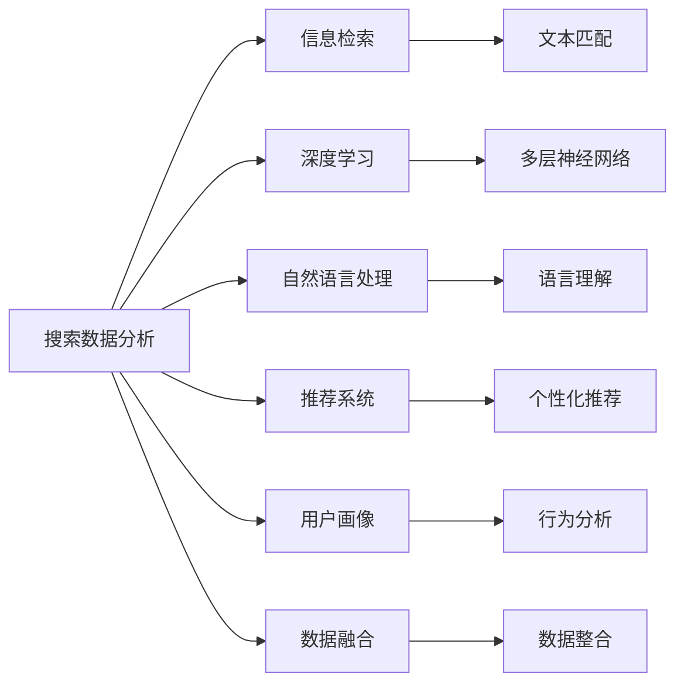

                 

# 搜索数据分析：AI如何提供深度洞察，优化搜索策略

## 1. 背景介绍

随着互联网的普及和信息爆炸，如何从海量数据中高效地获取所需信息，成为了信息检索领域面临的重大挑战。传统的搜索引擎依赖于文本匹配、关键词统计等简单的算法，已难以满足用户对深度、个性化和实时性的搜索需求。人工智能（AI）技术的引入，特别是深度学习算法和自然语言处理（NLP）技术，为这一领域带来了深刻的变革。

## 2. 核心概念与联系

### 2.1 核心概念概述

- **搜索数据分析**：利用AI技术对用户搜索行为和数据进行深入分析，提取有价值的信息，优化搜索策略，提升用户体验。
- **信息检索**：从大规模数据集中快速找到相关信息，满足用户的信息需求。
- **深度学习**：通过构建复杂的多层神经网络，学习数据的高级表示和复杂关系，以实现对数据的深入理解。
- **自然语言处理**：利用AI技术理解和处理人类语言，使其能够理解和响应自然语言指令。
- **推荐系统**：根据用户行为和偏好，推荐相关的信息或物品，提升用户体验。
- **用户画像**：通过分析用户的历史行为和特征，构建详尽的用户画像，用于个性化推荐和精准广告。
- **数据融合**：将来自不同来源和格式的数据进行整合和分析，形成全面的数据视图。

### 2.2 核心概念原理和架构的 Mermaid 流程图



这个流程图展示了搜索数据分析的核心组件及其相互关系：

1. **搜索数据分析**：通过深度学习、自然语言处理等技术，对用户搜索行为和数据进行分析。
2. **信息检索**：利用文本匹配等算法，从数据集中找到相关信息。
3. **深度学习**：构建多层神经网络，学习数据的高级表示和复杂关系。
4. **自然语言处理**：理解和处理自然语言，使其能够与用户进行有效交流。
5. **推荐系统**：根据用户画像和行为数据，推荐相关信息。
6. **用户画像**：通过分析用户行为，构建详尽的用户画像。
7. **数据融合**：整合来自不同来源的数据，形成全面的数据视图。

## 3. 核心算法原理 & 具体操作步骤

### 3.1 算法原理概述

基于AI的搜索数据分析，核心在于利用深度学习技术，从用户搜索行为中提取高维表示，并利用这些表示进行信息的精准检索和个性化推荐。其主要步骤如下：

1. **数据预处理**：收集和清洗用户搜索数据，提取文本特征。
2. **特征表示学习**：使用深度学习模型学习用户搜索行为的高级表示。
3. **信息检索**：利用学习到的表示，进行信息匹配和排序。
4. **推荐系统**：根据用户画像和行为数据，推荐相关信息。
5. **模型优化**：通过调整模型参数和超参数，优化模型性能。

### 3.2 算法步骤详解

#### 3.2.1 数据预处理

- **数据收集**：收集用户的搜索历史、点击行为、浏览记录等数据。
- **数据清洗**：去除噪声数据、处理缺失值、去重等。
- **特征提取**：提取文本特征，如TF-IDF、词向量、句法特征等。

#### 3.2.2 特征表示学习

- **嵌入学习**：使用Word2Vec、GloVe等技术，将文本特征转换为向量表示。
- **深度学习模型**：构建卷积神经网络（CNN）、循环神经网络（RNN）或Transformer模型，学习高级表示。

#### 3.2.3 信息检索

- **向量匹配**：使用余弦相似度、欧式距离等方法，计算查询和文档的相似度。
- **排序算法**：使用基于排序的算法，如倒排索引、Doc2Vec等，对搜索结果进行排序。

#### 3.2.4 推荐系统

- **协同过滤**：分析用户行为，找到相似用户，推荐其感兴趣的内容。
- **内容推荐**：根据文档内容，推荐相关的文档或物品。
- **混合推荐**：结合基于用户的推荐和基于内容的推荐，提升推荐效果。

#### 3.2.5 模型优化

- **超参数调优**：调整模型参数和学习率，优化模型性能。
- **模型融合**：融合多个模型的输出，提高预测准确率。
- **在线学习**：不断更新模型，适应新的数据和用户行为。

### 3.3 算法优缺点

#### 3.3.1 优点

- **精度高**：深度学习模型能够学习到数据的高级表示，提高检索和推荐的准确率。
- **灵活性高**：能够处理多模态数据，如文本、图像、视频等。
- **可解释性**：通过模型可视化和特征分析，可以解释模型的决策过程。
- **自适应**：能够根据新数据和新用户行为不断更新模型。

#### 3.3.2 缺点

- **计算资源需求高**：深度学习模型需要大量计算资源进行训练和推理。
- **数据需求大**：需要大量的标注数据进行模型训练，获取高质量数据成本高。
- **模型复杂**：模型结构复杂，调试和维护难度大。
- **泛化能力差**：模型在特定数据集上训练得到的表示可能不具备良好的泛化能力。

### 3.4 算法应用领域

基于AI的搜索数据分析技术，已经广泛应用于以下领域：

- **电商推荐**：根据用户搜索历史和点击行为，推荐相关商品。
- **新闻推荐**：根据用户阅读习惯，推荐感兴趣的新闻内容。
- **广告投放**：通过用户画像和行为数据，精准投放广告。
- **金融风控**：分析用户搜索和行为数据，识别潜在风险用户。
- **社交网络**：推荐用户感兴趣的朋友和内容，提升用户体验。
- **健康医疗**：推荐相关医疗信息，辅助医生诊断和治疗。
- **教育培训**：推荐学习资源，提高学习效果。

## 4. 数学模型和公式 & 详细讲解

### 4.1 数学模型构建

假设用户搜索查询为$q$，相关文档集合为$D$，文档中包含的词汇表示为$W$。设$W$中每个词汇的词向量表示为$v_w$，则查询$q$的表示可以表示为：

$$
q = \sum_{w \in q} v_w
$$

其中$q$为查询词的词向量表示。文档$d$的表示可以表示为：

$$
d = \sum_{w \in d} v_w
$$

其中$d$为文档词的词向量表示。

### 4.2 公式推导过程

#### 4.2.1 文本匹配

使用余弦相似度计算查询$q$与文档$d$的匹配度$sim$：

$$
sim = \frac{q \cdot d}{\|q\|\|d\|}
$$

其中$\cdot$表示向量点积，$\|\cdot\|$表示向量范数。

#### 4.2.2 信息检索

排序算法可以使用基于排序的算法，如Doc2Vec，计算每个文档与查询的匹配度，排序输出。

### 4.3 案例分析与讲解

#### 4.3.1 电商推荐

电商平台上，用户通过搜索商品、查看商品详情、购买商品等行为，产生大量的搜索数据。通过对这些数据进行分析，可以构建用户画像，推荐用户感兴趣的商品。

#### 4.3.2 新闻推荐

新闻平台收集用户阅读历史和点击行为数据，利用这些数据训练深度学习模型，预测用户感兴趣的新闻内容，推荐给用户。

#### 4.3.3 广告投放

广告平台通过用户搜索历史和行为数据，构建用户画像，精准投放广告。例如，可以根据用户的搜索关键词，推荐相关广告，提升广告效果。

## 5. 项目实践：代码实例和详细解释说明

### 5.1 开发环境搭建

为了实现基于AI的搜索数据分析，需要搭建一个包含深度学习库和数据处理工具的开发环境。以下是搭建环境的步骤：

1. **安装Python**：下载并安装Python 3.7或更高版本。
2. **安装TensorFlow**：通过pip安装TensorFlow 2.0或更高版本。
3. **安装Keras**：通过pip安装Keras 2.4.3或更高版本。
4. **安装Pandas**：通过pip安装Pandas 1.0.5或更高版本。
5. **安装NumPy**：通过pip安装NumPy 1.18.5或更高版本。
6. **安装Scikit-learn**：通过pip安装Scikit-learn 0.23.1或更高版本。

### 5.2 源代码详细实现

以下是一个基于深度学习的搜索数据分析项目的示例代码：

```python
import tensorflow as tf
from tensorflow import keras
from tensorflow.keras.layers import Embedding, Dense, Dropout
from tensorflow.keras.models import Sequential
from tensorflow.keras.preprocessing.text import Tokenizer
from tensorflow.keras.preprocessing.sequence import pad_sequences

# 构建深度学习模型
def build_model(input_dim, output_dim, embedding_dim, dropout_rate):
    model = Sequential()
    model.add(Embedding(input_dim, embedding_dim, input_length=max_len))
    model.add(Dropout(dropout_rate))
    model.add(Dense(128, activation='relu'))
    model.add(Dense(output_dim, activation='softmax'))
    model.compile(loss='categorical_crossentropy', optimizer='adam', metrics=['accuracy'])
    return model

# 数据预处理
tokenizer = Tokenizer()
tokenizer.fit_on_texts(train_texts)
train_sequences = tokenizer.texts_to_sequences(train_texts)
dev_sequences = tokenizer.texts_to_sequences(dev_texts)
test_sequences = tokenizer.texts_to_sequences(test_texts)

max_len = max([len(x) for x in train_sequences])
train_padded = pad_sequences(train_sequences, maxlen=max_len)
dev_padded = pad_sequences(dev_sequences, maxlen=max_len)
test_padded = pad_sequences(test_sequences, maxlen=max_len)

# 构建模型并训练
model = build_model(input_dim=tokenizer.num_words, output_dim=num_classes, embedding_dim=100, dropout_rate=0.5)
model.fit(train_padded, train_labels, epochs=10, batch_size=32, validation_data=(dev_padded, dev_labels))

# 评估模型
loss, accuracy = model.evaluate(test_padded, test_labels)
print('Test Accuracy:', accuracy)
```

### 5.3 代码解读与分析

#### 5.3.1 数据预处理

使用`Tokenizer`将文本转换为词序列，并通过`pad_sequences`进行填充，使其长度一致。

#### 5.3.2 模型构建

使用Keras构建深度学习模型，包括嵌入层、dropout层和全连接层，最后输出softmax层。

#### 5.3.3 模型训练

使用`fit`方法进行模型训练，设置训练轮数、批大小和验证集。

#### 5.3.4 模型评估

使用`evaluate`方法对测试集进行评估，输出损失和准确率。

## 6. 实际应用场景

### 6.1 电商推荐

在电商平台上，通过分析用户的搜索历史和点击行为，可以构建用户画像，推荐用户感兴趣的商品。例如，某用户在搜索“T恤”后，系统会推荐相关品牌的T恤、相似风格的其他商品等。

### 6.2 新闻推荐

新闻平台利用用户的阅读历史和点击行为，训练深度学习模型，预测用户感兴趣的新闻内容，推荐给用户。例如，某用户在阅读某篇新闻后，系统会推荐该新闻的作者、相关主题的新闻等。

### 6.3 广告投放

广告平台通过用户搜索历史和行为数据，构建用户画像，精准投放广告。例如，某用户在搜索“旅游”后，系统会推荐相关的旅游广告、目的地、旅游套餐等。

## 7. 工具和资源推荐

### 7.1 学习资源推荐

1. **《深度学习》（Ian Goodfellow等著）**：详细介绍了深度学习的基本概念、算法和应用。
2. **《自然语言处理综论》（Daniel Jurafsky等著）**：全面介绍了NLP的基础知识和前沿技术。
3. **Kaggle**：提供丰富的数据集和竞赛，帮助学习者提高实践能力。
4. **Google Colab**：提供免费的GPU资源，方便学习者进行模型训练和实验。
5. **Coursera**：提供多门深度学习、NLP相关的课程，适合初学者和进阶者。

### 7.2 开发工具推荐

1. **TensorFlow**：谷歌开源的深度学习框架，功能强大，支持GPU加速。
2. **Keras**：高层API，简单易用，支持多种深度学习模型。
3. **PyTorch**：Facebook开源的深度学习框架，灵活高效。
4. **Pandas**：数据处理库，支持大规模数据集的处理和分析。
5. **NumPy**：数值计算库，支持高效的矩阵计算。

### 7.3 相关论文推荐

1. **《搜索引擎中的深度学习应用》（Ming Li等）**：介绍深度学习在搜索引擎中的应用。
2. **《基于深度学习的推荐系统》（Jian Guo等）**：介绍深度学习在推荐系统中的应用。
3. **《自然语言处理中的深度学习》（Yoshua Bengio等）**：介绍深度学习在NLP中的应用。
4. **《基于注意力机制的深度学习搜索技术》（Veselin Stoyanov等）**：介绍注意力机制在搜索中的应用。

## 8. 总结：未来发展趋势与挑战

### 8.1 研究成果总结

基于AI的搜索数据分析技术，已经在电商推荐、新闻推荐、广告投放等领域得到了广泛应用，取得了显著的效果。其主要技术包括深度学习、自然语言处理、推荐系统等。

### 8.2 未来发展趋势

1. **多模态数据融合**：将文本、图像、视频等多模态数据进行融合，提升搜索效果。
2. **个性化推荐**：结合用户画像和行为数据，进行个性化推荐，提升用户体验。
3. **实时搜索**：利用流式数据处理技术，实现实时搜索和推荐。
4. **知识图谱**：结合知识图谱，提升搜索结果的深度和广度。
5. **跨领域搜索**：在跨领域搜索场景中，提升搜索结果的相关性和准确性。

### 8.3 面临的挑战

1. **数据隐私**：在收集和处理用户数据时，需要确保用户隐私和数据安全。
2. **计算资源**：深度学习模型需要大量的计算资源进行训练和推理。
3. **模型复杂性**：深度学习模型结构复杂，调试和维护难度大。
4. **泛化能力**：模型在特定数据集上训练得到的表示可能不具备良好的泛化能力。
5. **模型解释性**：深度学习模型的决策过程缺乏可解释性。

### 8.4 研究展望

未来，基于AI的搜索数据分析技术需要在数据隐私保护、计算资源优化、模型解释性等方面取得突破。同时，结合多模态数据融合、个性化推荐、实时搜索等前沿技术，进一步提升搜索效果和用户体验。

## 9. 附录：常见问题与解答

**Q1: 什么是深度学习在搜索数据分析中的应用？**

A: 深度学习通过构建多层神经网络，学习数据的高级表示和复杂关系，从而实现对数据的深度理解和分析。在搜索数据分析中，深度学习模型可以用于提取文本特征、学习用户行为表示、进行信息匹配和推荐等。

**Q2: 如何优化基于深度学习的搜索数据分析模型？**

A: 优化深度学习模型的方法包括超参数调优、模型融合、在线学习等。超参数调优可以通过调整学习率、批量大小、隐藏层数等参数来优化模型性能。模型融合可以结合多个模型的输出，提升预测准确率。在线学习可以不断更新模型，适应新的数据和用户行为。

**Q3: 深度学习在搜索数据分析中面临哪些挑战？**

A: 深度学习在搜索数据分析中面临的主要挑战包括计算资源需求高、数据需求大、模型复杂性高、泛化能力差等。计算资源需求高体现在深度学习模型需要大量的计算资源进行训练和推理。数据需求大体现在深度学习模型需要大量的标注数据进行训练。模型复杂性高体现在深度学习模型结构复杂，调试和维护难度大。泛化能力差体现在模型在特定数据集上训练得到的表示可能不具备良好的泛化能力。

**Q4: 如何确保基于深度学习的搜索数据分析中的数据隐私？**

A: 确保数据隐私的方法包括数据匿名化、数据加密、差分隐私等。数据匿名化可以将用户的敏感信息去除或模糊化，保护用户隐私。数据加密可以在数据传输和存储过程中，对数据进行加密保护。差分隐私可以通过添加噪声等手段，保护用户隐私的同时，保证数据的准确性。

通过以上分析，我们可以看出，基于AI的搜索数据分析技术，通过深度学习、自然语言处理、推荐系统等技术，实现了对用户搜索行为和数据的深入分析，提升了搜索效果和用户体验。未来，随着技术的不断发展，基于深度学习的搜索数据分析技术将在更多领域得到应用，为人类社会带来更深远的变革。

