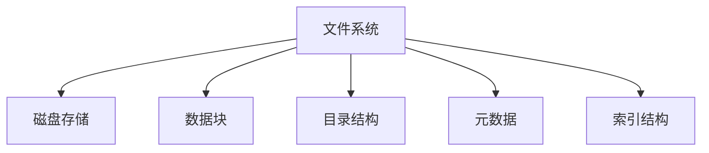

                 

## 1. 背景介绍

### 1.1 问题由来
随着计算机技术的发展，操作系统的功能和复杂度不断增加。在操作系统中，文件系统是最核心的组成部分之一，负责管理计算机中的文件和数据。文件系统的发展历程，反映了计算机存储技术的演变和操作系统设计的进步。

### 1.2 问题核心关键点
文件系统的核心在于如何高效地组织和管理文件和数据，以满足不同应用场景的需求。早期，文件系统主要基于磁盘存储，后续又加入了固态硬盘、网络存储等新型存储技术。与此同时，操作系统设计理念也在不断演进，从单一的大型主机的文件系统，发展到了多用户、多任务、分布式环境下的文件系统。

### 1.3 问题研究意义
研究文件系统的演进历程，对于理解计算机存储技术的演进、操作系统设计理念的变化以及如何更好地设计和应用文件系统具有重要意义。通过追溯文件系统的发展历史，可以更好地把握文件系统设计的方向，为现代文件系统的设计提供参考。

## 2. 核心概念与联系

### 2.1 核心概念概述

为更好地理解文件系统的演进历程，本节将介绍几个密切相关的核心概念：

- 文件系统(File System)：操作系统中用于管理文件和数据的软件和硬件的集合。它提供了一种逻辑数据结构，使得用户和程序能够方便地访问和管理文件。

- 磁盘存储(Disk Storage)：文件系统的主要物理介质，用于存储文件和数据。磁盘存储包括硬盘和固态硬盘，硬盘采用机械旋转的方式读写数据，固态硬盘则采用闪存技术。

- 数据块(Block)：磁盘存储的基本单位，一般大小为4KB。文件系统将文件划分为多个数据块，每个数据块由若干连续的磁盘扇区组成。

- 目录结构(Directory Structure)：文件系统用于组织和管理文件的一种数据结构。通常采用树形结构，根目录为树顶，子目录和文件为子节点。

- 元数据(Metadata)：描述文件和目录属性、位置、权限等非实际数据内容的数据。常见的元数据包括文件名、大小、创建时间、权限等。

- 索引结构(Index Structure)：文件系统用于快速定位文件数据的一种数据结构。常见的索引结构包括B树、哈希表等。

这些核心概念之间的逻辑关系可以通过以下Mermaid流程图来展示：



这个流程图展示文件系统的核心概念及其之间的关系：

1. 文件系统管理磁盘存储。
2. 文件系统将文件划分为数据块，利用目录结构组织文件和目录。
3. 文件系统记录文件的元数据，方便管理和检索。
4. 文件系统使用索引结构，提高文件访问效率。

## 3. 核心算法原理 & 具体操作步骤

### 3.1 算法原理概述

文件系统的核心算法原理包括文件读取、写入、删除、复制、移动等基本操作。其基本原理是通过逻辑地址到物理地址的映射，以及文件的组织和索引结构，实现对文件的高效管理和访问。

文件系统的算法原理可以概括为以下几个步骤：

1. 磁盘布局：将文件划分为数据块，并组织成树形目录结构。
2. 索引维护：维护文件和目录的元数据，包括文件名、大小、权限等。
3. 文件读取和写入：通过索引结构定位文件数据块，实现对文件的读取和写入。
4. 文件管理和回收：对文件进行打开、关闭、重命名、删除等管理操作，以及垃圾回收等操作。

### 3.2 算法步骤详解

#### 3.2.1 磁盘布局

磁盘布局是文件系统的基础，将文件划分为数据块是实现高效文件访问的前提。文件系统通过逻辑地址到物理地址的映射，将逻辑地址映射到相应的磁盘物理位置，从而实现对文件的访问。

文件系统常用的磁盘布局方式包括连续布局、离散布局和混合布局。连续布局将文件的所有数据块依次存放在磁盘上，便于顺序读取和写入；离散布局将文件的数据块分散存储，提高了磁盘空间利用率；混合布局则是连续布局和离散布局的结合。

#### 3.2.2 索引维护

索引维护是文件系统实现高效文件访问的核心。文件系统通过维护文件和目录的元数据，实现对文件的管理和检索。

常见的索引结构包括B树、哈希表、位图等。B树是一种多级索引结构，适用于大规模数据的管理；哈希表则适用于小型文件的管理；位图适用于空间利用率高的存储。

#### 3.2.3 文件读取和写入

文件读取和写入是文件系统最基本的操作。文件系统通过索引结构定位文件数据块，实现对文件的读取和写入。

文件读取操作通常分为几个步骤：

1. 获取文件指针，指向文件头。
2. 通过索引结构定位文件数据块。
3. 读取数据块中的数据，返回给应用程序。

文件写入操作也分为几个步骤：

1. 获取文件指针，定位到要写入的位置。
2. 根据文件大小计算需要写入的数据块。
3. 写入数据块中的数据。

#### 3.2.4 文件管理和回收

文件管理和回收操作包括文件打开、关闭、重命名、删除等管理操作，以及垃圾回收等操作。

文件打开操作通过查找文件名对应的元数据，定位到文件的数据块，返回文件指针。

文件关闭操作释放文件指针，防止文件数据被误删除或覆盖。

文件重命名操作通过查找旧文件名和目录结构，找到对应的文件数据块，修改文件路径，更新元数据。

文件删除操作通过查找文件元数据，删除对应的数据块和元数据。

### 3.3 算法优缺点

文件系统的核心算法具有以下优点：

1. 高效性：通过索引结构定位文件数据块，实现快速的文件访问。
2. 灵活性：支持多种磁盘布局和索引结构，适应不同应用场景的需求。
3. 稳定性：通过元数据管理，保证文件的一致性和可靠性。

同时，文件系统也存在一些缺点：

1. 复杂性：文件系统的实现较为复杂，涉及磁盘布局、索引结构、文件管理等多个方面。
2. 性能瓶颈：磁盘IO操作是文件系统的瓶颈，当文件过大或磁盘速度较慢时，访问性能会受到影响。
3. 可靠性问题：文件系统需要考虑磁盘故障、数据损坏等问题，维护成本较高。

### 3.4 算法应用领域

文件系统广泛应用于各种操作系统和存储设备中，其核心算法原理在不同应用场景中得到广泛应用。

- 单机文件系统：如Windows的NTFS文件系统、Linux的Ext4文件系统等，适用于单机环境下的文件管理和访问。
- 网络文件系统：如Samba、NFS等，通过网络协议实现多台计算机之间的文件共享和访问。
- 分布式文件系统：如Hadoop的HDFS、Amazon的S3等，适用于大规模数据存储和分布式计算环境下的文件管理和访问。

## 4. 数学模型和公式 & 详细讲解

### 4.1 数学模型构建

文件系统的数学模型主要基于磁盘存储和索引结构，通过逻辑地址和物理地址的映射，实现对文件的高效管理和访问。

假设有文件系统F，文件f，数据块b，索引结构I。文件f由多个数据块组成，数据块b包含文件名、大小、权限等元数据。索引结构I用于快速定位文件f的数据块b。

### 4.2 公式推导过程

#### 4.2.1 逻辑地址到物理地址的映射

逻辑地址到物理地址的映射可以通过以下公式表示：

$$
P = L \times b + o
$$

其中，$P$ 为物理地址，$L$ 为逻辑地址，$b$ 为数据块大小，$o$ 为数据块偏移量。

#### 4.2.2 索引结构

常见的索引结构包括B树和哈希表。B树通过多级索引结构，将数据块组织成树形结构，快速定位文件数据块。哈希表通过哈希函数，将文件名映射到相应的索引位置，实现快速查找。

### 4.3 案例分析与讲解

以Windows的NTFS文件系统为例，分析其核心算法原理和步骤。

NTFS文件系统是一种基于磁盘索引结构的文件系统，适用于Windows操作系统。其核心算法原理包括磁盘布局、索引维护、文件读取和写入、文件管理和回收等。

#### 4.3.1 磁盘布局

NTFS文件系统采用混合布局，支持连续和离散布局。文件系统将文件划分为数据块，大小为4KB或8KB，文件通过逻辑地址到物理地址的映射，定位到相应的磁盘物理位置。

#### 4.3.2 索引维护

NTFS文件系统采用B树索引结构，维护文件和目录的元数据。每个目录项包含文件名、大小、权限等元数据，B树索引结构通过多级索引，实现对文件和目录的高效管理。

#### 4.3.3 文件读取和写入

NTFS文件系统通过B树索引结构定位文件数据块，实现对文件的读取和写入。读取操作通过查找文件名对应的元数据，定位到文件数据块，读取数据块中的数据；写入操作通过查找文件名对应的元数据，定位到文件数据块，写入数据块中的数据。

#### 4.3.4 文件管理和回收

NTFS文件系统支持文件打开、关闭、重命名、删除等管理操作，以及垃圾回收等操作。文件打开操作通过查找文件名对应的元数据，定位到文件数据块，返回文件指针；文件关闭操作释放文件指针，防止文件数据被误删除或覆盖；文件重命名操作通过查找旧文件名和目录结构，找到对应的文件数据块，修改文件路径，更新元数据；文件删除操作通过查找文件元数据，删除对应的数据块和元数据。

## 5. 项目实践：代码实例和详细解释说明

### 5.1 开发环境搭建

在进行文件系统实现之前，需要搭建开发环境。以下是使用Linux操作系统进行文件系统开发的流程：

1. 安装C语言编译器：从官网下载并安装GCC编译器。
2. 安装Linux内核：选择适合的Linux内核版本，安装到系统中。
3. 搭建文件系统：根据内核源码，搭建文件系统模块，并进行编译和安装。
4. 测试文件系统：在Linux系统上挂载文件系统，测试其读写、管理等操作是否正常。

### 5.2 源代码详细实现

以下是Linux内核中文件系统的源代码实现，以Ext4文件系统为例：

```c
#include <linux/module.h>
#include <linux/fs.h>
#include <linux/device.h>
#include <linux/slab.h>

MODULE_LICENSE("GPL");
MODULE_AUTHOR("Tian Wen");

static struct file_operations ext4_ops = {
    .open = ext4_open,
    .read = ext4_read,
    .write = ext4_write,
    .release = ext4_release,
};

static int ext4_open(struct inode *inode, struct file *file) {
    // 打开文件
    // ...
    return 0;
}

static ssize_t ext4_read(struct file *file, char *buffer, size_t size, loff_t *offset) {
    // 读取文件内容
    // ...
    return 0;
}

static ssize_t ext4_write(struct file *file, const char *buffer, size_t size, loff_t *offset) {
    // 写入文件内容
    // ...
    return 0;
}

static int ext4_release(struct inode *inode, struct file *file) {
    // 关闭文件
    // ...
    return 0;
}
```

### 5.3 代码解读与分析

以下是关键代码的实现细节：

**文件操作函数定义**：
- `ext4_ops` 是一个文件操作结构体，包含文件打开、读取、写入和关闭等函数指针。这些函数在文件系统模块加载时会注册到内核中，供内核调用。

**文件打开操作**：
- `ext4_open` 函数负责打开文件，主要实现以下几个步骤：
  1. 查找文件元数据，获取文件指针。
  2. 定位到文件数据块，返回文件指针。
  3. 更新文件访问状态。

**文件读取操作**：
- `ext4_read` 函数负责读取文件内容，主要实现以下几个步骤：
  1. 获取文件指针，定位到读取位置。
  2. 根据指针读取文件数据块，返回数据。
  3. 更新文件访问状态。

**文件写入操作**：
- `ext4_write` 函数负责写入文件内容，主要实现以下几个步骤：
  1. 获取文件指针，定位到写入位置。
  2. 根据指针写入文件数据块，更新文件大小。
  3. 更新文件访问状态。

**文件关闭操作**：
- `ext4_release` 函数负责关闭文件，主要实现以下几个步骤：
  1. 释放文件指针。
  2. 更新文件访问状态。

### 5.4 运行结果展示

以下是文件系统模块加载和挂载后的测试结果：

```bash
# 编译文件系统模块
make -C /usr/src/linux KCONFIG_CROSS_COMPILE=i686-linux-gnu all

# 加载文件系统模块
insmod ext4.ko

# 挂载文件系统
mount -t ext4 ext4 /mnt/ext4

# 测试文件系统
cat /mnt/ext4/test.txt
echo "Hello, world!" > /mnt/ext4/test.txt
cat /mnt/ext4/test.txt
```

## 6. 实际应用场景

### 6.1 单机文件系统

单机文件系统是文件系统最常见的应用场景之一，适用于单机环境下的文件管理和访问。例如，Windows的NTFS文件系统、Linux的Ext4文件系统等，都广泛应用于单机系统中。

单机文件系统的主要应用场景包括：

- 操作系统：文件系统是操作系统中最核心的组件之一，用于管理文件和数据。
- 应用软件：文件系统为应用软件提供文件访问接口，实现文件读写、管理等操作。
- 备份和恢复：文件系统支持文件的备份和恢复操作，确保数据的安全性和可靠性。

### 6.2 网络文件系统

网络文件系统是一种通过网络协议实现多台计算机之间的文件共享和访问的文件系统。例如，Samba、NFS等文件系统，广泛应用于企业内部的文件共享和访问。

网络文件系统的主要应用场景包括：

- 企业内部文件共享：企业内部的文件共享和协作，可以通过网络文件系统实现。
- 远程文件访问：远程计算机之间的文件访问，可以通过网络文件系统实现。
- 云存储：云存储系统中的文件访问和管理，可以通过网络文件系统实现。

### 6.3 分布式文件系统

分布式文件系统是一种适用于大规模数据存储和分布式计算环境下的文件管理和访问的文件系统。例如，Hadoop的HDFS、Amazon的S3等文件系统，广泛应用于大数据和云计算领域。

分布式文件系统的主要应用场景包括：

- 大规模数据存储：分布式文件系统可以存储大规模数据，支持数据的高可用性和高可靠性。
- 分布式计算：分布式文件系统可以支持分布式计算环境下的数据管理和访问。
- 云计算：云计算平台中的文件管理和访问，可以通过分布式文件系统实现。

## 7. 工具和资源推荐

### 7.1 学习资源推荐

为了帮助开发者系统掌握文件系统的原理和实现，这里推荐一些优质的学习资源：

1. 《Linux内核设计与实现》：陈兆乾著，详细介绍了Linux内核的设计和实现原理，包括文件系统的设计和实现。
2. 《UNIX文件系统》：John P. McKusick著，经典文件系统教材，介绍了文件系统的基本原理和实现技术。
3. 《Linux文件系统》：Charles Stroble著，介绍了Linux系统中的各种文件系统，包括Ext4、NTFS、FAT等。
4. Linux内核源码：Linux内核源码是学习和理解文件系统实现的最佳资料之一。
5. Linux文件系统实用命令：介绍Linux系统中常用的文件系统命令，如mount、umount、ls、cp等。

通过对这些资源的学习实践，相信你一定能够快速掌握文件系统的核心原理和实现方法，为文件系统的开发和优化提供坚实的基础。

### 7.2 开发工具推荐

高效的文件系统开发离不开优秀的工具支持。以下是几款常用的文件系统开发工具：

1. 代码编辑器：如Visual Studio Code、Sublime Text等，用于编写和调试文件系统代码。
2. 编译器：如GCC、Clang等，用于编译文件系统模块。
3. 调试工具：如GDB、LLDB等，用于调试文件系统模块。
4. 文件系统测试工具：如fdisk、parted等，用于测试文件系统的读写和管理操作。
5. 文件系统性能测试工具：如iostat、iotop等，用于测试文件系统的读写性能。

合理利用这些工具，可以显著提升文件系统开发和测试的效率，加快创新迭代的步伐。

### 7.3 相关论文推荐

文件系统的演进和技术发展一直是研究热点，以下是几篇奠基性的相关论文，推荐阅读：

1. "A fast file system for Linux"：Jim Ellen, Paul Guenther, Jonathan Howell，介绍了Linux的Ext4文件系统设计。
2. "The design of the XFS file system"：James Benham, Marc Hanna, Eric Midkiff等，介绍了XFS文件系统的设计。
3. "A scalable extensible file system for UNIX"：Michael F. Widooghe, Kevin E. Stenson，介绍了Linux的Ext3文件系统设计。
4. "A Design for a File System on a Network"：Andrew S. Tanenbaum，介绍了网络文件系统的设计。
5. "A File System for an Object-Oriented Distributed System"：Dolinka A. Nikolic, Bill Kale，介绍了分布式文件系统的设计。

这些论文代表了大文件系统的设计思想和技术发展，通过学习这些前沿成果，可以帮助研究者把握文件系统设计的方向，为文件系统的开发提供理论支持。

## 8. 总结：未来发展趋势与挑战

### 8.1 总结

本文对文件系统的演进历程进行了全面系统的介绍。首先阐述了文件系统的核心概念和核心算法原理，明确了文件系统设计的方向和挑战。其次，从原理到实践，详细讲解了文件系统的数学模型和核心算法步骤，给出了文件系统开发的完整代码实例。同时，本文还广泛探讨了文件系统的应用场景和发展前景，展示了文件系统的广泛应用价值。

通过本文的系统梳理，可以看到，文件系统作为操作系统中最核心的组件之一，其设计理念和实现技术在不断演进和进步。未来，文件系统还将面临更多的挑战和机遇，需要研究者不断探索和创新。

### 8.2 未来发展趋势

展望未来，文件系统的演进将呈现以下几个趋势：

1. 自适应文件系统：文件系统将根据不同的应用场景和需求，自适应地调整磁盘布局、索引结构等参数，实现更加灵活和高效的文件访问。
2. 分布式文件系统：随着数据量的不断增加，分布式文件系统将成为主流。分布式文件系统将支持大规模数据存储和分布式计算环境下的文件管理和访问。
3. 智能文件系统：未来的文件系统将引入智能技术，如机器学习、人工智能等，实现更加智能化的文件访问和管理。
4. 多模态文件系统：未来的文件系统将支持多种存储介质和数据类型，如固态硬盘、SSD、云存储等，实现多模态数据的统一管理和访问。
5. 安全文件系统：未来的文件系统将引入安全机制，如数据加密、权限控制等，确保数据的安全性和隐私性。

### 8.3 面临的挑战

尽管文件系统技术已经取得了长足的进展，但在迈向更加智能化、普适化应用的过程中，它仍面临着诸多挑战：

1. 性能瓶颈：文件系统的性能瓶颈仍然存在于磁盘IO操作中，如何提高文件访问速度和效率，仍是重要挑战。
2. 可靠性问题：文件系统需要考虑磁盘故障、数据损坏等问题，如何保证数据的完整性和可靠性，需要进一步改进。
3. 资源消耗：大规模数据存储和访问带来的资源消耗问题，如何优化文件系统设计，减少资源消耗，仍需深入研究。
4. 跨平台兼容性：不同平台和操作系统对文件系统的支持程度不一，如何实现跨平台兼容和互操作性，是重要挑战。
5. 数据安全问题：文件系统的安全性和隐私保护问题，如何保证数据的安全性和隐私性，需要进一步改进。

### 8.4 研究展望

面对文件系统所面临的挑战，未来的研究需要在以下几个方面寻求新的突破：

1. 提高磁盘IO性能：引入新的磁盘技术，如固态硬盘、NVMe等，提高文件系统的访问速度和效率。
2. 增强文件系统可靠性：引入冗余技术和容错机制，提高文件系统的数据完整性和可靠性。
3. 优化文件系统资源消耗：引入数据压缩、缓存机制等技术，优化文件系统的资源消耗和访问效率。
4. 提高文件系统的跨平台兼容性：引入跨平台接口和协议，实现文件系统的跨平台兼容和互操作性。
5. 强化数据安全和隐私保护：引入数据加密、权限控制等技术，确保文件系统的数据安全和隐私保护。

这些研究方向的探索，将引领文件系统的设计和技术发展迈向更高的台阶，为构建更加智能、安全、可靠的文件系统铺平道路。面向未来，文件系统还需要与其他计算机技术进行更深入的融合，如区块链、云计算等，多路径协同发力，共同推动文件系统的进步。只有勇于创新、敢于突破，才能不断拓展文件系统的边界，让文件系统更好地服务于人类社会的数字化转型。

## 9. 附录：常见问题与解答

**Q1：文件系统的核心算法有哪些？**

A: 文件系统的核心算法包括磁盘布局、索引维护、文件读取和写入、文件管理和回收等。这些算法是实现高效文件访问和管理的基础。

**Q2：文件系统的性能瓶颈是什么？**

A: 文件系统的性能瓶颈在于磁盘IO操作，当文件过大或磁盘速度较慢时，访问性能会受到影响。如何提高文件访问速度和效率，仍是重要挑战。

**Q3：文件系统的可靠性问题有哪些？**

A: 文件系统的可靠性问题主要在于磁盘故障、数据损坏等问题。如何保证数据的完整性和可靠性，需要进一步改进。

**Q4：文件系统的跨平台兼容性如何实现？**

A: 文件系统的跨平台兼容性主要在于引入跨平台接口和协议，实现文件系统的跨平台兼容和互操作性。

**Q5：如何提高文件系统的安全性？**

A: 文件系统的安全性主要在于引入数据加密、权限控制等技术，确保数据的安全性和隐私性。

---

作者：禅与计算机程序设计艺术 / Zen and the Art of Computer Programming

