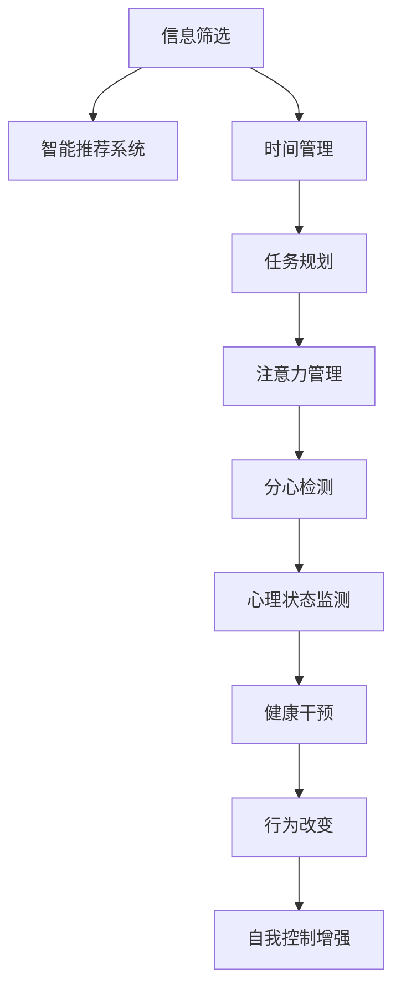

                 

## 1. 背景介绍

### 1.1 问题由来

在数字化时代，人们面临着前所未有的信息爆炸和技术迭代。如何在海量的信息流中保持自我控制、避免过度依赖电子设备和网络，成为了一个日益严峻的挑战。尤其是对于现代社会中数字原住民一代，如何在快速变化的技术环境中保持心理和生理的健康，是每一个需要面对的问题。

### 1.2 问题核心关键点

自我控制（Self-Control），是指个体在面对诱惑或延迟满足时，能够抑制冲动、坚持长期目标的能力。而数字化时代，技术的不断演进和信息的不停流动，不断冲击着人们的自我控制能力。

1. **信息过载**：海量信息的爆炸性增长，让人难以从中筛选出有用信息，容易陷入决策疲劳，甚至产生信息焦虑。
2. **即时满足**：电子设备和应用提供即时反馈，容易让人陷入即时满足的陷阱，影响长期目标的坚持。
3. **分心干扰**：数字设备的多任务处理功能，使人们难以集中注意力，影响工作效率和学习效果。
4. **数据泄露**：个人信息的收集和分析，可能被滥用，影响隐私和安全。
5. **认知负荷**：频繁的电子设备使用，可能对认知能力产生负面影响，如注意力分散、记忆力下降等。

### 1.3 问题研究意义

数字化时代的自我控制问题，不仅是个人心理健康的挑战，更是影响社会发展的关键因素。通过技术手段增强自我控制能力，不仅有助于提升个人生产力和生活质量，还能促进社会的和谐与进步。

1. **提升生产力**：减少因信息过载和分心干扰导致的效率低下。
2. **改善心理健康**：通过减少即时满足带来的心理压力，增强对长期目标的坚持。
3. **保护隐私安全**：合理使用技术手段，避免数据泄露和滥用。
4. **增强认知能力**：科学使用数字设备，避免认知负荷过重。

## 2. 核心概念与联系

### 2.1 核心概念概述

在数字化时代增强自我控制，核心在于利用人工智能（AI）技术辅助个体实现对信息的筛选和利用，合理使用数字设备，优化注意力和决策过程。这包括但不限于：

- **智能推荐系统**：利用AI对信息进行筛选和推荐，帮助用户高效获取有用信息。
- **时间管理工具**：通过AI预测和管理时间，帮助用户合理安排工作和学习。
- **健康监测与干预**：使用AI对生理和心理状态进行监测，并提供健康干预措施。
- **个性化心理辅导**：基于AI的个性化心理辅导，提供针对性的心理支持和建议。

这些技术手段的联合应用，将使个体能够在数字化环境中更好地保持自我控制。

### 2.2 核心概念原理和架构的 Mermaid 流程图



## 3. 核心算法原理 & 具体操作步骤

### 3.1 算法原理概述

增强自我控制的AI技术，基于认知行为科学和机器学习原理。其核心思想是通过算法和模型，对用户的行为和心理状态进行分析和预测，并提供针对性的干预和建议，以辅助用户实现自我控制。

### 3.2 算法步骤详解

#### 3.2.1 用户行为数据分析

1. **数据收集**：收集用户的各类行为数据，如设备使用时间、应用访问记录、健康数据（如心率、睡眠等）。
2. **数据清洗**：对收集到的数据进行清洗和处理，确保数据质量和一致性。
3. **特征提取**：从数据中提取有意义的特征，如应用使用频率、使用时长、生理状态等。

#### 3.2.2 用户心理状态评估

1. **情感分析**：使用自然语言处理技术，对用户的文字记录（如日志、笔记等）进行情感分析，评估用户的情绪状态。
2. **认知负荷评估**：通过心理测试和生理监测数据，评估用户的认知负荷水平。
3. **自我效能评估**：通过问卷调查和用户反馈，评估用户的自我效能和行为倾向。

#### 3.2.3 智能推荐和决策支持

1. **信息筛选和推荐**：基于用户的兴趣和心理状态，利用机器学习算法推荐相关内容，减少信息过载。
2. **任务规划和优先级排序**：使用算法对任务进行优先级排序，帮助用户合理规划时间。
3. **注意力管理**：通过算法监测用户的分心行为，并提醒用户进行注意力转移。

#### 3.2.4 健康监测和干预

1. **生理状态监测**：使用传感器监测用户的生理状态，如心率、血压等。
2. **心理状态监测**：使用问卷调查和心理测试评估用户心理状态。
3. **健康干预**：根据监测结果，提供个性化的健康建议和干预措施。

#### 3.2.5 行为改变和自我控制增强

1. **行为改变建议**：基于用户的心理和生理状态，提供行为改变的建议和策略。
2. **自我控制训练**：使用认知行为科学的方法，辅助用户进行自我控制训练。
3. **反馈和调整**：根据用户的反馈，不断调整算法和策略，以提升效果。

### 3.3 算法优缺点

#### 3.3.1 优点

1. **高效性**：通过数据分析和智能推荐，帮助用户高效利用信息，减少决策疲劳。
2. **个性化**：基于用户的具体情况和需求，提供个性化的建议和干预，提高干预效果。
3. **可扩展性**：算法和模型可以不断优化和更新，适应新的场景和需求。

#### 3.3.2 缺点

1. **隐私风险**：数据收集和处理过程中可能存在隐私泄露风险，需要严格的数据保护措施。
2. **数据偏差**：用户数据可能存在偏差，影响算法的准确性和公正性。
3. **技术依赖**：对技术手段的依赖可能限制其在一些特殊场景中的应用。

### 3.4 算法应用领域

增强自我控制的AI技术，在多个领域都有广泛的应用：

- **健康与医疗**：辅助医生进行心理干预和健康管理，提升患者自我控制能力。
- **教育**：帮助学生管理学习时间和任务，提升学习效率和成绩。
- **企业与办公**：帮助员工管理时间、减少分心，提高工作效率和生产力。
- **个人生活**：帮助个人管理心理健康、提升生活质量，增强自我控制能力。

## 4. 数学模型和公式 & 详细讲解 & 举例说明

### 4.1 数学模型构建

假设用户的心理状态为 $x$，生理状态为 $y$，行为数据为 $z$。

定义一个综合评估函数 $f(x, y, z)$，用于评估用户的整体状态和行为倾向。其中：

- $x$ 为用户的心理状态，可以是情绪评分、认知负荷等。
- $y$ 为用户的生理状态，可以是心率、睡眠质量等。
- $z$ 为用户的各类行为数据，如设备使用时间、应用访问记录等。

### 4.2 公式推导过程

为了简化问题，我们假设 $f(x, y, z) = w_1x + w_2y + w_3z$，其中 $w_1, w_2, w_3$ 为权重。

#### 4.2.1 数据收集与预处理

假设用户的数据集为 $D = \{(x_i, y_i, z_i)\}_{i=1}^N$。

1. **数据清洗**：去除异常数据和噪声。
2. **特征标准化**：对心理状态和生理状态进行标准化处理，确保数据在相同量级。
3. **权重初始化**：设定初始权重 $w_1, w_2, w_3$。

#### 4.2.2 模型训练

使用机器学习算法（如回归、决策树等）对模型进行训练，优化权重 $w_1, w_2, w_3$。

#### 4.2.3 模型评估

使用验证集对模型进行评估，计算评估指标（如均方误差、R²等）。

### 4.3 案例分析与讲解

以一个学生为例，使用上述模型进行行为分析和管理：

1. **数据收集**：收集学生的各类行为数据，如每日的学习时间、设备使用时间、心理状态评估数据等。
2. **数据预处理**：清洗数据，标准化特征。
3. **模型训练**：使用机器学习算法对模型进行训练，得到权重 $w_1, w_2, w_3$。
4. **行为分析**：根据学生行为数据和心理状态，评估其整体状态 $f(x, y, z)$。
5. **干预建议**：根据评估结果，提供行为改变建议，如调整学习时间、使用设备时间等。

## 5. 项目实践：代码实例和详细解释说明

### 5.1 开发环境搭建

#### 5.1.1 Python环境配置

1. **安装Python**：下载并安装Python，建议使用3.8以上版本。
2. **安装依赖包**：
```
pip install pandas numpy scikit-learn matplotlib
```
3. **创建虚拟环境**：
```
python -m venv env
source env/bin/activate
```

#### 5.1.2 数据准备

1. **收集数据**：从各类应用（如学习应用、健康应用等）获取用户数据。
2. **数据清洗**：使用Python编写数据清洗脚本，去除异常值和噪声。
3. **数据存储**：将清洗后的数据存储在本地或云端，如MySQL、MongoDB等。

### 5.2 源代码详细实现

#### 5.2.1 数据预处理

```python
import pandas as pd
import numpy as np

def load_data(file_path):
    data = pd.read_csv(file_path)
    return data

def clean_data(data):
    # 数据清洗逻辑
    pass

def preprocess_data(data):
    # 数据标准化
    return data

def save_data(data, file_path):
    data.to_csv(file_path, index=False)
```

#### 5.2.2 模型训练

```python
from sklearn.ensemble import RandomForestRegressor

def train_model(data, features, target):
    model = RandomForestRegressor()
    model.fit(data[features], data[target])
    return model

def evaluate_model(model, data, features, target):
    y_pred = model.predict(data[features])
    mse = np.mean((y_pred - data[target])**2)
    r2 = model.score(data[features], data[target])
    return mse, r2
```

#### 5.2.3 行为分析与干预

```python
def analyze_user_state(user_data, model):
    features = ['学习时间', '设备使用时间', '心理状态评分']
    target = '行为倾向'
    state = model.predict(user_data[features])
    return state

def provide_intervention(state):
    # 行为干预逻辑
    pass
```

### 5.3 代码解读与分析

#### 5.3.1 数据预处理

数据预处理是模型训练的关键步骤，包括数据清洗、标准化等。使用Python的Pandas库可以方便地进行数据处理。

#### 5.3.2 模型训练

使用随机森林回归模型进行训练，通过评估指标（均方误差、R²等）评估模型效果。

#### 5.3.3 行为分析与干预

根据用户行为数据和心理状态，评估其整体状态，并根据评估结果提供行为干预建议。

### 5.4 运行结果展示

#### 5.4.1 数据预处理结果

```
In [1]: data = load_data('user_data.csv')

In [2]: clean_data(data)

In [3]: preprocessed_data = preprocess_data(clean_data)

In [4]: preprocessed_data.head()
```

#### 5.4.2 模型训练结果

```
In [5]: features = ['学习时间', '设备使用时间', '心理状态评分']

In [6]: target = '行为倾向'

In [7]: model = train_model(preprocessed_data, features, target)

In [8]: mse, r2 = evaluate_model(model, preprocessed_data, features, target)

In [9]: print(f'MSE: {mse:.3f}, R²: {r2:.3f}')
```

#### 5.4.3 行为分析与干预结果

```
In [10]: user_data = load_data('user_data.csv')

In [11]: state = analyze_user_state(user_data, model)

In [12]: intervention = provide_intervention(state)

In [13]: print(intervention)
```

## 6. 实际应用场景

### 6.1 企业员工管理

企业可以通过增强自我控制的AI技术，帮助员工管理时间和任务，减少分心，提升工作效率。例如：

- **时间管理工具**：基于员工的设备使用和任务完成情况，提供时间管理和任务优先级建议。
- **分心检测与干预**：通过监测员工的分心行为，提醒其进行注意力转移，避免分心干扰。
- **健康监测与反馈**：监测员工的生理和心理状态，提供健康建议和干预措施，帮助员工保持最佳状态。

### 6.2 学生学习辅助

学生可以通过AI辅助工具，合理规划学习时间和任务，减少信息过载，提升学习效果。例如：

- **智能推荐系统**：根据学生的学习记录和兴趣，推荐相关学习资源和资料。
- **学习时间管理**：通过算法评估学生的学习行为，提供时间管理和任务规划建议。
- **心理状态监测与干预**：监测学生的心理状态，提供心理支持和干预措施。

### 6.3 个人健康管理

个人可以通过AI辅助工具，管理健康和心理状态，提升生活质量。例如：

- **健康监测**：使用传感器监测生理状态，如心率、血压等，提供健康建议。
- **心理状态监测**：使用问卷调查和心理测试评估心理状态，提供心理支持和干预措施。
- **行为改变建议**：根据监测结果，提供行为改变建议，如调整生活习惯、进行心理训练等。

### 6.4 未来应用展望

#### 6.4.1 技术演进

未来，增强自我控制的AI技术将更智能、更个性化。例如：

- **自适应算法**：根据用户的行为和反馈，动态调整算法和干预策略，提供更加个性化的建议。
- **跨模态数据融合**：结合生理数据、行为数据和心理数据，提供更加全面的行为分析和干预。
- **多目标优化**：同时考虑多个目标（如学习、健康、工作等），提供综合性的建议和干预。

#### 6.4.2 应用场景扩展

未来，增强自我控制的AI技术将广泛应用于更多领域，如智慧城市、智能家居、智能教育等。例如：

- **智慧城市管理**：通过智能推荐和行为分析，优化城市交通和资源配置。
- **智能家居生活**：通过智能设备和AI辅助，提升家庭生活质量和便利性。
- **智能教育系统**：通过AI辅助工具，提升学生的学习效果和心理健康。

## 7. 工具和资源推荐

### 7.1 学习资源推荐

1. **《深度学习与人工智能》课程**：斯坦福大学在线课程，涵盖深度学习、强化学习、自然语言处理等多个领域。
2. **《认知行为科学基础》书籍**：详细介绍认知行为科学的基本原理和方法。
3. **《Python数据科学手册》书籍**：详细介绍Python在数据科学中的应用，包括数据预处理、机器学习等。
4. **Kaggle竞赛**：参加各类数据科学竞赛，积累实际应用经验。
5. **GitHub开源项目**：参与开源项目，学习前沿技术。

### 7.2 开发工具推荐

1. **Python**：免费、易用的编程语言，适合数据科学和AI应用开发。
2. **Pandas**：数据处理和分析库，方便数据预处理和特征提取。
3. **Scikit-learn**：机器学习库，支持各类经典算法和模型。
4. **TensorFlow**：深度学习框架，支持模型训练和部署。
5. **Jupyter Notebook**：交互式编程环境，适合快速迭代实验。

### 7.3 相关论文推荐

1. **《深度学习在行为科学中的应用》**：综述深度学习在行为科学中的应用。
2. **《强化学习与行为控制》**：介绍强化学习在行为控制中的应用。
3. **《自适应智能推荐系统》**：详细介绍智能推荐系统的算法和模型。

## 8. 总结：未来发展趋势与挑战

### 8.1 研究成果总结

增强自我控制的AI技术，通过数据分析和智能推荐，帮助用户管理时间和行为，提升自我控制能力。其核心在于通过算法和模型，对用户的行为和心理状态进行分析和预测，并提供针对性的干预和建议。

### 8.2 未来发展趋势

1. **技术演进**：算法和模型将更加智能、个性化，跨模态数据融合将提供更全面的行为分析。
2. **应用场景扩展**：将广泛应用于智慧城市、智能家居、智能教育等多个领域。
3. **伦理与安全**：需关注数据隐私、算法公平性、行为干预的安全性等问题。

### 8.3 面临的挑战

1. **数据隐私**：数据收集和处理过程中可能存在隐私泄露风险。
2. **算法偏见**：模型可能存在偏见，影响干预效果和公平性。
3. **技术可扩展性**：大规模应用中的技术可扩展性问题。
4. **用户接受度**：用户对AI干预的接受度和信任度问题。

### 8.4 研究展望

未来的研究重点在于：

1. **隐私保护**：开发隐私保护算法，确保数据安全和用户隐私。
2. **算法公平性**：开发公平性评估和优化方法，避免算法偏见。
3. **可扩展性**：优化模型结构和算法，支持大规模应用。
4. **用户接受度**：通过用户反馈和设计优化，提高用户接受度和信任度。

## 9. 附录：常见问题与解答

### Q1：增强自我控制的AI技术如何保护用户隐私？

A：保护用户隐私的关键在于数据收集和处理过程中采用严格的数据保护措施。例如，采用匿名化处理、数据加密等技术，确保用户数据不被滥用。

### Q2：增强自我控制的AI技术如何避免算法偏见？

A：避免算法偏见的关键在于数据的多样性和代表性。同时，在算法设计和训练过程中，进行公平性评估和优化，确保算法的公正性。

### Q3：增强自我控制的AI技术如何提高用户接受度？

A：提高用户接受度的关键在于设计良好的用户界面和交互体验。通过用户反馈和迭代优化，逐步改进产品功能，满足用户需求。

### Q4：增强自我控制的AI技术如何应对大规模应用中的技术挑战？

A：应对大规模应用中的技术挑战，需要采用分布式计算、模型压缩、边缘计算等技术，优化资源使用和模型性能。

### Q5：增强自我控制的AI技术如何实现跨模态数据融合？

A：实现跨模态数据融合，需要采用融合算法和模型，如深度学习中的多模态融合方法，将不同模态的数据整合到统一的表示空间中。

