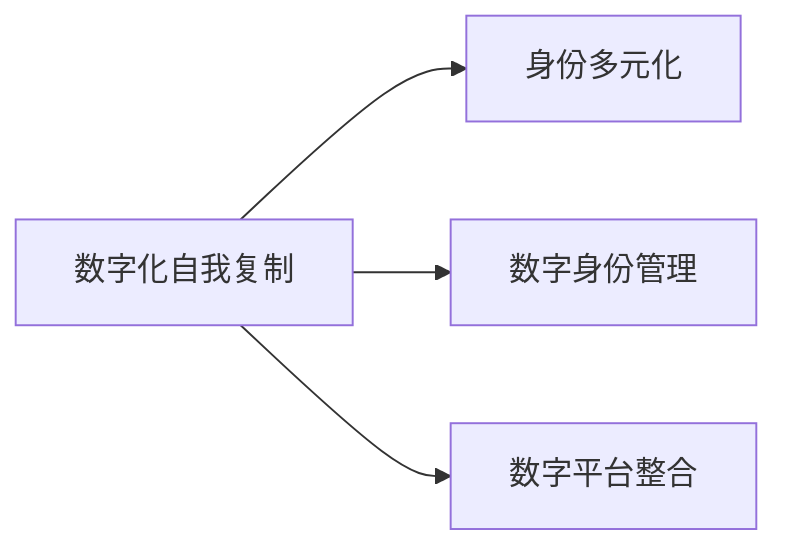

                 

## 1. 背景介绍

随着人工智能技术的迅猛发展，我们的数字身份和现实身份正变得越来越模糊。数字化自我复制，即将人的知识和特征以数字形式存在并得以复制的技术，在AI时代变得越来越普遍。我们通过社交媒体、搜索引擎、电商网站等数字平台，生成数字化的自我形象。这不仅改变了我们的社交互动方式，还影响到了我们的自我认同。

### 1.1 问题的由来

数字化自我复制的概念最早可以追溯到维特根斯坦的“语言游戏”理论，他提出“使用语言游戏的过程，就是一个人和他人共同构建真实与虚拟世界边界的过程”。在AI时代，这种界限变得模糊不清，虚拟自我和现实自我逐渐融合。数字化自我复制通过大数据、人工智能等技术，将个人的言行、兴趣、关系、社交网络等信息数字化，并在不同的数字平台上生成多个自我形象。

## 2. 核心概念与联系

### 2.1 核心概念概述

本文将详细介绍以下几个核心概念：

- **数字化自我复制(Digital Self-Replication)**：利用技术手段生成、传播、维护一个人的数字身份的过程，包括社交媒体、搜索引擎、电商平台等平台。

- **身份多元化(Identities Multiplicity)**：在数字世界中，同一个人可以生成多个不同的数字身份，这些身份彼此间可以独立、融合或竞争。

- **数字身份管理(Digital Identity Management)**：管理数字身份，确保其安全和隐私的技术和方法。

- **数字平台整合(Integrated Digital Platforms)**：通过API接口等方式，将不同平台上的数字化自我复制整合起来，构建统一的数字形象。

这些概念之间的关系可以用以下Mermaid流程图来表示：



## 3. 核心算法原理 & 具体操作步骤

### 3.1 算法原理概述

数字化自我复制的实现涉及多个技术环节，主要包括数据收集、特征提取、模型训练和平台整合。以一个简单的例子来阐明：假设某人要在多个社交平台（如Facebook、Twitter、Instagram等）上创建账号，并确保各个账号上的数字自我形象一致，那么需要进行以下步骤：

1. **数据收集**：收集该用户在多个平台上的发言、点赞、评论等数据。
2. **特征提取**：通过自然语言处理(NLP)等技术，提取用户的关键词、兴趣、情绪等信息。
3. **模型训练**：使用机器学习模型，训练出预测用户行为和偏好的算法。
4. **平台整合**：通过API接口，在不同平台间传递用户信息，确保一致性。

### 3.2 算法步骤详解

#### 3.2.1 数据收集

数据收集是数字化自我复制的基础，涉及多个平台的API接口。例如，Facebook提供的Graph API，Twitter的Twitter API，Instagram的API等，可以通过API请求获取用户的基本信息和发言数据。

#### 3.2.2 特征提取

特征提取涉及自然语言处理(NLP)、情感分析、用户画像等技术。以情感分析为例，可以将用户在平台上发言的情绪分为正面、负面和中性，用于后续行为预测。

#### 3.2.3 模型训练

模型训练可以通过监督学习、无监督学习、强化学习等多种算法实现。例如，使用逻辑回归、支持向量机(SVM)、决策树等算法，训练出预测用户行为和偏好的模型。

#### 3.2.4 平台整合

平台整合是数字身份管理的重要步骤，需要确保不同平台上的数据一致。可以通过跨平台API接口，将用户信息在各个平台间传递，避免数据重复或不一致。

### 3.3 算法优缺点

#### 3.3.1 优点

- **高效性**：通过自动化处理，快速生成多个数字身份。
- **一致性**：确保各个平台上的数字身份一致，避免信息冲突。
- **便捷性**：用户只需在一个平台上进行维护，其他平台自动同步更新。

#### 3.3.2 缺点

- **隐私风险**：数据收集和存储过程中可能涉及用户隐私泄露。
- **技术依赖**：需要依赖各个平台的API接口，技术实现复杂。
- **安全问题**：不同平台间数据传递可能面临安全威胁。

### 3.4 算法应用领域

数字化自我复制和身份多元化的技术，已经在多个领域得到应用，包括：

- **社交网络**：如Facebook、Twitter、Instagram等社交平台上的账号整合。
- **搜索引擎**：如Google、百度等搜索引擎中用户行为分析。
- **电商网站**：如Amazon、淘宝等电商平台上用户画像生成。
- **在线教育**：如Coursera、Udemy等平台上用户学习行为分析。

## 4. 数学模型和公式 & 详细讲解 & 举例说明

### 4.1 数学模型构建

在数字化自我复制的过程中，我们需要构建一个数学模型来预测用户在不同平台上的行为。以二元分类模型为例，假设用户A在不同平台上的行为数据为$\{x_1, x_2, \ldots, x_n\}$，每个行为被标记为正例（$y=1$）或负例（$y=0$）。我们需要训练一个二元分类模型，预测用户在新平台上的行为。

### 4.2 公式推导过程

假设我们使用逻辑回归模型来预测用户行为，模型的输出为：

$$
\hat{y} = \sigma(\sum_{i=1}^n w_i x_i + b)
$$

其中$\sigma$为sigmoid函数，$w$和$b$为模型参数。模型损失函数为交叉熵损失：

$$
L(y, \hat{y}) = -y\log(\hat{y}) - (1-y)\log(1-\hat{y})
$$

使用随机梯度下降(SGD)算法进行优化：

$$
w_i \leftarrow w_i - \eta \frac{\partial L}{\partial w_i}, \quad \forall i
$$

### 4.3 案例分析与讲解

以用户A在Facebook和Twitter上的行为预测为例，使用逻辑回归模型进行训练。首先收集用户A在Facebook上的发言数据，标记为正例或负例。然后使用这些数据训练模型，得到一个预测用户行为的概率模型。最后，将该模型应用于Twitter上的发言数据，预测用户行为。

## 5. 项目实践：代码实例和详细解释说明

### 5.1 开发环境搭建

在进行数字化自我复制的实践前，需要准备Python开发环境。以下是搭建环境的步骤：

1. 安装Python：从官网下载并安装Python，推荐使用3.7或更高版本。
2. 安装pip：确保pip版本不低于19.3.1。
3. 安装相关库：使用pip安装自然语言处理库NLTK、scikit-learn、TensorFlow等。

### 5.2 源代码详细实现

以下是一个使用Python和TensorFlow实现的二元分类模型的代码示例：

```python
import tensorflow as tf
from sklearn.model_selection import train_test_split
from sklearn.feature_extraction.text import CountVectorizer

# 构建特征提取器
vectorizer = CountVectorizer()

# 加载数据
data = load_data()

# 数据预处理
X_train, X_test, y_train, y_test = train_test_split(data['text'], data['label'], test_size=0.2, random_state=42)

# 特征提取
X_train = vectorizer.fit_transform(X_train)
X_test = vectorizer.transform(X_test)

# 定义模型
model = tf.keras.Sequential([
    tf.keras.layers.Embedding(input_dim=vocab_size, output_dim=embedding_dim),
    tf.keras.layers.Bidirectional(tf.keras.layers.LSTM(64)),
    tf.keras.layers.Dense(1, activation='sigmoid')
])

# 编译模型
model.compile(optimizer='adam', loss='binary_crossentropy', metrics=['accuracy'])

# 训练模型
model.fit(X_train, y_train, epochs=10, batch_size=32, validation_data=(X_test, y_test))

# 使用模型预测
y_pred = model.predict(X_test)
```

### 5.3 代码解读与分析

代码中首先使用scikit-learn库进行数据划分和特征提取。然后定义了包含嵌入层、双向LSTM和全连接层的TensorFlow模型，并编译和训练该模型。最后使用训练好的模型对新数据进行预测。

## 6. 实际应用场景

### 6.1 社交网络

社交网络是数字化自我复制的重要应用场景。通过在Facebook、Twitter、Instagram等平台上创建账号，并使用API接口整合信息，可以创建统一的数字自我形象。例如，一个用户在Facebook上发布了一条正向评论，系统可以自动将该评论转发到Twitter和Instagram上。

### 6.2 搜索引擎

搜索引擎利用用户的搜索历史、点击行为等数据，生成用户的数字画像。例如，用户多次搜索“做饭”相关内容，系统可以预测用户对美食类内容的兴趣。

### 6.3 电商网站

电商网站通过用户的购物历史、评价等信息，生成用户画像。例如，用户经常购买时尚产品，系统可以预测其购买下一件商品的类别。

### 6.4 在线教育

在线教育平台通过用户的学习历史、测试成绩等信息，生成用户画像。例如，用户多次参加同一课程，系统可以预测其下一门课程的选择。

## 7. 工具和资源推荐

### 7.1 学习资源推荐

- **《深度学习》**：由Ian Goodfellow等人合著的书籍，全面介绍了深度学习的基础知识。
- **《自然语言处理综论》**：Daniel Jurafsky和James H. Martin合著的书籍，深入讲解自然语言处理的技术。
- **《Python机器学习》**：Sebastian Raschka合著的书籍，详细介绍了使用Python进行机器学习的方法。
- **Coursera和edX**：在线学习平台，提供大量深度学习和自然语言处理的课程。

### 7.2 开发工具推荐

- **Jupyter Notebook**：免费的Python开发环境，支持代码编写、执行和展示。
- **PyCharm**：专业的Python IDE，支持代码编辑、调试和测试。
- **TensorFlow和PyTorch**：流行的深度学习框架，支持构建和训练深度学习模型。

### 7.3 相关论文推荐

- **《基于图模型的人际关系预测》**：Wang等人，使用图模型预测用户之间的关系。
- **《社交网络中的行为预测》**：Leskovec等人，分析社交网络中的用户行为。
- **《深度学习在电商推荐系统中的应用》**：He等人，使用深度学习技术提升电商推荐效果。

## 8. 总结：未来发展趋势与挑战

### 8.1 研究成果总结

数字化自我复制和身份多元化的技术，已经在多个领域得到广泛应用。通过数据收集、特征提取、模型训练和平台整合，成功实现了多个平台上的数字化自我复制。

### 8.2 未来发展趋势

- **个性化推荐**：通过用户画像，提供个性化的推荐服务，提升用户体验。
- **多模态融合**：结合图像、视频、语音等多模态数据，提升数字自我复制的效果。
- **跨平台整合**：通过API接口，整合不同平台上的数字自我复制，构建统一的数字形象。
- **隐私保护**：开发隐私保护技术，确保用户数据的隐私和安全。

### 8.3 面临的挑战

- **隐私保护**：数据收集和存储过程中可能涉及用户隐私泄露。
- **技术复杂性**：需要依赖多个平台的API接口，技术实现复杂。
- **数据一致性**：不同平台间数据传递可能面临数据冲突和一致性问题。
- **安全问题**：不同平台间数据传递可能面临安全威胁。

### 8.4 研究展望

未来，数字化自我复制和身份多元化的技术将朝着更智能化、普适化的方向发展。如何利用多模态数据提升数字自我复制的效果，如何保护用户隐私，如何在跨平台整合过程中确保数据一致性，将是重要的研究方向。

## 9. 附录：常见问题与解答

**Q1: 什么是数字化自我复制？**

A: 数字化自我复制是通过技术手段生成、传播、维护一个人的数字身份的过程，涉及多个数字平台。

**Q2: 数字化自我复制在哪些领域有应用？**

A: 社交网络、搜索引擎、电商网站、在线教育等领域。

**Q3: 如何保护用户隐私？**

A: 使用加密技术、隐私保护算法等，确保用户数据的安全。

**Q4: 什么是身份多元化？**

A: 在数字世界中，同一个人可以生成多个不同的数字身份，这些身份可以独立、融合或竞争。

**Q5: 数字身份管理涉及哪些技术？**

A: 数据收集、特征提取、模型训练、平台整合等技术。

---

作者：禅与计算机程序设计艺术 / Zen and the Art of Computer Programming

