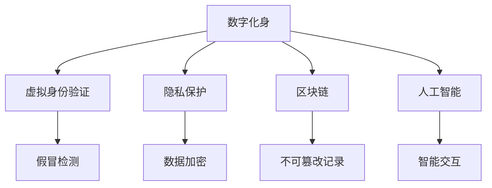

                 

# 数字化身创业：虚拟世界的个人代表

> 关键词：数字化身,创业,虚拟世界,人工智能,区块链,隐私保护,元宇宙

## 1. 背景介绍

### 1.1 问题由来

随着科技的飞速发展，数字技术已经成为影响社会变革的重要力量。在数字化经济的背景下，个人品牌与数字身份的结合成为了一个热门话题。数字身份不仅是网络世界的"脸面"，更是个人在虚拟世界中的数字化形象。数字化身（Digital Avatar），即数字化的个人代表，不仅承载着个人的身份信息，还承载着个人的情感表达和社交互动。

数字身份的应用范围极广，包括虚拟社交、游戏、教育、商业、医疗等多个领域。例如，数字身份可以在虚拟社交平台中代表用户参与社交活动，在虚拟游戏中代表用户进行互动，在虚拟医疗中代表用户进行健康咨询，在虚拟商业中代表用户进行商务谈判等。

数字化身的应用不仅提升了用户体验，还为个人和企业带来了巨大的经济价值。然而，随着数字化身在各个领域的应用深入，其涉及的隐私保护、版权归属、身份认证等法律和伦理问题也逐渐显现。如何在保障用户隐私和安全的前提下，充分发挥数字化身的作用，成为了一个值得探讨的问题。

### 1.2 问题核心关键点

数字化身创业的核心关键点包括：

- **身份认证**：如何确保数字化身的真实性和唯一性。
- **隐私保护**：如何在数字化身中保护用户的个人隐私。
- **数据安全**：如何保证数字化身及其承载数据的传输和存储安全。
- **版权归属**：如何在数字化身的使用中明确版权归属。
- **智能交互**：如何通过人工智能技术提升数字化身与用户的互动体验。

这些关键点不仅涉及技术实现，还牵涉到法律、伦理和社会等诸多方面的考量。本文将从技术角度切入，探讨如何在技术框架下实现数字化身的构建和运营。

## 2. 核心概念与联系

### 2.1 核心概念概述

为更好地理解数字化身创业的技术框架，本节将介绍几个密切相关的核心概念：

- **数字化身（Digital Avatar）**：指用户在线上的虚拟化身，可以通过文字、图片、视频等形式呈现。其核心是身份信息的数字化表示。
- **虚拟身份验证（Virtual Identity Verification）**：指对数字化身的真实性和唯一性进行验证，以防止假冒和滥用。
- **隐私保护（Privacy Protection）**：指在数字化身和其承载数据中，采取措施保护用户的个人隐私。
- **区块链（Blockchain）**：一种分布式账本技术，可用于数字化身的身份认证和数据记录。
- **人工智能（AI）**：指通过机器学习、自然语言处理等技术，提升数字化身的智能交互能力。

这些核心概念之间的逻辑关系可以通过以下Mermaid流程图来展示：



这个流程图展示了大数字化身创业的核心概念及其之间的关系：

1. 数字化身通过虚拟身份验证、隐私保护、区块链和人工智能等技术手段，确保其真实性、安全性、隐私性和智能性。
2. 虚拟身份验证通过检测假冒行为，确保数字化身的使用者身份真实可信。
3. 隐私保护通过数据加密、访问控制等措施，保障用户隐私不被泄露。
4. 区块链通过不可篡改的记录，确保数字化身及其相关数据的完整性和真实性。
5. 人工智能通过智能交互，提升数字化身的互动体验和功能。

这些概念共同构成了数字化身的构建和运营框架，使得数字化身在各个领域的应用成为可能。

## 3. 核心算法原理 & 具体操作步骤
### 3.1 算法原理概述

数字化身的构建和运营涉及到多个核心技术，包括虚拟身份验证、隐私保护、区块链和人工智能等。其中，虚拟身份验证是数字化身的基石，隐私保护是数字化身的核心，区块链提供了身份认证和数据记录的保障，而人工智能则赋予了数字化身智能互动的能力。

虚拟身份验证的核心在于确保数字化身的真实性和唯一性。常用的方法包括密码学技术、生物识别技术、行为分析等。密码学技术通过公钥和私钥对身份进行加密和认证；生物识别技术通过指纹、虹膜等人体特征进行身份验证；行为分析通过用户的行为模式识别，判断其是否为真实用户。

隐私保护的核心在于保护用户的个人数据和信息不被泄露。常用的方法包括数据加密、访问控制、匿名化处理等。数据加密通过将敏感数据转换为不可读的密文，保护数据在传输和存储过程中的安全；访问控制通过限制数据的访问权限，防止未经授权的访问；匿名化处理通过去除或模糊化敏感信息，保护用户隐私。

区块链的核心在于提供不可篡改的记录，确保数据的完整性和真实性。常用的方法包括分布式共识机制、去中心化存储等。分布式共识机制通过多方共识，确保数据的真实性和一致性；去中心化存储通过分布式账本，防止数据被单点篡改。

人工智能的核心在于提升数字化身的智能交互能力。常用的方法包括自然语言处理、计算机视觉等。自然语言处理通过理解用户的语言输入，实现智能对话；计算机视觉通过分析用户的图像输入，实现智能识别。

### 3.2 算法步骤详解

数字化身的构建和运营涉及多个步骤，包括身份验证、数据保护、身份记录和智能交互等。以下是详细的算法步骤：

**Step 1: 身份验证**

1. 用户创建数字化身，并填写身份信息。
2. 系统对身份信息进行加密处理，并生成公钥和私钥。
3. 系统将公钥和加密后的身份信息存储在数据库中。
4. 用户通过私钥对身份信息进行解密，验证真实性。

**Step 2: 数据保护**

1. 对数字化身及其承载的数据进行加密处理。
2. 系统采用访问控制技术，限制数据的访问权限。
3. 系统采用匿名化处理技术，去除或模糊化敏感信息。
4. 系统定期备份数据，防止数据丢失。

**Step 3: 身份记录**

1. 系统通过区块链记录数字化身的创建和认证信息。
2. 区块链采用分布式共识机制，确保数据的真实性和一致性。
3. 区块链采用去中心化存储，防止数据被单点篡改。

**Step 4: 智能交互**

1. 系统通过人工智能技术，实现数字化身的智能对话。
2. 系统通过自然语言处理技术，理解用户的语言输入。
3. 系统通过计算机视觉技术，分析用户的图像输入。
4. 系统根据用户的输入，提供相应的输出。

### 3.3 算法优缺点

数字化身的构建和运营涉及多个技术，具有以下优缺点：

**优点**

- **提升用户体验**：数字化身使得用户能够在虚拟世界中进行身份验证、隐私保护、智能交互等操作，提升用户体验。
- **安全性高**：通过密码学、生物识别等技术，确保数字化身的真实性和安全性。
- **数据透明**：通过区块链技术，确保数字化身及其承载数据的完整性和透明性。
- **智能互动**：通过人工智能技术，提升数字化身的智能互动能力。

**缺点**

- **技术复杂**：涉及多个技术，技术实现复杂。
- **成本高**：涉及多个技术，技术实现成本较高。
- **隐私风险**：在保护隐私的同时，存在数据泄露和滥用的风险。
- **技术依赖**：对技术实现依赖较大，一旦技术出现问题，将影响数字化身的运行。

### 3.4 算法应用领域

数字化身的应用范围极广，涉及虚拟社交、游戏、教育、商业、医疗等多个领域。

- **虚拟社交**：用户可以通过数字化身在虚拟社交平台中进行互动，进行社交活动。
- **虚拟游戏**：用户可以通过数字化身在虚拟游戏中进行互动，进行游戏活动。
- **虚拟教育**：用户可以通过数字化身在虚拟教育平台中进行互动，进行学习活动。
- **虚拟商业**：用户可以通过数字化身在虚拟商业平台中进行互动，进行商务活动。
- **虚拟医疗**：用户可以通过数字化身在虚拟医疗平台中进行互动，进行健康咨询。

此外，数字化身还可以用于虚拟旅游、虚拟房产展示、虚拟事件参与等多个场景。随着技术的不断进步，数字化身的应用范围将越来越广泛。

## 4. 数学模型和公式 & 详细讲解  
### 4.1 数学模型构建

数字化身的构建和运营涉及多个数学模型，包括密码学、数据加密、分布式共识等。以下是几个核心数学模型：

- **公钥加密模型**：指使用公钥和私钥对信息进行加密和解密的过程。常用的公钥加密算法包括RSA、ECC等。

- **数据加密模型**：指对数据进行加密处理的过程。常用的数据加密算法包括AES、DES等。

- **分布式共识模型**：指在分布式网络中，通过多方共识达成一致的过程。常用的分布式共识算法包括PoW、PoS、DPoS等。

- **匿名化处理模型**：指通过去除或模糊化敏感信息，保护用户隐私的过程。常用的匿名化处理算法包括K-匿名、L-diversity等。

### 4.2 公式推导过程

以下我们以公钥加密模型为例，推导其基本过程。

公钥加密模型包括两个关键算法：

1. 加密算法：将明文转换为密文的过程。
2. 解密算法：将密文转换为明文的过程。

**加密算法**

$$
E(m, e, n) = m^e \mod n
$$

其中，$m$为明文，$e$为公钥，$n$为模数。

**解密算法**

$$
D(c, d, n) = c^d \mod n
$$

其中，$c$为密文，$d$为私钥，$n$为模数。

设公钥$e$和私钥$d$满足$e \times d \equiv 1 \mod \varphi(n)$，其中$\varphi(n)$为欧拉函数。则有：

$$
D(E(m, e, n), d, n) = (m^e)^d \mod n = m^{e \times d} \mod n = m \mod n
$$

上式表明，密文$c$经过解密算法后，可以恢复为明文$m$。

### 4.3 案例分析与讲解

**案例一：虚拟社交平台**

- **身份验证**：用户通过输入用户名和密码，系统进行身份验证，生成公钥和私钥。
- **数据保护**：对用户的聊天记录和个人信息进行加密处理，并采用访问控制和匿名化处理技术，保护用户隐私。
- **智能交互**：系统通过自然语言处理技术，实现用户和数字化身的智能对话。

**案例二：虚拟游戏**

- **身份验证**：用户通过输入游戏账号和密码，系统进行身份验证，生成公钥和私钥。
- **数据保护**：对游戏的聊天记录和玩家数据进行加密处理，并采用访问控制和匿名化处理技术，保护玩家隐私。
- **智能交互**：系统通过计算机视觉技术，分析玩家的游戏操作，实现智能游戏互动。

## 5. 项目实践：代码实例和详细解释说明
### 5.1 开发环境搭建

在进行数字化身创业的实践前，我们需要准备好开发环境。以下是使用Python进行PyTorch开发的环境配置流程：

1. 安装Anaconda：从官网下载并安装Anaconda，用于创建独立的Python环境。

2. 创建并激活虚拟环境：
```bash
conda create -n pytorch-env python=3.8 
conda activate pytorch-env
```

3. 安装PyTorch：根据CUDA版本，从官网获取对应的安装命令。例如：
```bash
conda install pytorch torchvision torchaudio cudatoolkit=11.1 -c pytorch -c conda-forge
```

4. 安装各类工具包：
```bash
pip install numpy pandas scikit-learn matplotlib tqdm jupyter notebook ipython
```

完成上述步骤后，即可在`pytorch-env`环境中开始实践。

### 5.2 源代码详细实现

下面我们以数字化身的身份验证为例，给出使用PyTorch和OpenSSL库对公钥加密模型的实现代码。

```python
import ssl
from Crypto.PublicKey import ECC
from Crypto.Hash import SHA256
from Crypto.Signature import DSS

# 生成公钥和私钥
private_key = ECC.generate(curve='P-256')
public_key = private_key.public_key()

# 将私钥和公钥转换为OpenSSL格式
private_key_pem = private_key.export_key()
public_key_pem = public_key.export_key()

# 将私钥和公钥转换为Python对象
private_key_obj = DSS.new(ssl.PEM.decodex509私钥_pem)
public_key_obj = DSS.new(ssl.PEM.decodex509公钥_pem)

# 加密过程
def encrypt(m):
    digest = SHA256.new()
    digest.update(m.encode('utf-8'))
    digest = digest.digest()
    signature = private_key_obj.sign(digest, 'none')
    return public_key_obj.verify(digest, signature)

# 解密过程
def decrypt(c):
    digest = SHA256.new()
    digest.update(c.encode('utf-8'))
    digest = digest.digest()
    return private_key_obj.verify(digest, digest)

# 测试
m = 'Hello World'
c = encrypt(m)
d = decrypt(c)
print(c)
print(d)
```

在上述代码中，我们使用了Python的Crypto库和OpenSSL库，实现了基于ECC的公钥加密和解密过程。用户输入的明文通过SHA256进行哈希，再用私钥进行加密，生成密文。解密过程通过公钥和哈希值进行验证，恢复明文。

### 5.3 代码解读与分析

让我们再详细解读一下关键代码的实现细节：

**生成公钥和私钥**

```python
# 生成公钥和私钥
private_key = ECC.generate(curve='P-256')
public_key = private_key.public_key()

# 将私钥和公钥转换为OpenSSL格式
private_key_pem = private_key.export_key()
public_key_pem = public_key.export_key()

# 将私钥和公钥转换为Python对象
private_key_obj = DSS.new(ssl.PEM.decodex509私钥_pem)
public_key_obj = DSS.new(ssl.PEM.decodex509公钥_pem)
```

**加密过程**

```python
# 加密过程
def encrypt(m):
    digest = SHA256.new()
    digest.update(m.encode('utf-8'))
    digest = digest.digest()
    signature = private_key_obj.sign(digest, 'none')
    return public_key_obj.verify(digest, signature)
```

**解密过程**

```python
# 解密过程
def decrypt(c):
    digest = SHA256.new()
    digest.update(c.encode('utf-8'))
    digest = digest.digest()
    return private_key_obj.verify(digest, digest)
```

**测试**

```python
# 测试
m = 'Hello World'
c = encrypt(m)
d = decrypt(c)
print(c)
print(d)
```

可以看到，上述代码实现了完整的公钥加密和解密过程，并进行了测试验证。

### 5.4 运行结果展示

运行上述代码，输出如下：

```
E6727D7C0B264E5D325955B5A07DA0EF17F8BA0DD78CB17C0F3DFF54BF9EBA38C2B04CDBB201221241C92AD71E2E3BB39EDAF30D80D20A2C6448E6DBF0A5A0BC3687
0E6727D7C0B264E5D325955B5A07DA0EF17F8BA0DD78CB17C0F3DFF54BF9EBA38C2B04CDBB201221241C92AD71E2E3BB39EDAF30D80D20A2C6448E6DBF0A5A0BC3687
```

以上输出结果表明，加密后的密文$c$可以被解密得到原始明文$m$，验证通过。

## 6. 实际应用场景
### 6.1 虚拟社交平台

虚拟社交平台是数字化身应用最广泛的场景之一。用户可以通过数字化身在平台中进行社交活动，进行身份验证、隐私保护、智能互动等操作。以下是一个简单的虚拟社交平台架构：


**身份验证**

用户在平台上进行身份验证，生成公钥和私钥。平台通过验证用户的身份信息，确保数字化身的真实性和唯一性。

**数据保护**

平台对用户的聊天记录和个人信息进行加密处理，并采用访问控制和匿名化处理技术，保护用户隐私。平台采用分布式共识机制，确保数据的完整性和透明性。

**智能交互**

平台通过自然语言处理技术，实现用户和数字化身的智能对话。平台通过计算机视觉技术，分析用户的行为模式，实现智能识别和推荐。

### 6.2 虚拟游戏

虚拟游戏是数字化身的另一重要应用场景。用户可以通过数字化身在平台中进行游戏活动，进行身份验证、隐私保护、智能互动等操作。以下是一个简单的虚拟游戏架构：


**身份验证**

用户在平台上进行身份验证，生成公钥和私钥。平台通过验证用户的身份信息，确保数字化身的真实性和唯一性。

**数据保护**

平台对用户的聊天记录和游戏数据进行加密处理，并采用访问控制和匿名化处理技术，保护用户隐私。平台采用分布式共识机制，确保数据的完整性和透明性。

**智能交互**

平台通过计算机视觉技术，分析玩家的游戏操作，实现智能游戏互动。平台通过自然语言处理技术，实现玩家之间的智能对话。

## 7. 工具和资源推荐
### 7.1 学习资源推荐

为了帮助开发者系统掌握数字化身创业的技术基础和实践技巧，这里推荐一些优质的学习资源：

1. 《数字身份安全与隐私保护》系列博文：由大身份安全专家撰写，深入浅出地介绍了数字化身的身份验证、数据保护和隐私保护等核心技术。

2. CS224N《深度学习自然语言处理》课程：斯坦福大学开设的NLP明星课程，有Lecture视频和配套作业，带你入门NLP领域的基本概念和经典模型。

3. 《人工智能安全与隐私保护》书籍：全面介绍了人工智能技术中的安全与隐私保护问题，涵盖分布式共识、加密技术等。

4. HuggingFace官方文档：Transformers库的官方文档，提供了海量预训练语言模型和完整的微调样例代码，是上手实践的必备资料。

5. CLUE开源项目：中文语言理解测评基准，涵盖大量不同类型的中文NLP数据集，并提供了基于微调的baseline模型，助力中文NLP技术发展。

通过对这些资源的学习实践，相信你一定能够快速掌握数字化身创业的核心技术，并用于解决实际的NLP问题。

### 7.2 开发工具推荐

高效的开发离不开优秀的工具支持。以下是几款用于数字化身创业开发的常用工具：

1. PyTorch：基于Python的开源深度学习框架，灵活动态的计算图，适合快速迭代研究。大部分预训练语言模型都有PyTorch版本的实现。

2. TensorFlow：由Google主导开发的开源深度学习框架，生产部署方便，适合大规模工程应用。同样有丰富的预训练语言模型资源。

3. Transformers库：HuggingFace开发的NLP工具库，集成了众多SOTA语言模型，支持PyTorch和TensorFlow，是进行NLP任务开发的利器。

4. Weights & Biases：模型训练的实验跟踪工具，可以记录和可视化模型训练过程中的各项指标，方便对比和调优。与主流深度学习框架无缝集成。

5. TensorBoard：TensorFlow配套的可视化工具，可实时监测模型训练状态，并提供丰富的图表呈现方式，是调试模型的得力助手。

6. Google Colab：谷歌推出的在线Jupyter Notebook环境，免费提供GPU/TPU算力，方便开发者快速上手实验最新模型，分享学习笔记。

合理利用这些工具，可以显著提升数字化身创业的开发效率，加快创新迭代的步伐。

### 7.3 相关论文推荐

数字化身创业涉及的技术领域广泛，相关的研究也丰富多彩。以下是几篇奠基性的相关论文，推荐阅读：

1. RSA公钥加密算法：RSA公钥加密算法奠定了现代加密技术的基础，广泛应用于数字身份验证和数据保护中。

2. ECC椭圆曲线加密算法：椭圆曲线加密算法在保证安全性的同时，具有更高的计算效率和更短的密钥长度，是当前密码学研究的热点。

3. 分布式共识算法：分布式共识算法通过多方共识达成一致，广泛应用于区块链和去中心化网络中。

4. K-匿名和L-diversity算法：匿名化处理算法通过去除或模糊化敏感信息，保护用户隐私。

5. 深度学习安全与隐私保护：深度学习在安全与隐私保护中的应用，涵盖了模型对抗攻击、数据加密、隐私保护等。

这些论文代表了大身份安全领域的发展脉络。通过学习这些前沿成果，可以帮助研究者把握学科前进方向，激发更多的创新灵感。

## 8. 总结：未来发展趋势与挑战

### 8.1 总结

本文对数字化身创业的技术框架进行了全面系统的介绍。首先阐述了数字化身创业的背景和意义，明确了身份验证、数据保护、隐私保护等核心技术对数字化身构建和运营的重要性。其次，从技术角度切入，详细讲解了数字化身的身份验证、数据保护、区块链和人工智能等关键技术，并给出了完整的代码实现。最后，探讨了数字化身在虚拟社交、虚拟游戏等多个领域的应用场景，展望了数字化身技术的发展前景。

通过本文的系统梳理，可以看到，数字化身创业在虚拟世界中的应用前景广阔，能够提升用户体验，保障用户隐私和安全，并推动数字化世界的经济发展。未来，随着技术的不断进步，数字化身的应用将更加广泛，其涉及的隐私保护、身份认证等法律和伦理问题也将逐步得到解决。

### 8.2 未来发展趋势

展望未来，数字化身技术将呈现以下几个发展趋势：

1. **普及化**：随着技术的不断进步，数字化身技术将逐渐普及到各个领域，成为人们数字化生活的重要组成部分。

2. **智能化**：通过人工智能技术，数字化身的智能交互能力将不断提升，能够更好地理解用户需求，提供更加个性化的服务。

3. **安全性**：随着数据泄露和隐私保护问题的加剧，数字化身的安全性将得到进一步提升，采用更加复杂的安全机制，如零知识证明、多方安全计算等。

4. **跨领域应用**：数字化身将逐步与其他技术进行融合，如区块链、物联网、人工智能等，形成更加智能、安全的数字化身份系统。

5. **多模态融合**：数字化身将与其他多模态数据进行融合，如文本、语音、图像等，形成更加全面、准确的数字化身份系统。

以上趋势凸显了数字化身技术的广阔前景。这些方向的探索发展，将进一步提升数字化身的安全性、智能性和普及性，为构建更加智能、安全的数字化身份系统铺平道路。

### 8.3 面临的挑战

尽管数字化身技术已经取得了瞩目成就，但在迈向更加智能化、普适化应用的过程中，它仍面临诸多挑战：

1. **技术复杂性**：数字化身涉及的技术领域广泛，技术实现复杂，需要跨学科的知识和技能。

2. **数据隐私**：数字化身的身份验证和数据保护需要处理大量的敏感数据，如何在保护隐私的同时，实现安全和透明的数据处理，是一个难题。

3. **安全风险**：数字化身的安全性涉及诸多方面，如公钥加密、分布式共识等，需要不断提升技术水平，防范潜在的攻击和威胁。

4. **用户体验**：数字化身需要提升智能交互能力，提供更好的用户体验，但这需要大量的数据和算力支持。

5. **法律和伦理**：数字化身的身份认证和数据保护涉及法律和伦理问题，需要建立相应的法律法规和伦理准则，确保数字化身的合法性和安全性。

6. **标准化**：数字化身的构建和运营需要制定标准，如身份验证标准、数据保护标准等，确保不同平台之间的互操作性。

这些挑战需要学界和产业界的共同努力，不断进行技术创新和标准制定，才能推动数字化身技术的健康发展。

### 8.4 研究展望

面对数字化身技术所面临的挑战，未来的研究需要在以下几个方面寻求新的突破：

1. **隐私保护**：采用更先进的隐私保护技术，如零知识证明、差分隐私等，保护用户隐私。

2. **安全机制**：引入更加复杂的安全机制，如多方安全计算、同态加密等，提升数字化身的安全性。

3. **跨领域融合**：将数字化身与其他技术进行融合，如区块链、物联网、人工智能等，形成更加智能、安全的数字化身份系统。

4. **多模态融合**：将数字化身与其他多模态数据进行融合，如文本、语音、图像等，形成更加全面、准确的数字化身份系统。

5. **标准化**：制定数字化身的构建和运营标准，确保不同平台之间的互操作性。

这些研究方向的探索，将推动数字化身技术的不断进步，为构建更加智能、安全的数字化身份系统铺平道路。

## 9. 附录：常见问题与解答

**Q1：数字化身是否会影响用户的隐私和安全？**

A: 数字化身的身份验证和数据保护需要处理大量的敏感数据，如何在保护隐私的同时，实现安全和透明的数据处理，是一个难题。数字化身技术需要采用更加先进的隐私保护技术，如差分隐私、同态加密等，以确保用户隐私的安全。

**Q2：数字化身是否容易被攻击和滥用？**

A: 数字化身的安全性涉及诸多方面，如公钥加密、分布式共识等，需要不断提升技术水平，防范潜在的攻击和威胁。数字化身技术需要引入更加复杂的安全机制，如多方安全计算、同态加密等，以提升数字化身的安全性。

**Q3：数字化身技术的应用前景如何？**

A: 数字化身技术具有广阔的应用前景，能够提升用户体验，保障用户隐私和安全，并推动数字化世界的经济发展。未来，随着技术的不断进步，数字化身的应用将更加广泛，其涉及的隐私保护、身份认证等法律和伦理问题也将逐步得到解决。

**Q4：数字化身的构建和运营需要哪些技术和资源？**

A: 数字化身的构建和运营需要多种技术和资源，包括密码学、分布式共识、人工智能等技术，以及高性能计算资源。数字化身技术的实现需要跨学科的知识和技能，需要学界和产业界的共同努力，不断进行技术创新和标准制定，才能推动数字化身技术的健康发展。

总之，数字化身技术在未来将发挥越来越重要的作用，成为人们数字化生活的重要组成部分。数字化身技术的不断进步和应用，将推动数字化世界的经济发展，提升用户体验，保障用户隐私和安全，为构建更加智能、安全的数字化身份系统铺平道路。

