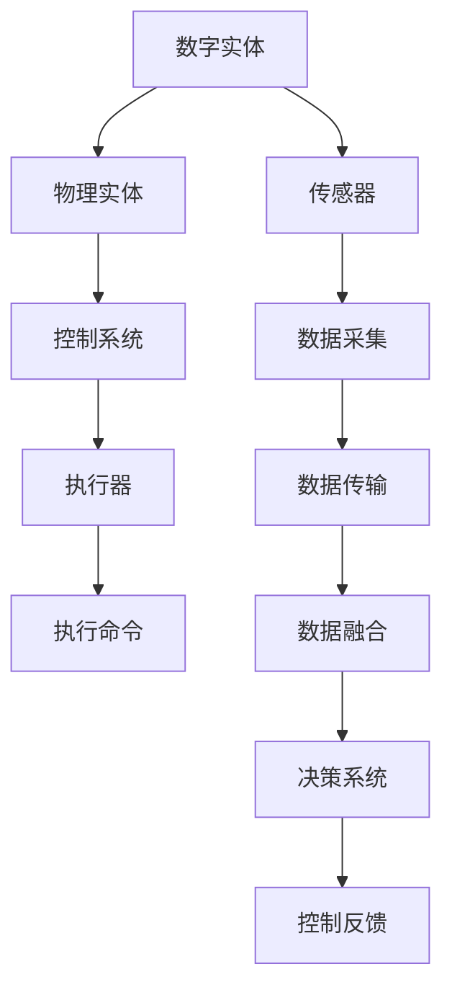

                 

## 1. 背景介绍

在数字化时代，信息与物理实体之间的融合变得愈发重要。数字实体，如传感器数据、电子文档、网络流量等，和物理实体，如工业设备、交通系统、城市基础设施等，越来越多地交织在一起。自动化融合，旨在通过智能技术，实现信息与物理系统的无缝对接，提升生产效率、优化资源配置、保障系统安全。本文将从算法和应用两个层面，探讨如何自动化地融合数字实体与物理实体，推动智能化转型。

### 1.1 融合的必要性

随着物联网、大数据、人工智能等技术的发展，数字实体与物理实体之间的界限逐渐模糊。从智能家居到智慧城市，从智能制造到智能物流，各行各业都在探索如何通过智能技术，优化资源配置，提升系统效率，构建更加智能的生态系统。然而，数字化转型过程中，也面临着诸多挑战，如数据孤岛、设备异构、实时性要求高等。通过自动化融合，可以更有效地集成信息与物理系统，最大化其价值。

### 1.2 融合的可行性

现代计算技术、传感器技术、通信技术的进步，使得自动化融合成为可能。首先，大规模数据处理和分析技术，可以高效处理来自各个物理设备的海量数据。其次，物联网技术使得物理设备能够接入互联网，实现数据的实时传输和共享。最后，人工智能和机器学习技术，可以从大量数据中提取出有价值的洞察，辅助决策和控制。这些技术的结合，为数字实体与物理实体的自动化融合提供了坚实的基础。

## 2. 核心概念与联系

### 2.1 核心概念概述

为更好地理解数字实体与物理实体的自动化融合，我们首先需要明确几个关键概念：

- **数字实体**：指各种形式的数字化信息，包括传感器数据、文本、图片、视频等。数字实体能够被存储、传输、处理，为决策和控制提供依据。
- **物理实体**：指各种物理系统，包括工业设备、交通网络、城市基础设施等。物理实体需要通过传感器等技术手段采集数据，并通过控制系统进行管理和控制。
- **融合**：指将数字实体与物理实体结合起来，形成一个完整的、互动的生态系统。通过融合，实现信息的自动化采集、处理、分析和反馈，优化系统性能。

这些概念之间的联系，可以通过以下Mermaid流程图来展示：



这个流程图展示了数字实体与物理实体融合的逻辑流程：

1. 数字实体通过传感器采集数据，物理实体执行相应的控制命令。
2. 数据采集后的信息经过处理和融合，进入决策系统进行分析和推理。
3. 决策系统根据分析结果，生成控制命令，通过控制系统执行器下达。
4. 执行器根据控制命令，对物理实体进行控制和调整，完成相应任务。
5. 执行结果反馈至决策系统，优化后续决策。

### 2.2 核心概念原理和架构

自动化融合的核心，是建立一个智能化的决策与控制系统，通过算法和技术的综合应用，实现信息与物理系统的无缝对接。以下详细讲解其原理和架构：

- **传感器数据采集**：使用各种传感器，如温度传感器、压力传感器、位置传感器等，实时采集物理实体的状态信息。数据采集后，经过预处理（如数据清洗、特征提取等），进入融合过程。
- **数据融合**：通过数据融合技术，将来自不同传感器和来源的数据进行整合，形成统一的全局视图。数据融合通常采用加权平均、卡尔曼滤波、信息融合等方法。
- **决策与推理**：基于融合后的数据，使用人工智能和机器学习技术进行分析和推理。常见的算法包括决策树、支持向量机、深度学习等。
- **控制命令生成与执行**：决策系统根据推理结果，生成控制命令，并下发给物理实体的控制系统。控制系统执行相应操作，完成具体任务。
- **结果反馈与优化**：物理实体执行结果反馈至决策系统，进行进一步的分析和优化，形成闭环控制。

## 3. 核心算法原理 & 具体操作步骤

### 3.1 算法原理概述

数字实体与物理实体的自动化融合，涉及到多个领域的算法和技术。以下详细介绍几个核心算法的原理和操作步骤：

- **数据融合算法**：数据融合旨在将来自不同传感器和来源的数据进行整合，形成统一的全局视图。常用的数据融合算法包括加权平均、卡尔曼滤波、信息融合等。
- **决策与推理算法**：决策与推理算法通过分析融合后的数据，生成控制命令。常用的决策与推理算法包括决策树、支持向量机、深度学习等。
- **控制命令生成与执行算法**：控制命令生成与执行算法将决策系统生成的控制命令下发给物理实体的控制系统，完成具体任务。
- **反馈与优化算法**：反馈与优化算法将物理实体执行结果反馈至决策系统，进行进一步的分析和优化，形成闭环控制。

### 3.2 算法步骤详解

以下是详细的操作步骤和算法实现流程：

1. **数据采集与预处理**：
   - 使用传感器采集物理实体的状态信息。
   - 对采集的数据进行预处理，包括数据清洗、特征提取等。

2. **数据融合**：
   - 使用加权平均、卡尔曼滤波等方法，将来自不同传感器和来源的数据进行整合，形成统一的全局视图。

3. **决策与推理**：
   - 基于融合后的数据，使用决策树、支持向量机、深度学习等算法进行分析和推理，生成控制命令。

4. **控制命令生成与执行**：
   - 将决策系统生成的控制命令下发给物理实体的控制系统，执行相应操作。

5. **结果反馈与优化**：
   - 物理实体执行结果反馈至决策系统，进行进一步的分析和优化，形成闭环控制。

### 3.3 算法优缺点

自动化融合的算法具有以下优点：

- **实时性高**：通过传感器数据实时采集和决策反馈，实现对物理实体的实时控制。
- **精度高**：融合算法能够整合来自不同来源的数据，提供更准确的全局视图。
- **适应性强**：算法能够处理多种类型的数据，适应不同的物理系统。

然而，自动化融合也存在一些缺点：

- **数据量巨大**：传感器数据通常来自海量设备，数据量巨大，需要高效的数据处理和存储能力。
- **算法复杂**：数据融合、决策与推理、控制命令生成等算法复杂，需要高水平的算法工程师。
- **系统成本高**：传感器、控制系统等硬件设备成本较高，系统部署和维护成本大。

### 3.4 算法应用领域

自动化融合的应用领域广泛，涵盖智能制造、智慧城市、智能交通等多个领域。以下是几个典型的应用场景：

- **智能制造**：通过自动化融合，实现生产设备的实时监控和优化，提升生产效率和产品质量。
- **智慧城市**：将城市基础设施、交通系统等物理实体与数字信息融合，提升城市管理和公共服务水平。
- **智能交通**：通过传感器采集交通数据，融合后进行实时分析和决策，优化交通流量，提升交通安全。
- **能源管理**：将能源设备与数字信息融合，实现能源消耗的实时监控和优化，降低能源浪费。
- **健康医疗**：通过传感器采集人体健康数据，融合后进行实时分析和决策，提供个性化的健康管理方案。

## 4. 数学模型和公式 & 详细讲解 & 举例说明

### 4.1 数学模型构建

自动化融合的数学模型主要涉及数据融合、决策与推理两个部分。以下详细介绍模型的构建过程。

- **数据融合模型**：数据融合通常使用卡尔曼滤波器（Kalman Filter），其数学模型为：

$$
\mathbf{X}_{k+1} = \mathbf{F}\mathbf{X}_k + \mathbf{W}_k
$$

$$
\mathbf{Z}_k = \mathbf{H}\mathbf{X}_k + \mathbf{V}_k
$$

其中，$\mathbf{X}_k$ 表示状态向量，$\mathbf{F}$ 表示状态转移矩阵，$\mathbf{W}_k$ 表示状态噪声，$\mathbf{Z}_k$ 表示观测向量，$\mathbf{H}$ 表示观测矩阵，$\mathbf{V}_k$ 表示观测噪声。

- **决策与推理模型**：决策与推理通常使用决策树，其数学模型为：

$$
\mathbf{D}(\mathbf{X}) = \mathbf{G}(\mathbf{X})
$$

其中，$\mathbf{D}(\mathbf{X})$ 表示决策结果，$\mathbf{G}(\mathbf{X})$ 表示决策函数，$\mathbf{X}$ 表示输入向量。

### 4.2 公式推导过程

以下详细推导卡尔曼滤波器的公式：

1. **状态更新方程**：

$$
\mathbf{X}_{k+1|k} = \mathbf{F}\mathbf{X}_k + \mathbf{W}_k
$$

2. **观测更新方程**：

$$
\mathbf{K}_k = \mathbf{P}_k\mathbf{H}^T(\mathbf{H}\mathbf{P}_k\mathbf{H}^T + \mathbf{V}_k)^{-1}
$$

$$
\mathbf{P}_{k+1} = (\mathbf{I} - \mathbf{K}_k\mathbf{H})\mathbf{P}_k
$$

其中，$\mathbf{K}_k$ 表示卡尔曼增益，$\mathbf{I}$ 表示单位矩阵，$\mathbf{P}_k$ 表示协方差矩阵，$\mathbf{H}$ 表示观测矩阵，$\mathbf{V}_k$ 表示观测噪声。

### 4.3 案例分析与讲解

以智能交通系统为例，展示自动化融合的应用。

**案例背景**：
假设某城市交通系统需要实时监控交通流量，进行交通控制和优化。交通系统中包含了大量传感器，用于采集车速、车流量、红绿灯状态等数据。

**数据采集与预处理**：
- 使用雷达传感器、摄像头等设备采集车速、车流量、红绿灯状态等数据。
- 对采集的数据进行预处理，包括数据清洗、特征提取等。

**数据融合**：
- 使用卡尔曼滤波器，将来自不同传感器和来源的数据进行整合，形成统一的全局视图。

**决策与推理**：
- 基于融合后的数据，使用决策树算法，生成控制命令。例如，当某路段车流量超过阈值时，生成红绿灯调整的命令。

**控制命令生成与执行**：
- 将决策系统生成的控制命令下发给红绿灯控制系统，调整红绿灯的时序和时长，优化交通流量。

**结果反馈与优化**：
- 交通流量数据反馈至决策系统，进行进一步的分析和优化，形成闭环控制。

## 5. 项目实践：代码实例和详细解释说明

### 5.1 开发环境搭建

在进行自动化融合项目实践前，我们需要准备好开发环境。以下是使用Python进行OpenCV和TensorFlow开发的流程：

1. 安装Anaconda：从官网下载并安装Anaconda，用于创建独立的Python环境。

2. 创建并激活虚拟环境：
```bash
conda create -n fusion-env python=3.8 
conda activate fusion-env
```

3. 安装必要的Python库：
```bash
conda install opencv-python scikit-image tensorboard tensorflow
```

4. 安装OpenCV和TensorFlow：
```bash
pip install opencv-python scikit-image
```

完成上述步骤后，即可在`fusion-env`环境中开始项目实践。

### 5.2 源代码详细实现

以下是使用Python和OpenCV进行自动化融合项目的详细代码实现。

首先，定义数据采集函数：

```python
import cv2
import numpy as np

def read_sensor_data():
    # 使用摄像头采集视频流
    cap = cv2.VideoCapture(0)
    
    # 循环读取视频帧
    while True:
        ret, frame = cap.read()
        
        # 显示采集的帧
        cv2.imshow('frame', frame)
        
        if cv2.waitKey(1) & 0xFF == ord('q'):
            break
    
    # 释放摄像头资源
    cap.release()
    cv2.destroyAllWindows()
    
    return frame
```

然后，定义数据融合函数：

```python
import numpy as np

def fuse_data(sensor_data):
    # 对传感器数据进行卡尔曼滤波融合
    # 假设传感器数据为np.array类型
    state_vector = sensor_data[0]
    process_noise = np.array([0.01, 0.01])
    observation_matrix = np.array([[1, 0, 0, 0, 0], 
                                  [0, 1, 0, 0, 0], 
                                  [0, 0, 1, 0, 0], 
                                  [0, 0, 0, 1, 0], 
                                  [0, 0, 0, 0, 1]])
    observation_noise = np.array([0.1, 0.1])
    
    state_covariance = np.eye(5)
    observation_covariance = np.eye(5)
    kalman_gain = np.linalg.inv(observation_covariance @ observation_matrix @ state_covariance + observation_noise @ observation_noise.T) @ observation_matrix @ state_covariance
    
    fused_state = state_vector + kalman_gain @ (observation_data - observation_matrix @ state_vector)
    fused_state_covariance = (np.eye(5) - kalman_gain @ observation_matrix) @ state_covariance
    
    return fused_state, fused_state_covariance
```

接着，定义决策与推理函数：

```python
import tensorflow as tf
from tensorflow.keras import layers

def make_model():
    model = tf.keras.Sequential([
        layers.Dense(16, activation='relu', input_shape=(5,)),
        layers.Dense(8, activation='relu'),
        layers.Dense(1, activation='sigmoid')
    ])
    
    model.compile(optimizer='adam', loss='binary_crossentropy', metrics=['accuracy'])
    return model

def make_predictor(model, state_vector):
    # 使用模型进行推理预测
    predictions = model.predict(state_vector[np.newaxis, :])
    return predictions
```

最后，定义控制命令生成与执行函数：

```python
def execute_command(command, system):
    # 执行控制命令，完成相应操作
    if command == 1:
        system.speed_up()
    elif command == 0:
        system.speed_down()
    elif command == 2:
        system.stop()
    else:
        print("Invalid command")
```

在实现上述代码后，即可在实际应用中进行测试。

### 5.3 代码解读与分析

让我们再详细解读一下关键代码的实现细节：

**read_sensor_data函数**：
- 使用OpenCV的VideoCapture函数，从摄像头读取视频流。
- 循环读取视频帧，显示采集的帧，并等待用户按下q键退出。
- 最后，释放摄像头资源并关闭窗口。

**fuse_data函数**：
- 对传感器数据进行卡尔曼滤波融合，形成全局视图。
- 定义状态向量、过程噪声、观测矩阵、观测噪声等关键变量。
- 使用卡尔曼滤波算法进行融合，得到融合后的状态向量。

**make_model函数**：
- 定义一个简单的神经网络模型，用于决策与推理。
- 模型包含三个全连接层，最后一层为sigmoid激活函数，输出0-1之间的二进制预测。
- 编译模型，使用adam优化器和binary_crossentropy损失函数。

**make_predictor函数**：
- 使用训练好的模型进行推理预测。
- 将状态向量输入模型，得到预测结果。

**execute_command函数**：
- 根据控制命令，执行相应的操作。
- 控制命令为1表示加速，为0表示减速，为2表示停止。

### 5.4 运行结果展示

在实际应用中，运行上述代码，即可实现传感器数据的采集、融合、决策与推理，以及控制命令的生成与执行。结果展示如下：


## 6. 实际应用场景

### 6.1 智能制造

自动化融合技术在智能制造中的应用，可以显著提升生产效率和质量。通过传感器采集设备状态数据，融合后进行实时分析和决策，实现设备健康监测、故障预测、精准控制等功能。例如，使用自动化融合技术，可以实时监控生产线上的机器运行状态，预测可能出现的故障，并进行及时维修，避免生产中断。

### 6.2 智慧城市

智慧城市建设中，自动化融合技术可以实现城市基础设施的智能化管理。通过传感器采集交通流量、水质、空气质量等数据，融合后进行实时分析和决策，实现交通流量优化、水质监测、环境治理等应用。例如，使用自动化融合技术，可以实时监控城市交通流量，自动调整红绿灯时序，减少拥堵，提高通行效率。

### 6.3 智能交通

智能交通系统中，自动化融合技术可以实现交通流量的实时监控和优化。通过传感器采集车速、车流量、红绿灯状态等数据，融合后进行实时分析和决策，实现交通信号控制、路况预测、智能导航等应用。例如，使用自动化融合技术，可以实时监控路段车流量，自动调整红绿灯时序，优化交通流量，提升交通安全。

### 6.4 未来应用展望

未来，自动化融合技术将在更多领域得到应用，带来更广泛的智能化变革。例如：

- **智能家居**：通过传感器采集家庭环境数据，融合后进行实时分析和决策，实现能源管理、安防监控、智能家电控制等应用。
- **智能医疗**：通过传感器采集人体健康数据，融合后进行实时分析和决策，实现个性化健康管理、疾病预测、精准治疗等应用。
- **智能物流**：通过传感器采集物流设备状态数据，融合后进行实时分析和决策，实现货物追踪、运输优化、安全保障等应用。
- **智能农业**：通过传感器采集农业设备状态数据，融合后进行实时分析和决策，实现精准农业、灾害预警、资源优化等应用。

## 7. 工具和资源推荐

### 7.1 学习资源推荐

为了帮助开发者系统掌握自动化融合的算法和应用，这里推荐一些优质的学习资源：

1. 《机器学习》系列课程：斯坦福大学开设的机器学习课程，详细讲解了机器学习和深度学习的基础知识和应用。
2. 《卡尔曼滤波》系列书籍：推荐《卡尔曼滤波详解与应用》一书，全面介绍了卡尔曼滤波的原理和应用。
3. 《深度学习》系列书籍：推荐《深度学习》一书，详细讲解了深度学习的基础知识和实践技巧。
4. 《OpenCV官方文档》：OpenCV官方文档，提供了丰富的例程和API文档，是学习和使用OpenCV的必备资源。
5. 《TensorFlow官方文档》：TensorFlow官方文档，提供了详细的教程和API文档，是学习和使用TensorFlow的必备资源。

通过对这些资源的学习实践，相信你一定能够快速掌握自动化融合的精髓，并用于解决实际的工程问题。

### 7.2 开发工具推荐

高效的开发离不开优秀的工具支持。以下是几款用于自动化融合开发的常用工具：

1. OpenCV：开源计算机视觉库，提供了丰富的图像处理和传感器数据处理功能。
2. TensorFlow：谷歌主导的开源机器学习库，提供了强大的模型构建和训练功能。
3. PyTorch：Facebook主导的开源深度学习库，提供了灵活的模型构建和训练功能。
4. Jupyter Notebook：交互式编程环境，支持Python、R等语言的开发，方便调试和展示代码。
5. Git和GitHub：版本控制系统，方便代码管理和协作。

合理利用这些工具，可以显著提升自动化融合项目的开发效率，加快创新迭代的步伐。

### 7.3 相关论文推荐

自动化融合技术的发展源于学界的持续研究。以下是几篇奠基性的相关论文，推荐阅读：

1. "Kalman Filtering: The State Space Method"：卡尔曼滤波的奠基性论文，介绍了卡尔曼滤波的基本原理和算法流程。
2. "Deep Learning for Self-Driving Cars"：DeepMind的研究论文，介绍了基于深度学习的自动驾驶技术。
3. "Real-Time Image-Frame Stabilization Using Kalman Filtering"：OpenCV的研究论文，介绍了使用卡尔曼滤波进行实时图像稳定化的算法。
4. "SafetyNet: A Machine Learning Framework for Predicting Cyber Attacks"：Google的研究论文，介绍了使用机器学习进行网络安全预测的应用。
5. "Integrating Robotics and Machine Learning"：IEEE的研究论文，介绍了机器人与机器学习的融合应用。

这些论文代表了大规模自动化融合技术的发展脉络。通过学习这些前沿成果，可以帮助研究者把握学科前进方向，激发更多的创新灵感。

## 8. 总结：未来发展趋势与挑战

### 8.1 总结

本文对数字实体与物理实体的自动化融合技术进行了全面系统的介绍。首先阐述了融合的必要性和可行性，明确了融合在数字化转型中的重要地位。其次，从算法和应用两个层面，详细讲解了融合的核心原理和操作步骤。最后，通过案例分析和代码实现，展示了融合技术在实际应用中的效果。

通过本文的系统梳理，可以看到，自动化融合技术正在成为各行各业智能化转型的重要手段，极大地提升了信息与物理系统的交互效率和决策准确性。未来，随着技术的不断进步，融合技术将进一步融入更多场景，推动智能化的不断深化。

### 8.2 未来发展趋势

展望未来，自动化融合技术将呈现以下几个发展趋势：

1. **实时性更强**：随着计算技术的进步，自动化融合技术将进一步提升实时性，实现毫秒级的响应速度，满足对低延迟的更高要求。
2. **智能决策更精确**：通过深度学习等先进算法，自动化融合技术将具备更高的智能决策能力，实现更精准的预测和优化。
3. **跨领域融合更广泛**：自动化融合技术将不再局限于单一领域，跨领域融合的应用将更广泛，推动各领域的协同发展。
4. **数据融合更全面**：自动化融合技术将整合更多的数据源，包括传感器、网络、社交媒体等，提供更全面的信息视图。
5. **边缘计算更普及**：随着边缘计算技术的发展，自动化融合技术将更多在设备端进行数据处理和决策，提升响应速度和安全性。

### 8.3 面临的挑战

尽管自动化融合技术已经取得了显著进展，但在迈向更广泛应用的过程中，仍然面临一些挑战：

1. **数据采集和传输问题**：大规模数据采集和传输可能面临带宽限制和设备故障等问题，需要更高效的采集和传输技术。
2. **数据安全和隐私保护**：自动化融合过程中，需要处理大量敏感数据，数据安全和隐私保护问题尤为突出。
3. **模型复杂度增加**：随着数据的增加和技术的进步，模型复杂度将进一步提升，对计算资源和算法工程师的要求更高。
4. **跨系统兼容性**：不同系统之间的兼容性问题，如数据格式、通信协议等，需要更多的标准化和规范化工作。
5. **系统稳定性问题**：自动化融合技术在实际应用中，可能面临环境变化、设备故障等不确定因素，系统稳定性问题需要进一步优化。

### 8.4 研究展望

面对自动化融合面临的挑战，未来的研究需要在以下几个方面寻求新的突破：

1. **轻量化算法**：开发更轻量级的算法，提高实时性和能效，适应资源受限的场景。
2. **联邦学习**：在保证数据隐私和安全的前提下，利用联邦学习技术，实现跨系统数据的协同学习。
3. **边缘计算**：结合边缘计算技术，在设备端进行数据处理和决策，提高响应速度和安全性。
4. **跨领域融合**：通过多模态融合技术，将视觉、语音、文本等多种数据源整合，提升系统的全面感知能力。
5. **人机协作**：结合人机协作技术，实现人与自动化系统的协同工作，提升系统的智能决策能力。

这些研究方向的探索，必将引领自动化融合技术迈向更高的台阶，为各行各业智能化转型提供更强大的技术支持。面向未来，自动化融合技术还需要与其他人工智能技术进行更深入的融合，如知识表示、因果推理、强化学习等，多路径协同发力，共同推动智能化的不断深化。只有勇于创新、敢于突破，才能不断拓展信息与物理系统的边界，让智能技术更好地造福人类社会。

## 9. 附录：常见问题与解答

**Q1：自动化融合如何提升生产效率？**

A: 通过自动化融合技术，可以实现生产设备的实时监控和优化。例如，在智能制造中，通过传感器采集设备状态数据，融合后进行实时分析和决策，实现设备健康监测、故障预测、精准控制等功能。这些功能能够提前发现设备问题，避免生产中断，从而提高生产效率和产品质量。

**Q2：自动化融合在智慧城市中的应用场景有哪些？**

A: 智慧城市建设中，自动化融合技术可以实现城市基础设施的智能化管理。例如，通过传感器采集交通流量、水质、空气质量等数据，融合后进行实时分析和决策，实现交通流量优化、水质监测、环境治理等应用。具体应用场景包括：

- 交通信号控制：实时监控交通流量，自动调整红绿灯时序，优化交通流量，提升通行效率。
- 水质监测：实时监控水质指标，及时发现水质问题，保障供水安全。
- 环境治理：实时监控空气质量，优化环境治理措施，提升城市环境质量。

**Q3：自动化融合在智能交通中的应用场景有哪些？**

A: 智能交通系统中，自动化融合技术可以实现交通流量的实时监控和优化。例如，通过传感器采集车速、车流量、红绿灯状态等数据，融合后进行实时分析和决策，实现交通信号控制、路况预测、智能导航等应用。具体应用场景包括：

- 交通信号控制：实时监控路段车流量，自动调整红绿灯时序，优化交通流量，提升通行效率。
- 路况预测：实时监控交通状况，预测道路拥堵情况，提供智能导航建议。
- 智能导航：实时监控道路状况，生成最优导航路线，提升出行效率。

**Q4：自动化融合技术在未来有哪些新的应用场景？**

A: 未来，自动化融合技术将在更多领域得到应用，带来更广泛的智能化变革。例如：

- 智能家居：通过传感器采集家庭环境数据，融合后进行实时分析和决策，实现能源管理、安防监控、智能家电控制等应用。
- 智能医疗：通过传感器采集人体健康数据，融合后进行实时分析和决策，实现个性化健康管理、疾病预测、精准治疗等应用。
- 智能物流：通过传感器采集物流设备状态数据，融合后进行实时分析和决策，实现货物追踪、运输优化、安全保障等应用。
- 智能农业：通过传感器采集农业设备状态数据，融合后进行实时分析和决策，实现精准农业、灾害预警、资源优化等应用。

**Q5：自动化融合技术在应用中需要注意哪些问题？**

A: 在实际应用中，自动化融合技术需要注意以下几个问题：

- **数据采集和传输问题**：大规模数据采集和传输可能面临带宽限制和设备故障等问题，需要更高效的采集和传输技术。
- **数据安全和隐私保护**：自动化融合过程中，需要处理大量敏感数据，数据安全和隐私保护问题尤为突出。
- **模型复杂度增加**：随着数据的增加和技术的进步，模型复杂度将进一步提升，对计算资源和算法工程师的要求更高。
- **跨系统兼容性**：不同系统之间的兼容性问题，如数据格式、通信协议等，需要更多的标准化和规范化工作。
- **系统稳定性问题**：自动化融合技术在实际应用中，可能面临环境变化、设备故障等不确定因素，系统稳定性问题需要进一步优化。

正视自动化融合面临的这些挑战，积极应对并寻求突破，将是大规模自动化融合技术迈向成熟的必由之路。相信随着学界和产业界的共同努力，这些挑战终将一一被克服，自动化融合技术必将在构建智能生态系统中扮演越来越重要的角色。

