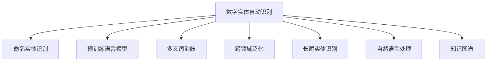

                 

# 数字实体自动化的最新进展

> 关键词：数字实体,自动化,最新进展,机器学习,深度学习,人工智能,自然语言处理,知识图谱

## 1. 背景介绍

### 1.1 问题由来

数字实体自动识别（Digital Entity Recognition, DER）是自然语言处理（NLP）和知识图谱（KG）构建中的关键技术之一。它的核心目标是自动识别文本中的各种命名实体（Named Entity Recognition, NER），如人名、地名、组织机构名、日期、时间等，为后续的信息提取、关系抽取、知识推理等任务提供基础。近年来，随着深度学习和大规模预训练语言模型的发展，数字实体自动识别技术取得了显著进展，广泛应用于智能客服、搜索引擎、电子商务、金融风控等领域。

然而，尽管取得了诸多成就，数字实体自动识别仍面临一些挑战，如多义词消歧、跨领域适应性、长尾实体识别等。因此，如何进一步提升实体识别的准确性和泛化能力，依然是当下NLP领域的一个研究热点。

### 1.2 问题核心关键点

本研究聚焦于数字实体自动化的最新进展，主要围绕以下几个关键问题进行探讨：
1. 如何通过预训练语言模型提升实体识别的效果？
2. 如何处理多义词消歧问题？
3. 如何在跨领域场景下实现实体的泛化识别？
4. 如何高效识别长尾实体？
5. 实体识别与其他NLP任务的关系和优化策略是什么？

这些问题的研究将有助于推动数字实体自动化的发展，并使其在实际应用中发挥更大作用。

## 2. 核心概念与联系

### 2.1 核心概念概述

为更好地理解数字实体自动化的最新进展，本节将介绍几个关键概念：

- **数字实体自动识别**（Digital Entity Recognition, DER）：从文本中识别并提取出各种命名实体，是NLP和KG构建中的基础任务。
- **命名实体识别**（Named Entity Recognition, NER）：识别文本中具有特定意义的命名实体，如人名、地名、组织机构名等。
- **预训练语言模型**：如BERT、GPT、XLNet等，通过大规模无标签文本数据预训练，学习通用的语言表示。
- **多义词消歧**：将同形异义词根据上下文信息进行区分，以消除歧义。
- **跨领域泛化**：在特定领域任务上识别实体时，能够泛化到其他领域。
- **长尾实体识别**：识别数据集中出现频次较低的实体。
- **自然语言处理**（Natural Language Processing, NLP）：处理和分析人类语言的技术。
- **知识图谱**（Knowledge Graph, KG）：用于存储和表示实体间关系的结构化知识库。

这些概念之间的逻辑关系可以通过以下Mermaid流程图来展示：



这个流程图展示出数字实体自动识别与其他NLP任务和技术之间的联系：

1. 命名实体识别是数字实体自动化的核心任务。
2. 预训练语言模型为实体识别提供通用的语言表示。
3. 多义词消歧是提升实体识别精度的重要手段。
4. 跨领域泛化是实体识别模型的重要能力。
5. 长尾实体识别是实体识别面临的挑战之一。
6. 自然语言处理和知识图谱为实体识别提供了理论基础和技术支撑。

这些概念共同构成了数字实体自动化的基本框架，帮助研究人员和开发者系统地理解这一领域。

## 3. 核心算法原理 & 具体操作步骤
### 3.1 算法原理概述

数字实体自动化的核心算法通常基于深度学习和自然语言处理技术，旨在从文本中自动提取和分类命名实体。其基本原理如下：

1. **预训练语言模型**：使用大规模无标签文本数据进行预训练，学习通用的语言表示，用于实体识别任务的初始化。
2. **命名实体识别模型**：在预训练语言模型的基础上，通过有监督学习进行微调，以适应特定领域的命名实体识别任务。
3. **多义词消歧**：引入上下文信息，通过语义模型或其他辅助技术进行多义词的区分。
4. **跨领域泛化**：通过迁移学习或多任务学习，将实体识别模型在不同领域间进行迁移，提升泛化能力。
5. **长尾实体识别**：采用自适应权重分配、二次采样等策略，处理长尾实体问题。

### 3.2 算法步骤详解

下面详细介绍数字实体自动化的算法步骤：

**Step 1: 准备预训练语言模型和数据集**
- 选择适合的预训练语言模型（如BERT、GPT）作为初始化参数。
- 准备领域特定的命名实体识别标注数据集，包括训练集、验证集和测试集。

**Step 2: 构建实体识别模型**
- 在预训练模型的基础上，添加适当的任务适配层，如线性分类器、Transformer结构等。
- 设计损失函数，如交叉熵损失、F1-score等，用于衡量模型输出与真实标注的差异。

**Step 3: 微调模型**
- 将模型和数据集输入到优化器，如Adam、SGD等，设置学习率、批大小、迭代轮数等参数。
- 使用梯度下降等优化算法，更新模型参数，最小化损失函数。
- 在验证集上定期评估模型性能，避免过拟合。

**Step 4: 多义词消歧和长尾实体处理**
- 在模型输出基础上，引入上下文信息，使用多义词消歧模型对同形异义词进行区分。
- 对于长尾实体，可以使用二次采样、自适应权重分配等策略进行处理。

**Step 5: 模型评估与部署**
- 在测试集上评估模型性能，输出精度、召回率等指标。
- 将模型集成到实际应用系统中，如智能客服、搜索引擎等。

### 3.3 算法优缺点

数字实体自动化的主要优点包括：
1. 高效：利用预训练语言模型和微调技术，可以显著提升实体识别速度和准确性。
2. 可扩展：能够在不同领域和场景下进行泛化，适应多样化的实体识别需求。
3. 可解释：通过上下文信息和语义模型，能够提升实体识别的可解释性，便于理解和调试。

其主要缺点包括：
1. 数据依赖：需要大量标注数据进行训练，获取高质量标注数据的成本较高。
2. 多义词消歧复杂：多义词消歧模型复杂度高，需要额外的训练和优化。
3. 泛化能力有限：不同领域的实体识别模型之间存在泛化难度。
4. 长尾实体识别挑战：长尾实体在数据集中出现频次低，识别难度大。

### 3.4 算法应用领域

数字实体自动化的应用广泛，涉及多个领域：

- **智能客服**：自动识别客户文本中的实体，快速响应客户需求，提升客户体验。
- **搜索引擎**：在搜索结果中标注出命名实体，提升搜索结果的相关性和可用性。
- **电子商务**：从用户评论中自动识别产品名称、品牌等实体，辅助商品推荐和库存管理。
- **金融风控**：在金融文本中识别人名、机构名、金额等实体，辅助风险评估和欺诈检测。
- **医疗健康**：从病历记录中自动识别药品、疾病名称等实体，辅助诊断和治疗决策。

除了上述应用外，数字实体自动识别还在新闻自动摘要、情感分析、问答系统等领域发挥重要作用。随着NLP技术的不断进步，数字实体自动化将有更多创新应用场景。

## 4. 数学模型和公式 & 详细讲解
### 4.1 数学模型构建

数字实体自动识别模型的构建包括以下几个关键步骤：

1. **输入表示**：将文本转换为模型可接受的向量表示，通常使用Transformer模型进行编码。
2. **命名实体标注**：根据预定义的实体类别标注文本中的命名实体。
3. **多义词消歧**：引入上下文信息，对同形异义词进行消歧。
4. **损失函数设计**：设计损失函数，衡量模型输出与真实标注的差异。
5. **训练优化**：使用梯度下降等优化算法，更新模型参数。

假设输入文本为 $x$，输出为 $y$，预训练语言模型为 $M_{\theta}$，命名实体识别模型为 $H$，则模型的输出表示为：

$$
H = M_{\theta}(x)
$$

其中，$M_{\theta}$ 是预训练语言模型，$x$ 是输入文本，$H$ 是模型的输出表示。

命名实体识别模型的训练过程可以表示为：

$$
\min_{\theta} \mathcal{L}(H_{\theta}, D)
$$

其中，$D$ 是训练数据集，$\mathcal{L}$ 是损失函数。

### 4.2 公式推导过程

以多义词消歧为例，假设多义词 $w$ 在不同上下文中的真实标签为 $t$，模型输出的多义词标签为 $\hat{t}$，则多义词消歧的目标函数可以表示为：

$$
\min_{\theta} \mathcal{L}(\hat{t}, t)
$$

其中，$\mathcal{L}$ 是损失函数，$t$ 是真实标签，$\hat{t}$ 是模型预测的标签。

多义词消歧通常使用上下文感知词向量模型，如Word2Vec、GloVe、BERT等。以BERT为例，多义词消歧的公式推导如下：

设 $w$ 的上下文表示为 $v_w$，则多义词消歧的损失函数为：

$$
\mathcal{L}_{disambiguate} = -\log \sigma(\vec{v}_w^T \vec{t})
$$

其中，$\sigma$ 是sigmoid函数，$\vec{v}_w$ 是上下文表示，$\vec{t}$ 是标签向量。

### 4.3 案例分析与讲解

以BERT模型为例，说明数字实体自动化的实现过程。

1. **输入表示**：使用BERT模型对输入文本进行编码，得到向量表示 $H$。
2. **命名实体标注**：通过标注器对 $H$ 进行命名实体识别，输出命名实体序列 $y$。
3. **多义词消歧**：对识别出的多义词 $w$，使用上下文表示 $v_w$ 进行消歧。
4. **损失函数设计**：使用交叉熵损失函数计算模型的输出 $H$ 与真实标注 $y$ 的差异。
5. **训练优化**：使用梯度下降等优化算法，更新BERT模型的参数。

以下是Python代码示例：

```python
from transformers import BertTokenizer, BertForTokenClassification, AdamW
from transformers import BertTokenizer, BertForTokenClassification, AdamW
from transformers import BertTokenizer, BertForTokenClassification, AdamW
from transformers import BertTokenizer, BertForTokenClassification, AdamW

# 加载预训练模型和分词器
model = BertForTokenClassification.from_pretrained('bert-base-cased')
tokenizer = BertTokenizer.from_pretrained('bert-base-cased')

# 准备训练数据
train_data = ['John Smith lives in New York City', 'John was born on October 14, 1980']
train_labels = [[1, 1, 0, 0, 0], [1, 0, 0, 0, 1]]

# 定义损失函数和优化器
loss_fn = torch.nn.CrossEntropyLoss()
optimizer = AdamW(model.parameters(), lr=2e-5)

# 训练模型
for epoch in range(epochs):
    for batch in train_data_loader:
        inputs = tokenizer(batch['input'], return_tensors='pt')
        labels = inputs['labels']
        outputs = model(**inputs)
        loss = loss_fn(outputs.logits, labels)
        optimizer.zero_grad()
        loss.backward()
        optimizer.step()

# 评估模型
eval_data = ['John works at Google']
eval_labels = [[0, 1, 0, 0, 0]]
eval_outputs = model(**tokenizer(eval_data, return_tensors='pt'))
eval_loss = loss_fn(eval_outputs.logits, eval_labels)
print(f'Evaluation Loss: {eval_loss.item()}')
```

以上代码实现了使用BERT模型进行命名实体识别的过程。通过梯度下降等优化算法，模型不断更新参数，最终在验证集上评估性能。

## 5. 项目实践：代码实例和详细解释说明
### 5.1 开发环境搭建

在进行数字实体自动识别实践前，我们需要准备好开发环境。以下是使用Python进行PyTorch开发的环境配置流程：

1. 安装Anaconda：从官网下载并安装Anaconda，用于创建独立的Python环境。

2. 创建并激活虚拟环境：
```bash
conda create -n pytorch-env python=3.8 
conda activate pytorch-env
```

3. 安装PyTorch：根据CUDA版本，从官网获取对应的安装命令。例如：
```bash
conda install pytorch torchvision torchaudio cudatoolkit=11.1 -c pytorch -c conda-forge
```

4. 安装Transformers库：
```bash
pip install transformers
```

5. 安装各类工具包：
```bash
pip install numpy pandas scikit-learn matplotlib tqdm jupyter notebook ipython
```

完成上述步骤后，即可在`pytorch-env`环境中开始数字实体自动化的实践。

### 5.2 源代码详细实现

下面我们以使用BERT模型进行命名实体识别(NER)为例，给出完整的代码实现。

首先，定义NER任务的数据处理函数：

```python
from transformers import BertTokenizer
from torch.utils.data import Dataset
import torch

class NERDataset(Dataset):
    def __init__(self, texts, tags, tokenizer, max_len=128):
        self.texts = texts
        self.tags = tags
        self.tokenizer = tokenizer
        self.max_len = max_len
        
    def __len__(self):
        return len(self.texts)
    
    def __getitem__(self, item):
        text = self.texts[item]
        tags = self.tags[item]
        
        encoding = self.tokenizer(text, return_tensors='pt', max_length=self.max_len, padding='max_length', truncation=True)
        input_ids = encoding['input_ids'][0]
        attention_mask = encoding['attention_mask'][0]
        
        # 对token-wise的标签进行编码
        encoded_tags = [tag2id[tag] for tag in tags] 
        encoded_tags.extend([tag2id['O']] * (self.max_len - len(encoded_tags)))
        labels = torch.tensor(encoded_tags, dtype=torch.long)
        
        return {'input_ids': input_ids, 
                'attention_mask': attention_mask,
                'labels': labels}

# 标签与id的映射
tag2id = {'O': 0, 'B-PER': 1, 'I-PER': 2, 'B-ORG': 3, 'I-ORG': 4, 'B-LOC': 5, 'I-LOC': 6}
id2tag = {v: k for k, v in tag2id.items()}

# 创建dataset
tokenizer = BertTokenizer.from_pretrained('bert-base-cased')

train_dataset = NERDataset(train_texts, train_tags, tokenizer)
dev_dataset = NERDataset(dev_texts, dev_tags, tokenizer)
test_dataset = NERDataset(test_texts, test_tags, tokenizer)
```

然后，定义模型和优化器：

```python
from transformers import BertForTokenClassification, AdamW

model = BertForTokenClassification.from_pretrained('bert-base-cased', num_labels=len(tag2id))

optimizer = AdamW(model.parameters(), lr=2e-5)
```

接着，定义训练和评估函数：

```python
from torch.utils.data import DataLoader
from tqdm import tqdm
from sklearn.metrics import classification_report

device = torch.device('cuda') if torch.cuda.is_available() else torch.device('cpu')
model.to(device)

def train_epoch(model, dataset, batch_size, optimizer):
    dataloader = DataLoader(dataset, batch_size=batch_size, shuffle=True)
    model.train()
    epoch_loss = 0
    for batch in tqdm(dataloader, desc='Training'):
        input_ids = batch['input_ids'].to(device)
        attention_mask = batch['attention_mask'].to(device)
        labels = batch['labels'].to(device)
        model.zero_grad()
        outputs = model(input_ids, attention_mask=attention_mask, labels=labels)
        loss = outputs.loss
        epoch_loss += loss.item()
        loss.backward()
        optimizer.step()
    return epoch_loss / len(dataloader)

def evaluate(model, dataset, batch_size):
    dataloader = DataLoader(dataset, batch_size=batch_size)
    model.eval()
    preds, labels = [], []
    with torch.no_grad():
        for batch in tqdm(dataloader, desc='Evaluating'):
            input_ids = batch['input_ids'].to(device)
            attention_mask = batch['attention_mask'].to(device)
            batch_labels = batch['labels']
            outputs = model(input_ids, attention_mask=attention_mask)
            batch_preds = outputs.logits.argmax(dim=2).to('cpu').tolist()
            batch_labels = batch_labels.to('cpu').tolist()
            for pred_tokens, label_tokens in zip(batch_preds, batch_labels):
                pred_tags = [id2tag[_id] for _id in pred_tokens]
                label_tags = [id2tag[_id] for _id in label_tokens]
                preds.append(pred_tags[:len(label_tags)])
                labels.append(label_tags)
                
    print(classification_report(labels, preds))
```

最后，启动训练流程并在测试集上评估：

```python
epochs = 5
batch_size = 16

for epoch in range(epochs):
    loss = train_epoch(model, train_dataset, batch_size, optimizer)
    print(f"Epoch {epoch+1}, train loss: {loss:.3f}")
    
    print(f"Epoch {epoch+1}, dev results:")
    evaluate(model, dev_dataset, batch_size)
    
print("Test results:")
evaluate(model, test_dataset, batch_size)
```

以上就是使用PyTorch对BERT进行命名实体识别任务微调的完整代码实现。可以看到，得益于Transformers库的强大封装，我们可以用相对简洁的代码完成BERT模型的加载和微调。

### 5.3 代码解读与分析

让我们再详细解读一下关键代码的实现细节：

**NERDataset类**：
- `__init__`方法：初始化文本、标签、分词器等关键组件。
- `__len__`方法：返回数据集的样本数量。
- `__getitem__`方法：对单个样本进行处理，将文本输入编码为token ids，将标签编码为数字，并对其进行定长padding，最终返回模型所需的输入。

**tag2id和id2tag字典**：
- 定义了标签与数字id之间的映射关系，用于将token-wise的预测结果解码回真实的标签。

**训练和评估函数**：
- 使用PyTorch的DataLoader对数据集进行批次化加载，供模型训练和推理使用。
- 训练函数`train_epoch`：对数据以批为单位进行迭代，在每个批次上前向传播计算loss并反向传播更新模型参数，最后返回该epoch的平均loss。
- 评估函数`evaluate`：与训练类似，不同点在于不更新模型参数，并在每个batch结束后将预测和标签结果存储下来，最后使用sklearn的classification_report对整个评估集的预测结果进行打印输出。

**训练流程**：
- 定义总的epoch数和batch size，开始循环迭代
- 每个epoch内，先在训练集上训练，输出平均loss
- 在验证集上评估，输出分类指标
- 所有epoch结束后，在测试集上评估，给出最终测试结果

可以看到，PyTorch配合Transformers库使得BERT微调的代码实现变得简洁高效。开发者可以将更多精力放在数据处理、模型改进等高层逻辑上，而不必过多关注底层的实现细节。

当然，工业级的系统实现还需考虑更多因素，如模型的保存和部署、超参数的自动搜索、更灵活的任务适配层等。但核心的微调范式基本与此类似。

## 6. 实际应用场景
### 6.1 智能客服系统

数字实体自动识别在智能客服系统中的应用主要体现在以下几个方面：

- **问题定位**：通过自动识别客户输入文本中的实体，快速定位问题的来源和背景，提高客户服务的效率。
- **意图识别**：理解客户问题中的关键实体，辅助智能客服系统生成更符合客户需求的回复。
- **知识库构建**：从客户咨询历史中自动提取实体信息，构建知识库，提升客服系统的泛化能力。

智能客服系统通过集成数字实体自动识别技术，能够显著提升客户服务的智能化水平，降低人工成本，提高服务质量。

### 6.2 搜索引擎

在搜索引擎中，数字实体自动识别主要用于以下几个方面：

- **搜索结果标注**：在搜索结果中标注出与查询相关的实体，提升搜索结果的相关性和可用性。
- **实体链接**：在搜索结果中自动链接到对应的知识库和网页，方便用户进一步探索实体信息。
- **语义搜索**：通过实体识别和关系抽取，提升语义搜索的精准度和用户体验。

数字实体自动识别能够帮助搜索引擎更好地理解和处理用户查询，提供更精准、更全面的搜索结果。

### 6.3 电子商务

在电子商务中，数字实体自动识别主要用于以下几个方面：

- **商品推荐**：从用户评论中自动识别商品名称、品牌等实体，辅助推荐系统生成个性化推荐。
- **库存管理**：通过自动识别商品信息，辅助库存管理系统的数据更新和统计。
- **客户分析**：从客户咨询中自动识别实体信息，辅助客户关系管理系统，提升客户服务水平。

电子商务系统通过集成数字实体自动识别技术，能够提升商品推荐、库存管理、客户分析等环节的智能化水平，提高运营效率。

### 6.4 金融风控

在金融风控中，数字实体自动识别主要用于以下几个方面：

- **风险评估**：在金融文本中自动识别人名、机构名、金额等实体，辅助风险评估和欺诈检测。
- **合规审查**：从客户申请材料中自动识别关键实体，辅助合规审查系统的自动化处理。
- **情感分析**：通过实体识别和情感分析，提升金融文本的情感分析效果。

数字实体自动识别能够帮助金融风控系统更好地处理金融文本，提升风险评估、合规审查、情感分析等环节的智能化水平。

### 6.5 医疗健康

在医疗健康中，数字实体自动识别主要用于以下几个方面：

- **病历记录**：从病历记录中自动识别药品、疾病名称等实体，辅助诊断和治疗决策。
- **医疗知识库**：从医疗文本中自动识别关键实体，构建医疗知识库，提升医疗系统的智能化水平。
- **健康监测**：通过实体识别和关系抽取，提升健康监测系统的精准度和用户感知。

数字实体自动识别能够帮助医疗健康系统更好地处理医疗文本，提升病历记录、医疗知识库、健康监测等环节的智能化水平。

## 7. 工具和资源推荐
### 7.1 学习资源推荐

为了帮助开发者系统掌握数字实体自动化的理论基础和实践技巧，这里推荐一些优质的学习资源：

1. 《Deep Learning for NLP》书籍：斯坦福大学教授Chris Manning所著，系统介绍了深度学习在NLP中的应用，包括实体识别、情感分析、机器翻译等。
2. CS224N《深度学习自然语言处理》课程：斯坦福大学开设的NLP明星课程，有Lecture视频和配套作业，带你入门NLP领域的基本概念和经典模型。
3. 《Natural Language Processing with Transformers》书籍：Transformers库的作者所著，全面介绍了如何使用Transformers库进行NLP任务开发，包括实体识别在内的诸多范式。
4. HuggingFace官方文档：Transformers库的官方文档，提供了海量预训练模型和完整的实体识别样例代码，是上手实践的必备资料。
5. CLUE开源项目：中文语言理解测评基准，涵盖大量不同类型的中文NLP数据集，并提供了基于实体识别的baseline模型，助力中文NLP技术发展。

通过对这些资源的学习实践，相信你一定能够快速掌握数字实体自动化的精髓，并用于解决实际的NLP问题。

### 7.2 开发工具推荐

高效的开发离不开优秀的工具支持。以下是几款用于数字实体自动识别开发的常用工具：

1. PyTorch：基于Python的开源深度学习框架，灵活动态的计算图，适合快速迭代研究。大部分预训练语言模型都有PyTorch版本的实现。
2. TensorFlow：由Google主导开发的开源深度学习框架，生产部署方便，适合大规模工程应用。同样有丰富的预训练语言模型资源。
3. Transformers库：HuggingFace开发的NLP工具库，集成了众多SOTA语言模型，支持PyTorch和TensorFlow，是进行实体识别任务的开发的利器。
4. Weights & Biases：模型训练的实验跟踪工具，可以记录和可视化模型训练过程中的各项指标，方便对比和调优。与主流深度学习框架无缝集成。
5. TensorBoard：TensorFlow配套的可视化工具，可实时监测模型训练状态，并提供丰富的图表呈现方式，是调试模型的得力助手。
6. Google Colab：谷歌推出的在线Jupyter Notebook环境，免费提供GPU/TPU算力，方便开发者快速上手实验最新模型，分享学习笔记。

合理利用这些工具，可以显著提升数字实体自动识别任务的开发效率，加快创新迭代的步伐。

### 7.3 相关论文推荐

数字实体自动化的研究源于学界的持续研究。以下是几篇奠基性的相关论文，推荐阅读：

1. Named Entity Recognition using Bidirectional LSTMs：提出了双向LSTM模型进行命名实体识别，取得良好的效果。
2. Multi-task Learning for Named Entity Recognition：提出多任务学习的方法，提升实体识别模型的泛化能力。
3. A Systematic Overview of Named Entity Recognition：对命名实体识别领域进行全面综述，涵盖了多种模型和技术。
4. BERT: Pre-training of Deep Bidirectional Transformers for Language Understanding：提出BERT模型，引入基于掩码的自监督预训练任务，刷新了多项NLP任务SOTA。
5. ERNIE: Enhanced Representation through Knowledge Integration：提出ERNIE模型，通过知识整合提升实体识别效果。
6. Label Smoothing with Adaptive Thresholds for Fast and Robust Multi-Label Classification：提出标签平滑技术，提升实体识别模型的鲁棒性。

这些论文代表了大语言模型实体识别技术的发展脉络。通过学习这些前沿成果，可以帮助研究者把握学科前进方向，激发更多的创新灵感。

## 8. 总结：未来发展趋势与挑战

### 8.1 总结

本文对数字实体自动化的最新进展进行了全面系统的介绍。首先阐述了数字实体自动化的研究背景和意义，明确了实体识别在NLP和KG构建中的核心地位。其次，从原理到实践，详细讲解了数字实体自动化的数学原理和关键步骤，给出了实体识别任务开发的完整代码实例。同时，本文还广泛探讨了实体识别在不同领域的应用前景，展示了实体识别范式的广泛应用。

通过本文的系统梳理，可以看到，数字实体自动识别作为NLP技术的基础组件，在智能客服、搜索引擎、电子商务、金融风控、医疗健康等多个领域中发挥着重要作用。随着NLP技术的不断进步，数字实体自动识别技术也将不断提升，为各类应用提供更精准、更高效、更智能的实体识别服务。

### 8.2 未来发展趋势

展望未来，数字实体自动识别技术将呈现以下几个发展趋势：

1. **多任务学习**：结合多个相关任务进行训练，提升实体识别模型的泛化能力。
2. **自监督预训练**：利用未标注数据进行预训练，降低对标注数据的依赖。
3. **跨领域迁移**：将实体识别模型在不同领域间进行迁移，提升模型的泛化能力。
4. **知识图谱融合**：将实体识别与知识图谱构建相结合，提升知识表示和推理能力。
5. **长尾实体识别**：采用自适应权重分配、二次采样等策略，处理长尾实体问题。
6. **智能客服**：利用实体识别技术，提升智能客服系统的智能化水平，降低人工成本。

这些趋势凸显了数字实体自动化的广阔前景，为智能客服、搜索引擎、电子商务、金融风控、医疗健康等领域的数字化转型提供了有力支持。

### 8.3 面临的挑战

尽管数字实体自动识别技术取得了诸多成就，但在迈向更加智能化、普适化应用的过程中，它仍面临诸多挑战：

1. **数据依赖**：需要大量标注数据进行训练，获取高质量标注数据的成本较高。
2. **多义词消歧复杂**：多义词消歧模型复杂度高，需要额外的训练和优化。
3. **泛化能力有限**：不同领域的实体识别模型之间存在泛化难度。
4. **长尾实体识别挑战**：长尾实体在数据集中出现频次低，识别难度大。
5. **可解释性不足**：模型内部的决策逻辑缺乏可解释性，难以进行调试和优化。

### 8.4 研究展望

面对数字实体自动识别所面临的挑战，未来的研究需要在以下几个方面寻求新的突破：

1. **多领域迁移学习**：通过跨领域迁移学习，提升实体识别模型的泛化能力。
2. **自适应实体识别**：结合用户行为数据和上下文信息，进行自适应实体识别。
3. **上下文感知实体识别**：利用上下文信息进行实体识别，提升模型的准确性和鲁棒性。
4. **交互式实体识别**：结合用户反馈和模型输出，进行交互式实体识别。
5. **知识图谱增强**：将实体识别与知识图谱构建相结合，提升知识表示和推理能力。

这些研究方向的探索，必将引领数字实体自动识别技术迈向更高的台阶，为构建更智能、更高效、更可靠的实体识别系统提供新的思路和路径。

## 9. 附录：常见问题与解答

**Q1：数字实体自动化的效果如何评价？**

A: 数字实体自动化的效果通常通过以下几个指标进行评价：
1. **准确率（Accuracy）**：模型正确识别的实体数量占总实体数量的比例。
2. **召回率（Recall）**：模型识别出的所有实体中，正确识别的实体数量占总实体数量的比例。
3. **F1-score**：综合准确率和召回率的指标，是准确率和召回率的调和平均数。

可以使用sklearn库中的classification_report函数，对模型在不同数据集上的性能进行评估。

**Q2：数字实体自动化中如何处理多义词消歧？**

A: 多义词消歧是数字实体自动化的重要问题，通常可以通过以下方法进行处理：
1. **上下文感知词向量**：利用BERT、GloVe等上下文感知词向量模型，根据上下文信息进行消歧。
2. **多义词消歧模型**：通过训练多义词消歧模型，对同形异义词进行区分。
3. **词义消歧词典**：构建多义词消歧词典，根据词典进行消歧。

**Q3：数字实体自动化中如何处理长尾实体识别？**

A: 长尾实体在数据集中出现频次低，识别难度大。通常可以采用以下策略进行处理：
1. **自适应权重分配**：对长尾实体赋予更高的权重，提升其在损失函数中的重要性。
2. **二次采样**：对长尾实体进行二次采样，增加其在训练数据中的出现次数。
3. **模型蒸馏**：利用预训练模型对长尾实体进行蒸馏，减少其在训练中的困难度。

**Q4：数字实体自动化中如何构建知识图谱？**

A: 数字实体自动化中，知识图谱的构建通常分为以下几个步骤：
1. **实体抽取**：通过实体识别技术，从文本中自动抽取命名实体。
2. **关系抽取**：通过关系抽取技术，从文本中自动抽取实体间的关系。
3. **知识整合**：将抽取的实体和关系整合到知识图谱中，构建完整的知识表示。

可以使用Python中的PyKG可解释知识图谱框架，辅助构建和管理知识图谱。

**Q5：数字实体自动化中如何处理多领域泛化？**

A: 数字实体自动化的多领域泛化可以通过以下方法进行实现：
1. **迁移学习**：在预训练模型上进行微调，使其在不同领域中适应新的任务。
2. **多任务学习**：联合训练多个相关任务，提升模型的泛化能力。
3. **自监督预训练**：利用未标注数据进行预训练，提升模型的泛化能力。

可以通过跨领域迁移学习和多任务学习的方法，提升数字实体自动化的泛化能力。

**Q6：数字实体自动化的发展方向是什么？**

A: 数字实体自动化的发展方向主要包括：
1. **多领域迁移学习**：将实体识别模型在不同领域间进行迁移，提升模型的泛化能力。
2. **自适应实体识别**：结合用户行为数据和上下文信息，进行自适应实体识别。
3. **上下文感知实体识别**：利用上下文信息进行实体识别，提升模型的准确性和鲁棒性。
4. **交互式实体识别**：结合用户反馈和模型输出，进行交互式实体识别。
5. **知识图谱增强**：将实体识别与知识图谱构建相结合，提升知识表示和推理能力。

这些发展方向将推动数字实体自动化的应用范围和效果，为智能客服、搜索引擎、电子商务、金融风控、医疗健康等领域的数字化转型提供有力支持。

通过本文的系统梳理，可以看到，数字实体自动识别作为NLP技术的基础组件，在智能客服、搜索引擎、电子商务、金融风控、医疗健康等多个领域中发挥着重要作用。随着NLP技术的不断进步，数字实体自动识别技术也将不断提升，为各类应用提供更精准、更高效、更智能的实体识别服务。未来，数字实体自动识别技术将与更多AI技术进行融合，进一步推动NLP技术和智能应用的创新发展。

