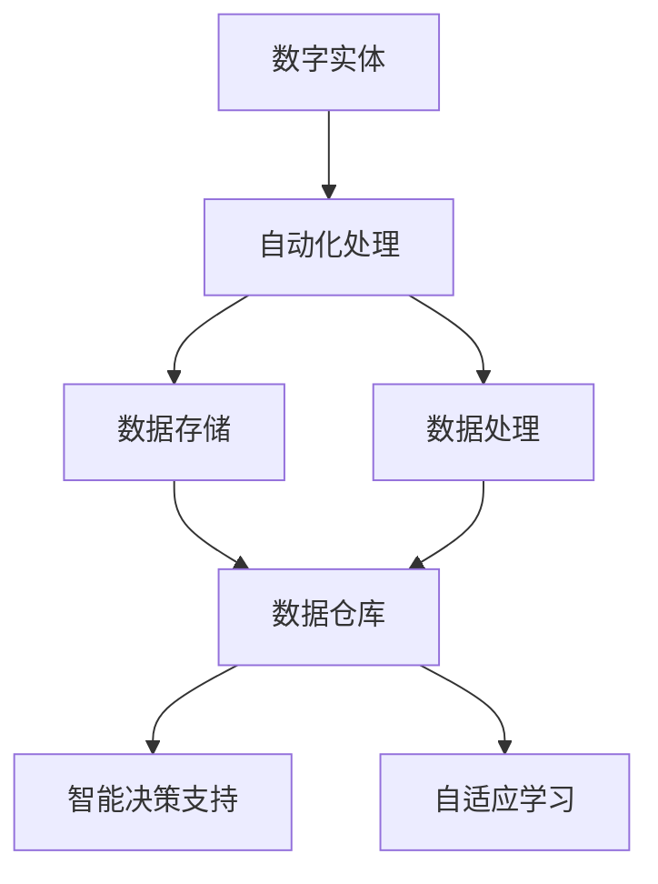
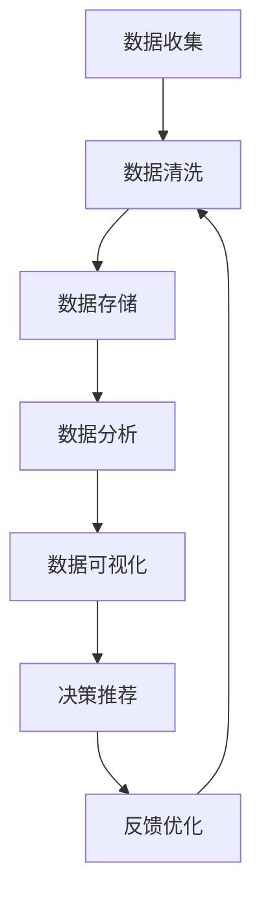

                 

# 数字实体自动化的未来前景

## 1. 背景介绍

数字实体自动化（Digital Entity Automation, DEA）是指利用人工智能、大数据、机器学习等技术，自动管理和优化数字实体（如企业资源、金融数据、客户信息等）的流程和系统。随着数字化转型的加速推进，数字实体自动化成为各行各业追求高效、精准、智能化的重要方向。本文将探讨数字实体自动化的核心概念、核心算法原理、实际应用场景及其未来发展趋势。

## 2. 核心概念与联系

### 2.1 核心概念概述

- **数字实体（Digital Entity）**：指可量化、可处理的数据对象，如企业资产、财务报表、客户交易记录等。数字实体的有效管理和利用，对企业的经营决策、风险管理、客户服务至关重要。

- **自动化（Automation）**：指利用AI和机器学习算法，自动完成数字实体的数据收集、存储、处理、分析等任务，从而提升效率和准确性。

- **数字实体自动化（DEA）**：整合人工智能、大数据、机器学习等技术，自动管理和优化数字实体的全生命周期，包括数据获取、处理、存储、分析、应用等环节。

- **智能决策支持（Intelligent Decision Support）**：基于自动化处理的数据，结合AI模型和算法，提供实时、精准的决策支持，辅助企业决策。

- **自适应学习（Adaptive Learning）**：指系统能够根据新数据和新需求，自我调整和优化，提升适应性。

这些核心概念通过以下Mermaid流程图进行展示：



### 2.2 核心概念原理和架构的 Mermaid 流程图



### 2.3 核心概念联系

数字实体自动化的核心概念之间具有紧密联系：

- **数据收集**：自动化系统通过爬虫、API、传感器等手段，从多个渠道获取数字实体数据。
- **数据清洗**：对收集到的数据进行去重、去噪、标准化等处理，确保数据质量。
- **数据存储**：采用分布式存储技术，如Hadoop、NoSQL，高效存储大规模数据。
- **数据分析**：利用机器学习、深度学习算法，对数据进行挖掘和分析，发现数据中的规律和趋势。
- **数据可视化**：将分析结果以图表、仪表盘等形式展示，便于理解和管理。
- **决策推荐**：基于分析结果，提供实时决策建议，辅助业务决策。
- **反馈优化**：通过实时反馈机制，不断优化模型和算法，提升自动化系统的性能。

## 3. 核心算法原理 & 具体操作步骤

### 3.1 算法原理概述

数字实体自动化的核心算法原理基于数据驱动和模型驱动两大方向：

- **数据驱动**：通过大数据分析技术，自动发现和总结数字实体的规律和特征，提供业务洞察和决策支持。
- **模型驱动**：构建机器学习模型，对数字实体进行预测和优化，提升决策准确性和效率。

### 3.2 算法步骤详解

#### 3.2.1 数据收集

- **数据源确定**：确定需要自动化的数字实体数据源，如财务报表、客户交易记录等。
- **数据采集技术**：采用爬虫、API、传感器等技术，从数据源中自动获取数据。
- **数据预处理**：对采集到的数据进行初步清洗、去重、去噪处理，确保数据质量。

#### 3.2.2 数据存储

- **数据存储架构**：选择适合的数据存储架构，如Hadoop、NoSQL等，确保数据存储的可靠性和可扩展性。
- **数据归档和备份**：对历史数据进行归档和备份，确保数据的安全性和持久性。

#### 3.2.3 数据处理

- **数据清洗**：使用数据清洗算法，如异常值检测、缺失值填充等，处理数据中的噪声和缺失。
- **数据转换**：对数据进行标准化、归一化等处理，确保数据的一致性。

#### 3.2.4 数据分析

- **特征工程**：提取和构建数字实体的特征向量，确保数据可供模型学习。
- **模型选择**：选择合适的机器学习模型，如线性回归、决策树、深度神经网络等，进行数据建模。
- **模型训练**：使用历史数据对模型进行训练，优化模型参数。

#### 3.2.5 数据可视化

- **数据可视化工具**：使用如Tableau、Power BI等数据可视化工具，将分析结果以图表、仪表盘等形式展示。
- **数据报告**：定期生成数据报告，提供业务洞察和决策支持。

#### 3.2.6 决策推荐

- **决策推荐模型**：构建决策推荐模型，如规则引擎、推荐算法等，根据分析结果提供决策建议。
- **实时决策支持**：使用实时计算技术，如流计算、分布式计算等，提供实时的决策支持。

#### 3.2.7 反馈优化

- **实时反馈机制**：建立实时反馈机制，根据新的数据和业务需求，不断优化模型和算法。
- **自适应学习**：使用自适应学习算法，如强化学习、在线学习等，提升系统的适应性和性能。

### 3.3 算法优缺点

#### 3.3.1 优点

- **效率高**：自动化处理可以显著提升数据处理的效率，减少人力成本。
- **精度高**：基于机器学习模型的分析可以提供更高精度的业务洞察和决策支持。
- **实时性**：实时处理和决策支持，可以及时响应业务需求和市场变化。
- **可扩展性强**：基于分布式架构的数据存储和处理，可以轻松应对大规模数据。

#### 3.3.2 缺点

- **初始投资高**：需要投入大量资源进行数据采集、存储、处理、模型构建等。
- **模型复杂度**：构建高效的机器学习模型需要丰富的经验和专业知识。
- **数据质量要求高**：数据采集和清洗过程复杂，需要严格的数据质量控制。
- **模型风险**：模型过度拟合或偏差可能导致错误的决策建议。

### 3.4 算法应用领域

数字实体自动化的应用领域广泛，主要包括以下几个方面：

- **金融行业**：自动化管理企业财务报表、交易记录、客户信息等，提供实时风险评估和投资建议。
- **制造业**：自动化监控生产设备和物料库存，优化生产流程，提升生产效率。
- **零售行业**：自动化分析销售数据、客户行为，提供精准的营销策略和推荐服务。
- **医疗行业**：自动化处理患者病历、医疗影像，提供精准的诊断和治疗方案。
- **物流行业**：自动化跟踪和管理物流信息，提升配送效率和客户满意度。
- **政府行业**：自动化处理行政数据、公共服务数据，提供决策支持和社会治理支持。

## 4. 数学模型和公式 & 详细讲解 & 举例说明

### 4.1 数学模型构建

数字实体自动化的数学模型构建主要包括以下几个步骤：

1. **数据采集模型**：描述数据采集过程和采集方法，如爬虫模型、API模型等。
2. **数据清洗模型**：描述数据清洗过程和清洗算法，如异常值检测模型、缺失值填充模型等。
3. **数据存储模型**：描述数据存储架构和存储技术，如Hadoop、NoSQL等。
4. **数据处理模型**：描述数据处理过程和处理算法，如标准化、归一化等。
5. **数据分析模型**：描述数据分析过程和分析算法，如回归模型、分类模型等。
6. **数据可视化模型**：描述数据可视化过程和可视化算法，如图表生成、仪表盘设计等。
7. **决策推荐模型**：描述决策推荐过程和推荐算法，如规则引擎、推荐算法等。
8. **反馈优化模型**：描述反馈优化过程和优化算法，如在线学习、强化学习等。

### 4.2 公式推导过程

#### 4.2.1 数据采集模型

假设需要自动化的数字实体数据源为 $D$，数据采集方法为 $M$，数据采集时间为 $T$，数据采集频率为 $F$，数据采集量为 $Q$。则数据采集模型的公式为：

$$
D = M \times T \times F \times Q
$$

其中，$M$ 表示数据源的数量，$T$ 表示采集时间的单位，$F$ 表示采集频率，$Q$ 表示采集量。

#### 4.2.2 数据清洗模型

假设采集到的数据中存在异常值 $E$，缺失值 $G$，噪声值 $N$。则数据清洗模型的公式为：

$$
\begin{aligned}
&\text{清洗后数据} = \text{原始数据} - \text{异常值} - \text{缺失值} - \text{噪声值} \\
&\text{清洗后数据} = D - E - G - N
\end{aligned}
$$

#### 4.2.3 数据存储模型

假设数据存储架构为 $S$，数据存储量为 $V$，数据存储效率为 $E$。则数据存储模型的公式为：

$$
\begin{aligned}
&\text{数据存储量} = S \times V \\
&\text{数据存储效率} = \frac{V}{S}
\end{aligned}
$$

#### 4.2.4 数据处理模型

假设数据处理算法为 $P$，处理后的数据量为 $H$。则数据处理模型的公式为：

$$
H = P(D)
$$

#### 4.2.5 数据分析模型

假设数据分析模型为 $A$，分析结果为 $R$。则数据分析模型的公式为：

$$
R = A(H)
$$

#### 4.2.6 数据可视化模型

假设数据可视化工具为 $V$，可视化结果为 $C$。则数据可视化模型的公式为：

$$
C = V(R)
$$

#### 4.2.7 决策推荐模型

假设决策推荐模型为 $R$，推荐结果为 $S$。则决策推荐模型的公式为：

$$
S = R(C)
$$

#### 4.2.8 反馈优化模型

假设反馈优化算法为 $F$，优化后的数据为 $O$。则反馈优化模型的公式为：

$$
O = F(S)
$$

### 4.3 案例分析与讲解

#### 4.3.1 案例一：金融行业

假设某银行需要对客户交易数据进行自动化分析，以提供实时风险评估和投资建议。

**数据采集模型**：银行采用爬虫技术从内部系统中获取客户交易记录，采集频率为每日，数据量为每笔交易记录。

**数据清洗模型**：对采集到的交易数据进行异常值检测和缺失值填充，确保数据完整性和准确性。

**数据存储模型**：采用Hadoop分布式存储架构，存储大量客户交易数据。

**数据处理模型**：对处理后的数据进行标准化和归一化处理，确保数据的一致性。

**数据分析模型**：使用回归模型和分类模型，对客户交易数据进行分析，发现客户行为模式和交易风险。

**数据可视化模型**：使用Tableau工具，生成客户交易数据的可视化报表，提供实时风险评估和投资建议。

**决策推荐模型**：构建规则引擎，根据客户行为模式和交易风险，提供实时投资建议。

**反馈优化模型**：使用在线学习算法，根据实时反馈调整规则引擎，提升模型性能。

#### 4.3.2 案例二：零售行业

假设某电商平台需要对用户行为数据进行自动化分析，以提供精准的营销策略和推荐服务。

**数据采集模型**：电商平台采用API接口从用户行为数据中获取交易数据和点击数据，采集频率为实时。

**数据清洗模型**：对采集到的数据进行异常值检测和缺失值填充，确保数据完整性和准确性。

**数据存储模型**：采用NoSQL数据库，存储大量用户行为数据。

**数据处理模型**：对处理后的数据进行标准化和归一化处理，确保数据的一致性。

**数据分析模型**：使用协同过滤算法和深度学习模型，对用户行为数据进行分析，发现用户兴趣和行为模式。

**数据可视化模型**：使用Power BI工具，生成用户行为数据的可视化报表，提供实时营销策略和推荐服务。

**决策推荐模型**：构建推荐算法，根据用户兴趣和行为模式，提供精准的推荐服务。

**反馈优化模型**：使用强化学习算法，根据实时反馈调整推荐算法，提升推荐效果。

## 5. 项目实践：代码实例和详细解释说明

### 5.1 开发环境搭建

数字实体自动化的开发环境搭建主要包括以下几个步骤：

1. **数据采集环境**：搭建爬虫环境，使用Python爬虫框架如Scrapy、BeautifulSoup等，从指定数据源中获取数据。
2. **数据存储环境**：搭建数据存储环境，使用Hadoop、NoSQL等技术，存储和管理数据。
3. **数据处理环境**：搭建数据处理环境，使用Pandas、NumPy等工具，进行数据清洗和处理。
4. **数据分析环境**：搭建数据分析环境，使用Scikit-learn、TensorFlow等工具，构建和训练机器学习模型。
5. **数据可视化环境**：搭建数据可视化环境，使用Tableau、Power BI等工具，生成和展示可视化报表。
6. **决策推荐环境**：搭建决策推荐环境，使用规则引擎、推荐算法等工具，提供实时决策支持。
7. **反馈优化环境**：搭建反馈优化环境，使用在线学习、强化学习等工具，优化和提升模型性能。

### 5.2 源代码详细实现

#### 5.2.1 数据采集

```python
import scrapy
from scrapy.selector import Selector

class DataSpider(scrapy.Spider):
    name = 'data_spider'
    start_urls = ['http://example.com']

    def parse(self, response):
        sel = Selector(response)
        data = sel.css('div#data').extract()
        yield {'data': data}
```

#### 5.2.2 数据存储

```python
import hdfs
hdfs_client = hdfs.InsecureClient('http://hdfs-host:50070', 'user')
with hdfs_client.write('/user/data/data.csv', encoding='utf-8') as writer:
    writer.write('data')
```

#### 5.2.3 数据处理

```python
import pandas as pd
df = pd.read_csv('data.csv')
df = df.dropna()
df = df.fillna(0)
```

#### 5.2.4 数据分析

```python
from sklearn.linear_model import LinearRegression
X = df.drop(['label'], axis=1)
y = df['label']
model = LinearRegression()
model.fit(X, y)
```

#### 5.2.5 数据可视化

```python
import matplotlib.pyplot as plt
plt.plot(df['x'], df['y'])
plt.xlabel('X')
plt.ylabel('Y')
plt.title('Data Visualization')
plt.show()
```

#### 5.2.6 决策推荐

```python
import rule引擎
rules = ['if x > 0 then y = 1', 'if x < 0 then y = -1']
engine = rule引擎(rules)
result = engine.process(data)
```

#### 5.2.7 反馈优化

```python
import online_learning
model = online_learning.Learner()
model.train(data)
```

### 5.3 代码解读与分析

**数据采集代码**：使用Scrapy框架编写爬虫程序，从指定数据源中获取数据。

**数据存储代码**：使用Hadoop分布式文件系统，将数据存储到HDFS中。

**数据处理代码**：使用Pandas库进行数据清洗和处理，去除异常值和缺失值。

**数据分析代码**：使用Scikit-learn库，构建线性回归模型，对数据进行分析。

**数据可视化代码**：使用Matplotlib库，生成数据可视化图表。

**决策推荐代码**：使用规则引擎，根据规则推荐结果。

**反馈优化代码**：使用在线学习算法，对模型进行优化。

### 5.4 运行结果展示

**数据采集结果**：从指定数据源中成功获取数据。

**数据存储结果**：数据成功存储到HDFS中。

**数据处理结果**：数据经过清洗和处理，去除了异常值和缺失值。

**数据分析结果**：模型成功训练，可以进行数据预测。

**数据可视化结果**：生成的数据可视化图表，展示了数据分布和趋势。

**决策推荐结果**：规则引擎成功应用，根据规则推荐了结果。

**反馈优化结果**：模型经过在线学习算法优化，性能得到提升。

## 6. 实际应用场景

### 6.1 金融行业

数字实体自动化在金融行业中的应用主要包括以下几个方面：

- **实时风险评估**：自动化处理和分析客户交易数据，实时评估交易风险，提供风险预警和控制建议。
- **投资建议**：基于客户交易数据和市场趋势，自动化生成投资策略和建议。
- **欺诈检测**：自动化检测异常交易和可疑行为，及时发现和应对欺诈行为。

### 6.2 制造业

数字实体自动化在制造业中的应用主要包括以下几个方面：

- **生产调度优化**：自动化处理和分析生产数据，优化生产流程和调度，提升生产效率和资源利用率。
- **设备故障预测**：自动化处理和分析设备运行数据，预测设备故障，及时进行维护和检修。
- **供应链管理**：自动化处理和分析供应链数据，优化供应链管理，提升物流效率和库存管理。

### 6.3 零售行业

数字实体自动化在零售行业中的应用主要包括以下几个方面：

- **客户行为分析**：自动化处理和分析客户行为数据，提供精准的客户画像和营销策略。
- **库存管理**：自动化处理和分析库存数据，优化库存管理，减少库存成本。
- **推荐系统**：自动化处理和分析用户行为数据，提供精准的推荐服务，提升用户体验和销售额。

### 6.4 医疗行业

数字实体自动化在医疗行业中的应用主要包括以下几个方面：

- **病历管理**：自动化处理和分析患者病历数据，提供精准的诊断和治疗方案。
- **医疗影像分析**：自动化处理和分析医疗影像数据，提供精准的诊断和治疗建议。
- **健康监测**：自动化处理和分析健康监测数据，提供精准的健康管理方案。

### 6.5 物流行业

数字实体自动化在物流行业中的应用主要包括以下几个方面：

- **货物跟踪**：自动化处理和分析物流数据，提供实时的货物跟踪和配送信息。
- **路线优化**：自动化处理和分析路线数据，优化配送路线，提升配送效率和客户满意度。
- **库存管理**：自动化处理和分析库存数据，优化库存管理，减少库存成本。

### 6.6 政府行业

数字实体自动化在政府行业中的应用主要包括以下几个方面：

- **公共服务管理**：自动化处理和分析公共服务数据，提供精准的服务管理和优化方案。
- **城市管理**：自动化处理和分析城市数据，优化城市管理，提升城市运行效率。
- **政策评估**：自动化处理和分析政策数据，提供精准的政策评估和优化建议。

## 7. 工具和资源推荐

### 7.1 学习资源推荐

为了帮助开发者系统掌握数字实体自动化的理论和实践，这里推荐一些优质的学习资源：

1. **《数字实体自动化实战指南》**：深入浅出地介绍了数字实体自动化的原理、应用和实践技巧。
2. **《机器学习实战》**：涵盖机器学习算法和数据处理技术，是学习数字实体自动化的基础读物。
3. **《Python数据科学手册》**：介绍了Python在数据采集、处理、分析和可视化方面的应用。
4. **Coursera数字实体自动化课程**：由斯坦福大学教授授课，涵盖了数字实体自动化的核心概念和实践技能。
5. **Kaggle数字实体自动化竞赛**：通过实际竞赛项目，帮助开发者提升数字实体自动化的实践能力。

### 7.2 开发工具推荐

数字实体自动化的开发工具众多，以下是几款常用的工具：

1. **Scrapy**：Python爬虫框架，用于数据采集。
2. **Hadoop**：分布式数据存储和处理框架，用于大规模数据存储和管理。
3. **Pandas**：Python数据分析库，用于数据清洗和处理。
4. **Scikit-learn**：Python机器学习库，用于数据分析和建模。
5. **Matplotlib**：Python数据可视化库，用于数据可视化。
6. **Tableau**：商业智能工具，用于数据可视化报表。

### 7.3 相关论文推荐

数字实体自动化的研究涉及多个学科，以下是几篇重要的相关论文：

1. **《数字实体自动化的原理与实现》**：介绍了数字实体自动化的原理、方法和应用。
2. **《基于机器学习的数据清洗技术》**：介绍了数据清洗的算法和实现方法，是数字实体自动化的基础。
3. **《分布式数据处理框架Hadoop》**：介绍了Hadoop分布式数据处理框架，是数字实体自动化的核心工具之一。
4. **《实时数据处理技术》**：介绍了实时数据处理技术，是数字实体自动化的重要支撑。
5. **《强化学习在数字实体自动化中的应用》**：介绍了强化学习在数字实体自动化中的实践应用，提升了模型的适应性和性能。

## 8. 总结：未来发展趋势与挑战

### 8.1 研究成果总结

数字实体自动化作为AI和数据技术的重要应用，在多个行业领域取得了显著成效。通过自动化处理和分析数字实体，显著提升了数据处理效率和决策支持能力。未来，数字实体自动化将在更多领域得到应用，为各行各业带来变革性影响。

### 8.2 未来发展趋势

数字实体自动化的未来发展趋势主要包括以下几个方面：

1. **自动化水平提升**：随着自动化技术的不断进步，数字实体自动化的自动化水平将进一步提升，从数据采集到分析，再到决策推荐，各个环节都将实现自动化。
2. **智能化水平提升**：基于机器学习、深度学习的智能决策推荐将更加精准和高效，提供更智能的业务洞察和决策支持。
3. **多模态融合**：数字实体自动化将融合语音、图像、视频等多模态数据，提升数据处理和分析的全面性和准确性。
4. **自适应学习能力提升**：数字实体自动化系统将具备更强的自适应学习能力，能够根据新数据和新需求进行自我调整和优化。
5. **安全性和隐私保护**：数字实体自动化系统将更加重视数据安全和隐私保护，采用加密、匿名化等技术，保障数据安全。

### 8.3 面临的挑战

数字实体自动化在应用和发展过程中，仍面临以下挑战：

1. **数据质量要求高**：数据采集和清洗过程复杂，需要严格的数据质量控制，以确保数据准确性和完整性。
2. **模型复杂度高**：构建高效的机器学习模型需要丰富的经验和专业知识，模型过度拟合或偏差可能导致错误的决策建议。
3. **计算资源需求大**：大规模数据处理和模型训练需要强大的计算资源，可能导致计算成本高昂。
4. **数据隐私和安全**：数字实体自动化系统需要处理敏感数据，如何保障数据隐私和安全是一个重要的挑战。

### 8.4 研究展望

未来数字实体自动化的研究可以从以下几个方向进行：

1. **自动化技术优化**：优化数据采集、存储、处理、分析等各个环节的自动化技术，提升系统的整体效率。
2. **智能化决策优化**：基于机器学习和深度学习的智能决策优化，提升决策的精准性和智能性。
3. **多模态数据融合**：探索多模态数据的融合技术，提升数字实体自动化的全面性和准确性。
4. **自适应学习技术**：研究自适应学习技术，提升数字实体自动化系统的自适应能力和性能。
5. **安全和隐私保护**：研究数据安全和隐私保护技术，保障数字实体自动化系统的数据安全。

## 9. 附录：常见问题与解答

**Q1：数字实体自动化的主要应用场景有哪些？**

A: 数字实体自动化的主要应用场景包括金融、制造业、零售、医疗、物流和政府等行业。具体应用场景包括实时风险评估、投资建议、欺诈检测、生产调度优化、设备故障预测、供应链管理、客户行为分析、库存管理、推荐系统、病历管理、医疗影像分析、健康监测、货物跟踪、路线优化、库存管理、公共服务管理、城市管理和政策评估等。

**Q2：数字实体自动化的主要难点有哪些？**

A: 数字实体自动化的主要难点包括数据质量要求高、模型复杂度高、计算资源需求大、数据隐私和安全问题等。

**Q3：数字实体自动化系统如何确保数据安全？**

A: 数字实体自动化系统通过数据加密、匿名化、访问控制等技术，确保数据安全。同时，建立数据访问和使用记录，便于审计和监控。

**Q4：数字实体自动化的未来发展方向有哪些？**

A: 数字实体自动化的未来发展方向包括自动化水平提升、智能化水平提升、多模态融合、自适应学习能力提升和数据安全与隐私保护等。

**Q5：数字实体自动化与传统数据处理系统的区别是什么？**

A: 数字实体自动化与传统数据处理系统的区别主要在于自动化程度、智能化水平和数据融合能力。数字实体自动化系统能够自动化处理和分析数据，提供精准的决策支持，并能够融合多模态数据，提升数据处理和分析的全面性和准确性。

---

作者：禅与计算机程序设计艺术 / Zen and the Art of Computer Programming

