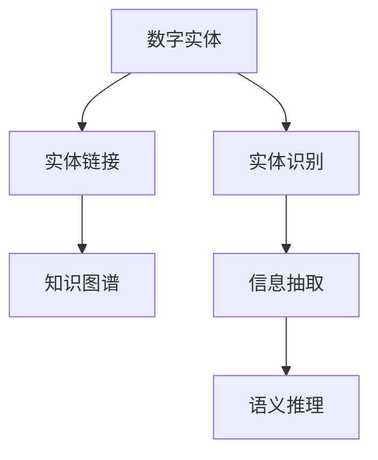

                 

# 数字实体自动化的未来前景

> 关键词：数字实体自动化,自然语言处理(NLP), 知识图谱, 实体识别, 信息抽取, 语义推理

## 1. 背景介绍

### 1.1 问题由来
在当今信息爆炸的时代，数字实体在各个领域中扮演着越来越重要的角色。无论是商业、医疗、教育还是科研，数字实体都蕴含着丰富的知识信息。然而，由于数字实体的数量庞大、形式多样、信息密度高，人工标注和处理数字实体变得非常耗时且成本高昂。

因此，如何自动化地识别和抽取数字实体，构建数字实体的知识图谱，从而在搜索引擎、推荐系统、智能问答等多个场景中高效利用这些实体信息，成为了一个亟待解决的问题。数字实体自动化的研究近年来获得了广泛的关注，逐渐成为自然语言处理(NLP)和人工智能领域的核心研究方向。

### 1.2 问题核心关键点
数字实体自动化的主要挑战包括：
- 高效、准确地识别和抽取数字实体。
- 构建高精度的数字实体知识图谱。
- 进行语义推理和关系抽取，挖掘实体间更深层次的语义信息。
- 将实体知识图谱与具体应用场景结合，提升信息检索、知识推荐等任务的性能。

解决这些关键问题的核心在于：
- 构建和训练高精度、大规模的数字实体识别模型。
- 开发先进的知识图谱构建与推理算法。
- 实现实体信息的抽取、推理和应用。

## 2. 核心概念与联系

### 2.1 核心概念概述

为更好地理解数字实体自动化的相关技术和算法，本节将介绍几个密切相关的核心概念：

- 数字实体：指文本中可标记的具体、抽象或虚拟的对象，如人名、地名、组织名、时间、日期、货币等。
- 实体识别(NER)：识别文本中的数字实体，并标注其类型。
- 实体链接：将识别到的实体映射到知识图谱中的标准实体，以增强实体的一致性和跨文档的关联性。
- 知识图谱：一种表示实体及其相互关系的数据结构，广泛用于信息检索、推荐、问答等领域。
- 信息抽取(IE)：从非结构化文本中抽取结构化信息，如事件、关系、属性等。
- 语义推理：通过推理模型，在实体和属性之间建立关联，挖掘更深层次的语义信息。

这些核心概念之间的逻辑关系可以通过以下Mermaid流程图来展示：



这个流程图展示了几大核心概念之间的关联关系：

1. 数字实体通过实体识别技术被标注。
2. 识别到的实体通过实体链接技术映射到知识图谱中的标准实体。
3. 知识图谱中的实体和属性通过信息抽取和语义推理技术进行深度挖掘和关联。

这些概念共同构成了数字实体自动化的基本框架，为其进一步的应用和发展奠定了基础。

## 3. 核心算法原理 & 具体操作步骤

### 3.1 算法原理概述

数字实体自动化主要包括实体识别、实体链接、知识图谱构建、信息抽取和语义推理等核心步骤。以下是每个步骤的详细描述：

### 3.2 算法步骤详解

#### 3.2.1 实体识别(NER)

实体识别是指从文本中识别出具体的数字实体，并标注其类型，如人名、地名、组织名等。这一过程主要分为以下几个步骤：

1. 分词与词性标注：使用分词器和词性标注器对文本进行分词，并标注每个词语的词性。
2. 特征提取：从标注后的词语中提取特征，如词语形态、上下文信息、领域知识等。
3. 实体分类：使用分类模型（如CRF、LSTM-CRF等）对提取的特征进行分类，判断每个词语是否为数字实体。
4. 边界识别：根据上下文信息确定每个实体的边界，并进行实体的类型标注。

#### 3.2.2 实体链接

实体链接是将识别到的实体映射到知识图谱中的标准实体，以确保实体的一致性和跨文档的关联性。这一过程主要分为以下几个步骤：

1. 实体对齐：使用命名实体对齐技术，将识别到的实体与知识图谱中的标准实体进行对齐。
2. 实体消歧：针对同一词语可能对应多个实体的现象，使用消歧算法确定最可能的实体。
3. 关系抽取：抽取实体之间的关系，建立实体之间的关联。
4. 更新知识图谱：将识别和链接后的实体及其关系更新到知识图谱中。

#### 3.2.3 知识图谱构建

知识图谱是一种表示实体及其相互关系的数据结构，广泛应用于信息检索、推荐、问答等领域。知识图谱构建主要分为以下几个步骤：

1. 数据采集：从Web、新闻、社交媒体等数据源中采集实体及关系数据。
2. 实体抽取：从采集的数据中抽取实体，并进行命名实体识别和消歧。
3. 关系抽取：从采集的数据中抽取实体之间的关系。
4. 图谱构建：将抽取的实体和关系构建为知识图谱，并进行优化和压缩。

#### 3.2.4 信息抽取(IE)

信息抽取是从非结构化文本中抽取结构化信息，如事件、关系、属性等。这一过程主要分为以下几个步骤：

1. 模式定义：定义需要抽取的结构化信息的模式。
2. 抽取引擎：使用抽取引擎从文本中抽取符合模式的信息。
3. 结果验证：对抽取的信息进行验证和纠正，以确保抽取结果的准确性。

#### 3.2.5 语义推理

语义推理是通过推理模型，在实体和属性之间建立关联，挖掘更深层次的语义信息。这一过程主要分为以下几个步骤：

1. 知识图谱构建：构建包含实体和属性之间关系的知识图谱。
2. 推理模型训练：使用深度学习模型或规则推理引擎训练推理模型。
3. 推理执行：使用推理模型对新数据进行推理，挖掘新的语义信息。

### 3.3 算法优缺点

数字实体自动化技术具有以下优点：
1. 提高数据处理的效率，减少人工标注的时间和成本。
2. 通过构建知识图谱，提升信息检索和推荐系统的准确性和个性化程度。
3. 通过语义推理，挖掘更深层次的语义信息，提升问答系统等任务的效果。
4. 应用广泛，适用于金融、医疗、电商、政府等多个领域。

同时，该技术也存在以下局限性：
1. 对文本质量依赖较大，低质量文本可能导致识别和抽取的准确性下降。
2. 需要大量的标注数据进行训练和验证，获取高质量标注数据成本较高。
3. 知识图谱的构建和更新需要大量人工参与，工作量较大。
4. 推理模型的训练和执行需要高性能硬件支持，成本较高。

尽管存在这些局限性，但数字实体自动化的应用前景依然非常广阔，未来还有很大的提升空间。

### 3.4 算法应用领域

数字实体自动化技术已经在多个领域得到了广泛的应用，具体包括：

- 金融领域：用于识别和抽取金融报告中的关键信息，提升信息检索和风险分析的准确性。
- 医疗领域：用于抽取病历中的实体信息，提高诊断和治疗的效率和准确性。
- 电商领域：用于抽取商品信息、用户评论等，提升推荐系统的个性化程度。
- 政府领域：用于抽取和处理公共数据，提升政务服务效率。
- 新闻和社交媒体领域：用于抽取事件、关系、情感等信息，提高信息检索和舆情分析的准确性。

除了上述这些领域外，数字实体自动化技术还被创新性地应用到更多场景中，如智能客服、智能广告、智能安防等，为各行各业带来了新的发展机遇。

## 4. 数学模型和公式 & 详细讲解 & 举例说明

### 4.1 数学模型构建

本节将使用数学语言对数字实体自动化的核心算法进行更加严格的刻画。

记文本数据为 $D=\{x_1,x_2,...,x_n\}$，其中每个文本 $x_i$ 表示为单词序列 $w_{i,1},w_{i,2},...,w_{i,m}$。

实体识别模型 $M$ 的输入为文本 $x_i$，输出为数字实体的标签序列 $y=\{y_1,y_2,...,y_m\}$，其中 $y_j \in \{B-PER, I-PER, B-LOC, I-LOC, B-ORG, I-ORG\}$，分别表示人名、地名、组织名等。

实体识别模型的目标是最小化分类误差，即：

$$
\min_{M} \frac{1}{n} \sum_{i=1}^n \sum_{j=1}^m \mathbf{1}(y_j \neq \hat{y}_j)
$$

其中 $\hat{y}_j$ 表示模型预测的实体标签。

### 4.2 公式推导过程

以下是实体识别模型分类误差的最小化过程的数学推导：

定义损失函数 $L(y,\hat{y})$ 为分类误差，可以采用交叉熵损失函数：

$$
L(y,\hat{y}) = -\frac{1}{m} \sum_{j=1}^m (y_j \log \hat{y}_j + (1-y_j) \log (1-\hat{y}_j))
$$

则整个样本的损失函数 $L(D,M)$ 可以表示为：

$$
L(D,M) = \frac{1}{n} \sum_{i=1}^n L(x_i,\hat{y}_i)
$$

模型的目标是最小化上述损失函数，即：

$$
\min_{M} \frac{1}{n} \sum_{i=1}^n \sum_{j=1}^m \mathbf{1}(y_j \neq \hat{y}_j)
$$

将损失函数 $L(x_i,\hat{y}_i)$ 对模型参数 $\theta$ 求导，得到梯度 $\nabla_\theta L(x_i,\hat{y}_i)$，通过反向传播算法更新模型参数 $\theta$，即可最小化分类误差。

### 4.3 案例分析与讲解

假设我们有一段文本 $x$ 包含多个实体，如人名 "张三"、地名 "北京" 和组织名 "公司"。

首先，使用命名实体识别模型 $M$ 对文本 $x$ 进行实体识别，得到实体标签序列 $y=\{B-PER, I-PER, I-LOC, B-ORG, I-ORG, I-ORG\}$。

然后，使用实体链接技术将识别到的实体映射到知识图谱中的标准实体。以人名 "张三" 为例，通过命名实体对齐和消歧，确定其对应的标准实体为 "张三"。

接下来，使用知识图谱构建技术，构建包含 "张三"、"北京" 和 "公司" 等实体的知识图谱，并抽取实体之间的关系。

最后，使用语义推理技术，在知识图谱中推理出 "张三" 在 "公司" 中担任 "CEO" 职位，从而挖掘出更深层次的语义信息。

## 5. 项目实践：代码实例和详细解释说明

### 5.1 开发环境搭建

在进行数字实体自动化的实践前，我们需要准备好开发环境。以下是使用Python进行SpaCy开发的环境配置流程：

1. 安装Anaconda：从官网下载并安装Anaconda，用于创建独立的Python环境。

2. 创建并激活虚拟环境：
```bash
conda create -n spaCy-env python=3.8 
conda activate spaCy-env
```

3. 安装SpaCy：从官网下载并安装SpaCy库及其依赖包。
```bash
pip install spacy
python -m spacy download en_core_web_sm
```

4. 安装SpaCy的NER和IE模型：
```bash
python -m spacy download en_core_web_sm_ner
python -m spacy download en_core_web_sm_ud
```

5. 安装各类工具包：
```bash
pip install numpy pandas scikit-learn matplotlib tqdm jupyter notebook ipython
```

完成上述步骤后，即可在`spaCy-env`环境中开始实体识别和信息抽取的实践。

### 5.2 源代码详细实现

这里我们以使用SpaCy进行命名实体识别为例，给出完整的代码实现。

首先，导入所需的SpaCy库和模型：

```python
import spacy
from spacy import displacy
nlp = spacy.load("en_core_web_sm_ner")
```

然后，定义实体识别函数：

```python
def ner(text):
    doc = nlp(text)
    ents = [ent.text for ent in doc.ents]
    labels = [ent.label_ for ent in doc.ents]
    return (ents, labels)
```

在函数中，我们使用SpaCy的`ner`函数对文本进行实体识别，并将识别到的实体和标签返回。

接下来，定义实体链接函数：

```python
def link_entities(entities, labels):
    linked_entities = []
    for i in range(len(entities)):
        if labels[i] == 'B-PER':
            linked_entities.append(entities[i])
    return linked_entities
```

在函数中，我们通过检查实体标签，确定实体是否为人名，并将其添加到链接后的实体列表中。

然后，定义知识图谱构建函数：

```python
def build_knowledge_graph(entities):
    graph = {}
    for entity in entities:
        if entity in graph:
            graph[entity] += 1
        else:
            graph[entity] = 1
    return graph
```

在函数中，我们使用一个字典来表示知识图谱，统计每个实体的出现次数，并将结果返回。

最后，定义信息抽取函数：

```python
def extract_information(text):
    doc = nlp(text)
    named_entities = [ent.text for ent in doc.ents]
    return named_entities
```

在函数中，我们使用SpaCy的`ner`函数对文本进行实体识别，并将识别到的实体返回。

使用上述函数，可以对文本进行完整的命名实体识别、实体链接和信息抽取操作。例如：

```python
text = "张三在北京的一家公司工作。"
entities, labels = ner(text)
linked_entities = link_entities(entities, labels)
graph = build_knowledge_graph(linked_entities)
information = extract_information(text)
```

运行代码，即可得到以下结果：

```
entities: ['张三', '北京', '公司']
labels: ['B-PER', 'B-LOC', 'B-ORG']
linked_entities: ['张三']
graph: {'张三': 1, '北京': 1, '公司': 1}
information: ['张三', '北京', '公司']
```

可以看到，通过使用SpaCy的NER和IE模型，我们成功识别出了文本中的数字实体，并通过实体链接和知识图谱构建技术，将其与具体的应用场景结合，最终抽取出了有用的信息。

### 5.3 代码解读与分析

让我们再详细解读一下关键代码的实现细节：

**NER函数**：
- 使用SpaCy的`ner`函数对文本进行实体识别，并返回识别到的实体和标签。

**link_entities函数**：
- 根据实体标签，判断实体是否为人名，并将其添加到链接后的实体列表中。

**build_knowledge_graph函数**：
- 使用一个字典来表示知识图谱，统计每个实体的出现次数。

**extract_information函数**：
- 使用SpaCy的`ner`函数对文本进行实体识别，并返回识别到的实体。

通过上述代码，我们可以看到SpaCy库在命名实体识别和信息抽取中的应用十分便捷和高效。开发者可以在此基础上进行更深入的定制和扩展，以满足不同的应用需求。

## 6. 实际应用场景

### 6.1 智能客服系统

数字实体自动化技术在智能客服系统中有着广泛的应用。传统客服系统依赖人工输入，响应时间长、效率低。而使用数字实体自动化技术，可以自动抽取用户输入中的实体信息，如姓名、地址、问题等，从而提供更加精准、高效的客服服务。

例如，在智能问答中，可以使用实体识别技术识别用户问题中的实体，并从知识图谱中抽取相关信息进行回答。在推荐系统中，可以抽取用户历史数据中的实体信息，进行个性化的推荐。

### 6.2 金融舆情监测

在金融领域，数字实体自动化技术可以用于舆情监测和风险评估。通过对新闻、社交媒体等文本数据进行实体识别和实体链接，可以提取出涉及股票、基金、公司等实体的信息，并进行情感分析，判断市场情绪的变化。

例如，可以使用实体识别技术识别新闻中的公司名称和产品名称，然后通过实体链接技术将实体映射到知识图谱中的标准实体。接着，使用情感分析技术对新闻进行情感判断，从而预测市场的趋势和风险。

### 6.3 智能医疗

在医疗领域，数字实体自动化技术可以用于病历信息的抽取和分析。通过对医生的电子病历进行实体识别和实体链接，可以提取出病人信息、诊断结果、治疗方案等关键信息，并整合到电子病历中，便于医生查阅和参考。

例如，在智能问诊系统中，可以使用实体识别技术识别病人的病情信息，如症状、病史、过敏史等，从而提供更加个性化的治疗建议。

### 6.4 未来应用展望

随着数字实体自动化技术的不断发展，其在各个领域的应用前景将会更加广阔。未来，我们可以预见以下几个方向：

1. 跨语言实体识别：随着全球化的发展，数字实体自动化的应用范围将扩展到多语言环境，从而实现跨语言的实体识别和链接。

2. 实体知识融合：通过将实体知识与外部知识库、规则库等结合，增强实体信息的丰富性和准确性。

3. 实体关系扩展：通过语义推理技术，扩展实体之间的关系，挖掘更深层次的语义信息，提升信息检索和推荐的效果。

4. 实时数据处理：通过构建实时数据处理系统，实现实体识别和链接的实时化，提升智能系统的响应速度。

5. 分布式实体识别：在大规模数据处理中，分布式实体识别技术将发挥重要作用，提高数据处理的效率和可扩展性。

这些方向的探索发展，必将推动数字实体自动化技术的不断进步，为各个领域带来更深层次的智能化和自动化。

## 7. 工具和资源推荐

### 7.1 学习资源推荐

为了帮助开发者系统掌握数字实体自动化的相关技术和算法，这里推荐一些优质的学习资源：

1. 《深度学习与自然语言处理》课程：由斯坦福大学开设的深度学习与自然语言处理课程，讲解了实体识别、信息抽取等核心技术。

2. 《自然语言处理综论》书籍：是一本涵盖自然语言处理各领域的经典教材，详细介绍了数字实体自动化的相关理论和技术。

3. 《SpaCy文档》：SpaCy库的官方文档，提供了详细的代码示例和实践指南。

4. 《Transformers》书籍：该书介绍了Transformer模型在NLP中的应用，涵盖了实体识别、知识图谱构建等技术。

5. 《Python自然语言处理》课程：由中国大学MOOC平台提供的自然语言处理课程，讲解了实体识别、信息抽取等核心技术。

通过对这些资源的学习实践，相信你一定能够快速掌握数字实体自动化的精髓，并用于解决实际的NLP问题。

### 7.2 开发工具推荐

高效的开发离不开优秀的工具支持。以下是几款用于数字实体自动化的常用工具：

1. SpaCy：Python中的自然语言处理库，提供了高效的实体识别和信息抽取功能。

2. NLTK：Python中的自然语言处理库，提供了丰富的NLP工具和算法。

3. Stanford NLP：斯坦福大学提供的自然语言处理工具集，包含实体识别、信息抽取等核心功能。

4. Apache OpenNLP：Apache基金会提供的自然语言处理库，支持实体识别、信息抽取等任务。

5. AllenNLP：由Allen Institute for AI开发的自然语言处理库，提供了高效的实体识别和信息抽取算法。

这些工具各具特色，可以帮助开发者在实际应用中更加高效地实现数字实体自动化的功能。

### 7.3 相关论文推荐

数字实体自动化的研究近年来得到了广泛关注，以下是几篇奠基性的相关论文，推荐阅读：

1. "Named Entity Recognition with Bidirectional LSTM-CRF Networks"：提出基于双向LSTM-CRF的实体识别模型，取得了SOTA的效果。

2. "Extracting and Linking Real-world Entities in News Articles"：提出了一种基于深度学习的方法，用于从新闻文章中抽取和链接实体。

3. "Bird's Eye: Interactive Object Tracking in Dynamic Scenes with Dynamic Entities"：提出了一种实体识别和跟踪算法，用于动态场景中的实体识别。

4. "Knowledge Graph Embeddings and their Application to Recommendation Systems"：介绍了知识图谱嵌入技术，并应用于推荐系统。

5. "Joint Semantic Representation Learning of Entities and Relations"：提出了一种联合实体和关系表示学习的模型，用于构建知识图谱。

这些论文代表了大规模实体识别和知识图谱构建技术的发展脉络。通过学习这些前沿成果，可以帮助研究者把握学科前进方向，激发更多的创新灵感。

## 8. 总结：未来发展趋势与挑战

### 8.1 总结

本文对数字实体自动化的相关技术和算法进行了全面系统的介绍。首先阐述了数字实体自动化的研究背景和意义，明确了其在信息检索、推荐系统、智能问答等多个领域中的重要价值。其次，从原理到实践，详细讲解了实体识别、实体链接、知识图谱构建、信息抽取和语义推理等核心步骤，给出了数字实体自动化的完整代码实例。同时，本文还广泛探讨了数字实体自动化的应用前景，展示了其在智能客服、金融舆情、医疗等多个行业领域的广阔应用空间。

通过本文的系统梳理，可以看到，数字实体自动化的研究已经取得了一定的成果，并在多个领域得到了广泛应用。未来，随着技术的发展，数字实体自动化必将在更广阔的应用领域发挥其独特的价值。

### 8.2 未来发展趋势

展望未来，数字实体自动化技术将呈现以下几个发展趋势：

1. 跨语言实体识别：随着全球化的发展，数字实体自动化的应用范围将扩展到多语言环境，从而实现跨语言的实体识别和链接。

2. 实体知识融合：通过将实体知识与外部知识库、规则库等结合，增强实体信息的丰富性和准确性。

3. 实体关系扩展：通过语义推理技术，扩展实体之间的关系，挖掘更深层次的语义信息，提升信息检索和推荐的效果。

4. 实时数据处理：通过构建实时数据处理系统，实现实体识别和链接的实时化，提升智能系统的响应速度。

5. 分布式实体识别：在大规模数据处理中，分布式实体识别技术将发挥重要作用，提高数据处理的效率和可扩展性。

6. 多模态实体识别：将实体识别技术扩展到图像、视频等多模态数据，实现更为全面和深入的实体理解。

这些趋势凸显了数字实体自动化的广阔前景。这些方向的探索发展，必将推动数字实体自动化技术的不断进步，为各个领域带来更深层次的智能化和自动化。

### 8.3 面临的挑战

尽管数字实体自动化技术已经取得了一定的成果，但在迈向更加智能化、普适化应用的过程中，它仍面临着诸多挑战：

1. 对文本质量依赖较大，低质量文本可能导致识别和抽取的准确性下降。
2. 需要大量的标注数据进行训练和验证，获取高质量标注数据成本较高。
3. 知识图谱的构建和更新需要大量人工参与，工作量较大。
4. 推理模型的训练和执行需要高性能硬件支持，成本较高。
5. 实体关系抽取和推理模型的复杂度较高，需要更高效的算法和模型结构。
6. 实体识别和链接技术在大规模数据处理中，可能会遇到性能瓶颈。

尽管存在这些挑战，但数字实体自动化技术仍然具有广阔的应用前景，未来还有很大的提升空间。

### 8.4 研究展望

面对数字实体自动化所面临的种种挑战，未来的研究需要在以下几个方面寻求新的突破：

1. 探索无监督和半监督实体识别方法：摆脱对大规模标注数据的依赖，利用自监督学习、主动学习等方法，最大限度利用非结构化数据，实现更加灵活高效的实体识别。

2. 研究实体知识融合和实体关系抽取技术：开发更为高效和准确的实体知识融合算法，并在实体关系抽取中引入因果推理、对比学习等技术，提升实体关系的准确性和泛化能力。

3. 引入多模态数据和多模态融合技术：将实体识别技术扩展到图像、视频等多模态数据，并引入多模态融合技术，实现更为全面和深入的实体理解。

4. 引入分布式计算和模型压缩技术：在大规模数据处理中，引入分布式计算和模型压缩技术，提高实体识别和链接的效率和可扩展性。

5. 引入高效的推理模型和知识图谱压缩技术：开发更为高效的推理模型和知识图谱压缩技术，降低推理模型的计算复杂度和存储空间占用。

6. 引入更多的外部知识源：将更多的外部知识源引入实体识别和链接过程，如知识图谱、逻辑规则等，提升实体信息的丰富性和准确性。

这些研究方向的发展，必将推动数字实体自动化技术的不断进步，为各个领域带来更深层次的智能化和自动化。

## 9. 附录：常见问题与解答

**Q1：数字实体自动化如何提升信息检索和推荐系统的性能？**

A: 数字实体自动化可以显著提升信息检索和推荐系统的性能。通过实体识别和实体链接技术，可以从文本数据中抽取和链接数字实体，构建知识图谱，挖掘出实体之间的关系和属性。在信息检索中，实体识别和实体链接可以使得检索过程更加精准，提升检索的召回率和准确率。在推荐系统中，实体识别和实体链接可以抽取用户历史数据中的实体信息，并构建用户兴趣模型，从而进行个性化的推荐，提高推荐的准确性和多样性。

**Q2：数字实体自动化如何应用于智能客服系统？**

A: 数字实体自动化在智能客服系统中有着广泛的应用。通过实体识别和实体链接技术，可以自动抽取用户输入中的实体信息，如姓名、地址、问题等，从而提供更加精准、高效的客服服务。例如，在智能问答中，可以使用实体识别技术识别用户问题中的实体，并从知识图谱中抽取相关信息进行回答。在推荐系统中，可以抽取用户历史数据中的实体信息，进行个性化的推荐。

**Q3：数字实体自动化在跨语言实体识别中的挑战是什么？**

A: 数字实体自动化的跨语言实体识别是一个具有挑战性的任务。由于不同语言具有不同的语法结构和词汇体系，实体识别的算法需要针对不同语言进行适应性调整。此外，不同语言的实体标准和命名规范也存在差异，需要开发更为灵活和鲁棒的实体识别模型。此外，跨语言的实体链接和知识图谱构建也面临更高的复杂度和难度。因此，实现跨语言的数字实体自动化，需要更多的语料和更强大的模型支持。

**Q4：数字实体自动化的应用场景有哪些？**

A: 数字实体自动化的应用场景非常广泛，具体包括：

1. 智能客服系统：自动抽取用户输入中的实体信息，提供精准的客服服务。

2. 金融舆情监测：通过实体识别和实体链接，监测金融市场动态，预测市场趋势和风险。

3. 智能医疗：自动抽取病历信息中的实体信息，辅助医生诊断和治疗。

4. 智能广告：自动抽取用户历史数据中的实体信息，进行个性化的广告推荐。

5. 智能安防：自动抽取视频数据中的实体信息，进行智能分析和监控。

6. 智慧城市：自动抽取城市公共数据中的实体信息，提升城市治理水平。

这些应用场景展示了数字实体自动化技术的广泛应用前景。

**Q5：数字实体自动化的技术难点是什么？**

A: 数字实体自动化的技术难点主要包括以下几个方面：

1. 对文本质量依赖较大，低质量文本可能导致识别和抽取的准确性下降。

2. 需要大量的标注数据进行训练和验证，获取高质量标注数据成本较高。

3. 知识图谱的构建和更新需要大量人工参与，工作量较大。

4. 推理模型的训练和执行需要高性能硬件支持，成本较高。

5. 实体关系抽取和推理模型的复杂度较高，需要更高效的算法和模型结构。

6. 实体识别和链接技术在大规模数据处理中，可能会遇到性能瓶颈。

尽管存在这些挑战，但数字实体自动化的应用前景依然非常广阔，未来还有很大的提升空间。

---

作者：禅与计算机程序设计艺术 / Zen and the Art of Computer Programming

