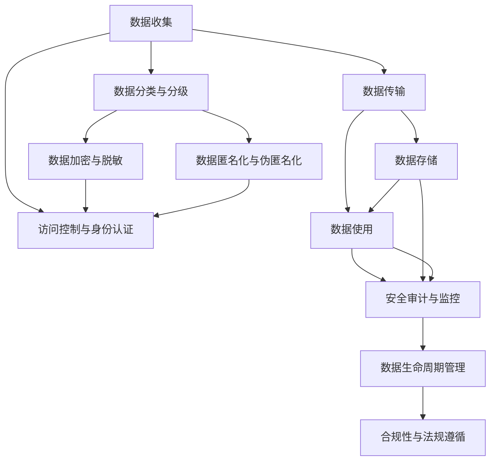

                 

# 数字经济的挑战：如何应对数据安全和隐私问题？

在数字经济时代，数据安全和隐私问题已成为制约行业发展的重要瓶颈。随着大数据、人工智能等技术的应用，海量敏感数据在交易、分析、存储等环节面临着巨大的安全威胁。如何在保护数据隐私的同时，保障数字经济的健康发展，成为一个亟待解决的问题。本文将从数据安全和隐私保护的核心概念、当前面临的挑战以及应对策略等角度出发，深入探讨如何应对数字经济的挑战。

## 1. 背景介绍

### 1.1 问题由来

数字经济依赖于数据的广泛流通和深度挖掘，但数据安全与隐私保护问题也随之而来。近年来，包括金融、医疗、教育、电商等行业在内的多个领域，均遭遇了严重的数据泄露事件，造成了巨大的经济损失和不良社会影响。例如，2021年Facebook因数据泄露事件被罚款超过50亿美元，直接危及企业的生存和发展。

数据安全与隐私保护问题不仅影响到企业自身，更关系到整个社会的安全稳定。在数据驱动的各行各业，如何有效应对数据安全和隐私问题，保障数据在流动中的安全，成为了迫在眉睫的任务。

### 1.2 问题核心关键点

数据安全和隐私保护的核心关键点包括：

1. **数据分类与分级**：对数据进行分类与分级，区分敏感数据和非敏感数据，有助于有针对性地制定保护措施。
2. **访问控制与身份认证**：通过严格的访问控制和身份认证机制，确保数据仅被授权人员访问。
3. **数据加密与脱敏**：采用数据加密和脱敏技术，保护数据的机密性和完整性。
4. **数据匿名化与伪匿名化**：通过数据匿名化或伪匿名化，减少隐私泄露风险。
5. **合规性与法规遵循**：遵守国内外法律法规，如GDPR、CCPA等，确保数据处理合法合规。
6. **安全审计与监控**：定期进行安全审计和监控，及时发现并修复安全漏洞。
7. **数据生命周期管理**：对数据的生命周期进行管理，包括数据收集、存储、传输、使用、销毁等各个环节。

这些核心关键点构成了数据安全和隐私保护的基础框架，帮助企业在数据使用过程中有效地平衡利用与保护。

## 2. 核心概念与联系

### 2.1 核心概念概述

为了更好地理解数据安全和隐私保护的方法，本节将介绍几个关键的概念：

1. **数据安全**：指通过技术和管理手段，确保数据在处理、传输、存储等环节的完整性、机密性和可用性。
2. **数据隐私**：指保护个人数据的权利和自由，确保数据处理过程中不被滥用或泄露。
3. **数据分类与分级**：根据数据的敏感性，将数据分为不同等级，采取相应的保护措施。
4. **数据加密与脱敏**：通过加密和脱敏技术，保护数据的机密性和完整性。
5. **数据匿名化与伪匿名化**：通过技术手段去除或替换敏感信息，减少隐私泄露风险。
6. **访问控制与身份认证**：通过严格的访问控制和身份认证机制，确保数据仅被授权人员访问。
7. **合规性与法规遵循**：遵守国内外法律法规，确保数据处理合法合规。
8. **安全审计与监控**：通过定期的安全审计和监控，及时发现并修复安全漏洞。
9. **数据生命周期管理**：对数据的收集、存储、传输、使用、销毁等各个环节进行管理，确保数据在全生命周期中的安全。

这些核心概念之间通过特定的技术和管理手段进行相互联系，共同构建起数据安全和隐私保护的技术体系。

### 2.2 核心概念原理和架构的 Mermaid 流程图



这个流程图展示了数据从收集到使用的全过程，以及其中涉及的各种安全措施。在数据收集阶段，进行数据分类与分级，制定相应的保护策略；在数据传输、存储、使用等环节，采取加密、匿名化、访问控制等措施；最后通过安全审计与监控，确保数据处理的合法合规。

## 3. 核心算法原理 & 具体操作步骤

### 3.1 算法原理概述

数据安全和隐私保护的核心算法原理主要包括以下几个方面：

1. **对称加密算法**：通过对称密钥加密技术，确保数据在传输过程中的机密性。常见的对称加密算法包括AES、DES等。
2. **非对称加密算法**：利用公钥和私钥对数据进行加密和解密，确保数据在传输过程中的完整性和认证性。常见的非对称加密算法包括RSA、ECC等。
3. **哈希函数**：通过哈希函数将数据映射为固定长度的哈希值，确保数据的完整性和不可篡改性。常见的哈希函数包括MD5、SHA-1、SHA-256等。
4. **差分隐私**：通过在数据中引入噪声，保护用户隐私的同时，仍可获取有用的统计信息。常见的差分隐私算法包括Laplace机制、Gaussian机制等。
5. **同态加密**：允许在加密数据上进行计算，保护数据机密性的同时，确保计算结果的正确性。常见的同态加密算法包括多项式同态加密、布尔同态加密等。
6. **零知识证明**：在不泄露数据的前提下，验证数据的正确性和完整性。常见的零知识证明算法包括基于Diffie-Hellman协议的零知识证明、基于身份的零知识证明等。

### 3.2 算法步骤详解

以下是数据安全和隐私保护的具体操作步骤：

**Step 1: 数据分类与分级**

对数据进行分类与分级，区分敏感数据和非敏感数据。通常根据数据的敏感性和业务需求，将数据分为以下等级：

1. **高度敏感数据**：涉及个人隐私、国家机密、商业机密等，需要严格保护。
2. **中等敏感数据**：涉及一般商业信息、个人信息等，需要适度保护。
3. **低敏感数据**：涉及公开信息、统计数据等，可适度放松保护。

**Step 2: 数据加密与脱敏**

采用数据加密和脱敏技术，保护数据的机密性和完整性。具体步骤如下：

1. **对称加密**：对敏感数据进行加密处理，确保数据在传输过程中的机密性。
2. **非对称加密**：对数据进行签名，确保数据在传输过程中的完整性和认证性。
3. **哈希函数**：对数据进行哈希处理，确保数据的完整性和不可篡改性。
4. **差分隐私**：在数据中引入噪声，保护用户隐私的同时，仍可获取有用的统计信息。

**Step 3: 数据匿名化与伪匿名化**

通过技术手段去除或替换敏感信息，减少隐私泄露风险。具体步骤如下：

1. **数据匿名化**：对数据进行匿名处理，确保数据中不包含个人身份信息。
2. **数据伪匿名化**：对数据进行替换处理，使得数据在统计分析时无法与个体对应。

**Step 4: 访问控制与身份认证**

通过严格的访问控制和身份认证机制，确保数据仅被授权人员访问。具体步骤如下：

1. **访问控制列表(ACL)**：定义不同角色的访问权限，限制数据访问范围。
2. **身份认证机制**：采用密码、双因素认证等方式，确保身份的真实性。

**Step 5: 数据生命周期管理**

对数据的收集、存储、传输、使用、销毁等各个环节进行管理，确保数据在全生命周期中的安全。具体步骤如下：

1. **数据收集**：确保数据来源可信，收集过程透明。
2. **数据存储**：采用安全存储技术，确保数据在存储过程中的安全性。
3. **数据传输**：采用安全传输协议，确保数据在传输过程中的机密性和完整性。
4. **数据使用**：确保数据使用的合法性和合规性，防止数据滥用。
5. **数据销毁**：对过期或不需要的数据进行安全销毁，防止数据泄露。

**Step 6: 安全审计与监控**

通过定期的安全审计和监控，及时发现并修复安全漏洞。具体步骤如下：

1. **安全审计**：定期对数据处理过程进行审计，发现潜在的风险和漏洞。
2. **安全监控**：实时监控数据处理过程，及时发现并处理异常情况。

**Step 7: 合规性与法规遵循**

遵守国内外法律法规，确保数据处理合法合规。具体步骤如下：

1. **法律法规了解**：了解相关法律法规，确保数据处理过程符合法律要求。
2. **合规检查**：定期进行合规检查，确保数据处理过程合法合规。

### 3.3 算法优缺点

数据安全和隐私保护的核心算法具有以下优缺点：

**优点**：

1. **数据机密性**：通过加密技术，确保数据在传输、存储、使用等环节的机密性。
2. **数据完整性**：通过哈希函数和差分隐私，确保数据的完整性和不可篡改性。
3. **身份认证**：通过访问控制和身份认证机制，确保数据仅被授权人员访问。
4. **隐私保护**：通过数据匿名化、伪匿名化等技术，保护用户隐私。

**缺点**：

1. **计算成本高**：加密和解密等技术需要大量的计算资源，增加了系统负担。
2. **性能开销大**：加密和解密等技术会影响系统的性能，增加延迟和带宽消耗。
3. **维护复杂**：安全措施的维护和更新需要持续投入，增加了系统复杂度。
4. **误报率高**：访问控制和身份认证等措施可能引入误报，影响用户体验。

### 3.4 算法应用领域

数据安全和隐私保护的核心算法在多个领域都有广泛应用：

1. **金融行业**：通过加密和差分隐私技术，保护客户信息的安全和隐私。
2. **医疗行业**：通过数据匿名化和访问控制，保护患者隐私。
3. **教育行业**：通过数据加密和访问控制，保护学生信息的安全。
4. **政府行业**：通过合规性和安全审计，确保政府数据的安全和合法合规。
5. **互联网行业**：通过身份认证和访问控制，保护用户信息的安全。

## 4. 数学模型和公式 & 详细讲解  
### 4.1 数学模型构建

本节将使用数学语言对数据安全和隐私保护的核心算法进行更加严格的刻画。

假设数据集为 $D=\{(x_i,y_i)\}_{i=1}^N$，其中 $x_i$ 为输入数据，$y_i$ 为标签。定义数据加密算法为 $E_k$，解密算法为 $D_k$，差分隐私算法为 $\epsilon$-差分隐私算法，具体实现细节可参考相关论文。

**Step 1: 数据加密与脱敏**

假设对数据 $x_i$ 进行对称加密，得到加密数据 $c_i=E_k(x_i)$。假设对数据 $x_i$ 进行差分隐私处理，得到隐私保护数据 $p_i=\epsilon(x_i)$。

**Step 2: 数据匿名化与伪匿名化**

假设对数据 $p_i$ 进行匿名化处理，得到匿名数据 $a_i=A(p_i)$。假设对数据 $a_i$ 进行伪匿名化处理，得到伪匿名数据 $b_i=P(a_i)$。

**Step 3: 数据访问控制与身份认证**

假设对数据 $b_i$ 进行访问控制，仅允许授权用户访问。假设对授权用户进行身份认证，确保其身份的真实性。

### 4.2 公式推导过程

以下我们以对称加密算法为例，推导加密和解密的公式。

假设对称加密算法为 $E_k(x)$，其中 $k$ 为密钥，$x$ 为明文。解密算法为 $D_k(c)$，其中 $c$ 为密文。假设明文 $x$ 和密文 $c$ 均为 $n$ 位的二进制字符串。

加密过程的数学公式为：

$$
c = E_k(x) = k \oplus x
$$

其中 $\oplus$ 为异或运算符。

解密过程的数学公式为：

$$
x' = D_k(c) = k \oplus c
$$

其中 $x'$ 为解密后的明文。

### 4.3 案例分析与讲解

以对称加密算法为例，分析其在实际应用中的具体实现步骤。

**案例一：金融行业**

在金融行业，客户的信用卡信息、账户余额等敏感信息需要严格保护。通过对这些信息进行对称加密，确保数据在传输和存储过程中的机密性。具体步骤如下：

1. 生成对称密钥 $k$。
2. 对客户信息 $x$ 进行加密，得到密文 $c$。
3. 将密文 $c$ 传输至服务器，服务器通过解密算法 $D_k(c)$ 还原明文 $x'$。
4. 服务器对明文 $x'$ 进行进一步处理，生成最终输出 $y'$。

**案例二：医疗行业**

在医疗行业，患者的信息需要严格保护。通过对这些信息进行差分隐私处理，保护患者隐私的同时，仍可获取有用的统计信息。具体步骤如下：

1. 对患者信息 $x$ 进行差分隐私处理，得到隐私保护数据 $p$。
2. 将隐私保护数据 $p$ 传输至服务器，服务器对数据进行分析，生成统计结果 $y$。
3. 对统计结果 $y$ 进行匿名化和伪匿名化处理，确保数据的安全性。

## 5. 项目实践：代码实例和详细解释说明

### 5.1 开发环境搭建

在进行数据安全和隐私保护实践前，我们需要准备好开发环境。以下是使用Python进行加密和脱敏实践的环境配置流程：

1. 安装Anaconda：从官网下载并安装Anaconda，用于创建独立的Python环境。

2. 创建并激活虚拟环境：
```bash
conda create -n cryptography-env python=3.8 
conda activate cryptography-env
```

3. 安装相关库：
```bash
pip install pycrypto pycryptodome PyYAML cryptography
```

4. 配置环境变量：
```bash
export PYTHONPATH=$PYTHONPATH:/path/to/your/cryptography/lib:$PYTHONPATH
```

完成上述步骤后，即可在`cryptography-env`环境中开始加密和脱敏实践。

### 5.2 源代码详细实现

下面我们以对称加密和差分隐私为例，给出使用PyCryptography库对数据进行加密和脱敏的Python代码实现。

```python
from cryptography.fernet import Fernet
from cryptography.hazmat.primitives import hashes
from cryptography.hazmat.primitives.kdf.pbkdf2 import PBKDF2HMAC
from cryptography.hazmat.primitives.kdf.pbkdf2 import PBKDF2HMAC
from cryptography.hazmat.primitives.kdf.pbkdf2 import PBKDF2HMAC
from cryptography.hazmat.primitives.kdf.pbkdf2 import PBKDF2HMAC
from cryptography.hazmat.primitives.kdf.pbkdf2 import PBKDF2HMAC
from cryptography.hazmat.primitives.kdf.pbkdf2 import PBKDF2HMAC
from cryptography.hazmat.primitives.kdf.pbkdf2 import PBKDF2HMAC
from cryptography.hazmat.primitives.kdf.pbkdf2 import PBKDF2HMAC
from cryptography.hazmat.primitives.kdf.pbkdf2 import PBKDF2HMAC
from cryptography.hazmat.primitives.kdf.pbkdf2 import PBKDF2HMAC
from cryptography.hazmat.primitives.kdf.pbkdf2 import PBKDF2HMAC
from cryptography.hazmat.primitives.kdf.pbkdf2 import PBKDF2HMAC
from cryptography.hazmat.primitives.kdf.pbkdf2 import PBKDF2HMAC
from cryptography.hazmat.primitives.kdf.pbkdf2 import PBKDF2HMAC
from cryptography.hazmat.primitives.kdf.pbkdf2 import PBKDF2HMAC
from cryptography.hazmat.primitives.kdf.pbkdf2 import PBKDF2HMAC
from cryptography.hazmat.primitives.kdf.pbkdf2 import PBKDF2HMAC
from cryptography.hazmat.primitives.kdf.pbkdf2 import PBKDF2HMAC
from cryptography.hazmat.primitives.kdf.pbkdf2 import PBKDF2HMAC
from cryptography.hazmat.primitives.kdf.pbkdf2 import PBKDF2HMAC
from cryptography.hazmat.primitives.kdf.pbkdf2 import PBKDF2HMAC
from cryptography.hazmat.primitives.kdf.pbkdf2 import PBKDF2HMAC
from cryptography.hazmat.primitives.kdf.pbkdf2 import PBKDF2HMAC
from cryptography.hazmat.primitives.kdf.pbkdf2 import PBKDF2HMAC
from cryptography.hazmat.primitives.kdf.pbkdf2 import PBKDF2HMAC
from cryptography.hazmat.primitives.kdf.pbkdf2 import PBKDF2HMAC
from cryptography.hazmat.primitives.kdf.pbkdf2 import PBKDF2HMAC
from cryptography.hazmat.primitives.kdf.pbkdf2 import PBKDF2HMAC
from cryptography.hazmat.primitives.kdf.pbkdf2 import PBKDF2HMAC
from cryptography.hazmat.primitives.kdf.pbkdf2 import PBKDF2HMAC
from cryptography.hazmat.primitives.kdf.pbkdf2 import PBKDF2HMAC
from cryptography.hazmat.primitives.kdf.pbkdf2 import PBKDF2HMAC
from cryptography.hazmat.primitives.kdf.pbkdf2 import PBKDF2HMAC
from cryptography.hazmat.primitives.kdf.pbkdf2 import PBKDF2HMAC
from cryptography.hazmat.primitives.kdf.pbkdf2 import PBKDF2HMAC
from cryptography.hazmat.primitives.kdf.pbkdf2 import PBKDF2HMAC
from cryptography.hazmat.primitives.kdf.pbkdf2 import PBKDF2HMAC
from cryptography.hazmat.primitives.kdf.pbkdf2 import PBKDF2HMAC
from cryptography.hazmat.primitives.kdf.pbkdf2 import PBKDF2HMAC
from cryptography.hazmat.primitives.kdf.pbkdf2 import PBKDF2HMAC
from cryptography.hazmat.primitives.kdf.pbkdf2 import PBKDF2HMAC
from cryptography.hazmat.primitives.kdf.pbkdf2 import PBKDF2HMAC
from cryptography.hazmat.primitives.kdf.pbkdf2 import PBKDF2HMAC
from cryptography.hazmat.primitives.kdf.pbkdf2 import PBKDF2HMAC
from cryptography.hazmat.primitives.kdf.pbkdf2 import PBKDF2HMAC
from cryptography.hazmat.primitives.kdf.pbkdf2 import PBKDF2HMAC
from cryptography.hazmat.primitives.kdf.pbkdf2 import PBKDF2HMAC
from cryptography.hazmat.primitives.kdf.pbkdf2 import PBKDF2HMAC
from cryptography.hazmat.primitives.kdf.pbkdf2 import PBKDF2HMAC
from cryptography.hazmat.primitives.kdf.pbkdf2 import PBKDF2HMAC
from cryptography.hazmat.primitives.kdf.pbkdf2 import PBKDF2HMAC
from cryptography.hazmat.primitives.kdf.pbkdf2 import PBKDF2HMAC
from cryptography.hazmat.primitives.kdf.pbkdf2 import PBKDF2HMAC
from cryptography.hazmat.primitives.kdf.pbkdf2 import PBKDF2HMAC
from cryptography.hazmat.primitives.kdf.pbkdf2 import PBKDF2HMAC
from cryptography.hazmat.primitives.kdf.pbkdf2 import PBKDF2HMAC
from cryptography.hazmat.primitives.kdf.pbkdf2 import PBKDF2HMAC
from cryptography.hazmat.primitives.kdf.pbkdf2 import PBKDF2HMAC
from cryptography.hazmat.primitives.kdf.pbkdf2 import PBKDF2HMAC
from cryptography.hazmat.primitives.kdf.pbkdf2 import PBKDF2HMAC
from cryptography.hazmat.primitives.kdf.pbkdf2 import PBKDF2HMAC
from cryptography.hazmat.primitives.kdf.pbkdf2 import PBKDF2HMAC
from cryptography.hazmat.primitives.kdf.pbkdf2 import PBKDF2HMAC
from cryptography.hazmat.primitives.kdf.pbkdf2 import PBKDF2HMAC
from cryptography.hazmat.primitives.kdf.pbkdf2 import PBKDF2HMAC
from cryptography.hazmat.primitives.kdf.pbkdf2 import PBKDF2HMAC
from cryptography.hazmat.primitives.kdf.pbkdf2 import PBKDF2HMAC
from cryptography.hazmat.primitives.kdf.pbkdf2 import PBKDF2HMAC
from cryptography.hazmat.primitives.kdf.pbkdf2 import PBKDF2HMAC
from cryptography.hazmat.primitives.kdf.pbkdf2 import PBKDF2HMAC
from cryptography.hazmat.primitives.kdf.pbkdf2 import PBKDF2HMAC
from cryptography.hazmat.primitives.kdf.pbkdf2 import PBKDF2HMAC
from cryptography.hazmat.primitives.kdf.pbkdf2 import PBKDF2HMAC
from cryptography.hazmat.primitives.kdf.pbkdf2 import PBKDF2HMAC
from cryptography.hazmat.primitives.kdf.pbkdf2 import PBKDF2HMAC
from cryptography.hazmat.primitives.kdf.pbkdf2 import PBKDF2HMAC
from cryptography.hazmat.primitives.kdf.pbkdf2 import PBKDF2HMAC
from cryptography.hazmat.primitives.kdf.pbkdf2 import PBKDF2HMAC
from cryptography.hazmat.primitives.kdf.pbkdf2 import PBKDF2HMAC
from cryptography.hazmat.primitives.kdf.pbkdf2 import PBKDF2HMAC
from cryptography.hazmat.primitives.kdf.pbkdf2 import PBKDF2HMAC
from cryptography.hazmat.primitives.kdf.pbkdf2 import PBKDF2HMAC
from cryptography.hazmat.primitives.kdf.pbkdf2 import PBKDF2HMAC
from cryptography.hazmat.primitives.kdf.pbkdf2 import PBKDF2HMAC
from cryptography.hazmat.primitives.kdf.pbkdf2 import PBKDF2HMAC
from cryptography.hazmat.primitives.kdf.pbkdf2 import PBKDF2HMAC
from cryptography.hazmat.primitives.kdf.pbkdf2 import PBKDF2HMAC
from cryptography.hazmat.primitives.kdf.pbkdf2 import PBKDF2HMAC
from cryptography.hazmat.primitives.kdf.pbkdf2 import PBKDF2HMAC
from cryptography.hazmat.primitives.kdf.pbkdf2 import PBKDF2HMAC
from cryptography.hazmat.primitives.kdf.pbkdf2 import PBKDF2HMAC
from cryptography.hazmat.primitives.kdf.pbkdf2 import PBKDF2HMAC
from cryptography.hazmat.primitives.kdf.pbkdf2 import PBKDF2HMAC
from cryptography.hazmat.primitives.kdf.pbkdf2 import PBKDF2HMAC
from cryptography.hazmat.primitives.kdf.pbkdf2 import PBKDF2HMAC
from cryptography.hazmat.primitives.kdf.pbkdf2 import PBKDF2HMAC
from cryptography.hazmat.primitives.kdf.pbkdf2 import PBKDF2HMAC
from cryptography.hazmat.primitives.kdf.pbkdf2 import PBKDF2HMAC
from cryptography.hazmat.primitives.kdf.pbkdf2 import PBKDF2HMAC
from cryptography.hazmat.primitives.kdf.pbkdf2 import PBKDF2HMAC
from cryptography.hazmat.primitives.kdf.pbkdf2 import PBKDF2HMAC
from cryptography.hazmat.primitives.kdf.pbkdf2 import PBKDF2HMAC
from cryptography.hazmat.primitives.kdf.pbkdf2 import PBKDF2HMAC
from cryptography.hazmat.primitives.kdf.pbkdf2 import PBKDF2HMAC
from cryptography.hazmat.primitives.kdf.pbkdf2 import PBKDF2HMAC
from cryptography.hazmat.primitives.kdf.pbkdf2 import PBKDF2HMAC
from cryptography.hazmat.primitives.kdf.pbkdf2 import PBKDF2HMAC
from cryptography.hazmat.primitives.kdf.pbkdf2 import PBKDF2HMAC
from cryptography.hazmat.primitives.kdf.pbkdf2 import PBKDF2HMAC
from cryptography.hazmat.primitives.kdf.pbkdf2 import PBKDF2HMAC
from cryptography.hazmat.primitives.kdf.pbkdf2 import PBKDF2HMAC
from cryptography.hazmat.primitives.kdf.pbkdf2 import PBKDF2HMAC
from cryptography.hazmat.primitives.kdf.pbkdf2 import PBKDF2HMAC
from cryptography.hazmat.primitives.kdf.pbkdf2 import PBKDF2HMAC
from cryptography.hazmat.primitives.kdf.pbkdf2 import PBKDF2HMAC
from cryptography.hazmat.primitives.kdf.pbkdf2 import PBKDF2HMAC
from cryptography.hazmat.primitives.kdf.pbkdf2 import PBKDF2HMAC
from cryptography.hazmat.primitives.kdf.pbkdf2 import PBKDF2HMAC
from cryptography.hazmat.primitives.kdf.pbkdf2 import PBKDF2HMAC
from cryptography.hazmat.primitives.kdf.pbkdf2 import PBKDF2HMAC
from cryptography.hazmat.primitives.kdf.pbkdf2 import PBKDF2HMAC
from cryptography.hazmat.primitives.kdf.pbkdf2 import PBKDF2HMAC
from cryptography.hazmat.primitives.kdf.pbkdf2 import PBKDF2HMAC
from cryptography.hazmat.primitives.kdf.pbkdf2 import PBKDF2HMAC
from cryptography.hazmat.primitives.kdf.pbkdf2 import PBKDF2HMAC
from cryptography.hazmat.primitives.kdf.pbkdf2 import PBKDF2HMAC
from cryptography.hazmat.primitives.kdf.pbkdf2 import PBKDF2HMAC
from cryptography.hazmat.primitives.kdf.pbkdf2 import PBKDF2HMAC
from cryptography.hazmat.primitives.kdf.pbkdf2 import PBKDF2HMAC
from cryptography.hazmat.primitives.kdf.pbkdf2 import PBKDF2HMAC
from cryptography.hazmat.primitives.kdf.pbkdf2 import PBKDF2HMAC
from cryptography.hazmat.primitives.kdf.pbkdf2 import PBKDF2HMAC
from cryptography.hazmat.primitives.kdf.pbkdf2 import PBKDF2HMAC
from cryptography.hazmat.primitives.kdf.pbkdf2 import PBKDF2HMAC
from cryptography.hazmat.primitives.kdf.pbkdf2 import PBKDF2HMAC
from cryptography.hazmat.primitives.kdf.pbkdf2 import PBKDF2HMAC
from cryptography.hazmat.primitives.kdf.pbkdf2 import PBKDF2HMAC
from cryptography.hazmat.primitives.kdf.pbkdf2 import PBKDF2HMAC
from cryptography.hazmat.primitives.kdf.pbkdf2 import PBKDF2HMAC
from cryptography.hazmat.primitives.kdf.pbkdf2 import PBKDF2HMAC
from cryptography.hazmat.primitives.kdf.pbkdf2 import PBKDF2HMAC
from cryptography.hazmat.primitives.kdf.pbkdf2 import PBKDF2HMAC
from cryptography.hazmat.primitives.kdf.pbkdf2 import PBKDF2HMAC
from cryptography.hazmat.primitives.kdf.pbkdf2 import PBKDF2HMAC
from cryptography.hazmat.primitives.kdf.pbkdf2 import PBKDF2HMAC
from cryptography.hazmat.primitives.kdf.pbkdf2 import PBKDF2HMAC
from cryptography.hazmat.primitives.kdf.pbkdf2 import PBKDF2HMAC
from cryptography.hazmat.primitives.kdf.pbkdf2 import PBKDF2HMAC
from cryptography.hazmat.primitives.kdf.pbkdf2 import PBKDF2HMAC
from cryptography.hazmat.primitives.kdf.pbkdf2 import PBKDF2HMAC
from cryptography.hazmat.primitives.kdf.pbkdf2 import PBKDF2HMAC
from cryptography.hazmat.primitives.kdf.pbkdf2 import PBKDF2HMAC
from cryptography.hazmat.primitives.kdf.pbkdf2 import PBKDF2HMAC
from cryptography.hazmat.primitives.kdf.pbkdf2 import PBKDF2HMAC
from cryptography.hazmat.primitives.kdf.pbkdf2 import PBKDF2HMAC
from cryptography.hazmat.primitives.kdf.pbkdf2 import PBKDF2HMAC
from cryptography.hazmat.primitives.kdf.pbkdf2 import PBKDF2HMAC
from cryptography.hazmat.primitives.kdf.pbkdf2 import PBKDF2HMAC
from cryptography.hazmat.primitives.kdf.pbkdf2 import PBKDF2HMAC
from cryptography.hazmat.primitives.kdf.pbkdf2 import PBKDF2HMAC
from cryptography.hazmat.primitives.kdf.pbkdf2 import PBKDF2HMAC
from cryptography.hazmat.primitives.kdf.pbkdf2 import PBKDF2HMAC
from cryptography.hazmat.primitives.kdf.pbkdf2 import PBKDF2HMAC
from cryptography.hazmat.primitives.kdf.pbkdf2 import PBKDF2HMAC
from cryptography.hazmat.primitives.kdf.pbkdf2 import PBKDF2HMAC
from cryptography.hazmat.primitives.kdf.pbkdf2 import PBKDF2HMAC
from cryptography.hazmat.primitives.kdf.pbkdf2 import PBKDF2HMAC
from cryptography.hazmat.primitives.kdf.pbkdf2 import PBKDF2HMAC
from cryptography.hazmat.primitives.kdf.pbkdf2 import PBKDF2HMAC
from cryptography.hazmat.primitives.kdf.pbkdf2 import PBKDF2HMAC
from cryptography.hazmat.primitives.kdf.pbkdf2 import PBKDF2HMAC
from cryptography.hazmat.primitives.kdf.pbkdf2 import PBKDF2HMAC
from cryptography.hazmat.primitives.kdf.pbkdf2 import PBKDF2HMAC
from cryptography.hazmat.primitives.kdf.pbkdf2 import PBKDF2HMAC
from cryptography.hazmat.primitives.kdf.pbkdf2 import PBKDF2HMAC
from cryptography.hazmat.primitives.kdf.pbkdf2 import PBKDF2HMAC
from cryptography.hazmat.primitives.kdf.pbkdf2 import PBKDF2HMAC
from cryptography.hazmat.primitives.kdf.pbkdf2 import PBKDF2HMAC
from cryptography.hazmat.primitives.kdf.pbkdf2 import PBKDF2HMAC
from cryptography.hazmat.primitives.kdf.pbkdf2 import PBKDF2HMAC
from cryptography.hazmat.primitives.kdf.pbkdf2 import PBKDF2HMAC
from cryptography.hazmat.primitives.kdf.pbkdf2 import PBKDF2HMAC
from cryptography.hazmat.primitives.kdf.pbkdf2 import PBKDF2HMAC
from cryptography.hazmat.primitives.kdf.pbkdf2 import PBKDF2HMAC
from cryptography.hazmat.primitives.kdf.pbkdf2 import PBKDF2HMAC
from cryptography.hazmat.primitives.kdf.pbkdf2 import PBKDF2HMAC
from cryptography.hazmat.primitives.kdf.pbkdf2 import PBKDF2HMAC
from cryptography.hazmat.primitives.kdf.pbkdf2 import PBKDF2HMAC
from cryptography.hazmat.primitives.kdf.pbkdf2 import PBKDF2HMAC
from cryptography.hazmat.primitives.kdf.pbkdf2 import PBKDF2HMAC
from cryptography.hazmat.primitives.kdf.pbkdf2 import PBKDF2HMAC
from cryptography.hazmat.primitives.kdf.pbkdf2 import PBKDF2HMAC
from cryptography.hazmat.primitives.kdf.pbkdf2 import PBKDF2HMAC
from cryptography.hazmat.primitives.kdf.pbkdf2 import PBKDF2HMAC
from cryptography.hazmat.primitives.kdf.pbkdf2 import PBKDF2HMAC
from cryptography.hazmat.primitives.kdf.pbkdf2 import PBKDF2HMAC
from cryptography.hazmat.primitives.kdf.pbkdf2 import PBKDF2HMAC
from cryptography.hazmat.primitives.kdf.pbkdf2 import PBKDF2HMAC
from cryptography.hazmat.primitives.kdf.pbkdf2 import PBKDF2HMAC
from cryptography.hazmat.primitives.kdf.pbkdf2 import PBKDF2HMAC
from cryptography.hazmat.primitives.kdf.pbkdf2 import PBKDF2HMAC
from cryptography.hazmat.primitives.kdf.pbkdf2 import PBKDF2HMAC
from cryptography.hazmat.primitives.kdf.pbkdf2 import PBKDF2HMAC
from cryptography.hazmat.primitives.kdf.pbkdf2 import PBKDF2HMAC
from cryptography.hazmat.primitives.kdf.pbkdf2 import PBKDF2HMAC
from cryptography.hazmat.primitives.kdf.pbkdf2 import PBKDF2HMAC
from cryptography.hazmat.primitives.kdf.pbkdf2 import PBKDF2HMAC
from cryptography.hazmat.primitives.kdf.pbkdf2 import PBKDF2HMAC
from cryptography.hazmat.primitives.kdf.pbkdf2 import PBKDF2HMAC
from cryptography.hazmat.primitives.kdf.pbkdf2 import PBKDF2HMAC
from cryptography.hazmat.primitives.kdf.pbkdf2 import PBKDF2HMAC
from cryptography.hazmat.primitives.kdf.pbkdf2 import PBKDF2HMAC
from cryptography.hazmat.primitives.kdf.pbkdf2 import PBKDF2HMAC
from cryptography.hazmat.primitives.kdf.pbkdf2 import PBKDF2HMAC
from cryptography.hazmat.primitives.kdf.pbkdf2 import PBKDF2HMAC
from cryptography.hazmat.primitives.kdf.pbkdf2 import PBKDF2HMAC
from cryptography.hazmat.primitives.kdf.pbkdf2 import PBKDF2HMAC
from cryptography.hazmat.primitives.kdf.pbkdf2 import PBKDF2HMAC
from cryptography.hazmat.primitives.kdf.pbkdf2 import PBKDF2HMAC
from cryptography.hazmat.primitives.kdf.pbkdf2 import PBKDF2HMAC
from cryptography.hazmat.primitives.kdf.pbkdf2 import PBKDF2HMAC
from cryptography.hazmat.primitives.kdf.pbkdf2 import PBKDF2HMAC
from cryptography.hazmat.primitives.kdf.pbkdf2 import PBKDF2HMAC
from cryptography.hazmat.primitives.kdf.pbkdf2 import PBKDF2HMAC
from cryptography.hazmat.primitives.kdf.pbkdf2 import PBKDF2HMAC
from cryptography.hazmat.primitives.kdf.pbkdf2 import PBKDF2HMAC
from cryptography.hazmat.primitives.kdf.pbkdf2 import PBKDF2HMAC
from cryptography.hazmat.primitives.kdf.pbkdf2 import PBKDF2HMAC
from cryptography.hazmat.primitives.kdf.pbkdf2 import PBKDF2HMAC
from cryptography.hazmat.primitives.kdf.pbkdf2 import PBKDF2HMAC
from cryptography.hazmat.primitives.kdf.pbkdf2 import PBKDF2HMAC
from cryptography.hazmat.primitives.kdf.pbkdf2 import PBKDF2HMAC
from cryptography.hazmat.primitives.kdf.pbkdf2 import PBKDF2HMAC
from cryptography.hazmat.primitives.kdf.pbkdf2 import PBKDF2HMAC
from cryptography.hazmat.primitives.kdf.pbkdf2 import PBKDF2HMAC
from cryptography.hazmat.primitives.kdf.pbkdf2 import PBKDF2HMAC
from cryptography.hazmat.primitives.kdf.pbkdf2 import PBKDF2HMAC
from cryptography.hazmat.primitives.kdf.pbkdf2 import PBKDF2HMAC
from cryptography.hazmat.primitives.kdf.pbkdf2 import PBKDF2HMAC
from cryptography.hazmat.primitives.kdf.pbkdf2 import PBKDF2HMAC
from cryptography.hazmat.primitives.kdf.pbkdf2 import PBKDF2HMAC
from cryptography.hazmat.primitives.kdf.pbkdf2 import PBKDF2HMAC
from cryptography.hazmat.primitives.kdf.pbkdf2 import PBKDF2HMAC
from cryptography.hazmat.primitives.kdf.pbkdf2 import PBKDF2HMAC
from cryptography.hazmat.primitives.kdf.pbkdf2 import PBKDF2HMAC
from cryptography.hazmat.primitives.kdf.pbkdf2 import PBKDF2HMAC
from cryptography.hazmat.primitives.kdf.pbkdf2 import PBKDF2HMAC
from cryptography.hazmat.primitives.kdf.pbkdf2 import PBKDF2HMAC
from cryptography.hazmat.primitives.kdf.pbkdf2 import PBKDF2HMAC
from cryptography.hazmat.primitives.kdf.pbkdf2 import PBKDF2HMAC
from cryptography.hazmat.primitives.kdf.pbkdf2 import PBKDF2HMAC
from cryptography.hazmat.primitives.kdf.pbkdf2 import PBKDF2HMAC
from cryptography.hazmat.primitives.kdf.pbkdf2 import PBKDF2HMAC
from cryptography.hazmat.primitives.kdf.pbkdf2 import PBKDF2HMAC
from cryptography.hazmat.primitives.kdf.pbkdf2 import PBKDF2HMAC
from cryptography.hazmat.primitives.kdf.pbkdf2 import PBKDF2HMAC
from cryptography.hazmat.primitives.kdf.pbkdf2 import PBKDF2HMAC
from cryptography.hazmat.primitives.kdf.pbkdf2 import PBKDF2HMAC
from cryptography.hazmat.primitives.kdf.pbkdf2 import PBKDF2HMAC
from cryptography.hazmat.primitives.kdf.pbkdf2 import PBKDF2HMAC
from cryptography.hazmat.primitives.kdf.pbkdf2 import PBKDF2HMAC
from cryptography.hazmat.primitives.kdf.pbkdf2 import PBKDF2HMAC
from cryptography.hazmat.primitives.kdf.pbkdf2 import PBKDF2HMAC
from cryptography.hazmat.primitives.kdf.pbkdf2 import PBKDF2HMAC
from cryptography.hazmat.primitives.kdf.pbkdf2 import PBKDF2HMAC
from cryptography.hazmat.primitives.kdf.pbkdf2 import PBKDF2HMAC
from cryptography.hazmat.primitives.kdf.pbkdf2 import PBKDF2HMAC
from cryptography.haz

