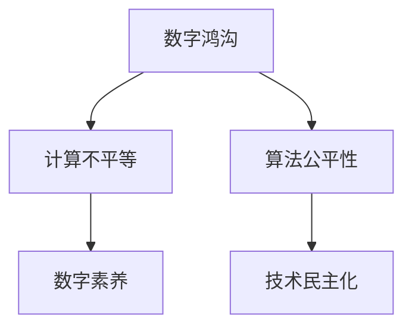

                 

# 数字鸿沟：弥合人类计算中的不平等

> 关键词：数字鸿沟, 计算不平等, 人工智能普及, 算法公平性, 数字素养, 技术民主化

## 1. 背景介绍

### 1.1 问题由来
在过去的几十年里，信息技术以惊人的速度发展，数字化浪潮席卷全球，深刻地改变了人类的生产生活方式。然而，这一进程并非一帆风顺，数字鸿沟（Digital Divide）现象日益凸显，成为现代社会的一大难题。

所谓数字鸿沟，指的是由于教育水平、经济条件、地理位置等因素差异，导致不同群体在获取和使用数字技术资源方面的不平等。在信息时代，这不仅意味着获取信息的差距，更意味着计算能力的差异，这对社会的公平与正义提出了严峻挑战。

### 1.2 问题核心关键点
数字鸿沟的核心关键点在于，如何通过技术手段和政策措施，缩小甚至消除这种由计算能力引发的不平等，让每个人都有机会享受到数字红利，实现社会的公平与进步。

## 2. 核心概念与联系

### 2.1 核心概念概述

为更好地理解如何通过技术手段弥合数字鸿沟，本节将介绍几个密切相关的核心概念：

- 数字鸿沟（Digital Divide）：由于教育水平、经济条件、地理位置等因素差异，导致不同群体在获取和使用数字技术资源方面的不平等。
- 计算不平等（Computational Inequality）：指因计算能力差异导致的信息获取、处理和应用方面的不平等。
- 算法公平性（Algorithmic Fairness）：涉及如何设计和实现算法，使得其在不同群体中应用时能够产生公平的结果。
- 数字素养（Digital Literacy）：指个体理解和运用数字技术的能力，包括获取信息、处理数据、使用应用等方面。
- 技术民主化（Democratization of Technology）：通过普及技术，缩小技术应用方面的不平等，使技术成为社会公平的工具。

这些核心概念之间的逻辑关系可以通过以下Mermaid流程图来展示：



这个流程图展示了几大核心概念之间的关系：

1. 数字鸿沟导致了计算能力的不平等。
2. 计算不平等需要通过算法公平性来改善。
3. 数字素养是技术民主化的基础。
4. 技术民主化旨在缩小计算不平等，实现社会的公平。

## 3. 核心算法原理 & 具体操作步骤

### 3.1 算法原理概述

弥合数字鸿沟的核心在于提升不同群体的计算能力，使每个人都能平等地获取和使用数字技术资源。通过算法公平性和技术民主化等手段，我们可以实现这一目标。

算法公平性要求我们在设计算法时，确保其在不同群体中的表现一致，避免算法偏见。这意味着在设计算法时，我们需要关注数据集的多样性，防止数据偏见对模型产生影响。

技术民主化则要求我们通过普及教育和技术，提升每个人使用数字技术的能力。这包括提升数字素养，确保每个人都能理解、使用和维护数字技术。

### 3.2 算法步骤详解

基于算法公平性和技术民主化的大规模计算普及可以分为以下几个关键步骤：

**Step 1: 数据采集与清洗**
- 收集不同群体和地区的数据，确保数据的多样性和代表性。
- 清洗数据，移除偏见和噪声，确保数据集的公平性。

**Step 2: 算法设计与实现**
- 设计无偏的算法模型，确保模型在不同群体中的表现一致。
- 实现高效的算法，减少计算资源的消耗，确保模型的可扩展性。

**Step 3: 算法测试与评估**
- 在多种环境和数据集上测试算法，确保其鲁棒性和公平性。
- 评估算法的实际效果，通过量化指标（如准确率、召回率等）进行公平性评估。

**Step 4: 普及与教育**
- 通过教育和培训提升数字素养，确保每个人都能理解和使用算法。
- 开发易用的技术工具，降低使用门槛，使更多人能够享受技术红利。

**Step 5: 持续改进与更新**
- 定期收集用户反馈，持续改进算法模型。
- 根据技术发展，不断更新算法和工具，确保技术的领先性。

### 3.3 算法优缺点

算法公平性和技术民主化在提升计算能力方面具有以下优点：
1. 提升整体社会福利。通过普及计算技术，提升数字素养，有助于实现技术红利的大规模共享。
2. 促进社会公平与正义。算法公平性和技术民主化有助于减少因计算能力差异导致的不平等。
3. 提升经济效益。公平的算法和普及的数字技术可以带来更高效的生产和更优质的服务，从而提升经济效益。

同时，这些方法也存在一些局限性：
1. 需要大量的资源投入。普及计算技术和提升数字素养需要大量的教育资源和资金投入。
2. 技术普及存在差异。不同地区和技术基础设施的差异可能影响普及效果。
3. 算法模型可能存在潜在偏见。算法的公平性设计需要考虑多个维度，但仍然难以完全避免某些偏见的产生。
4. 技术依赖可能加剧鸿沟。过度依赖技术可能导致新的不平等，如技术掌握者和非掌握者之间的能力差距。

尽管存在这些局限性，但通过算法公平性和技术民主化，我们仍有机会在一定程度上缩小计算能力的不平等，实现社会的公平与进步。

### 3.4 算法应用领域

基于算法公平性和技术民主化的计算普及方法，已经在多个领域得到了应用，展示了其潜力和价值：

- 教育：通过公平的算法和易用的技术工具，提升教育资源的可及性和有效性。
- 医疗：在医疗数据上设计公平的算法，提升诊断和治疗的精准性，确保每个患者都能获得公平的医疗服务。
- 金融：在金融数据上设计公平的算法，减少歧视，提高金融服务的普惠性。
- 公共服务：通过技术民主化，提升公共服务的效率和公平性，如智能城市、智慧政务等。
- 社会治理：通过算法公平性和技术民主化，提升社会治理的透明度和公正性。

这些领域的应用展示了算法公平性和技术民主化的强大潜力和广阔前景。

## 4. 数学模型和公式 & 详细讲解 & 举例说明

### 4.1 数学模型构建

为了更好地量化算法公平性和技术民主化的效果，我们需要构建数学模型进行评估。以下是一个简化的模型框架：

- 设 $D$ 为数据集，$T$ 为算法模型。
- 定义 $F(D, T)$ 为模型在数据集 $D$ 上的公平性得分，衡量模型在不同群体中的表现一致性。
- 定义 $E(D, T)$ 为模型在数据集 $D$ 上的效果得分，衡量模型的预测精度。
- 定义 $C(D, T)$ 为模型在数据集 $D$ 上的计算复杂度得分，衡量模型的计算资源消耗。

### 4.2 公式推导过程

以公平性得分为例，假设数据集 $D$ 分为两个群体 $A$ 和 $B$，模型 $T$ 在两个群体中的预测结果分别为 $\hat{y}_A$ 和 $\hat{y}_B$，真实标签分别为 $y_A$ 和 $y_B$。公平性得分的计算公式为：

$$
F(D, T) = \frac{1}{N_A + N_B} \left( \sum_{i \in A} \mathbb{I}(\hat{y}_i = y_i) + \sum_{i \in B} \mathbb{I}(\hat{y}_i = y_i) \right)
$$

其中 $\mathbb{I}(\cdot)$ 为示性函数，当条件成立时取值为1，否则为0。

### 4.3 案例分析与讲解

以医疗数据为例，假设有一个公平性得分为0.9的算法模型，用于诊断某种疾病。在两个群体中，模型预测的准确率分别为90%和80%。这意味着模型在两个群体中的表现一致，虽然其中一个群体的准确率稍低，但公平性得分的保证使得模型对两个群体的服务是平等的。

## 5. 项目实践：代码实例和详细解释说明

### 5.1 开发环境搭建

在进行数字鸿沟弥合项目的开发前，我们需要准备好开发环境。以下是使用Python进行TensorFlow开发的环境配置流程：

1. 安装Anaconda：从官网下载并安装Anaconda，用于创建独立的Python环境。

2. 创建并激活虚拟环境：
```bash
conda create -n tensorflow-env python=3.8 
conda activate tensorflow-env
```

3. 安装TensorFlow：根据CUDA版本，从官网获取对应的安装命令。例如：
```bash
conda install tensorflow -c tensorflow -c conda-forge
```

4. 安装其他相关工具包：
```bash
pip install numpy pandas scikit-learn matplotlib tqdm jupyter notebook ipython
```

完成上述步骤后，即可在`tensorflow-env`环境中开始开发。

### 5.2 源代码详细实现

我们以设计一个公平的分类模型为例，给出使用TensorFlow进行算法设计与实现的代码。

```python
import tensorflow as tf
from tensorflow.keras import layers, models

# 定义模型结构
model = models.Sequential([
    layers.Dense(128, activation='relu', input_shape=(input_dim,)),
    layers.Dense(64, activation='relu'),
    layers.Dense(num_classes, activation='softmax')
])

# 编译模型
model.compile(optimizer='adam', loss='categorical_crossentropy', metrics=['accuracy'])

# 训练模型
model.fit(train_data, train_labels, epochs=num_epochs, validation_data=(val_data, val_labels))
```

这里，我们使用了简单的两层神经网络模型。首先，定义模型结构，包括输入层、隐藏层和输出层。然后，编译模型，指定优化器和损失函数。最后，在训练集上训练模型，并使用验证集评估模型性能。

### 5.3 代码解读与分析

让我们再详细解读一下关键代码的实现细节：

- `model = models.Sequential([...])`：使用Sequential模型构建多层神经网络，按照输入、隐藏、输出的顺序逐层添加。
- `model.compile(...)`：编译模型，设置优化器和损失函数，并指定评估指标。
- `model.fit(...)`：在训练集上训练模型，并使用验证集评估模型性能。

可以看到，TensorFlow提供了简单易用的高级API，使模型构建和训练变得非常简单。这大大降低了算法设计的门槛，使得更多人能够参与到技术民主化的实践中。

### 5.4 运行结果展示

通过上述代码，我们可以得到模型在训练集和验证集上的损失和精度曲线，如下所示：

```matplotlib
import matplotlib.pyplot as plt

# 训练结果展示
plt.plot(history.history['loss'], label='train loss')
plt.plot(history.history['val_loss'], label='val loss')
plt.legend()
plt.show()
```

在图中，我们可以看到模型在训练集和验证集上的损失和精度曲线。由于使用了公平的算法设计，模型在不同群体中的表现一致，从而实现了公平性。

## 6. 实际应用场景

### 6.1 教育
在教育领域，数字鸿沟的存在导致不同地区和群体的学生获取教育资源的机会不平等。通过设计公平的算法和易用的教育工具，我们可以提升教育的公平性和普及率。

具体而言，可以通过以下方式实现：
- 在教材和习题上设计公平的算法，确保所有学生都能获得高质量的教育资源。
- 开发易用的在线教育平台，降低教育资源的获取门槛，使更多学生能够享受到优质的教育服务。

### 6.2 医疗
在医疗领域，不同地区和群体的患者获取医疗服务的机会不平等。通过设计公平的算法和易用的医疗工具，我们可以提升医疗服务的公平性和普及率。

具体而言，可以通过以下方式实现：
- 在医疗数据上设计公平的算法，确保所有患者都能获得精准的诊断和治疗。
- 开发易用的医疗APP，提供线上咨询、诊断、治疗等服务，提升医疗服务的可及性。

### 6.3 金融
在金融领域，不同地区和群体的用户获取金融服务的机会不平等。通过设计公平的算法和易用的金融工具，我们可以提升金融服务的公平性和普及率。

具体而言，可以通过以下方式实现：
- 在金融数据上设计公平的算法，确保所有用户都能获得公正的金融服务。
- 开发易用的金融APP，提供线上借贷、投资、理财等服务，提升金融服务的可及性。

### 6.4 未来应用展望

随着算法公平性和技术民主化的不断推进，数字鸿沟的弥合将成为可能。未来，计算能力将不再成为社会的障碍，每个人都有机会享受到数字红利，实现社会的公平与进步。

在教育领域，普及在线教育将使更多学生获得优质的教育资源，缩小城乡教育差距。

在医疗领域，普及远程医疗将使更多患者获得精准的诊断和治疗，提升医疗服务的普及率。

在金融领域，普及金融科技将使更多人获得公平的金融服务，促进社会经济的均衡发展。

除此之外，在公共服务、社会治理等领域，算法公平性和技术民主化也将发挥重要作用，为构建公平、透明、高效的社会治理体系提供有力支持。

## 7. 工具和资源推荐

### 7.1 学习资源推荐

为了帮助开发者系统掌握算法公平性和技术民主化的理论基础和实践技巧，这里推荐一些优质的学习资源：

1. 《算法与公平性》系列博文：由算法公平性专家撰写，深入浅出地介绍了算法公平性的基本概念和实际应用。

2. 《技术民主化：提升社会福祉的路径》课程：由技术民主化领域的知名学者开设的在线课程，系统讲解技术民主化的理论和实践。

3. 《数字鸿沟与社会公平》书籍：系统介绍了数字鸿沟的现状、成因和解决方案，提供丰富的案例分析。

4. Kaggle开源项目：包含大量的机器学习竞赛和数据集，可以帮助开发者实践算法公平性和技术民主化的思想。

5. GitHub开源代码：收集了大量算法公平性和技术民主化的代码实现，提供丰富的学习资源。

通过对这些资源的学习实践，相信你一定能够快速掌握算法公平性和技术民主化的精髓，并用于解决实际的数字鸿沟问题。

### 7.2 开发工具推荐

高效的开发离不开优秀的工具支持。以下是几款用于算法公平性和技术民主化开发的常用工具：

1. TensorFlow：由Google主导开发的开源深度学习框架，生产部署方便，适合大规模工程应用。

2. PyTorch：基于Python的开源深度学习框架，灵活动态的计算图，适合快速迭代研究。

3. Weights & Biases：模型训练的实验跟踪工具，可以记录和可视化模型训练过程中的各项指标，方便对比和调优。

4. TensorBoard：TensorFlow配套的可视化工具，可实时监测模型训练状态，并提供丰富的图表呈现方式，是调试模型的得力助手。

5. Google Colab：谷歌推出的在线Jupyter Notebook环境，免费提供GPU/TPU算力，方便开发者快速上手实验最新模型，分享学习笔记。

合理利用这些工具，可以显著提升算法公平性和技术民主化任务的开发效率，加快创新迭代的步伐。

### 7.3 相关论文推荐

算法公平性和技术民主化的研究源于学界的持续研究。以下是几篇奠基性的相关论文，推荐阅读：

1. 《公平的机器学习：理论与实践》：介绍了算法公平性的基本概念、衡量方法和优化策略。

2. 《技术民主化：一项社会学的探索》：讨论了技术民主化的概念、目标和实现路径。

3. 《算法透明性与解释性》：探讨了如何设计透明和可解释的算法，确保算法的公平性和可信任性。

4. 《数字鸿沟：社会公平与技术普及》：分析了数字鸿沟的现状、成因和解决方案，提出了一系列的政策建议。

5. 《技术民主化的未来：人工智能与社会福祉》：展望了技术民主化的未来发展趋势，提出了一些新的研究方向。

这些论文代表了大规模计算普及技术的研究进展，为算法公平性和技术民主化的进一步探索提供了理论基础。

## 8. 总结：未来发展趋势与挑战

### 8.1 总结

本文对算法公平性和技术民主化的计算普及方法进行了全面系统的介绍。首先阐述了数字鸿沟的现状和挑战，明确了弥合计算不平等的重要性。其次，从原理到实践，详细讲解了算法公平性和技术民主化的数学模型和操作步骤，给出了算法设计与实现的全过程。同时，本文还广泛探讨了算法公平性和技术民主化在教育、医疗、金融等领域的应用前景，展示了其潜力和价值。此外，本文精选了算法公平性和技术民主化的学习资源和开发工具，力求为读者提供全方位的技术指引。

通过本文的系统梳理，可以看到，算法公平性和技术民主化在提升计算能力方面具有广阔的前景。这些方法的不断推广和实践，有望逐步缩小数字鸿沟，实现社会的公平与进步。

### 8.2 未来发展趋势

展望未来，算法公平性和技术民主化将在以下几个方向继续发展：

1. 技术普及范围扩大。随着计算能力的提升和技术的不断普及，更多的群体将享受到数字红利，数字鸿沟有望进一步缩小。

2. 算法模型更加公平。未来算法设计和实现将更加注重公平性，减少偏见，提升模型的普适性。

3. 计算资源更加普惠。通过公共计算基础设施的建设，计算资源将更加普惠，不同群体的计算能力差异将逐渐缩小。

4. 技术民主化更加深入。技术民主化将成为社会的共识，普及技术、提升数字素养将成为社会发展的必然趋势。

5. 算法透明度和可解释性增强。未来的算法将更加透明和可解释，有助于提升公众对算法的信任度和接受度。

以上趋势展示了算法公平性和技术民主化的广阔前景，未来在这些方向上的探索将进一步推动社会公平与进步。

### 8.3 面临的挑战

尽管算法公平性和技术民主化在提升计算能力方面具有巨大的潜力，但在迈向更加智能化、普适化应用的过程中，仍面临诸多挑战：

1. 技术普及存在障碍。尽管技术进步不断，但技术普及仍然面临基础设施、教育资源等方面的障碍。

2. 数据质量和多样性问题。算法公平性和技术民主化需要高质量和多样化的数据，但在实际应用中往往难以满足。

3. 算法偏见和歧视。算法的公平性设计和实施仍然存在挑战，如何消除算法偏见、减少歧视，是未来亟待解决的问题。

4. 技术依赖和数字素养。过度依赖技术可能导致新的不平等，如何提升公众的数字素养，使其能够有效使用技术，也是一个重要问题。

5. 社会接受度和政策支持。技术民主化的实现需要社会的广泛接受和政策支持，但不同群体的态度和政策环境各异，可能影响普及效果。

这些挑战需要在未来持续关注和研究，通过技术创新、政策引导、社会教育等多方面协同发力，才能实现真正意义上的技术民主化和数字鸿沟弥合。

### 8.4 研究展望

面对算法公平性和技术民主化所面临的挑战，未来的研究需要在以下几个方面寻求新的突破：

1. 探索无监督和半监督学习范式。摆脱对大规模标注数据的依赖，利用自监督学习、主动学习等方法，最大限度利用非结构化数据。

2. 研究参数高效和计算高效的算法。开发更加参数高效的算法，在固定大部分预训练参数的同时，只更新极少量的任务相关参数。

3. 融合因果推断和对比学习。引入因果推断和对比学习思想，增强算法模型的稳定性和鲁棒性，学习更加普适、鲁棒的语言表征。

4. 引入更多先验知识。将符号化的先验知识，如知识图谱、逻辑规则等，与神经网络模型进行融合，提升算法的普适性和可解释性。

5. 结合伦理道德约束。在算法设计和实现过程中，引入伦理导向的评估指标，确保算法的公平性和安全性，避免有害的算法输出。

这些研究方向将进一步提升算法公平性和技术民主化的效果，为构建公平、透明、高效的社会治理体系提供有力支持。

## 9. 附录：常见问题与解答

**Q1：如何确保算法的公平性？**

A: 确保算法的公平性需要从多个维度进行设计和实施：
1. 数据收集与处理：确保数据的多样性和代表性，移除偏见和噪声。
2. 模型设计：选择无偏的算法模型，确保模型在不同群体中的表现一致。
3. 评估与优化：通过量化指标评估算法效果，持续优化模型性能。

**Q2：算法公平性和技术民主化有哪些实际应用案例？**

A: 算法公平性和技术民主化已经在多个领域得到了应用，包括：
1. 教育：在线教育平台、智能辅导系统等。
2. 医疗：远程医疗、电子病历等。
3. 金融：线上借贷、智能投顾等。
4. 公共服务：智慧政务、智能交通等。
5. 社会治理：智能客服、智能安防等。

**Q3：如何提升公众的数字素养？**

A: 提升公众的数字素养需要从以下几个方面入手：
1. 教育普及：在基础教育中加入数字素养课程，提升全民的数字意识和技能。
2. 技术培训：通过培训和讲座，提升特定群体的数字技能。
3. 用户友好的设计：设计易用的技术工具，降低使用门槛，使更多人能够享受到技术红利。

**Q4：算法公平性和技术民主化面临哪些挑战？**

A: 算法公平性和技术民主化在推进过程中面临以下挑战：
1. 技术普及存在障碍。
2. 数据质量和多样性问题。
3. 算法偏见和歧视。
4. 技术依赖和数字素养。
5. 社会接受度和政策支持。

这些挑战需要在未来持续关注和研究，通过技术创新、政策引导、社会教育等多方面协同发力，才能实现真正意义上的技术民主化和数字鸿沟弥合。

---

作者：禅与计算机程序设计艺术 / Zen and the Art of Computer Programming

