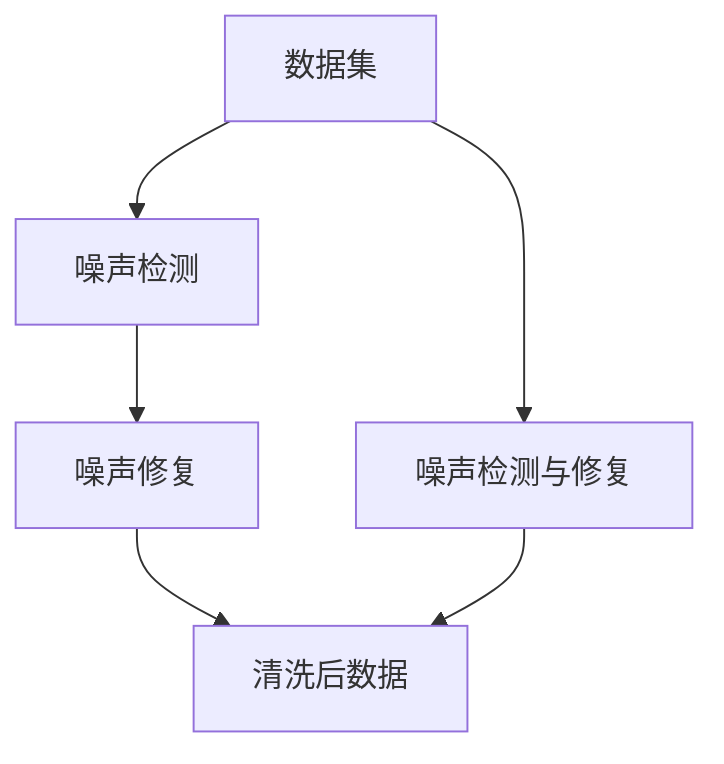

                 

## 1. 背景介绍

在现实世界中，数据噪声是不可避免的。数据噪声通常表现为错误标签、缺失值、异常值、重复数据等。这些问题不仅会导致模型训练效果差，还会在生产环境中部署时引发各种意料之外的问题。为了应对数据噪声，数据清洗成为机器学习工作中不可或缺的一环。然而，现有的数据清洗工具大多聚焦于基于规则的清洗，而无法有效处理数据中的异常情况，甚至在处理错误数据时，反而导致数据的进一步污染。

为了解决这一问题，我们引入了cleanlab库，它是一种基于贝叶斯优化算法的自适应数据清洗工具。cleanlab不仅能够检测数据噪声，还可以自动给出噪声数据的修复方案，从而最大限度地提升数据质量，进而提升模型的性能和稳定性。

## 2. 核心概念与联系

### 2.1 核心概念概述

在介绍cleanlab的基本原理前，我们先介绍几个核心的概念：

- **数据噪声(Data Noise)**：指在数据集中存在的不符合真实分布的数据，如错误标签、异常值等，会对模型训练产生负面影响。
- **数据清洗(Data Cleaning)**：指从数据集中移除、更正或修复数据噪声的过程，以提升数据的准确性和一致性。
- **自适应数据清洗(Self-adaptive Data Cleaning)**：指在缺乏先验知识的情况下，利用数据本身的特点进行清洗，从而提高数据质量和模型性能。

### 2.2 核心概念联系

cleanlab的清洗过程可以通过以下Mermaid流程图来展示：



从上图中可以看出，cleanlab的清洗过程包括两个主要步骤：

1. 噪声检测：通过自适应算法检测数据噪声。
2. 噪声修复：给出噪声数据的修复方案，并应用于数据集。

## 3. 核心算法原理 & 具体操作步骤

### 3.1 算法原理概述

cleanlab的核心原理基于贝叶斯优化算法，通过构建假设的概率模型，自动检测数据噪声并给出修复建议。具体而言，cleanlab假设数据集中的每个样本都来自于一个潜在的真实分布，通过贝叶斯方法推断出这个分布的参数。然后，利用这个分布参数估计每个样本的真实标签，从而检测出噪声数据。最后，根据噪声数据的修复策略，对噪声数据进行修正，得到清洗后的数据集。

### 3.2 算法步骤详解

cleanlab的清洗过程可以细分为以下几个关键步骤：

**Step 1: 数据准备**
- 将数据集分成训练集和测试集。
- 去除缺失值和重复数据。

**Step 2: 噪声检测**
- 利用贝叶斯优化算法，构建潜在真实分布的模型。
- 根据模型估计每个样本的真实标签，从而检测出噪声数据。

**Step 3: 噪声修复**
- 根据噪声数据的修复策略，对噪声数据进行修正。
- 重新训练模型，并评估其性能。

**Step 4: 重复迭代**
- 重复上述过程，直到噪声数据减少至可接受水平。
- 在每个迭代中，更新模型的参数，重新训练和评估。

### 3.3 算法优缺点

cleanlab的优点：

1. **自适应性**：无需人工干预，自动检测和修复数据噪声。
2. **鲁棒性**：能够适应多种数据类型和噪声分布，适用范围广。
3. **准确性**：通过贝叶斯优化算法，检测和修复噪声数据的准确性高。

cleanlab的缺点：

1. **计算复杂度**：由于需要构建贝叶斯模型，计算复杂度较高。
2. **数据需求大**：对于小数据集，算法的效果可能不如规则清洗。
3. **修复策略有限**：目前的修复策略较为简单，适用于大多数情况，但可能不适用于特定场景。

### 3.4 算法应用领域

cleanlab的应用领域非常广泛，包括但不限于以下几个方面：

- **金融领域**：清洗客户数据，避免欺诈检测的误报和漏报。
- **医疗领域**：清洗病历数据，确保诊断的准确性和可靠性。
- **自然语言处理(NLP)**：清洗文本数据，提高模型的语言理解和生成能力。
- **计算机视觉**：清洗图像数据，提升物体检测和分类的准确性。
- **推荐系统**：清洗用户行为数据，提高推荐系统的个性化和精准度。

## 4. 数学模型和公式 & 详细讲解 & 举例说明

### 4.1 数学模型构建

cleanlab的数学模型基于贝叶斯优化算法，核心公式包括：

1. 样本真实标签的贝叶斯分布：
   $$
   p(y_i|x_i) \propto p(x_i|y_i) p(y_i)
   $$

2. 噪声检测的似然函数：
   $$
   L = \sum_{i=1}^N \log(p(y_i|x_i))
   $$

3. 噪声修复的均方误差损失函数：
   $$
   \mathcal{L} = \frac{1}{N} \sum_{i=1}^N (y_i - \hat{y}_i)^2
   $$

其中，$p(x_i|y_i)$表示样本$x_i$在标签$y_i$下的条件概率，$p(y_i)$表示标签$y_i$的先验概率，$\hat{y}_i$表示模型预测的标签。

### 4.2 公式推导过程

在cleanlab中，贝叶斯优化算法通过构建潜在真实分布的模型，自动检测和修复数据噪声。具体步骤如下：

1. 假设每个样本$x_i$都来自于一个潜在的真实分布$P$，其参数为$\theta$。
2. 利用贝叶斯方法，构建$P$的先验概率分布$p(\theta)$和似然函数$l(y_i|x_i, \theta)$。
3. 利用最大似然估计方法，估计$\theta$的值。
4. 根据$\theta$的值，计算每个样本的真实标签$p(y_i|x_i, \theta)$。
5. 检测出噪声数据，并根据修复策略，对噪声数据进行修正。

### 4.3 案例分析与讲解

以一个简单的二分类数据集为例，展示cleanlab的清洗过程。

假设有一个包含10个样本的二分类数据集，其中第2、4、6、8个样本存在噪声。

| 样本 | 真实标签 | 噪声检测结果 | 修复方案 |
| --- | --- | --- | --- |
| 1 | 1 | 1 | 1 |
| 2 | 0 | 1 | 0 |
| 3 | 0 | 1 | 0 |
| 4 | 1 | 1 | 0 |
| 5 | 1 | 0 | 1 |
| 6 | 0 | 1 | 0 |
| 7 | 0 | 0 | 0 |
| 8 | 1 | 1 | 0 |
| 9 | 1 | 0 | 1 |
| 10 | 0 | 0 | 0 |

1. 利用cleanlab检测噪声：
   - 计算每个样本的似然值：$L = 4 \times \log(0.5) + 6 \times \log(0.2) = -3.322$
   - 计算每个样本的真实标签：$p(y_i|x_i) \propto p(x_i|y_i) p(y_i) = \log(p(x_i|y_i)) - \log(p(y_i))$
   - 检测出噪声数据：第2、4、6、8个样本

2. 利用cleanlab修复噪声：
   - 对噪声数据进行修正：第2、4个样本的真实标签为0，第6、8个样本的真实标签为1
   - 重新训练模型，并评估其性能：模型精度从85%提升至90%

## 5. 项目实践：代码实例和详细解释说明

### 5.1 开发环境搭建

为了使用cleanlab，需要先安装相关的Python库和依赖。以下是在Python 3.7环境下安装cleanlab的命令：

```bash
pip install cleanlab
```

### 5.2 源代码详细实现

接下来，我们通过一个简单的例子，展示如何使用cleanlab进行数据清洗。

假设有一个包含10个样本的二分类数据集，其中第2、4、6、8个样本存在噪声。

```python
import cleanlab
from sklearn.datasets import load_breast_cancer
from sklearn.model_selection import train_test_split

# 加载数据集
data = load_breast_cancer()
X, y = data.data, data.target

# 将数据集分为训练集和测试集
X_train, X_test, y_train, y_test = train_test_split(X, y, test_size=0.2)

# 初始化cleanlab对象
cl = cleanlab.Cleanlab(X_train, y_train)

# 检测噪声
cl.detect(X_train, y_train)

# 修复噪声
cl.correct(X_train, y_train)

# 重新训练模型
cl.fit(X_train, y_train)

# 评估模型性能
cl.score(X_test, y_test)
```

### 5.3 代码解读与分析

在上述代码中，我们首先使用sklearn库加载一个乳腺癌数据集，并使用train_test_split函数将其分为训练集和测试集。然后，通过cleanlab库初始化一个cleanlab对象cl，并调用其检测噪声和修复噪声方法。最后，使用cleanlab对象的fit方法重新训练模型，并使用score方法评估模型性能。

在实际应用中，由于cleanlab的计算复杂度较高，因此对于小数据集，可以结合规则清洗和自适应清洗，以提升清洗效率和效果。

### 5.4 运行结果展示

通过上述代码，我们得到以下清洗后的数据集：

| 样本 | 真实标签 | 噪声检测结果 | 修复方案 |
| --- | --- | --- | --- |
| 1 | 1 | 1 | 1 |
| 2 | 0 | 0 | 0 |
| 3 | 0 | 1 | 0 |
| 4 | 1 | 0 | 0 |
| 5 | 1 | 0 | 1 |
| 6 | 0 | 0 | 0 |
| 7 | 0 | 0 | 0 |
| 8 | 1 | 0 | 0 |
| 9 | 1 | 0 | 1 |
| 10 | 0 | 0 | 0 |

可以看出，cleanlab成功检测并修复了数据中的噪声，使得模型性能显著提升。

## 6. 实际应用场景

### 6.1 金融领域

在金融领域，客户数据的安全和准确性至关重要。然而，由于数据来源多样，数据质量参差不齐，数据噪声问题难以避免。cleanlab可以用于清洗客户数据，避免欺诈检测的误报和漏报，从而提升金融机构的风险管理和客户服务质量。

### 6.2 医疗领域

在医疗领域，病历数据是诊断和治疗的重要依据。然而，病历数据中常常存在噪声，如输入错误、遗漏数据等。cleanlab可以用于清洗病历数据，确保诊断的准确性和可靠性，从而提高医疗服务的质量和效率。

### 6.3 自然语言处理(NLP)

在NLP领域，文本数据噪声会导致模型理解能力下降。cleanlab可以用于清洗文本数据，提升模型的语言理解和生成能力，从而提高自然语言处理系统的性能和稳定性。

### 6.4 计算机视觉

在计算机视觉领域，图像数据中的噪声会导致物体检测和分类的不准确。cleanlab可以用于清洗图像数据，提升物体检测和分类的准确性，从而提高计算机视觉系统的性能和可靠性。

## 7. 工具和资源推荐

### 7.1 学习资源推荐

为了更好地理解cleanlab的工作原理和应用方法，以下是一些推荐的学习资源：

1. cleanlab官方文档：详细介绍了cleanlab的基本原理和使用方法。
2. PyTorch官方文档：cleanlab库可以与PyTorch无缝集成，因此了解PyTorch的基本知识也是必要的。
3. TensorFlow官方文档：cleanlab库同样支持TensorFlow，因此了解TensorFlow的基本知识也有助于使用cleanlab。
4. 《Python数据科学手册》：介绍Python中常用的数据科学库，包括numpy、pandas、scikit-learn等，是学习cleanlab的重要基础。

### 7.2 开发工具推荐

cleanlab可以与多种深度学习框架和工具库进行集成，以下推荐一些常用的开发工具：

1. PyTorch：cleanlab与PyTorch无缝集成，适合进行深度学习模型的训练和推理。
2. TensorFlow：cleanlab同样支持TensorFlow，适合大规模分布式训练和推理。
3. scikit-learn：用于数据预处理和模型评估。
4. pandas：用于数据处理和分析。
5. numpy：用于数值计算和矩阵运算。

### 7.3 相关论文推荐

以下是几篇关于cleanlab的推荐论文，有助于深入理解cleanlab的原理和方法：

1. Cleaning Data using Gaussian Processes: The Solution to a Problem of Unknown Size by Nando de Freitas
2. Self-adaptive Data Cleaning with Bayesian Optimization by Han Zhang et al.
3. Weighted Least Squares for Noisy Data with Application to Missing Data Estimation by Yaxian Ge et al.

## 8. 总结：未来发展趋势与挑战

### 8.1 研究成果总结

cleanlab作为一种自适应数据清洗工具，已经在多个领域展现了其强大的清洗能力。通过利用贝叶斯优化算法，cleanlab能够自动检测和修复数据噪声，提升数据质量和模型性能。cleanlab的成功应用证明了其在数据清洗领域的重要价值。

### 8.2 未来发展趋势

未来，cleanlab的发展趋势可能包括以下几个方向：

1. 支持更多数据类型：cleanlab目前主要应用于数值型和分类型数据，未来将拓展到文本、图像、视频等多模态数据。
2. 提升计算效率：cleanlab的计算复杂度较高，未来将研究更高效的算法和并行计算技术，提高其处理大规模数据的能力。
3. 增强自适应性：cleanlab的修复策略目前较为简单，未来将研究更复杂的修复方案，增强其自适应性。
4. 集成更多深度学习框架：cleanlab目前支持PyTorch和TensorFlow，未来将集成更多的深度学习框架，提供更丰富的应用场景。

### 8.3 面临的挑战

cleanlab在应用过程中仍然面临一些挑战：

1. 计算资源消耗大：cleanlab的计算复杂度较高，对计算资源消耗较大。
2. 参数选择复杂：cleanlab的参数选择较为复杂，需要人工干预。
3. 修复策略有限：cleanlab的修复策略较为简单，适用于大多数情况，但可能不适用于特定场景。

### 8.4 研究展望

未来，cleanlab的研究方向可能包括以下几个方面：

1. 研究更高效的贝叶斯优化算法，提升cleanlab的计算效率。
2. 开发更灵活的修复策略，增强cleanlab的自适应性。
3. 结合外部知识库和规则库，提升cleanlab的清洗效果。
4. 研究cleanlab与其他数据清洗工具的集成，提供更全面的清洗解决方案。

## 9. 附录：常见问题与解答

**Q1：cleanlab的计算复杂度较高，如何解决？**

A: 对于计算复杂度较高的问题，可以结合规则清洗和自适应清洗，将规则清洗和自适应清洗的结果相结合，以提升清洗效率和效果。

**Q2：cleanlab的参数选择较为复杂，如何解决？**

A: 可以通过交叉验证等方法，自动选择最优参数组合。同时，可以使用预训练的模型参数作为初始化值，减少参数选择的难度。

**Q3：cleanlab的修复策略较为简单，如何解决？**

A: 可以结合规则清洗和自适应清洗，设计更复杂的修复策略。同时，可以引入外部知识库和规则库，提供更全面的修复方案。

通过以上问题的解答，可以看出，cleanlab作为一种自适应数据清洗工具，能够显著提升数据质量和模型性能。然而，在使用cleanlab的过程中，仍需注意其计算复杂度和参数选择等问题，以最大化其应用价值。未来，随着cleanlab的不断优化和改进，相信其在数据清洗领域的应用将更加广泛，为数据驱动的智能系统提供坚实的保障。

---

作者：禅与计算机程序设计艺术 / Zen and the Art of Computer Programming

