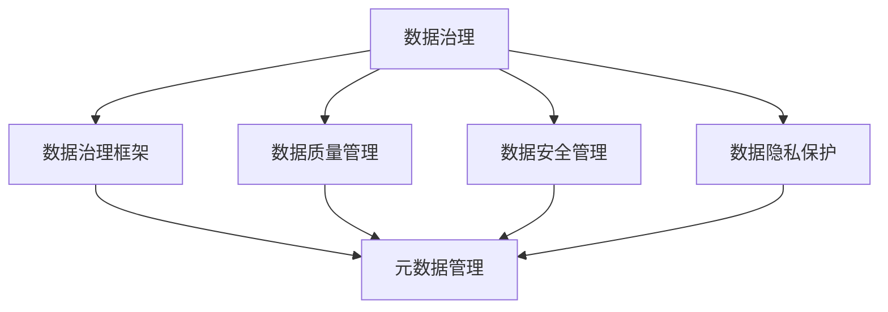

                 

# 数据治理 原理与代码实例讲解

> 关键词：数据治理,数据治理框架,数据质量管理,数据安全,隐私保护,数据治理工具,元数据管理

## 1. 背景介绍

### 1.1 问题由来
在数字化转型加速的今天，企业、政府机构等各类组织都在大力推进数据驱动的决策和运营模式，数据治理已成为信息化建设中不可或缺的一环。数据治理旨在通过有效的数据管理机制，确保数据的完整性、一致性、准确性和可用性，从而为业务决策提供可靠的数据支撑。然而，由于数据量大、来源多样、数据治理涉及多个部门，传统的数据治理方法往往面临操作复杂、数据孤岛、管理低效等问题。因此，系统化、标准化、自动化的数据治理框架成为当下企业和研究机构重点关注的方向。

### 1.2 问题核心关键点
数据治理的核心在于构建一个能够覆盖数据全生命周期的治理框架，包括数据质量管理、数据安全管理、数据隐私保护等。有效的数据治理需要结合业务需求，建立数据资产目录、数据流图、数据血缘关系等元数据，以支撑数据的分层、分级、分类、保护等管理。此外，数据治理还应涵盖数据标准制定、数据质量监控、数据安全策略制定与实施等关键环节。

### 1.3 问题研究意义
构建一个高效、可靠、易用的数据治理框架，对提升企业数据利用效率，降低数据治理成本，确保数据安全和隐私，具有重要意义：

1. **提升数据利用效率**：通过标准化、自动化的数据治理框架，能够快速发现和修复数据问题，提升数据可用性，为业务决策提供可靠依据。
2. **降低数据治理成本**：系统化的治理框架可以减少人工干预，提高治理效率，降低人力成本。
3. **确保数据安全与隐私**：制定严格的数据安全策略和隐私保护措施，防止数据泄露和滥用，确保数据安全。
4. **提高数据治理可操作性**：通过可视化、自动化等技术手段，使数据治理过程透明可控，提升数据治理的实施效率。
5. **推动数据标准化**：制定统一的数据标准和元数据模型，提升数据质量和互操作性，促进数据资源共享。

## 2. 核心概念与联系

### 2.1 核心概念概述

为了更好地理解数据治理的原理和实施方法，本节将介绍几个关键的概念及其相互联系：

- **数据治理(Data Governance)**：通过建立数据管理制度，规范数据的使用、存储、传输、销毁等行为，确保数据质量和安全。
- **数据质量管理(Data Quality Management)**：通过定义数据质量指标和规则，检测、监控、修正数据错误，提升数据质量。
- **数据安全管理(Data Security Management)**：通过技术手段和管理措施，保护数据的机密性、完整性、可用性，防止数据泄露和滥用。
- **数据隐私保护(Data Privacy Protection)**：通过法律法规和技术手段，保护数据主体的隐私权利，防止个人隐私数据被滥用。
- **数据治理框架(Data Governance Framework)**：为数据治理提供标准化、模块化的管理流程和工具，实现系统化的数据治理。
- **元数据管理(Metadata Management)**：定义数据资产的元数据，如数据源、数据流、数据结构等，支撑数据治理的全生命周期管理。

这些核心概念之间的联系可以通过以下Mermaid流程图来展示：



这个流程图展示了大数据治理的核心概念及其相互关系：

1. **数据治理**：为数据管理提供制度和规范，覆盖数据质量、安全、隐私等各个方面。
2. **数据质量管理**：通过制定数据质量标准，监控数据质量，提升数据可靠性。
3. **数据安全管理**：采取技术和管理手段，保护数据安全。
4. **数据隐私保护**：在法律法规和技术措施的约束下，保护数据主体的隐私权。
5. **数据治理框架**：提供标准化流程和工具，支撑数据治理的实施。
6. **元数据管理**：定义和维护数据治理所需的信息，支持数据治理的各个环节。

这些概念共同构成了数据治理的基本框架，指导数据治理的实践操作。

## 3. 核心算法原理 & 具体操作步骤
### 3.1 算法原理概述

数据治理的核心算法原理主要涉及数据质量检测、数据安全策略制定和数据隐私保护。

### 3.2 算法步骤详解

以下是数据治理的核心算法步骤详解：

#### 3.2.1 数据质量检测

数据质量检测是数据治理的重要环节，通过监控、检测、纠正数据问题，保证数据的准确性和完整性。主要步骤包括：

1. **定义数据质量标准**：定义数据质量的关键指标，如数据完整性、一致性、准确性、时效性等。
2. **数据质量检测**：通过定期扫描数据，检测数据质量问题，记录问题类型和位置。
3. **数据质量纠正**：针对检测到的数据问题，制定和执行纠正措施，修复数据错误。
4. **数据质量报告**：生成定期的数据质量报告，分析数据质量状况，识别改进方向。

#### 3.2.2 数据安全策略制定

数据安全策略的制定主要包括以下步骤：

1. **数据分类分级**：根据数据的敏感程度和重要性，对数据进行分类分级。
2. **安全策略制定**：根据数据分类，制定相应的安全保护措施，如访问控制、加密、审计等。
3. **安全策略实施**：在技术和管理层面实施安全策略，保护数据的机密性、完整性、可用性。
4. **安全策略评估**：定期评估安全策略的有效性，识别改进方向。

#### 3.2.3 数据隐私保护

数据隐私保护的主要步骤包括：

1. **隐私需求识别**：识别数据处理过程中的隐私需求，如匿名化、去标识化、访问控制等。
2. **隐私策略制定**：根据隐私需求，制定隐私保护策略，如数据匿名化、访问控制列表等。
3. **隐私策略实施**：在技术和管理层面实施隐私策略，保护数据主体的隐私权。
4. **隐私策略评估**：定期评估隐私策略的有效性，识别改进方向。

### 3.3 算法优缺点

数据治理框架的优势在于：

1. **标准化**：通过定义统一的数据标准和规范，提升数据治理的效率和一致性。
2. **模块化**：将数据治理流程模块化，提高治理过程的可控性和可操作性。
3. **自动化**：通过自动化工具和流程，减少人工干预，提高治理效率。
4. **透明性**：通过可视化的管理界面，提高治理过程的透明度和可追溯性。

其缺点包括：

1. **复杂性**：系统化的数据治理框架设计复杂，需要多方协调和支持。
2. **资源消耗**：设计和实施数据治理框架需要大量的资源投入，包括人力、物力和财力。
3. **更新挑战**：数据治理框架需要根据业务需求和技术变化不断更新和优化。

### 3.4 算法应用领域

数据治理框架在多个领域都有广泛应用：

1. **金融行业**：通过数据治理保障金融交易的准确性和安全性，提升金融产品的开发和风险控制能力。
2. **医疗行业**：通过数据治理确保医疗数据的准确性和隐私保护，提升医疗服务的质量和安全性。
3. **电信行业**：通过数据治理优化电信网络运营，提升用户服务体验。
4. **政府机构**：通过数据治理支撑政府决策，提高政府管理效率和透明度。
5. **企业内部**：通过数据治理提升企业数据质量和利用效率，促进业务创新和发展。

## 4. 数学模型和公式 & 详细讲解 & 举例说明
### 4.1 数学模型构建

为了更好地理解和设计数据治理的算法，我们可以构建一些数学模型来描述数据治理的不同环节。

假设数据治理框架中有 $n$ 个数据资产，每个资产有 $m$ 个元数据属性，每个元数据属性的质量指标有 $k$ 个。定义每个元数据属性的质量值为 $Q_i$，其中 $i \in [1, m]$。则数据质量模型可以表示为：

$$
\mathcal{Q} = \prod_{i=1}^m Q_i^{\alpha_i}
$$

其中，$\alpha_i$ 表示每个元数据属性的质量权重。

### 4.2 公式推导过程

以下我们对数据质量模型进行详细的公式推导过程：

设每个元数据属性的质量值为 $Q_i$，定义元数据属性的权重向量 $\alpha = (\alpha_1, \alpha_2, \ldots, \alpha_m)$。则数据质量模型可以表示为：

$$
\mathcal{Q} = \prod_{i=1}^m Q_i^{\alpha_i}
$$

为了使数据质量模型更加灵活和可控，我们可以引入加权平均的策略：

$$
\mathcal{Q} = \frac{\sum_{i=1}^m \alpha_i Q_i}{\sum_{i=1}^m \alpha_i}
$$

这种加权平均的方式可以在处理数据质量问题时更加灵活，适应不同业务场景的需求。

### 4.3 案例分析与讲解

假设某公司有三个数据资产 $A_1, A_2, A_3$，每个资产有三个元数据属性 $Q_1, Q_2, Q_3$，每个属性的质量权重分别为 $\alpha_1 = 0.4, \alpha_2 = 0.3, \alpha_3 = 0.3$。假设 $Q_1 = 0.8, Q_2 = 0.7, Q_3 = 0.9$，则公司整体的数据质量 $\mathcal{Q}$ 可以计算如下：

$$
\mathcal{Q} = (0.8^0.4 \times 0.7^0.3 \times 0.9^0.3)^{1/(0.4+0.3+0.3)} \approx 0.895
$$

因此，该公司的整体数据质量得分为 $0.895$，可以进行下一步的数据治理操作。

## 5. 项目实践：代码实例和详细解释说明
### 5.1 开发环境搭建

在进行数据治理框架的开发和实现前，我们需要准备好开发环境。以下是使用Python进行项目开发的环境配置流程：

1. 安装Anaconda：从官网下载并安装Anaconda，用于创建独立的Python环境。

2. 创建并激活虚拟环境：
```bash
conda create -n data-governance python=3.8 
conda activate data-governance
```

3. 安装相关依赖包：
```bash
pip install pandas numpy matplotlib sklearn
```

4. 安装可视化工具：
```bash
pip install matplotlib seaborn plotly
```

完成上述步骤后，即可在`data-governance`环境中开始数据治理框架的开发和实现。

### 5.2 源代码详细实现

以下是一个简单的数据治理框架的实现示例，通过定义数据质量检测和数据安全策略制定的基本功能，展示数据治理的核心算法原理和具体操作步骤：

```python
import pandas as pd
import numpy as np
from sklearn.preprocessing import LabelEncoder
from sklearn.model_selection import train_test_split

# 数据质量检测
class DataQualityChecker:
    def __init__(self, data, quality_threshold=0.9):
        self.data = data
        self.quality_threshold = quality_threshold
        
    def check_quality(self):
        quality_score = self.calculate_quality_score()
        if quality_score >= self.quality_threshold:
            print("数据质量符合要求")
        else:
            print("数据质量未达标")
            
    def calculate_quality_score(self):
        # 假设数据集有3个属性，每个属性的质量指标有2个
        attributes = self.data.columns
        num_attributes = len(attributes)
        attribute_scores = []
        
        for attribute in attributes:
            # 假设属性1的质量指标为完整性（0-1）、准确性（0-1）
            attribute_data = self.data[attribute].dropna()
            num_valid = len(attribute_data)
            num_total = len(self.data)
            score = (num_valid / num_total)
            attribute_scores.append(score)
        
        # 计算加权平均质量得分
        alpha = [0.4, 0.3]  # 假设完整性权重为0.4，准确性权重为0.3
        quality_score = np.average(attribute_scores, weights=alpha)
        return quality_score

# 数据安全策略制定
class DataSecurityManager:
    def __init__(self, data):
        self.data = data
        
    def classify_data(self):
        # 假设数据集有3个属性，每个属性的敏感程度为高、中、低
        attributes = self.data.columns
        num_attributes = len(attributes)
        classified_data = pd.DataFrame(index=self.data.index, columns=attributes)
        
        for attribute in attributes:
            # 假设属性1的敏感程度为中，属性2的敏感程度为高
            if attribute == "Attribute1":
                classified_data[attribute] = "Medium"
            elif attribute == "Attribute2":
                classified_data[attribute] = "High"
            else:
                classified_data[attribute] = "Low"
        
        return classified_data
    
    def define_security_strategy(self, classified_data):
        # 假设敏感度为高、中、低的属性分别采取不同的安全策略
        high_sensitive_attributes = classified_data[classified_data["Attribute2"] == "High"].index
        classified_data.loc[high_sensitive_attributes, "Security"] = "Encryption"
        medium_sensitive_attributes = classified_data[classified_data["Attribute1"] == "Medium"].index
        classified_data.loc[medium_sensitive_attributes, "Security"] = "Access Control"
        low_sensitive_attributes = classified_data[classified_data["Attribute3"] == "Low"].index
        classified_data.loc[low_sensitive_attributes, "Security"] = "None"
        
        return classified_data

# 实例化数据
data = pd.DataFrame({
    "Attribute1": np.random.randn(100),
    "Attribute2": np.random.randn(100),
    "Attribute3": np.random.randn(100)
})

# 实例化数据质量检测器
checker = DataQualityChecker(data)
checker.check_quality()

# 实例化数据安全策略制定器
manager = DataSecurityManager(data)
classified_data = manager.classify_data()
strategy_data = manager.define_security_strategy(classified_data)
print(strategy_data)
```

在这个示例中，我们定义了数据质量检测和数据安全策略制定的基本功能，分别通过实例化 `DataQualityChecker` 和 `DataSecurityManager` 类来完成。其中 `DataQualityChecker` 类通过计算数据质量得分来判断数据是否符合要求，而 `DataSecurityManager` 类则根据数据敏感性来制定相应的安全策略。

### 5.3 代码解读与分析

让我们再详细解读一下关键代码的实现细节：

**DataQualityChecker类**：
- `__init__`方法：初始化数据集和质量阈值。
- `check_quality`方法：计算数据质量得分，并判断是否符合要求。
- `calculate_quality_score`方法：计算加权平均质量得分，判断数据质量。

**DataSecurityManager类**：
- `__init__`方法：初始化数据集。
- `classify_data`方法：根据数据敏感性对数据进行分类。
- `define_security_strategy`方法：根据分类结果，制定安全策略。

在实际应用中，数据质量检测和数据安全策略制定是数据治理的两个核心环节，需要根据业务需求进行灵活设计。

## 6. 实际应用场景
### 6.1 智能客服系统

在智能客服系统中，数据治理可以帮助客服中心提升服务质量和效率，保障客户数据的安全和隐私。通过数据治理框架，可以实时监控和分析客服系统的数据质量，及时发现和修复数据问题，提升服务体验。同时，对客户数据进行分类和保护，确保数据不被滥用，增强客户信任感。

### 6.2 金融风险管理

金融行业对数据的质量和安全有着严格的要求。通过数据治理框架，可以对金融交易数据进行质量检测和异常监控，及时发现和处理数据错误，降低金融风险。同时，对敏感数据进行分类和保护，确保数据不被恶意攻击和滥用，保障金融安全。

### 6.3 医疗健康监测

在医疗健康监测领域，数据治理可以帮助医院和医疗服务机构提升数据质量，保障患者数据的安全和隐私。通过数据治理框架，可以实时监控和分析医疗数据的质量，及时发现和处理数据错误，提高医疗服务的准确性和可靠性。同时，对患者数据进行分类和保护，确保数据不被滥用，增强患者信任感。

### 6.4 未来应用展望

随着数据治理技术的不断发展，未来数据治理将在更多领域得到应用，为各行各业带来变革性影响：

1. **智慧城市建设**：通过数据治理框架，可以对城市各类数据进行全面管理和分析，提升城市管理效率和服务水平。
2. **教育资源共享**：通过数据治理框架，可以对教育资源进行标准化管理，促进教育资源的共享和利用。
3. **环境保护监测**：通过数据治理框架，可以对环境监测数据进行质量检测和异常监控，提升环境保护效果。
4. **智能交通管理**：通过数据治理框架，可以对交通数据进行全面管理和分析，提升交通管理效率和服务质量。

未来，随着数据治理技术的不断发展和应用，数据治理将成为各行各业数字化转型的重要基础，推动社会和经济的高质量发展。

## 7. 工具和资源推荐
### 7.1 学习资源推荐

为了帮助开发者系统掌握数据治理的理论基础和实践技巧，这里推荐一些优质的学习资源：

1. 《数据治理与数据质量管理》系列博文：由数据治理专家撰写，深入浅出地介绍了数据治理的基本概念、框架和最佳实践。
2. CSSTA《数据治理》课程：国际数据治理专家协会开设的课程，系统讲解数据治理的理论和实践。
3. 《数据治理指南》书籍：系统介绍数据治理的概念、方法和工具，是数据治理领域的重要参考书籍。
4. OMSA《数据治理》在线课程：约翰霍普金斯大学开设的在线课程，涵盖数据治理的各个环节和案例分析。
5. DAMA国际数据管理协会：提供丰富的数据治理资源和培训课程，帮助企业构建数据治理框架。

通过对这些资源的学习实践，相信你一定能够快速掌握数据治理的精髓，并用于解决实际的数据治理问题。

### 7.2 开发工具推荐

高效的数据治理需要优秀的工具支持。以下是几款用于数据治理开发的常用工具：

1. Talend：开源的数据集成和数据治理平台，支持ETL、数据清洗、数据质量检测等功能。
2. Informatica：领先的企业级数据治理工具，提供全面的数据质量管理和数据安全保护功能。
3. Alteryx：集数据准备、数据治理、数据分析于一体的数据科学平台，支持大规模数据处理和治理。
4. Collibra：提供数据发现、数据治理、数据共享等功能的智能数据平台，支持数据可视化、元数据管理等。
5. DataRobot：基于机器学习的自动化数据治理平台，支持自动数据治理、自动数据标注等功能。

合理利用这些工具，可以显著提升数据治理任务的开发效率，加快创新迭代的步伐。

### 7.3 相关论文推荐

数据治理技术的发展源于学界的持续研究。以下是几篇奠基性的相关论文，推荐阅读：

1. "Data Quality in the Digital Economy: A Survey"（数字经济中的数据质量：综述）：对数据质量管理的理论和实践进行了全面综述，是数据治理领域的重要参考文献。
2. "Data Governance Framework: A Review and Recommendations"（数据治理框架：综述与建议）：总结了多种数据治理框架的设计原则和实践案例，为构建数据治理框架提供了重要参考。
3. "Data Governance in the Information Age"（信息时代的数的数据治理）：探讨了数据治理在信息时代的重要性，分析了数据治理面临的挑战和机遇。
4. "Data Governance and the Digital Transformation"（数据治理与数字化转型）：分析了数据治理在数字化转型中的作用和重要性，提出了数据治理的未来发展方向。
5. "Towards a Framework for Data Governance in Smart Cities"（智能城市中的数据治理框架）：探讨了数据治理在智能城市中的应用，提出了数据治理的框架和策略。

这些论文代表了大数据治理领域的研究脉络，通过学习这些前沿成果，可以帮助研究者把握学科前进方向，激发更多的创新灵感。

## 8. 总结：未来发展趋势与挑战
### 8.1 总结

本文对数据治理的原理和实践进行了全面系统的介绍。首先阐述了数据治理在信息化建设中的重要地位，明确了数据质量管理、数据安全管理、数据隐私保护等核心环节。其次，从算法原理到操作步骤，详细讲解了数据质量检测、数据安全策略制定和数据隐私保护的具体实现方法。最后，通过案例分析与讲解，展示了数据治理在智能客服、金融风险管理、医疗健康监测等实际应用中的具体应用场景。

通过本文的系统梳理，可以看到，数据治理框架已经成为现代信息化建设的重要基础，对提升数据利用效率、保障数据安全和隐私具有重要意义。未来，随着数据治理技术的不断发展和应用，数据治理将成为各行各业数字化转型的重要基础，推动社会和经济的高质量发展。

### 8.2 未来发展趋势

展望未来，数据治理技术将呈现以下几个发展趋势：

1. **自动化和智能化**：通过引入人工智能和机器学习技术，提升数据治理的自动化和智能化水平，减少人工干预，提高治理效率。
2. **数据治理平台化**：将数据治理的各个环节进行平台化，形成统一的数据治理生态系统，实现数据的全生命周期管理。
3. **数据治理的标准化**：通过制定统一的数据标准和规范，提升数据治理的一致性和可操作性，促进数据资源的共享和利用。
4. **数据治理的可视化**：通过可视化工具和技术，提升数据治理过程的透明性和可控性，增强治理过程的可视化和可追溯性。
5. **数据治理的跨领域应用**：将数据治理的思路和方法引入其他领域，如智能交通、智慧城市、环境监测等，提升跨领域的治理效果。

这些趋势将进一步推动数据治理技术的成熟和发展，提升数据治理的效率和效果。

### 8.3 面临的挑战

尽管数据治理技术已经取得了一定的进展，但在迈向更加智能化、普适化应用的过程中，它仍面临诸多挑战：

1. **数据孤岛问题**：不同业务部门之间的数据治理标准和规范不一致，导致数据孤岛现象，难以实现数据共享和互操作。
2. **数据质量问题**：数据质量问题复杂多样，数据治理过程中需要处理大量的数据错误和异常，效率较低。
3. **数据安全和隐私问题**：数据泄露和滥用事件频发，数据安全策略和隐私保护措施需要不断更新和优化。
4. **数据治理成本高**：数据治理需要大量的资源投入，包括人力、物力和财力，成本较高。
5. **技术复杂度高**：数据治理涉及多个技术和领域的融合，技术复杂度较高，需要多方协调和支持。

这些挑战需要多方面共同努力，才能实现数据治理技术的成熟和落地。

### 8.4 研究展望

面对数据治理面临的挑战，未来的研究需要在以下几个方面寻求新的突破：

1. **数据治理平台化**：通过构建统一的数据治理平台，实现数据的全生命周期管理，提升数据治理的效率和效果。
2. **数据治理的标准化**：制定统一的数据标准和规范，提升数据治理的一致性和可操作性，促进数据资源的共享和利用。
3. **数据治理的智能化**：引入人工智能和机器学习技术，提升数据治理的自动化和智能化水平，减少人工干预，提高治理效率。
4. **数据治理的可视化**：通过可视化工具和技术，提升数据治理过程的透明性和可控性，增强治理过程的可视化和可追溯性。
5. **数据治理的跨领域应用**：将数据治理的思路和方法引入其他领域，如智能交通、智慧城市、环境监测等，提升跨领域的治理效果。

这些研究方向将进一步推动数据治理技术的成熟和发展，提升数据治理的效率和效果，促进数据资源的共享和利用，推动数据治理在各领域的广泛应用。

## 9. 附录：常见问题与解答

**Q1：数据治理与数据管理有什么区别？**

A: 数据治理（Data Governance）主要关注数据的质量、安全、隐私、标准等管理规范的制定和实施，是数据管理的高级阶段。数据管理（Data Management）则更为广泛，涉及数据的采集、存储、处理、分析和应用等全生命周期管理。数据治理强调数据管理的规范性和标准化，是数据管理的重要组成部分。

**Q2：数据治理需要哪些关键步骤？**

A: 数据治理的主要关键步骤包括：数据质量管理、数据安全管理、数据隐私保护、数据治理框架设计、数据治理平台建设等。这些步骤相互关联，共同构成数据治理的全生命周期管理。

**Q3：如何提高数据治理的效率？**

A: 提高数据治理效率的方法包括：自动化工具的使用、数据治理的标准化、数据治理平台化、数据治理的可视化等。通过引入自动化工具，可以减少人工干预，提高治理效率。通过制定统一的数据标准和规范，可以提升数据治理的一致性和可操作性。通过构建统一的数据治理平台，可以实现数据的全生命周期管理。通过可视化工具和技术，可以提升数据治理过程的透明性和可控性。

**Q4：如何保障数据安全和隐私？**

A: 保障数据安全和隐私的方法包括：数据分类分级、访问控制、数据加密、数据匿名化、审计记录等。通过数据分类分级，对敏感数据进行保护。通过访问控制，限制数据的访问权限。通过数据加密，保护数据的安全性。通过数据匿名化，去除数据中的个人隐私信息。通过审计记录，监控数据的访问和使用情况。

**Q5：数据治理的未来发展方向是什么？**

A: 数据治理的未来发展方向包括：自动化和智能化、平台化、标准化、可视化、跨领域应用等。通过引入人工智能和机器学习技术，提升数据治理的自动化和智能化水平，减少人工干预，提高治理效率。通过构建统一的数据治理平台，实现数据的全生命周期管理。通过制定统一的数据标准和规范，提升数据治理的一致性和可操作性。通过可视化工具和技术，提升数据治理过程的透明性和可控性。将数据治理的思路和方法引入其他领域，如智能交通、智慧城市、环境监测等，提升跨领域的治理效果。

这些方向将推动数据治理技术的成熟和发展，提升数据治理的效率和效果，促进数据资源的共享和利用，推动数据治理在各领域的广泛应用。

---

作者：禅与计算机程序设计艺术 / Zen and the Art of Computer Programming

