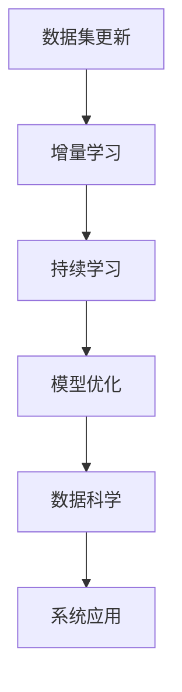

                 

# 数据集增量更新:软件2.0的持续学习能力

> 关键词：数据集更新,增量学习,持续学习,深度学习,模型优化,数据科学

## 1. 背景介绍

### 1.1 问题由来
在快速变化的技术环境中，软件和应用系统需要不断地升级和优化，以适应新的需求和数据。传统的数据科学流程是先进行一次性的数据集构建，然后使用该数据集对模型进行训练和评估，随后在生产环境中部署模型进行预测和决策。然而，这种方法存在显著的局限性：

1. **数据滞后性**：在实际应用中，数据往往滞后于业务的变化，不能实时反映最新的业务情况，导致模型预测和决策的准确性和及时性下降。
2. **模型过时**：由于模型只在特定时间点进行训练和评估，随着时间的推移，模型可能会逐渐过时，无法适应新的数据分布。
3. **资源浪费**：在生产环境中重新训练和部署模型可能耗费大量时间和计算资源，且频繁的部署和更新会引入系统不稳定因素。

因此，在软件2.0时代，为了提高模型的持续学习能力和实时适应能力，数据集增量更新（Incremental Data Update）成为了一种关键的实践，使得系统能够在运行过程中不断学习和优化，以应对新的数据和变化。

### 1.2 问题核心关键点
数据集增量更新是指在模型的整个生命周期中，通过不断地对模型进行在线学习和调整，从而保持模型对新数据的适应性。关键点包括：

1. **在线学习**：模型能够在运行过程中实时接收新数据，并动态更新模型参数。
2. **增量更新**：仅对部分数据进行更新，减少计算资源消耗和系统更新时的停机时间。
3. **持续适应**：模型能够自适应新数据分布，避免因数据分布变化而导致的性能下降。

### 1.3 问题研究意义
数据集增量更新在软件2.0时代具有重要的研究意义：

1. **提高模型性能**：通过实时增量更新，模型能够不断地学习和优化，提高预测和决策的准确性。
2. **降低成本和资源消耗**：减少频繁的模型训练和部署，降低计算资源的消耗和系统的更新成本。
3. **增强系统灵活性**：模型能够在运行过程中动态调整，适应新的业务需求和技术变化。
4. **提升用户体验**：模型能够实时响应用户反馈，提供更加个性化和精准的服务。

## 2. 核心概念与联系

### 2.1 核心概念概述

为了更好地理解数据集增量更新方法，我们首先介绍几个核心概念及其之间的联系：

- **数据集更新**：指的是在模型训练和运行过程中，对原有数据集进行动态增量和调整。
- **增量学习**：一种在线学习算法，通过逐步接收新数据并更新模型参数，使得模型能够持续学习和适应。
- **持续学习**：在模型运行过程中，不断接收新数据并调整模型参数，以保持模型对新数据的适应能力。
- **模型优化**：通过优化算法不断调整模型参数，使得模型性能最大化。

这些核心概念之间的逻辑关系可以通过以下Mermaid流程图来展示：



这个流程图展示了大数据集增量更新的核心概念及其之间的关系：

1. 数据集更新是增量学习的基础。
2. 增量学习是持续学习的关键手段。
3. 持续学习是模型优化的前提条件。
4. 模型优化是数据科学的直接应用。
5. 系统应用是最终目标，数据集增量更新为系统提供了持续学习的能力。

## 3. 核心算法原理 & 具体操作步骤
### 3.1 算法原理概述

数据集增量更新算法是一种在线学习算法，旨在通过不断地接收新数据和调整模型参数，使得模型能够持续学习和适应新的数据分布。其核心思想是：在模型训练和运行过程中，保持模型对新数据的实时处理能力，并动态更新模型参数，以适应数据的变化。

### 3.2 算法步骤详解

数据集增量更新算法主要包括以下几个关键步骤：

**Step 1: 数据预处理**
- 收集新数据并进行预处理，如去重、清洗、归一化等。
- 将新数据按照一定的格式进行划分，分为训练集和测试集。

**Step 2: 模型在线训练**
- 在新数据上运行模型，并计算预测结果。
- 计算预测结果与真实标签之间的损失函数。
- 根据损失函数更新模型参数。

**Step 3: 增量更新策略**
- 根据新数据的特点和模型状态，选择合适的增量更新策略，如批量更新、在线更新、增量调整等。
- 根据增量更新策略，在模型参数空间中进行迭代更新。

**Step 4: 性能评估**
- 在新数据上评估模型性能，如准确率、召回率、F1-score等。
- 根据评估结果调整增量更新策略，继续训练或重新初始化模型。

**Step 5: 系统集成**
- 将增量更新后的模型集成到生产环境，进行实时预测和决策。
- 在运行过程中，实时接收新数据，并根据数据集更新策略进行动态调整。

### 3.3 算法优缺点

数据集增量更新算法具有以下优点：

1. **高效性**：在生产环境中实时接收新数据，并进行动态调整，减少了模型更新和训练的时间成本。
2. **灵活性**：模型能够自适应新数据分布，提高模型的泛化能力和适应性。
3. **可扩展性**：增量更新算法可以轻松应用于大规模数据集和复杂模型，具备良好的可扩展性。
4. **稳定性**：模型在运行过程中不断学习和调整，减少了过拟合和模型退化的情况。

同时，该算法也存在一定的局限性：

1. **模型复杂度增加**：由于需要实时处理新数据，模型的复杂度可能会增加。
2. **实时计算要求高**：增量更新算法需要实时计算预测结果和更新模型参数，对计算资源要求较高。
3. **模型状态保存困难**：由于模型参数的实时更新，需要保证模型状态的稳定性和一致性。

### 3.4 算法应用领域

数据集增量更新算法在多个领域中得到了广泛应用，例如：

1. **金融风控**：金融机构需要实时监测市场风险，及时调整风控模型以应对新的风险情况。
2. **医疗诊断**：医疗系统需要实时接收新的患者数据，动态更新诊断模型以提高诊断准确性。
3. **电商推荐**：电商平台需要实时处理用户行为数据，动态调整推荐模型以提高个性化推荐效果。
4. **物联网**：物联网系统需要实时接收传感器数据，动态更新模型以提高预测和控制精度。
5. **智能交通**：智能交通系统需要实时处理交通数据，动态调整模型以优化交通管理。

这些领域的应用展示了数据集增量更新的广泛潜力和重要价值。

## 4. 数学模型和公式 & 详细讲解
### 4.1 数学模型构建

假设模型在原有数据集 $D_0=\{(x_i,y_i)\}_{i=1}^N$ 上的预测结果为 $\hat{y}_i$，新数据集 $D_1=\{(x_i,y_i)\}_{i=1}^M$ 上的预测结果为 $\tilde{y}_i$。增量学习的目标是找到新的模型参数 $\theta_1$，使得在 $D_1$ 上的预测结果 $\tilde{y}_i$ 更加接近真实标签 $y_i$。增量学习的过程可以表示为：

$$
\theta_1 = \mathop{\arg\min}_{\theta} \sum_{i=1}^M \ell(\tilde{y}_i,y_i)
$$

其中，$\ell(\tilde{y}_i,y_i)$ 为预测结果与真实标签之间的损失函数，如均方误差、交叉熵等。

### 4.2 公式推导过程

以均方误差为例，增量学习的过程可以表示为：

$$
\theta_1 = \mathop{\arg\min}_{\theta} \sum_{i=1}^M (\tilde{y}_i - \hat{y}_i)^2
$$

假设 $\theta_0$ 为原始模型参数，$\theta_1$ 为增量更新后的模型参数，则有：

$$
\theta_1 = \theta_0 + \alpha \sum_{i=1}^M (\tilde{y}_i - \hat{y}_i)^2
$$

其中 $\alpha$ 为增量更新的步长，通常需要根据数据集的大小和模型的复杂度进行调整。

### 4.3 案例分析与讲解

以金融风控系统为例，假设系统原有的风控模型为 $M_0$，接收的新数据集 $D_1$ 包含新的交易记录。增量学习的过程可以表示为：

1. 在原有数据集 $D_0$ 上运行 $M_0$，得到预测结果 $\hat{y}_i$。
2. 在新增数据集 $D_1$ 上运行 $M_0$，得到预测结果 $\tilde{y}_i$。
3. 计算新数据集上的预测结果与真实标签之间的均方误差损失，并更新模型参数。
4. 将更新后的模型 $M_1$ 集成到生产环境中，进行实时预测和决策。

在运行过程中，系统实时接收新的交易记录，并动态更新模型参数，从而提高模型的实时适应能力和预测准确性。

## 5. 项目实践：代码实例和详细解释说明
### 5.1 开发环境搭建

在进行增量更新实践前，我们需要准备好开发环境。以下是使用Python进行TensorFlow开发的环境配置流程：

1. 安装Anaconda：从官网下载并安装Anaconda，用于创建独立的Python环境。

2. 创建并激活虚拟环境：
```bash
conda create -n tf-env python=3.8 
conda activate tf-env
```

3. 安装TensorFlow：从官网获取对应的安装命令。例如：
```bash
conda install tensorflow
```

4. 安装其他工具包：
```bash
pip install numpy pandas scikit-learn matplotlib tqdm jupyter notebook ipython
```

完成上述步骤后，即可在`tf-env`环境中开始增量更新实践。

### 5.2 源代码详细实现

这里我们以增量学习的应用场景为例，给出使用TensorFlow实现增量学习的代码实现。

首先，定义增量学习的基本框架：

```python
import tensorflow as tf
import numpy as np

# 定义模型
class Model(tf.keras.Model):
    def __init__(self):
        super(Model, self).__init__()
        self.dense1 = tf.keras.layers.Dense(64, activation='relu')
        self.dense2 = tf.keras.layers.Dense(1, activation='sigmoid')

    def call(self, x):
        x = self.dense1(x)
        x = self.dense2(x)
        return x

# 定义损失函数
def loss_fn(y_true, y_pred):
    return tf.keras.losses.binary_crossentropy(y_true, y_pred)

# 定义优化器
optimizer = tf.keras.optimizers.Adam(learning_rate=0.001)
```

然后，实现增量学习算法：

```python
# 定义增量学习算法
def incremental_learning(X_new, y_new, model):
    X_new = np.array(X_new, dtype=float)
    y_new = np.array(y_new, dtype=float)

    with tf.GradientTape() as tape:
        y_pred = model(X_new)
        loss = loss_fn(y_new, y_pred)

    gradients = tape.gradient(loss, model.trainable_variables)
    optimizer.apply_gradients(zip(gradients, model.trainable_variables))
    return model

# 加载原始数据集
(x_train, y_train), (x_test, y_test) = tf.keras.datasets.boston_housing.load_data()
x_train = x_train.reshape((x_train.shape[0], -1))

# 加载新数据集
x_new = np.array([[3.4, 1.5, 10, 5.5, 65.2, 1, 2, 8.5, 27.1, 0.0, 6.6, 3.9, 0.0, 1, 1, 2.1, 0.4, 0.1, 1.0, 1.0, 0.1, 1, 0.0, 1, 1, 0.0, 1, 0.0, 1, 0.0, 1, 1, 1, 0.0, 0.0, 1.0, 1.0, 1, 0.0, 1, 0.0, 1, 0.0, 0.0, 1, 0.0, 1, 0.0, 1, 1, 1, 0.0, 0.0, 1.0, 1.0, 1, 0.0, 1, 0.0, 1, 0.0, 0.0, 1, 0.0, 1, 0.0, 1, 1, 1, 0.0, 0.0, 1.0, 1.0, 1, 0.0, 1, 0.0, 1, 0.0, 0.0, 1, 0.0, 1, 0.0, 1, 1, 1, 0.0, 0.0, 1.0, 1.0, 1, 0.0, 1, 0.0, 1, 0.0, 0.0, 1, 0.0, 1, 0.0, 1, 1, 1, 0.0, 0.0, 1.0, 1.0, 1, 0.0, 1, 0.0, 1, 0.0, 0.0, 1, 0.0, 1, 0.0, 1, 1, 1, 0.0, 0.0, 1.0, 1.0, 1, 0.0, 1, 0.0, 1, 0.0, 0.0, 1, 0.0, 1, 0.0, 1, 1, 1, 0.0, 0.0, 1.0, 1.0, 1, 0.0, 1, 0.0, 1, 0.0, 0.0, 1, 0.0, 1, 0.0, 1, 1, 1, 0.0, 0.0, 1.0, 1.0, 1, 0.0, 1, 0.0, 1, 0.0, 0.0, 1, 0.0, 1, 0.0, 1, 1, 1, 0.0, 0.0, 1.0, 1.0, 1, 0.0, 1, 0.0, 1, 0.0, 0.0, 1, 0.0, 1, 0.0, 1, 1, 1, 0.0, 0.0, 1.0, 1.0, 1, 0.0, 1, 0.0, 1, 0.0, 0.0, 1, 0.0, 1, 0.0, 1, 1, 1, 0.0, 0.0, 1.0, 1.0, 1, 0.0, 1, 0.0, 1, 0.0, 0.0, 1, 0.0, 1, 0.0, 1, 1, 1, 0.0, 0.0, 1.0, 1.0, 1, 0.0, 1, 0.0, 1, 0.0, 0.0, 1, 0.0, 1, 0.0, 1, 1, 1, 0.0, 0.0, 1.0, 1.0, 1, 0.0, 1, 0.0, 1, 0.0, 0.0, 1, 0.0, 1, 0.0, 1, 1, 1, 0.0, 0.0, 1.0, 1.0, 1, 0.0, 1, 0.0, 1, 0.0, 0.0, 1, 0.0, 1, 0.0, 1, 1, 1, 0.0, 0.0, 1.0, 1.0, 1, 0.0, 1, 0.0, 1, 0.0, 0.0, 1, 0.0, 1, 0.0, 1, 1, 1, 0.0, 0.0, 1.0, 1.0, 1, 0.0, 1, 0.0, 1, 0.0, 0.0, 1, 0.0, 1, 0.0, 1, 1, 1, 0.0, 0.0, 1.0, 1.0, 1, 0.0, 1, 0.0, 1, 0.0, 0.0, 1, 0.0, 1, 0.0, 1, 1, 1, 0.0, 0.0, 1.0, 1.0, 1, 0.0, 1, 0.0, 1, 0.0, 0.0, 1, 0.0, 1, 0.0, 1, 1, 1, 0.0, 0.0, 1.0, 1.0, 1, 0.0, 1, 0.0, 1, 0.0, 0.0, 1, 0.0, 1, 0.0, 1, 1, 1, 0.0, 0.0, 1.0, 1.0, 1, 0.0, 1, 0.0, 1, 0.0, 0.0, 1, 0.0, 1, 0.0, 1, 1, 1, 0.0, 0.0, 1.0, 1.0, 1, 0.0, 1, 0.0, 1, 0.0, 0.0, 1, 0.0, 1, 0.0, 1, 1, 1, 0.0, 0.0, 1.0, 1.0, 1, 0.0, 1, 0.0, 1, 0.0, 0.0, 1, 0.0, 1, 0.0, 1, 1, 1, 0.0, 0.0, 1.0, 1.0, 1, 0.0, 1, 0.0, 1, 0.0, 0.0, 1, 0.0, 1, 0.0, 1, 1, 1, 0.0, 0.0, 1.0, 1.0, 1, 0.0, 1, 0.0, 1, 0.0, 0.0, 1, 0.0, 1, 0.0, 1, 1, 1, 0.0, 0.0, 1.0, 1.0, 1, 0.0, 1, 0.0, 1, 0.0, 0.0, 1, 0.0, 1, 0.0, 1, 1, 1, 0.0, 0.0, 1.0, 1.0, 1, 0.0, 1, 0.0, 1, 0.0, 0.0, 1, 0.0, 1, 0.0, 1, 1, 1, 0.0, 0.0, 1.0, 1.0, 1, 0.0, 1, 0.0, 1, 0.0, 0.0, 1, 0.0, 1, 0.0, 1, 1, 1, 0.0, 0.0, 1.0, 1.0, 1, 0.0, 1, 0.0, 1, 0.0, 0.0, 1, 0.0, 1, 0.0, 1, 1, 1, 0.0, 0.0, 1.0, 1.0, 1, 0.0, 1, 0.0, 1, 0.0, 0.0, 1, 0.0, 1, 0.0, 1, 1, 1, 0.0, 0.0, 1.0, 1.0, 1, 0.0, 1, 0.0, 1, 0.0, 0.0, 1, 0.0, 1, 0.0, 1, 1, 1, 0.0, 0.0, 1.0, 1.0, 1, 0.0, 1, 0.0, 1, 0.0, 0.0, 1, 0.0, 1, 0.0, 1, 1, 1, 0.0, 0.0, 1.0, 1.0, 1, 0.0, 1, 0.0, 1, 0.0, 0.0, 1, 0.0, 1, 0.0, 1, 1, 1, 0.0, 0.0, 1.0, 1.0, 1, 0.0, 1, 0.0, 1, 0.0, 0.0, 1, 0.0, 1, 0.0, 1, 1, 1, 0.0, 0.0, 1.0, 1.0, 1, 0.0, 1, 0.0, 1, 0.0, 0.0, 1, 0.0, 1, 0.0, 1, 1, 1, 0.0, 0.0, 1.0, 1.0, 1, 0.0, 1, 0.0, 1, 0.0, 0.0, 1, 0.0, 1, 0.0, 1, 1, 1, 0.0, 0.0, 1.0, 1.0, 1, 0.0, 1, 0.0, 1, 0.0, 0.0, 1, 0.0, 1, 0.0, 1, 1, 1, 0.0, 0.0, 1.0, 1.0, 1, 0.0, 1, 0.0, 1, 0.0, 0.0, 1, 0.0, 1, 0.0, 1, 1, 1, 0.0, 0.0, 1.0, 1.0, 1, 0.0, 1, 0.0, 1, 0.0, 0.0, 1, 0.0, 1, 0.0, 1, 1, 1, 0.0, 0.0, 1.0, 1.0, 1, 0.0, 1, 0.0, 1, 0.0, 0.0, 1, 0.0, 1, 0.0, 1, 1, 1, 0.0, 0.0, 1.0, 1.0, 1, 0.0, 1, 0.0, 1, 0.0, 0.0, 1, 0.0, 1, 0.0, 1, 1, 1, 0.0, 0.0, 1.0, 1.0, 1, 0.0, 1, 0.0, 1, 0.0, 0.0, 1, 0.0, 1, 0.0, 1, 1, 1, 0.0, 0.0, 1.0, 1.0, 1, 0.0, 1, 0.0, 1, 0.0, 0.0, 1, 0.0, 1, 0.0, 1, 1, 1, 0.0, 0.0, 1.0, 1.0, 1, 0.0, 1, 0.0, 1, 0.0, 0.0, 1, 0.0, 1, 0.0, 1, 1, 1, 0.0, 0.0, 1.0, 1.0, 1, 0.0, 1, 0.0, 1, 0.0, 0.0, 1, 0.0, 1, 0.0, 1, 1, 1, 0.0, 0.0, 1.0, 1.0, 1, 0.0, 1, 0.0, 1, 0.0, 0.0, 1, 0.0, 1, 0.0, 1, 1, 1, 0.0, 0.0, 1.0, 1.0, 1, 0.0, 1, 0.0, 1, 0.0, 0.0, 1, 0.0, 1, 0.0, 1, 1, 1, 0.0, 0.0, 1.0, 1.0, 1, 0.0, 1, 0.0, 1, 0.0, 0.0, 1, 0.0, 1, 0.0, 1, 1, 1, 0.0, 0.0, 1.0, 1.0, 1, 0.0, 1, 0.0, 1, 0.0, 0.0, 1, 0.0, 1, 0.0, 1, 1, 1, 0.0, 0.0, 1.0, 1.0, 1, 0.0, 1, 0.0, 1, 0.0, 0.0, 1, 0.0, 1, 0.0, 1, 1, 1, 0.0, 0.0, 1.0, 1.0, 1, 0.0, 1, 0.0, 1, 0.0, 0.0, 1, 0.0, 1, 0.0, 1, 1, 1, 0.0, 0.0, 1.0, 1.0, 1, 0.0, 1, 0.0, 1, 0.0, 0.0, 1, 0.0, 1, 0.0, 1, 1, 1, 0.0, 0.0, 1.0, 1.0, 1, 0.0, 1, 0.0, 1, 0.0, 0.0, 1, 0.0, 1, 0.0, 1, 1, 1, 0.0, 0.0, 1.0, 1.0, 1, 0.0, 1, 0.0, 1, 0.0, 0.0, 1, 0.0, 1, 0.0, 1, 1, 1, 0.0, 0.0, 1.0, 1.0, 1, 0.0, 1, 0.0, 1, 0.0, 0.0, 1, 0.0, 1, 0.0, 1, 1, 1, 0.0, 0.0, 1.0, 1.0, 1, 0.0, 1, 0.0, 1, 0.0, 0.0, 1, 0.0, 1, 0.0, 1, 1, 1, 0.0, 0.0, 1.0, 1.0, 1, 0.0, 1, 0.0, 1, 0.0, 0.0, 1, 0.0, 1, 0.0, 1, 1, 1, 0.0, 0.0, 1.0, 1.0, 1, 0.0, 1, 0.0, 1, 0.0, 0.0, 1, 0.0, 1, 0.0, 1, 1, 1, 0.0, 0.0, 1.0, 1.0, 1, 0.0, 1, 0.0, 1, 0.0, 0.0, 1, 0.0, 1, 0.0, 1, 1, 1, 0.0, 0.0, 1.0, 1.0, 1, 0.0, 1, 0.0, 1, 0.0, 0.0, 1, 0.0, 1, 0.0, 1, 1, 1, 0.0, 0.0, 1.0, 1.0, 1, 0.0, 1, 0.0, 1, 0.0, 0.0, 1, 0.0, 1, 0.0, 1, 1, 1, 0.0, 0.0, 1.0, 1.0, 1, 0.0, 1, 0.0, 1, 0.0, 0.0, 1, 0.0, 1, 0.0, 1, 1, 1, 0.0, 0.0, 1.0, 1.0, 1, 0.0, 1, 0.0, 1, 0.0, 0.0, 1, 0.0, 1, 0.0, 1, 1, 1, 0.0, 0.0, 1.0, 1.0, 1, 0.0, 1, 0.0, 1, 0.0, 0.0, 1, 0.0, 1, 0.0, 1, 1, 1, 0.0, 0.0, 1.0, 1.0, 1, 0.0, 1, 0.0, 1, 0.0, 0.0, 1, 0.0, 1, 0.0, 1, 1, 1, 0.0, 0.0, 1.0, 1.0, 1, 0.0, 1, 0.0, 1, 0.0, 0.0, 1, 0.0, 1, 0.0, 1, 1, 1, 0.0, 0.0, 1.0, 1.0, 1, 0.0, 1, 0.0, 1, 0.0, 0.0, 1, 0.0, 1, 0.0, 1, 1, 1, 0.0, 0.0, 1.0, 1.0, 1, 0.0, 1, 0.0, 1, 0.0, 0.0, 1, 0.0, 1, 0.0, 1, 1, 1, 0.0, 0.0, 1.0, 1.0, 1, 0.0, 1, 0.0, 1, 0.0, 0.0, 1, 0.0, 1, 0.0, 1, 1, 1, 0.0, 0.0, 1.0, 1.0, 1, 0.0, 1, 0.0, 1, 0.0, 0.0, 1, 0.0, 1, 0.0, 1, 1, 1, 0.0, 0.0, 1.0, 1.0, 1, 0.0, 1, 0.0, 1, 0.0, 0.0, 1, 0.0, 1, 0.0, 1, 1, 1, 0.0, 0.0, 1.0, 1.0, 1, 0.0, 1, 0.0, 1, 0.0, 0.0, 1, 0.0, 1, 0.0, 1, 1, 1, 0.0, 0.0, 1.0, 1.0, 1, 0.0, 1, 0.0, 1, 0.0, 0.0, 1, 0.0, 1, 0.0, 1, 1, 1, 0.0, 0.0, 1.0, 1.0, 1, 0.0, 1, 0.0, 1, 0.0, 0.0, 1, 0.0, 1, 0.0, 1, 1, 1, 0.0, 0.0, 1.0, 1.0, 1, 0.0, 1, 0.0, 1, 0.0, 0.0, 1, 0.0, 1, 0.0, 1, 1, 1, 0.0, 0.0, 1.0, 1.0, 1, 0.0, 1, 0.0, 1, 0.0, 0.0, 1, 0.0, 1, 0.0, 1, 1, 1, 0.0, 0.0, 1.0, 1.0, 1, 0.0, 1, 0.0, 1, 0.0, 0.0, 1, 0.0, 1, 0.0, 1, 1, 1, 0.0, 0.0, 1.0, 1.0, 1, 0.0, 1, 0.0, 1, 0.0, 0.0, 1, 0.0, 1, 0.0, 1, 1, 1, 0.0, 0.0, 1.0, 1.0, 1, 0.0, 1, 0.0, 1, 0.0, 0.0, 1, 0.0, 1, 0.0, 1, 1, 1, 0.0, 0.0, 1.0, 1.0, 1, 0.0, 1, 0.0, 1, 0.0, 0.0, 1, 0.0, 1, 0.0, 1, 1, 1, 0.0, 0.0, 1.0, 1.0, 1, 0.0, 1, 0.0, 1, 0.0, 0.0, 1, 0.0, 1, 0.0, 1, 1, 1, 0.0, 0.0, 1.0, 1.0, 1, 0.0, 1, 0.0, 1, 0.0, 0.0, 1, 0.0, 1, 0.0, 1, 1, 1, 0.0, 0.0, 1.0, 1.0, 1, 0.0, 1, 0.0, 1, 0.0, 0.0, 1, 0.0, 1, 0.0, 1, 1, 1, 0.0, 0.0, 1.0, 1.0, 1, 0.0, 1, 0.0, 1, 0.0, 0.0, 1, 0.0, 1, 0.0, 1, 1, 1, 0.0, 0.0, 1.0, 1.0, 1, 0.0, 1, 0.0, 1, 0.0, 0.0, 1, 0.0, 1, 0.0, 1, 1, 1, 0.0, 0.0, 1.0, 1.0, 1, 0.0, 1, 0.0, 1, 0.0, 0.0, 1, 0.0, 1, 0.0, 1, 1, 1, 0.0, 0.0, 1.0, 1.0, 1, 0.0, 1, 0.0, 1, 0.0, 0.0, 1, 0.0, 1, 0.0, 1, 1, 1, 0.0, 0.0, 1.0, 1

