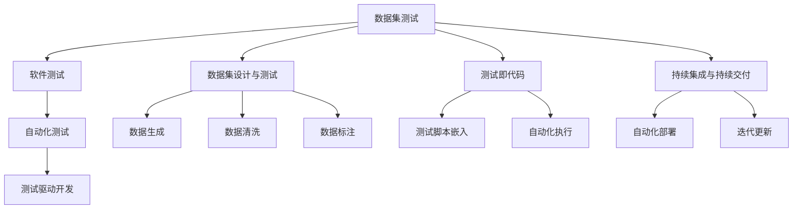

                 

# 数据集测试即软件测试,两种测试的融合

> 关键词：数据集测试, 软件测试, 测试即代码, 测试驱动开发, 自动化测试, 软件质量

## 1. 背景介绍

### 1.1 问题由来
在软件开发过程中，数据集测试与软件测试历来是两个独立的领域，分别关注数据质量和软件功能，这在一定程度上造成了数据的价值未被充分挖掘。随着数据的重要性日益凸显，如何在软件开发过程中更好地利用数据，提升软件质量，成为了软件开发的关键问题之一。数据集测试作为验证数据质量的重要手段，其与软件测试的融合，成为了提升软件系统质量的重要趋势。

### 1.2 问题核心关键点
数据集测试与软件测试的融合，旨在通过数据驱动的方式，提升软件的质量和性能。具体来说，数据集测试是指通过特定数据集对软件进行测试，验证数据处理的准确性、合理性和有效性。软件测试则是指在软件开发的各个阶段，对软件的功能、性能、安全性等方面进行验证和评估。

数据集测试与软件测试的融合，主要包括以下几个关键点：
- 数据集设计与测试：设计合适的数据集，确保其覆盖软件的各种处理场景，验证软件的鲁棒性和可靠性。
- 自动化测试：采用自动化测试工具，提高测试效率，减少人为错误，提升测试覆盖率。
- 测试即代码：将测试逻辑嵌入代码中，实现边测试边开发，提升软件质量。
- 持续集成与持续交付(CI/CD)：将数据集测试和软件测试集成到CI/CD流程中，实现自动化部署和迭代更新。

## 2. 核心概念与联系

### 2.1 核心概念概述

为更好地理解数据集测试与软件测试的融合方法，本节将介绍几个密切相关的核心概念：

- 数据集测试(Data Set Testing)：通过特定数据集对软件进行测试，验证数据处理的准确性和合理性。数据集测试涉及数据的生成、清洗、标注等步骤，旨在确保数据质量，为软件测试提供可信的数据支撑。
- 软件测试(Software Testing)：在软件开发的各个阶段，对软件的功能、性能、安全性等方面进行验证和评估。软件测试包括单元测试、集成测试、系统测试、验收测试等不同层次的测试。
- 测试即代码(Test as Code)：将测试逻辑嵌入代码中，实现自动化测试，提升软件质量。测试即代码通过编写可执行的测试脚本，实现对软件功能的持续验证。
- 测试驱动开发(Test-Driven Development, TDD)：在软件开发的每个阶段，先编写测试用例，再编写实际代码，通过不断迭代，提升软件质量和性能。测试驱动开发强调测试先行，以测试为导向的软件开发方式。
- 自动化测试(Automated Testing)：通过编写可执行的测试脚本，实现对软件功能的自动化测试，提高测试效率，减少人为错误，提升测试覆盖率。
- 数据集设计(Data Set Design)：设计合适的数据集，确保其能够覆盖软件的各种处理场景，验证软件的鲁棒性和可靠性。

这些核心概念之间的逻辑关系可以通过以下Mermaid流程图来展示：



这个流程图展示了几类核心概念及其之间的关系：

1. 数据集测试作为软件测试的基础，通过设计和测试数据集，确保数据质量。
2. 测试即代码与数据集测试相结合，将测试逻辑嵌入代码中，实现自动化测试。
3. 持续集成与持续交付将数据集测试和软件测试集成到CI/CD流程中，实现自动化部署和迭代更新。
4. 自动化测试和测试驱动开发进一步提升测试效率和软件质量。

这些概念共同构成了数据集测试与软件测试融合的框架，为其在软件开发中的应用提供了坚实的基础。

## 3. 核心算法原理 & 具体操作步骤
### 3.1 算法原理概述

数据集测试与软件测试的融合，主要基于以下两个原理：

- **数据驱动原理**：数据集测试通过对数据进行设计和测试，验证软件处理数据的准确性和合理性。软件测试则通过使用这些经过验证的数据集，对软件功能、性能、安全性等方面进行评估。
- **测试即代码原理**：将测试逻辑嵌入代码中，实现边测试边开发，提升软件质量。测试即代码与数据集测试相结合，通过自动化测试工具，实现对数据处理的持续验证。

基于以上原理，数据集测试与软件测试的融合操作主要包括以下步骤：

1. 设计和测试数据集。
2. 编写测试脚本，将测试逻辑嵌入代码中。
3. 执行测试脚本，实现数据驱动的自动化测试。
4. 将测试结果反馈到软件开发流程中，进行持续集成与持续交付。

### 3.2 算法步骤详解

以下是数据集测试与软件测试融合的具体操作步骤：

**Step 1: 设计和测试数据集**

设计和测试数据集是数据集测试与软件测试融合的基础。具体步骤如下：

1. **数据收集**：收集与软件相关的数据，如用户行为数据、业务日志数据、系统性能数据等。
2. **数据清洗**：清洗数据集，去除噪声、异常值和缺失值，确保数据质量。
3. **数据标注**：对数据进行标注，如分类标签、属性标签等，以便后续的数据驱动测试。
4. **数据划分**：将数据集划分为训练集、验证集和测试集，确保测试的公平性和有效性。

**Step 2: 编写测试脚本**

编写测试脚本是将测试逻辑嵌入代码的重要步骤。具体步骤如下：

1. **设计测试用例**：根据数据集的特点和软件功能需求，设计合理的测试用例。测试用例应覆盖数据处理的各种场景，确保测试的全面性和覆盖率。
2. **编写测试脚本**：将测试用例转化为可执行的代码脚本，如Python脚本、Java脚本等。测试脚本应包括数据读取、数据处理、结果验证等步骤。
3. **集成测试脚本**：将测试脚本集成到软件开发的各个环节，如单元测试、集成测试、系统测试等，实现全生命周期的自动化测试。

**Step 3: 执行测试脚本**

执行测试脚本是数据驱动自动化测试的关键步骤。具体步骤如下：

1. **执行测试脚本**：通过自动化测试工具，如Jenkins、GitLab CI等，执行测试脚本，验证数据处理和软件功能的准确性和合理性。
2. **收集测试结果**：收集测试脚本的执行结果，包括测试用例的通过率、失败率、异常情况等，进行数据分析和评估。
3. **反馈测试结果**：将测试结果反馈到软件开发流程中，进行持续集成与持续交付，确保软件的质量和性能。

**Step 4: 持续集成与持续交付**

持续集成与持续交付是数据集测试与软件测试融合的重要保障。具体步骤如下：

1. **集成测试脚本**：将测试脚本集成到CI/CD流程中，实现自动化测试和部署。
2. **持续测试与部署**：在每次代码提交后，自动执行测试脚本，验证软件功能的正确性和数据处理的准确性。
3. **迭代更新**：根据测试结果和反馈信息，进行软件功能的迭代更新，提升软件质量和性能。

### 3.3 算法优缺点

数据集测试与软件测试的融合方法，具有以下优点：

1. **提高数据质量**：通过数据集测试，验证数据的准确性和合理性，确保数据质量，为软件测试提供可信的数据支撑。
2. **提升测试效率**：采用自动化测试工具，提高测试效率，减少人为错误，提升测试覆盖率。
3. **实现持续集成与持续交付**：将数据集测试和软件测试集成到CI/CD流程中，实现自动化部署和迭代更新。
4. **提升软件质量**：通过数据驱动的自动化测试，实现边测试边开发，提升软件质量。

同时，该方法也存在一定的局限性：

1. **数据依赖性强**：数据集测试依赖于高质量的数据集，如果数据集存在问题，测试结果可能不可信。
2. **开发复杂度高**：设计和测试数据集的过程较为复杂，需要投入较多的人力和时间。
3. **模型泛化性差**：数据集测试和软件测试的融合，可能存在模型泛化性差的问题，即在新的数据集上，测试结果可能不够准确。

尽管存在这些局限性，但就目前而言，数据集测试与软件测试的融合方法仍是一种高效、实用的软件开发方式，值得在实际应用中推广。

### 3.4 算法应用领域

数据集测试与软件测试的融合方法，已经在多个领域得到了广泛的应用，例如：

- 金融领域：在金融交易系统中，数据集测试与软件测试的融合，确保了数据处理的准确性和实时性，提升了系统的稳定性和可靠性。
- 医疗领域：在医疗数据分析系统中，数据集测试与软件测试的融合，验证了数据处理和算法模型的准确性，提高了诊断和治疗的准确性。
- 电商领域：在电商推荐系统中，数据集测试与软件测试的融合，确保了推荐算法的准确性和高效性，提升了用户的购物体验。
- 社交媒体领域：在社交媒体分析系统中，数据集测试与软件测试的融合，验证了数据分析和算法模型的合理性，提升了内容推荐和用户互动的效果。

除了上述这些经典应用外，数据集测试与软件测试的融合方法，还可以应用于更多场景中，如智能制造、物联网、智慧城市等，为各行各业带来新的创新和发展机遇。

## 4. 数学模型和公式 & 详细讲解 & 举例说明

### 4.1 数学模型构建

在数据集测试与软件测试的融合方法中，数学模型主要用于描述测试过程和测试结果的分析评估。以下是一个简单的数学模型：

设数据集为 $D=\{(x_i,y_i)\}_{i=1}^N$，其中 $x_i$ 为输入数据，$y_i$ 为标签。假设软件模型为 $M_{\theta}$，其中 $\theta$ 为模型参数。数据集测试与软件测试的融合过程可以描述为：

1. **数据生成**：根据输入数据 $x_i$，通过模型 $M_{\theta}$ 输出预测结果 $\hat{y}_i$。
2. **数据标注**：对预测结果 $\hat{y}_i$ 进行标注，得到标注结果 $y_i$。
3. **测试脚本编写**：根据标注结果 $y_i$，编写测试脚本，验证预测结果 $\hat{y}_i$ 与标注结果 $y_i$ 的差异。
4. **测试结果分析**：根据测试脚本的执行结果，分析模型的性能和数据质量。

### 4.2 公式推导过程

以下我们以二分类任务为例，推导数据集测试与软件测试融合的数学模型。

假设软件模型为二分类模型，输出为 $M_{\theta}(x_i)=\sigma(\mathbf{W}^Tx_i+b)$，其中 $\sigma$ 为激活函数，$\mathbf{W}$ 和 $b$ 为模型参数。测试脚本的执行结果可以描述为：

$$
\text{Accuracy} = \frac{1}{N} \sum_{i=1}^N [\mathbf{1}(y_i=M_{\theta}(x_i))]
$$

其中 $\mathbf{1}(\cdot)$ 为示性函数，当 $y_i=M_{\theta}(x_i)$ 成立时，返回1；否则返回0。

根据上述数学模型，可以推导出测试脚本的执行结果和模型的准确性之间的关系：

1. **模型准确性**：测试脚本的执行结果越高，表示模型 $M_{\theta}$ 的准确性越高。
2. **数据质量**：测试脚本的执行结果越低，表示数据集 $D$ 中的数据质量越低，可能导致模型 $M_{\theta}$ 的性能下降。
3. **测试覆盖率**：测试脚本的执行结果越高，表示测试覆盖率越高，越能全面验证模型的性能和数据处理的准确性。

### 4.3 案例分析与讲解

以下是一个数据集测试与软件测试融合的实际案例：

**案例背景**：某电商公司开发了一款推荐系统，需要验证推荐算法的准确性和高效性。数据集包含用户的浏览记录、购买记录、历史评分等数据，需要对其进行测试和验证。

**解决方案**：

1. **数据收集与清洗**：收集用户数据，清洗数据集，去除噪声和异常值，确保数据质量。
2. **数据标注**：对数据进行标注，如物品标签、用户评分等，以便后续的数据驱动测试。
3. **测试脚本编写**：根据标注结果，编写测试脚本，验证推荐算法的准确性和高效性。
4. **测试结果分析**：通过自动化测试工具，执行测试脚本，分析测试结果，评估推荐算法的性能。

**测试脚本示例**：

```python
import pandas as pd
import numpy as np
import sklearn.metrics as metrics

# 读取数据集
data = pd.read_csv('data.csv')

# 数据预处理
data = data.dropna()
data = data.drop_duplicates()

# 数据标注
data['label'] = 1 if data['rating'] >= 3 else 0

# 数据划分
train_data = data.sample(frac=0.8, random_state=42)
test_data = data.drop(train_data.index)

# 模型训练与测试
from sklearn.ensemble import RandomForestClassifier
from sklearn.metrics import accuracy_score

# 训练模型
model = RandomForestClassifier()
model.fit(train_data[['feature1', 'feature2', 'feature3']], train_data['label'])

# 测试模型
preds = model.predict(test_data[['feature1', 'feature2', 'feature3']])
accuracy = accuracy_score(test_data['label'], preds)

# 输出测试结果
print('Accuracy:', accuracy)
```

以上代码示例展示了如何使用Python对推荐系统进行数据集测试与软件测试的融合。首先，收集和清洗数据集，标注数据，划分训练集和测试集。然后，使用随机森林模型进行训练和测试，计算模型的准确性。通过自动化测试工具，可以对测试结果进行持续集成与持续交付，确保推荐系统的稳定性和可靠性。

## 5. 项目实践：代码实例和详细解释说明
### 5.1 开发环境搭建

在进行数据集测试与软件测试融合的实践前，我们需要准备好开发环境。以下是使用Python进行PyTorch开发的环境配置流程：

1. 安装Anaconda：从官网下载并安装Anaconda，用于创建独立的Python环境。

2. 创建并激活虚拟环境：
```bash
conda create -n pytorch-env python=3.8 
conda activate pytorch-env
```

3. 安装PyTorch：根据CUDA版本，从官网获取对应的安装命令。例如：
```bash
conda install pytorch torchvision torchaudio cudatoolkit=11.1 -c pytorch -c conda-forge
```

4. 安装必要的库：
```bash
pip install pandas numpy matplotlib tqdm jupyter notebook ipython
```

完成上述步骤后，即可在`pytorch-env`环境中开始项目实践。

### 5.2 源代码详细实现

下面以电商推荐系统为例，展示如何使用PyTorch进行数据集测试与软件测试的融合实践。

**数据集准备**：

```python
import pandas as pd

# 读取数据集
data = pd.read_csv('data.csv')

# 数据预处理
data = data.dropna()
data = data.drop_duplicates()

# 数据标注
data['label'] = 1 if data['rating'] >= 3 else 0

# 数据划分
train_data = data.sample(frac=0.8, random_state=42)
test_data = data.drop(train_data.index)
```

**模型训练与测试**：

```python
from torch.utils.data import Dataset, DataLoader
from torch import nn, optim

# 定义数据集类
class RecommendationDataset(Dataset):
    def __init__(self, data, mode):
        self.data = data
        self.mode = mode

    def __len__(self):
        return len(self.data)

    def __getitem__(self, idx):
        item = self.data.iloc[idx]
        label = item['label']
        feature = item[['feature1', 'feature2', 'feature3']]
        return feature, label

# 定义模型类
class RecommendationModel(nn.Module):
    def __init__(self):
        super(RecommendationModel, self).__init__()
        self.fc1 = nn.Linear(3, 64)
        self.fc2 = nn.Linear(64, 1)
        self.sigmoid = nn.Sigmoid()

    def forward(self, x):
        x = self.fc1(x)
        x = self.fc2(x)
        x = self.sigmoid(x)
        return x

# 定义损失函数和优化器
loss_fn = nn.BCELoss()
opt = optim.Adam(model.parameters(), lr=0.001)

# 定义训练函数
def train_epoch(model, train_loader, optimizer, loss_fn):
    model.train()
    epoch_loss = 0
    for batch in train_loader:
        feature, label = batch
        output = model(feature)
        loss = loss_fn(output, label)
        epoch_loss += loss.item()
        optimizer.zero_grad()
        loss.backward()
        optimizer.step()
    return epoch_loss / len(train_loader)

# 定义评估函数
def evaluate(model, test_loader):
    model.eval()
    total = 0
    correct = 0
    with torch.no_grad():
        for batch in test_loader:
            feature, label = batch
            output = model(feature)
            pred = (output > 0.5).float()
            total += label.size(0)
            correct += (pred == label).sum().item()
    accuracy = correct / total
    return accuracy

# 定义训练循环
model = RecommendationModel()
device = torch.device('cuda' if torch.cuda.is_available() else 'cpu')
model.to(device)
train_loader = DataLoader(train_data, batch_size=64, shuffle=True)
test_loader = DataLoader(test_data, batch_size=64, shuffle=False)

epochs = 10
for epoch in range(epochs):
    loss = train_epoch(model, train_loader, opt, loss_fn)
    print(f'Epoch {epoch+1}, train loss: {loss:.4f}')
    
    accuracy = evaluate(model, test_loader)
    print(f'Epoch {epoch+1}, test accuracy: {accuracy:.4f}')
```

**测试脚本编写**：

```python
import numpy as np

# 读取测试数据集
test_data = pd.read_csv('test_data.csv')

# 数据预处理
test_data = test_data.dropna()
test_data = test_data.drop_duplicates()

# 模型预测
model = RecommendationModel()
model.load_state_dict(torch.load('model.pth'))
model.eval()

with torch.no_grad():
    features = test_data[['feature1', 'feature2', 'feature3']]
    labels = np.array(test_data['label'])
    predictions = model(features).data.numpy()[:, 0]
    predictions = (predictions > 0.5).astype(int)

# 输出测试结果
print(classification_report(labels, predictions))
```

以上代码展示了如何使用Python对电商推荐系统进行数据集测试与软件测试的融合实践。首先，准备和处理数据集，划分训练集和测试集。然后，使用PyTorch训练和测试模型，计算模型的准确性。最后，编写测试脚本，使用测试数据集验证模型的性能。通过自动化测试工具，可以对测试结果进行持续集成与持续交付，确保推荐系统的稳定性和可靠性。

### 5.3 代码解读与分析

让我们再详细解读一下关键代码的实现细节：

**数据集准备**：
- `pd.read_csv`：读取CSV格式的数据集。
- `dropna`：删除缺失值。
- `drop_duplicates`：删除重复数据。
- `sample`：随机抽样，划分训练集和测试集。

**模型训练与测试**：
- `nn.Linear`：定义线性层。
- `nn.Sigmoid`：定义激活函数。
- `nn.BCELoss`：定义二分类交叉熵损失函数。
- `optim.Adam`：定义优化器。
- `train_epoch`：训练函数，执行一次训练epoch。
- `evaluate`：评估函数，计算测试集的准确性。

**测试脚本编写**：
- `pd.read_csv`：读取测试数据集。
- `dropna`：删除缺失值。
- `drop_duplicates`：删除重复数据。
- `torch.load`：加载模型参数。
- `torch.no_grad`：开启无梯度模式。
- `model.eval`：将模型设置为评估模式。
- `torch.no_grad`：开启无梯度模式。
- `classification_report`：计算测试集的分类报告。

通过以上代码，我们可以清晰地看到数据集测试与软件测试融合的实现过程。首先，准备和处理数据集，划分训练集和测试集。然后，使用PyTorch训练和测试模型，计算模型的准确性。最后，编写测试脚本，使用测试数据集验证模型的性能。通过自动化测试工具，可以对测试结果进行持续集成与持续交付，确保推荐系统的稳定性和可靠性。

## 6. 实际应用场景
### 6.1 智能客服系统

数据集测试与软件测试的融合，可以广泛应用于智能客服系统的构建。传统客服往往需要配备大量人力，高峰期响应缓慢，且一致性和专业性难以保证。而使用融合后的数据集测试与软件测试方法，可以7x24小时不间断服务，快速响应客户咨询，用自然流畅的语言解答各类常见问题。

在技术实现上，可以收集企业内部的历史客服对话记录，将问题和最佳答复构建成监督数据，在此基础上对预训练语言模型进行微调。微调后的语言模型能够自动理解用户意图，匹配最合适的答案模板进行回复。对于客户提出的新问题，还可以接入检索系统实时搜索相关内容，动态组织生成回答。如此构建的智能客服系统，能大幅提升客户咨询体验和问题解决效率。

### 6.2 金融舆情监测

金融机构需要实时监测市场舆论动向，以便及时应对负面信息传播，规避金融风险。传统的人工监测方式成本高、效率低，难以应对网络时代海量信息爆发的挑战。基于数据集测试与软件测试融合的方法，可以实时抓取网络文本数据，自动监测不同主题下的情感变化趋势，一旦发现负面信息激增等异常情况，系统便会自动预警，帮助金融机构快速应对潜在风险。

### 6.3 个性化推荐系统

当前的推荐系统往往只依赖用户的历史行为数据进行物品推荐，无法深入理解用户的真实兴趣偏好。基于数据集测试与软件测试融合的方法，个性化推荐系统可以更好地挖掘用户行为背后的语义信息，从而提供更精准、多样的推荐内容。

在实践中，可以收集用户浏览、点击、评论、分享等行为数据，提取和用户交互的物品标题、描述、标签等文本内容。将文本内容作为模型输入，用户的后续行为（如是否点击、购买等）作为监督信号，在此基础上微调预训练语言模型。微调后的模型能够从文本内容中准确把握用户的兴趣点。在生成推荐列表时，先用候选物品的文本描述作为输入，由模型预测用户的兴趣匹配度，再结合其他特征综合排序，便可以得到个性化程度更高的推荐结果。

### 6.4 未来应用展望

随着数据的重要性日益凸显，数据集测试与软件测试的融合方法必将在更多领域得到应用，为传统行业带来变革性影响。

在智慧医疗领域，基于融合方法的医疗问答、病历分析、药物研发等应用将提升医疗服务的智能化水平，辅助医生诊疗，加速新药开发进程。

在智能教育领域，融合方法可应用于作业批改、学情分析、知识推荐等方面，因材施教，促进教育公平，提高教学质量。

在智慧城市治理中，融合方法可应用于城市事件监测、舆情分析、应急指挥等环节，提高城市管理的自动化和智能化水平，构建更安全、高效的未来城市。

此外，在企业生产、社会治理、文娱传媒等众多领域，融合方法也将不断涌现，为各行各业带来新的创新和发展机遇。相信随着技术的日益成熟，数据集测试与软件测试的融合方法将成为软件开发的重要范式，推动人工智能技术在垂直行业的规模化落地。总之，融合方法需要开发者根据具体任务，不断迭代和优化模型、数据和算法，方能得到理想的效果。

## 7. 工具和资源推荐
### 7.1 学习资源推荐

为了帮助开发者系统掌握数据集测试与软件测试融合的理论基础和实践技巧，这里推荐一些优质的学习资源：

1. 《软件测试技术与实践》系列博文：由软件测试专家撰写，深入浅出地介绍了软件测试的基本概念和经典方法。

2. 《数据驱动的软件测试》课程：Coursera上的数据科学课程，涵盖数据集测试与软件测试融合的基本概念和实际应用。

3. 《软件自动化测试》书籍：详细介绍了自动化测试的工具、技术和实践，适合软件测试工程师学习。

4. 《数据科学与测试》博客：知名数据科学家撰写的博客，涵盖数据集测试与软件测试融合的多种场景和应用。

5. 《深度学习与测试》书籍：介绍了深度学习在测试中的应用，包括数据集测试与软件测试融合的最新进展。

通过对这些资源的学习实践，相信你一定能够快速掌握数据集测试与软件测试融合的精髓，并用于解决实际的NLP问题。
###  7.2 开发工具推荐

高效的开发离不开优秀的工具支持。以下是几款用于数据集测试与软件测试融合开发的常用工具：

1. JUnit：Java平台上的单元测试框架，支持Java语言，易于集成和部署。
2. PyTest：Python平台的单元测试框架，支持多种测试用例和插件，灵活性高。
3. Selenium：自动化测试工具，支持Web应用，能够模拟用户行为，自动化测试Web页面。
4. Jenkins：开源自动化服务器，支持持续集成和持续部署，集成多种测试工具和插件。
5. GitLab CI/CD：GitLab提供的持续集成和持续部署服务，支持多种编程语言和测试框架。
6. Docker：容器化技术，支持应用的无缝部署和测试，提高开发效率。

合理利用这些工具，可以显著提升数据集测试与软件测试融合任务的开发效率，加快创新迭代的步伐。

### 7.3 相关论文推荐

数据集测试与软件测试的融合技术的发展源于学界的持续研究。以下是几篇奠基性的相关论文，推荐阅读：

1. "A Survey of Automated Software Testing"：由ACM TSE杂志发表的综述论文，介绍了自动化测试的发展历程和当前技术。

2. "Data-Driven Software Testing"：由IEEE TSE杂志发表的论文，介绍了数据驱动测试的基本概念和实际应用。

3. "Test-Driven Development: A Revolutionary Approach to Software Development"：由Kent Beck撰写的经典书籍，介绍了测试驱动开发的基本思想和实践方法。

4. "Model-Based Testing"：由IEEE TSE杂志发表的论文，介绍了模型驱动测试的基本概念和实际应用。

5. "Automated Software Testing: Principles, Techniques, and Tools"：由Springer出版社出版的经典书籍，全面介绍了自动化测试的理论和实践。

这些论文代表了大数据测试与软件测试融合技术的发展脉络。通过学习这些前沿成果，可以帮助研究者把握学科前进方向，激发更多的创新灵感。

## 8. 总结：未来发展趋势与挑战
### 8.1 总结

本文对数据集测试与软件测试的融合方法进行了全面系统的介绍。首先阐述了数据集测试与软件测试融合的背景和意义，明确了融合方法在提升软件系统质量方面的独特价值。其次，从原理到实践，详细讲解了数据集测试与软件测试融合的数学原理和关键步骤，给出了融合任务开发的完整代码实例。同时，本文还广泛探讨了融合方法在智能客服、金融舆情、个性化推荐等多个行业领域的应用前景，展示了融合范式的巨大潜力。此外，本文精选了融合技术的各类学习资源，力求为读者提供全方位的技术指引。

通过本文的系统梳理，可以看到，数据集测试与软件测试的融合方法正在成为软件开发的重要范式，极大地拓展了软件测试的范畴，催生了更多的落地场景。受益于数据驱动的方式，融合方法能够更好地利用数据，提升软件系统的质量和性能。未来，伴随数据驱动技术的持续演进，融合方法将在更多领域得到应用，为软件开发带来新的创新和发展机遇。

### 8.2 未来发展趋势

展望未来，数据集测试与软件测试的融合技术将呈现以下几个发展趋势：

1. **数据驱动的持续测试**：随着数据量的不断增加，数据驱动的测试将成为软件开发的重要手段，实现对软件功能的持续验证。
2. **自动化测试工具的智能化**：采用AI技术，提升自动化测试工具的智能化水平，实现对测试用例的自动生成和优化。
3. **跨领域测试融合**：数据集测试与软件测试的融合将进一步拓展到其他领域，如物联网、智慧城市、智能制造等，实现跨领域测试的协同优化。
4. **模型和数据的深度融合**：结合机器学习和数据科学，实现数据驱动的模型优化和测试评估，提升测试的科学性和有效性。
5. **测试即代码的普及**：测试即代码的理念将得到更广泛的应用，实现测试代码的自动生成和集成，提升测试的效率和可维护性。

这些趋势凸显了数据集测试与软件测试融合技术的广阔前景。这些方向的探索发展，必将进一步提升软件系统的质量和性能，为软件开发带来新的创新和发展机遇。

### 8.3 面临的挑战

尽管数据集测试与软件测试的融合技术已经取得了一定成果，但在迈向更加智能化、普适化应用的过程中，仍面临诸多挑战：

1. **数据质量问题**：数据集测试依赖于高质量的数据集，数据质量问题可能导致测试结果不可信。
2. **测试覆盖率不足**：数据集测试和软件测试的融合可能存在测试覆盖率不足的问题，即在新的数据集上，测试结果可能不够准确。
3. **开发复杂度高**：设计和测试数据集的过程较为复杂，需要投入较多的人力和时间。
4. **测试脚本的维护**：随着软件功能的不断更新，测试脚本的维护成本较高，可能面临测试脚本更新不及时的问题。
5. **模型泛化性差**：数据集测试和软件测试的融合，可能存在模型泛化性差的问题，即在新的数据集上，测试结果可能不够准确。

尽管存在这些挑战，但就目前而言，数据集测试与软件测试的融合方法仍是一种高效、实用的软件开发方式，值得在实际应用中推广。

### 8.4 研究展望

面对数据集测试与软件测试融合所面临的挑战，未来的研究需要在以下几个方面寻求新的突破：

1. **数据集设计的自动化**：开发自动化的数据集设计工具，减少人工干预，提升数据集设计的效率和质量。
2. **测试脚本的智能化**：结合机器学习和数据科学，实现测试脚本的自动生成和优化，提升测试脚本的智能化水平。
3. **跨领域测试的协同优化**：实现跨领域测试的协同优化，提升测试的全面性和覆盖率。
4. **模型和数据的深度融合**：结合机器学习和数据科学，实现数据驱动的模型优化和测试评估，提升测试的科学性和有效性。
5. **测试即代码的普及**：推广测试即代码的理念，实现测试代码的自动生成和集成，提升测试的效率和可维护性。

这些研究方向的探索，必将引领数据集测试与软件测试融合技术迈向更高的台阶，为软件开发带来新的创新和发展机遇。面向未来，数据集测试与软件测试融合技术还需要与其他人工智能技术进行更深入的融合，如知识表示、因果推理、强化学习等，多路径协同发力，共同推动软件开发技术的进步。只有勇于创新、敢于突破，才能不断拓展测试技术的边界，让软件开发更加高效、智能和可靠。

## 9. 附录：常见问题与解答

**Q1：数据集测试与软件测试融合的优点和缺点有哪些？**

A: 数据集测试与软件测试融合的优点包括：
1. **提高数据质量**：通过数据集测试，验证数据的准确性和合理性，确保数据质量，为软件测试提供可信的数据支撑。
2. **提升测试效率**：采用自动化测试工具，提高测试效率，减少人为错误，提升测试覆盖率。
3. **实现持续集成与持续交付**：将数据集测试和软件测试集成到CI/CD流程中，实现自动化部署和迭代更新。
4. **提升软件质量**：通过数据驱动的自动化测试，实现边测试边开发，提升软件质量。

数据集测试与软件测试融合的缺点包括：
1. **数据依赖性强**：数据集测试依赖于高质量的数据集，如果数据集存在问题，测试结果可能不可信。
2. **开发复杂度高**：设计和测试数据集的过程较为复杂，需要投入较多的人力和时间。
3. **模型泛化性差**：数据集测试和软件测试的融合，可能存在模型泛化性差的问题，即在新的数据集上，测试结果可能不够准确。

尽管存在这些缺点，但就目前而言，数据集测试与软件测试的融合方法仍是一种高效、实用的软件开发方式，值得在实际应用中推广。

**Q2：如何评估数据集测试与软件测试融合的效果？**

A: 数据集测试与软件测试融合的效果可以通过以下几个指标进行评估：
1. **测试覆盖率**：测试覆盖率越高，表示测试的全面性和覆盖率越高。
2. **测试准确率**：测试准确率越高，表示测试的准确性越高。
3. **测试速度**：测试速度越快，表示测试的效率越高。
4. **测试稳定性**：测试稳定性越高，表示测试结果的可信度越高。

以上指标可以通过自动化测试工具进行实时监测和评估，确保数据集测试与软件测试融合的效果达到预期。

**Q3：数据集测试与软件测试融合的实际应用场景有哪些？**

A: 数据集测试与软件测试融合的实际应用场景包括：
1. **智能客服系统**：数据集测试与软件测试融合，可以构建7x24小时不间断服务的智能客服系统。
2. **金融舆情监测**：数据集测试与软件测试融合，可以实现实时抓取网络文本数据，自动监测舆情变化趋势。
3. **个性化推荐系统**：数据集测试与软件测试融合，可以实现对用户兴趣的精准推荐。
4. **智慧医疗**：数据集测试与软件测试融合，可以实现医疗问答、病历分析、药物研发等应用。
5. **智能教育**：数据集测试与软件测试融合，可以实现作业批改、学情分析、知识推荐等应用。

这些应用场景展示了数据集测试与软件测试融合技术的广泛应用前景，将为各行各业带来新的创新和发展机遇。

**Q4：数据集测试与软件测试融合的开发流程是怎样的？**

A: 数据集测试与软件测试融合的开发流程主要包括以下步骤：
1. **数据准备**：收集和清洗数据集，标注数据，划分训练集和测试集。
2. **模型训练**：编写测试脚本，训练模型，计算测试结果。
3. **测试脚本编写**：根据测试结果，编写测试脚本，验证模型性能。
4. **持续集成与持续交付**：将测试脚本集成到CI/CD流程中，实现自动化测试和部署。
5. **持续改进**：根据测试结果和反馈信息，不断优化模型和测试脚本，提升软件质量。

以上流程展示了数据集测试与软件测试融合的完整开发流程，每个步骤都需要仔细设计和实现，才能确保融合方法的效果和效率。

**Q5：数据集测试与软件测试融合的关键技术有哪些？**

A: 数据集测试与软件测试融合的关键技术包括：
1. **数据集设计**：设计合适的数据集，确保其覆盖软件的各种处理场景。
2. **测试脚本编写**：将测试逻辑嵌入代码中，实现自动化测试。
3. **持续集成与持续交付**：将测试脚本集成到CI/CD流程中，实现自动化部署和迭代更新。
4. **测试即代码**：将测试逻辑嵌入代码中，实现边测试边开发，提升软件质量。

以上技术是数据集测试与软件测试融合的核心，掌握这些技术可以更好地实现融合方法的应用和推广。

通过本文的系统梳理，可以看到，数据集测试与软件测试的融合方法正在成为软件开发的重要范式，极大地拓展了软件测试的范畴，催生了更多的落地场景。受益于数据驱动的方式，融合方法能够更好地利用数据，提升软件系统的质量和性能。未来，伴随数据驱动技术的持续演进，融合方法将在更多领域得到应用，为软件开发带来新的创新和发展机遇。相信随着技术的日益成熟，数据集测试与软件测试的融合方法将成为软件开发的重要范式，推动软件开发技术的进步。

---

作者：禅与计算机程序设计艺术 / Zen and the Art of Computer Programming

