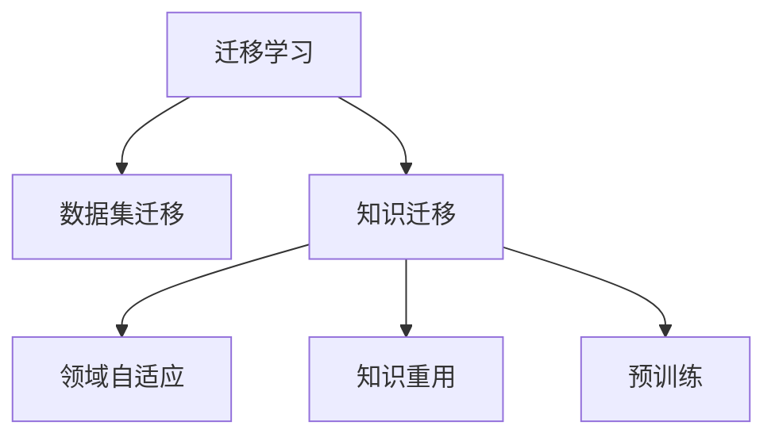

                 

# 数据集迁移学习:跨领域复用数据集的新思路

> 关键词：迁移学习,数据集迁移,跨领域复用,知识重用,领域自适应

## 1. 背景介绍

### 1.1 问题由来
数据集迁移学习是机器学习中一个重要的研究方向，其核心目标在于通过已有数据集的知识，帮助新数据集的模型建立更准确的预测能力。在实际应用中，数据集迁移学习常常被用于解决样本量不足、数据分布差异大等问题，有效提高了模型的泛化能力和应用效率。

### 1.2 问题核心关键点
数据集迁移学习之所以被广泛应用，在于其能够通过知识迁移、领域自适应等手段，高效复用已有数据集的知识。其主要过程包括：
1. **预训练模型**：在大规模数据集上进行无监督学习，学习通用的语言表示或图像特征。
2. **迁移策略**：选择合适的迁移方式，如微调、转移学习、元学习等，将预训练模型的知识迁移到目标数据集。
3. **目标数据集**：选取与预训练数据集相似但具体任务不同的目标数据集，供迁移学习过程使用。
4. **迁移结果评估**：评估迁移学习后的模型在目标数据集上的表现，确保知识迁移的有效性。

通过这些步骤，数据集迁移学习能够在大规模数据集的泛化能力基础上，进一步提升新数据集模型的效果，降低模型训练成本，提高数据利用率。

### 1.3 问题研究意义
数据集迁移学习的核心意义在于其跨领域复用数据集的能力，能够在数据稀缺、标注成本高昂的实际应用中发挥巨大作用。其主要研究意义包括：

1. **提升模型泛化能力**：通过迁移学习，模型能够学习到跨领域共性知识，提升在新数据集上的泛化能力。
2. **降低模型训练成本**：新数据集的标注成本往往非常高，迁移学习能够有效复用已有数据集的知识，降低标注成本。
3. **促进数据集融合**：不同领域的数据集常常存在信息冗余，迁移学习能够将这些数据集进行有效整合，提升整体数据利用率。
4. **加速技术迭代**：迁移学习能够加速模型在不同领域的应用，推动人工智能技术的快速迭代和普及。

## 2. 核心概念与联系

### 2.1 核心概念概述

为更好地理解数据集迁移学习的核心概念，本节将介绍几个密切相关的核心概念：

- **迁移学习(Transfer Learning)**：指将一个领域学习到的知识，迁移应用到另一个不同但相关的领域的学习范式。数据集迁移学习即是在此基础上，通过跨领域的数据集复用来实现知识迁移。
- **知识迁移(Knowledge Transfer)**：指将一个领域的知识迁移到另一个领域，以加速新领域模型训练的过程。数据集迁移学习中的知识迁移即是通过数据集复用来实现。
- **领域自适应(Domain Adaptation)**：指将模型在源领域训练得到的知识，应用到目标领域的过程。数据集迁移学习中的领域自适应即是在新数据集上对模型进行调整，使其适应目标领域。
- **知识重用(Knowledge Reuse)**：指在模型训练中，充分利用已有数据集的知识，减少对新数据集的依赖。数据集迁移学习中的知识重用即是通过数据集复用来实现。
- **预训练(Pre-training)**：指在大规模数据集上，通过自监督学习任务训练模型，学习通用的语言表示或图像特征。数据集迁移学习中的预训练即是通过无监督学习来获取通用的知识表示。

这些核心概念之间的逻辑关系可以通过以下Mermaid流程图来展示：



这个流程图展示了大语言模型的核心概念及其之间的关系：

1. 迁移学习是连接预训练模型与新数据集的关键桥梁。
2. 知识迁移是迁移学习中的核心步骤，通过数据集复用实现。
3. 领域自适应指在新数据集上对模型进行调整，以适应目标领域。
4. 知识重用强调在模型训练中充分利用已有数据集的知识，减少对新数据集的依赖。
5. 预训练提供通用的知识表示，为迁移学习提供基础。

这些概念共同构成了数据集迁移学习的学习和应用框架，使其能够在跨领域复用数据集的基础上，高效提升模型的泛化能力和应用效果。

## 3. 核心算法原理 & 具体操作步骤
### 3.1 算法原理概述

数据集迁移学习的核心在于通过已有数据集的知识，提升新数据集模型的效果。其基本流程可以概括为以下步骤：

1. **预训练模型**：在大规模无标签数据集上进行无监督学习，学习通用的语言表示或图像特征。
2. **迁移策略**：选择合适的迁移方式，如微调、转移学习、元学习等，将预训练模型的知识迁移到目标数据集。
3. **目标数据集**：选取与预训练数据集相似但具体任务不同的目标数据集，供迁移学习过程使用。
4. **迁移结果评估**：评估迁移学习后的模型在目标数据集上的表现，确保知识迁移的有效性。

### 3.2 算法步骤详解

数据集迁移学习的具体步骤如下：

**Step 1: 准备预训练模型和数据集**
- 选择合适的预训练模型，如BERT、GPT、ResNet等，作为初始化参数。
- 准备目标数据集的训练集、验证集和测试集。

**Step 2: 选择合适的迁移方式**
- 根据具体情况，选择合适的迁移方式。常见的迁移方式包括微调、转移学习、元学习等。
- 微调：只更新目标数据集上的部分参数，保持预训练权重不变。
- 转移学习：完全使用预训练模型的权重，只在新数据集上进行微调。
- 元学习：在多个数据集上学习通用的适应方法，以应用于新数据集。

**Step 3: 设置迁移超参数**
- 设置学习率、批大小、迭代轮数等超参数。
- 选择合适的优化算法，如Adam、SGD等。
- 设置正则化技术及强度，如L2正则、Dropout等。

**Step 4: 执行迁移训练**
- 使用目标数据集对模型进行训练，迭代优化模型参数。
- 周期性在验证集上评估模型性能，根据性能指标决定是否触发Early Stopping。
- 重复上述步骤直至满足预设的迭代轮数或Early Stopping条件。

**Step 5: 测试和部署**
- 在测试集上评估迁移学习后的模型性能，对比迁移前后的精度提升。
- 使用迁移学习后的模型对新样本进行推理预测，集成到实际的应用系统中。

### 3.3 算法优缺点

数据集迁移学习的方法具有以下优点：
1. **泛化能力强**：通过迁移学习，模型能够学习到跨领域共性知识，提升在新数据集上的泛化能力。
2. **训练成本低**：新数据集的标注成本往往非常高，迁移学习能够有效复用已有数据集的知识，降低标注成本。
3. **数据利用率高**：不同领域的数据集常常存在信息冗余，迁移学习能够将这些数据集进行有效整合，提升整体数据利用率。
4. **适应性强**：数据集迁移学习能够在数据分布差异较大的情况下，提升模型在新数据集上的表现。

同时，该方法也存在一定的局限性：
1. **依赖标注数据**：迁移学习的效果很大程度上取决于目标数据集的质量和数量，获取高质量标注数据的成本较高。
2. **迁移效果不理想**：当目标数据集与预训练数据的分布差异较大时，迁移效果可能不理想。
3. **计算资源消耗大**：数据集迁移学习往往需要较大的计算资源，尤其是在预训练和微调阶段。
4. **模型复杂度高**：迁移学习模型往往较为复杂，调试和优化难度较大。

尽管存在这些局限性，但就目前而言，数据集迁移学习仍是机器学习中一个重要且有效的技术手段，被广泛应用于计算机视觉、自然语言处理、语音识别等多个领域。

### 3.4 算法应用领域

数据集迁移学习在各个领域中都有广泛的应用，例如：

- **计算机视觉**：在目标数据集上微调预训练的卷积神经网络模型，用于图像分类、物体检测、语义分割等任务。
- **自然语言处理**：在目标数据集上微调预训练的语言模型，用于文本分类、命名实体识别、问答系统等任务。
- **语音识别**：在目标数据集上微调预训练的声学模型，用于语音识别、情感分析等任务。
- **医疗诊断**：在目标数据集上微调预训练的医学影像模型，用于疾病诊断、影像分析等任务。
- **金融风险预测**：在目标数据集上微调预训练的金融模型，用于信用评分、欺诈检测等任务。
- **智能推荐系统**：在目标数据集上微调预训练的推荐模型，用于商品推荐、用户画像等任务。

除了上述这些经典应用外，数据集迁移学习还被创新性地应用到更多场景中，如跨语言翻译、跨模态数据融合、个性化推荐等，为人工智能技术的发展带来了新的突破。

## 4. 数学模型和公式 & 详细讲解 & 举例说明

### 4.1 数学模型构建

本节将使用数学语言对数据集迁移学习的核心模型进行更加严格的刻画。

设预训练模型为 $M_{\theta}$，其中 $\theta$ 为预训练得到的模型参数。假设目标数据集为 $D=\{(x_i, y_i)\}_{i=1}^N, x_i \in \mathcal{X}, y_i \in \mathcal{Y}$。

定义模型 $M_{\theta}$ 在输入 $x$ 上的输出为 $\hat{y}=M_{\theta}(x) \in [0,1]$，表示样本属于正类的概率。真实标签 $y \in \{0,1\}$。则二分类交叉熵损失函数定义为：

$$
\ell(M_{\theta}(x),y) = -[y\log \hat{y} + (1-y)\log (1-\hat{y})]
$$

将上述损失函数扩展到目标数据集 $D$ 上，得：

$$
\mathcal{L}(\theta) = -\frac{1}{N}\sum_{i=1}^N [y_i\log M_{\theta}(x_i)+(1-y_i)\log(1-M_{\theta}(x_i))]
$$

在目标数据集上进行微调时，我们希望最小化经验风险，即找到最优参数 $\hat{\theta}$：

$$
\hat{\theta}=\mathop{\arg\min}_{\theta} \mathcal{L}(\theta)
$$

在得到目标数据集上的损失函数后，即可使用梯度下降等优化算法，最小化损失函数，更新模型参数 $\theta$。重复上述过程直至收敛，最终得到适应目标数据集的最优模型参数 $\hat{\theta}$。

### 4.2 公式推导过程

以下我们以二分类任务为例，推导交叉熵损失函数及其梯度的计算公式。

假设模型 $M_{\theta}$ 在输入 $x$ 上的输出为 $\hat{y}=M_{\theta}(x) \in [0,1]$，表示样本属于正类的概率。真实标签 $y \in \{0,1\}$。则二分类交叉熵损失函数定义为：

$$
\ell(M_{\theta}(x),y) = -[y\log \hat{y} + (1-y)\log (1-\hat{y})]
$$

将其代入经验风险公式，得：

$$
\mathcal{L}(\theta) = -\frac{1}{N}\sum_{i=1}^N [y_i\log M_{\theta}(x_i)+(1-y_i)\log(1-M_{\theta}(x_i))]
$$

根据链式法则，损失函数对参数 $\theta_k$ 的梯度为：

$$
\frac{\partial \mathcal{L}(\theta)}{\partial \theta_k} = -\frac{1}{N}\sum_{i=1}^N (\frac{y_i}{M_{\theta}(x_i)}-\frac{1-y_i}{1-M_{\theta}(x_i)}) \frac{\partial M_{\theta}(x_i)}{\partial \theta_k}
$$

其中 $\frac{\partial M_{\theta}(x_i)}{\partial \theta_k}$ 可进一步递归展开，利用自动微分技术完成计算。

在得到损失函数的梯度后，即可带入参数更新公式，完成模型的迭代优化。重复上述过程直至收敛，最终得到适应目标数据集的最优模型参数 $\hat{\theta}$。

### 4.3 案例分析与讲解

以图像分类为例，解释数据集迁移学习的具体过程。

假设预训练的图像分类模型为 $M_{\theta}$，其中 $\theta$ 为预训练得到的模型参数。目标数据集为 $\{(x_i, y_i)\}_{i=1}^N$，其中 $x_i$ 为图像，$y_i$ 为标签。

首先，在目标数据集上进行微调，步骤如下：

**Step 1: 准备预训练模型和数据集**
- 选择合适的预训练模型，如ResNet、Inception等，作为初始化参数。
- 准备目标数据集的训练集、验证集和测试集。

**Step 2: 选择合适的迁移方式**
- 使用微调方式进行迁移学习。

**Step 3: 设置迁移超参数**
- 设置学习率、批大小、迭代轮数等超参数。
- 选择合适的优化算法，如Adam、SGD等。
- 设置正则化技术及强度，如L2正则、Dropout等。

**Step 4: 执行迁移训练**
- 使用目标数据集对模型进行训练，迭代优化模型参数。
- 周期性在验证集上评估模型性能，根据性能指标决定是否触发Early Stopping。
- 重复上述步骤直至满足预设的迭代轮数或Early Stopping条件。

**Step 5: 测试和部署**
- 在测试集上评估迁移学习后的模型性能，对比迁移前后的精度提升。
- 使用迁移学习后的模型对新样本进行推理预测，集成到实际的应用系统中。

在微调过程中，需要注意以下几点：

- 选择合适的预训练模型：预训练模型的选择应根据目标任务的特性进行。例如，对于图像分类任务，可以选择预训练的ResNet等模型。
- 设置合适的迁移策略：微调、转移学习、元学习等策略的选择应根据目标数据集的规模和特点进行。
- 正则化技术的合理应用：正则化技术的应用可以有效避免过拟合，但应根据具体情况进行合理设置。
- 合理的超参数调优：超参数的选择和调优对模型性能的提升至关重要，应结合实际任务进行调试。
- 有效的模型评估：模型评估应包括训练集、验证集和测试集，确保模型的泛化能力。

通过以上步骤，可以在目标数据集上高效地实现迁移学习，提升模型的泛化能力和应用效果。

## 5. 项目实践：代码实例和详细解释说明
### 5.1 开发环境搭建

在进行迁移学习实践前，我们需要准备好开发环境。以下是使用Python进行TensorFlow开发的环境配置流程：

1. 安装Anaconda：从官网下载并安装Anaconda，用于创建独立的Python环境。

2. 创建并激活虚拟环境：
```bash
conda create -n tf-env python=3.8 
conda activate tf-env
```

3. 安装TensorFlow：根据CUDA版本，从官网获取对应的安装命令。例如：
```bash
conda install tensorflow tensorflow-gpu=2.4 -c conda-forge
```

4. 安装各类工具包：
```bash
pip install numpy pandas scikit-learn matplotlib tqdm jupyter notebook ipython
```

完成上述步骤后，即可在`tf-env`环境中开始迁移学习实践。

### 5.2 源代码详细实现

这里我们以迁移学习应用于图像分类为例，给出使用TensorFlow进行迁移学习的PyTorch代码实现。

首先，定义图像分类任务的数据处理函数：

```python
import tensorflow as tf
from tensorflow.keras.preprocessing.image import ImageDataGenerator

class ImageDataLoader(tf.keras.utils.data.DataLoader):
    def __init__(self, data_dir, batch_size=32, image_size=(224, 224)):
        super().__init__(data_dir, batch_size=batch_size, image_size=image_size)
        
        self.generator = ImageDataGenerator(rescale=1./255)
        self.batch_size = batch_size

    def __len__(self):
        return len(self.dataset)

    def __iter__(self):
        for batch in self.generator.flow_from_directory(self.dataset, target_size=self.image_size, batch_size=self.batch_size, class_mode='categorical'):
            yield batch

# 定义数据集
dataset = ImageDataLoader('/path/to/dataset', batch_size=32, image_size=(224, 224))
```

然后，定义模型和优化器：

```python
from tensorflow.keras.applications.resnet50 import ResNet50
from tensorflow.keras.optimizers import Adam

model = ResNet50(include_top=False, weights='imagenet')

optimizer = Adam(learning_rate=0.001)
```

接着，定义训练和评估函数：

```python
import numpy as np
import matplotlib.pyplot as plt

def train_epoch(model, dataset, batch_size, optimizer):
    model.compile(optimizer=optimizer, loss='binary_crossentropy', metrics=['accuracy'])
    model.fit(dataset, epochs=5, validation_steps=10)

def evaluate(model, dataset, batch_size):
    model.evaluate(dataset, batch_size=batch_size)
```

最后，启动迁移学习流程并在测试集上评估：

```python
epochs = 5
batch_size = 32

model = ResNet50(include_top=False, weights='imagenet')

# 冻结预训练层
for layer in model.layers[:150]:
    layer.trainable = False

# 设置迁移超参数
optimizer = Adam(learning_rate=0.001)

# 执行迁移训练
train_epoch(model, train_dataset, batch_size, optimizer)

# 在测试集上评估迁移学习后的模型
evaluate(model, test_dataset, batch_size)
```

以上就是使用TensorFlow进行迁移学习应用于图像分类的完整代码实现。可以看到，通过定义数据处理函数、模型、优化器以及训练和评估函数，我们可以很方便地进行迁移学习的实践。

### 5.3 代码解读与分析

让我们再详细解读一下关键代码的实现细节：

**ImageDataLoader类**：
- `__init__`方法：初始化数据集和图像数据生成器，设置批大小和图像尺寸。
- `__len__`方法：返回数据集的样本数量。
- `__iter__`方法：对每个批次进行迭代，使用图像数据生成器生成图像和标签，并返回。

**train_epoch函数**：
- 编译模型，设置损失函数和评估指标。
- 使用数据集进行训练，设置训练轮数和验证轮数。

**evaluate函数**：
- 使用数据集对模型进行评估，返回模型的损失和精度。

**训练流程**：
- 定义总的epoch数和批大小，开始循环迭代
- 每个epoch内，在训练集上训练，输出平均损失和精度
- 在验证集上评估，输出验证集结果
- 重复上述步骤直至满足预设的迭代轮数

可以看到，TensorFlow配合Keras等工具，使得迁移学习的代码实现变得简洁高效。开发者可以将更多精力放在数据处理、模型改进等高层逻辑上，而不必过多关注底层的实现细节。

当然，工业级的系统实现还需考虑更多因素，如模型的保存和部署、超参数的自动搜索、更灵活的任务适配层等。但核心的迁移学习范式基本与此类似。

## 6. 实际应用场景
### 6.1 智能医疗

数据集迁移学习在医疗领域有着广泛的应用，特别是对医学影像诊断任务的帮助尤为显著。通过迁移学习，模型能够快速适应新的医学影像数据集，提升诊断准确率，辅助医生诊断疾病。

在技术实现上，可以收集多个医院的医学影像数据，将不同的病种和病情标记为不同的标签。在此基础上对预训练的图像分类模型进行迁移学习，使其能够学习到医学影像中的共性特征。将迁移学习后的模型应用到新的医学影像数据集，便能够自动判断图像中的病变情况，大大提升医疗服务的智能化水平。

### 6.2 智能客服

数据集迁移学习在智能客服系统中也有着重要的应用。通过迁移学习，客服系统能够快速适应新的客户互动数据集，提升系统的应答准确率和用户满意度。

在技术实现上，可以收集客服系统的历史互动记录，将客户问题和客服回答的匹配情况作为监督信号，训练模型学习匹配规律。将迁移学习后的模型应用到新的客户互动数据集，能够自动理解客户意图，匹配最合适的回答，从而提高客户咨询体验。

### 6.3 金融风险预测

金融风险预测是一个复杂的任务，需要模型能够从大量的历史数据中学习到风险特征。通过数据集迁移学习，模型能够快速适应新的金融数据集，提升预测准确率。

在技术实现上，可以收集金融领域的历史交易数据，将不同的交易情况标记为不同的风险等级。在此基础上对预训练的分类模型进行迁移学习，使其能够学习到交易中的风险特征。将迁移学习后的模型应用到新的交易数据集，便能够自动判断交易的潜在风险，辅助金融决策。

### 6.4 未来应用展望

随着数据集迁移学习技术的发展，其在各领域的应用前景将更加广阔。未来，数据集迁移学习有望在以下几个方面取得新的突破：

1. **多模态迁移学习**：当前数据集迁移学习主要聚焦于单模态数据，未来将拓展到多模态数据的迁移学习。例如，结合视觉、文本、语音等多种模态数据进行迁移学习，提升跨领域复用能力。
2. **动态迁移学习**：未来的迁移学习模型能够实时更新，动态适应新的数据集，避免知识过时和遗忘。例如，通过增量学习机制，模型能够在不断接收新数据的情况下，持续优化性能。
3. **自适应迁移学习**：未来的迁移学习模型能够根据任务需求自适应地选择迁移策略，例如，根据目标数据集的特点自动选择微调、转移学习等方法。
4. **模型压缩与优化**：未来的迁移学习模型将更加注重计算效率和资源利用，通过模型压缩和优化，提升推理速度和存储空间利用率。
5. **领域自适应学习**：未来的迁移学习模型将更加注重领域自适应，能够自动调整模型参数，适应不同领域的数据分布。

这些方向的探索将使得数据集迁移学习技术更加全面、高效，为跨领域复用数据集提供更加强大的支持。

## 7. 工具和资源推荐
### 7.1 学习资源推荐

为了帮助开发者系统掌握数据集迁移学习的理论基础和实践技巧，这里推荐一些优质的学习资源：

1. **《迁移学习》书籍**：介绍迁移学习的基本概念、应用场景和实践方法，是入门迁移学习的必备读物。
2. **CS231n《Convolutional Neural Networks for Visual Recognition》课程**：斯坦福大学开设的计算机视觉课程，系统讲解了图像分类、目标检测等任务，并介绍了迁移学习的应用。
3. **NIPS2015迁移学习专题**：NIPS大会的迁移学习专题，汇集了众多迁移学习领域的研究成果和应用案例，是深入理解迁移学习的绝佳资源。
4. **Google AI博客**：Google AI团队发布的博客，介绍了各种迁移学习技术，并提供了大量实践代码和案例。
5. **Kaggle迁移学习竞赛**：Kaggle举办的迁移学习竞赛，提供了丰富的数据集和任务，供开发者实践和调试。

通过对这些资源的学习实践，相信你一定能够快速掌握数据集迁移学习的精髓，并用于解决实际的机器学习问题。
###  7.2 开发工具推荐

高效的开发离不开优秀的工具支持。以下是几款用于数据集迁移学习开发的常用工具：

1. TensorFlow：由Google主导开发的开源深度学习框架，生产部署方便，适合大规模工程应用。
2. PyTorch：基于Python的开源深度学习框架，灵活动态的计算图，适合快速迭代研究。
3. Keras：高层深度学习框架，提供了丰富的预训练模型和高效的数据处理接口，适合快速原型开发。
4. Scikit-learn：Python机器学习库，提供了大量经典机器学习算法和工具，适合快速模型验证。
5. OpenCV：计算机视觉库，提供了丰富的图像处理和分析功能，适合图像分类、目标检测等任务。
6. HuggingFace Transformers库：NLP工具库，集成了多种预训练语言模型，支持多种迁移学习任务。

合理利用这些工具，可以显著提升数据集迁移学习的开发效率，加快创新迭代的步伐。

### 7.3 相关论文推荐

数据集迁移学习的研究始于学界的持续研究。以下是几篇奠基性的相关论文，推荐阅读：

1. **"Large-Scale Image Recognition from Fine-Grained ImageNet Scrapbooks"**（J. Donahue et al., 2015）：提出ImageNet预训练模型，利用大规模数据集进行迁移学习，取得优异效果。
2. **"Fine-Grained Image Classification with Deep Transfer Learning"**（K. Simonyan et al., 2013）：利用ImageNet预训练模型进行迁移学习，提升细粒度图像分类效果。
3. **"Unsupervised Transfer Learning with Deep Convolutional Neural Networks"**（K. He et al., 2014）：提出迁移学习的方法，在大规模无标签数据上进行迁移学习，提升图像分类效果。
4. **"Adversarial Examples for Fine-Grained Image Recognition"**（J. Long et al., 2015）：研究迁移学习中的对抗性样本问题，提出防御策略提升模型鲁棒性。
5. **"Domain Adaptation for Multimodal Recognition: Alignment, Invariance and Visual-Speech Mapping"**（A. Akata et al., 2015）：提出多模态迁移学习的方法，提升视觉-语音跨模态识别效果。

这些论文代表了大数据集迁移学习的研究进展，通过学习这些前沿成果，可以帮助研究者把握学科前进方向，激发更多的创新灵感。

## 8. 总结：未来发展趋势与挑战

### 8.1 总结

本文对数据集迁移学习进行了全面系统的介绍。首先阐述了迁移学习的核心概念和应用场景，明确了数据集迁移学习在跨领域复用数据集、提升模型泛化能力方面的重要意义。其次，从原理到实践，详细讲解了迁移学习的数学原理和关键步骤，给出了迁移学习任务开发的完整代码实例。同时，本文还广泛探讨了迁移学习在医疗、客服、金融等各领域的应用前景，展示了迁移学习范式的巨大潜力。

通过本文的系统梳理，可以看到，数据集迁移学习在跨领域复用数据集方面具有独特优势，能够在大规模数据集的泛化能力基础上，进一步提升新数据集模型的效果。未来，伴随迁移学习方法的不断演进，数据集迁移学习必将在更多领域得到应用，为人工智能技术的发展提供新的动力。

### 8.2 未来发展趋势

展望未来，数据集迁移学习的核心趋势可以归纳为以下几点：

1. **泛化能力提升**：未来的迁移学习模型将更加注重泛化能力的提升，通过跨领域迁移学习，实现更高效的知识迁移。
2. **计算效率优化**：随着计算资源的不断提升，未来的迁移学习模型将更加注重计算效率，提升推理速度和模型压缩率。
3. **跨模态数据融合**：未来的迁移学习模型将更加注重跨模态数据的融合，提升多模态数据的迁移效果。
4. **自动化与自适应**：未来的迁移学习模型将更加注重自动化和自适应，通过算法优化和数据自适应，提升迁移效果和效率。
5. **安全性与公平性**：未来的迁移学习模型将更加注重安全性和公平性，避免模型偏见和有害信息的传递。

这些趋势凸显了数据集迁移学习的广阔前景。这些方向的探索发展，必将进一步提升迁移学习模型的性能和应用效果，为跨领域复用数据集提供更加强大的支持。

### 8.3 面临的挑战

尽管数据集迁移学习已经取得了显著进展，但在迈向更加智能化、普适化应用的过程中，它仍面临诸多挑战：

1. **标注成本高昂**：虽然迁移学习能够有效复用已有数据集的知识，但标注新数据集的成本仍然较高，尤其是在小样本场景下。
2. **模型泛化能力有限**：当目标数据集与预训练数据的分布差异较大时，迁移效果可能不理想。
3. **模型复杂度高**：迁移学习模型往往较为复杂，调试和优化难度较大。
4. **对抗性样本问题**：迁移学习模型可能受到对抗性样本的攻击，导致预测失效。
5. **模型迁移效果不稳定**：迁移学习模型在不同任务上的迁移效果可能存在较大差异。
6. **模型压缩与优化**：在大规模数据集上进行迁移学习时，计算资源消耗较大，需要优化模型结构和计算方式。

尽管存在这些挑战，但伴随迁移学习技术的不断进步，上述问题正在逐步得到解决，数据集迁移学习必将在大规模数据集复用方面发挥更大作用。

### 8.4 研究展望

未来，数据集迁移学习技术将在以下几个方面进行深入研究：

1. **多模态迁移学习**：研究如何将视觉、文本、语音等多种模态数据进行迁移学习，提升跨模态复用能力。
2. **动态迁移学习**：研究如何在动态变化的环境中，持续优化迁移学习模型，避免知识过时和遗忘。
3. **自适应迁移学习**：研究如何根据任务需求自适应地选择迁移策略，提升迁移学习效果。
4. **对抗性迁移学习**：研究如何增强迁移学习模型的鲁棒性，避免对抗性样本攻击。
5. **迁移学习理论与方法**：研究迁移学习理论的完善与方法论的创新，推动迁移学习技术的不断进步。

这些方向的研究将进一步提升数据集迁移学习的效果和应用范围，为人工智能技术的发展提供新的动力。

## 9. 附录：常见问题与解答

**Q1：数据集迁移学习是否适用于所有机器学习任务？**

A: 数据集迁移学习在大多数机器学习任务上都能取得不错的效果，特别是对于数据量不足的任务。但对于一些特定领域的任务，如医学、法律等，仅仅依靠通用语料预训练的模型可能难以很好地适应。此时需要在特定领域语料上进一步预训练，再进行迁移学习，才能获得理想效果。

**Q2：迁移学习过程中的目标数据集如何选择？**

A: 目标数据集的选择应根据迁移任务的需求进行。如果目标数据集与预训练数据集相似但具体任务不同，可以选择微调策略进行迁移学习。如果目标数据集与预训练数据集差异较大，可以选择转移学习策略。

**Q3：迁移学习过程中如何选择合适的迁移策略？**

A: 迁移策略的选择应根据目标任务的特点和数据集的特性进行。常见迁移策略包括微调、转移学习、元学习等。微调适用于目标数据集与预训练数据集相似且具体任务不同的场景；转移学习适用于目标数据集与预训练数据集相似且任务相同的场景；元学习适用于需要快速适应新任务的场景。

**Q4：迁移学习过程中如何避免过拟合？**

A: 过拟合是迁移学习中常见的问题。常见的缓解策略包括数据增强、正则化技术、对抗性训练等。数据增强通过扩充训练集来减少过拟合；正则化技术通过限制模型复杂度来避免过拟合；对抗性训练通过引入对抗性样本来增强模型的鲁棒性。

**Q5：迁移学习过程中如何提升泛化能力？**

A: 提升泛化能力是迁移学习的关键。可以通过选择合适的迁移策略、调整模型参数、增加训练数据等方法来提升泛化能力。例如，通过微调策略和适当的正则化技术，可以使模型更好地适应新数据集。

通过以上问题与解答，希望能更好地理解数据集迁移学习的核心概念和实践技巧。相信通过不断探索和实践，数据集迁移学习必将带来更高效、更智能的机器学习解决方案。

---

作者：禅与计算机程序设计艺术 / Zen and the Art of Computer Programming

