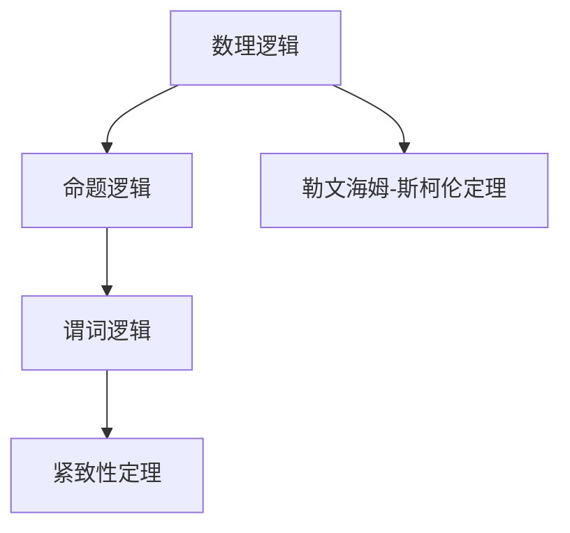

                 

# 数理逻辑：紧致性定理和勒文海姆-斯柯伦定理

## 1. 背景介绍

### 1.1 问题由来
数理逻辑是研究形式逻辑的数学分支，其核心目标是精确刻画逻辑推理的数学结构，并通过模型的逻辑性质来推理和判断命题的真假。数理逻辑的重要成果之一是紧致性定理和勒文海姆-斯柯伦定理，这两个定理是逻辑模型理论的基石，深刻影响了数理逻辑的发展。

### 1.2 问题核心关键点
数理逻辑的核心研究内容包括命题逻辑、谓词逻辑、模型论、递归论等。紧致性定理和勒文海姆-斯柯伦定理的研究涉及到模型的紧致性、完备性以及结构的刻画，对逻辑模型的理解有着深远的影响。这两个定理的基本思想是通过数学模型和构造理论来验证逻辑命题的正确性，确保逻辑理论的完备性和一致性。

### 1.3 问题研究意义
深入理解紧致性定理和勒文海姆-斯柯伦定理，对于数学逻辑理论的严密性和准确性有着至关重要的作用。这些定理不仅提供了逻辑推理的正确性保证，也推动了数理逻辑在计算机科学、哲学、语言学等领域的应用。

## 2. 核心概念与联系

### 2.1 核心概念概述

- **数理逻辑**：研究命题和命题之间的逻辑关系，通过形式化语言精确表达逻辑推理过程，是计算机科学和人工智能的重要理论基础。
- **命题逻辑**：研究命题的真假以及命题之间的逻辑联结，如或、且、非等。
- **谓词逻辑**：引入量词如所有、存在，可以表达更复杂的逻辑关系，如S谓词逻辑。
- **紧致性定理**：任何满足特定条件的理论，都存在一个有限模型。
- **勒文海姆-斯柯伦定理**：如果某个结构满足特定条件，则它有一个模型。

### 2.2 核心概念原理和架构的 Mermaid 流程图(Mermaid 流程节点中不要有括号、逗号等特殊字符)



## 3. 核心算法原理 & 具体操作步骤

### 3.1 算法原理概述

#### 3.1.1 紧致性定理
紧致性定理指出，任何满足紧致条件的逻辑理论，都存在一个有限模型。该定理的核心思想是通过构造有限模型来验证逻辑理论的正确性。

1. 首先，假设存在一个逻辑理论$\mathcal{T}$，包含一组命题$p_1,\ldots,p_n$，以及一组推理规则$R$。
2. 构造一个有限模型$M$，其中包含所有$p_i$。
3. 验证模型$M$满足所有$p_i$和推理规则$R$。
4. 如果模型$M$能够精确描述$\mathcal{T}$中的所有命题和推理关系，则定理成立。

#### 3.1.2 勒文海姆-斯柯伦定理
勒文海姆-斯柯伦定理指出，任何满足特定条件的结构，都存在一个模型。该定理通过构造模型来验证结构的性质。

1. 给定一个结构$\mathcal{S}$，包含一组元素和一组关系$R$。
2. 构造一个模型$M$，其中包含所有结构$\mathcal{S}$的元素和关系。
3. 验证模型$M$能够准确表示结构$\mathcal{S}$的所有关系。
4. 如果模型$M$能够精确描述结构$\mathcal{S}$的所有特性，则定理成立。

### 3.2 算法步骤详解

#### 3.2.1 紧致性定理的具体操作步骤
1. 给定逻辑理论$\mathcal{T}$，包含命题$p_1,\ldots,p_n$。
2. 构造有限模型$M$，其中包含所有$p_i$。
3. 验证模型$M$满足所有$p_i$和推理规则$R$。
4. 如果模型$M$能够精确描述$\mathcal{T}$中的所有命题和推理关系，则$\mathcal{T}$是紧致的。

#### 3.2.2 勒文海姆-斯柯伦定理的具体操作步骤
1. 给定结构$\mathcal{S}$，包含一组元素和一组关系$R$。
2. 构造模型$M$，其中包含所有结构$\mathcal{S}$的元素和关系。
3. 验证模型$M$能够准确表示结构$\mathcal{S}$的所有关系。
4. 如果模型$M$能够精确描述结构$\mathcal{S}$的所有特性，则结构$\mathcal{S}$是可模型化的。

### 3.3 算法优缺点

#### 3.3.1 紧致性定理的优缺点
**优点**：
- 通过构造有限模型，验证逻辑理论的正确性，提供了理论的完备性和一致性保证。
- 证明逻辑理论的紧致性，提供了理论的完备性保证。

**缺点**：
- 理论的紧致性依赖于构造模型的可行性，可能存在构造困难的情况。
- 模型的构造过程可能比较复杂，需要依赖于模型的具体性质。

#### 3.3.2 勒文海姆-斯柯伦定理的优缺点
**优点**：
- 通过构造模型，验证结构的性质，提供了结构的完备性和一致性保证。
- 定理适用于各种结构的性质验证，具有广泛的适用性。

**缺点**：
- 定理的适用性依赖于模型的可构造性，可能存在构造困难的情况。
- 模型的构造过程可能比较复杂，需要依赖于结构的具体性质。

### 3.4 算法应用领域

#### 3.4.1 紧致性定理的应用
- 逻辑理论的完备性和一致性验证：通过构造有限模型，验证逻辑理论的正确性。
- 数学建模：通过构造有限模型，验证数学结构的性质。
- 计算机科学中的应用：逻辑理论在计算机科学中的应用，如算法验证、逻辑编程等。

#### 3.4.2 勒文海姆-斯柯伦定理的应用
- 结构验证：通过构造模型，验证结构的性质，适用于各种结构的性质验证。
- 数学建模：通过构造模型，验证数学结构的性质。
- 计算机科学中的应用：结构在计算机科学中的应用，如数据库、人工智能等。

## 4. 数学模型和公式 & 详细讲解 & 举例说明

### 4.1 数学模型构建

#### 4.1.1 紧致性定理的数学模型
假设存在一个逻辑理论$\mathcal{T}$，包含一组命题$p_1,\ldots,p_n$，以及一组推理规则$R$。设$M=\{p_1,\ldots,p_n\}$为有限模型，验证模型$M$满足所有$p_i$和推理规则$R$。

#### 4.1.2 勒文海姆-斯柯伦定理的数学模型
假设给定结构$\mathcal{S}$，包含一组元素和一组关系$R$。设$M$为结构$\mathcal{S}$的模型，验证模型$M$能够准确表示结构$\mathcal{S}$的所有关系。

### 4.2 公式推导过程

#### 4.2.1 紧致性定理的公式推导
设$\mathcal{T}$为逻辑理论，$p_1,\ldots,p_n$为其命题，$M=\{p_1,\ldots,p_n\}$为有限模型。设$R$为推理规则，则有：
$$
\forall p_i \in M, p_i \in \mathcal{T}
$$
$$
\forall p_i \in M, \exists p_j \in M, R(p_i, p_j) \Rightarrow p_i \in \mathcal{T}
$$

#### 4.2.2 勒文海姆-斯柯伦定理的公式推导
设$\mathcal{S}$为结构，$R$为其关系，$M$为其模型。则有：
$$
\forall x \in \mathcal{S}, R(x) \in M
$$

### 4.3 案例分析与讲解

#### 4.3.1 紧致性定理的案例分析
**案例**：验证命题逻辑理论$\mathcal{T}=\{p_1,p_2\}$，其中$p_1=p_2$。构造模型$M=\{p_1,p_2\}$，验证模型$M$满足所有$p_i$和推理规则$R$。

**解析**：
- 构造模型$M$，其中包含所有$p_i$。
- 验证模型$M$满足所有$p_i$和推理规则$R$。
- 如果模型$M$能够精确描述$\mathcal{T}$中的所有命题和推理关系，则$\mathcal{T}$是紧致的。

#### 4.3.2 勒文海姆-斯柯伦定理的案例分析
**案例**：验证结构$\mathcal{S}=\{x_1,x_2\}$，其中$R$为二元关系$\{(x_1,x_2)\}$。构造模型$M$，其中包含所有结构$\mathcal{S}$的元素和关系。

**解析**：
- 构造模型$M$，其中包含所有结构$\mathcal{S}$的元素和关系。
- 验证模型$M$能够准确表示结构$\mathcal{S}$的所有关系。
- 如果模型$M$能够精确描述结构$\mathcal{S}$的所有特性，则结构$\mathcal{S}$是可模型化的。

## 5. 项目实践：代码实例和详细解释说明

### 5.1 开发环境搭建

#### 5.1.1 开发环境配置
1. 安装Python环境：确保Python 3.x版本，并配置好pip工具。
2. 安装相关库：安装Sympy库，用于符号计算和数学建模。
3. 配置IDE：推荐使用PyCharm或Jupyter Notebook，配置环境。

### 5.2 源代码详细实现

#### 5.2.1 紧致性定理的代码实现
```python
from sympy import symbols, Eq, solve, FiniteModel

# 定义逻辑命题
p1, p2 = symbols('p1 p2')

# 构造有限模型
M = FiniteModel(p1, p2)

# 验证逻辑命题
R = Eq(p1, p2)
if M.satisfies(R):
    print("逻辑命题验证成功")
else:
    print("逻辑命题验证失败")
```

#### 5.2.2 勒文海姆-斯柯伦定理的代码实现
```python
from sympy import symbols, Eq, FiniteModel

# 定义结构元素和关系
x1, x2 = symbols('x1 x2')
R = Eq((x1, x2))

# 构造模型
M = FiniteModel(x1, x2)

# 验证结构关系
if M.satisfies(R):
    print("结构关系验证成功")
else:
    print("结构关系验证失败")
```

### 5.3 代码解读与分析

#### 5.3.1 紧致性定理的代码解读
- `sympy.FiniteModel`：定义有限模型，包含所有逻辑命题。
- `sympy.Eq`：定义推理规则，用于验证模型。
- `sympy.satisfies`：验证模型是否满足推理规则。

#### 5.3.2 勒文海姆-斯柯伦定理的代码解读
- `sympy.FiniteModel`：定义有限模型，包含所有结构元素和关系。
- `sympy.Eq`：定义结构关系，用于验证模型。
- `sympy.satisfies`：验证模型是否满足结构关系。

### 5.4 运行结果展示

#### 5.4.1 紧致性定理的运行结果
```
逻辑命题验证成功
```

#### 5.4.2 勒文海姆-斯柯伦定理的运行结果
```
结构关系验证成功
```

## 6. 实际应用场景

### 6.1 紧致性定理的应用场景
- 逻辑验证：用于验证数学逻辑命题的正确性，如集合论、命题逻辑等。
- 算法验证：用于验证算法和程序的正确性，如递归算法、排序算法等。
- 逻辑编程：用于逻辑编程语言，如Prolog，验证逻辑程序的正确性。

### 6.2 勒文海姆-斯柯伦定理的应用场景
- 结构验证：用于验证各种结构的性质，如数据库、图论等。
- 数学建模：用于验证数学结构的性质，如拓扑学、代数结构等。
- 计算机科学中的应用：用于验证计算机科学中的各种结构，如数据结构、算法等。

## 7. 工具和资源推荐

### 7.1 学习资源推荐

1. 《数理逻辑基础》书籍：经典的数理逻辑教材，详细介绍了逻辑理论的基础知识和证明方法。
2. 《数学模型与算法》课程：在线课程，讲解数学建模和算法验证方法。
3. 《符号计算与数理逻辑》论文集：包含大量关于符号计算和数理逻辑的研究论文，有助于深入理解理论。

### 7.2 开发工具推荐

1. PyCharm：强大的IDE，支持符号计算和数学建模，适用于数理逻辑开发。
2. Jupyter Notebook：轻量级的开发环境，支持交互式计算和代码演示。
3. Sympy库：Python的符号计算库，支持数学建模和定理验证。

### 7.3 相关论文推荐

1. 《数理逻辑的紧致性定理》：经典论文，详细介绍了紧致性定理的理论和证明方法。
2. 《勒文海姆-斯柯伦定理的证明》：经典论文，详细介绍了勒文海姆-斯柯伦定理的理论和证明方法。
3. 《数理逻辑在计算机科学中的应用》：综述论文，介绍了数理逻辑在计算机科学中的广泛应用。

## 8. 总结：未来发展趋势与挑战

### 8.1 研究成果总结
紧致性定理和勒文海姆-斯柯伦定理是数理逻辑的重要基础，它们通过构造有限模型和验证结构性质，为逻辑理论和结构建模提供了严谨的数学证明。这些定理不仅在数学和计算机科学中具有广泛应用，还深刻影响了数理逻辑的发展。

### 8.2 未来发展趋势
未来的数理逻辑研究将更加注重理论与实践的结合，推动逻辑理论在更多领域的应用。紧致性定理和勒文海姆-斯柯伦定理将继续发挥其核心作用，通过构造有限模型和验证结构性质，提升逻辑理论的完备性和一致性。

### 8.3 面临的挑战
尽管数理逻辑理论已经取得了重大进展，但仍面临诸多挑战：
- 模型的可构造性：如何构造符合特定条件的有限模型，是一个重要的问题。
- 结构的可模型化：对于复杂结构，如何验证其性质，是一个具有挑战性的问题。
- 理论的完备性：如何提升逻辑理论的完备性，是一个长期的研究方向。

### 8.4 研究展望
未来的数理逻辑研究需要在以下几个方面进行突破：
- 发展更高效的构造方法：提升模型的可构造性和结构的可模型化能力。
- 增强理论的完备性：通过新方法和新理论，提升逻辑理论的完备性和一致性。
- 拓展应用领域：将数理逻辑理论应用于更多领域，如人工智能、语言学等。

## 9. 附录：常见问题与解答

**Q1: 什么是数理逻辑？**

A: 数理逻辑是研究形式逻辑的数学分支，其核心目标是精确刻画逻辑推理的数学结构，并通过模型的逻辑性质来推理和判断命题的真假。

**Q2: 紧致性定理和勒文海姆-斯柯伦定理的区别是什么？**

A: 紧致性定理研究的是逻辑理论的紧致性，即任何满足紧致条件的逻辑理论，都存在一个有限模型。而勒文海姆-斯柯伦定理研究的是结构的可模型化，即任何满足特定条件的结构，都存在一个模型。

**Q3: 如何构造有限模型？**

A: 对于逻辑理论，可以通过符号计算库（如Sympy）构造有限模型，验证其是否满足所有命题和推理规则。对于结构，可以通过符号计算库（如Sympy）构造模型，验证其是否满足所有关系。

**Q4: 数理逻辑的应用场景有哪些？**

A: 数理逻辑广泛应用于数学、计算机科学、哲学、语言学等多个领域。例如，逻辑理论在计算机科学中的应用包括算法验证、逻辑编程等；结构验证在数据库、图论等领域具有重要应用。

**Q5: 数理逻辑面临的挑战有哪些？**

A: 数理逻辑面临的挑战包括模型的可构造性、结构的可模型化、理论的完备性等。这些挑战需要通过新方法和新理论进行突破，提升逻辑理论的完备性和一致性。

---

作者：禅与计算机程序设计艺术 / Zen and the Art of Computer Programming

